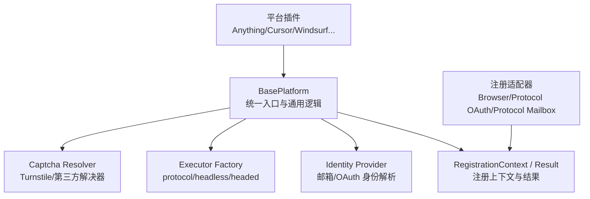
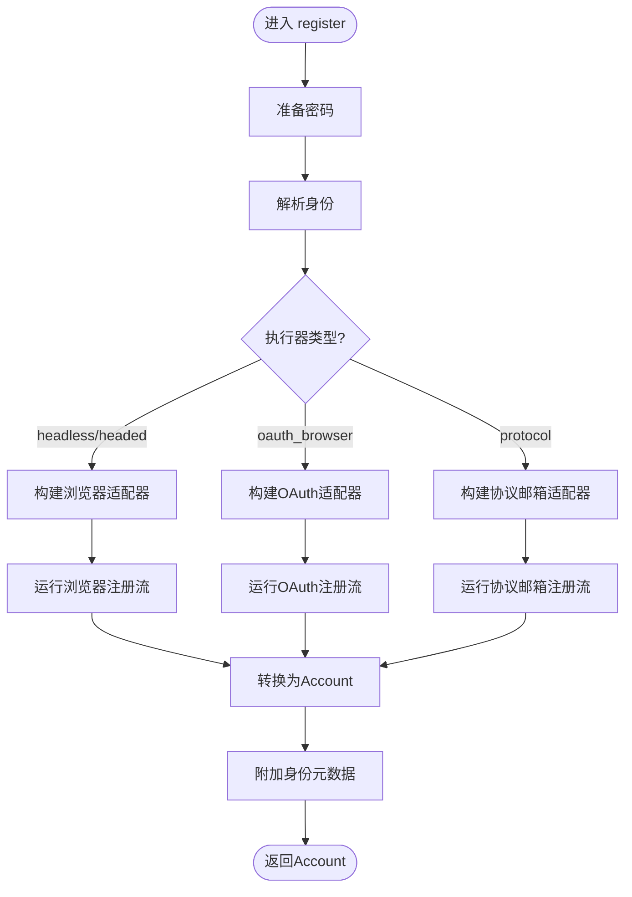
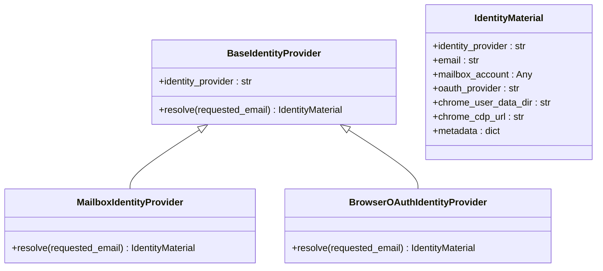
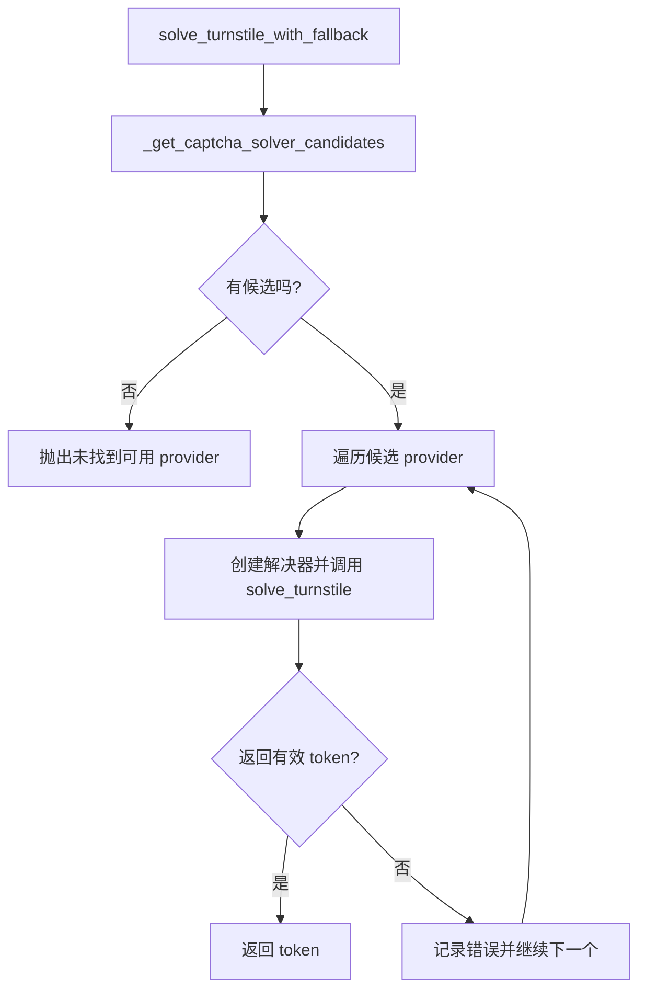
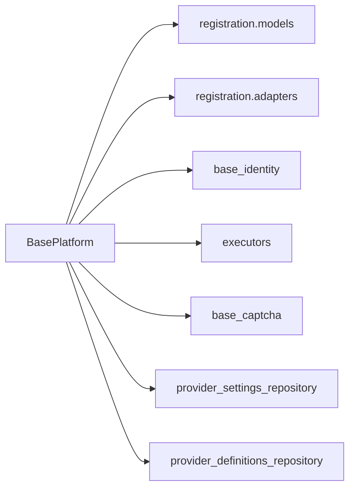

# BasePlatform基类设计

<cite>
**本文引用的文件**
- [core/base_platform.py](file://core/base_platform.py)
- [core/registration/models.py](file://core/registration/models.py)
- [core/registration/adapters.py](file://core/registration/adapters.py)
- [core/base_identity.py](file://core/base_identity.py)
- [platforms/anything/plugin.py](file://platforms/anything/plugin.py)
- [platforms/windsurf/plugin.py](file://platforms/windsurf/plugin.py)
</cite>

## 目录
1. [简介](#简介)
2. [项目结构](#项目结构)
3. [核心组件](#核心组件)
4. [架构总览](#架构总览)
5. [详细组件分析](#详细组件分析)
6. [依赖关系分析](#依赖关系分析)
7. [性能考虑](#性能考虑)
8. [故障排查指南](#故障排查指南)
9. [结论](#结论)
10. [附录：实现新平台适配器的最佳实践](#附录：实现新平台适配器的最佳实践)

## 简介
本文件围绕 BasePlatform 基类的核心设计理念与架构模式展开，重点解释抽象方法（如 check_valid、get_quota）的设计原则、统一接口规范如何确保不同平台的一致性；阐述 Account 与 RegisterConfig 数据模型的设计思路；详细说明生命周期管理方法（register、_make_executor、_make_captcha 等）的实现逻辑与执行流程；解释身份识别机制（_resolve_identity、_build_identity_snapshot）的工作原理；并提供具体示例路径，指导如何正确继承 BasePlatform 实现新的平台适配器。

## 项目结构
BasePlatform 位于 core/base_platform.py，作为所有平台插件的抽象基类，提供统一的注册、能力声明、执行器与验证码选择、身份解析与元数据附加等通用能力。平台相关的数据模型与流程定义位于 core/registration/models.py 与 adapters.py；身份提供者抽象位于 core/base_identity.py；各平台的具体实现以 plugin.py 形式挂载到框架中。

图表来源
- [core/base_platform.py:44-160](file://core/base_platform.py#L44-L160)
- [core/registration/models.py:17-66](file://core/registration/models.py#L17-L66)
- [core/registration/adapters.py:28-59](file://core/registration/adapters.py#L28-L59)
- [core/base_identity.py:64-131](file://core/base_identity.py#L64-L131)

章节来源
- [core/base_platform.py:44-160](file://core/base_platform.py#L44-L160)
- [core/registration/models.py:17-66](file://core/registration/models.py#L17-L66)
- [core/registration/adapters.py:28-59](file://core/registration/adapters.py#L28-L59)
- [core/base_identity.py:64-131](file://core/base_identity.py#L64-L131)

## 核心组件
- BasePlatform：平台插件的抽象基类，定义统一的生命周期、能力声明、执行器与验证码选择、身份解析与元数据附加等通用流程。
- Account：账号数据模型，承载平台名、邮箱、密码、用户ID、区域、令牌、状态、试用截止时间及扩展字段。
- RegisterConfig：注册任务配置，包含执行器类型、验证码解决器策略、代理与扩展参数。
- RegistrationContext/Result：注册流程的上下文与结果对象，贯穿浏览器与协议两种注册路径。
- Identity Provider：邮箱或浏览器OAuth的身份解析抽象，支持别名归一化与多模式创建。
- 注册适配器：BrowserRegistrationAdapter、ProtocolMailboxAdapter、ProtocolOAuthAdapter，分别对应三种注册路径。

章节来源
- [core/base_platform.py:21-42](file://core/base_platform.py#L21-L42)
- [core/base_platform.py:124-160](file://core/base_platform.py#L124-L160)
- [core/registration/models.py:17-66](file://core/registration/models.py#L17-L66)
- [core/registration/adapters.py:28-59](file://core/registration/adapters.py#L28-L59)
- [core/base_identity.py:64-131](file://core/base_identity.py#L64-L131)

## 架构总览
BasePlatform 通过“声明式能力 + 统一注册流程”的方式，屏蔽不同平台的差异：
- 能力声明：supported_executors、supported_identity_modes、capabilities 等由数据库能力表覆盖，保证运行时能力一致。
- 统一注册：register 根据 executor_type 与 identity_provider 自动选择浏览器注册、协议邮箱注册或协议OAuth注册。
- 执行器工厂：_make_executor 根据配置动态创建 protocol 或 Playwright 执行器。
- 验证码选择：_make_captcha/_get_captcha_solver_candidates/solve_turnstile_with_fallback 提供可配置的 Turnstile 解决器回退链。
- 身份解析：_resolve_identity 基于 base_identity 模块解析邮箱或 OAuth 身份，并记录最后身份用于后续元数据附加。
- 元数据附加：_attach_identity_metadata/_build_identity_snapshot 将身份快照写入账号 extra，便于后续查询与审计。

```mermaid
sequenceDiagram
participant Caller as "调用方"
participant BP as "BasePlatform.register"
participant ID as "IdentityProvider"
participant ADP as "注册适配器"
participant EXE as "执行器"
participant CAP as "验证码解决器"
Caller->>BP : register(email, password)
BP->>BP : _prepare_registration_password()
BP->>ID : _resolve_identity(require_email)
alt executor_type in headless/headed
BP->>ADP : build_browser_registration_adapter()
BP->>ADP : BrowserRegistrationFlow.run(ctx)
else identity_provider == oauth_browser
BP->>ADP : build_protocol_oauth_adapter()
BP->>ADP : ProtocolOAuthFlow.run(ctx)
else 默认协议邮箱
BP->>ADP : build_protocol_mailbox_adapter()
BP->>ADP : ProtocolMailboxFlow.run(ctx)
end
ADP-->>BP : RegistrationResult
BP->>BP : _account_from_registration_result()
BP->>BP : _attach_identity_metadata(account, identity)
BP-->>Caller : Account
```

图表来源
- [core/base_platform.py:124-160](file://core/base_platform.py#L124-L160)
- [core/registration/models.py:17-66](file://core/registration/models.py#L17-L66)
- [core/registration/adapters.py:28-59](file://core/registration/adapters.py#L28-L59)
- [core/base_identity.py:64-131](file://core/base_identity.py#L64-L131)

## 详细组件分析

### 抽象方法与统一接口规范
- check_valid(account): 抽象方法，要求子类实现账号有效性检测。这是平台差异化最强的部分，但对外暴露为统一接口，便于上层按平台无关方式校验账号。
- get_quota(account): 可选实现，返回配额信息；若未实现，query_state 会回退到基础状态输出。
- get_trial_url(account): 可选实现，生成试用激活链接。
- execute_action(action_id, account, params): 统一动作入口，优先走标准能力处理，再回退到平台自定义动作。

设计原则
- 最小契约：仅暴露必要抽象方法，降低平台实现成本。
- 可扩展：通过 capabilities 与 capability_overrides 声明式扩展动作与参数。
- 一致性：所有平台均实现 check_valid，保证上层调用一致。

章节来源
- [core/base_platform.py:162-165](file://core/base_platform.py#L162-L165)
- [core/base_platform.py:312-314](file://core/base_platform.py#L312-L314)
- [core/base_platform.py:192-233](file://core/base_platform.py#L192-L233)

### 数据模型：Account 与 RegisterConfig
- Account
  - 字段：platform、email、password、user_id、region、token、status、trial_end_time、extra、created_at。
  - 类型约束：status 使用枚举 AccountStatus；extra 为 dict，用于平台自定义字段。
  - 业务含义：承载账号全量信息与状态，支持试用、订阅、过期等生命周期。
- RegisterConfig
  - 字段：executor_type（protocol/headless/headed）、captcha_solver（auto/provider_key/manual）、proxy、extra。
  - 业务含义：控制注册执行方式、验证码策略、网络代理与扩展配置。

章节来源
- [core/base_platform.py:13-42](file://core/base_platform.py#L13-L42)

### 生命周期管理：register、_make_executor、_make_captcha
- register
  - 准备密码：若未提供则随机生成。
  - 解析身份：根据 identity_provider 解析邮箱或 OAuth 身份，必要时强制要求邮箱。
  - 构建上下文：RegistrationContext 携带平台、身份、配置、日志函数等。
  - 分支执行：
    - 浏览器模式：构建浏览器注册适配器并运行。
    - OAuth 模式：构建协议OAuth适配器并运行。
    - 协议邮箱模式：构建协议邮箱适配器并运行。
  - 结果转换：将 RegistrationResult 转为 Account，并附加身份元数据。
- _make_executor
  - 根据 executor_type 创建 ProtocolExecutor 或 PlaywrightExecutor（headless/headed）。
- _make_captcha
  - 根据 provider_key 或自动候选列表创建验证码解决器，并在需要时启动本地 solver 服务。

图表来源
- [core/base_platform.py:124-160](file://core/base_platform.py#L124-L160)
- [core/base_platform.py:316-328](file://core/base_platform.py#L316-L328)
- [core/base_platform.py:330-338](file://core/base_platform.py#L330-L338)

章节来源
- [core/base_platform.py:124-160](file://core/base_platform.py#L124-L160)
- [core/base_platform.py:316-338](file://core/base_platform.py#L316-L338)

### 身份识别机制：_resolve_identity、_build_identity_snapshot
- _resolve_identity
  - 通过 base_identity.create_identity_provider 创建邮箱或 OAuth 身份提供者。
  - 调用 resolve(requested_email) 获取 IdentityMaterial，并保存为 _last_identity。
  - 当 require_email=True 且未解析到邮箱时抛出异常，确保注册流程具备邮箱上下文。
- _build_identity_snapshot
  - 从 identity 提取 identity_provider、resolved_email、oauth_provider、chrome_user_data_dir、chrome_cdp_url、metadata。
  - 若存在 mailbox_account，进一步提取 provider_account/provider_resource 等信息。
  - 返回结构化快照，供后续附加到账号 extra。

图表来源
- [core/base_identity.py:64-131](file://core/base_identity.py#L64-L131)

章节来源
- [core/base_platform.py:432-459](file://core/base_platform.py#L432-L459)
- [core/base_platform.py:461-482](file://core/base_platform.py#L461-L482)
- [core/base_identity.py:64-131](file://core/base_identity.py#L64-L131)

### 验证码与执行器选择
- _make_captcha：根据 provider_key 或自动候选创建验证码解决器，必要时启动本地 solver。
- _get_captcha_solver_candidates：按优先级选择已配置的 captcha provider，浏览器模式需显式设置默认 provider。
- solve_turnstile_with_fallback：遍历候选 provider，依次尝试解决 Turnstile，失败收集错误并回退。
- _make_executor：根据 executor_type 创建 protocol 或 Playwright 执行器。

图表来源
- [core/base_platform.py:330-338](file://core/base_platform.py#L330-L338)
- [core/base_platform.py:345-394](file://core/base_platform.py#L345-L394)
- [core/base_platform.py:412-430](file://core/base_platform.py#L412-L430)

章节来源
- [core/base_platform.py:330-338](file://core/base_platform.py#L330-L338)
- [core/base_platform.py:345-394](file://core/base_platform.py#L345-L394)
- [core/base_platform.py:412-430](file://core/base_platform.py#L412-L430)

### 能力系统与动作执行
- get_platform_actions/get_capability_actions：将 capabilities 映射为动作定义，支持 per-capability 标签与参数覆盖。
- execute_action：优先处理标准能力（query_state、refresh_token、generate_link 等），未实现则抛出不支持错误。
- 默认处理器：如 query_state 会尝试调用 get_quota，否则返回基础状态。

章节来源
- [core/base_platform.py:171-184](file://core/base_platform.py#L171-L184)
- [core/base_platform.py:192-233](file://core/base_platform.py#L192-L233)
- [core/base_platform.py:286-310](file://core/base_platform.py#L286-L310)

## 依赖关系分析
- BasePlatform 依赖：
  - registration.models：RegistrationContext、RegistrationResult、RegistrationArtifacts。
  - registration.adapters：BrowserRegistrationAdapter、ProtocolMailboxAdapter、ProtocolOAuthAdapter。
  - base_identity：身份提供者抽象与创建。
  - executors：ProtocolExecutor、PlaywrightExecutor。
  - base_captcha：验证码解决器创建与配置检查。
  - infrastructure.provider_settings_repository：读取默认 provider 配置。
  - infrastructure.provider_definitions_repository：加载 provider 定义并启动本地 solver。

图表来源
- [core/base_platform.py:10-11](file://core/base_platform.py#L10-L11)
- [core/base_platform.py:316-338](file://core/base_platform.py#L316-L338)
- [core/base_platform.py:340-410](file://core/base_platform.py#L340-L410)

章节来源
- [core/base_platform.py:10-11](file://core/base_platform.py#L10-L11)
- [core/base_platform.py:316-410](file://core/base_platform.py#L316-L410)

## 性能考虑
- 执行器选择：protocol 模式通常更轻量，适合批量自动化；headless/headed 模式依赖浏览器，资源占用更高。
- 验证码解决：优先使用已配置的 provider，避免多次尝试导致延迟；本地 solver 按需启动，减少启动开销。
- 身份解析：邮箱模式在无需 mailbox 时直接返回请求邮箱，减少额外 I/O；OAuth 模式需浏览器环境，注意复用会话。
- 能力系统：通过声明式 capabilities 减少运行时判断分支，提高可维护性与扩展性。

## 故障排查指南
- 未实现浏览器注册适配器：当 executor_type 为 headless/headed 但未实现 build_browser_registration_adapter 时会抛出异常。
- 未实现协议邮箱注册适配器：当 executor_type 为 protocol 但未实现 build_protocol_mailbox_adapter 时会抛出异常。
- 未配置验证码 provider：浏览器模式或协议模式未配置可用的 captcha provider 时会抛出运行时错误。
- 身份解析失败：require_email=True 且未解析到邮箱时会抛出值错误，需检查 identity_provider 配置或传入 email。
- 能力未实现：execute_action 调用未实现的标准能力会返回错误，需在平台层实现对应处理器。

章节来源
- [core/base_platform.py:138-160](file://core/base_platform.py#L138-L160)
- [core/base_platform.py:345-353](file://core/base_platform.py#L345-L353)
- [core/base_platform.py:451-459](file://core/base_platform.py#L451-L459)
- [core/base_platform.py:192-233](file://core/base_platform.py#L192-L233)

## 结论
BasePlatform 通过统一的抽象接口、声明式能力与灵活的执行器/验证码选择机制，实现了跨平台的一致注册与生命周期管理。Account 与 RegisterConfig 提供了清晰的数据边界与配置入口；身份识别机制确保了邮箱与 OAuth 模式的无缝切换；适配器模式将浏览器与协议两种注册路径解耦，便于扩展与维护。遵循本文档的最佳实践，可以快速实现新的平台适配器并保持与现有架构的一致性。

## 附录：实现新平台适配器的最佳实践
- 必需实现
  - check_valid(account)：实现账号有效性检测，返回布尔值。
  - 根据 executor_type 实现对应的适配器构建：
    - 浏览器模式：build_browser_registration_adapter() 返回 BrowserRegistrationAdapter。
    - 协议邮箱模式：build_protocol_mailbox_adapter() 返回 ProtocolMailboxAdapter。
    - 协议OAuth模式：build_protocol_oauth_adapter() 返回 ProtocolOAuthAdapter。
- 推荐实现
  - get_quota(account)：返回配额信息，提升 query_state 的可用性。
  - get_trial_url(account)：生成试用激活链接。
  - 声明 capabilities 与 capability_overrides：通过能力系统暴露标准动作与参数。
- 配置建议
  - executor_type：根据场景选择 protocol 或 headless/headed。
  - captcha_solver：启用并配置至少一个验证码 provider，浏览器模式需设置为默认。
  - proxy：如需代理，配置 proxy 字段。
- 参考实现路径
  - Anything 平台插件：[platforms/anything/plugin.py](file://platforms/anything/plugin.py)
  - Windsurf 平台插件：[platforms/windsurf/plugin.py](file://platforms/windsurf/plugin.py)

章节来源
- [platforms/anything/plugin.py:25-25](file://platforms/anything/plugin.py#L25-L25)
- [platforms/windsurf/plugin.py:36-36](file://platforms/windsurf/plugin.py#L36-L36)
- [core/base_platform.py:162-165](file://core/base_platform.py#L162-L165)
- [core/base_platform.py:192-233](file://core/base_platform.py#L192-L233)
- [core/base_platform.py:316-338](file://core/base_platform.py#L316-L338)
- [core/base_platform.py:345-394](file://core/base_platform.py#L345-L394)