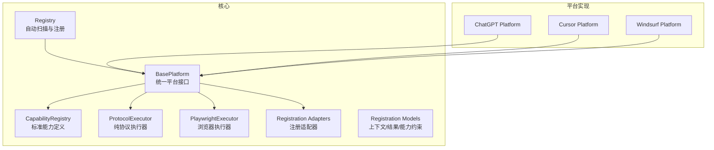
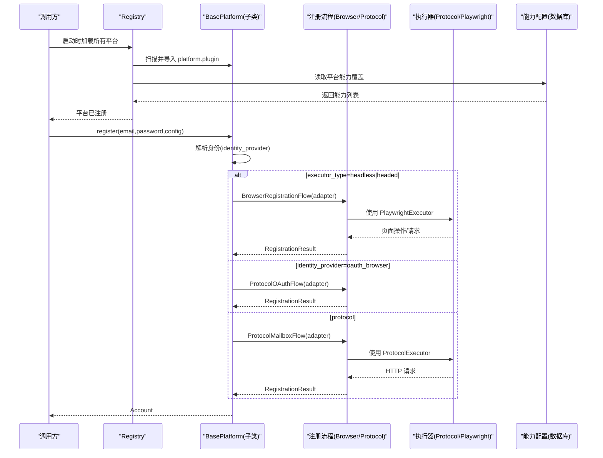
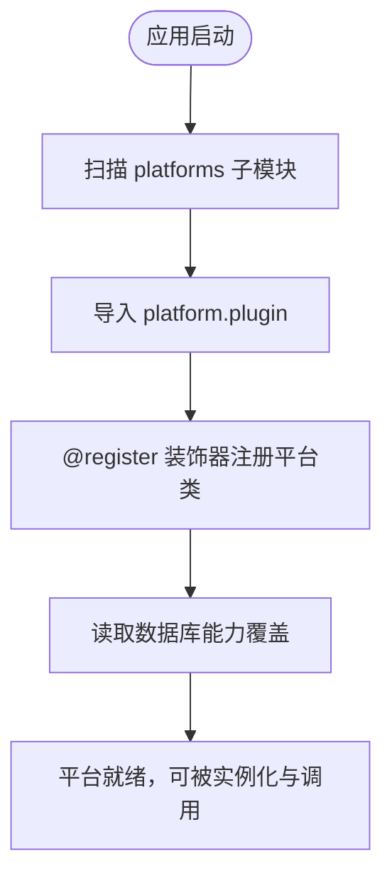
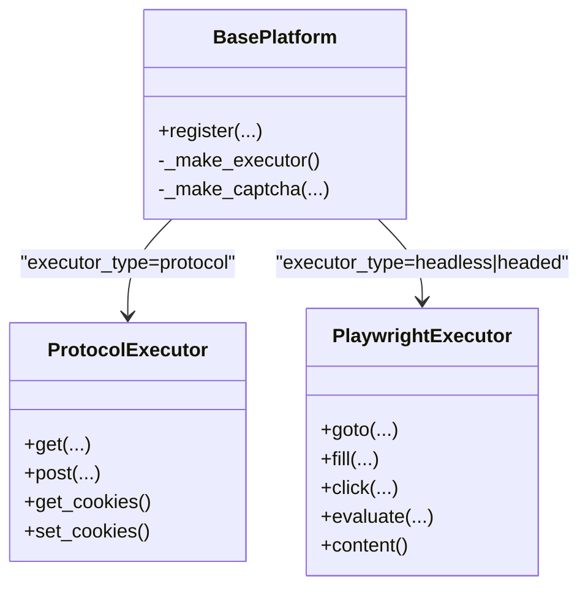
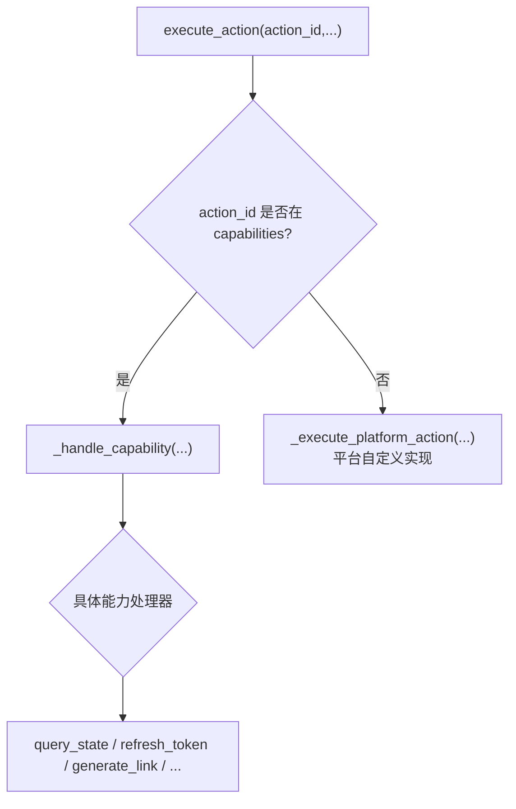
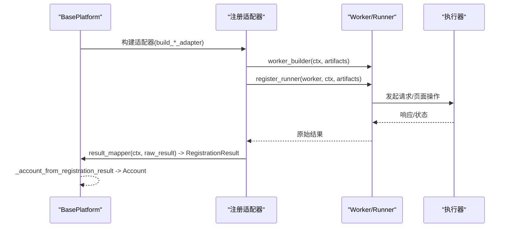
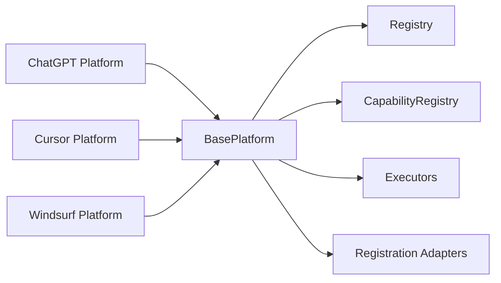

# 平台适配器模式

<cite>
**本文引用的文件**
- [core/base_platform.py](file://core/base_platform.py)
- [core/registry.py](file://core/registry.py)
- [core/capability_registry.py](file://core/capability_registry.py)
- [core/registration/adapters.py](file://core/registration/adapters.py)
- [core/registration/models.py](file://core/registration/models.py)
- [core/executors/protocol.py](file://core/executors/protocol.py)
- [core/executors/playwright.py](file://core/executors/playwright.py)
- [platforms/chatgpt/plugin.py](file://platforms/chatgpt/plugin.py)
- [platforms/cursor/plugin.py](file://platforms/cursor/plugin.py)
- [platforms/windsurf/plugin.py](file://platforms/windsurf/plugin.py)
</cite>

## 目录
1. [简介](#简介)
2. [项目结构](#项目结构)
3. [核心组件](#核心组件)
4. [架构总览](#架构总览)
5. [详细组件分析](#详细组件分析)
6. [依赖关系分析](#依赖关系分析)
7. [性能考量](#性能考量)
8. [故障排查指南](#故障排查指南)
9. [结论](#结论)
10. [附录：如何继承 BasePlatform 实现新平台](#附录如何继承-baseplatform-实现新平台)

## 简介
本文件围绕 Any Auto Register 的“平台适配器模式”展开，系统性解释以下主题：
- BasePlatform 基类的设计思想：抽象方法、统一接口规范、生命周期管理
- 插件注册机制：动态发现、加载流程、依赖注入
- 执行器类型系统（protocol、headless、headed）的实现与选择逻辑
- 能力声明系统与能力覆盖机制的使用方式
- 具体代码示例路径，指导如何继承 BasePlatform 实现新的平台适配器

目标是既提供架构深度，又给出可操作的开发指导。

## 项目结构
本项目采用分层与模块化组织：
- core：平台基类、注册表、能力定义、执行器、注册流程模型与适配器
- platforms：各平台的具体实现（ChatGPT、Cursor、Windsurf 等），每个平台一个 plugin.py 作为入口并声明能力
- infrastructure/domain/api：基础设施、领域模型与 API 层（与本主题关联较少）

图表来源
- [core/base_platform.py:44-328](file://core/base_platform.py#L44-L328)
- [core/registry.py:19-38](file://core/registry.py#L19-L38)
- [core/capability_registry.py:27-132](file://core/capability_registry.py#L27-L132)
- [core/registration/adapters.py:28-59](file://core/registration/adapters.py#L28-L59)
- [core/registration/models.py:7-66](file://core/registration/models.py#L7-L66)
- [core/executors/protocol.py:6-45](file://core/executors/protocol.py#L6-L45)
- [core/executors/playwright.py:5-134](file://core/executors/playwright.py#L5-L134)
- [platforms/chatgpt/plugin.py:48-225](file://platforms/chatgpt/plugin.py#L48-L225)
- [platforms/cursor/plugin.py:18-114](file://platforms/cursor/plugin.py#L18-L114)
- [platforms/windsurf/plugin.py:35-150](file://platforms/windsurf/plugin.py#L35-L150)

章节来源
- [core/base_platform.py:44-328](file://core/base_platform.py#L44-L328)
- [core/registry.py:19-38](file://core/registry.py#L19-L38)

## 核心组件
- BasePlatform：平台适配器的抽象基类，定义统一的注册、校验、能力调用、执行器创建、验证码处理、身份解析等接口与默认行为
- Registry：自动扫描 platforms/ 下的子模块，导入每个平台的 plugin.py，并通过装饰器将平台类注册到内存注册表；同时从数据库加载能力覆盖
- CapabilityRegistry：集中定义标准能力（如 query_state、refresh_token、generate_link 等）及其 UI 提示和参数 schema
- Registration Adapters & Models：封装浏览器注册、协议邮箱注册、协议 OAuth 注册的适配器结构与运行上下文、产物、结果
- Executors：ProtocolExecutor（基于 curl_cffi）与 PlaywrightExecutor（支持 headless/headed 模式）

章节来源
- [core/base_platform.py:44-328](file://core/base_platform.py#L44-L328)
- [core/registry.py:19-38](file://core/registry.py#L19-L38)
- [core/capability_registry.py:27-132](file://core/capability_registry.py#L27-L132)
- [core/registration/adapters.py:28-59](file://core/registration/adapters.py#L28-L59)
- [core/registration/models.py:7-66](file://core/registration/models.py#L7-L66)
- [core/executors/protocol.py:6-45](file://core/executors/protocol.py#L6-L45)
- [core/executors/playwright.py:5-134](file://core/executors/playwright.py#L5-L134)

## 架构总览
下图展示了平台适配器在注册与执行过程中的关键交互：

图表来源
- [core/base_platform.py:124-160](file://core/base_platform.py#L124-L160)
- [core/registry.py:25-38](file://core/registry.py#L25-L38)
- [core/executors/protocol.py:6-45](file://core/executors/protocol.py#L6-L45)
- [core/executors/playwright.py:5-134](file://core/executors/playwright.py#L5-L134)
- [core/registration/adapters.py:28-59](file://core/registration/adapters.py#L28-L59)

## 详细组件分析

### BasePlatform 设计思想
- 抽象方法与统一接口
  - 必须实现 check_valid(account) 以判断账号有效性
  - 可选实现 get_trial_url、get_quota、get_desktop_state、execute_action 等扩展能力
- 生命周期管理
  - __init__ 中从数据库加载平台能力覆盖，校验 executor_type 是否受支持
  - register 内部根据 executor_type 与 identity_provider 选择不同注册流程
  - _make_executor 根据配置创建 ProtocolExecutor 或 PlaywrightExecutor
  - _make_captcha/_resolve_captcha_solver 负责验证码解决器的选择与初始化
  - _resolve_identity/_attach_identity_metadata 负责身份解析与元数据附加
- 能力系统整合
  - get_platform_actions/get_capability_actions 将 capabilities 映射为动作列表
  - execute_action 优先走标准能力路由，再回退到平台自定义实现

章节来源
- [core/base_platform.py:44-328](file://core/base_platform.py#L44-L328)
- [core/base_platform.py:316-328](file://core/base_platform.py#L316-L328)
- [core/base_platform.py:330-430](file://core/base_platform.py#L330-L430)
- [core/base_platform.py:432-504](file://core/base_platform.py#L432-L504)

### 插件注册机制：动态发现、加载流程、依赖注入
- 动态发现
  - load_all 通过 pkgutil 遍历 platforms 包下子模块，尝试导入每个子模块的 plugin.py
- 注册
  - 平台类通过 @register 装饰器将自身加入内存注册表，键为 name
- 能力覆盖
  - get_platform_capabilities 从数据库读取能力覆盖，并与类属性合并，确保运行时能力准确
- 依赖注入
  - 平台构造时可注入 mailbox 等外部依赖（例如 ChatGPT/Cursor/Windsurf 均接受 mailbox 参数）

图表来源
- [core/registry.py:25-38](file://core/registry.py#L25-L38)
- [core/registry.py:100-107](file://core/registry.py#L100-L107)
- [platforms/chatgpt/plugin.py:48-70](file://platforms/chatgpt/plugin.py#L48-L70)
- [platforms/cursor/plugin.py:18-36](file://platforms/cursor/plugin.py#L18-L36)
- [platforms/windsurf/plugin.py:35-73](file://platforms/windsurf/plugin.py#L35-L73)

章节来源
- [core/registry.py:25-38](file://core/registry.py#L25-L38)
- [core/registry.py:100-107](file://core/registry.py#L100-L107)

### 执行器类型系统（protocol、headless、headed）
- 选择逻辑
  - BasePlatform.register 中根据 config.executor_type 决定走浏览器注册流程还是协议注册流程
  - _make_executor 根据 executor_type 创建对应执行器：
    - protocol -> ProtocolExecutor（基于 curl_cffi）
    - headless/headed -> PlaywrightExecutor（无头/有头模式）
- 差异与适用场景
  - protocol：轻量、稳定，适合纯 HTTP 协议交互
  - headless/headed：需要真实浏览器环境，用于复杂页面交互或 OAuth 流程

图表来源
- [core/base_platform.py:316-328](file://core/base_platform.py#L316-L328)
- [core/executors/protocol.py:6-45](file://core/executors/protocol.py#L6-L45)
- [core/executors/playwright.py:5-134](file://core/executors/playwright.py#L5-L134)

章节来源
- [core/base_platform.py:316-328](file://core/base_platform.py#L316-L328)
- [core/executors/protocol.py:6-45](file://core/executors/protocol.py#L6-L45)
- [core/executors/playwright.py:5-134](file://core/executors/playwright.py#L5-L134)

### 能力声明系统与能力覆盖机制
- 能力声明
  - 平台类通过 capabilities 声明支持的标准能力（如 query_state、refresh_token、generate_link 等）
  - capability_overrides 可对能力的 label、params、sync 等进行覆盖
- 能力路由
  - BasePlatform.execute_action 先按 capability_id 路由到内置处理器（如 _handle_query_state），若未实现则抛出 NotImplementedError 并由上层处理
  - CapabilityRegistry 提供标准能力定义与 UI 提示，便于前端展示与排序
- 典型用法
  - ChatGPT：声明 query_state、refresh_token、generate_link、switch_desktop、upload_cpa、upload_tm
  - Cursor：声明 switch_desktop、query_state、generate_link
  - Windsurf：声明 query_state、check_trial、generate_link、generate_link_browser、switch_desktop，并对 generate_link/generate_link_browser/switch_desktop 进行参数与标签覆盖

图表来源
- [core/base_platform.py:192-233](file://core/base_platform.py#L192-L233)
- [core/capability_registry.py:27-132](file://core/capability_registry.py#L27-L132)
- [platforms/chatgpt/plugin.py:58-66](file://platforms/chatgpt/plugin.py#L58-L66)
- [platforms/cursor/plugin.py:27-32](file://platforms/cursor/plugin.py#L27-L32)
- [platforms/windsurf/plugin.py:43-69](file://platforms/windsurf/plugin.py#L43-L69)

章节来源
- [core/base_platform.py:192-233](file://core/base_platform.py#L192-L233)
- [core/capability_registry.py:27-132](file://core/capability_registry.py#L27-L132)
- [platforms/chatgpt/plugin.py:58-66](file://platforms/chatgpt/plugin.py#L58-L66)
- [platforms/cursor/plugin.py:27-32](file://platforms/cursor/plugin.py#L27-L32)
- [platforms/windsurf/plugin.py:43-69](file://platforms/windsurf/plugin.py#L43-L69)

### 注册流程与适配器
- 适配器类型
  - BrowserRegistrationAdapter：封装浏览器注册工作流（worker_builder、browser_register_runner、oauth_runner）
  - ProtocolMailboxAdapter：封装协议邮箱注册（worker_builder、register_runner）
  - ProtocolOAuthAdapter：封装协议 OAuth 注册（oauth_runner）
- 上下文与产物
  - RegistrationContext：携带平台名、显示名、平台实例、身份、配置、邮箱、密码、日志函数
  - RegistrationArtifacts：OTP回调、验证码解决器、执行器、原始结果等
  - RegistrationResult：注册结果（email/password/user_id/token/status/trial_end_time/extra）

图表来源
- [core/registration/adapters.py:28-59](file://core/registration/adapters.py#L28-L59)
- [core/registration/models.py:7-66](file://core/registration/models.py#L7-L66)
- [core/base_platform.py:124-160](file://core/base_platform.py#L124-L160)
- [platforms/chatgpt/plugin.py:160-225](file://platforms/chatgpt/plugin.py#L160-L225)
- [platforms/cursor/plugin.py:72-114](file://platforms/cursor/plugin.py#L72-L114)
- [platforms/windsurf/plugin.py:94-150](file://platforms/windsurf/plugin.py#L94-L150)

章节来源
- [core/registration/adapters.py:28-59](file://core/registration/adapters.py#L28-L59)
- [core/registration/models.py:7-66](file://core/registration/models.py#L7-L66)
- [core/base_platform.py:124-160](file://core/base_platform.py#L124-L160)

## 依赖关系分析
- 组件耦合
  - BasePlatform 强依赖 Registry（获取能力）、Executors（创建执行器）、Registration Adapters（注册流程）、CapabilityRegistry（能力定义）
  - 平台插件通过 @register 装饰器与 Registry 解耦，仅关注自身业务逻辑
- 直接/间接依赖
  - 平台插件依赖 BasePlatform、注册适配器、执行器、以及各自平台的核心模块（如 browser_register、protocol_mailbox、switch 等）
- 外部集成点
  - 数据库：平台能力覆盖存储
  - 第三方服务：验证码提供商、代理池、邮箱服务等

图表来源
- [core/base_platform.py:44-328](file://core/base_platform.py#L44-L328)
- [core/registry.py:19-38](file://core/registry.py#L19-L38)
- [core/capability_registry.py:27-132](file://core/capability_registry.py#L27-L132)
- [platforms/chatgpt/plugin.py:48-225](file://platforms/chatgpt/plugin.py#L48-L225)
- [platforms/cursor/plugin.py:18-114](file://platforms/cursor/plugin.py#L18-L114)
- [platforms/windsurf/plugin.py:35-150](file://platforms/windsurf/plugin.py#L35-L150)

章节来源
- [core/base_platform.py:44-328](file://core/base_platform.py#L44-L328)
- [core/registry.py:19-38](file://core/registry.py#L19-L38)

## 性能考量
- 执行器选择
  - protocol 模式更轻量，适合批量注册与高并发场景
  - headless/headed 模式资源消耗更高，适用于需要真实浏览器环境的复杂流程
- 验证码解决器
  - 支持多 provider 候选与回退策略，避免单点失败影响整体成功率
- 代理池
  - 部分平台在查询状态时会尝试代理池中的代理，并根据成功/失败反馈调整使用策略

[本节为通用指导，不直接分析具体文件]

## 故障排查指南
- 常见错误与定位
  - 未实现浏览器/协议注册适配器：检查平台是否实现了 build_browser_registration_adapter 或 build_protocol_mailbox_adapter
  - executor_type 不受支持：检查平台 supported_executors 与数据库能力覆盖
  - 验证码 provider 未配置：检查 captcha solver 配置与默认 provider
  - 能力未实现：检查 execute_action 是否覆盖了相应 capability 处理器
- 调试建议
  - 启用日志：通过 set_logger 注入日志函数，观察注册流程与执行器调用
  - 逐步验证：先确认身份解析与执行器创建正确，再验证注册流程与结果映射

章节来源
- [core/base_platform.py:124-160](file://core/base_platform.py#L124-L160)
- [core/base_platform.py:330-430](file://core/base_platform.py#L330-L430)
- [core/base_platform.py:192-233](file://core/base_platform.py#L192-L233)

## 结论
Any Auto Register 通过 BasePlatform 抽象出统一平台接口，结合 Registry 的动态发现与能力覆盖、Execution 的类型化执行器、以及标准化的能力系统，形成了高内聚、低耦合的平台适配器架构。平台插件只需关注自身业务逻辑，即可复用统一的注册流程、验证码处理、能力路由与执行器管理，显著降低新增平台的接入成本与维护复杂度。

[本节为总结性内容，不直接分析具体文件]

## 附录：如何继承 BasePlatform 实现新平台
以下步骤以 ChatGPT、Cursor、Windsurf 为例，说明实现新平台的关键点与参考路径：

- 必需方法实现
  - check_valid(account)：实现账号有效性检测
    - 参考路径：[platforms/chatgpt/plugin.py:72-117](file://platforms/chatgpt/plugin.py#L72-L117)、[platforms/cursor/plugin.py:116-127](file://platforms/cursor/plugin.py#L116-L127)、[platforms/windsurf/plugin.py:159-168](file://platforms/windsurf/plugin.py#L159-L168)
  - 至少实现一种注册适配器：
    - 浏览器注册：build_browser_registration_adapter
      - 参考路径：[platforms/chatgpt/plugin.py:160-177](file://platforms/chatgpt/plugin.py#L160-L177)、[platforms/cursor/plugin.py:72-91](file://platforms/cursor/plugin.py#L72-L91)、[platforms/windsurf/plugin.py:121-150](file://platforms/windsurf/plugin.py#L121-L150)
    - 协议邮箱注册：build_protocol_mailbox_adapter
      - 参考路径：[platforms/chatgpt/plugin.py:185-225](file://platforms/chatgpt/plugin.py#L185-L225)、[platforms/cursor/plugin.py:99-114](file://platforms/cursor/plugin.py#L99-L114)、[platforms/windsurf/plugin.py:94-119](file://platforms/windsurf/plugin.py#L94-L119)
    - 协议 OAuth 注册（可选）：build_protocol_oauth_adapter
      - 参考路径：[platforms/chatgpt/plugin.py:179-183](file://platforms/chatgpt/plugin.py#L179-L183)、[platforms/cursor/plugin.py:93-97](file://platforms/cursor/plugin.py#L93-L97)

- 可选功能扩展
  - 能力声明：capabilities 与 capability_overrides
    - 参考路径：[platforms/chatgpt/plugin.py:58-66](file://platforms/chatgpt/plugin.py#L58-L66)、[platforms/cursor/plugin.py:27-32](file://platforms/cursor/plugin.py#L27-L32)、[platforms/windsurf/plugin.py:43-69](file://platforms/windsurf/plugin.py#L43-L69)
  - 桌面应用切换：get_desktop_state 与 _handle_switch_desktop
    - 参考路径：[platforms/chatgpt/plugin.py:251-254](file://platforms/chatgpt/plugin.py#L251-L254)、[platforms/windsurf/plugin.py:173-211](file://platforms/windsurf/plugin.py#L173-L211)
  - 配额查询：get_quota 与 _handle_query_state
    - 参考路径：[platforms/windsurf/plugin.py:382-385](file://platforms/windsurf/plugin.py#L382-L385)、[platforms/windsurf/plugin.py:248-260](file://platforms/windsurf/plugin.py#L248-L260)

- 配置参数处理
  - executor_type：在 RegisterConfig 中指定 protocol/headless/headed
    - 参考路径：[core/base_platform.py:36-42](file://core/base_platform.py#L36-L42)、[core/base_platform.py:316-328](file://core/base_platform.py#L316-L328)
  - captcha_solver：支持 auto/provider_key/manual，并在 _resolve_captcha_solver 中选择
    - 参考路径：[core/base_platform.py:330-394](file://core/base_platform.py#L330-L394)
  - proxy：通过 RegisterConfig.proxy 传入，执行器会使用该代理
    - 参考路径：[core/executors/protocol.py:6-17](file://core/executors/protocol.py#L6-L17)、[core/executors/playwright.py:5-27](file://core/executors/playwright.py#L5-L27)

- 依赖注入
  - 在平台构造函数中注入 mailbox 等依赖
    - 参考路径：[platforms/chatgpt/plugin.py:68-70](file://platforms/chatgpt/plugin.py#L68-L70)、[platforms/cursor/plugin.py:34-36](file://platforms/cursor/plugin.py#L34-L36)、[platforms/windsurf/plugin.py:71-73](file://platforms/windsurf/plugin.py#L71-L73)

通过以上步骤与参考路径，可以快速实现一个新的平台适配器，并复用统一的注册流程、能力系统与执行器管理。