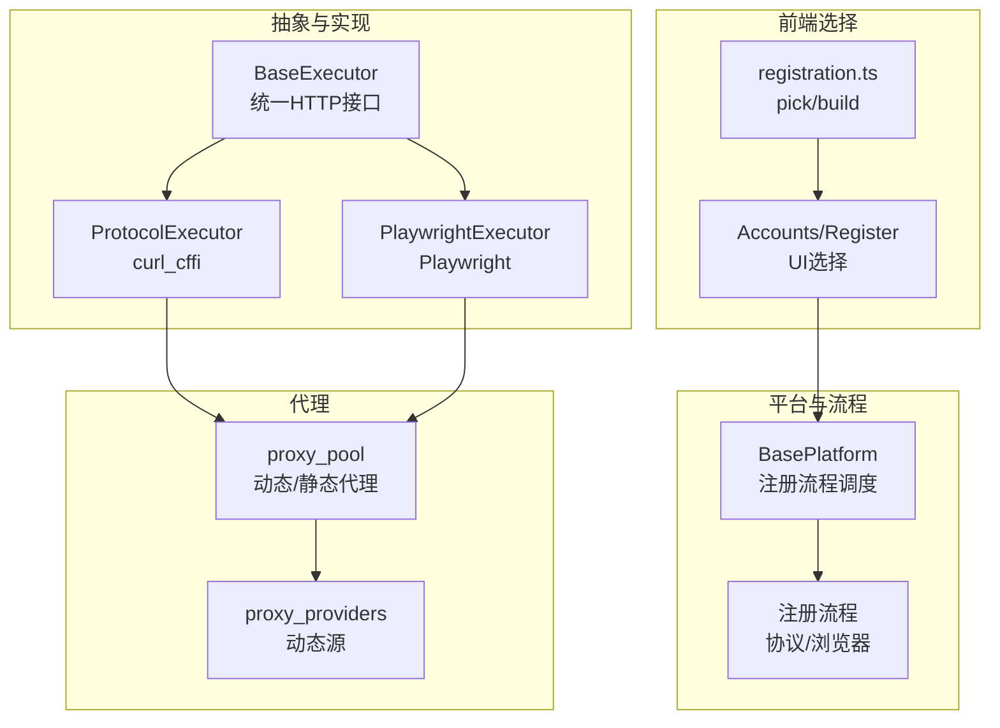
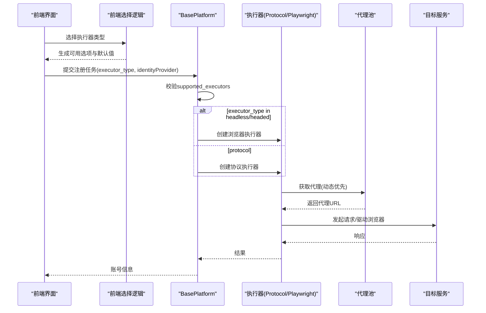
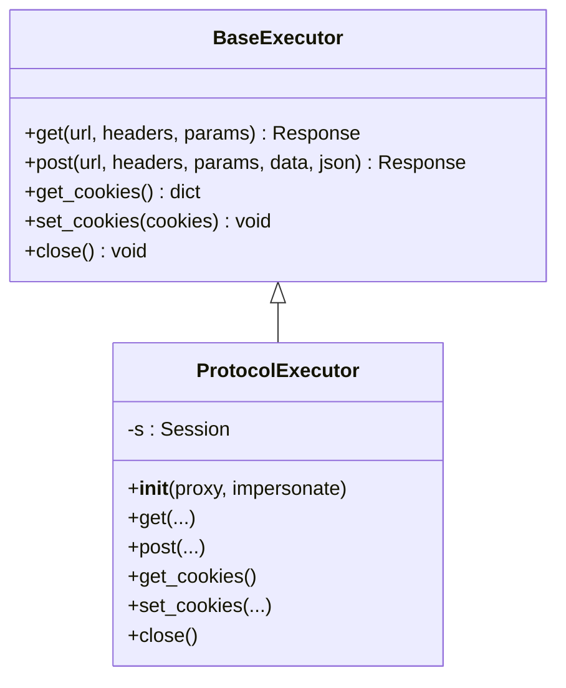
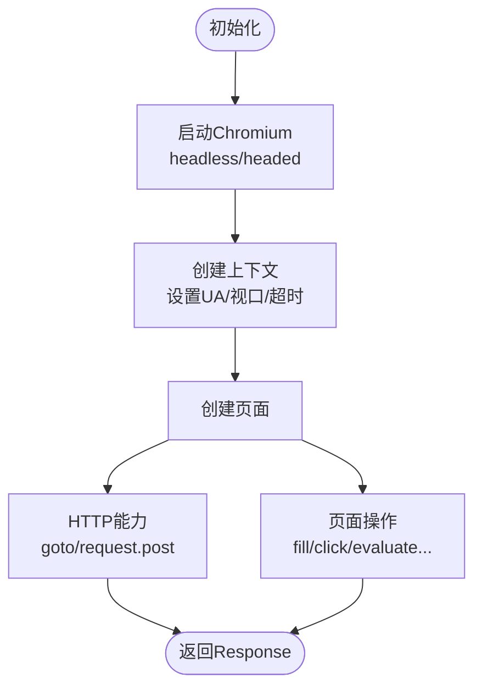
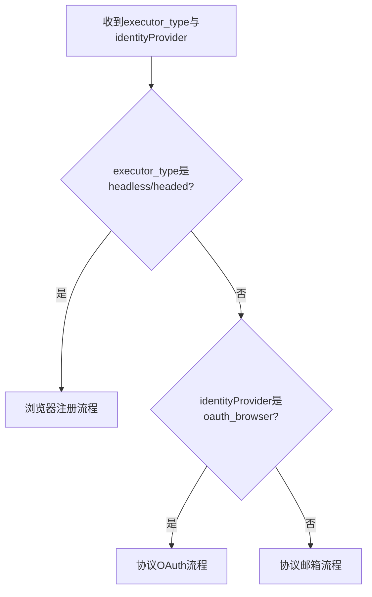
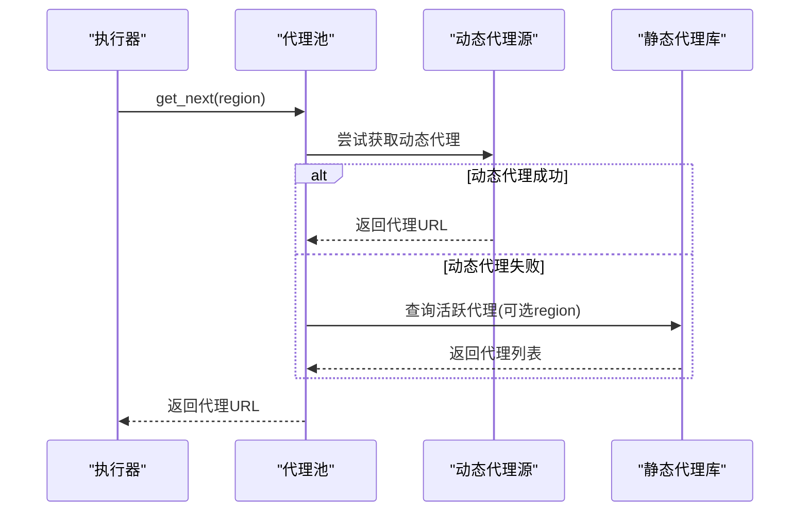
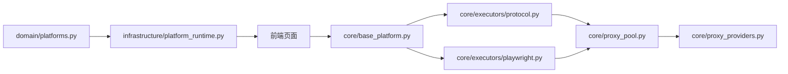

# 执行器类型系统

<cite>
**本文引用的文件**
- [core/base_executor.py](file://core/base_executor.py)
- [core/executors/protocol.py](file://core/executors/protocol.py)
- [core/executors/playwright.py](file://core/executors/playwright.py)
- [core/base_platform.py](file://core/base_platform.py)
- [frontend/src/lib/registration.ts](file://frontend/src/lib/registration.ts)
- [frontend/src/pages/Accounts.tsx](file://frontend/src/pages/Accounts.tsx)
- [frontend/src/pages/Register.tsx](file://frontend/src/pages/Register.tsx)
- [core/proxy_pool.py](file://core/proxy_pool.py)
- [core/proxy_providers.py](file://core/proxy_providers.py)
- [domain/platforms.py](file://domain/platforms.py)
- [infrastructure/platform_runtime.py](file://infrastructure/platform_runtime.py)
</cite>

## 目录
1. [简介](#简介)
2. [项目结构](#项目结构)
3. [核心组件](#核心组件)
4. [架构总览](#架构总览)
5. [详细组件分析](#详细组件分析)
6. [依赖关系分析](#依赖关系分析)
7. [性能考量](#性能考量)
8. [故障排查指南](#故障排查指南)
9. [结论](#结论)
10. [附录：使用示例与扩展机制](#附录使用示例与扩展机制)

## 简介
本文件系统性解析执行器类型系统的设计与实现，覆盖三种执行器类型（protocol、headless、headed）的特点、适用场景与性能差异；深入剖析 ProtocolExecutor 的 HTTP 协议直调实现及其优势；阐述 PlaywrightExecutor 的浏览器自动化实现，包括无头模式与有头模式的差异与使用场景；解释执行器选择逻辑（前端 pickOAuthExecutor/buildExecutorOptions 与后端 BasePlatform.register 分支）的决策流程；说明执行器与代理配置的集成方式；并提供面向不同平台的配置参数与优化建议，以及自定义执行器的扩展方法。

## 项目结构
执行器类型系统由“抽象基类 + 具体实现 + 平台能力声明 + 前端选择策略 + 代理池”共同构成：
- 抽象层：BaseExecutor 定义统一的 HTTP 接口与生命周期管理。
- 实现层：ProtocolExecutor（基于 curl_cffi 的纯协议调用）、PlaywrightExecutor（基于 Playwright 的浏览器自动化）。
- 平台层：BasePlatform 根据 executor_type 决定走协议邮箱注册、协议 OAuth 注册或浏览器注册流程。
- 前端层：registration.ts 提供执行器选项构建与默认选择策略；页面组件用于用户交互与展示。
- 代理层：proxy_pool 与 proxy_providers 为执行器提供动态/静态代理获取与回退。

图表来源
- [core/base_executor.py:19-49](file://core/base_executor.py#L19-L49)
- [core/executors/protocol.py:6-44](file://core/executors/protocol.py#L6-L44)
- [core/executors/playwright.py:5-134](file://core/executors/playwright.py#L5-L134)
- [core/base_platform.py:59-160](file://core/base_platform.py#L59-L160)
- [frontend/src/lib/registration.ts:14-111](file://frontend/src/lib/registration.ts#L14-L111)
- [core/proxy_pool.py:9-45](file://core/proxy_pool.py#L9-L45)
- [core/proxy_providers.py:77-102](file://core/proxy_providers.py#L77-L102)

章节来源
- [core/base_executor.py:19-49](file://core/base_executor.py#L19-L49)
- [core/executors/protocol.py:6-44](file://core/executors/protocol.py#L6-L44)
- [core/executors/playwright.py:5-134](file://core/executors/playwright.py#L5-L134)
- [core/base_platform.py:59-160](file://core/base_platform.py#L59-L160)
- [frontend/src/lib/registration.ts:14-111](file://frontend/src/lib/registration.ts#L14-L111)
- [core/proxy_pool.py:9-45](file://core/proxy_pool.py#L9-L45)
- [core/proxy_providers.py:77-102](file://core/proxy_providers.py#L77-L102)

## 核心组件
- BaseExecutor：抽象出 get/post/get_cookies/set_cookies/close 等统一接口，并支持上下文管理器。
- ProtocolExecutor：基于 curl_cffi 的会话封装，支持 impersonate、代理、Cookie 同步。
- PlaywrightExecutor：基于 Playwright 的浏览器实例化、上下文与页面管理，暴露 HTTP 与页面操作能力。
- BasePlatform：根据 executor_type 选择注册路径（浏览器/协议邮箱/协议 OAuth），并校验平台能力。

章节来源
- [core/base_executor.py:19-49](file://core/base_executor.py#L19-L49)
- [core/executors/protocol.py:6-44](file://core/executors/protocol.py#L6-L44)
- [core/executors/playwright.py:5-134](file://core/executors/playwright.py#L5-L134)
- [core/base_platform.py:59-160](file://core/base_platform.py#L59-L160)

## 架构总览
执行器类型系统的运行链路如下：
- 前端根据 identityProvider 与可用能力构建执行器选项，并给出默认选择策略。
- 后端 BasePlatform 在构造时加载平台能力，并在 register 中按 executor_type 分派到浏览器或协议流程。
- 具体执行器通过代理池获取代理地址，完成请求或浏览器访问。

图表来源
- [frontend/src/lib/registration.ts:14-111](file://frontend/src/lib/registration.ts#L14-L111)
- [core/base_platform.py:59-160](file://core/base_platform.py#L59-L160)
- [core/proxy_pool.py:9-45](file://core/proxy_pool.py#L9-L45)

## 详细组件分析

### 执行器类型对比：protocol、headless、headed
- protocol（协议直调）
  - 特点：不启动浏览器，直接通过 HTTP 协议完成注册流程；适合邮箱注册场景。
  - 优势：资源占用低、延迟小、并发高；可复用会话与 Cookie。
  - 限制：无法处理需要真实浏览器环境的第三方登录（如 OAuth Browser）。
  - 适用：mailbox 身份提供者；对反爬要求不高或可通过 impersonate 模拟的场景。
- headless（无头浏览器）
  - 特点：后台运行浏览器，不可见；适合需要浏览器环境但不需可视化的场景。
  - 优势：兼容复杂页面逻辑、JS 渲染、验证码等；可复用本机浏览器登录态（当配置 Chrome Profile/CDP）。
  - 限制：资源消耗高于协议模式；需安装并维护浏览器环境。
  - 适用：oauth_browser 且具备可复用浏览器条件；或需要浏览器能力的 mailbox 场景。
- headed（有头浏览器）
  - 特点：前台可见浏览器窗口；便于调试与人工辅助。
  - 优势：可视化、易定位问题；适合演示与排障。
  - 限制：资源消耗最高；不适合大规模自动化。
  - 适用：调试、演示、需要人工介入的流程。

章节来源
- [core/executors/protocol.py:6-44](file://core/executors/protocol.py#L6-L44)
- [core/executors/playwright.py:5-134](file://core/executors/playwright.py#L5-L134)
- [frontend/src/lib/registration.ts:88-111](file://frontend/src/lib/registration.ts#L88-L111)

### ProtocolExecutor 的实现原理与优势
- 基于 curl_cffi 的 Session 封装，支持 impersonate 以模拟主流浏览器指纹。
- 统一包装 Response，包含状态码、文本、头部与 Cookie。
- 支持设置代理与全局 UA，简化跨平台网络栈差异。
- 优势：轻量、高性能、低内存占用；适合高并发批量注册。

图表来源
- [core/base_executor.py:19-49](file://core/base_executor.py#L19-L49)
- [core/executors/protocol.py:6-44](file://core/executors/protocol.py#L6-L44)

章节来源
- [core/executors/protocol.py:6-44](file://core/executors/protocol.py#L6-L44)

### PlaywrightExecutor 的浏览器自动化实现
- 初始化：启动 Chromium，配置 headless 标志、禁用自动化检测、设置视口与 UA、默认超时。
- HTTP 能力：通过 page.goto 与 page.request.post 实现 get/post，并统一返回 Response。
- Cookie 管理：从 context 读取/写入 Cookie，支持 URL 或 domain 模式。
- 浏览器操作：提供 goto/fill/click/wait_for_selector/query_selector/evaluate/content/url/press 等方法，便于复杂交互。
- 关闭：释放浏览器与引擎资源。

图表来源
- [core/executors/playwright.py:5-134](file://core/executors/playwright.py#L5-L134)

章节来源
- [core/executors/playwright.py:5-134](file://core/executors/playwright.py#L5-L134)

### 执行器选择逻辑（前端与后端）
- 前端选择策略（registration.ts）
  - buildExecutorOptions：根据 identityProvider 与 supportedExecutors 构建选项，并对 protocol/headless 进行可用性判断与禁用提示。
  - pickOAuthExecutor：在 oauth_browser 场景下优先选择非 protocol 的执行器，若存在可复用浏览器则倾向 headless，否则降级到 headed 或 headless。
- 后端选择逻辑（BasePlatform.register）
  - 构造阶段加载平台能力，校验 executor_type 是否在 supported_executors 内。
  - 运行时：若 executor_type 为 headless/headed，进入浏览器注册流程；若 identityProvider 为 oauth_browser，进入协议 OAuth 流程；否则走协议邮箱注册流程。

图表来源
- [frontend/src/lib/registration.ts:14-111](file://frontend/src/lib/registration.ts#L14-L111)
- [core/base_platform.py:59-160](file://core/base_platform.py#L59-L160)

章节来源
- [frontend/src/lib/registration.ts:14-111](file://frontend/src/lib/registration.ts#L14-L111)
- [core/base_platform.py:59-160](file://core/base_platform.py#L59-L160)

### 执行器与代理配置的集成
- 动态代理优先：proxy_pool.get_next 首先尝试动态代理 provider，失败则回退到静态代理池。
- 静态代理池：从数据库读取活跃代理，按成功率排序轮询；支持区域过滤。
- 执行器接入：
  - ProtocolExecutor：通过 Session.proxies 注入代理。
  - PlaywrightExecutor：通过 launch 参数 proxy.server 注入代理。
- 代理健康度：check_all 定期探测，report_success/report_fail 更新统计并自动禁用连续失败的代理。

图表来源
- [core/proxy_pool.py:9-45](file://core/proxy_pool.py#L9-L45)
- [core/proxy_providers.py:77-102](file://core/proxy_providers.py#L77-L102)
- [core/executors/protocol.py:6-44](file://core/executors/protocol.py#L6-L44)
- [core/executors/playwright.py:5-134](file://core/executors/playwright.py#L5-L134)

章节来源
- [core/proxy_pool.py:9-45](file://core/proxy_pool.py#L9-L45)
- [core/proxy_providers.py:77-102](file://core/proxy_providers.py#L77-L102)
- [core/executors/protocol.py:6-44](file://core/executors/protocol.py#L6-L44)
- [core/executors/playwright.py:5-134](file://core/executors/playwright.py#L5-L134)

## 依赖关系分析
- 平台能力声明：domain.platforms 与 infrastructure.platform_runtime 将平台描述与能力（supported_executors 等）聚合输出。
- 前端能力展示：frontend 页面根据 supported_executors 渲染选项，并结合 hasReusableOAuthBrowser 与 pickOAuthExecutor 给出默认选择。
- 执行器依赖：ProtocolExecutor 依赖 curl_cffi；PlaywrightExecutor 依赖 playwright 同步 API。
- 代理依赖：执行器通过 proxy_pool 获取代理，proxy_pool 依赖数据库模型与动态代理 provider。

图表来源
- [domain/platforms.py:6-18](file://domain/platforms.py#L6-L18)
- [infrastructure/platform_runtime.py:221-238](file://infrastructure/platform_runtime.py#L221-L238)
- [core/base_platform.py:59-160](file://core/base_platform.py#L59-L160)
- [core/executors/protocol.py:6-44](file://core/executors/protocol.py#L6-L44)
- [core/executors/playwright.py:5-134](file://core/executors/playwright.py#L5-L134)
- [core/proxy_pool.py:9-45](file://core/proxy_pool.py#L9-L45)
- [core/proxy_providers.py:77-102](file://core/proxy_providers.py#L77-L102)

章节来源
- [domain/platforms.py:6-18](file://domain/platforms.py#L6-L18)
- [infrastructure/platform_runtime.py:221-238](file://infrastructure/platform_runtime.py#L221-L238)
- [core/base_platform.py:59-160](file://core/base_platform.py#L59-L160)
- [core/executors/protocol.py:6-44](file://core/executors/protocol.py#L6-L44)
- [core/executors/playwright.py:5-134](file://core/executors/playwright.py#L5-L134)
- [core/proxy_pool.py:9-45](file://core/proxy_pool.py#L9-L45)
- [core/proxy_providers.py:77-102](file://core/proxy_providers.py#L77-L102)

## 性能考量
- 协议模式（ProtocolExecutor）
  - 优点：极低内存与 CPU 占用；高并发友好；网络栈轻量。
  - 建议：合理设置 impersonate；复用 Session；控制并发度以避免触发限流。
- 无头模式（PlaywrightExecutor headless）
  - 优点：无需 GUI；资源占用低于 headed；适合批量自动化。
  - 建议：减少页面交互步骤；合理设置超时；避免频繁切换上下文。
- 有头模式（PlaywrightExecutor headed）
  - 优点：可视化调试；适合演示与排障。
  - 建议：仅在必要时启用；注意显存与 CPU 占用。
- 代理策略
  - 动态代理优先，失败回退静态池；按成功率排序提升稳定性。
  - 定期健康检查，自动禁用连续失败代理。

[本节为通用指导，不直接分析具体文件]

## 故障排查指南
- 执行器不支持错误
  - 现象：构造平台时抛出“暂不支持某执行器”。
  - 原因：executor_type 不在平台 supported_executors 列表中。
  - 处理：调整 executor_type 或更新平台能力配置。
- 浏览器模式不可用
  - 现象：headless/headed 被禁用或不可选。
  - 原因：未配置可复用浏览器（Chrome Profile/CDP）或平台能力限制。
  - 处理：在全局配置中填写 Chrome 相关参数，或改用 protocol。
- 代理不可用
  - 现象：请求超时或失败。
  - 原因：动态代理获取失败或静态代理池为空/失效。
  - 处理：检查动态代理 provider 配置；查看代理健康检测结果；补充有效代理。

章节来源
- [core/base_platform.py:59-75](file://core/base_platform.py#L59-L75)
- [frontend/src/lib/registration.ts:88-111](file://frontend/src/lib/registration.ts#L88-L111)
- [core/proxy_pool.py:47-91](file://core/proxy_pool.py#L47-L91)

## 结论
执行器类型系统通过抽象基类统一接口、两种具体实现（协议与浏览器）以及前后端协同的选择策略，实现了灵活、可扩展的注册自动化能力。protocol 模式在高并发与低资源场景表现优异；headless/headed 模式满足复杂页面与第三方登录需求。结合代理池与健康检查，系统具备良好的稳定性与可运维性。通过能力声明与前端策略，平台可动态控制可用执行器，满足不同业务场景。

[本节为总结，不直接分析具体文件]

## 附录：使用示例与扩展机制

### 不同平台的选择建议
- 邮箱注册（mailbox）
  - 推荐：protocol（最快、最省资源）。
  - 备选：headless（如需浏览器能力）。
- 第三方登录（oauth_browser）
  - 推荐：headless（具备可复用浏览器时）或 headed（调试/演示）。
  - 注意：需配置 Chrome Profile 或 CDP 地址。
- 混合场景
  - 优先 protocol；若受限则降级到 headless；必要时使用 headed 调试。

章节来源
- [frontend/src/lib/registration.ts:88-111](file://frontend/src/lib/registration.ts#L88-L111)
- [core/base_platform.py:124-160](file://core/base_platform.py#L124-L160)

### 配置参数与优化建议
- ProtocolExecutor
  - 关键参数：impersonate（浏览器指纹模拟）、proxy（代理）。
  - 优化：复用 Session；合理并发；必要时开启代理池。
- PlaywrightExecutor
  - 关键参数：headless（无头/有头）、proxy（launch 参数）。
  - 优化：设置合理超时；减少页面交互；避免频繁上下文切换。
- 代理配置
  - 动态代理：确保 provider 可用；监控健康检查。
  - 静态代理：维护活跃度与成功率；及时剔除失效代理。

章节来源
- [core/executors/protocol.py:6-44](file://core/executors/protocol.py#L6-L44)
- [core/executors/playwright.py:5-134](file://core/executors/playwright.py#L5-L134)
- [core/proxy_pool.py:9-45](file://core/proxy_pool.py#L9-L45)

### 扩展机制：开发自定义执行器
- 步骤
  - 继承 BaseExecutor，实现 get/post/get_cookies/set_cookies/close。
  - 在平台能力中声明支持的执行器类型（supported_executors）。
  - 在 BasePlatform.register 中增加对新执行器类型的分支（如需）。
  - 前端 registration.ts 中为新执行器类型添加选项与选择逻辑。
- 注意事项
  - 保持 Response 结构一致（status_code/text/headers/cookies）。
  - 正确处理代理注入与 Cookie 同步。
  - 做好异常处理与资源释放。

章节来源
- [core/base_executor.py:19-49](file://core/base_executor.py#L19-L49)
- [core/base_platform.py:59-160](file://core/base_platform.py#L59-L160)
- [frontend/src/lib/registration.ts:14-111](file://frontend/src/lib/registration.ts#L14-L111)