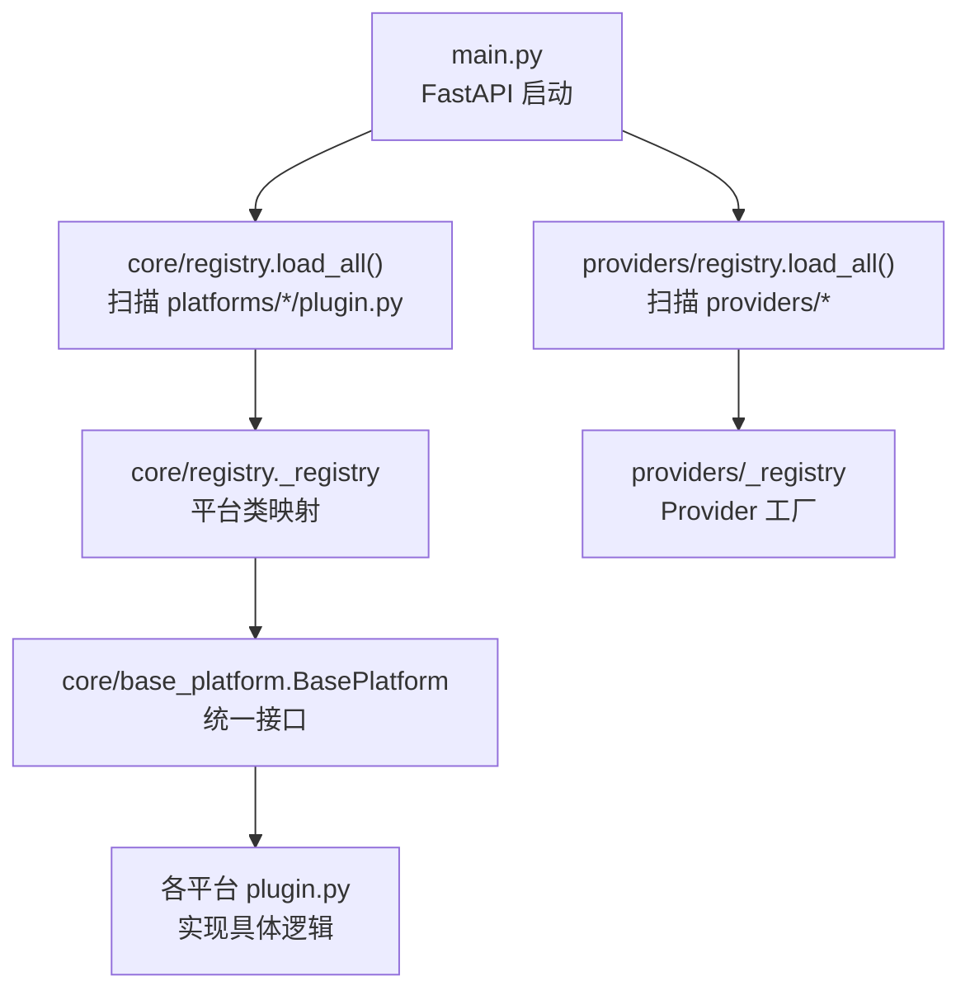
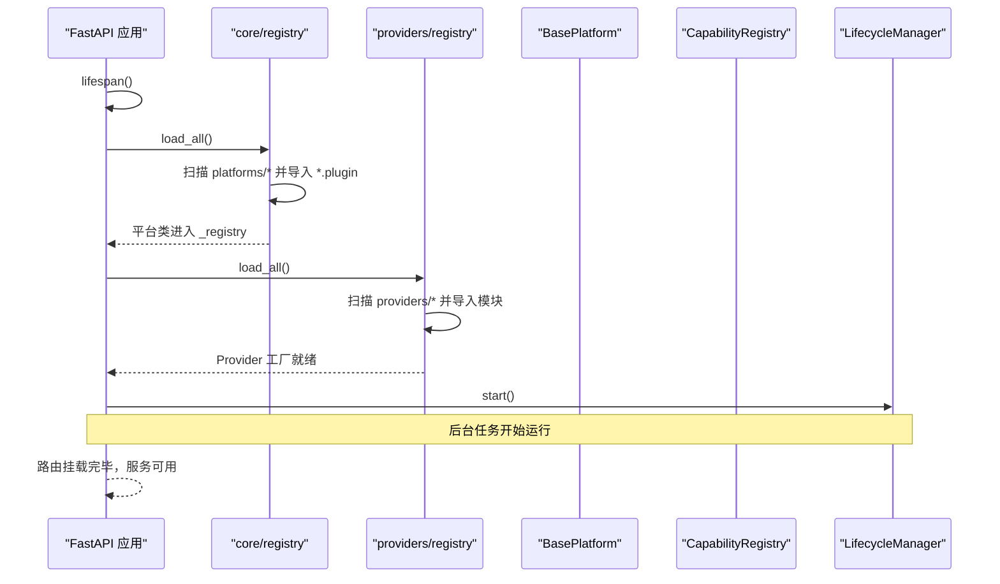
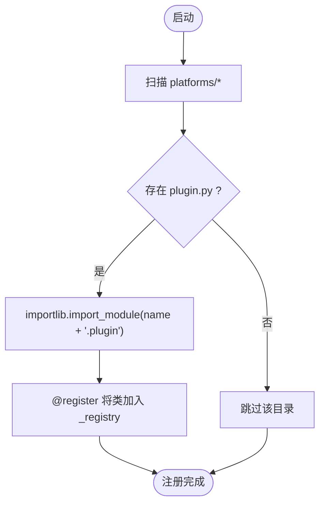
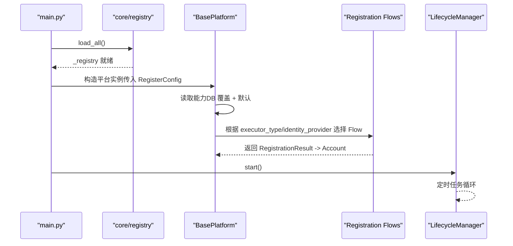
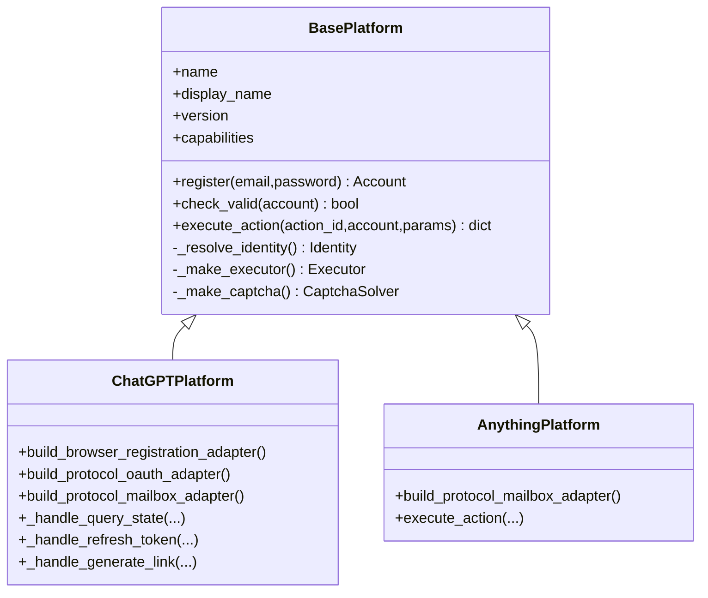
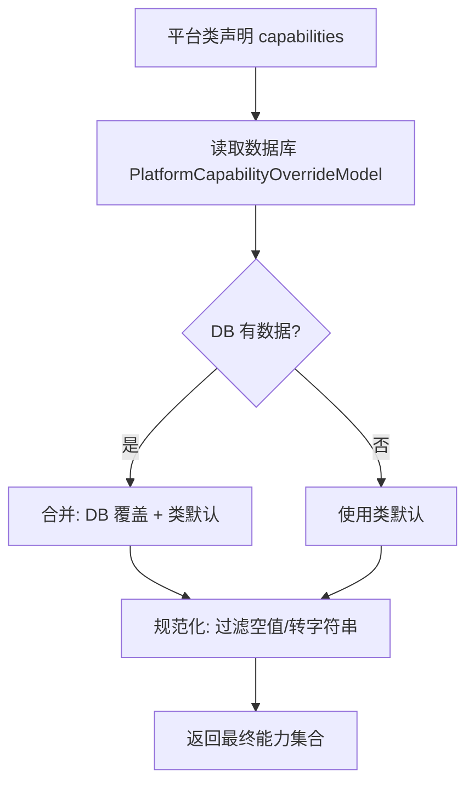
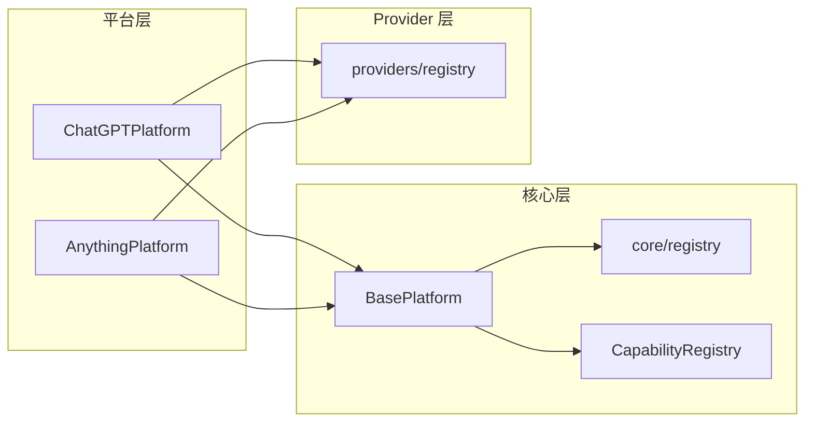

# 插件注册机制

<cite>
**本文引用的文件**
- [main.py](file://main.py)
- [core/registry.py](file://core/registry.py)
- [core/base_platform.py](file://core/base_platform.py)
- [core/capability_registry.py](file://core/capability_registry.py)
- [providers/registry.py](file://providers/registry.py)
- [platforms/chatgpt/plugin.py](file://platforms/chatgpt/plugin.py)
- [platforms/anything/plugin.py](file://platforms/anything/plugin.py)
- [core/registration/__init__.py](file://core/registration/__init__.py)
- [core/registration/errors.py](file://core/registration/errors.py)
- [core/lifecycle.py](file://core/lifecycle.py)
</cite>

## 目录
1. [简介](#简介)
2. [项目结构](#项目结构)
3. [核心组件](#核心组件)
4. [架构总览](#架构总览)
5. [详细组件分析](#详细组件分析)
6. [依赖关系分析](#依赖关系分析)
7. [性能考量](#性能考量)
8. [故障排查指南](#故障排查指南)
9. [结论](#结论)
10. [附录：如何创建并注册新平台插件](#附录如何创建并注册新平台插件)

## 简介
本文件深入解析 Any Auto Register 的“插件注册机制”，重点说明动态发现与自动加载平台插件的工作原理、插件生命周期管理、依赖注入与解耦策略、配置管理与版本兼容处理，以及热重载与错误处理机制。文档同时提供创建和注册新平台插件的实践指引，覆盖从初始化到可用的完整流程。

## 项目结构
- 入口与启动：应用通过 FastAPI 启动，在 lifespan 中完成数据库初始化、平台插件与第三方 Provider 的动态加载，随后启动调度器、任务运行时与生命周期管理器。
- 平台插件：位于 platforms/* 目录下，每个平台一个子包，必须包含 plugin.py，并通过装饰器向全局注册表声明自身。
- 能力与配置：平台的能力（如查询状态、刷新 Token、生成支付链接等）通过声明式 capabilities 与标准能力定义进行统一管理，支持数据库覆盖与默认值合并。
- 第三方 Provider：验证码、邮箱、短信、代理等通过 providers/* 下的统一注册表动态发现与实例化。

图表来源
- [main.py:67-82](file://main.py#L67-L82)
- [core/registry.py:25-32](file://core/registry.py#L25-L32)
- [providers/registry.py:70-90](file://providers/registry.py#L70-L90)

章节来源
- [main.py:67-82](file://main.py#L67-L82)
- [core/registry.py:25-32](file://core/registry.py#L25-L32)
- [providers/registry.py:70-90](file://providers/registry.py#L70-L90)

## 核心组件
- 平台注册表：维护已加载的平台类映射，提供按名称获取、列出平台、能力持久化与合并等功能。
- 平台基类：定义统一的注册流程、执行器选择、身份提供者解析、能力分发与默认行为。
- 能力注册表：标准化能力定义（ID、标签、参数 schema、UI 提示），用于前端展示与后端路由。
- Provider 注册表：统一发现与实例化验证码、邮箱、短信、代理等外部能力。
- 生命周期管理：定时执行账号有效性检测、Token 续期、过期预警与 CPA 同步等后台任务。

章节来源
- [core/registry.py:19-38](file://core/registry.py#L19-L38)
- [core/base_platform.py:44-160](file://core/base_platform.py#L44-L160)
- [core/capability_registry.py:27-132](file://core/capability_registry.py#L27-L132)
- [providers/registry.py:28-62](file://providers/registry.py#L28-L62)
- [core/lifecycle.py:458-527](file://core/lifecycle.py#L458-L527)

## 架构总览
下图展示了从应用启动到平台插件可用、再到能力调用的整体流程。

图表来源
- [main.py:67-82](file://main.py#L67-L82)
- [core/registry.py:25-32](file://core/registry.py#L25-L32)
- [providers/registry.py:70-90](file://providers/registry.py#L70-L90)
- [core/lifecycle.py:479-485](file://core/lifecycle.py#L479-L485)

## 详细组件分析

### 动态发现与自动加载机制
- 路径约定：系统以 packages 为单位扫描，平台插件位于 platforms/*，每个子包需包含 plugin.py；Provider 位于 providers/* 的子包下。
- 模块导入策略：使用 Python 标准库 pkgutil.iter_modules 遍历包内模块，再通过 importlib.import_module 动态导入，触发模块级装饰器注册逻辑。
- 容错处理：对 ModuleNotFoundError 等异常进行捕获，确保单个插件加载失败不影响整体启动。

图表来源
- [core/registry.py:25-32](file://core/registry.py#L25-L32)
- [providers/registry.py:70-90](file://providers/registry.py#L70-L90)

章节来源
- [core/registry.py:25-32](file://core/registry.py#L25-L32)
- [providers/registry.py:70-90](file://providers/registry.py#L70-L90)

### 插件加载流程（从初始化到可用）
- 应用启动时调用 core.registry.load_all() 与 providers/registry.load_all()。
- 平台类通过 @register 装饰器写入全局 _registry，键为 name。
- BasePlatform 构造时读取平台能力（优先数据库覆盖，其次类默认值），校验 executor_type 是否受支持。
- 注册流程根据 executor_type 与 identity_provider 选择浏览器模式、协议邮箱或协议 OAuth 适配器，驱动对应 Flow 完成注册。
- 生命周期管理器启动后，周期性执行账号有效性检测、Token 续期、过期预警与 CPA 同步。

图表来源
- [main.py:67-82](file://main.py#L67-L82)
- [core/registry.py:19-38](file://core/registry.py#L19-L38)
- [core/base_platform.py:59-160](file://core/base_platform.py#L59-L160)
- [core/lifecycle.py:479-527](file://core/lifecycle.py#L479-L527)

章节来源
- [main.py:67-82](file://main.py#L67-L82)
- [core/base_platform.py:59-160](file://core/base_platform.py#L59-L160)
- [core/registry.py:19-38](file://core/registry.py#L19-L38)
- [core/lifecycle.py:479-527](file://core/lifecycle.py#L479-L527)

### 依赖注入与松耦合
- 平台基类通过抽象方法定义最小契约（如 check_valid、get_trial_url、execute_action），具体平台只需实现差异部分。
- 身份提供者、验证码解决器、执行器等通过工厂函数与配置项在运行时解析与注入，避免硬编码依赖。
- 能力系统通过 CapabilityRegistry 将通用能力标准化，平台仅需声明 capabilities，无需关心 UI 呈现细节。

图表来源
- [core/base_platform.py:44-160](file://core/base_platform.py#L44-L160)
- [platforms/chatgpt/plugin.py:48-225](file://platforms/chatgpt/plugin.py#L48-L225)
- [platforms/anything/plugin.py:24-84](file://platforms/anything/plugin.py#L24-L84)

章节来源
- [core/base_platform.py:44-160](file://core/base_platform.py#L44-L160)
- [platforms/chatgpt/plugin.py:48-225](file://platforms/chatgpt/plugin.py#L48-L225)
- [platforms/anything/plugin.py:24-84](file://platforms/anything/plugin.py#L24-L84)

### 配置管理与版本兼容性
- 平台能力来源优先级：数据库覆盖 > 类默认值。系统在启动时将 DB 中的能力与类默认值合并，缺失字段回退到默认列表。
- 版本信息：平台类声明 version，便于前端展示与后续扩展（如灰度发布、特性开关）。
- 能力标准化：通过 CapabilityRegistry 定义标准能力 ID、标签、参数 schema 与 UI 提示，保证前后端一致。

图表来源
- [core/registry.py:41-61](file://core/registry.py#L41-L61)
- [core/registry.py:64-97](file://core/registry.py#L64-L97)
- [core/capability_registry.py:27-132](file://core/capability_registry.py#L27-L132)

章节来源
- [core/registry.py:41-97](file://core/registry.py#L41-L97)
- [core/capability_registry.py:27-132](file://core/capability_registry.py#L27-L132)

### 插件热重载与错误处理
- 热重载：当前代码未实现运行时热重载。新增平台需在应用重启后由 load_all() 重新扫描并加载。
- 错误处理：
  - 动态导入失败被捕获，不影响其他插件加载。
  - 注册流程抛出明确的异常类型（如身份解析失败、验证码配置不可用、OTP 超时、浏览器复用要求、不支持的路径等），便于上层统一处理。
  - 生命周期任务在循环中捕获异常并记录日志，保证后台任务持续运行。

章节来源
- [core/registry.py:25-32](file://core/registry.py#L25-L32)
- [core/registration/errors.py:4-26](file://core/registration/errors.py#L4-L26)
- [core/lifecycle.py:517-519](file://core/lifecycle.py#L517-L519)

## 依赖关系分析
- 平台插件依赖 BasePlatform 提供的统一接口与注册流程；通过装饰器 @register 向全局注册表登记。
- 平台插件可依赖内部模块（如 browser_register、protocol_mailbox、payment、token_refresh 等），按需延迟导入以减少启动开销。
- Provider 子系统独立于平台插件，通过统一注册表与工厂创建实例，降低耦合。

图表来源
- [platforms/chatgpt/plugin.py:48-225](file://platforms/chatgpt/plugin.py#L48-L225)
- [platforms/anything/plugin.py:24-84](file://platforms/anything/plugin.py#L24-L84)
- [core/base_platform.py:44-160](file://core/base_platform.py#L44-L160)
- [core/registry.py:19-38](file://core/registry.py#L19-L38)
- [providers/registry.py:28-62](file://providers/registry.py#L28-L62)

章节来源
- [platforms/chatgpt/plugin.py:48-225](file://platforms/chatgpt/plugin.py#L48-L225)
- [platforms/anything/plugin.py:24-84](file://platforms/anything/plugin.py#L24-L84)
- [core/base_platform.py:44-160](file://core/base_platform.py#L44-L160)
- [core/registry.py:19-38](file://core/registry.py#L19-L38)
- [providers/registry.py:28-62](file://providers/registry.py#L28-L62)

## 性能考量
- 延迟导入：平台插件内部模块（如浏览器注册、OAuth、支付、Token 刷新）采用按需 import，减少启动时间与内存占用。
- 能力缓存：能力读取涉及数据库访问，建议结合应用层缓存策略（例如前端缓存、短 TTL 缓存）降低频繁查询。
- 并发与线程：生命周期任务在后台线程运行，注意共享资源访问与异常隔离，避免阻塞主进程。

[本节为通用指导，不直接分析具体文件]

## 故障排查指南
- 平台未注册：检查 platform/*/plugin.py 是否存在且正确使用了 @register；确认 load_all() 已被调用。
- 执行器不支持：BasePlatform 构造时会校验 executor_type 是否在 supported_executors 中，若不在会抛出异常。
- 身份提供者不支持：若 identity_provider 不在 supported_identity_modes 中，会抛出异常。
- 验证码问题：未配置或未启用验证码 provider 会导致创建失败；请检查 providers 配置与默认选择逻辑。
- 注册流程异常：参考 registration/errors.py 中的异常类型，定位具体问题（如 OTP 超时、浏览器复用要求等）。
- 生命周期任务异常：查看 LifecycleManager 循环中的异常日志，确认后台任务是否正常执行。

章节来源
- [core/registry.py:35-38](file://core/registry.py#L35-L38)
- [core/base_platform.py:71-75](file://core/base_platform.py#L71-L75)
- [core/base_platform.py:436-449](file://core/base_platform.py#L436-L449)
- [core/base_platform.py:345-352](file://core/base_platform.py#L345-L352)
- [core/registration/errors.py:4-26](file://core/registration/errors.py#L4-L26)
- [core/lifecycle.py:517-519](file://core/lifecycle.py#L517-L519)

## 结论
Any Auto Register 的插件系统通过“约定优于配置”的动态发现机制，实现了平台插件的自动扫描与加载；借助 BasePlatform 的统一接口与能力系统，平台间保持松耦合与高内聚；Provider 子系统进一步解耦外部依赖；生命周期管理保障账号健康与自动化运维。遵循本文规范，可快速扩展新的平台插件并融入现有生态。

[本节为总结性内容，不直接分析具体文件]

## 附录：如何创建并注册新平台插件
- 目录结构
  - 在 platforms/ 下新建 myplatform/ 目录。
  - 至少创建 plugin.py，并在其中定义继承自 BasePlatform 的类，使用 @register 装饰器注册。
  - 可选：实现 protocol_mailbox、browser_register、oauth 等适配器，以满足不同注册路径。
- 必要声明
  - 类属性：name、display_name、version。
  - 能力声明：capabilities 列表（如 query_state、refresh_token、generate_link 等）。
  - 执行器与身份模式：supported_executors、supported_identity_modes、supported_oauth_providers。
- 注册流程实现
  - 实现 build_protocol_mailbox_adapter / build_browser_registration_adapter / build_protocol_oauth_adapter 中至少一种。
  - 实现 check_valid 以支持账号有效性检测。
  - 如需自定义操作，实现 execute_action 或覆盖 _execute_platform_action。
- 示例参考
  - 参考 platforms/chatgpt/plugin.py 与 platforms/anything/plugin.py 的实现方式。
- 启动验证
  - 重启应用，观察控制台输出“已加载平台”列表是否包含新平台。
  - 通过 API 查询平台能力与动作，验证功能正常。

章节来源
- [platforms/chatgpt/plugin.py:48-225](file://platforms/chatgpt/plugin.py#L48-L225)
- [platforms/anything/plugin.py:24-84](file://platforms/anything/plugin.py#L24-L84)
- [core/base_platform.py:44-160](file://core/base_platform.py#L44-L160)
- [core/registry.py:19-38](file://core/registry.py#L19-L38)