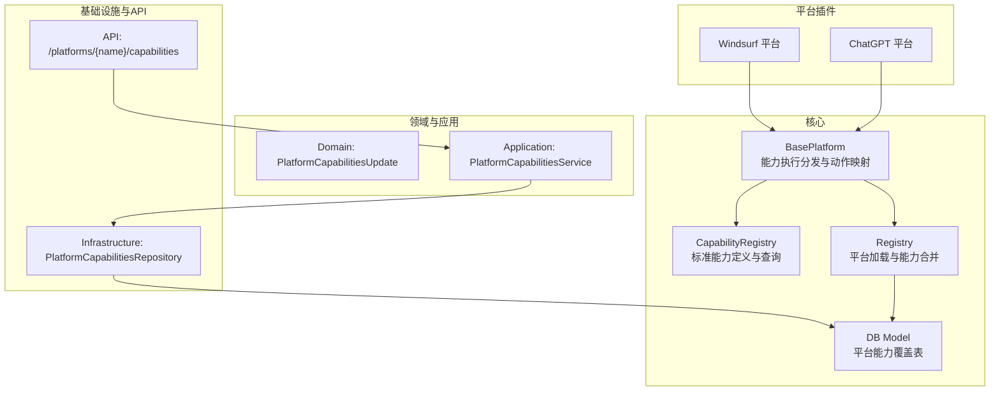
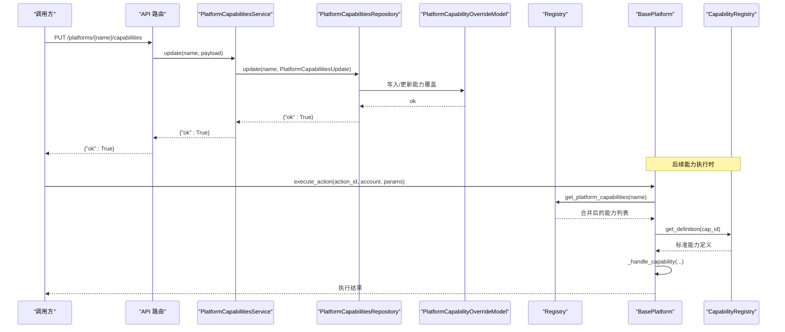
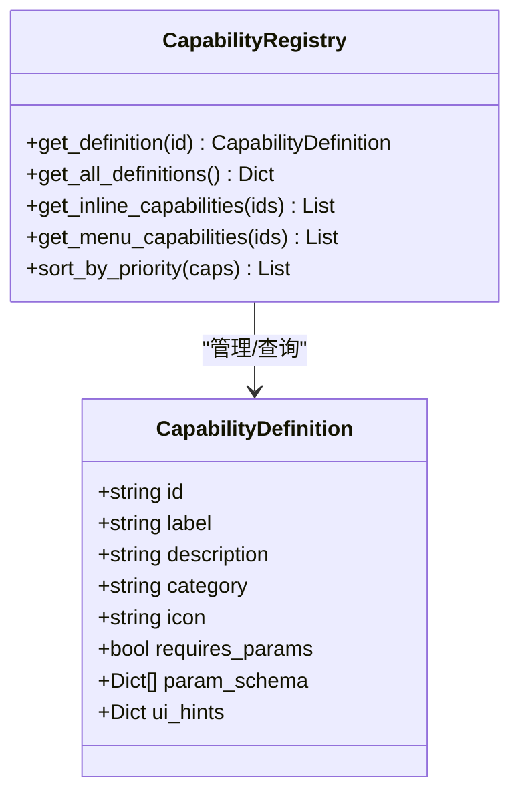
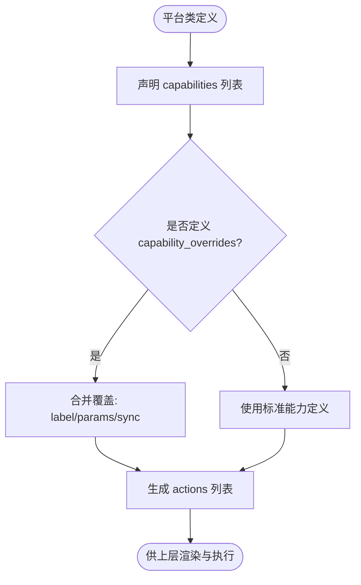
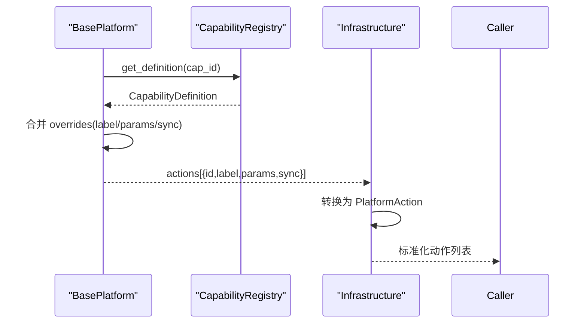
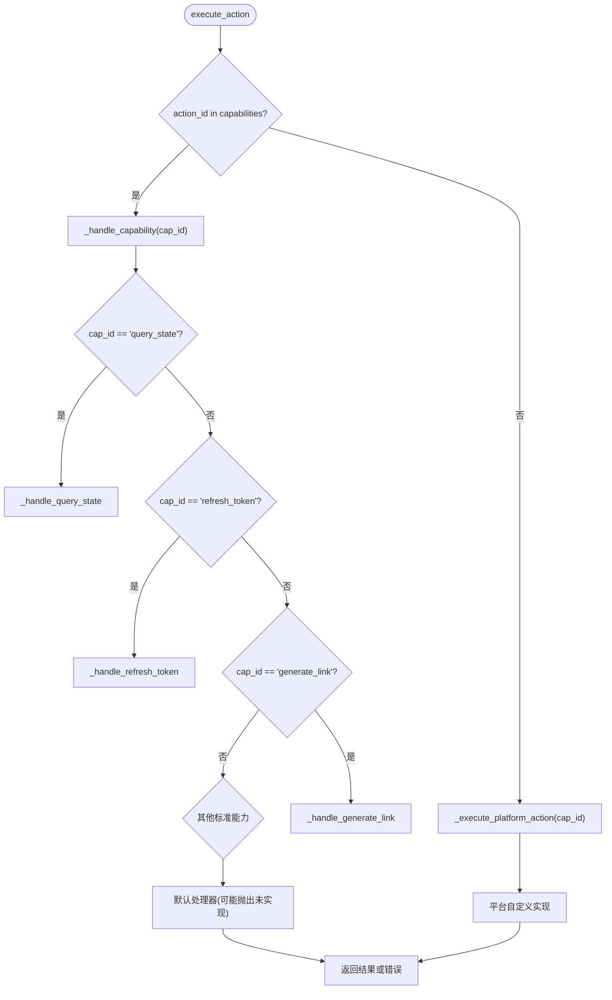
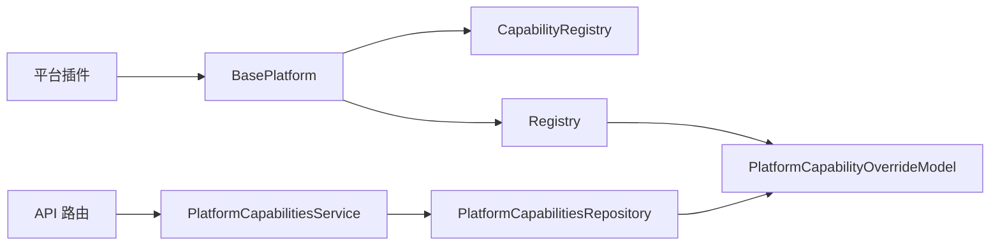

# 能力声明系统

<cite>
**本文引用的文件**
- [core/capability_registry.py](file://core/capability_registry.py)
- [core/base_platform.py](file://core/base_platform.py)
- [core/registry.py](file://core/registry.py)
- [core/db.py](file://core/db.py)
- [domain/platform_caps.py](file://domain/platform_caps.py)
- [application/platform_capabilities.py](file://application/platform_capabilities.py)
- [api/platform_capabilities.py](file://api/platform_capabilities.py)
- [infrastructure/platform_caps_repository.py](file://infrastructure/platform_caps_repository.py)
- [platforms/windsurf/plugin.py](file://platforms/windsurf/plugin.py)
- [platforms/chatgpt/plugin.py](file://platforms/chatgpt/plugin.py)
</cite>

## 目录
1. [简介](#简介)
2. [项目结构](#项目结构)
3. [核心组件](#核心组件)
4. [架构总览](#架构总览)
5. [详细组件分析](#详细组件分析)
6. [依赖关系分析](#依赖关系分析)
7. [性能考虑](#性能考虑)
8. [故障排查指南](#故障排查指南)
9. [结论](#结论)
10. [附录：使用指南与示例](#附录使用指南与示例)

## 简介
本文件系统性阐述“能力声明系统”的设计思想与实现机制。该系统通过声明式配置（capabilities 列表）定义平台支持的功能，并通过 capability_overrides 提供标签与参数的覆盖能力；同时提供标准能力（如 query_state、refresh_token、generate_link 等）的统一处理逻辑，以及 CapabilityRegistry 的查询与管理接口。系统还实现了能力与动作（actions）的映射转换，使前端或调用方可基于统一的能力清单动态生成操作界面与执行流程。此外，系统具备版本兼容与向后兼容策略，确保新增能力时不影响既有行为。

## 项目结构
能力声明系统横跨 core、domain、application、infrastructure、api 与 platforms 多个层次：
- core 层：定义标准能力与注册表（capability_registry）、平台基类与能力执行分发（base_platform）、平台能力持久化模型与注册加载（db、registry）。
- domain 层：定义能力更新的数据载体（platform_caps）。
- application 层：封装能力更新的业务服务（platform_capabilities）。
- infrastructure 层：能力数据的仓储访问（platform_caps_repository）。
- api 层：暴露能力更新与重置的 HTTP 接口（platform_capabilities）。
- platforms 层：各平台插件以声明式 capabilities 与可选 capability_overrides 声明自身能力，并实现具体能力处理器。

**图表来源**
- [core/capability_registry.py:135-172](file://core/capability_registry.py#L135-L172)
- [core/base_platform.py:192-310](file://core/base_platform.py#L192-L310)
- [core/registry.py:64-123](file://core/registry.py#L64-L123)
- [core/db.py:210-227](file://core/db.py#L210-L227)
- [domain/platform_caps.py:6-12](file://domain/platform_caps.py#L6-L12)
- [application/platform_capabilities.py:7-24](file://application/platform_capabilities.py#L7-L24)
- [infrastructure/platform_caps_repository.py:12-54](file://infrastructure/platform_caps_repository.py#L12-L54)
- [api/platform_capabilities.py:11-18](file://api/platform_capabilities.py#L11-L18)
- [platforms/windsurf/plugin.py:35-69](file://platforms/windsurf/plugin.py#L35-L69)
- [platforms/chatgpt/plugin.py:50-66](file://platforms/chatgpt/plugin.py#L50-L66)

**章节来源**
- [core/capability_registry.py:1-172](file://core/capability_registry.py#L1-L172)
- [core/base_platform.py:44-310](file://core/base_platform.py#L44-L310)
- [core/registry.py:1-124](file://core/registry.py#L1-L124)
- [core/db.py:210-227](file://core/db.py#L210-L227)
- [domain/platform_caps.py:1-12](file://domain/platform_caps.py#L1-L12)
- [application/platform_capabilities.py:1-24](file://application/platform_capabilities.py#L1-L24)
- [infrastructure/platform_caps_repository.py:1-54](file://infrastructure/platform_caps_repository.py#L1-L54)
- [api/platform_capabilities.py:1-18](file://api/platform_capabilities.py#L1-L18)
- [platforms/windsurf/plugin.py:35-69](file://platforms/windsurf/plugin.py#L35-L69)
- [platforms/chatgpt/plugin.py:50-66](file://platforms/chatgpt/plugin.py#L50-L66)

## 核心组件
- 标准能力定义与注册表（CapabilityRegistry）：集中维护标准能力的元数据（id、label、描述、分类、UI提示、参数模式等），并提供按 ID 查询、内联/菜单能力筛选、优先级排序等工具方法。
- 平台基类（BasePlatform）：负责读取平台声明的能力列表，将能力映射为动作（actions），并将能力调用路由到默认或平台自定义处理器。
- 平台能力注册与合并（Registry）：自动扫描平台插件，将数据库中的能力覆盖与类默认值进行合并，保证新增能力时自动补齐。
- 能力覆盖持久化（DB Model）：以 JSON 形式存储每个平台的能力覆盖（executors、identity modes、oauth providers、capabilities）。
- 领域模型（PlatformCapabilitiesUpdate）：用于接收能力更新请求的结构化数据。
- 应用服务（PlatformCapabilitiesService）：封装能力更新与重置的业务逻辑。
- 仓储（PlatformCapabilitiesRepository）：对能力覆盖进行增删改查。
- API 路由：对外暴露 PUT/DELETE 接口以更新或重置平台能力。
- 平台插件：通过 capabilities 与 capability_overrides 声明能力，并实现对应处理器。

**章节来源**
- [core/capability_registry.py:7-172](file://core/capability_registry.py#L7-L172)
- [core/base_platform.py:44-310](file://core/base_platform.py#L44-L310)
- [core/registry.py:15-123](file://core/registry.py#L15-L123)
- [core/db.py:210-227](file://core/db.py#L210-L227)
- [domain/platform_caps.py:6-12](file://domain/platform_caps.py#L6-L12)
- [application/platform_capabilities.py:7-24](file://application/platform_capabilities.py#L7-L24)
- [infrastructure/platform_caps_repository.py:12-54](file://infrastructure/platform_caps_repository.py#L12-L54)
- [api/platform_capabilities.py:11-18](file://api/platform_capabilities.py#L11-L18)

## 架构总览
能力声明系统的整体流程如下：
- 平台插件在类上声明 capabilities 列表与可选 capability_overrides。
- 运行时通过 BasePlatform 初始化时从 Registry 获取最终能力集（合并数据库覆盖与类默认值）。
- 调用 execute_action 时，若 action_id 属于能力集合，则进入 _handle_capability 统一分发；否则走平台自定义实现。
- 标准能力由 BasePlatform 提供默认处理器，平台可覆写以实现具体逻辑。
- 能力与动作的映射通过 get_capability_actions 完成，供上层（如基础设施层）转换为 UI 可用的 actions。

**图表来源**
- [api/platform_capabilities.py:11-18](file://api/platform_capabilities.py#L11-L18)
- [application/platform_capabilities.py:14-24](file://application/platform_capabilities.py#L14-L24)
- [infrastructure/platform_caps_repository.py:22-42](file://infrastructure/platform_caps_repository.py#L22-L42)
- [core/db.py:210-227](file://core/db.py#L210-L227)
- [core/registry.py:100-107](file://core/registry.py#L100-L107)
- [core/base_platform.py:192-233](file://core/base_platform.py#L192-L233)
- [core/capability_registry.py:138-172](file://core/capability_registry.py#L138-L172)

## 详细组件分析

### 标准能力与注册表（CapabilityRegistry）
- 标准能力定义：包含 query_state、refresh_token、generate_link、generate_link_browser、switch_desktop、upload_cpa、upload_tm、check_trial、create_api_key 等，每个能力带有 label、描述、分类、UI 提示（inline、priority）与可选参数模式（param_schema）。
- 查询接口：
  - get_definition：按能力 ID 获取定义。
  - get_all_definitions：返回所有标准能力定义副本。
  - get_inline_capabilities / get_menu_capabilities：根据 ui_hints.inline 过滤出适合内联按钮或下拉菜单的能力。
  - sort_by_priority：按 ui_hints.priority 排序，便于 UI 展示顺序控制。

**图表来源**
- [core/capability_registry.py:7-132](file://core/capability_registry.py#L7-L132)
- [core/capability_registry.py:135-172](file://core/capability_registry.py#L135-L172)

**章节来源**
- [core/capability_registry.py:7-172](file://core/capability_registry.py#L7-L172)

### 平台能力声明与覆盖（capabilities 与 capability_overrides）
- 声明式配置：平台在类属性中声明 capabilities 列表，表示该平台支持的标准能力集合。
- 标签与参数覆盖：通过 capability_overrides 字典对特定能力的 label、params、sync 等进行覆盖，满足平台个性化需求。
- 示例：
  - Windsurf：声明了 query_state、check_trial、generate_link、generate_link_browser、switch_desktop，并对 generate_link 与 generate_link_browser 的参数与同步标志进行了覆盖。
  - ChatGPT：声明了 query_state、refresh_token、generate_link、switch_desktop、upload_cpa、upload_tm。

**图表来源**
- [core/base_platform.py:290-310](file://core/base_platform.py#L290-L310)
- [platforms/windsurf/plugin.py:43-69](file://platforms/windsurf/plugin.py#L43-L69)
- [platforms/chatgpt/plugin.py:59-66](file://platforms/chatgpt/plugin.py#L59-L66)

**章节来源**
- [core/base_platform.py:54-57](file://core/base_platform.py#L54-L57)
- [core/base_platform.py:290-310](file://core/base_platform.py#L290-L310)
- [platforms/windsurf/plugin.py:43-69](file://platforms/windsurf/plugin.py#L43-L69)
- [platforms/chatgpt/plugin.py:59-66](file://platforms/chatgpt/plugin.py#L59-L66)

### 能力与动作（actions）的映射与转换
- 映射逻辑：BasePlatform.get_capability_actions 遍历平台能力列表，查找 CapabilityRegistry 中的定义，并结合 capability_overrides 生成 actions 列表（id、label、params、sync）。
- 转换用途：上层（如 infrastructure.platform_runtime.list_actions）将 actions 转换为统一的 PlatformAction 结构，供前端或任务系统使用。

**图表来源**
- [core/base_platform.py:290-310](file://core/base_platform.py#L290-L310)
- [infrastructure/platform_runtime.py:240-270](file://infrastructure/platform_runtime.py#L240-L270)

**章节来源**
- [core/base_platform.py:290-310](file://core/base_platform.py#L290-L310)
- [infrastructure/platform_runtime.py:240-270](file://infrastructure/platform_runtime.py#L240-L270)

### 标准能力的统一处理逻辑
- 分发入口：BasePlatform.execute_action 判断 action_id 是否在 capabilities 中，若是则进入 _handle_capability。
- 统一分发：_handle_capability 根据 capability_id 路由到对应的默认处理器（如 query_state、refresh_token、generate_link 等）。
- 默认实现：
  - query_state：优先调用 get_quota，否则返回账号基础状态信息。
  - refresh_token：默认抛出未实现异常，需平台覆写。
  - generate_link：默认调用 get_trial_url，若无实现则抛出未实现异常。
  - switch_desktop、upload_cpa、upload_tm、check_trial、generate_link_browser、create_api_key：默认均抛出未实现异常，需平台覆写。
- 平台覆写：平台可在子类中覆写对应处理器以实现具体逻辑（例如 Windsurf 对 generate_link、generate_link_browser、query_state、check_trial、switch_desktop 的实现）。

**图表来源**
- [core/base_platform.py:192-233](file://core/base_platform.py#L192-L233)
- [core/base_platform.py:235-284](file://core/base_platform.py#L235-L284)
- [platforms/windsurf/plugin.py:178-379](file://platforms/windsurf/plugin.py#L178-L379)

**章节来源**
- [core/base_platform.py:192-284](file://core/base_platform.py#L192-L284)
- [platforms/windsurf/plugin.py:178-379](file://platforms/windsurf/plugin.py#L178-L379)

### 能力注册表（CapabilityRegistry）的管理功能与查询接口
- 管理能力：集中维护标准能力定义，提供按 ID 查询、全部定义获取、内联/菜单能力筛选、优先级排序等工具方法。
- 查询接口：
  - get_definition(capability_id)：返回 CapabilityDefinition 或 None。
  - get_all_definitions()：返回所有标准能力定义的副本。
  - get_inline_capabilities(capability_ids)：返回适合内联按钮的能力列表。
  - get_menu_capabilities(capability_ids)：返回适合下拉菜单的能力列表。
  - sort_by_priority(capabilities)：按 UI 优先级排序。

**章节来源**
- [core/capability_registry.py:135-172](file://core/capability_registry.py#L135-L172)

### 能力与动作（actions）的映射关系和转换机制
- 映射：BasePlatform.get_capability_actions 将能力列表映射为 actions，结合 CapabilityRegistry 的定义与 capability_overrides 的覆盖。
- 转换：infrastructure.platform_runtime.list_actions 将 actions 转换为 PlatformAction 结构（id、label、params、sync），供上层使用。

**章节来源**
- [core/base_platform.py:290-310](file://core/base_platform.py#L290-L310)
- [infrastructure/platform_runtime.py:240-270](file://infrastructure/platform_runtime.py#L240-L270)

### 能力覆盖的持久化与合并策略
- 持久化：PlatformCapabilityOverrideModel 以 JSON 字段存储平台能力覆盖（supported_executors、supported_identity_modes、supported_oauth_providers、capabilities）。
- 合并：Registry._ensure_platform_capabilities_seeded 在启动或查询时将数据库覆盖与类默认值合并，确保新增能力时自动补齐。
- 更新与重置：PlatformCapabilitiesRepository.update/reset 提供能力覆盖的写入与删除。

**章节来源**
- [core/db.py:210-227](file://core/db.py#L210-L227)
- [core/registry.py:64-107](file://core/registry.py#L64-L107)
- [infrastructure/platform_caps_repository.py:22-54](file://infrastructure/platform_caps_repository.py#L22-L54)

## 依赖关系分析
- 组件耦合：
  - BasePlatform 依赖 CapabilityRegistry 与 Registry，用于能力定义查询与能力集获取。
  - Registry 依赖 DB Model 与平台类属性，负责能力集的合并与持久化。
  - Application/Infrastructure/API 层通过 Repository 与服务层协作，提供能力覆盖的 CRUD 接口。
  - 平台插件通过声明 capabilities 与 capability_overrides 参与系统，并可覆写标准能力处理器。
- 外部依赖：SQLModel/Session 用于数据库访问；FastAPI 用于 API 路由。

**图表来源**
- [core/base_platform.py:192-310](file://core/base_platform.py#L192-L310)
- [core/registry.py:64-123](file://core/registry.py#L64-L123)
- [core/db.py:210-227](file://core/db.py#L210-L227)
- [application/platform_capabilities.py:7-24](file://application/platform_capabilities.py#L7-L24)
- [infrastructure/platform_caps_repository.py:12-54](file://infrastructure/platform_caps_repository.py#L12-L54)
- [api/platform_capabilities.py:11-18](file://api/platform_capabilities.py#L11-L18)

**章节来源**
- [core/base_platform.py:192-310](file://core/base_platform.py#L192-L310)
- [core/registry.py:64-123](file://core/registry.py#L64-L123)
- [core/db.py:210-227](file://core/db.py#L210-L227)
- [application/platform_capabilities.py:7-24](file://application/platform_capabilities.py#L7-L24)
- [infrastructure/platform_caps_repository.py:12-54](file://infrastructure/platform_caps_repository.py#L12-L54)
- [api/platform_capabilities.py:11-18](file://api/platform_capabilities.py#L11-L18)

## 性能考虑
- 能力查询缓存：Registry 在会话中一次性拉取并缓存能力覆盖，减少重复数据库访问。
- 动作生成优化：BasePlatform.get_capability_actions 仅遍历已声明能力，避免全量扫描。
- 能力覆盖最小化：建议仅在必要时使用 capability_overrides，保持默认定义以减少覆盖复杂度。
- 异步能力：通过 sync 标志区分同步/异步能力，避免阻塞主流程。

[本节为通用指导，不直接分析具体文件]

## 故障排查指南
- 未实现能力：若平台未实现某标准能力处理器，BasePlatform 默认会抛出未实现异常。检查平台是否覆写对应处理器（如 _handle_refresh_token、_handle_generate_link 等）。
- 能力未生效：确认数据库中存在该平台的覆盖记录，且 Registry 合并逻辑正确。可通过 list_platforms 查看最终能力集。
- 动作列表为空：检查平台是否声明了 capabilities，并确保 get_platform_actions 能正确映射为 actions。
- 参数校验失败：核对 capability_overrides 中的 params 结构与前端表单一致，确保 key、label、type、options 正确。

**章节来源**
- [core/base_platform.py:235-284](file://core/base_platform.py#L235-L284)
- [core/registry.py:110-123](file://core/registry.py#L110-L123)
- [core/base_platform.py:290-310](file://core/base_platform.py#L290-L310)

## 结论
能力声明系统通过声明式配置与覆盖机制，提供了灵活、可扩展的平台能力管理方案。标准能力统一处理降低了重复实现成本，能力与动作的映射使得前端与任务系统能够动态适配不同平台。通过 Registry 的合并策略与持久化覆盖，系统在版本演进中保持了良好的向后兼容性。平台插件只需声明 capabilities 与可选覆盖，即可快速接入系统并获得一致的执行体验。

[本节为总结性内容，不直接分析具体文件]

## 附录：使用指南与示例

### 为新平台声明能力
- 在平台插件类中声明 capabilities 列表，列出该平台支持的标准能力。
- 如需自定义显示名称、参数或同步标志，使用 capability_overrides 进行覆盖。
- 示例参考：
  - Windsurf：声明了多项能力，并对 generate_link 与 generate_link_browser 的参数与同步标志进行了覆盖。
  - ChatGPT：声明了多项能力，包括刷新 Token、生成支付链接等。

**章节来源**
- [platforms/windsurf/plugin.py:43-69](file://platforms/windsurf/plugin.py#L43-L69)
- [platforms/chatgpt/plugin.py:59-66](file://platforms/chatgpt/plugin.py#L59-L66)

### 实现自定义能力
- 若需实现未在标准能力中的自定义动作，可在平台类中覆写 _execute_platform_action 或直接实现对应处理器。
- 通过 BasePlatform.execute_action 的分发逻辑，自定义动作将被识别并执行。

**章节来源**
- [core/base_platform.py:231-233](file://core/base_platform.py#L231-L233)

### 使用能力覆盖（标签与参数）
- 在 capability_overrides 中为特定能力设置 label、params、sync 等覆盖项。
- 示例：Windsurf 对 generate_link 与 generate_link_browser 的参数进行了扩展，增加了 turnstile_token、timeout、headless 等参数。

**章节来源**
- [platforms/windsurf/plugin.py:50-69](file://platforms/windsurf/plugin.py#L50-L69)

### 更新与重置平台能力
- 通过 API 接口 PUT /platforms/{name}/capabilities 更新平台能力覆盖。
- 通过 DELETE /platforms/{name}/capabilities 重置平台能力覆盖至默认值。
- 应用服务与仓储层负责参数校验与持久化。

**章节来源**
- [api/platform_capabilities.py:11-18](file://api/platform_capabilities.py#L11-L18)
- [application/platform_capabilities.py:14-24](file://application/platform_capabilities.py#L14-L24)
- [infrastructure/platform_caps_repository.py:22-54](file://infrastructure/platform_caps_repository.py#L22-L54)

### 能力版本兼容性与向后兼容策略
- 新增能力时，Registry 会在启动或查询时将数据库覆盖与类默认值合并，确保旧平台不受影响。
- 若平台未声明新能力，系统将回退到类默认值，保持既有行为。
- 建议逐步迁移平台至能力声明方式，保留旧有动作实现的兼容路径。

**章节来源**
- [core/registry.py:64-107](file://core/registry.py#L64-L107)
- [core/base_platform.py:171-184](file://core/base_platform.py#L171-L184)