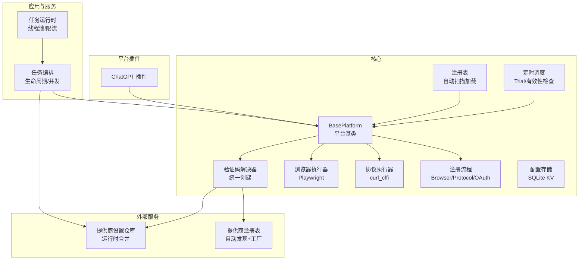
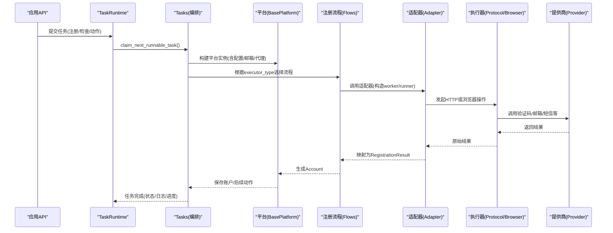
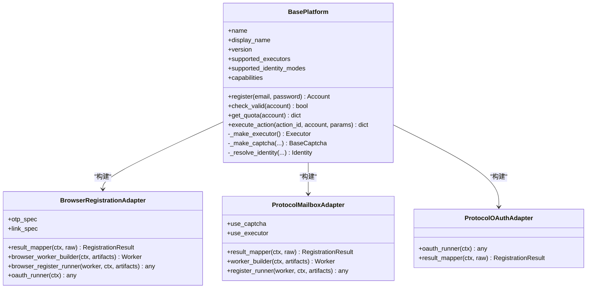
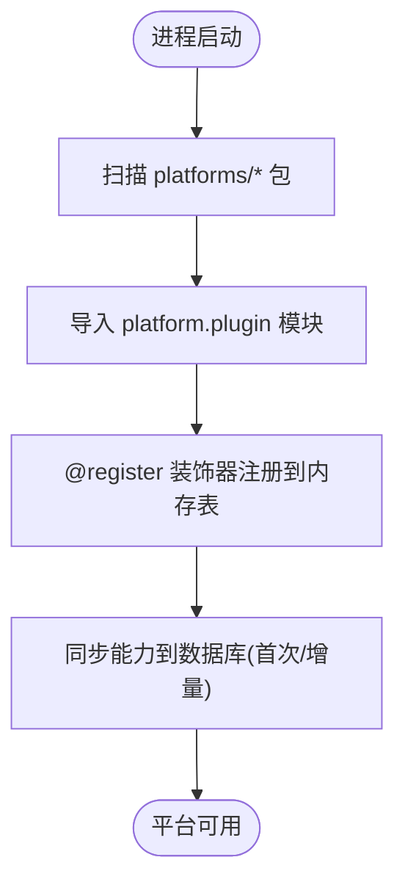
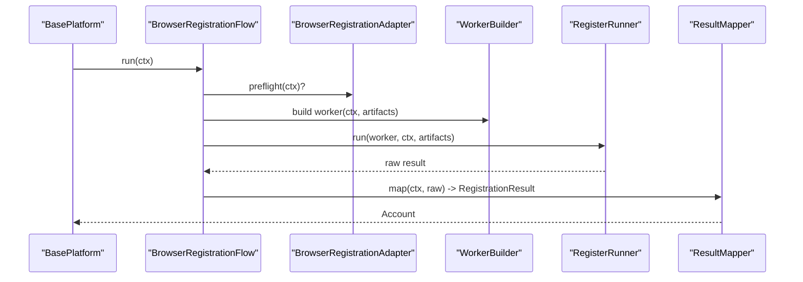
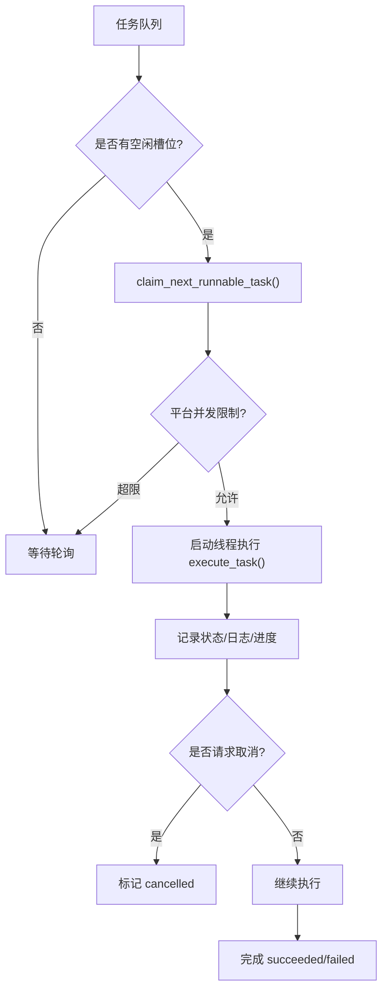
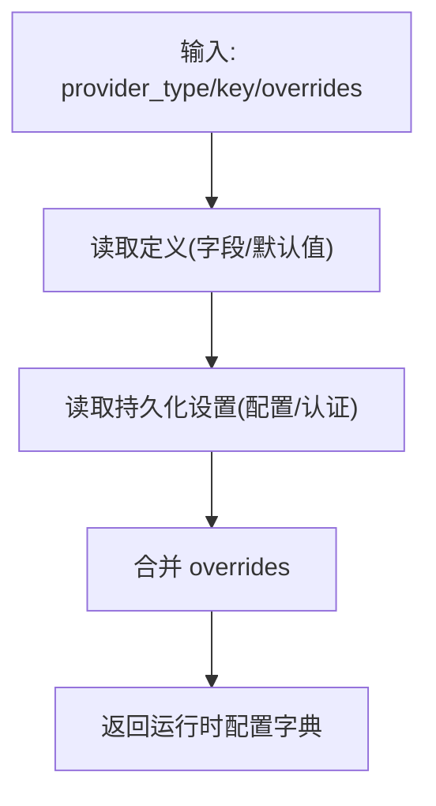
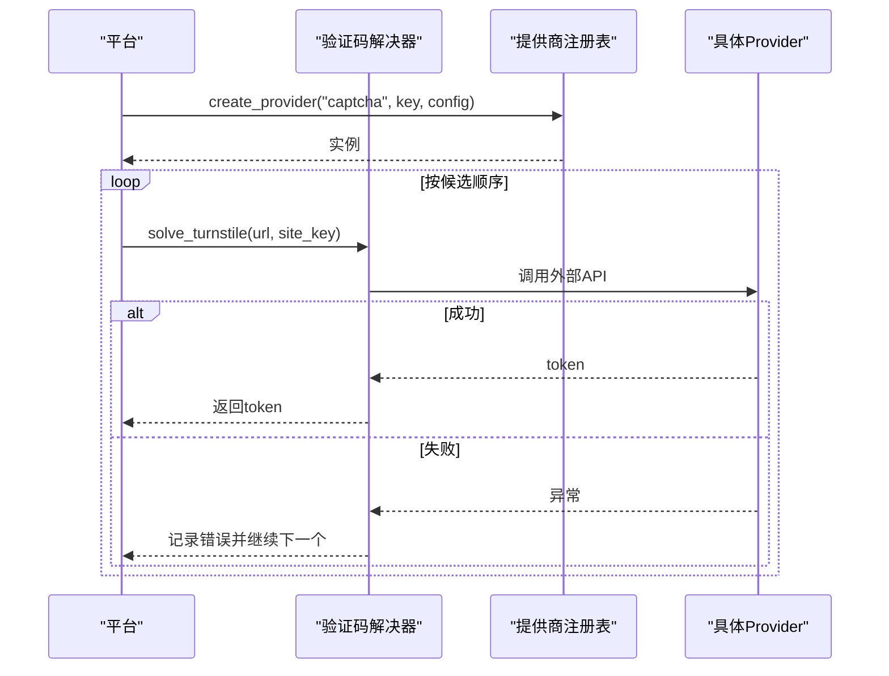
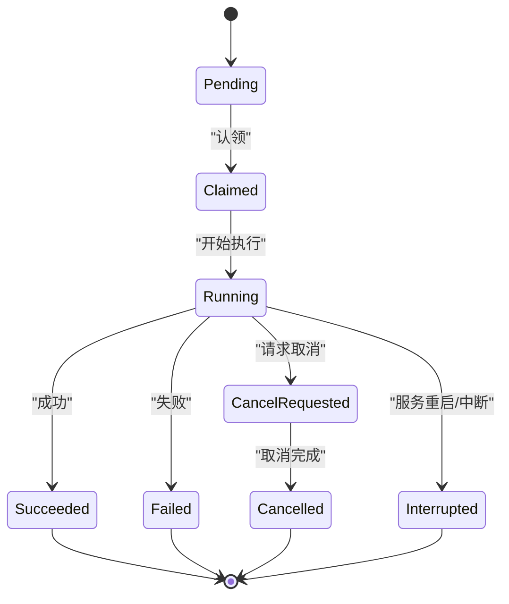
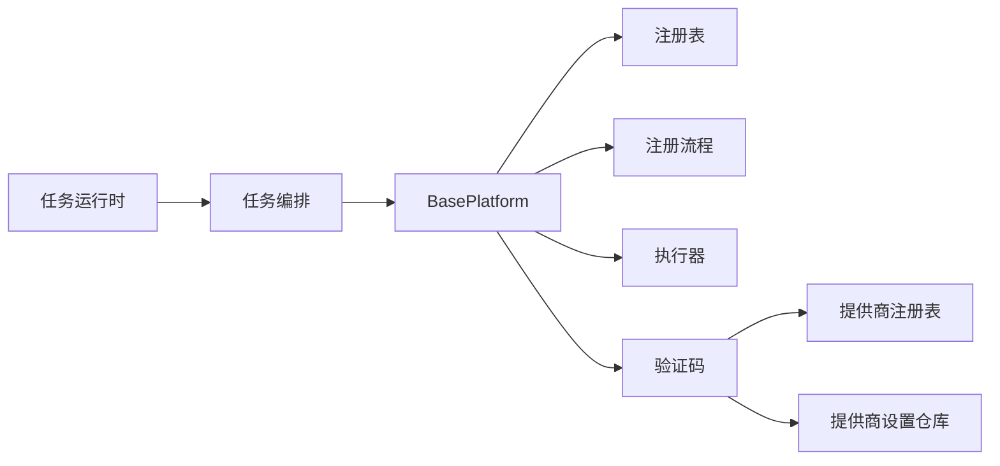

# 核心概念

<cite>
**本文引用的文件**
- [core/base_platform.py](file://core/base_platform.py)
- [core/registration/adapters.py](file://core/registration/adapters.py)
- [core/registration/flows.py](file://core/registration/flows.py)
- [core/registry.py](file://core/registry.py)
- [core/scheduler.py](file://core/scheduler.py)
- [core/config_store.py](file://core/config_store.py)
- [providers/registry.py](file://providers/registry.py)
- [core/executors/protocol.py](file://core/executors/protocol.py)
- [core/executors/playwright.py](file://core/executors/playwright.py)
- [core/base_captcha.py](file://core/base_captcha.py)
- [platforms/chatgpt/plugin.py](file://platforms/chatgpt/plugin.py)
- [application/tasks.py](file://application/tasks.py)
- [services/task_runtime.py](file://services/task_runtime.py)
- [infrastructure/provider_settings_repository.py](file://infrastructure/provider_settings_repository.py)
</cite>

## 目录
1. [简介](#简介)
2. [项目结构](#项目结构)
3. [核心组件](#核心组件)
4. [架构总览](#架构总览)
5. [详细组件分析](#详细组件分析)
6. [依赖关系分析](#依赖关系分析)
7. [性能考量](#性能考量)
8. [故障排查指南](#故障排查指南)
9. [结论](#结论)
10. [附录：扩展指南](#附录：扩展指南)

## 简介
本文件深入解析 Any Auto Register 系统的核心概念与设计模式，重点覆盖：
- 平台适配器模式与 BasePlatform 基类设计思想、插件注册机制、动态加载实现
- 任务调度系统：任务生命周期、执行器类型（浏览器 vs 协议）、并发控制
- 配置管理系统：运行时配置更新、配置验证、默认值管理
- 外部服务集成模式：提供商抽象、错误处理、重试机制
- 实践指导：如何扩展新平台与集成新的服务提供商

## 项目结构
系统采用分层与模块化组织：
- core：平台基类、注册流程、执行器、调度、配置等核心能力
- platforms：各平台插件实现（如 ChatGPT）
- providers：外部服务提供者（验证码、邮箱、短信、代理）的统一注册与工厂
- application：API 层与任务编排逻辑
- infrastructure：持久化仓库（配置、设置、定义等）
- services：运行时服务（任务运行器、求解器等）

图表来源
- [core/base_platform.py:44-160](file://core/base_platform.py#L44-L160)
- [core/registry.py:25-38](file://core/registry.py#L25-L38)
- [core/registration/flows.py:18-142](file://core/registration/flows.py#L18-L142)
- [core/executors/protocol.py:6-45](file://core/executors/protocol.py#L6-L45)
- [core/executors/playwright.py:5-134](file://core/executors/playwright.py#L5-L134)
- [core/base_captcha.py:67-98](file://core/base_captcha.py#L67-L98)
- [providers/registry.py:70-91](file://providers/registry.py#L70-L91)
- [infrastructure/provider_settings_repository.py:39-55](file://infrastructure/provider_settings_repository.py#L39-L55)
- [application/tasks.py:570-595](file://application/tasks.py#L570-L595)
- [services/task_runtime.py:18-85](file://services/task_runtime.py#L18-L85)

章节来源
- [core/base_platform.py:44-160](file://core/base_platform.py#L44-L160)
- [core/registry.py:25-38](file://core/registry.py#L25-L38)
- [core/registration/flows.py:18-142](file://core/registration/flows.py#L18-L142)
- [core/executors/protocol.py:6-45](file://core/executors/protocol.py#L6-L45)
- [core/executors/playwright.py:5-134](file://core/executors/playwright.py#L5-L134)
- [core/base_captcha.py:67-98](file://core/base_captcha.py#L67-L98)
- [providers/registry.py:70-91](file://providers/registry.py#L70-L91)
- [infrastructure/provider_settings_repository.py:39-55](file://infrastructure/provider_settings_repository.py#L39-L55)
- [application/tasks.py:570-595](file://application/tasks.py#L570-L595)
- [services/task_runtime.py:18-85](file://services/task_runtime.py#L18-L85)

## 核心组件
- 平台基类 BasePlatform：统一注册入口、执行器选择、身份提供者选择、验证码解决器选择、能力声明与动作分发。
- 注册适配器与流程：BrowserRegistrationAdapter/ProtocolMailboxAdapter/ProtocolOAuthAdapter 配合 Flow 完成不同注册路径。
- 执行器：ProtocolExecutor（HTTP 协议）与 PlaywrightExecutor（浏览器 headless/headed）。
- 提供商注册表：统一发现与工厂创建验证码、邮箱、短信、代理等外部服务。
- 任务系统：任务创建、认领、执行、日志、取消、进度、并发控制。
- 配置管理：KV 配置存储 + 提供商设置仓库（定义+默认值+运行时覆盖）。
- 定时调度：trial 到期检测、账号有效性批量检查。

章节来源
- [core/base_platform.py:44-160](file://core/base_platform.py#L44-L160)
- [core/registration/adapters.py:28-59](file://core/registration/adapters.py#L28-L59)
- [core/registration/flows.py:18-142](file://core/registration/flows.py#L18-L142)
- [core/executors/protocol.py:6-45](file://core/executors/protocol.py#L6-L45)
- [core/executors/playwright.py:5-134](file://core/executors/playwright.py#L5-L134)
- [providers/registry.py:38-62](file://providers/registry.py#L38-L62)
- [application/tasks.py:174-240](file://application/tasks.py#L174-L240)
- [core/config_store.py:13-49](file://core/config_store.py#L13-L49)
- [core/scheduler.py:19-115](file://core/scheduler.py#L19-L115)

## 架构总览
系统以“平台插件 + 注册流程 + 执行器 + 提供商”为核心，通过任务系统驱动注册与校验，配置与设置提供运行时弹性。

图表来源
- [services/task_runtime.py:47-85](file://services/task_runtime.py#L47-L85)
- [application/tasks.py:570-595](file://application/tasks.py#L570-L595)
- [core/base_platform.py:124-160](file://core/base_platform.py#L124-L160)
- [core/registration/flows.py:18-142](file://core/registration/flows.py#L18-L142)
- [core/registration/adapters.py:28-59](file://core/registration/adapters.py#L28-L59)
- [core/executors/protocol.py:6-45](file://core/executors/protocol.py#L6-L45)
- [core/executors/playwright.py:5-134](file://core/executors/playwright.py#L5-L134)
- [providers/registry.py:70-91](file://providers/registry.py#L70-L91)

## 详细组件分析

### 平台适配器模式与 BasePlatform
- 设计思想
  - 将“平台差异”封装在适配器中，BasePlatform 负责策略选择（执行器、身份提供者、验证码），并通过注册流程统一编排。
  - 支持三种执行器：protocol（HTTP）、headless/headed（浏览器），以及 OAuth 流程复用本地浏览器会话。
- 关键职责
  - 注册入口 register()：根据 executor_type 和 identity_provider 路由到 Browser/Protocol/OAuth 流程。
  - 执行器创建 _make_executor()：按配置选择 ProtocolExecutor 或 PlaywrightExecutor。
  - 验证码解决器 _make_captcha()/solve_turnstile_with_fallback()：支持多 provider 候选与回退。
  - 身份提供者 _resolve_identity()：支持 mailbox 与 oauth_browser。
  - 能力与动作：capabilities 声明标准能力，execute_action() 分派到具体实现。
- 数据模型
  - Account：平台账号实体，包含 email/password/user_id/token/status/extra 等。
  - RegisterConfig：注册任务配置，包含 executor_type/captcha_solver/proxy/extra。

图表来源
- [core/base_platform.py:44-160](file://core/base_platform.py#L44-L160)
- [core/registration/adapters.py:28-59](file://core/registration/adapters.py#L28-L59)

章节来源
- [core/base_platform.py:44-160](file://core/base_platform.py#L44-L160)
- [core/registration/adapters.py:28-59](file://core/registration/adapters.py#L28-L59)

### 插件注册机制与动态加载
- 平台插件注册表
  - 使用装饰器 @register 将平台类加入全局注册表。
  - load_all() 自动扫描 platforms/ 下每个子包的 plugin 模块并导入，触发注册。
  - get(name) 获取平台类；list_platforms() 返回平台元信息与能力。
- 能力同步
  - 启动时将平台类上的 capabilities 等属性同步至数据库，保证运行时可查询与覆盖。

图表来源
- [core/registry.py:25-38](file://core/registry.py#L25-L38)
- [core/registry.py:64-107](file://core/registry.py#L64-L107)

章节来源
- [core/registry.py:25-38](file://core/registry.py#L25-L38)
- [core/registry.py:64-107](file://core/registry.py#L64-L107)

### 注册流程与适配器协作
- 浏览器注册流程
  - 支持 OTP/链接等待、手机号回调、验证码注入、OAuth 复用本地浏览器。
  - 通过 BrowserRegistrationFlow 协调 worker 构建与 runner 执行。
- 协议邮箱注册流程
  - 通过 ProtocolMailboxFlow 构建 worker（基于 HTTP 或浏览器），可选启用验证码。
- OAuth 流程
  - 通过 ProtocolOAuthFlow 直接执行 OAuth 登录并映射结果。

图表来源
- [core/registration/flows.py:18-79](file://core/registration/flows.py#L18-L79)
- [core/registration/adapters.py:28-38](file://core/registration/adapters.py#L28-L38)

章节来源
- [core/registration/flows.py:18-79](file://core/registration/flows.py#L18-L79)
- [core/registration/adapters.py:28-38](file://core/registration/adapters.py#L28-L38)

### 执行器类型与并发控制
- 执行器
  - ProtocolExecutor：基于 curl_cffi 的 HTTP 客户端，支持代理、UA 伪装、Cookie 管理。
  - PlaywrightExecutor：基于 Playwright 的浏览器自动化，支持 headless/headed、超时、JS 执行、元素操作。
- 并发控制
  - TaskRuntime：维护最大并行任务数、每平台并行限制、工作线程回收。
  - Tasks：任务状态机（pending/claimed/running/succeeded/failed/interrupted/cancelled），任务级锁、取消请求、进度上报。
  - 账号级互斥：通过 busy_account_keys 避免同一账号被并发处理。

图表来源
- [services/task_runtime.py:47-85](file://services/task_runtime.py#L47-L85)
- [application/tasks.py:340-368](file://application/tasks.py#L340-L368)
- [application/tasks.py:371-458](file://application/tasks.py#L371-L458)

章节来源
- [core/executors/protocol.py:6-45](file://core/executors/protocol.py#L6-L45)
- [core/executors/playwright.py:5-134](file://core/executors/playwright.py#L5-L134)
- [services/task_runtime.py:18-85](file://services/task_runtime.py#L18-L85)
- [application/tasks.py:340-368](file://application/tasks.py#L340-L368)
- [application/tasks.py:371-458](file://application/tasks.py#L371-L458)

### 配置管理系统
- 全局配置存储
  - ConfigStore：SQLite 键值存储，支持 get/set/get_all/set_many。
- 提供商设置仓库
  - ProviderSettingsRepository：从定义（字段、默认值）+ 持久化设置 + 运行时覆盖 三层合并得到最终配置。
  - 支持 enabled 列表排序、默认 provider 选择、删除时默认迁移。
- 运行时配置更新
  - create_captcha_solver() 与 _prepare_captcha_provider() 在运行时按需初始化本地求解器。
  - resolve_runtime_settings() 将定义默认值、DB 配置、额外参数合并。

图表来源
- [core/config_store.py:13-49](file://core/config_store.py#L13-L49)
- [infrastructure/provider_settings_repository.py:39-55](file://infrastructure/provider_settings_repository.py#L39-L55)
- [core/base_captcha.py:67-98](file://core/base_captcha.py#L67-L98)

章节来源
- [core/config_store.py:13-49](file://core/config_store.py#L13-L49)
- [infrastructure/provider_settings_repository.py:39-55](file://infrastructure/provider_settings_repository.py#L39-L55)
- [core/base_captcha.py:67-98](file://core/base_captcha.py#L67-L98)

### 外部服务集成模式
- 提供商抽象
  - providers.registry：统一注册表与工厂，支持 captcha/mailbox/sms/proxy 四类。
  - 通过 from_config(config) 创建实例，便于解耦与测试。
- 错误处理与重试
  - solve_turnstile_with_fallback()：按候选顺序尝试多个验证码 provider，收集错误并抛出汇总异常。
  - 任务执行中捕获异常并记录错误，支持代理失败反馈与重试（如 HeroSMS 模式）。
- 重试机制
  - 任务层面：支持取消、中断恢复、重试补单（例如 Herosms 的号码复用与额外成功目标）。
  - 代理池：成功/失败反馈用于后续选择更优代理。

图表来源
- [providers/registry.py:51-62](file://providers/registry.py#L51-L62)
- [core/base_captcha.py:48-98](file://core/base_captcha.py#L48-L98)
- [core/base_platform.py:412-430](file://core/base_platform.py#L412-L430)

章节来源
- [providers/registry.py:38-62](file://providers/registry.py#L38-L62)
- [core/base_captcha.py:48-98](file://core/base_captcha.py#L48-L98)
- [core/base_platform.py:412-430](file://core/base_platform.py#L412-L430)

### 任务调度系统
- 任务生命周期
  - 创建(create_task/create_register_task) → 认领(claim_next_runnable_task) → 执行(execute_task) → 结束(finish)。
  - 事件与日志：append_task_event/TaskLogger 记录状态变更与详细信息。
- 执行器类型
  - protocol：HTTP 协议，适合无头快速注册。
  - headless/headed：浏览器自动化，适合复杂交互与 OAuth 复用。
- 并发控制
  - TaskRuntime 控制全局并行与每平台并行上限。
  - 账号级互斥避免重复操作同一账号。
- 定时任务
  - Scheduler 每小时检查 trial 到期并更新状态；支持批量账号有效性检查。

图表来源
- [application/tasks.py:31-50](file://application/tasks.py#L31-L50)
- [application/tasks.py:174-240](file://application/tasks.py#L174-L240)
- [application/tasks.py:340-368](file://application/tasks.py#L340-L368)
- [application/tasks.py:371-458](file://application/tasks.py#L371-L458)
- [core/scheduler.py:44-63](file://core/scheduler.py#L44-L63)

章节来源
- [application/tasks.py:31-50](file://application/tasks.py#L31-L50)
- [application/tasks.py:174-240](file://application/tasks.py#L174-L240)
- [application/tasks.py:340-368](file://application/tasks.py#L340-L368)
- [application/tasks.py:371-458](file://application/tasks.py#L371-L458)
- [core/scheduler.py:44-63](file://core/scheduler.py#L44-L63)

## 依赖关系分析
- 松耦合
  - BasePlatform 通过适配器与流程解耦具体平台实现。
  - 提供商通过统一注册表与工厂解耦具体实现。
- 内聚性
  - 任务编排集中在 application/tasks.py，运行时在 services/task_runtime.py。
  - 配置与设置在 infrastructure 层集中管理。
- 外部依赖
  - curl_cffi、Playwright 作为执行器后端。
  - SQLModel 用于 SQLite 持久化。
  - 第三方验证码/邮箱/短信/代理服务通过 providers 抽象接入。

图表来源
- [core/base_platform.py:44-160](file://core/base_platform.py#L44-L160)
- [core/registry.py:25-38](file://core/registry.py#L25-L38)
- [core/registration/flows.py:18-142](file://core/registration/flows.py#L18-L142)
- [core/executors/protocol.py:6-45](file://core/executors/protocol.py#L6-L45)
- [core/executors/playwright.py:5-134](file://core/executors/playwright.py#L5-L134)
- [core/base_captcha.py:67-98](file://core/base_captcha.py#L67-L98)
- [providers/registry.py:70-91](file://providers/registry.py#L70-L91)
- [infrastructure/provider_settings_repository.py:39-55](file://infrastructure/provider_settings_repository.py#L39-L55)
- [application/tasks.py:570-595](file://application/tasks.py#L570-L595)
- [services/task_runtime.py:18-85](file://services/task_runtime.py#L18-L85)

章节来源
- [core/base_platform.py:44-160](file://core/base_platform.py#L44-L160)
- [core/registry.py:25-38](file://core/registry.py#L25-L38)
- [core/registration/flows.py:18-142](file://core/registration/flows.py#L18-L142)
- [core/executors/protocol.py:6-45](file://core/executors/protocol.py#L6-L45)
- [core/executors/playwright.py:5-134](file://core/executors/playwright.py#L5-L134)
- [core/base_captcha.py:67-98](file://core/base_captcha.py#L67-L98)
- [providers/registry.py:70-91](file://providers/registry.py#L70-L91)
- [infrastructure/provider_settings_repository.py:39-55](file://infrastructure/provider_settings_repository.py#L39-L55)
- [application/tasks.py:570-595](file://application/tasks.py#L570-L595)
- [services/task_runtime.py:18-85](file://services/task_runtime.py#L18-L85)

## 性能考量
- 执行器选择
  - 协议执行器轻量高效，适合批量注册；浏览器执行器资源消耗高但兼容复杂页面。
- 并发与限流
  - 通过 TaskRuntime 的全局与平台级并行限制避免过载；账号级互斥防止冲突。
- 验证码回退
  - 多 provider 候选顺序与失败回退提升成功率与鲁棒性。
- 代理池
  - 成功/失败反馈优化代理选择，降低网络错误率。
- 配置合并
  - 定义默认值 + DB 配置 + 运行时覆盖，减少冷启动成本与配置漂移。

[本节为通用性能建议，不直接分析具体文件]

## 故障排查指南
- 未找到可用验证码 provider
  - 现象：抛出“未找到可用的 Turnstile 验证码 provider”。
  - 排查：确认已启用至少一个验证码 provider，且配置完整（密钥等）。
  - 参考：_get_captcha_solver_candidates()/create_captcha_solver()。
- 浏览器模式未配置默认验证码 provider
  - 现象：headless/headed 模式报错。
  - 排查：在设置页启用并设为默认 provider。
  - 参考：_resolve_captcha_solver()。
- 平台未实现某能力
  - 现象：execute_action() 抛出 NotImplementedError。
  - 排查：平台需实现对应 capability 或自定义 _execute_platform_action。
  - 参考：BasePlatform.execute_action()/capability 分发。
- 任务被中断
  - 现象：服务重启后任务标记为 interrupted。
  - 排查：检查 mark_incomplete_tasks_interrupted() 行为与任务状态。
  - 参考：application/tasks.py 相关函数。
- 代理失败
  - 现象：注册失败并记录代理失败。
  - 排查：使用 proxy_pool.report_fail() 反馈，观察后续选择。
  - 参考：application/tasks.py 中的代理反馈逻辑。

章节来源
- [core/base_platform.py:345-352](file://core/base_platform.py#L345-L352)
- [core/base_platform.py:412-430](file://core/base_platform.py#L412-L430)
- [core/base_captcha.py:67-98](file://core/base_captcha.py#L67-L98)
- [application/tasks.py:296-316](file://application/tasks.py#L296-L316)
- [application/tasks.py:750-790](file://application/tasks.py#L750-L790)

## 结论
Any Auto Register 通过平台适配器模式、统一的注册流程与执行器抽象、健壮的提供商集成与配置管理、以及完善的任务调度与并发控制，实现了可扩展、可维护、高可用的多平台自动化注册系统。其设计兼顾了理论深度与实践价值，便于快速扩展新平台与新服务提供商。

[本节为总结，不直接分析具体文件]

## 附录：扩展指南

### 扩展新平台（以 ChatGPT 为例）
- 步骤
  - 在 platforms/<your_platform>/plugin.py 中定义平台类，继承 BasePlatform，使用 @register 装饰器注册。
  - 声明 supported_executors、supported_identity_modes、capabilities 等能力。
  - 实现 check_valid()、build_*_adapter()（浏览器/协议/OAuth）、_map_*_result() 等。
  - 如需自定义动作，重写 _execute_platform_action() 或覆盖 _handle_*()。
- 关键点
  - 适配器需返回 RegistrationResult，包含 email/password/user_id/token/status/extra。
  - 若使用 OAuth，确保 capability.oauth_allowed_executor_types 与浏览器复用要求。
  - 通过 PlatformRuntime 与 TaskRuntime 集成任务执行。

章节来源
- [platforms/chatgpt/plugin.py:48-225](file://platforms/chatgpt/plugin.py#L48-L225)
- [core/base_platform.py:44-160](file://core/base_platform.py#L44-L160)
- [core/registration/adapters.py:28-59](file://core/registration/adapters.py#L28-L59)
- [core/registry.py:19-38](file://core/registry.py#L19-L38)

### 集成新的服务提供商（以验证码为例）
- 步骤
  - 在 providers/captcha/ 下实现具体类，实现 BaseCaptcha 接口（solve_turnstile/solve_image）。
  - 使用 @register_provider("captcha", "your_driver") 注册。
  - 在基础设施中定义 provider 字段与默认值（ProviderDefinitionsRepository）。
  - 在 ProviderSettingsRepository 中配置启用与默认项。
  - 在 BasePlatform 中通过 create_captcha_solver() 与 solve_turnstile_with_fallback() 使用。
- 关键点
  - 确保 from_config(config) 存在，以便工厂创建实例。
  - 支持多 provider 候选与回退，提升稳定性。
  - 运行时配置合并：定义默认值 + DB 配置 + 任务 extra 覆盖。

章节来源
- [providers/registry.py:38-62](file://providers/registry.py#L38-L62)
- [providers/registry.py:70-91](file://providers/registry.py#L70-L91)
- [core/base_captcha.py:67-98](file://core/base_captcha.py#L67-L98)
- [infrastructure/provider_settings_repository.py:39-55](file://infrastructure/provider_settings_repository.py#L39-L55)
- [core/base_platform.py:412-430](file://core/base_platform.py#L412-L430)