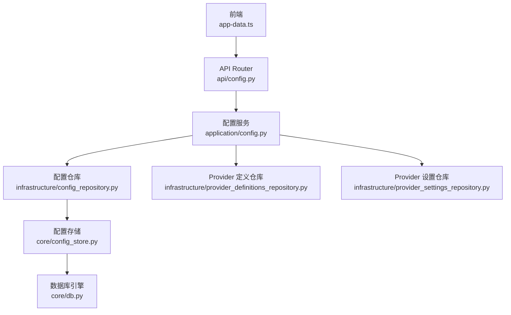
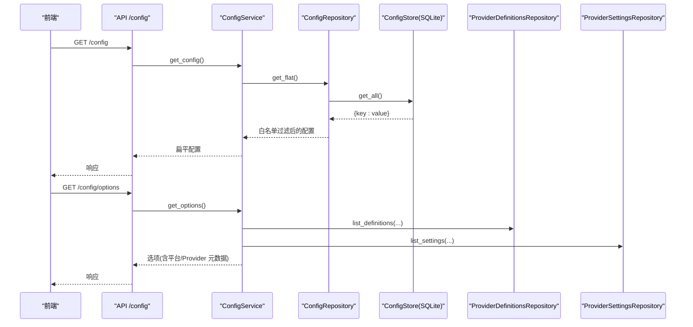
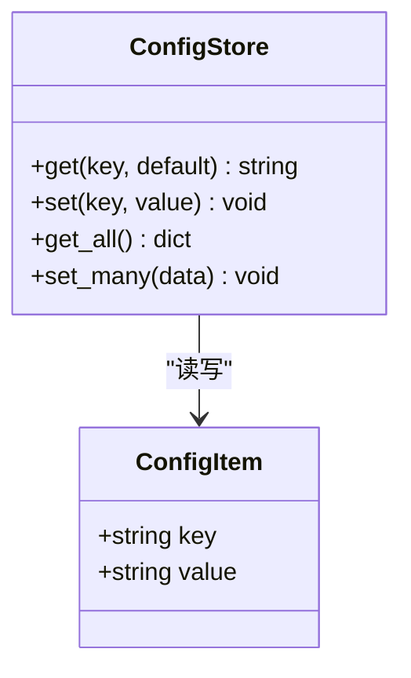
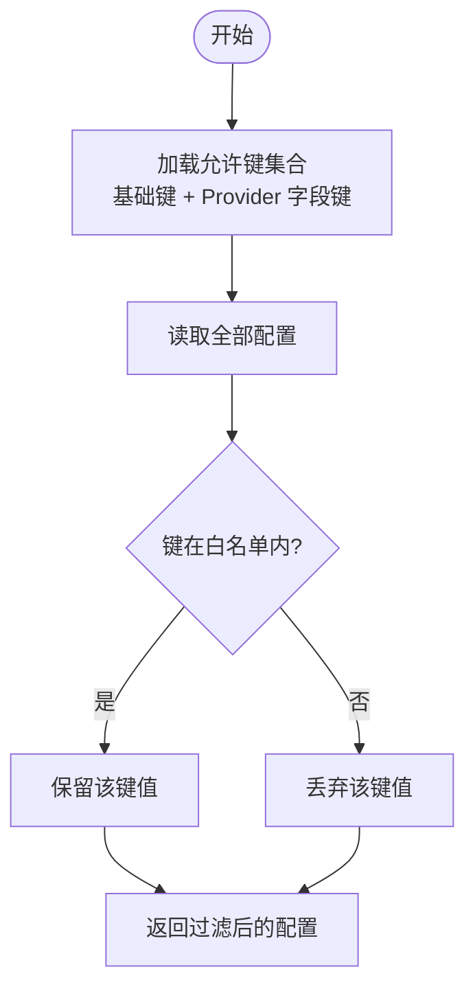
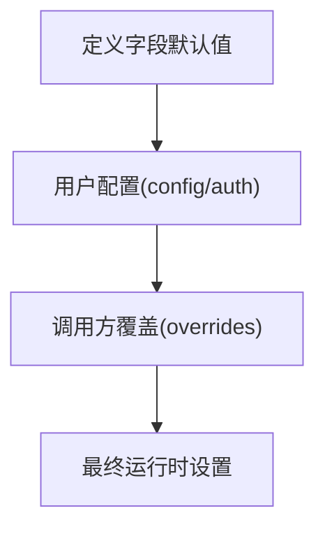
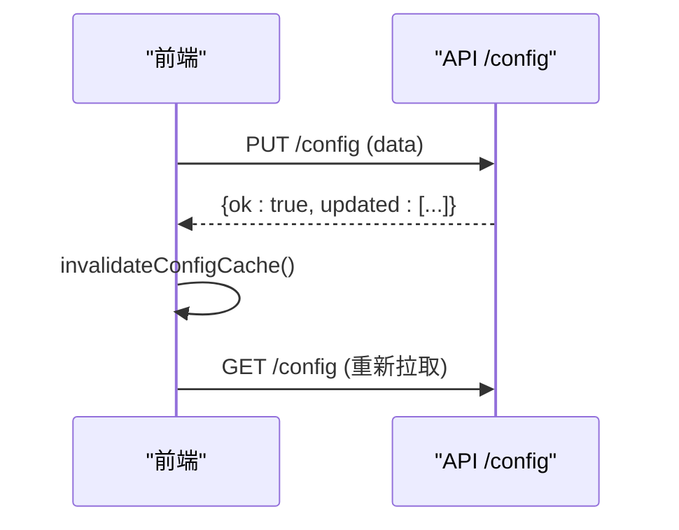
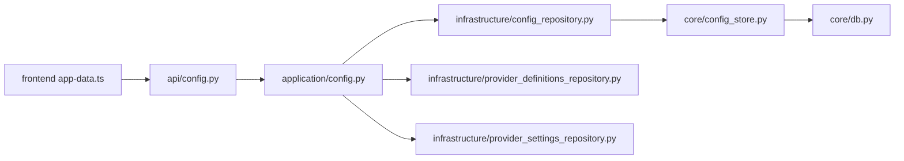

# 配置管理系统

<cite>
**本文引用的文件**
- [main.py](file://main.py)
- [core/config_store.py](file://core/config_store.py)
- [core/db.py](file://core/db.py)
- [infrastructure/config_repository.py](file://infrastructure/config_repository.py)
- [application/config.py](file://application/config.py)
- [api/config.py](file://api/config.py)
- [infrastructure/provider_definitions_repository.py](file://infrastructure/provider_definitions_repository.py)
- [infrastructure/provider_settings_repository.py](file://infrastructure/provider_settings_repository.py)
- [application/provider_settings.py](file://application/provider_settings.py)
- [frontend/src/lib/app-data.ts](file://frontend/src/lib/app-data.ts)
</cite>

## 目录
1. [简介](#简介)
2. [项目结构](#项目结构)
3. [核心组件](#核心组件)
4. [架构总览](#架构总览)
5. [详细组件分析](#详细组件分析)
6. [依赖关系分析](#依赖关系分析)
7. [性能与可扩展性](#性能与可扩展性)
8. [故障排查指南](#故障排查指南)
9. [结论](#结论)
10. [附录：使用示例与最佳实践](#附录：使用示例与最佳实践)

## 简介
本文件深入解析 Any Auto Register 的配置管理系统设计，覆盖以下方面：
- 配置存储机制：SQLite 持久化、键值模型、白名单校验。
- 运行时配置更新：热重载（前端缓存失效）、配置验证（白名单/类型转换）、默认值管理（Provider 字段默认值）。
- 配置层次结构：全局配置、平台能力覆盖、Provider 设置（邮箱/验证码/SMS/代理）的作用域与优先级。
- 配置验证机制：白名单过滤、类型转换、业务规则校验、错误提示。
- 变更通知与事件：前端缓存失效、后端服务启动时初始化与种子数据同步。
- 实用示例：读取、修改、验证各类配置项的端到端流程。

## 项目结构
配置相关代码按层划分清晰：
- API 层：暴露 /config 等接口，接收并返回扁平化的配置键值对及选项。
- 应用服务层：聚合仓库与 Provider 定义/设置服务，提供统一配置访问与选项组装。
- 基础设施层：仓库负责从 SQLite 读取/写入配置，以及 Provider 定义与设置的增删改查。
- 核心存储层：基于 SQLModel 的轻量 KV 表 configs，用于系统级全局配置。
- 前端：通过缓存策略拉取配置与选项，并在更新后主动失效缓存以“热重载”。

**图表来源**
- [api/config.py:1-29](file://api/config.py#L1-L29)
- [application/config.py:1-38](file://application/config.py#L1-L38)
- [infrastructure/config_repository.py:1-44](file://infrastructure/config_repository.py#L1-L44)
- [core/config_store.py:1-49](file://core/config_store.py#L1-L49)
- [core/db.py:16-23](file://core/db.py#L16-L23)
- [infrastructure/provider_definitions_repository.py:387-474](file://infrastructure/provider_definitions_repository.py#L387-L474)
- [infrastructure/provider_settings_repository.py:39-55](file://infrastructure/provider_settings_repository.py#L39-L55)

**章节来源**
- [main.py:67-121](file://main.py#L67-L121)
- [api/config.py:1-29](file://api/config.py#L1-L29)
- [application/config.py:1-38](file://application/config.py#L1-L38)
- [infrastructure/config_repository.py:1-44](file://infrastructure/config_repository.py#L1-L44)
- [core/config_store.py:1-49](file://core/config_store.py#L1-L49)
- [core/db.py:16-23](file://core/db.py#L16-L23)

## 核心组件
- 配置存储（KV 表）：提供 get/set/get_all/set_many 等原子操作，所有值以字符串形式持久化。
- 配置仓库：维护允许写入的键集合（白名单），将任意输入过滤为安全子集后落库；读取时仅返回允许的键。
- 配置服务：对外暴露获取配置、更新配置、获取配置选项（包含 Provider 定义与设置信息）。
- Provider 定义仓库：内置多种 Provider 元数据（字段、认证模式、默认值等），启动时确保种子数据同步到数据库。
- Provider 设置仓库：按 provider_type/provider_key 保存用户配置，支持运行时合并默认值、用户配置与调用方覆盖。
- 前端缓存：对 /config 和 /config/options 做短期缓存，并提供失效方法实现“热重载”。

**章节来源**
- [core/config_store.py:7-49](file://core/config_store.py#L7-L49)
- [infrastructure/config_repository.py:7-44](file://infrastructure/config_repository.py#L7-L44)
- [application/config.py:9-38](file://application/config.py#L9-L38)
- [infrastructure/provider_definitions_repository.py:387-474](file://infrastructure/provider_definitions_repository.py#L387-L474)
- [infrastructure/provider_settings_repository.py:39-55](file://infrastructure/provider_settings_repository.py#L39-L55)
- [frontend/src/lib/app-data.ts:49-95](file://frontend/src/lib/app-data.ts#L49-L95)

## 架构总览
配置读写路径与选项生成路径如下：

**图表来源**
- [api/config.py:16-28](file://api/config.py#L16-L28)
- [application/config.py:16-38](file://application/config.py#L16-L38)
- [infrastructure/config_repository.py:30-44](file://infrastructure/config_repository.py#L30-L44)
- [core/config_store.py:31-45](file://core/config_store.py#L31-L45)
- [infrastructure/provider_definitions_repository.py:437-474](file://infrastructure/provider_definitions_repository.py#L437-L474)
- [infrastructure/provider_settings_repository.py:12-14](file://infrastructure/provider_settings_repository.py#L12-L14)

## 详细组件分析

### 配置存储与持久化（configs 表）
- 模型：单表 KV，主键 key，值 value 为字符串。
- 操作：
  - 读取单个键（带默认值）。
  - 批量读取全部键。
  - 单条/批量写入（存在则更新，不存在则插入）。
- 数据库连接：通过 engine 创建，默认指向应用根目录下的 SQLite 文件，可通过环境变量覆盖。

**图表来源**
- [core/config_store.py:7-49](file://core/config_store.py#L7-L49)
- [core/db.py:16-23](file://core/db.py#L16-L23)

**章节来源**
- [core/config_store.py:7-49](file://core/config_store.py#L7-L49)
- [core/db.py:16-23](file://core/db.py#L16-L23)

### 配置仓库与白名单校验
- 白名单来源：
  - 基础键集合（如执行器、身份/OAuth、Chrome 路径、CPA/Team Manager/Any2API 等）。
  - 动态扩展：遍历各 Provider 类型的定义字段，将其 field.key 加入允许列表。
- 读取：从存储中取出全部键值，再按白名单过滤返回。
- 写入：先计算允许键集合，仅保留合法键值对后批量写入。

**图表来源**
- [infrastructure/config_repository.py:7-44](file://infrastructure/config_repository.py#L7-L44)
- [infrastructure/provider_definitions_repository.py:437-474](file://infrastructure/provider_definitions_repository.py#L437-L474)

**章节来源**
- [infrastructure/config_repository.py:7-44](file://infrastructure/config_repository.py#L7-L44)

### 配置服务与选项生成
- 获取配置：委托仓库返回扁平配置。
- 更新配置：委托仓库进行白名单过滤与批量写入，返回已更新的键列表。
- 获取选项：聚合平台选择项、Provider 定义（启用）、驱动模板、验证码策略与各类型 Provider 设置。

**章节来源**
- [application/config.py:9-38](file://application/config.py#L9-L38)
- [application/provider_settings.py:7-52](file://application/provider_settings.py#L7-L52)

### Provider 定义与设置（邮箱/验证码/SMS/代理）
- 定义（Definition）：描述 Provider 的元数据，包括 label、description、driver_type、auth_modes、fields（含 key、label、placeholder、secret、type、hint 等）。
- 设置（Setting）：用户针对某个 provider_key 的具体配置，包含 config/auth/metadata，并可标记是否启用、是否为默认。
- 运行时合并：
  - 先从定义字段中收集默认值。
  - 再叠加用户配置的 config 与 auth。
  - 最后叠加调用方传入的 overrides（任务级覆盖）。

**图表来源**
- [infrastructure/provider_settings_repository.py:39-55](file://infrastructure/provider_settings_repository.py#L39-L55)
- [infrastructure/provider_definitions_repository.py:17-384](file://infrastructure/provider_definitions_repository.py#L17-L384)

**章节来源**
- [infrastructure/provider_definitions_repository.py:17-384](file://infrastructure/provider_definitions_repository.py#L17-L384)
- [infrastructure/provider_settings_repository.py:39-55](file://infrastructure/provider_settings_repository.py#L39-L55)

### 配置层次结构与优先级
- 全局配置（系统级）：通过 configs 表存储，由 ConfigRepository 白名单控制可写范围。
- 平台能力覆盖：通过 PlatformCapabilityOverrideModel 记录每个平台的 capabilities 覆盖，启动时与类默认能力合并。
- Provider 设置：按 provider_type/provider_key 维度组织，支持默认项与启用顺序（如验证码策略）。
- 任务级覆盖：在调用 ProviderSettingsRepository.resolve_runtime_settings 时传入 overrides，优先级最高。

优先级顺序（低到高）：
1) 定义字段默认值
2) Provider 设置中的 config/auth
3) 任务级 overrides

**章节来源**
- [core/db.py:210-227](file://core/db.py#L210-L227)
- [core/registry.py:64-123](file://core/registry.py#L64-L123)
- [infrastructure/provider_settings_repository.py:39-55](file://infrastructure/provider_settings_repository.py#L39-L55)

### 配置验证机制
- 白名单校验：仅允许写入仓库中定义的键，防止注入非法配置。
- 类型转换：
  - 读取时统一转为字符串。
  - 业务侧提供 _bool_config/_int_config 等工具函数进行布尔/整数转换，具备容错默认值。
- 业务规则：
  - Provider 设置保存时校验是否存在对应定义，否则抛出异常。
  - 删除默认设置时自动提升下一个设置为默认，保证可用性。
- 错误提示：
  - 前端在创建/编辑 Provider 时进行必填校验与错误消息展示。
  - 后端在无效操作时抛出明确异常（如未知 provider）。

**章节来源**
- [infrastructure/config_repository.py:39-44](file://infrastructure/config_repository.py#L39-L44)
- [infrastructure/provider_settings_repository.py:109-167](file://infrastructure/provider_settings_repository.py#L109-L167)
- [application/tasks.py:617-629](file://application/tasks.py#L617-L629)
- [frontend/src/pages/Settings.tsx:947-977](file://frontend/src/pages/Settings.tsx#L947-L977)

### 运行时配置更新与热重载
- 后端：配置更新直接写入 SQLite，立即生效于后续读取。
- 前端：
  - 对 /config 与 /config/options 采用短期缓存（TTL）。
  - 提供 invalidateConfigCache/invalidateConfigOptionsCache 等方法，在配置变更后主动失效缓存，达到“热重载”效果。

**图表来源**
- [api/config.py:26-28](file://api/config.py#L26-L28)
- [frontend/src/lib/app-data.ts:59-68](file://frontend/src/lib/app-data.ts#L59-L68)
- [frontend/src/lib/app-data.ts:84-95](file://frontend/src/lib/app-data.ts#L84-L95)

**章节来源**
- [frontend/src/lib/app-data.ts:49-95](file://frontend/src/lib/app-data.ts#L49-L95)
- [api/config.py:16-28](file://api/config.py#L16-L28)

### 配置变更的通知机制与事件处理
- 启动期：
  - 初始化数据库、加载平台与 Provider、启动调度器与任务运行器等。
  - 确保 Provider 定义种子数据同步至数据库，保证字段/默认值与代码一致。
- 运行期：
  - 无服务端推送事件；前端通过缓存失效与轮询刷新实现“热重载”。
  - Provider 设置删除默认项时，自动提升下一项为默认，保持可用状态。

**章节来源**
- [main.py:67-91](file://main.py#L67-L91)
- [infrastructure/provider_definitions_repository.py:387-434](file://infrastructure/provider_definitions_repository.py#L387-L434)
- [infrastructure/provider_settings_repository.py:85-107](file://infrastructure/provider_settings_repository.py#L85-L107)

## 依赖关系分析
- API 路由依赖应用服务；应用服务依赖仓库；仓库依赖核心存储与数据库。
- Provider 定义与设置仓库相互协作：设置读取时会结合定义字段默认值。
- 前端依赖 API 与本地缓存；通过失效方法触发重新拉取。

**图表来源**
- [api/config.py:1-29](file://api/config.py#L1-L29)
- [application/config.py:1-38](file://application/config.py#L1-L38)
- [infrastructure/config_repository.py:1-44](file://infrastructure/config_repository.py#L1-L44)
- [core/config_store.py:1-49](file://core/config_store.py#L1-L49)
- [core/db.py:16-23](file://core/db.py#L16-L23)
- [infrastructure/provider_definitions_repository.py:387-474](file://infrastructure/provider_definitions_repository.py#L387-L474)
- [infrastructure/provider_settings_repository.py:12-55](file://infrastructure/provider_settings_repository.py#L12-L55)
- [frontend/src/lib/app-data.ts:49-95](file://frontend/src/lib/app-data.ts#L49-L95)

**章节来源**
- [main.py:94-121](file://main.py#L94-L121)
- [infrastructure/provider_settings_repository.py:12-55](file://infrastructure/provider_settings_repository.py#L12-L55)
- [infrastructure/provider_definitions_repository.py:387-474](file://infrastructure/provider_definitions_repository.py#L387-L474)

## 性能与可扩展性
- 读多写少场景优化：
  - 前端缓存减少重复请求。
  - 配置读取经白名单过滤，避免不必要的数据传输。
- 可扩展点：
  - 新增 Provider 时只需在定义中声明 fields，即可自动纳入白名单与表单渲染。
  - 可通过 ProviderSettingsRepository.resolve_runtime_settings 的 overrides 参数实现任务级细粒度覆盖。
- 建议：
  - 对敏感字段使用 secret 标记，避免在前端明文显示。
  - 合理设置 TTL，平衡实时性与网络开销。

[本节为通用指导，不直接分析具体文件]

## 故障排查指南
- 无法写入配置：
  - 检查键是否在白名单内（基础键或 Provider 字段 key）。
  - 确认 Provider 定义存在且 enabled。
- 配置未生效：
  - 前端是否调用了缓存失效方法。
  - 后端是否正确提交事务（SQLModel Session 自动 commit）。
- Provider 设置异常：
  - 保存时若定义不存在会抛异常，需先创建定义。
  - 删除默认设置后应自动提升下一项为默认。
- 数据库问题：
  - 检查 DATABASE_URL 环境变量是否指向期望的 SQLite 文件。
  - 启动时确保 init_db 完成，Provider 定义种子数据已同步。

**章节来源**
- [infrastructure/config_repository.py:39-44](file://infrastructure/config_repository.py#L39-L44)
- [infrastructure/provider_settings_repository.py:109-167](file://infrastructure/provider_settings_repository.py#L109-L167)
- [core/db.py:16-23](file://core/db.py#L16-L23)
- [main.py:67-91](file://main.py#L67-L91)

## 结论
该系统通过“白名单 + 定义驱动”的方式实现了安全、可扩展的配置管理：
- 全局配置通过 KV 表持久化，受严格白名单保护。
- Provider 配置以“定义+设置”分离，支持默认值、认证模式、字段 UI 提示等。
- 运行时通过合并策略实现灵活的优先级控制，满足全局、平台、Provider、任务级多层配置需求。
- 前端缓存失效机制提供了“热重载”体验，无需重启服务即可生效。

[本节为总结，不直接分析具体文件]

## 附录：使用示例与最佳实践

- 读取全局配置
  - 调用 GET /config，获得扁平键值对。
  - 前端通过 getConfig 拉取并缓存。
  - 参考路径：[api/config.py:16-18](file://api/config.py#L16-L18)、[frontend/src/lib/app-data.ts:84-88](file://frontend/src/lib/app-data.ts#L84-L88)

- 更新全局配置
  - 调用 PUT /config，提交 data 字典。
  - 后端白名单过滤后批量写入。
  - 前端调用 invalidateConfigCache 使缓存失效。
  - 参考路径：[api/config.py:26-28](file://api/config.py#L26-L28)、[frontend/src/lib/app-data.ts:59-63](file://frontend/src/lib/app-data.ts#L59-L63)

- 获取配置选项（用于渲染表单）
  - 调用 GET /config/options，返回平台/Provider 定义与设置等信息。
  - 参考路径：[application/config.py:23-38](file://application/config.py#L23-L38)、[frontend/src/lib/app-data.ts:91-95](file://frontend/src/lib/app-data.ts#L91-L95)

- 配置验证与默认值
  - 白名单校验：仅允许仓库定义的键写入。
  - 类型转换：使用 _bool_config/_int_config 进行容错转换。
  - 默认值：Provider 字段默认值在运行时合并。
  - 参考路径：[infrastructure/config_repository.py:39-44](file://infrastructure/config_repository.py#L39-L44)、[application/tasks.py:617-629](file://application/tasks.py#L617-L629)、[infrastructure/provider_settings_repository.py:39-55](file://infrastructure/provider_settings_repository.py#L39-L55)

- 任务级覆盖
  - 在调用 ProviderSettingsRepository.resolve_runtime_settings 时传入 overrides，优先级最高。
  - 参考路径：[infrastructure/provider_settings_repository.py:39-55](file://infrastructure/provider_settings_repository.py#L39-L55)

- 最佳实践
  - 使用 Provider 定义集中管理字段与默认值，便于前后端一致性。
  - 敏感字段使用 secret 标记，避免泄露。
  - 合理设置前端缓存 TTL，兼顾实时性与性能。
  - 删除默认 Provider 设置时，确保有备用默认项。

[本节为使用指引，不直接分析具体文件]