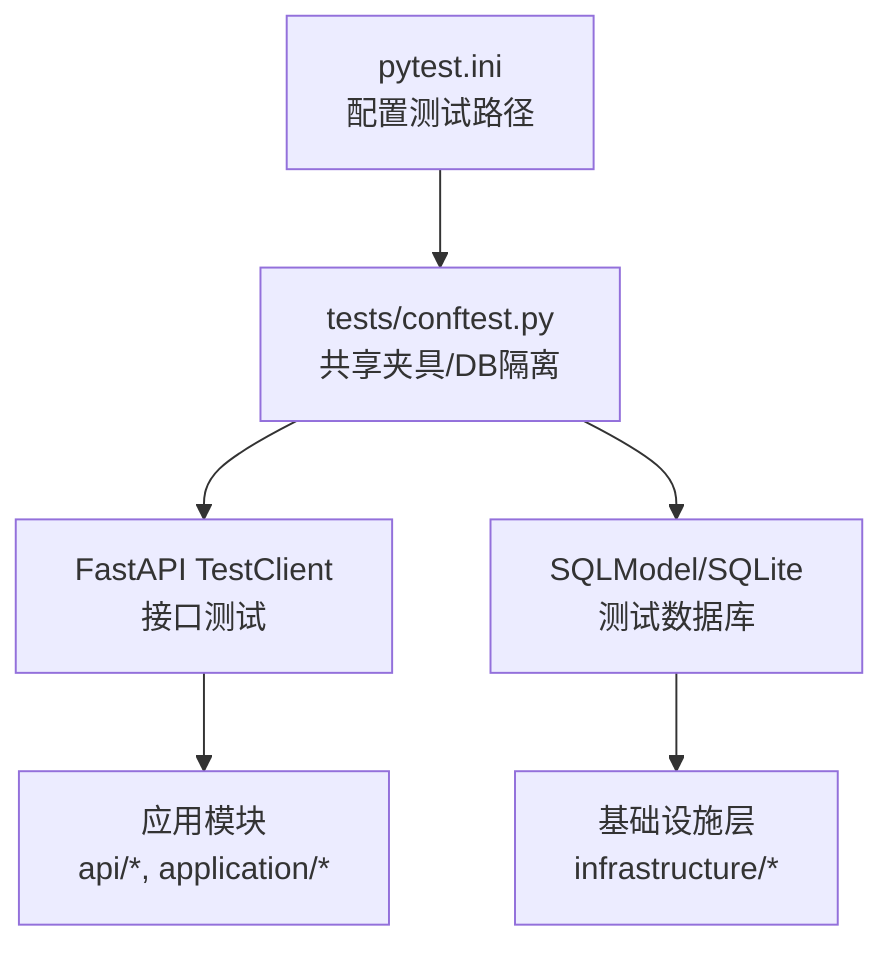
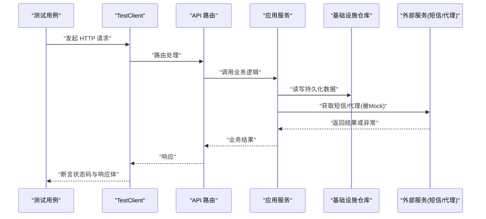
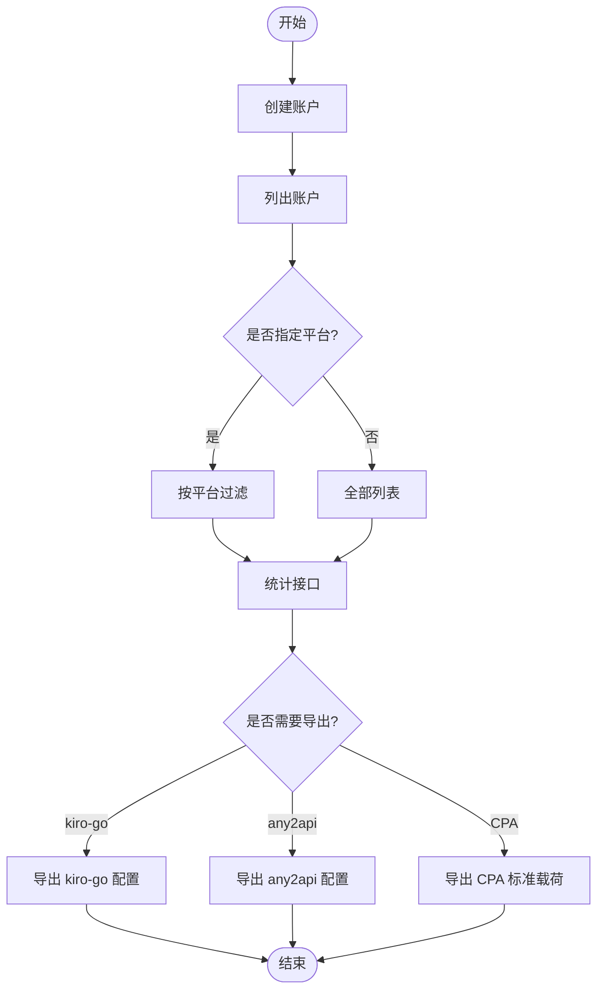
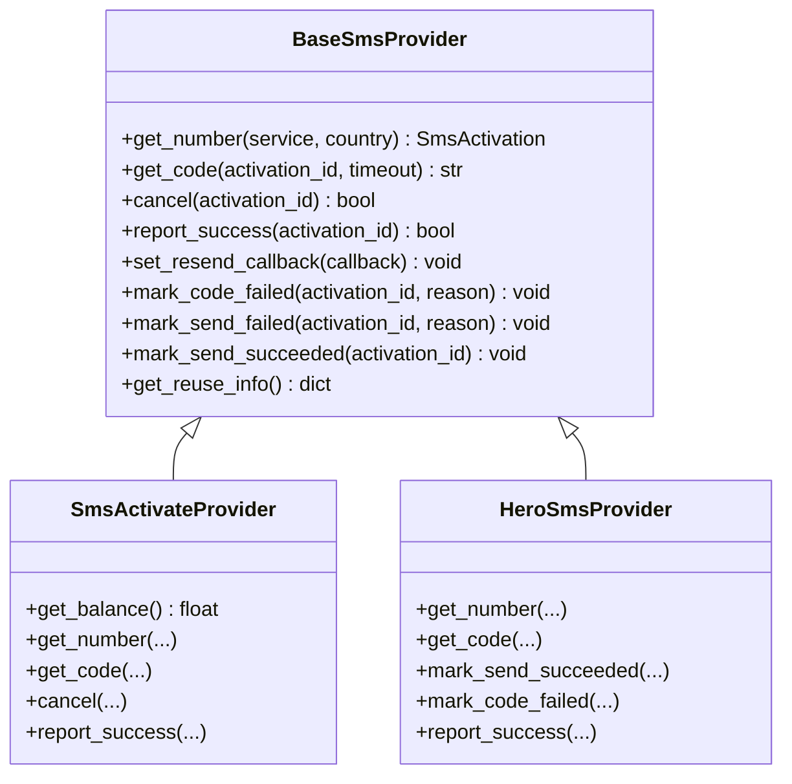
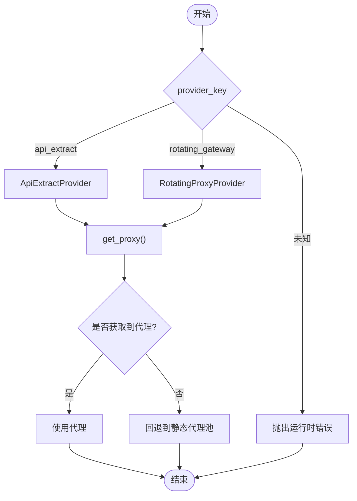
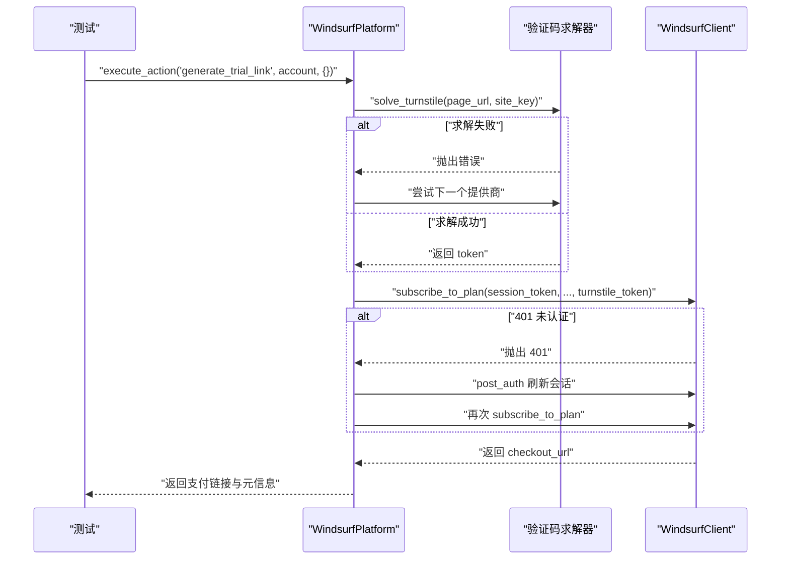
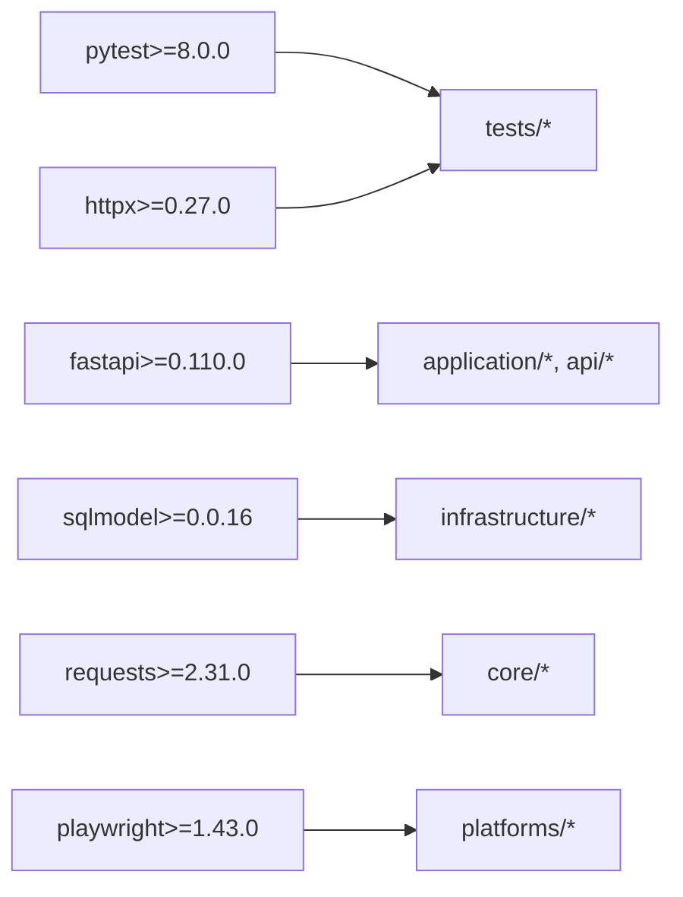

# 单元测试

<cite>
**本文引用的文件**
- [pytest.ini](file://pytest.ini)
- [requirements.txt](file://requirements.txt)
- [tests/conftest.py](file://tests/conftest.py)
- [tests/test_api_accounts.py](file://tests/test_api_accounts.py)
- [tests/test_api_health.py](file://tests/test_api_health.py)
- [tests/test_api_proxies.py](file://tests/test_api_proxies.py)
- [tests/test_tasks_herosms.py](file://tests/test_tasks_herosms.py)
- [tests/test_sms_provider.py](file://tests/test_sms_provider.py)
- [tests/test_proxy_providers.py](file://tests/test_proxy_providers.py)
- [tests/test_registration_phone_callbacks.py](file://tests/test_registration_phone_callbacks.py)
- [tests/test_windsurf_platform.py](file://tests/test_windsurf_platform.py)
- [core/base_sms.py](file://core/base_sms.py)
- [core/proxy_providers.py](file://core/proxy_providers.py)
</cite>

## 目录
1. [简介](#简介)
2. [项目结构](#项目结构)
3. [核心组件](#核心组件)
4. [架构总览](#架构总览)
5. [详细组件分析](#详细组件分析)
6. [依赖分析](#依赖分析)
7. [性能考虑](#性能考虑)
8. [故障排查指南](#故障排查指南)
9. [结论](#结论)
10. [附录](#附录)

## 简介
本指南面向为任意平台自动注册系统编写高质量单元测试的工程师与测试人员。内容覆盖：
- 核心业务逻辑测试（账户管理、任务处理、配置验证）
- 平台适配器测试（如 Windsurf 平台）
- 工具函数测试（短信提供商、动态代理）
- Mock/Stub 的使用策略、测试数据准备、断言方法选择
- 覆盖率要求与质量标准，确保测试有效验证代码正确性

## 项目结构
本项目使用 pytest 作为测试框架，测试用例统一位于 tests 目录，通过 conftest.py 提供共享夹具与数据库隔离。关键要点：
- 测试路径与 Python 路径在 pytest.ini 中配置
- 测试数据库使用临时 SQLite 文件，并在每个测试前后重建表，保证隔离
- FastAPI TestClient 用于端到端接口测试
- 第三方依赖（HTTP 客户端、Playwright 等）通过 monkeypatch/patch 进行替换，避免真实网络调用

**图表来源**
- [pytest.ini:1-4](file://pytest.ini#L1-L4)
- [tests/conftest.py:1-56](file://tests/conftest.py#L1-L56)

**章节来源**
- [pytest.ini:1-4](file://pytest.ini#L1-L4)
- [tests/conftest.py:1-56](file://tests/conftest.py#L1-L56)

## 核心组件
围绕以下核心能力组织测试：
- 账户管理：创建、查询、更新、删除、统计、导出（any2api、kiro-go、CPA）
- 健康与就绪检查：/api/health、/api/ready
- 代理管理：增删查、批量导入
- 任务与短信提供商：默认提供商解析、内联覆盖
- 短信提供商：SMS-Activate、HeroSMS 的行为与错误处理
- 动态代理：ApiExtractProvider、RotatingProxyProvider
- 平台适配器：Windsurf 平台的协议解析、支付链接生成、验证码求解回退
- 注册流程中的手机回调：构建、执行与清理

**章节来源**
- [tests/test_api_accounts.py:1-201](file://tests/test_api_accounts.py#L1-L201)
- [tests/test_api_health.py:1-15](file://tests/test_api_health.py#L1-L15)
- [tests/test_api_proxies.py:1-46](file://tests/test_api_proxies.py#L1-L46)
- [tests/test_tasks_herosms.py:1-43](file://tests/test_tasks_herosms.py#L1-L43)
- [tests/test_sms_provider.py:1-469](file://tests/test_sms_provider.py#L1-L469)
- [tests/test_proxy_providers.py:1-135](file://tests/test_proxy_providers.py#L1-L135)
- [tests/test_registration_phone_callbacks.py:1-54](file://tests/test_registration_phone_callbacks.py#L1-L54)
- [tests/test_windsurf_platform.py:1-527](file://tests/test_windsurf_platform.py#L1-L527)

## 架构总览
下图展示了测试如何覆盖从 API 到基础设施再到外部服务的完整链路，并通过 Mock 隔离外部依赖。

**图表来源**
- [tests/conftest.py:38-47](file://tests/conftest.py#L38-L47)
- [tests/test_api_accounts.py:19-35](file://tests/test_api_accounts.py#L19-L35)
- [tests/test_proxy_providers.py:15-33](file://tests/test_proxy_providers.py#L15-L33)
- [tests/test_sms_provider.py:42-77](file://tests/test_sms_provider.py#L42-L77)

## 详细组件分析

### 账户管理测试（API 层）
目标：验证账户 CRUD、过滤、统计与导出功能，确保数据一致性与边界条件。
- 创建账户并校验字段
- 空列表与创建后列表一致性
- 按 ID 获取与未找到场景
- 删除后再次获取应 404
- 更新密码成功
- 按平台过滤
- 统计接口返回正常
- 导出 kiro-go、any2api 多平台
- CPA 导出字段结构与时间格式

**图表来源**
- [tests/test_api_accounts.py:29-125](file://tests/test_api_accounts.py#L29-L125)
- [tests/test_api_accounts.py:127-201](file://tests/test_api_accounts.py#L127-L201)

**章节来源**
- [tests/test_api_accounts.py:1-201](file://tests/test_api_accounts.py#L1-L201)

### 健康与就绪检查测试
目标：确保服务健康探针可用。
- /api/health 返回 ok=true
- /api/ready 返回 200

**章节来源**
- [tests/test_api_health.py:1-15](file://tests/test_api_health.py#L1-L15)

### 代理管理测试（API 层）
目标：验证代理的增删查与批量导入。
- 空列表校验
- 添加单个代理并校验字段
- 添加后列表长度变化
- 删除后再次列表为空
- 批量导入多个代理

**章节来源**
- [tests/test_api_proxies.py:1-46](file://tests/test_api_proxies.py#L1-L46)

### 任务与短信提供商解析测试
目标：验证任务中短信提供商的选择逻辑，包括默认设置与内联覆盖。
- 保存默认 HeroSMS 提供商后，解析出 provider_key 与配置
- 内联参数覆盖默认设置

**章节来源**
- [tests/test_tasks_herosms.py:1-43](file://tests/test_tasks_herosms.py#L1-L43)

### 短信提供商单元测试
目标：验证 SMS-Activate 与 HeroSMS 的行为、错误处理与生命周期。
- 服务与国家映射常量存在且正确
- create_sms_provider 根据 provider_key 创建实例，缺失配置抛出运行时错误
- create_phone_callbacks 构造回调与清理函数，支持延迟初始化、取消、成功上报、重试与锁释放
- HeroSMS 的 get_number/get_code/mark_* 行为与缓存、重发、失败标记
- SmsActivation 数据类字段校验

**图表来源**
- [core/base_sms.py:28-71](file://core/base_sms.py#L28-L71)
- [core/base_sms.py:108-182](file://core/base_sms.py#L108-L182)

**章节来源**
- [tests/test_sms_provider.py:1-469](file://tests/test_sms_provider.py#L1-L469)
- [core/base_sms.py:1-200](file://core/base_sms.py#L1-L200)

### 动态代理提供商单元测试
目标：验证 ApiExtractProvider 与 RotatingProxyProvider 的解析与回退逻辑。
- 文本/JSON 数组/对象解析
- 认证信息与协议前缀处理
- API 失败返回 None
- 旋转网关固定返回同一地址
- 工厂方法根据 provider_key 创建实例，缺失配置抛错

**图表来源**
- [core/proxy_providers.py:53-74](file://core/proxy_providers.py#L53-L74)
- [tests/test_proxy_providers.py:15-135](file://tests/test_proxy_providers.py#L15-L135)

**章节来源**
- [tests/test_proxy_providers.py:1-135](file://tests/test_proxy_providers.py#L1-L135)
- [core/proxy_providers.py:1-103](file://core/proxy_providers.py#L1-L103)

### 注册流程中的手机回调测试
目标：验证浏览器注册流程中电话回调的构建、执行与清理。
- 通过 monkeypatch 注入 fake 构建函数
- 验证回调可调用、清理函数在结束时被调用
- 日志中包含“准备租用手机号”、“已成功租到号码”、“已释放未使用号码”等提示

**章节来源**
- [tests/test_registration_phone_callbacks.py:1-54](file://tests/test_registration_phone_callbacks.py#L1-L54)

### 平台适配器测试（Windsurf）
目标：验证协议解析、支付链接生成、验证码求解回退与浏览器 UI 流程。
- 解析 post_auth/current_user/plan_status 响应，构建配额概览
- Stripe 支付链接提取与分类（Alipay 中间页 vs 收银台）
- 订阅计划时携带 turnstile token
- 验证码求解失败时回退到下一个提供商
- 401 刷新会话后重试
- 支付链接仅返回 checkout
- 浏览器 UI 流程生成链接
- 本地求解器不可解时的错误传播
- 默认名称与姓名拆分规则

**图表来源**
- [tests/test_windsurf_platform.py:161-184](file://tests/test_windsurf_platform.py#L161-L184)
- [tests/test_windsurf_platform.py:207-279](file://tests/test_windsurf_platform.py#L207-L279)
- [tests/test_windsurf_platform.py:281-350](file://tests/test_windsurf_platform.py#L281-L350)
- [tests/test_windsurf_platform.py:352-474](file://tests/test_windsurf_platform.py#L352-L474)

**章节来源**
- [tests/test_windsurf_platform.py:1-527](file://tests/test_windsurf_platform.py#L1-L527)

## 依赖分析
- 测试运行依赖 pytest、httpx（FastAPI 测试客户端）
- 应用依赖 fastapi、uvicorn、sqlmodel、requests、playwright 等
- 测试通过 conftest 替换数据库引擎，避免真实 DB 影响
- 外部服务（短信、代理、验证码）通过 monkeypatch/patch 替换，确保可重复与快速

**图表来源**
- [requirements.txt:1-20](file://requirements.txt#L1-L20)

**章节来源**
- [requirements.txt:1-20](file://requirements.txt#L1-L20)

## 性能考虑
- 使用内存/临时 SQLite 数据库，减少 I/O 开销
- 通过 Mock 避免真实网络调用，提升测试速度
- 对耗时操作（如等待验证码）使用短超时或模拟响应
- 批量操作（如批量代理导入）应在测试中覆盖以验证吞吐与错误处理

[本节为通用指导，不直接分析具体文件]

## 故障排查指南
常见问题与定位建议：
- 数据库连接问题：确认 conftest 已创建临时 DB 并重置表；检查环境变量 ACCOUNT_MANAGER_DATABASE_URL
- 外部服务超时/失败：使用 monkeypatch/patch 替换 requests.get/post，返回期望响应或抛出预期异常
- 配置缺失：确保 create_*_provider 所需键存在，否则应捕获 RuntimeError 并给出明确提示
- 验证码不可解：验证 LocalSolverCaptcha 的错误传播与重试逻辑
- 会话过期：验证 401 后的刷新流程与重试

**章节来源**
- [tests/conftest.py:1-56](file://tests/conftest.py#L1-L56)
- [tests/test_sms_provider.py:476-516](file://tests/test_sms_provider.py#L476-L516)
- [tests/test_windsurf_platform.py:281-350](file://tests/test_windsurf_platform.py#L281-L350)

## 结论
通过分层测试（API、应用、基础设施、外部依赖 Mock），结合 pytest 夹具与隔离数据库，能够高效验证账户管理、任务处理、配置验证、平台适配器等核心功能。遵循本指南的最佳实践，可显著提升测试质量与稳定性，确保代码变更的安全回归。

[本节为总结，不直接分析具体文件]

## 附录
- 测试运行命令：在项目根目录执行 pytest
- 覆盖率建议：核心模块（core、application、infrastructure）行覆盖率≥80%，分支覆盖率≥70%
- 命名规范：测试文件以 test_ 开头，测试函数以 test_ 开头，描述清晰
- 断言原则：优先断言业务语义（状态码、关键字段、数据结构），而非实现细节
- Mock 策略：仅 Mock 外部依赖与副作用，保持被测单元内部逻辑真实执行

[本节为通用指导，不直接分析具体文件]