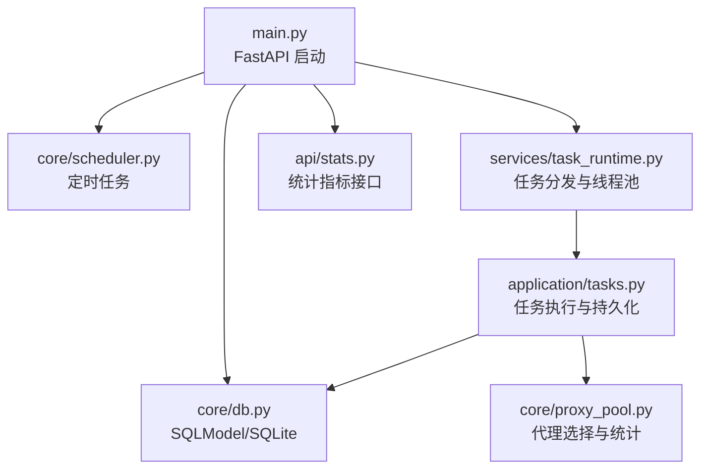
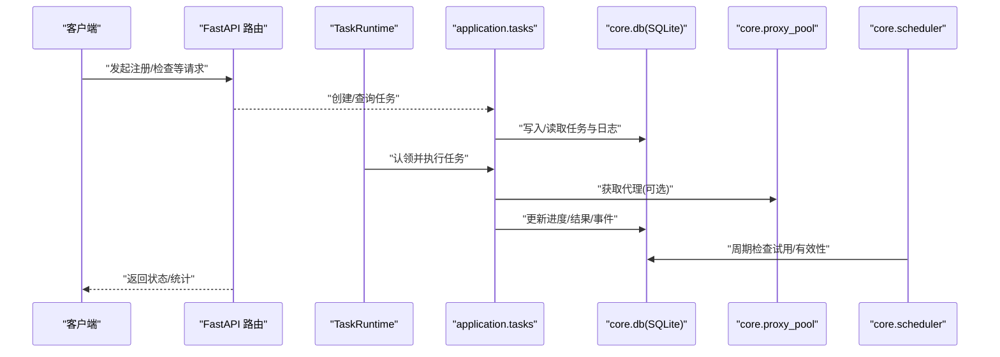
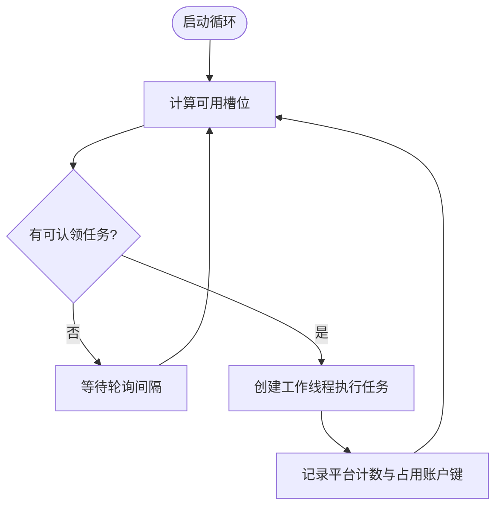
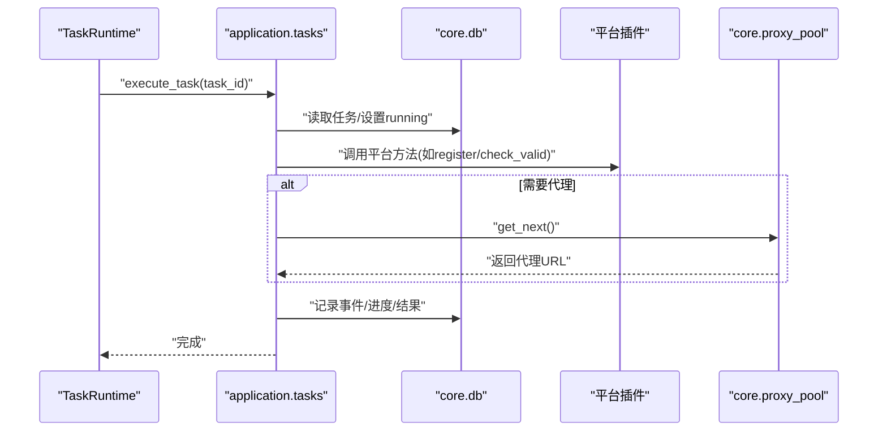
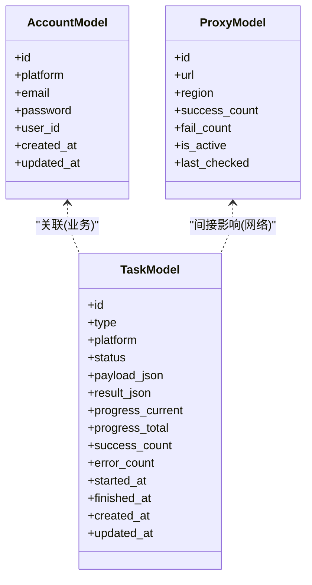
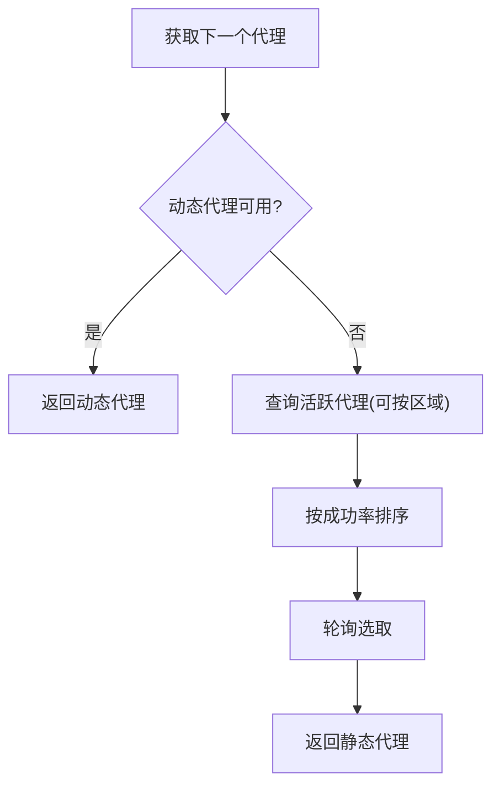
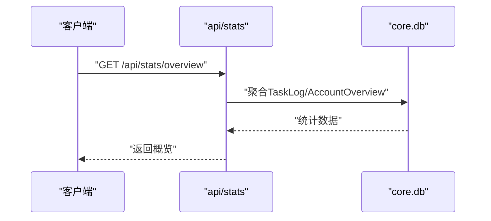
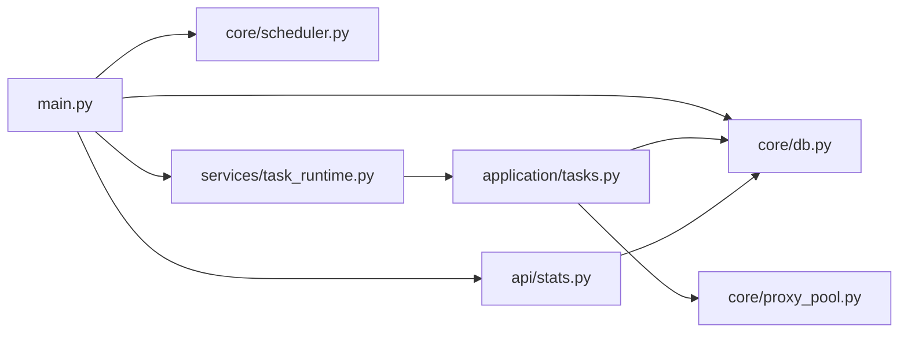

# 性能测试

<cite>
**本文引用的文件**
- [main.py](file://main.py)
- [core/db.py](file://core/db.py)
- [core/scheduler.py](file://core/scheduler.py)
- [services/task_runtime.py](file://services/task_runtime.py)
- [application/tasks.py](file://application/tasks.py)
- [api/stats.py](file://api/stats.py)
- [core/proxy_pool.py](file://core/proxy_pool.py)
- [tests/conftest.py](file://tests/conftest.py)
- [tests/test_api_stats.py](file://tests/test_api_stats.py)
- [requirements.txt](file://requirements.txt)
</cite>

## 目录
1. [简介](#简介)
2. [项目结构](#项目结构)
3. [核心组件](#核心组件)
4. [架构总览](#架构总览)
5. [详细组件分析](#详细组件分析)
6. [依赖关系分析](#依赖关系分析)
7. [性能考量](#性能考量)
8. [故障排查指南](#故障排查指南)
9. [结论](#结论)
10. [附录](#附录)

## 简介
本文件面向“性能测试与负载测试”的实施策略与方法，结合代码库中的任务调度、并发执行、数据库访问、代理池与统计接口等关键路径，给出：
- 如何测试系统并发处理能力（多线程任务执行、数据库连接、内存使用）
- 如何构建性能基准（响应时间、吞吐量、资源监控）
- 如何识别与分析瓶颈（CPU、内存泄漏、I/O）
- 如何实施压力测试（高并发场景模拟）
- 如何将性能回归测试自动化集成到持续改进流程中

## 项目结构
本项目采用分层组织：API 路由层、应用编排层、核心能力层、基础设施与平台实现。启动入口在 main.py 中初始化数据库、加载注册器与提供商、启动调度器、任务运行时与生命周期管理。

**图表来源**
- [main.py:67-91](file://main.py#L67-L91)
- [core/db.py:21-23](file://core/db.py#L21-L23)
- [core/scheduler.py:19-43](file://core/scheduler.py#L19-L43)
- [services/task_runtime.py:18-85](file://services/task_runtime.py#L18-L85)
- [application/tasks.py:570-595](file://application/tasks.py#L570-L595)
- [core/proxy_pool.py:9-45](file://core/proxy_pool.py#L9-L45)
- [api/stats.py:18-52](file://api/stats.py#L18-L52)

**章节来源**
- [main.py:67-146](file://main.py#L67-L146)
- [core/db.py:21-23](file://core/db.py#L21-L23)

## 核心组件
- 任务运行时 TaskRuntime：单进程内基于线程的任务分发器，支持最大并行任务数、每平台并行限制、轮询间隔控制。
- 任务编排 application.tasks：任务创建、认领、执行、进度与结果持久化、事件日志、取消与中断处理。
- 数据库 core.db：SQLModel + SQLite，提供模型定义、会话、迁移与清理逻辑。
- 代理池 core.proxy_pool：动态/静态代理选择、成功率统计、自动禁用连续失败代理。
- 统计接口 api/stats：注册成功率、按平台/按天/按代理的统计聚合。
- 调度器 core/scheduler：周期性检查试用到期与账号有效性。

**章节来源**
- [services/task_runtime.py:18-101](file://services/task_runtime.py#L18-L101)
- [application/tasks.py:174-240](file://application/tasks.py#L174-L240)
- [core/db.py:25-335](file://core/db.py#L25-L335)
- [core/proxy_pool.py:9-91](file://core/proxy_pool.py#L9-L91)
- [api/stats.py:18-152](file://api/stats.py#L18-L152)
- [core/scheduler.py:19-115](file://core/scheduler.py#L19-L115)

## 架构总览
下图展示了从 API 请求到任务执行、数据库读写、代理选择的完整链路，以及后台调度与生命周期管理的交互。

**图表来源**
- [main.py:94-121](file://main.py#L94-L121)
- [services/task_runtime.py:47-85](file://services/task_runtime.py#L47-L85)
- [application/tasks.py:340-368](file://application/tasks.py#L340-L368)
- [core/proxy_pool.py:14-45](file://core/proxy_pool.py#L14-L45)
- [core/scheduler.py:35-63](file://core/scheduler.py#L35-L63)
- [api/stats.py:18-52](file://api/stats.py#L18-L52)

## 详细组件分析

### 任务运行时与并发控制（TaskRuntime）
- 并发参数：最大并行任务数、每平台最大并行、轮询间隔。通过线程池式工作器执行任务，避免同一平台过度竞争与账户键冲突。
- 健壮性：服务重启后标记未完成任务为中断；工作器完成后回收。

**图表来源**
- [services/task_runtime.py:47-85](file://services/task_runtime.py#L47-L85)

**章节来源**
- [services/task_runtime.py:18-101](file://services/task_runtime.py#L18-L101)

### 任务编排与持久化（application.tasks）
- 任务类型：注册、账号检查、批量检查、平台动作。
- 并发与限流：claim_next_runnable_task 根据运行中平台计数与占用账户键进行并发控制。
- 进度与结果：TaskLogger 提供进度、成功/错误计数、结果数据与事件追加。
- 取消与中断：支持请求取消并在合适时机结束任务。

**图表来源**
- [application/tasks.py:570-595](file://application/tasks.py#L570-L595)
- [application/tasks.py:340-368](file://application/tasks.py#L340-L368)
- [core/proxy_pool.py:14-45](file://core/proxy_pool.py#L14-L45)

**章节来源**
- [application/tasks.py:174-240](file://application/tasks.py#L174-L240)
- [application/tasks.py:371-458](file://application/tasks.py#L371-L458)
- [application/tasks.py:570-595](file://application/tasks.py#L570-L595)

### 数据库与连接（core.db）
- 引擎与模型：SQLModel + SQLite，集中定义账户、凭证、任务、日志、代理等模型。
- 会话：每次操作以 Session 上下文包裹，确保事务边界清晰。
- 迁移与清理：启动时创建表、迁移旧字段、清理无效配置。

**图表来源**
- [core/db.py:25-51](file://core/db.py#L25-L51)
- [core/db.py:241-270](file://core/db.py#L241-L270)
- [core/db.py:291-301](file://core/db.py#L291-L301)

**章节来源**
- [core/db.py:21-23](file://core/db.py#L21-L23)
- [core/db.py:430-446](file://core/db.py#L430-L446)

### 代理池（core.proxy_pool）
- 选择策略：优先动态代理，否则回退到静态池；按区域过滤；按成功率排序轮询。
- 反馈机制：成功/失败计数，连续失败达到阈值自动禁用。
- 可用性检测：定期探测代理可达性。

**图表来源**
- [core/proxy_pool.py:14-45](file://core/proxy_pool.py#L14-L45)
- [core/proxy_pool.py:47-66](file://core/proxy_pool.py#L47-L66)
- [core/proxy_pool.py:68-87](file://core/proxy_pool.py#L68-L87)

**章节来源**
- [core/proxy_pool.py:9-91](file://core/proxy_pool.py#L9-L91)

### 统计与监控（api/stats）
- 概览：总注册数、成功率、账号状态分布。
- 维度：按平台、按天、按代理的成功率排行。
- 错误聚合：最近失败错误分组统计。

**图表来源**
- [api/stats.py:18-52](file://api/stats.py#L18-L52)

**章节来源**
- [api/stats.py:18-152](file://api/stats.py#L18-L152)

### 调度与生命周期（core/scheduler, core/lifecycle）
- 调度器：每小时检查试用到期并更新状态；批量检查账号有效性。
- 生命周期管理器：后台线程周期性执行检查、刷新、CPA同步等任务。

**章节来源**
- [core/scheduler.py:19-115](file://core/scheduler.py#L19-L115)
- [core/lifecycle.py:458-497](file://core/lifecycle.py#L458-L497)

## 依赖关系分析
- 启动依赖：main.py 初始化数据库、加载注册器与提供商、启动调度器、任务运行时与生命周期管理。
- 运行时依赖：任务执行依赖数据库会话、代理池、平台插件；统计接口依赖数据库聚合。
- 测试依赖：conftest.py 注入临时 SQLite 引擎，关闭跨线程共享限制以便后台线程访问。

**图表来源**
- [main.py:67-91](file://main.py#L67-L91)
- [services/task_runtime.py:47-85](file://services/task_runtime.py#L47-L85)
- [application/tasks.py:570-595](file://application/tasks.py#L570-L595)
- [api/stats.py:18-52](file://api/stats.py#L18-L52)

**章节来源**
- [tests/conftest.py:1-56](file://tests/conftest.py#L1-L56)
- [requirements.txt:1-20](file://requirements.txt#L1-L20)

## 性能考量
- 并发处理能力
  - 任务并行度：通过 TaskRuntime 的最大并行任务数与每平台并行限制控制并发，避免单一平台过载或账户键冲突。
  - 数据库访问：每次操作使用独立 Session，减少锁竞争；在高并发下建议评估 SQLite 的并发写入瓶颈，必要时切换至支持连接池的数据库。
  - 代理池：按成功率排序与自动禁用失败代理，降低重试风暴对下游的影响。
- 响应时间与吞吐量
  - 关键路径：API -> 任务创建/认领 -> 平台执行 -> 数据库写回。可通过统计接口与任务事件观测端到端耗时。
  - 吞吐优化：合理设置 poll_interval 与并发上限；对 I/O 密集的平台执行考虑异步或外部 Worker。
- 资源消耗监控
  - CPU：平台浏览器/HTTP 调用为主，需关注 CPU 峰值；可在 CI 中采集进程 CPU 曲线。
  - 内存：长时间运行的后台线程可能累积对象，需定期观察 RSS/GC 情况；对大对象（JSON 序列化）注意释放。
  - I/O：SQLite 文件 I/O 与外部 HTTP 调用是主要瓶颈，应监控磁盘 IO 与网络延迟。
- 基准测试构建
  - 响应时间测量：对 /api/stats/* 与任务创建/查询接口进行压测，记录 p50/p95/p99 延迟。
  - 吞吐量测试：以不同并发度提交注册/检查任务，统计单位时间完成数与错误率。
  - 资源监控：采集 CPU、内存、磁盘 IO、网络 IO，并与任务队列长度、数据库连接数关联分析。
- 瓶颈识别与分析
  - CPU：使用采样工具定位热点函数（如 JSON 序列化、平台 HTTP 调用）。
  - 内存泄漏：对比长压测前后内存增长，定位未释放引用；关注任务结果与事件列表大小。
  - I/O：分析数据库慢查询与代理超时；优化代理选择策略与重试退避。
- 压力测试实施步骤
  - 准备：构造多平台、多账号的测试数据集；配置代理池与短信/邮箱提供商。
  - 执行：逐步提升并发度，记录延迟、吞吐、错误率与资源指标。
  - 分析：定位平台侧或数据库侧瓶颈，调整并发与超时参数。
  - 回归：将关键指标纳入自动化回归，设定阈值告警。
- 性能回归自动化
  - 在 CI 中增加性能用例：启动服务、预热、执行固定负载、采集指标、断言阈值。
  - 报告：输出延迟分位、吞吐、错误率与资源曲线，便于趋势对比。

[本节为通用指导，不直接分析具体文件]

## 故障排查指南
- 任务无法执行
  - 检查 claim_next_runnable_task 是否因平台并行限制或账户键占用而跳过任务。
  - 查看任务事件日志与状态变更，确认是否被取消或中断。
- 数据库异常
  - 确认 engine 已正确初始化；测试环境使用临时 SQLite 且关闭线程检查。
  - 观察迁移与清理逻辑是否抛出异常导致启动失败。
- 代理问题
  - 代理连续失败会被自动禁用；检查代理可用性检测与失败计数。
  - 动态代理不可用时回退到静态池，确认静态池是否有可用代理。
- 统计接口异常
  - 若无数据，检查 TaskLog 与 AccountOverviewModel 是否正确写入。
  - 过滤条件（平台、天数）可能导致结果为空，验证入参。

**章节来源**
- [application/tasks.py:340-368](file://application/tasks.py#L340-L368)
- [core/db.py:430-446](file://core/db.py#L430-L446)
- [core/proxy_pool.py:47-66](file://core/proxy_pool.py#L47-L66)
- [api/stats.py:83-107](file://api/stats.py#L83-L107)
- [tests/test_api_stats.py:1-61](file://tests/test_api_stats.py#L1-L61)

## 结论
本项目的性能测试与负载测试应围绕任务并发、数据库访问、代理池与统计监控四大关键点展开。通过合理设置并发参数、监控关键指标、识别瓶颈并进行回归验证，可以持续提升系统的稳定性与吞吐能力。建议在 CI 中固化性能基线，结合生产监控数据进行持续优化。

[本节为总结，不直接分析具体文件]

## 附录
- 相关测试与环境
  - 测试夹具使用临时 SQLite 数据库，确保隔离与可重复性。
  - 依赖包包含 FastAPI、Uvicorn、SQLModel、Playwright 等，满足 Web 服务与浏览器自动化需求。

**章节来源**
- [tests/conftest.py:1-56](file://tests/conftest.py#L1-L56)
- [requirements.txt:1-20](file://requirements.txt#L1-L20)