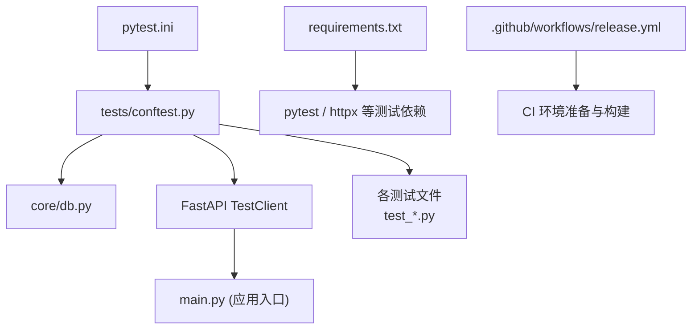
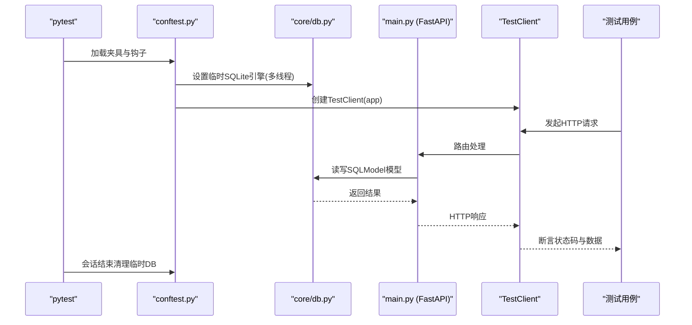
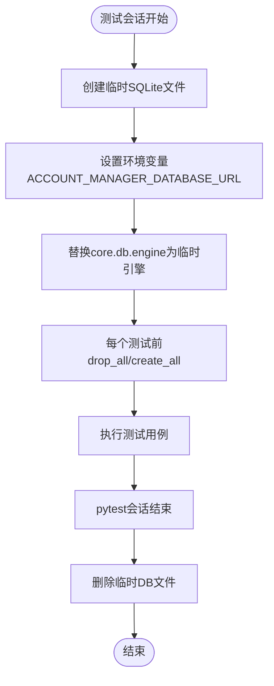
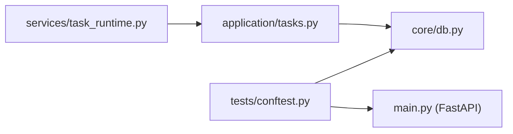

# 测试环境

<cite>
**本文引用的文件**
- [pytest.ini](file://pytest.ini)
- [tests/conftest.py](file://tests/conftest.py)
- [core/db.py](file://core/db.py)
- [requirements.txt](file://requirements.txt)
- [.github/workflows/release.yml](file://.github/workflows/release.yml)
- [tests/test_api_accounts.py](file://tests/test_api_accounts.py)
- [tests/test_api_health.py](file://tests/test_api_health.py)
- [tests/test_tasks_herosms.py](file://tests/test_tasks_herosms.py)
- [tests/test_sms_provider.py](file://tests/test_sms_provider.py)
- [services/task_runtime.py](file://services/task_runtime.py)
- [application/tasks.py](file://application/tasks.py)
</cite>

## 目录
1. [简介](#简介)
2. [项目结构](#项目结构)
3. [核心组件](#核心组件)
4. [架构总览](#架构总览)
5. [详细组件分析](#详细组件分析)
6. [依赖关系分析](#依赖关系分析)
7. [性能考虑](#性能考虑)
8. [故障排查指南](#故障排查指南)
9. [结论](#结论)
10. [附录](#附录)

## 简介
本指南聚焦于搭建和维护该项目的测试环境，覆盖以下关键主题：
- 测试数据库配置与管理：使用临时 SQLite 数据库、线程安全设置、表结构初始化与清理。
- 测试数据初始化与清理机制：通过自动夹具在每个测试前后重置数据库，确保隔离性。
- 测试依赖管理：区分生产依赖与测试依赖，统一安装策略。
- 测试运行器配置与优化：pytest 基础配置、并行执行建议、报告生成。
- 测试环境隔离策略：进程/会话级隔离、数据库隔离、外部依赖模拟。
- CI/CD 集成：在 GitHub Actions 中安装依赖、准备浏览器、构建前端并执行测试（可扩展）。

## 项目结构
测试相关的关键位置与职责：
- pytest 配置：位于根目录的 pytest.ini，指定测试路径与 Python 模块搜索路径。
- 共享夹具与生命周期钩子：tests/conftest.py 提供全局数据库隔离、客户端夹具和会话结束清理。
- 应用数据库模型与引擎：core/db.py 定义 SQLModel 模型与默认数据库 URL，测试阶段被 conftest 替换为临时 SQLite。
- 测试用例：tests 目录下按功能划分的测试文件，覆盖 API、任务调度、短信服务等。
- 依赖清单：requirements.txt 包含生产与测试依赖。
- CI/CD：.github/workflows/release.yml 展示构建流程，可在此基础上扩展测试步骤。

图表来源
- [pytest.ini:1-3](file://pytest.ini#L1-L3)
- [tests/conftest.py:1-56](file://tests/conftest.py#L1-L56)
- [core/db.py:1-38](file://core/db.py#L1-L38)
- [requirements.txt:1-20](file://requirements.txt#L1-L20)
- [.github/workflows/release.yml:1-219](file://.github/workflows/release.yml#L1-L219)

章节来源
- [pytest.ini:1-3](file://pytest.ini#L1-L3)
- [tests/conftest.py:1-56](file://tests/conftest.py#L1-L56)
- [core/db.py:1-38](file://core/db.py#L1-L38)
- [requirements.txt:1-20](file://requirements.txt#L1-L20)
- [.github/workflows/release.yml:1-219](file://.github/workflows/release.yml#L1-L219)

## 核心组件
- 测试数据库隔离：
  - 在测试会话开始前创建临时 SQLite 文件，并通过环境变量注入到应用数据库模块，随后替换 SQLAlchemy 引擎以启用多线程访问。
  - 每个测试执行前自动 drop_all 并 create_all，保证完全隔离。
- FastAPI 测试客户端：
  - 提供 client 夹具，封装 TestClient，便于对 API 进行请求断言。
- 会话清理：
  - 会话结束时删除临时数据库文件，避免磁盘残留。

章节来源
- [tests/conftest.py:1-56](file://tests/conftest.py#L1-L56)
- [core/db.py:1-38](file://core/db.py#L1-L38)

## 架构总览
下图展示了测试执行时从 pytest 到应用层的数据流与隔离点：

图表来源
- [tests/conftest.py:1-56](file://tests/conftest.py#L1-L56)
- [core/db.py:1-38](file://core/db.py#L1-L38)

## 详细组件分析

### 测试数据库配置与管理
- 临时数据库创建：
  - 在导入应用数据库模块之前创建临时 .db 文件，并将路径写入环境变量，供 core/db 读取。
- 引擎替换与线程安全：
  - 将 core.db.engine 替换为指向临时文件的引擎，并开启 check_same_thread=False，允许后台线程（如任务运行时）共享连接。
- 表结构初始化与清理：
  - 使用 autouse fixture 在每个测试前后 drop_all/create_all，确保数据隔离。
- 会话结束清理：
  - 通过 pytest_sessionfinish 钩子在会话结束时删除临时文件。

图表来源
- [tests/conftest.py:1-56](file://tests/conftest.py#L1-L56)
- [core/db.py:1-38](file://core/db.py#L1-L38)

章节来源
- [tests/conftest.py:1-56](file://tests/conftest.py#L1-L56)
- [core/db.py:1-38](file://core/db.py#L1-L38)

### 测试数据初始化与清理机制
- 自动夹具 _reset_db：
  - 在每个测试函数执行前重置数据库，保证无状态污染。
- 客户端夹具 client：
  - 提供干净的 TestClient 实例，便于发送 HTTP 请求并断言响应。
- 示例用法：
  - API 账户 CRUD 测试通过 client.post/get/patch/delete 操作验证业务逻辑。
  - 健康检查测试验证 /api/health 与 /api/ready 端点可用性。
  - 任务与短信服务测试通过直接调用内部函数或仓库来验证行为。

章节来源
- [tests/conftest.py:30-47](file://tests/conftest.py#L30-L47)
- [tests/test_api_accounts.py:1-201](file://tests/test_api_accounts.py#L1-L201)
- [tests/test_api_health.py:1-15](file://tests/test_api_health.py#L1-L15)
- [tests/test_tasks_herosms.py:1-43](file://tests/test_tasks_herosms.py#L1-L43)

### 测试依赖的管理与安装
- 生产依赖与测试依赖：
  - requirements.txt 同时包含生产依赖（如 fastapi、sqlmodel、playwright 等）与测试依赖（pytest、httpx）。
- 本地开发：
  - 使用 pip install -r requirements.txt 一次性安装所有依赖。
- CI 环境：
  - release.yml 中演示了安装 Python 依赖与 Playwright 浏览器的步骤；可在其中增加 pytest 执行步骤以实现自动化测试。

章节来源
- [requirements.txt:1-20](file://requirements.txt#L1-L20)
- [.github/workflows/release.yml:19-28](file://.github/workflows/release.yml#L19-L28)

### 测试运行器的配置与优化
- pytest 配置：
  - testpaths 指向 tests 目录，pythonpath 设置为当前目录以便解析模块。
- 并行执行：
  - 可通过 pytest-xdist 插件实现并行测试；注意数据库隔离已由 conftest 保障，但需确保外部资源（如浏览器、网络）具备并发能力。
- 报告生成：
  - 可使用 pytest-html 或 allure-pytest 生成可视化报告；在 CI 中可将报告作为工件上传。

章节来源
- [pytest.ini:1-3](file://pytest.ini#L1-L3)

### 测试环境的隔离策略
- 数据库隔离：
  - 每个测试会话使用独立临时 SQLite 文件，并在每个测试前后重建表结构。
- 进程/会话隔离：
  - 通过 pytest 的会话生命周期钩子清理临时文件，避免跨会话污染。
- 外部依赖模拟：
  - 使用 monkeypatch 替换外部调用（如短信提供商），避免真实网络请求影响测试结果稳定性。

章节来源
- [tests/conftest.py:1-56](file://tests/conftest.py#L1-L56)
- [tests/test_sms_provider.py:1-469](file://tests/test_sms_provider.py#L1-L469)

### CI/CD 集成的配置方法
- 现有工作流：
  - release.yml 定义了多平台构建流程（macOS、Windows、Docker），包括安装 Python 依赖、安装 Playwright 浏览器、构建前端与后端、打包 Electron 应用。
- 扩展测试步骤：
  - 在构建任务中添加 pytest 执行步骤，例如安装依赖后运行 pytest，并可选择并行执行与报告生成。
  - 如需浏览器相关的端到端测试，确保已安装对应浏览器（如 chromium）。

章节来源
- [.github/workflows/release.yml:1-219](file://.github/workflows/release.yml#L1-L219)

## 依赖关系分析
- 测试夹具与应用的耦合：
  - conftest 在导入 core.db 之前设置临时数据库，确保应用启动时使用测试引擎。
- 任务运行时与数据库：
  - services/task_runtime.py 与 application/tasks.py 通过 SQLModel 与数据库交互，测试中可利用相同的隔离机制验证任务调度逻辑。

图表来源
- [tests/conftest.py:1-56](file://tests/conftest.py#L1-L56)
- [core/db.py:1-38](file://core/db.py#L1-L38)
- [services/task_runtime.py:1-101](file://services/task_runtime.py#L1-L101)
- [application/tasks.py:340-373](file://application/tasks.py#L340-L373)

章节来源
- [tests/conftest.py:1-56](file://tests/conftest.py#L1-L56)
- [services/task_runtime.py:1-101](file://services/task_runtime.py#L1-L101)
- [application/tasks.py:340-373](file://application/tasks.py#L340-L373)

## 性能考虑
- 数据库性能：
  - 临时 SQLite 适合单元测试与小规模集成测试；在高并发场景下需注意锁竞争，必要时可切换内存数据库或使用更合适的存储。
- 并行测试：
  - 使用 pytest-xdist 提升执行速度；确保测试不依赖共享外部状态（如文件系统、网络）。
- 浏览器测试：
  - Playwright 浏览器启动开销较大，建议仅在需要 UI 行为的测试中使用，并考虑缓存与复用策略。

[本节为通用指导，不直接分析具体文件]

## 故障排查指南
- 数据库未正确初始化：
  - 确认 conftest 中的临时文件创建与引擎替换顺序正确，且环境变量已设置。
- 多线程访问异常：
  - 确保引擎 connect_args 中包含 check_same_thread=False，以允许后台线程访问。
- 测试间数据污染：
  - 检查 _reset_db 是否在每个测试前后执行，确保 drop_all/create_all 生效。
- 外部依赖不稳定：
  - 使用 monkeypatch 模拟第三方服务（如短信提供商），避免真实网络波动影响测试。

章节来源
- [tests/conftest.py:1-56](file://tests/conftest.py#L1-L56)
- [tests/test_sms_provider.py:1-469](file://tests/test_sms_provider.py#L1-L469)

## 结论
本项目通过 pytest 与自定义夹具实现了完善的测试环境隔离与数据管理。临时 SQLite 数据库、自动化的表结构重建与清理、以及对外部依赖的模拟，共同保障了测试的稳定性和可重复性。结合 CI/CD 工作流，可以在发布流程中无缝集成自动化测试，进一步提升代码质量与交付效率。

[本节为总结性内容，不直接分析具体文件]

## 附录
- 常用命令（本地）：
  - 安装依赖：pip install -r requirements.txt
  - 运行测试：pytest
  - 并行测试：pytest -n auto（需安装 pytest-xdist）
  - 生成报告：pytest --html=report.html（需安装 pytest-html）
- CI 扩展建议：
  - 在 release.yml 的构建任务中增加 pytest 执行步骤，并根据需要安装 pytest 插件。
  - 对于浏览器相关测试，确保已安装所需浏览器（如 chromium）。

[本节为补充信息，不直接分析具体文件]