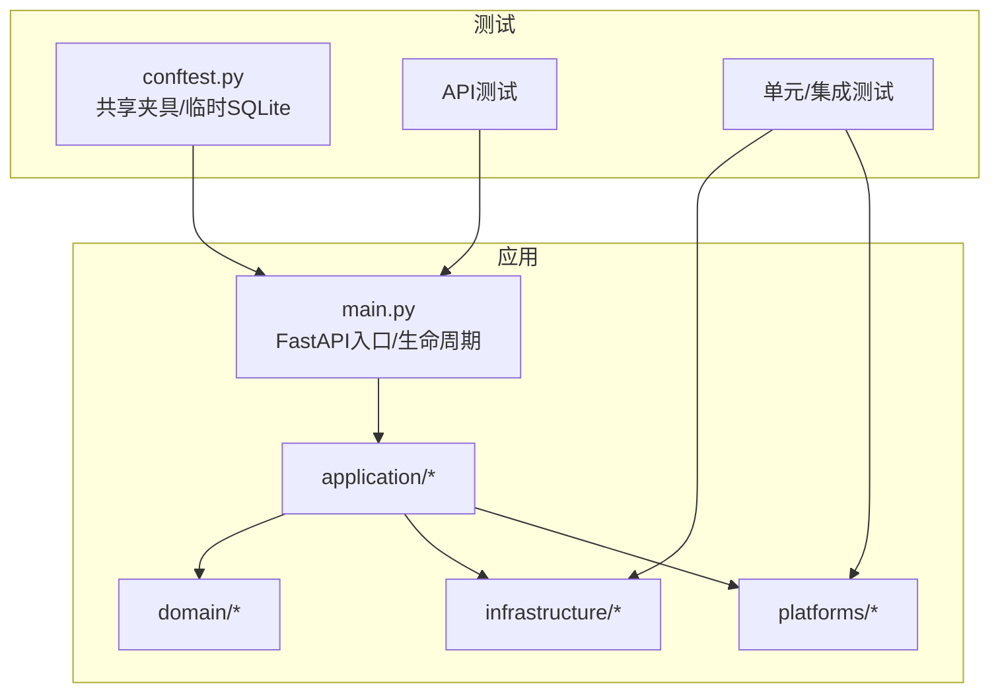
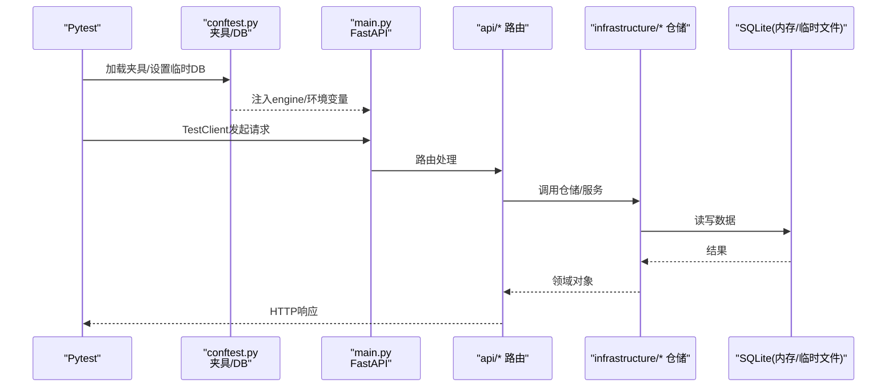
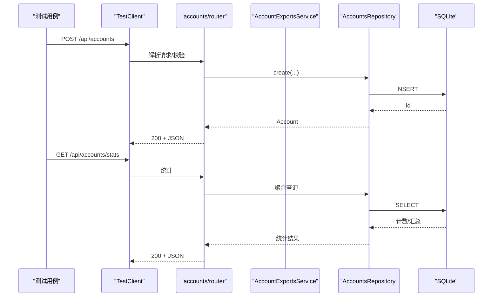
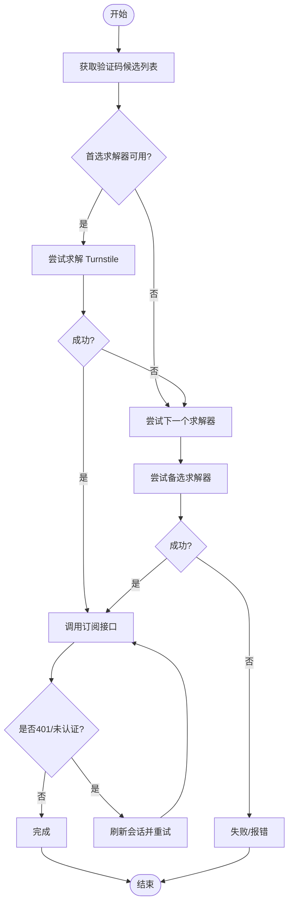
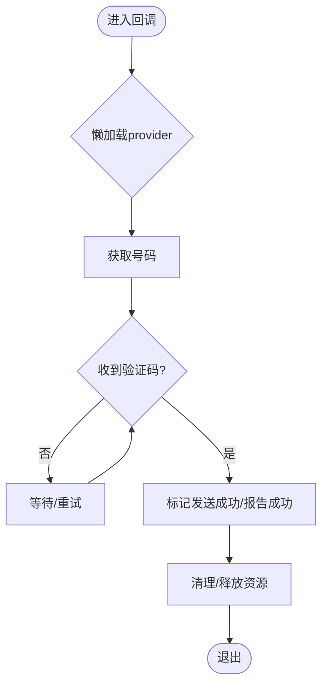
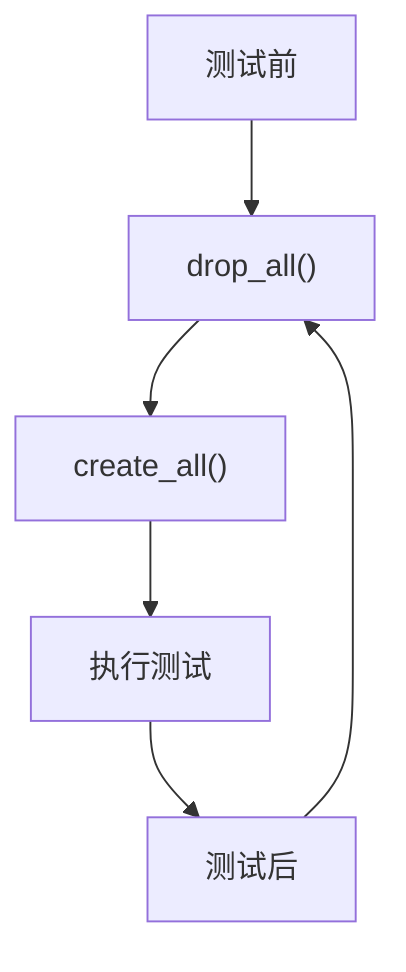

# 测试策略

<cite>
**本文引用的文件**
- [pytest.ini](file://pytest.ini)
- [tests/conftest.py](file://tests/conftest.py)
- [main.py](file://main.py)
- [tests/test_api_accounts.py](file://tests/test_api_accounts.py)
- [tests/test_api_health.py](file://tests/test_api_health.py)
- [tests/test_api_proxies.py](file://tests/test_api_proxies.py)
- [tests/test_tasks_herosms.py](file://tests/test_tasks_herosms.py)
- [tests/test_sms_provider.py](file://tests/test_sms_provider.py)
- [tests/test_proxy_providers.py](file://tests/test_proxy_providers.py)
- [tests/test_windsurf_platform.py](file://tests/test_windsurf_platform.py)
</cite>

## 目录
1. [简介](#简介)
2. [项目结构](#项目结构)
3. [核心组件](#核心组件)
4. [架构总览](#架构总览)
5. [详细组件分析](#详细组件分析)
6. [依赖关系分析](#依赖关系分析)
7. [性能考虑](#性能考虑)
8. [故障排查指南](#故障排查指南)
9. [结论](#结论)
10. [附录](#附录)

## 简介
本测试策略面向自动化注册与账户管理系统，覆盖单元测试、集成测试、端到端（E2E）测试的编写方法与最佳实践；说明测试环境搭建与配置（测试数据库、Mock服务、测试数据准备）；给出关键模块的测试用例设计要点（API接口、平台适配器、业务逻辑、数据库操作）；明确覆盖率要求与质量标准；提供测试自动化与持续集成配置方法；并包含性能与负载测试的实施指南，确保代码质量与系统稳定性。

## 项目结构
本项目采用分层与模块化组织：
- API层：FastAPI路由定义，统一挂载到 /api
- 应用层：业务编排与服务
- 领域层：领域模型与命令
- 基础设施层：仓储与运行时
- 平台适配层：各平台的具体实现
- 测试层：基于 pytest 的测试套件，使用 FastAPI TestClient 进行集成测试



图表来源
- [main.py:67-121](file://main.py#L67-L121)
- [tests/conftest.py:1-56](file://tests/conftest.py#L1-L56)

章节来源
- [pytest.ini:1-4](file://pytest.ini#L1-L4)
- [tests/conftest.py:1-56](file://tests/conftest.py#L1-L56)
- [main.py:67-121](file://main.py#L67-L121)

## 核心组件
- 测试运行器与路径：通过 pytest.ini 指定 tests 为测试根目录，pythonpath 指向项目根，便于直接导入模块。
- 共享夹具与隔离：conftest.py 在会话前创建临时 SQLite 文件，设置环境变量并替换 core.db.engine，保证多线程可访问；每个测试前后自动重建表，确保完全隔离；提供 FastAPI TestClient 夹具用于集成测试。
- 应用启动与生命周期：main.py 中 lifespan 初始化数据库、加载平台与提供商、启动调度器与任务运行时等，测试通过 TestClient 复用同一进程上下文，避免真实网络与外部依赖。

章节来源
- [pytest.ini:1-4](file://pytest.ini#L1-L4)
- [tests/conftest.py:1-56](file://tests/conftest.py#L1-L56)
- [main.py:67-121](file://main.py#L67-L121)

## 架构总览
下图展示测试如何驱动应用并验证关键路径：



图表来源
- [tests/conftest.py:11-44](file://tests/conftest.py#L11-L44)
- [main.py:67-121](file://main.py#L67-L121)

## 详细组件分析

### API 接口测试（账户、健康、代理）
- 健康检查：验证 /api/health 与 /api/ready 返回正常状态。
- 账户管理：覆盖创建、查询、过滤、更新、删除、统计与导出（含 CPA 标准载荷）。
- 代理管理：覆盖列表、新增、批量新增、删除。



图表来源
- [tests/test_api_accounts.py:29-125](file://tests/test_api_accounts.py#L29-L125)
- [tests/test_api_health.py:5-15](file://tests/test_api_health.py#L5-L15)
- [tests/test_api_proxies.py:5-46](file://tests/test_api_proxies.py#L5-L46)

章节来源
- [tests/test_api_health.py:1-15](file://tests/test_api_health.py#L1-L15)
- [tests/test_api_accounts.py:1-201](file://tests/test_api_accounts.py#L1-L201)
- [tests/test_api_proxies.py:1-46](file://tests/test_api_proxies.py#L1-L46)

### 平台适配器测试（Windsurf）
- 协议消息解析：post_auth、current_user、plan_status、subscribe_to_plan 等解析函数。
- 支付流程：Stripe 重定向 URL 提取、支付宝中间页识别、checkout 链接生成。
- 验证码回退：当首选验证码服务失败时，自动切换到备选本地求解器。
- 会话刷新：订阅失败后自动刷新会话并重试。



图表来源
- [tests/test_windsurf_platform.py:161-279](file://tests/test_windsurf_platform.py#L161-L279)
- [tests/test_windsurf_platform.py:281-350](file://tests/test_windsurf_platform.py#L281-L350)
- [tests/test_windsurf_platform.py:352-444](file://tests/test_windsurf_platform.py#L352-L444)

章节来源
- [tests/test_windsurf_platform.py:1-527](file://tests/test_windsurf_platform.py#L1-L527)

### 业务逻辑测试（短信提供商与任务解析）
- 短信提供商工厂：按 provider_key 创建对应实例，缺失配置抛出错误；支持多服务映射与国家码映射。
- 电话回调封装：延迟创建 provider，支持取消/报告成功/重试；异常释放锁与清理资源。
- 任务短信提供商解析：优先使用默认保存配置，允许内联覆盖。



图表来源
- [tests/test_sms_provider.py:79-293](file://tests/test_sms_provider.py#L79-L293)
- [tests/test_tasks_herosms.py:7-43](file://tests/test_tasks_herosms.py#L7-L43)

章节来源
- [tests/test_sms_provider.py:1-469](file://tests/test_sms_provider.py#L1-L469)
- [tests/test_tasks_herosms.py:1-43](file://tests/test_tasks_herosms.py#L1-L43)

### 数据库操作测试
- 隔离性：每个测试前后 drop/create 所有表，确保无状态污染。
- 线程安全：使用 check_same_thread=False 的 SQLite 引擎，兼容后台线程。
- 数据准备：通过仓储与命令对象构造测试数据，避免硬编码。



图表来源
- [tests/conftest.py:30-35](file://tests/conftest.py#L30-L35)

章节来源
- [tests/conftest.py:1-56](file://tests/conftest.py#L1-L56)

## 依赖关系分析
- 测试对应用的依赖：通过 TestClient 直接调用 main.app，无需启动真实服务器。
- 测试对基础设施的依赖：conftest 替换 core.db.engine，仓储直接写入临时 SQLite。
- 对外部服务的解耦：通过 monkeypatch/模拟替换 requests、HTTP 客户端或平台客户端，避免真实网络调用。

```mermaid
graph LR
T["测试用例"] --> C["conftest.py"]
C --> M["main.py"]
M --> A["api/*"]
A --> I["infrastructure/*"]
I --> DB["SQLite(临时)"]
T -.mock/.monkeypatch.-> X["外部服务/第三方库"]
```

图表来源
- [tests/conftest.py:11-44](file://tests/conftest.py#L11-L44)
- [main.py:67-121](file://main.py#L67-L121)

章节来源
- [tests/conftest.py:1-56](file://tests/conftest.py#L1-L56)
- [main.py:67-121](file://main.py#L67-L121)

## 性能考虑
- 测试数据库：使用临时 SQLite 文件，避免磁盘碎片与持久化开销；必要时可在 CI 中使用内存数据库以提升速度。
- 并发与线程：由于启用了 check_same_thread=False，测试可同时运行多个线程访问数据库；注意避免跨进程共享临时文件。
- Mock 与缓存：对慢速外部依赖（短信、验证码、代理）使用 mock/缓存，减少 I/O 时间；对重复计算逻辑进行局部缓存。
- 测试粒度：优先小步快跑的单元测试，辅以必要的集成测试；E2E 仅在必要场景运行，降低整体耗时。

[本节为通用指导，不直接分析具体文件]

## 故障排查指南
- 数据库相关
  - 现象：测试间数据污染或表不存在
  - 排查：确认 conftest 的 _reset_db 是否执行；检查 SQLModel.metadata 是否正确绑定到被替换的 engine
- 外部依赖超时/不可用
  - 现象：短信/验证码/代理调用失败
  - 排查：确认 monkeypatch 是否生效；检查模拟返回值与异常路径；查看日志中的错误信息
- 平台适配器异常
  - 现象：Turnstile 求解失败或支付链接生成异常
  - 排查：检查求解器候选列表与回退逻辑；确认会话刷新与重试路径；核对协议消息解析

章节来源
- [tests/conftest.py:30-35](file://tests/conftest.py#L30-L35)
- [tests/test_windsurf_platform.py:161-279](file://tests/test_windsurf_platform.py#L161-L279)
- [tests/test_sms_provider.py:79-293](file://tests/test_sms_provider.py#L79-L293)

## 结论
本测试策略以 pytest 为核心，结合 FastAPI TestClient 与临时 SQLite，构建了高隔离、低耦合的测试体系。通过完善的夹具与 Mock 机制，覆盖了 API、平台适配器、业务逻辑与数据库操作的关键路径。建议在生产环境中引入覆盖率门禁与持续集成流水线，逐步完善 E2E 与性能测试，持续提升质量与稳定性。

[本节为总结，不直接分析具体文件]

## 附录

### 测试环境与配置
- 运行方式：在项目根目录执行 pytest，自动发现 tests 下的测试文件
- 数据库：临时 SQLite，会话结束后清理
- 环境变量：ACCOUNT_MANAGER_DATABASE_URL 由 conftest 设置
- 插件与路径：pytest.ini 指定 testpaths 与 pythonpath

章节来源
- [pytest.ini:1-4](file://pytest.ini#L1-L4)
- [tests/conftest.py:11-15](file://tests/conftest.py#L11-L15)

### 关键模块测试用例设计要点
- API 接口测试
  - 覆盖 CRUD、过滤、分页、统计、导出等场景
  - 断言状态码与响应结构
  - 示例参考：
    - [tests/test_api_accounts.py:29-125](file://tests/test_api_accounts.py#L29-L125)
    - [tests/test_api_health.py:5-15](file://tests/test_api_health.py#L5-L15)
    - [tests/test_api_proxies.py:5-46](file://tests/test_api_proxies.py#L5-L46)
- 平台适配器测试
  - 协议消息解析、支付流程、验证码回退与会话刷新
  - 示例参考：
    - [tests/test_windsurf_platform.py:161-279](file://tests/test_windsurf_platform.py#L161-L279)
    - [tests/test_windsurf_platform.py:281-350](file://tests/test_windsurf_platform.py#L281-L350)
    - [tests/test_windsurf_platform.py:352-444](file://tests/test_windsurf_platform.py#L352-L444)
- 业务逻辑测试
  - 短信提供商工厂、电话回调封装、任务短信提供商解析
  - 示例参考：
    - [tests/test_sms_provider.py:79-293](file://tests/test_sms_provider.py#L79-L293)
    - [tests/test_tasks_herosms.py:7-43](file://tests/test_tasks_herosms.py#L7-L43)
- 数据库操作测试
  - 隔离性与线程安全
  - 示例参考：
    - [tests/conftest.py:30-35](file://tests/conftest.py#L30-L35)

### 覆盖率与质量标准
- 建议目标
  - 语句覆盖率 ≥ 80%
  - 分支覆盖率 ≥ 70%
  - 关键模块（API、平台适配器、短信/代理）覆盖率 ≥ 90%
- 工具与报告
  - 使用 coverage 收集覆盖率，生成 HTML/XML 报告
  - 在 CI 中设置阈值门禁，低于阈值阻断合并
- 质量门禁
  - 静态检查（lint/type-check）
  - 单元测试全部通过
  - 关键集成测试通过

[本节为通用指导，不直接分析具体文件]

### 测试自动化与持续集成
- 本地运行
  - 安装依赖后执行 pytest
- CI 建议
  - 构建步骤：安装依赖、运行 lint/type-check、执行测试、生成覆盖率报告
  - 缓存：依赖包与虚拟环境缓存
  - 并行：启用 pytest-xdist 加速
  - 报告：上传覆盖率报告与测试结果
- 脚本示例（概念性）
  - 安装依赖
  - 运行测试
  - 生成覆盖率
  - 上传报告

[本节为通用指导，不直接分析具体文件]

### 性能测试与负载测试
- 目标
  - 评估 API 在高并发下的响应时间与吞吐
  - 识别瓶颈（CPU/IO/DB/外部依赖）
- 工具
  - Locust/k6 进行负载测试
  - 针对关键接口（账户、代理、任务）构造压测脚本
- 指标
  - 响应时间（P95/P99）
  - 吞吐量（QPS）
  - 错误率
  - 资源利用率（CPU/Memory/DB连接）
- 实施
  - 在独立环境运行，避免干扰
  - 逐步增加并发，观察拐点
  - 记录并优化热点路径

[本节为通用指导，不直接分析具体文件]