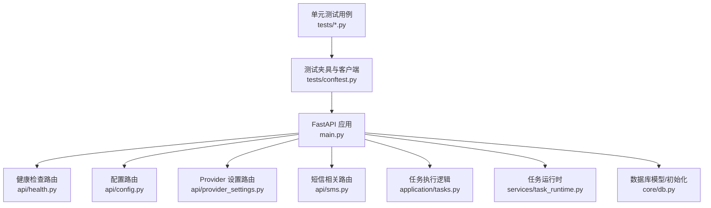
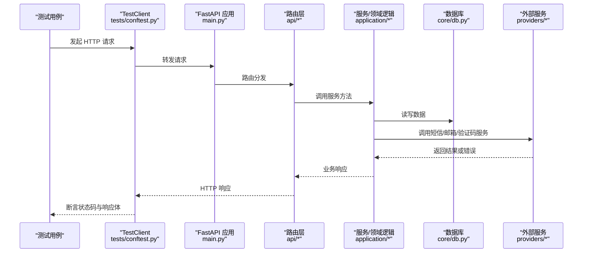
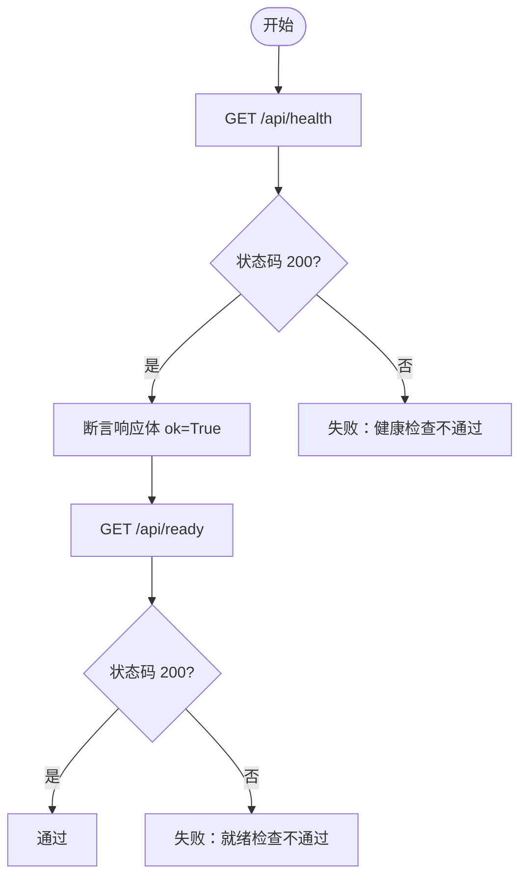
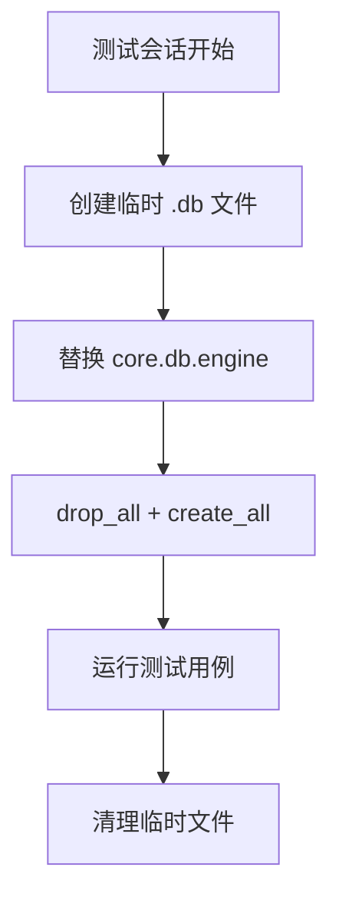
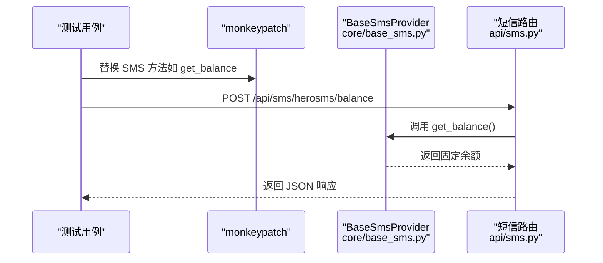
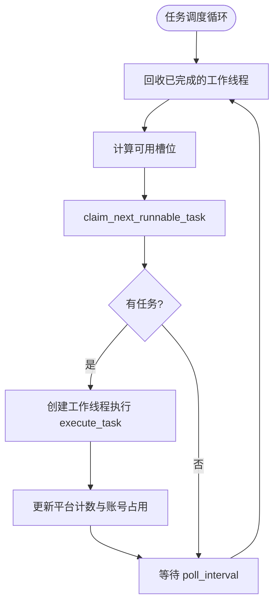
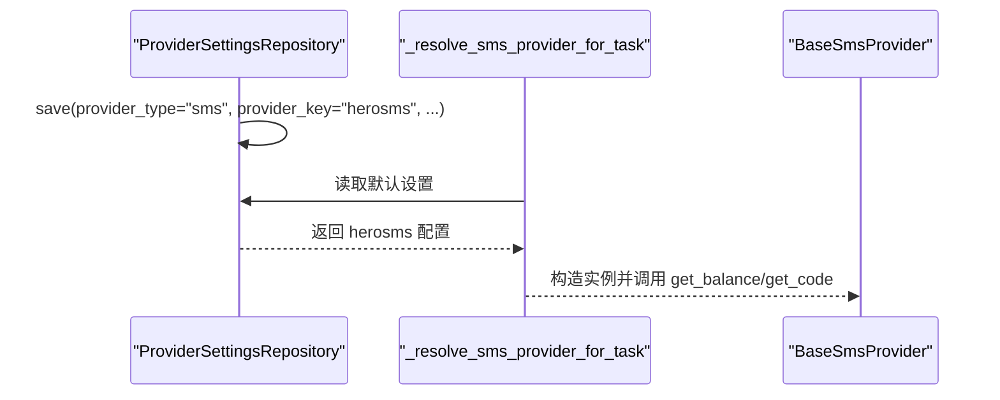
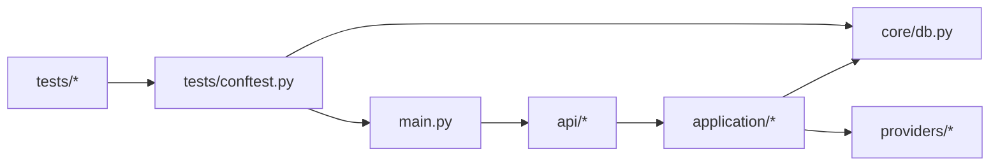

# 集成测试

<cite>
**本文引用的文件**
- [main.py](file://main.py)
- [conftest.py](file://tests/conftest.py)
- [pytest.ini](file://pytest.ini)
- [test_api_health.py](file://tests/test_api_health.py)
- [test_api_accounts.py](file://tests/test_api_accounts.py)
- [test_herosms_api.py](file://tests/test_herosms_api.py)
- [test_tasks_herosms.py](file://tests/test_tasks_herosms.py)
- [db.py](file://core/db.py)
- [health.py](file://api/health.py)
- [config.py](file://api/config.py)
- [provider_settings.py](file://api/provider_settings.py)
- [tasks.py](file://application/tasks.py)
- [task_runtime.py](file://services/task_runtime.py)
- [base_sms.py](file://core/base_sms.py)
</cite>

## 目录
1. [简介](#简介)
2. [项目结构](#项目结构)
3. [核心组件](#核心组件)
4. [架构总览](#架构总览)
5. [详细组件分析](#详细组件分析)
6. [依赖关系分析](#依赖关系分析)
7. [性能考虑](#性能考虑)
8. [故障排查指南](#故障排查指南)
9. [结论](#结论)
10. [附录](#附录)

## 简介
本集成测试策略围绕 FastAPI 应用，覆盖 API 接口、数据库操作与外部服务（短信、邮箱、验证码）的交互验证。重点包括：
- 使用 TestClient 进行请求模拟、响应校验与错误处理测试
- 异步任务与并发场景的稳定性验证
- 外部服务的 Mock 方案（短信、邮箱、验证码）
- 事务管理与测试数据隔离的最佳实践，确保测试可靠性和可重复性

## 项目结构
- 应用入口与路由挂载在 main.py，包含生命周期管理、中间件与静态资源
- 测试基础设施位于 tests/conftest.py，提供临时 SQLite 数据库、自动重置表结构与 TestClient fixture
- 业务 API 分布在 api/*，如 health、config、provider_settings、sms 等
- 任务执行与调度在 application/tasks.py 与 services/task_runtime.py
- 数据库模型与初始化在 core/db.py
- 外部服务抽象与实现集中在 providers 与 core/base_sms.py

**图表来源**
- [main.py:67-121](file://main.py#L67-L121)
- [health.py:1-18](file://api/health.py#L1-L18)
- [config.py:1-28](file://api/config.py#L1-L28)
- [provider_settings.py:54-81](file://api/provider_settings.py#L54-L81)
- [tasks.py:87-126](file://application/tasks.py#L87-L126)
- [task_runtime.py:18-101](file://services/task_runtime.py#L18-L101)
- [db.py:430-445](file://core/db.py#L430-L445)
- [conftest.py:30-47](file://tests/conftest.py#L30-L47)

**章节来源**
- [main.py:67-121](file://main.py#L67-L121)
- [conftest.py:1-56](file://tests/conftest.py#L1-L56)
- [pytest.ini:1-4](file://pytest.ini#L1-L4)

## 核心组件
- 测试夹具与客户端
  - 通过 conftest.py 创建临时 SQLite 数据库并注入到应用模块，保证每个测试拥有独立的数据空间
  - 提供 autouse 的 _reset_db fixture，在每个测试前后重建所有表，确保完全隔离
  - 提供 client fixture，封装 FastAPI TestClient，禁用服务器异常抛出以便断言 HTTP 状态码
- 数据库层
  - core/db.py 定义 SQLModel 模型与 init_db，测试中通过替换 engine 指向临时库
  - 支持线程共享（check_same_thread=False），适配后台线程（调度器、任务运行时）访问
- 健康与就绪端点
  - api/health.py 暴露 /api/health 与 /api/ready，用于验证应用启动与依赖可用性
- Provider 设置与测试
  - api/provider_settings.py 提供 /api/provider-settings/test 以在线测试 provider 配置（当前仅支持 mailbox）
- 任务与并发
  - application/tasks.py 提供任务领取与执行逻辑，services/task_runtime.py 维护并发工作线程池

**章节来源**
- [conftest.py:11-47](file://tests/conftest.py#L11-L47)
- [db.py:21-23](file://core/db.py#L21-L23)
- [db.py:430-445](file://core/db.py#L430-L445)
- [health.py:11-18](file://api/health.py#L11-L18)
- [provider_settings.py:61-81](file://api/provider_settings.py#L61-L81)
- [tasks.py:87-126](file://application/tasks.py#L87-L126)
- [task_runtime.py:18-101](file://services/task_runtime.py#L18-L101)

## 架构总览
下图展示了从测试客户端到 API 路由、服务层、数据库以及外部服务的调用链路与并发控制。

**图表来源**
- [main.py:67-121](file://main.py#L67-L121)
- [health.py:11-18](file://api/health.py#L11-L18)
- [config.py:16-28](file://api/config.py#L16-L28)
- [provider_settings.py:61-81](file://api/provider_settings.py#L61-L81)
- [tasks.py:87-126](file://application/tasks.py#L87-L126)
- [task_runtime.py:47-85](file://services/task_runtime.py#L47-L85)
- [db.py:430-445](file://core/db.py#L430-L445)

## 详细组件分析

### 使用 TestClient 进行 API 测试
- 健康检查与就绪端点
  - 通过 GET /api/health 与 GET /api/ready 验证应用是否正常运行
  - 断言状态码为 200，并校验响应体字段（如 ok 字段）
- 账户 CRUD
  - 创建账户后，验证列表查询、按平台过滤、获取详情、更新与删除
  - 导出功能（如 any2api、kiro-go）验证响应头中的 content-disposition 与下载内容
- 配置选项
  - 验证 /api/config/options 返回的 sms_providers 中包含预期 provider（如 herosms）及其字段定义
- 错误处理
  - 未找到资源时断言 404
  - 缺少必填参数时断言 400 及错误信息

**图表来源**
- [test_api_health.py:5-15](file://tests/test_api_health.py#L5-L15)
- [health.py:11-18](file://api/health.py#L11-L18)

**章节来源**
- [test_api_health.py:5-15](file://tests/test_api_health.py#L5-L15)
- [test_api_accounts.py:29-125](file://tests/test_api_accounts.py#L29-L125)
- [test_herosms_api.py:4-27](file://tests/test_herosms_api.py#L4-L27)

### 数据库操作与事务隔离
- 临时数据库
  - 测试前创建临时 .db 文件，并通过环境变量注入到 core.db 模块
  - 替换 engine 并启用 check_same_thread=False，允许后台线程共享连接
- 表结构重置
  - 每个测试前后 drop_all 与 create_all，确保数据完全隔离
- 模型与迁移
  - 使用 SQLModel 定义模型，init_db 负责建表与种子数据
  - 测试中无需持久化数据，避免跨测试污染

**图表来源**
- [conftest.py:11-35](file://tests/conftest.py#L11-L35)
- [db.py:430-445](file://core/db.py#L430-L445)

**章节来源**
- [conftest.py:11-35](file://tests/conftest.py#L11-L35)
- [db.py:21-23](file://core/db.py#L21-L23)
- [db.py:430-445](file://core/db.py#L430-L445)

### 外部服务 Mock 方案（短信、邮箱、验证码）
- 短信服务（HeroSMS/SMS-Activate）
  - 通过 monkeypatch 替换 BaseSmsProvider 的方法（如 get_balance、get_number、get_code）
  - 在测试中注入固定返回值，避免真实网络调用
- 邮箱服务
  - 使用 /api/provider-settings/test 在线测试 mailbox 配置；测试中可通过 monkeypatch 替换底层 HTTP 调用
- 验证码服务
  - 当前 provider_settings/test 对 captcha 返回“暂不支持在线测试”；可在测试中通过 monkeypatch 替换具体 solver 的实现

**图表来源**
- [test_herosms_api.py:14-27](file://tests/test_herosms_api.py#L14-L27)
- [base_sms.py:28-70](file://core/base_sms.py#L28-L70)
- [provider_settings.py:61-81](file://api/provider_settings.py#L61-L81)

**章节来源**
- [test_herosms_api.py:4-27](file://tests/test_herosms_api.py#L4-L27)
- [base_sms.py:28-70](file://core/base_sms.py#L28-L70)
- [provider_settings.py:61-81](file://api/provider_settings.py#L61-L81)

### 异步任务与并发场景测试
- 任务领取与执行
  - application/tasks.py 提供 claim_next_runnable_task，根据平台并行度与账号占用情况挑选任务
  - services/task_runtime.py 维护线程池，限制最大并发任务数与每平台并发数
- 并发测试要点
  - 验证在多任务同时领取时，平台计数与账号占用集合正确更新
  - 验证任务完成后工作线程回收，无僵尸线程
- 建议测试场景
  - 批量提交任务，观察任务状态流转（pending -> claimed -> finished）
  - 高负载下断言数据库锁竞争与超时行为

**图表来源**
- [task_runtime.py:47-85](file://services/task_runtime.py#L47-L85)
- [tasks.py:340-368](file://application/tasks.py#L340-L368)

**章节来源**
- [task_runtime.py:18-101](file://services/task_runtime.py#L18-L101)
- [tasks.py:340-368](file://application/tasks.py#L340-L368)

### Provider 设置与默认选择
- 保存 Provider 设置
  - 通过 infrastructure.provider_settings_repository 保存 sms 提供商配置（如 herosms）
- 任务解析默认 Provider
  - application.tasks._resolve_sms_provider_for_task 根据保存的设置与任务 payload 决定使用哪个 provider
- 测试要点
  - 验证默认 provider 被正确解析
  - 验证 inline 覆盖生效

**图表来源**
- [test_tasks_herosms.py:7-42](file://tests/test_tasks_herosms.py#L7-L42)
- [tasks.py:87-126](file://application/tasks.py#L87-L126)

**章节来源**
- [test_tasks_herosms.py:7-42](file://tests/test_tasks_herosms.py#L7-L42)
- [tasks.py:87-126](file://application/tasks.py#L87-L126)

## 依赖关系分析
- 应用入口依赖路由与中间件，路由依赖服务层，服务层依赖数据库与外部服务
- 测试夹具依赖应用入口与数据库模块，通过 monkeypatch 与引擎替换解耦外部依赖
- 任务运行时依赖任务逻辑，任务逻辑依赖数据库与外部服务

**图表来源**
- [main.py:67-121](file://main.py#L67-L121)
- [conftest.py:11-47](file://tests/conftest.py#L11-L47)
- [db.py:430-445](file://core/db.py#L430-L445)

**章节来源**
- [main.py:67-121](file://main.py#L67-L121)
- [conftest.py:11-47](file://tests/conftest.py#L11-L47)
- [db.py:430-445](file://core/db.py#L430-L445)

## 性能考虑
- 数据库连接
  - 使用 SQLite 临时文件并启用 check_same_thread=False，减少锁争用
  - 测试中关闭 SQL 日志（echo=False）提升执行速度
- 任务并发
  - 合理设置 max_parallel_tasks 与 max_parallel_per_platform，避免过度并发导致外部服务限流
  - 使用 poll_interval 平衡 CPU 与 I/O 开销
- 外部服务调用
  - 通过 Mock 避免真实网络延迟，提高测试稳定性
  - 对重试与超时路径进行专项测试

[本节为通用指导，不直接分析具体文件]

## 故障排查指南
- 健康检查失败
  - 检查 /api/health 与 /api/ready 的状态码与响应体
  - 确认数据库已初始化且依赖服务可用
- 账户操作异常
  - 验证请求参数与认证头
  - 检查数据库中是否存在对应记录
- 短信服务报错
  - 使用 monkeypatch 替换 get_balance/get_code，定位是否为网络或服务端问题
  - 检查 provider 配置是否正确（如 herosms_api_key）
- 任务卡住
  - 查看任务状态与日志，确认是否被其他平台或账号占用
  - 调整并发参数与轮询间隔

**章节来源**
- [test_api_health.py:5-15](file://tests/test_api_health.py#L5-L15)
- [test_api_accounts.py:54-86](file://tests/test_api_accounts.py#L54-L86)
- [test_herosms_api.py:14-27](file://tests/test_herosms_api.py#L14-L27)
- [task_runtime.py:47-85](file://services/task_runtime.py#L47-L85)

## 结论
本集成测试策略通过临时数据库、TestClient 与 monkeypatch 实现了稳定可靠的端到端验证，覆盖 API、数据库与外部服务交互。结合任务并发控制与 Mock 方案，能够有效评估系统在负载下的表现。建议持续完善用例覆盖，特别是错误路径与边界条件，以提升整体质量与可维护性。

[本节为总结，不直接分析具体文件]

## 附录
- 测试配置
  - pytest.ini 指定测试路径与 Python 路径
- 常用断言模式
  - 状态码断言、JSON 字段断言、响应头断言
- 扩展建议
  - 增加异步任务并发压测用例
  - 补充外部服务异常分支的 Mock 场景

**章节来源**
- [pytest.ini:1-4](file://pytest.ini#L1-L4)