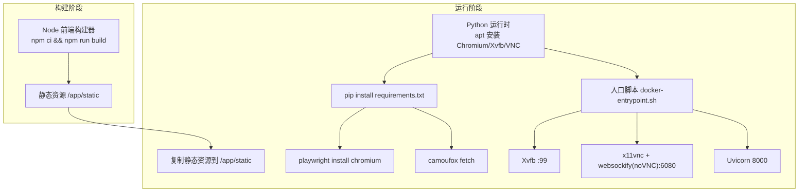
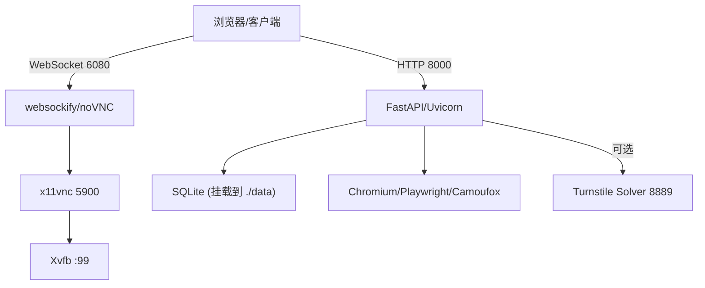
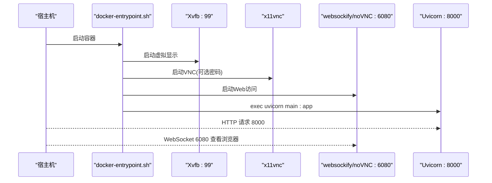
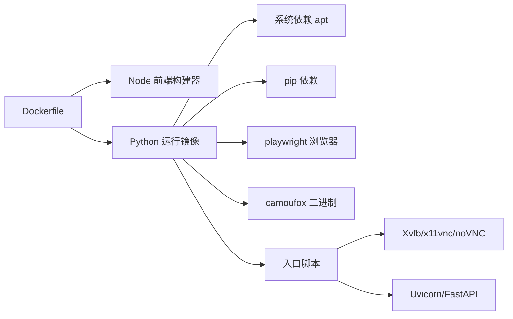

# Docker容器化部署

<cite>
**本文引用的文件**
- [Dockerfile](file://Dockerfile)
- [docker-compose.yml](file://docker-compose.yml)
- [docker-entrypoint.sh](file://docker-entrypoint.sh)
- [requirements.txt](file://requirements.txt)
- [frontend/package.json](file://frontend/package.json)
- [main.py](file://main.py)
- [.dockerignore](file://.dockerignore)
- [customer_portal_api/Dockerfile](file://customer_portal_api/Dockerfile)
- [customer_portal_api/docker-compose.yml](file://customer_portal_api/docker-compose.yml)
</cite>

## 目录
1. [简介](#简介)
2. [项目结构](#项目结构)
3. [核心组件](#核心组件)
4. [架构总览](#架构总览)
5. [详细组件分析](#详细组件分析)
6. [依赖关系分析](#依赖关系分析)
7. [性能考虑](#性能考虑)
8. [故障排查指南](#故障排查指南)
9. [结论](#结论)
10. [附录](#附录)

## 简介
本文件面向生产与开发环境，提供 any-auto-register 项目的完整 Docker 容器化部署说明。内容涵盖：
- 多阶段构建流程（前端构建器 + Python 后端运行镜像）
- 系统依赖安装（Chromium、Xvfb、x11vnc、noVNC/websockify 等）
- 环境变量配置（APP_PASSWORD、PLAYWRIGHT_BROWSERS_PATH、DISPLAY、VNC_PASSWORD 等）
- 端口暴露与启动脚本行为（8000、6080、8889）
- docker-compose 编排示例（服务定义、网络、数据卷挂载）
- 生产环境优化与安全建议

## 项目结构
仓库采用前后端分离与多模块组织：
- 前端位于 frontend/，使用 Vite + React + TypeScript，构建产物输出到 static 目录供后端静态托管
- 后端基于 FastAPI + Uvicorn，提供 REST API 并集成 Playwright/Camoufox 浏览器自动化能力
- 通过 Docker 多阶段构建将前端构建与后端运行解耦，减小最终镜像体积
- 提供 docker-compose 编排，一键拉起应用、noVNC 可视化以及可选的 Turnstile Solver 服务

图表来源
- [Dockerfile:1-61](file://Dockerfile#L1-L61)
- [docker-entrypoint.sh:1-23](file://docker-entrypoint.sh#L1-L23)
- [requirements.txt:1-20](file://requirements.txt#L1-L20)
- [frontend/package.json:1-44](file://frontend/package.json#L1-L44)

章节来源
- [Dockerfile:1-61](file://Dockerfile#L1-L61)
- [docker-compose.yml:1-18](file://docker-compose.yml#L1-L18)
- [docker-entrypoint.sh:1-23](file://docker-entrypoint.sh#L1-L23)
- [requirements.txt:1-20](file://requirements.txt#L1-L20)
- [frontend/package.json:1-44](file://frontend/package.json#L1-L44)
- [main.py:1-146](file://main.py#L1-L146)
- [.dockerignore:1-13](file://.dockerignore#L1-L13)

## 核心组件
- 多阶段构建
  - 阶段一：Node 前端构建器，安装依赖并构建静态资源
  - 阶段二：Python 运行镜像，安装系统依赖、Python 依赖、浏览器及运行期二进制
- 运行期服务
  - FastAPI/Uvicorn 提供 Web 与 API（端口 8000）
  - Xvfb 虚拟显示（:99）+ x11vnc + noVNC/websockify（端口 6080）用于可视化调试
  - 可选 Turnstile Solver 服务（端口 8889），由主进程在特定模式下启动
- 数据持久化
  - SQLite 数据库通过数据卷挂载至宿主 ./data 目录

章节来源
- [Dockerfile:1-61](file://Dockerfile#L1-L61)
- [docker-entrypoint.sh:1-23](file://docker-entrypoint.sh#L1-L23)
- [main.py:67-146](file://main.py#L67-L146)
- [docker-compose.yml:1-18](file://docker-compose.yml#L1-L18)

## 架构总览
下图展示容器内各组件的交互关系与对外暴露端口：

图表来源
- [Dockerfile:12-37](file://Dockerfile#L12-L37)
- [docker-entrypoint.sh:4-22](file://docker-entrypoint.sh#L4-L22)
- [main.py:94-146](file://main.py#L94-L146)
- [docker-compose.yml:4-17](file://docker-compose.yml#L4-L17)

## 详细组件分析

### 多阶段构建过程
- 阶段一：前端构建器
  - 基础镜像：node:20-slim
  - 工作目录：/app/frontend
  - 步骤：复制 package*.json -> 安装依赖 -> 复制源码 -> 执行构建
  - 产物：静态资源输出到 /app/static（由后端挂载为静态目录）
- 阶段二：Python 运行环境
  - 基础镜像：python:3.12-slim
  - 系统依赖：chromium/chromedriver、xvfb、x11vnc、novnc/websockify、字体与图形库
  - Python 依赖：从 requirements.txt 安装
  - 浏览器：安装 Playwright Chromium；下载 Camoufox 二进制
  - 应用代码：复制源码，注入版本号，清理 .venv 与前端源码
  - 静态资源：从阶段一复制构建产物到 /app/static
  - 入口脚本：复制并赋予执行权限
  - 环境变量：默认 APP_PASSWORD 为空（可运行时设置）
  - 端口：EXPOSE 8000、6080、8889
  - 入口：ENTRYPOINT 指向 docker-entrypoint.sh

章节来源
- [Dockerfile:1-61](file://Dockerfile#L1-L61)
- [frontend/package.json:6-10](file://frontend/package.json#L6-L10)
- [requirements.txt:1-20](file://requirements.txt#L1-L20)

### 系统依赖与浏览器环境
- Chromium/Chromedriver：用于无头或带 GUI 的浏览器自动化
- Xvfb：提供虚拟帧缓冲，使需要 GUI 的应用在无显示器环境下运行
- x11vnc + noVNC/websockify：将 Xvfb 屏幕以 VNC 协议暴露并通过 Web 访问（端口 6080）
- 字体与图形库：确保 Chromium 渲染正确（libnss3、libatk-bridge2.0-0、libdrm2、libgbm1、libgtk-3-0 等）
- Playwright 浏览器路径：通过环境变量 PLAYWRIGHT_BROWSERS_PATH=/ms-playwright 指定安装位置
- Camoufox：通过 python -m camoufox fetch 获取二进制，用于反检测模式

章节来源
- [Dockerfile:12-37](file://Dockerfile#L12-L37)

### 环境变量配置
- APP_PASSWORD
  - 用途：控制 API 访问鉴权（未设置则不启用密码保护）
  - 设置方式：运行时通过 -e APP_PASSWORD=xxx 传入
- PLAYWRIGHT_BROWSERS_PATH
  - 用途：指定 Playwright 浏览器安装目录（/ms-playwright）
  - 影响：确保 playwright 命令能找到已安装的 Chromium
- DISPLAY
  - 用途：指向 Xvfb 虚拟显示 :99，供需要 GUI 的程序使用
  - 设置方式：在 docker-compose environment 中设置
- VNC_PASSWORD
  - 用途：可选设置 VNC 访问密码；未设置时以无密码模式启动 x11vnc
- ACCOUNT_MANAGER_DATABASE_URL
  - 用途：SQLite 数据库连接字符串，配合数据卷实现持久化

章节来源
- [Dockerfile:54-58](file://Dockerfile#L54-L58)
- [docker-compose.yml:8-17](file://docker-compose.yml#L8-L17)

### 端口暴露与服务启动
- 8000：FastAPI/Uvicorn Web 与 API 服务
- 6080：noVNC Web 界面，转发到 VNC 5900，便于远程查看浏览器操作
- 8889：Turnstile Solver 服务（当主进程以 solver 模式启动时）
- 启动顺序（docker-entrypoint.sh）
  1) 启动 Xvfb :99
  2) 等待就绪后启动 x11vnc（支持可选密码）
  3) 启动 websockify/noVNC 监听 6080
  4) exec uvicorn main:app 启动后端（替换当前进程）

图表来源
- [docker-entrypoint.sh:4-22](file://docker-entrypoint.sh#L4-L22)
- [main.py:133-146](file://main.py#L133-L146)

章节来源
- [docker-entrypoint.sh:1-23](file://docker-entrypoint.sh#L1-L23)
- [main.py:94-146](file://main.py#L94-L146)

### 数据持久化与存储
- SQLite 数据库路径通过 ACCOUNT_MANAGER_DATABASE_URL 配置
- 使用 docker-compose 将宿主 ./data 目录挂载到容器 /app/data
- 重启容器后数据不丢失

章节来源
- [docker-compose.yml:15-17](file://docker-compose.yml#L15-L17)

### 前端构建与静态资源
- 前端使用 Vite + React + TypeScript
- 构建脚本：tsc -b && vite build
- 构建产物复制到后端 /app/static，并由 FastAPI 作为静态资源提供
- SPA 路由回退：所有未知路径返回 index.html

章节来源
- [frontend/package.json:6-10](file://frontend/package.json#L6-L10)
- [main.py:124-131](file://main.py#L124-L131)

### 可选：客户门户 API（customer_portal_api）
- 独立 Python 服务，暴露 8100 端口
- 提供管理员登录、JWT 配置、CORS 等环境变量
- 可与主应用组合编排，按需启用

章节来源
- [customer_portal_api/Dockerfile:1-18](file://customer_portal_api/Dockerfile#L1-L18)
- [customer_portal_api/docker-compose.yml:1-18](file://customer_portal_api/docker-compose.yml#L1-L18)

## 依赖关系分析
- 构建期依赖
  - Node 包管理器：npm ci（锁定版本）
  - Python 包管理器：pip install -r requirements.txt
- 运行期依赖
  - 系统级：chromium、xvfb、x11vnc、novnc、websockify、字体与图形库
  - 浏览器：playwright chromium、camoufox
  - 应用层：fastapi、uvicorn、sqlmodel、playwright、patchright、quart、rich 等
- 外部集成点
  - 数据库：SQLite（文件型，通过数据卷持久化）
  - 浏览器自动化：Chromium/Playwright/Camoufox
  - 可视化：Xvfb + x11vnc + noVNC

图表来源
- [Dockerfile:1-61](file://Dockerfile#L1-L61)
- [requirements.txt:1-20](file://requirements.txt#L1-L20)
- [docker-entrypoint.sh:4-22](file://docker-entrypoint.sh#L4-L22)

章节来源
- [requirements.txt:1-20](file://requirements.txt#L1-L20)
- [Dockerfile:1-61](file://Dockerfile#L1-L61)

## 性能考虑
- 镜像体积优化
  - 使用 slim 基础镜像（node:20-slim、python:3.12-slim）
  - 仅安装必要系统依赖，避免冗余包
  - 使用 --no-cache-dir 安装 pip 包，减少缓存占用
  - 构建完成后删除 .venv 与前端源码，仅保留运行所需文件
- 构建缓存利用
  - 先复制 package*.json 再安装依赖，充分利用 npm 缓存层
  - 将变更频率低的依赖安装放在上层，加速重构建
- 运行时性能
  - 使用 headless 模式进行批量任务（可通过配置切换）
  - 合理分配 CPU/内存限制，避免浏览器并发过高导致 OOM
  - 使用 SSD 数据卷提升 SQLite 读写性能

[本节为通用指导，无需具体文件引用]

## 故障排查指南
- 无法访问 noVNC（6080）
  - 检查容器是否成功启动 Xvfb 与 x11vnc
  - 确认 VNC_PASSWORD 是否正确设置（若设置了密码）
  - 确认防火墙/安全组放行 6080 端口
- 浏览器启动失败
  - 确认 DISPLAY=:99 已设置
  - 确认 Chromium 与驱动已安装
  - 检查系统图形库是否齐全（libdrm2、libgbm1、libgtk-3-0 等）
- 数据库无法写入
  - 检查数据卷挂载路径 ./data 是否存在且可写
  - 确认 ACCOUNT_MANAGER_DATABASE_URL 指向 /app/data 下的数据库文件
- API 鉴权问题
  - 未设置 APP_PASSWORD 时默认无密码保护；生产环境务必设置强密码
  - 确认请求头与路由前缀（/api）正确

章节来源
- [docker-entrypoint.sh:11-19](file://docker-entrypoint.sh#L11-L19)
- [docker-compose.yml:8-17](file://docker-compose.yml#L8-L17)
- [Dockerfile:54-58](file://Dockerfile#L54-L58)

## 结论
本项目通过多阶段构建实现了前后端解耦与镜像瘦身，结合 Xvfb/VNC/noVNC 提供了可视化的浏览器自动化能力。通过 docker-compose 可快速编排运行，并支持数据持久化与可选的 Turnstile Solver。生产环境应严格设置 APP_PASSWORD、合理配置资源限制与日志策略，并定期更新基础镜像与依赖以保障安全与稳定性。

[本节为总结性内容，无需具体文件引用]

## 附录

### 快速启动
- 构建并启动
  - docker compose up --build
- 访问地址
  - Web/API：http://localhost:8000
  - 可视化浏览器：http://localhost:6080
  - 可选 Solver：http://localhost:8889

章节来源
- [docker-compose.yml:4-17](file://docker-compose.yml#L4-L17)

### 生产环境优化与安全建议
- 安全
  - 必须设置 APP_PASSWORD，并使用强密码
  - 限制 CORS 白名单，避免允许 *
  - 仅暴露必要端口（8000、6080、8889），并在网关层做访问控制
  - 使用只读根文件系统与最小权限用户运行容器
- 性能
  - 根据任务规模调整浏览器并发与线程数
  - 使用高性能磁盘（SSD）存放 SQLite
  - 监控 CPU/内存/IO，设置合理的资源上限
- 可观测性
  - 集中收集日志（stdout/stderr）
  - 暴露健康检查端点（/api/health）并纳入探针
  - 记录关键指标（任务成功率、错误率、响应时间）

[本节为通用指导，无需具体文件引用]