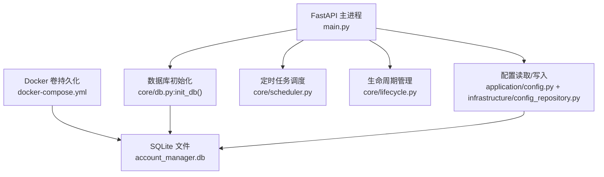
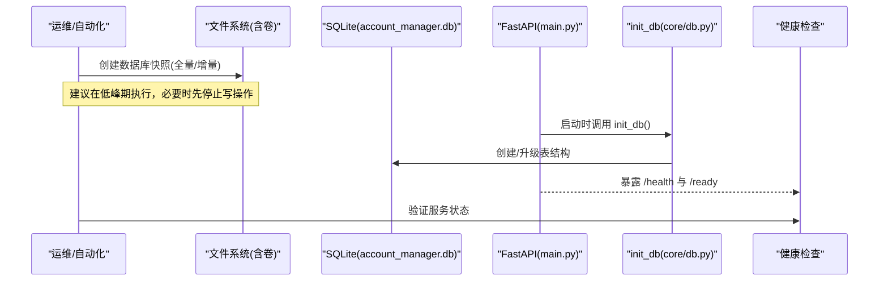
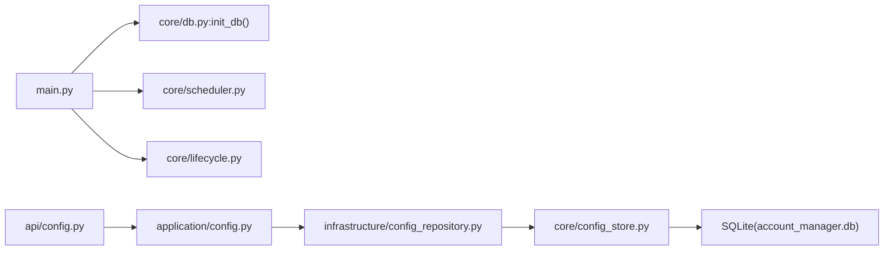

# 备份与恢复

<cite>
**本文引用的文件**
- [core/db.py](file://core/db.py)
- [core/config_store.py](file://core/config_store.py)
- [infrastructure/config_repository.py](file://infrastructure/config_repository.py)
- [application/config.py](file://application/config.py)
- [api/config.py](file://api/config.py)
- [main.py](file://main.py)
- [docker-compose.yml](file://docker-compose.yml)
- [Dockerfile](file://Dockerfile)
- [docker-entrypoint.sh](file://docker-entrypoint.sh)
- [scripts/smoke.py](file://scripts/smoke.py)
- [core/scheduler.py](file://core/scheduler.py)
- [core/lifecycle.py](file://core/lifecycle.py)
- [application/tasks.py](file://application/tasks.py)
</cite>

## 目录
1. [简介](#简介)
2. [项目结构](#项目结构)
3. [核心组件](#核心组件)
4. [架构总览](#架构总览)
5. [详细组件分析](#详细组件分析)
6. [依赖关系分析](#依赖关系分析)
7. [性能考虑](#性能考虑)
8. [故障排查指南](#故障排查指南)
9. [结论](#结论)
10. [附录](#附录)

## 简介
本文件为“any-auto-register”项目的数据备份与灾难恢复策略文档。重点覆盖：
- 数据库备份方案（SQLite 文件级备份、定时备份策略、增量备份建议）
- 配置数据备份方法（用户配置、平台设置、提供商密钥的安全存储）
- 应用程序配置的版本管理与回滚机制
- 灾难恢复计划（数据恢复流程、服务重启步骤、数据一致性验证）
- 备份验证与测试方法（可用性、完整性校验）
- 自动化备份脚本与恢复演练指南

## 项目结构
本项目使用 SQLite 作为主要持久化存储，默认数据库文件位于应用根目录的 account_manager.db；在 Docker 环境中通过卷挂载将数据库文件持久化到宿主机的 ./data/account_manager.db。全局配置以 key-value 形式存储在同一个 SQLite 的 configs 表中。应用启动时初始化数据库并加载平台与提供商定义，同时启动调度器与生命周期管理。

图表来源
- [main.py:67-83](file://main.py#L67-L83)
- [core/db.py:430-445](file://core/db.py#L430-L445)
- [docker-compose.yml:8-17](file://docker-compose.yml#L8-L17)

章节来源
- [main.py:67-83](file://main.py#L67-L83)
- [core/db.py:16-22](file://core/db.py#L16-L22)
- [docker-compose.yml:8-17](file://docker-compose.yml#L8-L17)

## 核心组件
- 数据库层：SQLModel + SQLAlchemy，提供账户、任务、日志、代理、提供商定义与设置等表结构，以及迁移与清理逻辑。
- 配置存储层：configs 表实现全局 key-value 配置，受白名单限制，避免写入非法键。
- API 层：暴露 /api/config 接口用于获取与更新配置选项。
- 运行期：启动时执行 init_db，加载平台与提供商，启动调度器与生命周期管理器。

章节来源
- [core/db.py:25-303](file://core/db.py#L25-L303)
- [core/config_store.py:7-48](file://core/config_store.py#L7-L48)
- [infrastructure/config_repository.py:7-44](file://infrastructure/config_repository.py#L7-L44)
- [application/config.py:9-38](file://application/config.py#L9-L38)
- [api/config.py:1-29](file://api/config.py#L1-L29)
- [main.py:67-83](file://main.py#L67-L83)

## 架构总览
下图展示了备份与恢复相关的关键路径：外部备份工具或脚本对 SQLite 文件进行快照；恢复时将旧文件替换为新副本；应用重启后由 init_db 完成建表与迁移；健康检查与冒烟测试确保服务可用。

图表来源
- [main.py:67-83](file://main.py#L67-L83)
- [core/db.py:430-445](file://core/db.py#L430-L445)
- [docker-compose.yml:8-17](file://docker-compose.yml#L8-L17)

## 详细组件分析

### 数据库备份方案（SQLite 文件级）
- 备份目标
  - 生产环境：容器卷中的 account_manager.db（路径由环境变量 ACCOUNT_MANAGER_DATABASE_URL 指定，默认映射到 /app/data/account_manager.db）。
  - 本地开发：应用根目录下的 account_manager.db。
- 备份方式
  - 全量备份：直接复制 SQLite 文件。适用于停机窗口或低负载时段。
  - 增量备份：基于文件系统快照（如 LVM、ZFS、云盘快照）或 WAL 模式配合定期归档。由于当前未显式开启 WAL，建议采用停机或只读快照方式保证一致性。
- 注意事项
  - 避免在强写期间复制文件，可能导致不一致。
  - 若使用容器，优先对挂载卷做快照而非拷贝容器内文件。
  - 保留多代备份以便回滚到任意时间点。

章节来源
- [core/db.py:16-22](file://core/db.py#L16-L22)
- [docker-compose.yml:8-17](file://docker-compose.yml#L8-L17)

### 定时备份策略
- 推荐策略
  - 每日全量备份一次，保留最近 N 天（例如 7-14 天）。
  - 每小时增量快照（文件系统级），用于快速恢复到小时级粒度。
- 触发方式
  - 宿主机 cron 或容器编排平台的定时任务。
  - 结合健康检查，失败重试与告警。
- 安全与合规
  - 备份文件加密存储（如 gpg 或云盘加密）。
  - 限制访问权限，仅运维账号可读写。
  - 异地容灾：至少一份备份复制到不同区域。

[本节为通用实践说明，不直接分析具体代码文件]

### 增量备份配置
- 文件系统快照：利用底层存储的快照能力（如 LVM/ZFS/云盘快照）实现秒级一致性的增量备份。
- WAL 模式（可选增强）：如需在线增量，可在连接层启用 WAL 并配合定期 checkpoint；当前代码未显式配置，需评估兼容性后再实施。
- 归档策略：按日期与版本号组织备份目录，便于检索与回滚。

[本节为通用实践说明，不直接分析具体代码文件]

### 配置数据的备份方法
- 配置存储位置
  - 全局配置：SQLite 的 configs 表，key 受白名单限制，避免写入敏感或非法键。
  - 提供商设置：provider_settings 表，包含 config_json 与 auth_json，可能包含密钥等敏感信息。
- 备份范围
  - 必须包含：account_manager.db（含 configs、provider_settings 等所有业务表）。
  - 可选独立导出：通过 /api/config 接口导出当前配置项，便于审计与对比。
- 安全存储
  - 对包含密钥的配置进行加密备份。
  - 最小权限原则：仅授权必要人员访问备份介质。

章节来源
- [core/config_store.py:7-48](file://core/config_store.py#L7-L48)
- [infrastructure/config_repository.py:7-44](file://infrastructure/config_repository.py#L7-L44)
- [application/config.py:9-38](file://application/config.py#L9-L38)
- [api/config.py:1-29](file://api/config.py#L1-L29)

### 应用程序配置的版本管理与回滚机制
- 版本标识
  - 应用版本由 core/version.py 提供，构建时注入。
- 配置变更控制
  - 通过 /api/config 接口更新配置，返回已更新的键列表，便于审计。
  - 配置键受白名单约束，降低误改风险。
- 回滚策略
  - 以备份为准：将数据库回滚到指定版本的备份点。
  - 配置回滚：从备份中恢复 configs 表对应记录，或通过接口批量写回历史配置。
  - 灰度发布：新版本上线前保留旧版本镜像与备份，出现问题立即切回。

章节来源
- [core/version.py:1-7](file://core/version.py#L1-L7)
- [application/config.py:16-21](file://application/config.py#L16-L21)
- [api/config.py:16-28](file://api/config.py#L16-L28)

### 灾难恢复计划
- 数据恢复流程
  1) 停止服务或切换到只读模式（避免写入冲突）。
  2) 用目标备份替换当前 account_manager.db（或挂载卷中的文件）。
  3) 启动服务，init_db 自动执行建表与迁移。
  4) 通过健康检查与冒烟测试验证服务状态。
- 服务重启步骤
  - 容器环境：重启容器或重新挂载卷。
  - 本地环境：重启 FastAPI 进程。
- 数据一致性验证
  - 健康检查：/health 与 /ready。
  - 冒烟测试：调用 /platforms、/config、/tasks 等关键接口。
  - 业务校验：抽查账户、任务、日志等关键表的数据完整性。

章节来源
- [main.py:67-83](file://main.py#L67-L83)
- [core/db.py:430-445](file://core/db.py#L430-L445)
- [scripts/smoke.py:15-35](file://scripts/smoke.py#L15-L35)

### 备份验证与测试方法
- 可用性验证
  - 启动服务后调用 /health 与 /ready，确认服务正常。
  - 使用冒烟脚本 scripts/smoke.py 对关键端点进行连通性测试。
- 完整性验证
  - 对备份文件进行校验和比对（如 sha256sum）。
  - 在隔离环境恢复备份并执行冒烟测试，确保功能可用。
  - 抽样查询关键表（账户、任务、日志）是否存在异常或缺失。
- 演练频率
  - 建议每季度进行一次完整恢复演练，包括跨环境恢复。

章节来源
- [scripts/smoke.py:15-35](file://scripts/smoke.py#L15-L35)
- [main.py:67-83](file://main.py#L67-L83)

### 自动化备份脚本与恢复演练指南
- 自动化备份脚本要点
  - 选择低峰期执行，必要时暂停写操作或切换只读。
  - 生成带时间戳与版本号的备份文件名。
  - 计算校验和并上传至异地存储。
  - 失败重试与告警通知。
- 恢复演练指南
  - 准备隔离环境（新容器或新机器）。
  - 导入最新备份，启动服务，执行冒烟测试。
  - 记录恢复耗时与问题，优化流程。
  - 定期复盘并更新预案。

[本节为通用实践说明，不直接分析具体代码文件]

## 依赖关系分析
- 启动依赖
  - main.py 在 lifespan 中调用 init_db，随后加载平台与提供商，启动调度器与生命周期管理。
- 配置依赖
  - application/config.py 通过 ConfigRepository 读取/写入 configs 表，受白名单限制。
- 运行时依赖
  - scheduler 周期性执行任务（如 trial 到期提醒）。
  - lifecycle 周期执行有效性检测、token 续期与 CPA 同步。

图表来源
- [main.py:67-83](file://main.py#L67-L83)
- [core/db.py:430-445](file://core/db.py#L430-L445)
- [application/config.py:9-38](file://application/config.py#L9-L38)
- [infrastructure/config_repository.py:7-44](file://infrastructure/config_repository.py#L7-L44)
- [core/config_store.py:7-48](file://core/config_store.py#L7-L48)

章节来源
- [main.py:67-83](file://main.py#L67-L83)
- [core/scheduler.py:19-42](file://core/scheduler.py#L19-L42)
- [core/lifecycle.py:499-527](file://core/lifecycle.py#L499-L527)

## 性能考虑
- 备份时机
  - 避免在高并发写场景下复制数据库文件，建议使用只读快照或停机窗口。
- 数据库体积
  - 定期清理过期任务日志与事件，避免数据库膨胀影响备份与恢复速度。
- I/O 影响
  - 备份与恢复过程中可能对磁盘 I/O 造成压力，需在容量规划中预留余量。
- 恢复顺序
  - 先恢复数据库，再启动服务，减少不一致窗口。

[本节为通用实践说明，不直接分析具体代码文件]

## 故障排查指南
- 常见问题
  - 数据库损坏：尝试从最近可用备份恢复。
  - 端口占用或服务未启动：检查容器端口映射与 uvicorn 监听。
  - 配置错误：通过 /api/config/options 查看允许的配置键，核对值格式。
- 诊断步骤
  - 使用 /health 与 /ready 检查服务健康。
  - 使用冒烟脚本验证关键接口连通性。
  - 查看任务与日志表，定位异常任务与错误信息。
- 恢复建议
  - 回滚到上一个稳定版本镜像与备份。
  - 逐步恢复配置，避免一次性引入大量变更。

章节来源
- [scripts/smoke.py:15-35](file://scripts/smoke.py#L15-L35)
- [application/tasks.py:296-314](file://application/tasks.py#L296-L314)

## 结论
本项目以 SQLite 为核心存储，备份与恢复应围绕数据库文件展开。建议采用“全量+增量快照”的组合策略，结合健康检查与冒烟测试确保备份可用性与恢复成功率。配置数据通过白名单与接口管控，降低误改风险。通过定期演练与异地容灾，提升整体韧性。

## 附录
- 关键路径与环境变量
  - 数据库路径：ACCOUNT_MANAGER_DATABASE_URL（默认指向 /app/data/account_manager.db）
  - 卷挂载：./data:/app/data（容器内持久化）
- 常用命令参考
  - 健康检查：GET /api/health、GET /api/ready
  - 配置读取：GET /api/config
  - 配置更新：PUT /api/config
  - 冒烟测试：python scripts/smoke.py http://127.0.0.1:8000/api

章节来源
- [docker-compose.yml:8-17](file://docker-compose.yml#L8-L17)
- [api/config.py:16-28](file://api/config.py#L16-L28)
- [scripts/smoke.py:15-35](file://scripts/smoke.py#L15-L35)