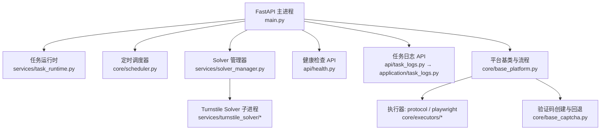
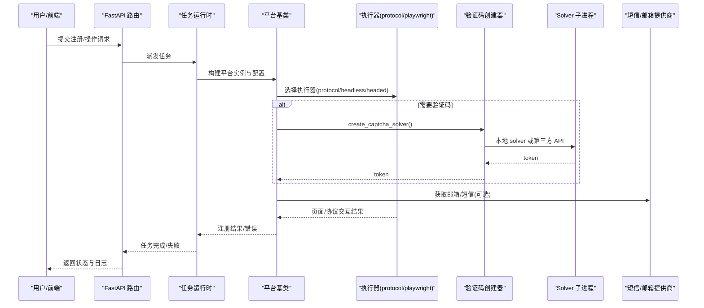
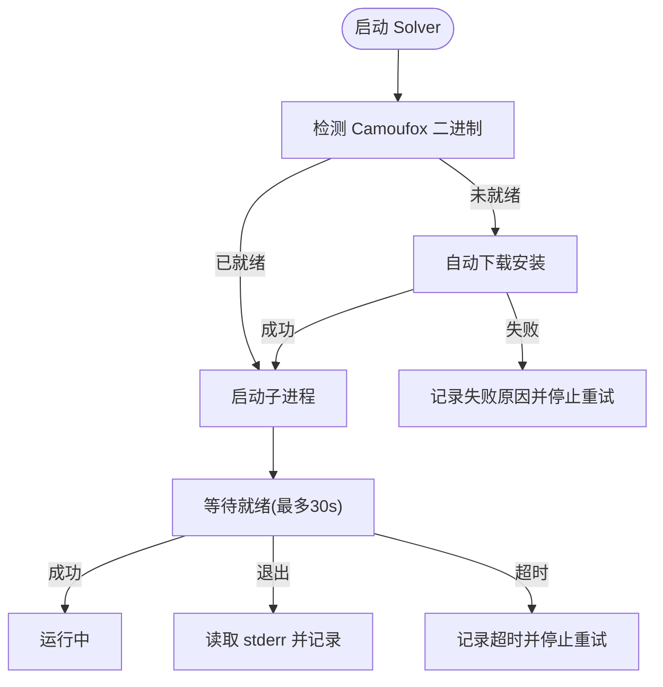
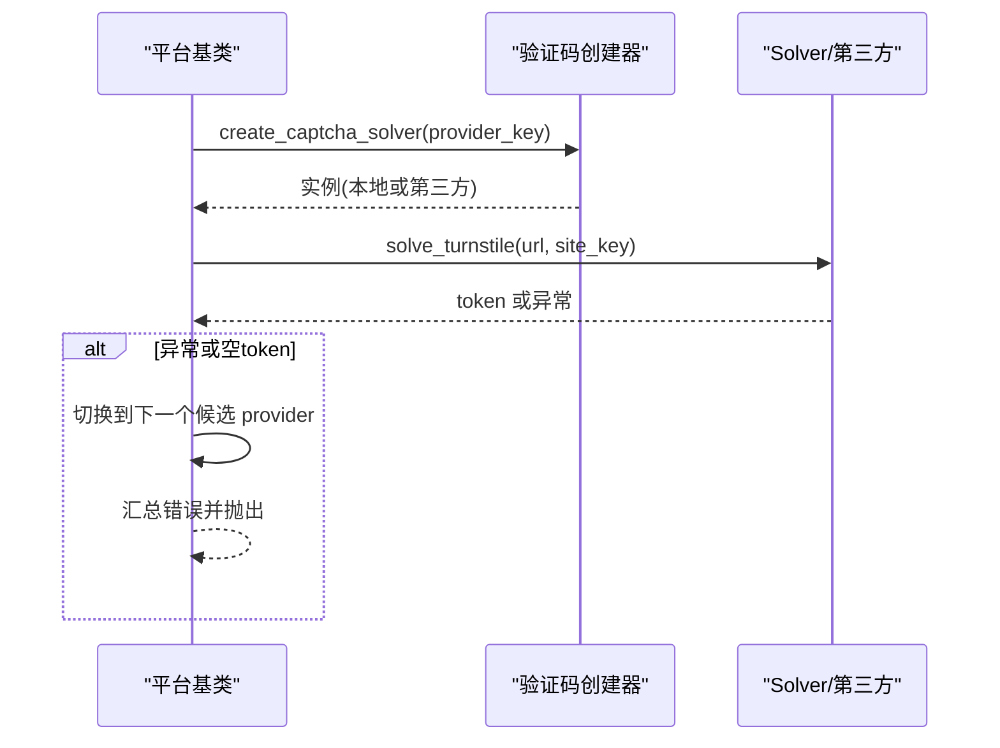
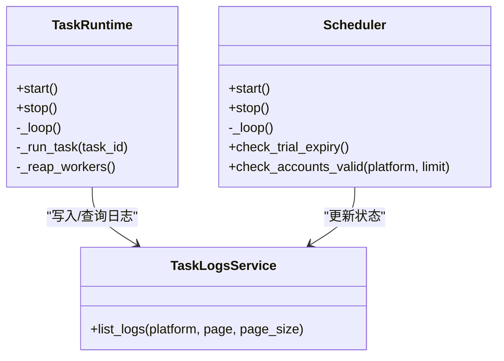
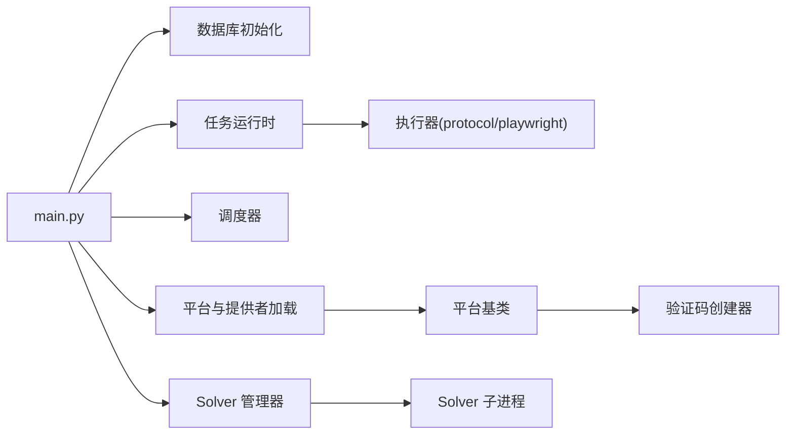

# 故障排查

<cite>
**本文引用的文件**
- [main.py](file://main.py)
- [services/solver_manager.py](file://services/solver_manager.py)
- [core/base_captcha.py](file://core/base_captcha.py)
- [core/base_platform.py](file://core/base_platform.py)
- [core/registration/errors.py](file://core/registration/errors.py)
- [api/task_logs.py](file://api/task_logs.py)
- [application/task_logs.py](file://application/task_logs.py)
- [infrastructure/system_runtime.py](file://infrastructure/system_runtime.py)
- [core/scheduler.py](file://core/scheduler.py)
- [services/task_runtime.py](file://services/task_runtime.py)
- [api/health.py](file://api/health.py)
- [core/executors/playwright.py](file://core/executors/playwright.py)
- [core/executors/protocol.py](file://core/executors/protocol.py)
- [platforms/chatgpt/browser_register.py](file://platforms/chatgpt/browser_register.py)
- [core/base_sms.py](file://core/base_sms.py)
</cite>

## 目录
1. [简介](#简介)
2. [项目结构](#项目结构)
3. [核心组件](#核心组件)
4. [架构总览](#架构总览)
5. [详细组件分析](#详细组件分析)
6. [依赖关系分析](#依赖关系分析)
7. [性能注意事项](#性能注意事项)
8. [故障排查指南](#故障排查指南)
9. [结论](#结论)
10. [附录：问题报告模板与调试清单](#附录：问题报告模板与调试清单)

## 简介
本指南面向自动化注册系统的运维与研发人员，聚焦“快速定位与解决问题”。内容覆盖常见问题识别（浏览器启动失败、验证码超时、短信接收异常等）、日志分析方法（应用日志、调试日志、浏览器控制台）、性能诊断工具与技术（CPU/内存、网络请求、数据库查询优化），以及系统级问题排查（Docker、网络连通性、磁盘空间）。文末提供问题报告模板与调试信息收集清单，帮助高效复现与修复。

## 项目结构
系统由 FastAPI 后端、任务调度与执行器、验证码解决服务、平台插件与第三方服务（短信、代理、验证码）组成。关键入口在 main.py，启动时初始化数据库、加载平台与提供者、启动调度器、任务运行时与验证码 Solver 子进程。

图表来源
- [main.py:67-91](file://main.py#L67-L91)
- [services/solver_manager.py:73-155](file://services/solver_manager.py#L73-L155)
- [core/base_platform.py:316-328](file://core/base_platform.py#L316-L328)
- [core/base_captcha.py:67-97](file://core/base_captcha.py#L67-L97)
- [api/health.py:11-18](file://api/health.py#L11-L18)
- [api/task_logs.py:11-13](file://api/task_logs.py#L11-L13)
- [application/task_logs.py:11-28](file://application/task_logs.py#L11-L28)

章节来源
- [main.py:67-91](file://main.py#L67-L91)

## 核心组件
- 任务运行时：负责拉取可执行任务、按平台并发限制派发线程执行，并在完成后回收。
- 定时调度器：周期性检查账号有效期与试用到期，更新状态。
- Solver 管理器：管理 Turnstile 验证码子进程生命周期，自动下载浏览器二进制并监控端口。
- 平台基类：统一注册流程、执行器选择、验证码 provider 解析与回退策略。
- 健康检查：对外暴露 /health 与 /ready，便于容器编排与健康探测。
- 任务日志：持久化任务执行结果与错误详情，供前端与排障使用。

章节来源
- [services/task_runtime.py:18-101](file://services/task_runtime.py#L18-L101)
- [core/scheduler.py:19-114](file://core/scheduler.py#L19-L114)
- [services/solver_manager.py:21-38](file://services/solver_manager.py#L21-L38)
- [core/base_platform.py:124-160](file://core/base_platform.py#L124-L160)
- [api/health.py:11-18](file://api/health.py#L11-L18)
- [application/task_logs.py:11-28](file://application/task_logs.py#L11-L28)

## 架构总览
下图展示从 API 到执行器、验证码与外部服务的调用链，突出关键故障点与日志落点。

图表来源
- [services/task_runtime.py:47-85](file://services/task_runtime.py#L47-L85)
- [core/base_platform.py:316-328](file://core/base_platform.py#L316-L328)
- [core/base_captcha.py:67-97](file://core/base_captcha.py#L67-L97)
- [services/solver_manager.py:73-155](file://services/solver_manager.py#L73-L155)

## 详细组件分析

### 浏览器启动失败
- 现象：headless/headed 模式无法打开浏览器；Playwright 报错；Camoufox 未安装或下载失败。
- 可能原因：
  - Playwright 浏览器未安装或环境缺失（Windows 编码问题已在入口处理）。
  - Camoufox 二进制未就绪，Solver 启动前会尝试自动下载。
  - 端口占用或权限不足导致子进程退出。
- 定位要点：
  - 查看 Solver 管理器连续失败计数与最后错误信息。
  - 检查 /api/system 的 solver_status 接口返回的 running、last_error、stopped_retrying。
  - 确认端口 8889 是否被占用。
- 处置建议：
  - 手动重启 Solver（通过系统接口或调用 restart）。
  - 清理残留进程后重试。
  - 若为 Windows 中文环境，确保 stdout/stderr 已重设为 UTF-8（入口已兜底）。

图表来源
- [services/solver_manager.py:41-70](file://services/solver_manager.py#L41-L70)
- [services/solver_manager.py:73-155](file://services/solver_manager.py#L73-L155)

章节来源
- [services/solver_manager.py:21-38](file://services/solver_manager.py#L21-L38)
- [services/solver_manager.py:73-155](file://services/solver_manager.py#L73-L155)
- [main.py:5-28](file://main.py#L5-L28)

### 验证码解决超时
- 现象：Turnstile 或图片验证码长时间无响应或返回空 token。
- 可能原因：
  - 未配置或未启用验证码 provider。
  - 本地 solver 未启动或崩溃。
  - 第三方 Key 缺失或配额耗尽。
- 定位要点：
  - 检查 base_captcha 的 has_captcha_configured 与 create_captcha_solver 行为。
  - 查看 base_platform.solve_turnstile_with_fallback 的回退日志。
  - 关注任务日志中的 error/detail 字段。
- 处置建议：
  - 在设置页启用并配置默认验证码 provider。
  - 对 local_solver 类型，确保 Solver 子进程运行正常。
  - 切换备用 provider 或增加超时阈值。

图表来源
- [core/base_captcha.py:48-97](file://core/base_captcha.py#L48-L97)
- [core/base_platform.py:412-430](file://core/base_platform.py#L412-L430)

章节来源
- [core/base_captcha.py:48-97](file://core/base_captcha.py#L48-L97)
- [core/base_platform.py:345-394](file://core/base_platform.py#L345-L394)
- [core/base_platform.py:412-430](file://core/base_platform.py#L412-L430)

### 短信接收异常
- 现象：注册流程需要短信/邮箱验证，但收不到验证码或号码不可用。
- 可能原因：
  - 短信提供商配置错误或配额不足。
  - 号码激活未完成或已被释放。
  - 回调/轮询机制未生效。
- 定位要点：
  - 检查短信提供商实现与回调控制器。
  - 查看任务日志 detail 中的 provider_account/provider_resource。
  - 确认 is_herosms_phone_cache_alive 返回的 alive 状态。
- 处置建议：
  - 更换国家/服务或重新申请号码。
  - 清理未使用的激活，避免资源泄漏。
  - 调整重试与超时参数。

章节来源
- [core/base_sms.py:1031-1056](file://core/base_sms.py#L1031-L1056)
- [core/base_sms.py:1233-1265](file://core/base_sms.py#L1233-L1265)

### 任务执行与日志
- 任务运行时以线程池方式执行任务，支持最大并行度与每平台并发限制。
- 任务日志通过 API 分页查询，包含平台、邮箱、状态、错误与详情。
- 调度器每小时检查试用到期并更新账号状态。

图表来源
- [services/task_runtime.py:18-101](file://services/task_runtime.py#L18-L101)
- [core/scheduler.py:19-114](file://core/scheduler.py#L19-L114)
- [application/task_logs.py:7-28](file://application/task_logs.py#L7-L28)

章节来源
- [services/task_runtime.py:18-101](file://services/task_runtime.py#L18-L101)
- [core/scheduler.py:19-114](file://core/scheduler.py#L19-L114)
- [application/task_logs.py:7-28](file://application/task_logs.py#L7-L28)

### 健康检查与系统状态
- /api/health 与 /api/ready 用于健康探测。
- 系统运行时提供 solver_status 与 restart_solver 能力，便于容器编排与自愈。

章节来源
- [api/health.py:11-18](file://api/health.py#L11-L18)
- [infrastructure/system_runtime.py:6-13](file://infrastructure/system_runtime.py#L6-L13)

## 依赖关系分析
- 主进程依赖：数据库初始化、平台与提供者加载、调度器与任务运行时启动、Solver 子进程管理。
- 平台基类依赖：执行器选择（protocol/playwright）、验证码 provider 解析与回退、身份提供者（邮箱/OAuth）。
- Solver 管理器依赖：Camoufox 二进制管理与子进程生命周期控制。
- 任务运行时依赖：任务队列、并发控制、线程回收。

图表来源
- [main.py:67-91](file://main.py#L67-L91)
- [core/base_platform.py:316-328](file://core/base_platform.py#L316-L328)
- [services/solver_manager.py:73-155](file://services/solver_manager.py#L73-L155)

章节来源
- [main.py:67-91](file://main.py#L67-L91)
- [core/base_platform.py:316-328](file://core/base_platform.py#L316-L328)
- [services/solver_manager.py:73-155](file://services/solver_manager.py#L73-L155)

## 性能注意事项
- 并发与限流：任务运行时支持 max_parallel_tasks 与 max_parallel_per_platform，避免资源争用。
- 浏览器开销：headless/headed 模式频繁启动浏览器会显著影响 CPU/内存，建议复用会话与合理批处理。
- 网络请求：验证码与短信/邮箱提供商存在外部依赖，需设置合理超时与重试策略。
- 数据库：批量有效性检查与试用到期扫描应限制每次处理的账号数量，避免长事务。

[本节为通用指导，不直接分析具体文件]

## 故障排查指南

### 常见问题与定位步骤

- 浏览器启动失败
  - 检查 Solver 状态：/api/system 的 solver_status 返回 running、last_error、stopped_retrying。
  - 查看连续失败次数与最后错误信息，必要时重启 Solver。
  - 确认 Camoufox 二进制是否已下载；如失败，检查网络与磁盘空间。
  - 若使用 headless/headed 模式，确认 Playwright 浏览器已安装且环境变量正确。

- 验证码解决超时
  - 检查是否启用了可用的验证码 provider；浏览器模式必须配置默认 provider。
  - 对 local_solver 类型，确保 Solver 子进程运行正常；否则切换到第三方 provider。
  - 查看任务日志 detail 中的错误堆栈与 provider 名称，定位具体失败点。

- 短信接收异常
  - 检查短信提供商配置（Key、国家、服务）与配额。
  - 使用 is_herosms_phone_cache_alive 判断当前缓存是否可用。
  - 清理未使用的激活，避免号码泄漏；必要时更换国家或服务。

- 任务执行失败
  - 通过 /api/tasks/logs 分页查询最近失败任务，关注 status、error、detail。
  - 根据 platform 过滤，缩小范围；结合执行器类型（protocol/headless/headed）定位。
  - 对 OAuth/浏览器模式，检查 identity_provider 与浏览器会话复用情况。

- 系统级问题
  - Docker：检查容器健康端点 /api/health 与 /api/ready；查看容器日志输出。
  - 网络：确认外网访问（验证码、短信、代理）可达；检查防火墙与代理配置。
  - 磁盘：确保 Camoufox 下载与浏览器数据目录有足够空间。

章节来源
- [services/solver_manager.py:21-38](file://services/solver_manager.py#L21-L38)
- [core/base_captcha.py:48-97](file://core/base_captcha.py#L48-L97)
- [core/base_platform.py:345-394](file://core/base_platform.py#L345-L394)
- [core/base_sms.py:1031-1056](file://core/base_sms.py#L1031-L1056)
- [application/task_logs.py:11-28](file://application/task_logs.py#L11-L28)
- [api/health.py:11-18](file://api/health.py#L11-L18)

### 日志分析方法

- 应用日志
  - 主进程启动日志：数据库初始化、平台加载、调度器与任务运行时启动。
  - Solver 子进程日志：stderr 捕获与连续失败计数；端口占用与进程清理。
  - 任务执行日志：通过 /api/tasks/logs 查询，关注 error 与 detail。

- 调试日志
  - 平台基类 log 输出：执行器选择、验证码 provider 尝试与失败原因。
  - 浏览器模式：可在页面交互处插入断点或抓包，观察网络请求与页面状态。

- 浏览器控制台日志
  - 对于 headed 模式，打开开发者工具，查看 Console、Network、Performance 面板。
  - 关注 Turnstile 相关脚本加载与 token 生成过程。

章节来源
- [main.py:67-91](file://main.py#L67-L91)
- [services/solver_manager.py:115-155](file://services/solver_manager.py#L115-L155)
- [application/task_logs.py:11-28](file://application/task_logs.py#L11-L28)
- [core/base_platform.py:412-430](file://core/base_platform.py#L412-L430)

### 性能问题诊断工具与技术

- CPU 与内存使用
  - 使用系统工具（top、htop、perf、tasklist）观察 Python 进程与子进程资源占用。
  - 针对浏览器模式，监控多进程/多线程导致的上下文切换与内存增长。

- 网络请求监控
  - 使用抓包工具（Wireshark、Charles）或浏览器 Network 面板，分析验证码与短信请求耗时与错误码。
  - 关注代理配置与连接池设置，避免阻塞。

- 数据库查询优化
  - 批量有效性检查与试用到期扫描限制每次处理数量，减少锁竞争。
  - 为常用查询字段建立索引，避免全表扫描。

[本节为通用指导，不直接分析具体文件]

### 系统级问题排查方法

- Docker 容器问题
  - 检查 /api/health 与 /api/ready 返回状态；查看容器日志与资源限制。
  - 使用 docker logs 与 docker exec 进入容器进行网络与磁盘检查。

- 网络连通性检查
  - 测试外网访问（验证码、短信、代理）；检查 DNS 与防火墙规则。
  - 对代理模式，验证代理地址与认证信息。

- 磁盘空间监控
  - 确保 Camoufox 下载路径与浏览器数据目录有足够空间。
  - 定期清理临时文件与旧日志，避免磁盘写满。

[本节为通用指导，不直接分析具体文件]

## 结论
通过理解任务运行时、调度器、Solver 管理器与平台基类的职责边界，结合健康检查、任务日志与系统状态接口，可以快速定位浏览器启动、验证码与短信相关问题。配合性能诊断与系统级排查方法，能有效提升稳定性与可维护性。

[本节为总结，不直接分析具体文件]

## 附录：问题报告模板与调试清单

- 问题报告模板
  - 标题：简述问题现象与影响范围
  - 环境：操作系统、Python 版本、Docker 镜像版本、部署方式
  - 复现步骤：最小化操作步骤与输入参数
  - 期望结果：预期行为
  - 实际结果：错误信息、截图或录屏
  - 日志附件：应用日志、任务日志、Solver 日志、浏览器控制台日志
  - 指标数据：CPU/内存/网络/磁盘使用情况
  - 关联变更：最近代码/配置变更与版本信息

- 调试信息收集清单
  - 应用日志：主进程启动日志、任务执行日志、调度器日志
  - Solver 日志：子进程 stderr、端口占用情况、连续失败计数
  - 任务日志：/api/tasks/logs 的分页结果，筛选失败任务
  - 健康检查：/api/health 与 /api/ready 的返回
  - 系统状态：solver_status 的 running、last_error、stopped_retrying
  - 浏览器控制台：Console、Network、Performance 面板导出
  - 网络抓包：验证码与短信请求的请求/响应报文
  - 系统资源：CPU、内存、磁盘、网络连接数

[本节为模板与清单，不直接分析具体文件]