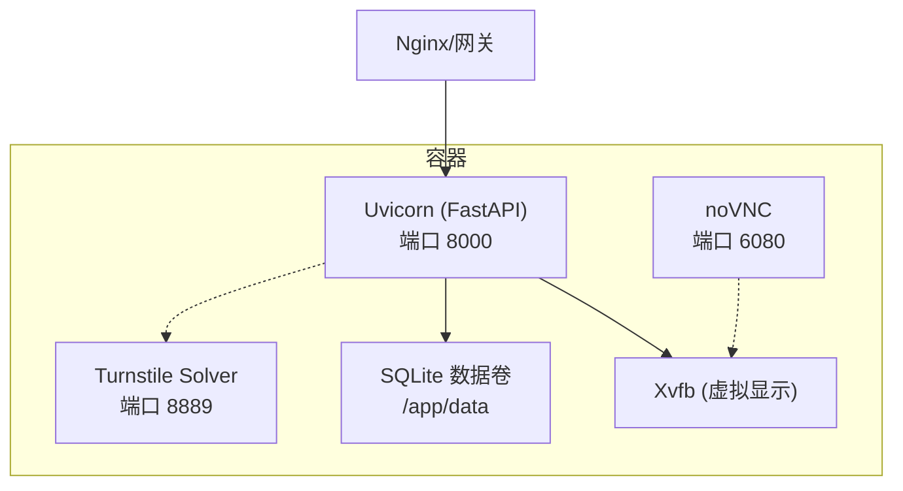
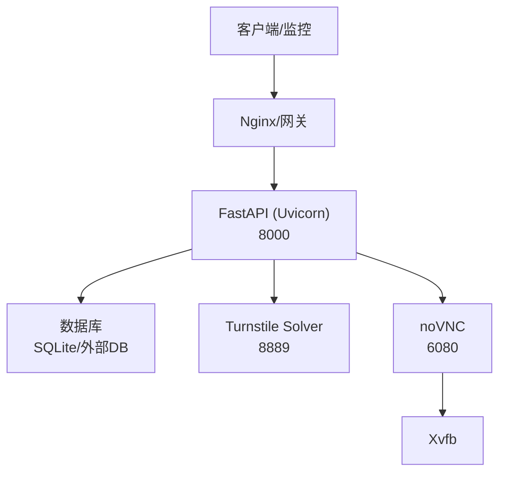
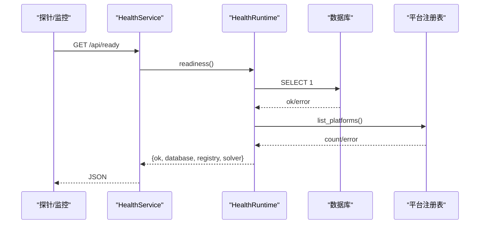
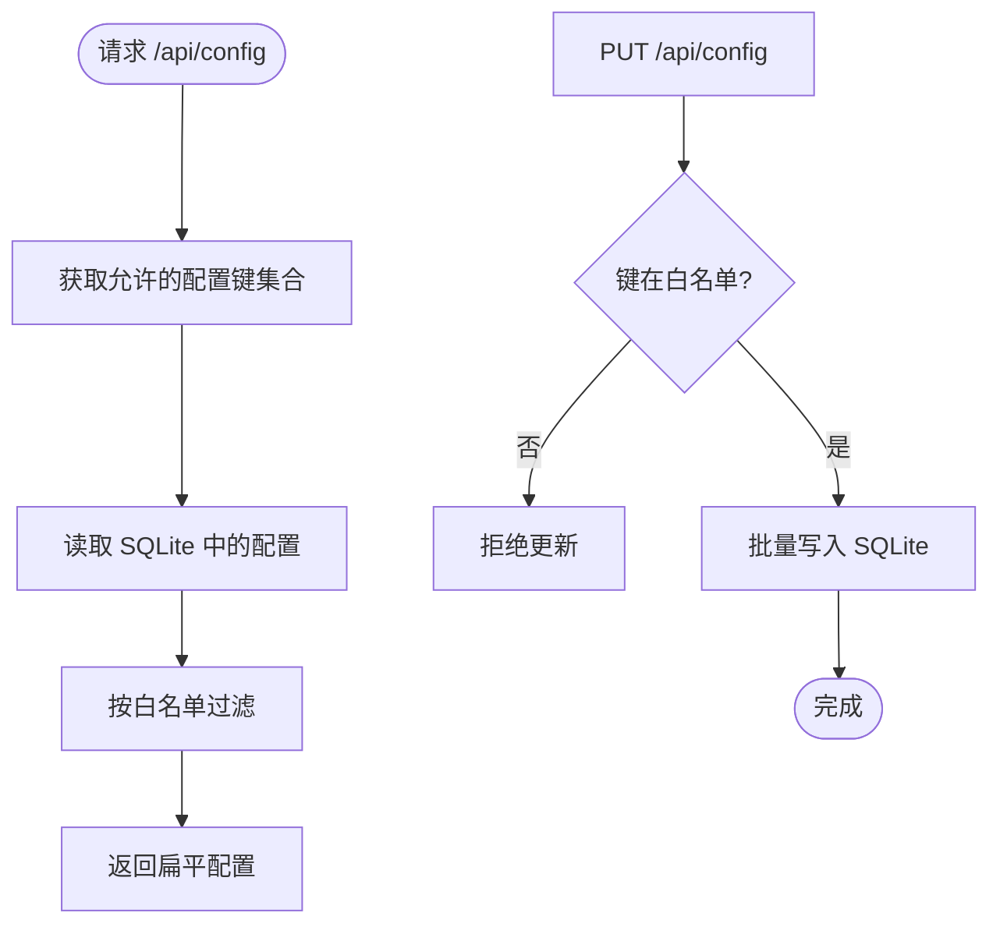
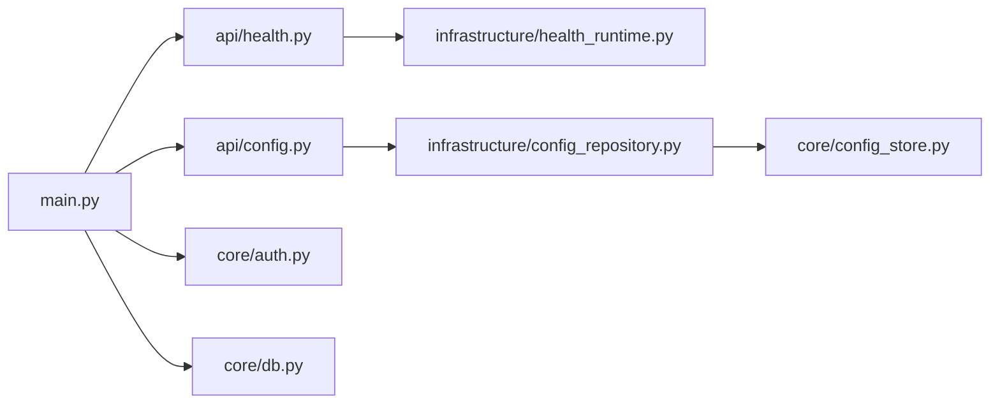

# 生产环境部署

<cite>
**本文引用的文件**
- [main.py](file://main.py)
- [Dockerfile](file://Dockerfile)
- [docker-compose.yml](file://docker-compose.yml)
- [docker-entrypoint.sh](file://docker-entrypoint.sh)
- [requirements.txt](file://requirements.txt)
- [api/health.py](file://api/health.py)
- [application/health.py](file://application/health.py)
- [infrastructure/health_runtime.py](file://infrastructure/health_runtime.py)
- [core/auth.py](file://core/auth.py)
- [core/db.py](file://core/db.py)
- [core/config_store.py](file://core/config_store.py)
- [infrastructure/config_repository.py](file://infrastructure/config_repository.py)
- [application/config.py](file://application/config.py)
- [api/config.py](file://api/config.py)
</cite>

## 目录
1. [简介](#简介)
2. [项目结构](#项目结构)
3. [核心组件](#核心组件)
4. [架构总览](#架构总览)
5. [详细组件分析](#详细组件分析)
6. [依赖关系分析](#依赖关系分析)
7. [性能考虑](#性能考虑)
8. [故障排查指南](#故障排查指南)
9. [结论](#结论)
10. [附录](#附录)

## 简介
本指南面向生产环境，提供从容器化部署、反向代理与负载均衡、数据库与配置管理、健康检查与监控集成、安全加固到性能调优与扩缩容的完整实践。系统基于 FastAPI + Uvicorn 后端，SQLite（可替换为外部数据库）持久化，内置浏览器自动化能力（Playwright/Camoufox），并提供 noVNC 可视化调试与 Turnstile Solver 子服务。

## 项目结构
- 应用入口与生命周期：主进程启动 FastAPI、初始化数据库、加载平台与 Provider、启动任务调度器与 Solver 管理器。
- API 路由：统一挂载于 /api，包含健康检查、配置、账号、任务、代理等模块。
- 运行时基础设施：健康检查、配置仓库、数据库模型与迁移、Provider 定义与设置。
- 容器化：Dockerfile 构建前端静态资源并打包 Python 运行环境；docker-compose 编排端口与环境变量；entrypoint 启动 Xvfb、noVNC 与 Uvicorn。

**图表来源**
- [main.py:67-94](file://main.py#L67-L94)
- [docker-entrypoint.sh:1-23](file://docker-entrypoint.sh#L1-L23)
- [Dockerfile:10-58](file://Dockerfile#L10-L58)
- [docker-compose.yml:1-18](file://docker-compose.yml#L1-L18)

**章节来源**
- [main.py:67-146](file://main.py#L67-L146)
- [Dockerfile:1-61](file://Dockerfile#L1-L61)
- [docker-compose.yml:1-18](file://docker-compose.yml#L1-L18)
- [docker-entrypoint.sh:1-23](file://docker-entrypoint.sh#L1-L23)

## 核心组件
- 应用生命周期：在 lifespan 中完成数据库初始化、平台与 Provider 注册、调度器与 Solver 启动，并在关闭时有序停止。
- 认证中间件：支持通过环境变量或配置项启用访问口令保护，对 /api 路径进行鉴权，健康检查端点保持公开。
- 健康检查：/api/health 与 /api/ready 分别返回存活与就绪状态，就绪检查包含数据库连通性与平台注册表可用性。
- 配置管理：通过 REST 接口读取/更新键值型配置，底层存储于 SQLite，支持白名单校验与 Provider 字段注入。
- 数据库：SQLModel 建模，默认 SQLite 文件，支持列迁移与历史数据兼容处理。

**章节来源**
- [main.py:67-94](file://main.py#L67-L94)
- [core/auth.py:1-49](file://core/auth.py#L1-L49)
- [api/health.py:1-19](file://api/health.py#L1-L19)
- [application/health.py:1-15](file://application/health.py#L1-L15)
- [infrastructure/health_runtime.py:1-42](file://infrastructure/health_runtime.py#L1-L42)
- [api/config.py:1-29](file://api/config.py#L1-L29)
- [application/config.py:1-21](file://application/config.py#L1-L21)
- [infrastructure/config_repository.py:1-43](file://infrastructure/config_repository.py#L1-L43)
- [core/config_store.py:1-49](file://core/config_store.py#L1-L49)
- [core/db.py:16-23](file://core/db.py#L16-L23)
- [core/db.py:430-446](file://core/db.py#L430-L446)

## 架构总览
下图展示生产环境的典型部署拓扑：外部流量经 Nginx/网关进入 FastAPI，内部通过 noVNC 查看浏览器执行过程，Solver 作为独立子进程提供服务，数据落盘至 SQLite（生产建议迁移至外部数据库）。

**图表来源**
- [main.py:94-121](file://main.py#L94-L121)
- [docker-entrypoint.sh:1-23](file://docker-entrypoint.sh#L1-L23)
- [Dockerfile:10-58](file://Dockerfile#L10-L58)

## 详细组件分析

### 健康检查与监控集成
- 端点说明
  - GET /api/health：返回服务存活信息。
  - GET /api/ready：返回就绪信息，包含数据库连接、平台注册表状态与 Solver 运行状态。
- 监控集成建议
  - 使用 /api/ready 作为 K8s Liveness/Readiness Probe。
  - 将 /api/health 暴露给 Prometheus Blackbox Exporter 或云厂商探针。
  - 结合日志采集（stdout/stderr UTF-8 输出）与指标上报（可扩展自定义指标）。

**图表来源**
- [api/health.py:11-18](file://api/health.py#L11-L18)
- [application/health.py:6-15](file://application/health.py#L6-L15)
- [infrastructure/health_runtime.py:15-42](file://infrastructure/health_runtime.py#L15-L42)

**章节来源**
- [api/health.py:1-19](file://api/health.py#L1-L19)
- [application/health.py:1-15](file://application/health.py#L1-L15)
- [infrastructure/health_runtime.py:1-42](file://infrastructure/health_runtime.py#L1-L42)

### 配置管理与版本控制
- 配置来源与优先级
  - 环境变量：如 APP_PASSWORD 用于鉴权开关。
  - 运行时配置：通过 /api/config 读写键值对，持久化到 SQLite。
  - Provider 字段：根据 Provider 定义动态注入允许的配置键。
- 版本控制策略
  - 将“允许的配置键集合”与 Provider 定义纳入代码库版本控制。
  - 运行时配置变更通过 API 审计日志记录，配合外部备份策略。
- 关键实现
  - 配置仓库维护白名单，仅允许受控键写入。
  - 配置存储为简单 key-value 表，支持批量更新。

**图表来源**
- [infrastructure/config_repository.py:7-43](file://infrastructure/config_repository.py#L7-L43)
- [core/config_store.py:13-49](file://core/config_store.py#L13-L49)
- [application/config.py:9-21](file://application/config.py#L9-L21)
- [api/config.py:16-28](file://api/config.py#L16-L28)

**章节来源**
- [api/config.py:1-29](file://api/config.py#L1-L29)
- [application/config.py:1-21](file://application/config.py#L1-L21)
- [infrastructure/config_repository.py:1-43](file://infrastructure/config_repository.py#L1-L43)
- [core/config_store.py:1-49](file://core/config_store.py#L1-L49)

### 安全加固
- 访问控制
  - 通过环境变量或配置开启口令保护，所有 /api 请求需携带 Bearer Token 或 Cookie。
  - 健康检查与认证相关端点保持公开，便于无凭据探测。
- HTTPS 与反向代理
  - 建议在 Nginx 终止 TLS，并将 HTTP 强制跳转 HTTPS。
  - 限制源 IP 范围，仅开放必要端口（80/443 对外，8000/6080/8889 对内）。
- 防火墙规则
  - 仅放行 80/443 到 Nginx；8000/6080/8889 仅对可信网段开放。
  - 禁止直接暴露数据库端口。
- 其他
  - 容器镜像最小化，移除不必要工具与源码。
  - 定期更新基础镜像与依赖。

**章节来源**
- [core/auth.py:1-49](file://core/auth.py#L1-L49)
- [Dockerfile:10-58](file://Dockerfile#L10-L58)

### 数据库集群与持久化
- 当前实现
  - 默认 SQLite 文件存储，适合单机或小规模场景。
  - 启动时自动建表与迁移，确保向后兼容。
- 生产建议
  - 将 DATABASE_URL 指向外部 PostgreSQL/MySQL 以支持高可用与扩展。
  - 使用只读副本分担查询压力，主库负责写操作。
  - 定期备份与恢复演练，确保 RPO/RTO 满足要求。

**章节来源**
- [core/db.py:16-23](file://core/db.py#L16-L23)
- [core/db.py:430-446](file://core/db.py#L430-L446)

### 浏览器实例管理与会话隔离
- 运行模式
  - 容器内通过 Xvfb 提供虚拟显示，noVNC 提供可视化调试。
  - Playwright/Camoufox 驱动浏览器执行自动化流程。
- 生产建议
  - 为每个并发任务分配独立用户数据目录，避免会话污染。
  - 合理设置并发度与超时，防止资源耗尽。
  - 使用独立的 Solver 子进程解耦验证码解析负载。

**章节来源**
- [docker-entrypoint.sh:1-23](file://docker-entrypoint.sh#L1-L23)
- [Dockerfile:10-38](file://Dockerfile#L10-L38)
- [main.py:133-146](file://main.py#L133-L146)

## 依赖关系分析
- 运行时依赖
  - Python 包：FastAPI、Uvicorn、SQLModel、Playwright、Camoufox、Quart 等。
  - 系统依赖：Chromium、Xvfb、noVNC、websockify 等。
- 组件耦合
  - main.py 聚合各路由与中间件，集中启动/停止生命周期。
  - health_runtime 依赖数据库引擎与平台注册表。
  - config_repository 依赖 provider_definitions 动态生成允许的配置键。

**图表来源**
- [main.py:43-121](file://main.py#L43-L121)
- [api/health.py:1-19](file://api/health.py#L1-L19)
- [application/health.py:1-15](file://application/health.py#L1-L15)
- [infrastructure/health_runtime.py:1-42](file://infrastructure/health_runtime.py#L1-L42)
- [api/config.py:1-29](file://api/config.py#L1-L29)
- [infrastructure/config_repository.py:1-43](file://infrastructure/config_repository.py#L1-L43)
- [core/config_store.py:1-49](file://core/config_store.py#L1-L49)
- [core/db.py:16-23](file://core/db.py#L16-L23)

**章节来源**
- [requirements.txt:1-20](file://requirements.txt#L1-L20)
- [main.py:43-121](file://main.py#L43-L121)

## 性能考虑
- 连接池与数据库
  - SQLite：适合低并发；生产建议切换至外部数据库并使用连接池。
  - 外部数据库：启用连接池大小、超时与重试策略，避免连接风暴。
- 内存与并发
  - 调整 Uvicorn workers 数量与线程数，匹配 CPU 核数。
  - 控制浏览器并发与任务队列长度，避免 OOM。
- 浏览器实例管理
  - 复用浏览器实例但隔离用户数据目录。
  - 设置合理的页面超时与资源限制。
- I/O 与网络
  - 使用 HTTP/2 与 Keep-Alive。
  - 缓存热点配置与 Provider 定义，减少重复计算。

[本节为通用指导，不直接分析具体文件]

## 故障排查指南
- 健康检查失败
  - 检查 /api/ready 返回的 database 与 registry 错误信息。
  - 确认数据库 URL 与权限正确，平台注册表可枚举。
- 认证失败
  - 确认已设置 APP_PASSWORD 且请求携带正确的 Authorization 或 Cookie。
  - 确认未误拦截 /api/health、/api/ready、/api/auth 等公开路径。
- 浏览器无法启动
  - 检查 Xvfb 与 noVNC 是否启动成功。
  - 确认 Playwright/Camoufox 浏览器已安装且依赖库齐全。
- 配置未生效
  - 通过 /api/config/options 查看允许的配置键。
  - 确认 PUT 请求的键在白名单内。

**章节来源**
- [infrastructure/health_runtime.py:15-42](file://infrastructure/health_runtime.py#L15-L42)
- [core/auth.py:19-49](file://core/auth.py#L19-L49)
- [docker-entrypoint.sh:1-23](file://docker-entrypoint.sh#L1-L23)
- [infrastructure/config_repository.py:20-43](file://infrastructure/config_repository.py#L20-L43)

## 结论
本指南提供了在生产环境中部署该系统的完整方案，涵盖容器化、反向代理、数据库与配置管理、健康检查与监控、安全加固、性能调优与扩缩容。建议在生产阶段优先切换到外部数据库、启用 HTTPS、严格访问控制，并结合监控告警体系保障稳定性与可观测性。

## 附录

### 反向代理与负载均衡（Nginx/Apache）
- Nginx 示例要点
  - 监听 80/443，终止 TLS，HTTP 强制跳转 HTTPS。
  - 反向代理 /api 到后端 8000，静态资源由后端或 CDN 提供。
  - 限制源 IP，仅开放必要端口。
- Apache 示例要点
  - 使用 mod_ssl 与 mod_proxy_wstunnel。
  - 配置 Location 与 ProxyPass，设置超时与缓冲参数。

[本节为通用指导，不直接分析具体文件]

### 数据库集群配置
- 选择外部数据库（PostgreSQL/MySQL）并通过环境变量注入连接串。
- 配置连接池大小、最大空闲连接、超时与重试。
- 读写分离与只读副本，提升查询吞吐。
- 定期备份与恢复演练，确保数据安全。

[本节为通用指导，不直接分析具体文件]

### 扩容与缩容最佳实践
- 水平扩容
  - 多实例无状态部署，共享外部数据库与对象存储。
  - 通过负载均衡分发请求，按 CPU/内存/请求延迟弹性伸缩。
- 垂直扩容
  - 增加单实例 CPU/内存，优化浏览器并发与连接池。
- 灰度发布
  - 蓝绿或金丝雀发布，逐步放量，观察健康检查与错误率。
- 回滚策略
  - 保留上一版本镜像与配置，快速回滚。

[本节为通用指导，不直接分析具体文件]