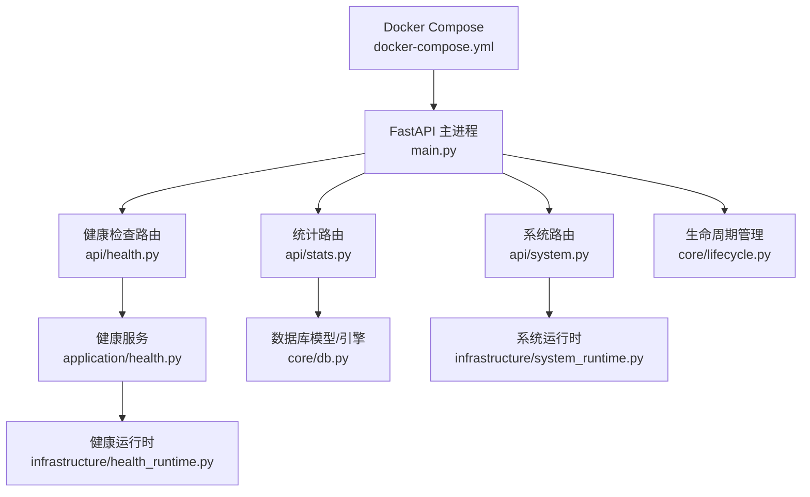
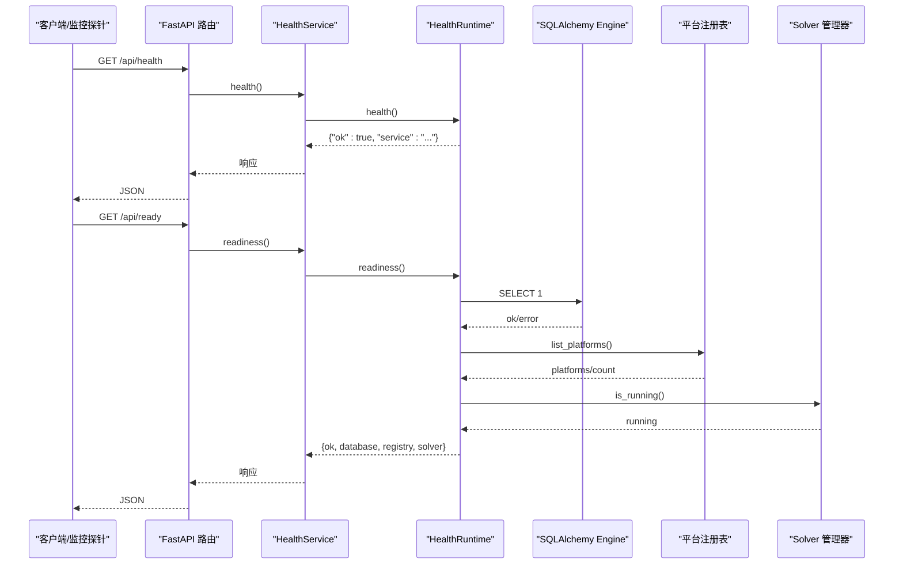
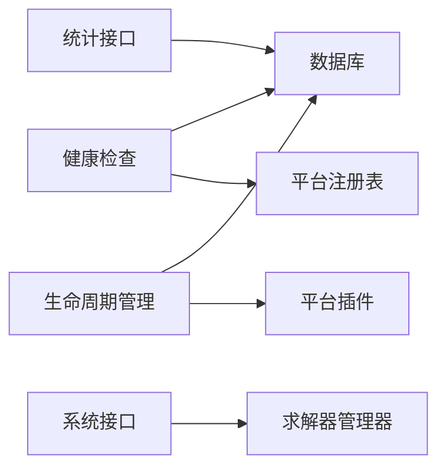

# 监控与告警

<cite>
**本文引用的文件**
- [main.py](file://main.py)
- [api/health.py](file://api/health.py)
- [application/health.py](file://application/health.py)
- [infrastructure/health_runtime.py](file://infrastructure/health_runtime.py)
- [api/stats.py](file://api/stats.py)
- [core/db.py](file://core/db.py)
- [api/system.py](file://api/system.py)
- [infrastructure/system_runtime.py](file://infrastructure/system_runtime.py)
- [core/lifecycle.py](file://core/lifecycle.py)
- [docker-compose.yml](file://docker-compose.yml)
- [README.md](file://README.md)
</cite>

## 目录
1. [简介](#简介)
2. [项目结构](#项目结构)
3. [核心组件](#核心组件)
4. [架构总览](#架构总览)
5. [详细组件分析](#详细组件分析)
6. [依赖关系分析](#依赖关系分析)
7. [性能考量](#性能考量)
8. [故障排查指南](#故障排查指南)
9. [结论](#结论)
10. [附录](#附录)

## 简介
本指南面向“自动注册系统”的监控与告警搭建，围绕健康检查、关键指标采集与展示、日志统一收集、告警规则配置、工具推荐与示例、以及故障预警与自动恢复策略展开。重点说明 /api/health 端点的集成方式，任务执行状态、账户注册成功率、系统资源使用情况的采集与可视化，并结合现有代码中的统计接口与生命周期管理，给出可落地的实施方案。

## 项目结构
后端基于 FastAPI，提供健康检查、统计、系统管理等 API；数据持久化通过 SQLModel + SQLite（可通过环境变量切换数据库）；前端为 React 应用，内置仪表盘与账号视图；容器化部署通过 docker-compose 暴露 Web UI、noVNC 与 Solver 端口。

图表来源
- [main.py:30-121](file://main.py#L30-L121)
- [api/health.py:1-19](file://api/health.py#L1-L19)
- [application/health.py:1-15](file://application/health.py#L1-L15)
- [infrastructure/health_runtime.py:1-42](file://infrastructure/health_runtime.py#L1-L42)
- [api/stats.py:1-152](file://api/stats.py#L1-L152)
- [core/db.py:1-200](file://core/db.py#L1-L200)
- [api/system.py:1-93](file://api/system.py#L1-L93)
- [infrastructure/system_runtime.py:1-14](file://infrastructure/system_runtime.py#L1-L14)
- [core/lifecycle.py:1-200](file://core/lifecycle.py#L1-L200)
- [docker-compose.yml:1-18](file://docker-compose.yml#L1-L18)

章节来源
- [main.py:30-121](file://main.py#L30-L121)
- [docker-compose.yml:1-18](file://docker-compose.yml#L1-L18)

## 核心组件
- 健康检查：/api/health 与 /api/ready，分别返回服务存活与就绪状态，包含数据库连通性、平台注册表可用性、求解器运行状态等。
- 统计指标：/api/stats/* 提供全局概览、按平台成功率、按天趋势、代理成功率排行、错误聚合等，用于注册成功率与任务执行状态的监控。
- 系统信息：/api/solver/status、/api/solver/restart、/api/version，用于求解器管理与版本更新提示。
- 生命周期：后台定时任务负责账号有效性检测、Token 续期、Trial 过期预警等，支撑风险中心告警。

章节来源
- [api/health.py:1-19](file://api/health.py#L1-L19)
- [application/health.py:1-15](file://application/health.py#L1-L15)
- [infrastructure/health_runtime.py:1-42](file://infrastructure/health_runtime.py#L1-L42)
- [api/stats.py:1-152](file://api/stats.py#L1-L152)
- [api/system.py:1-93](file://api/system.py#L1-L93)
- [core/lifecycle.py:1-200](file://core/lifecycle.py#L1-L200)

## 架构总览
下图展示了从请求到健康检查与统计数据的处理链路，以及后端与数据库、生命周期管理的交互。

图表来源
- [api/health.py:11-18](file://api/health.py#L11-L18)
- [application/health.py:6-14](file://application/health.py#L6-L14)
- [infrastructure/health_runtime.py:11-41](file://infrastructure/health_runtime.py#L11-L41)
- [core/db.py:21-22](file://core/db.py#L21-L22)

## 详细组件分析

### 健康检查机制与 /api/health 集成
- 路由层：在 main.py 中挂载 health_router，对外暴露 /api/health 与 /api/ready。
- 服务层：HealthService 委托 HealthRuntime 完成具体检查。
- 运行时层：
  - health：返回服务标识与基本存活信息。
  - readiness：检查数据库连接、平台注册表加载情况、求解器是否运行，并汇总 ok 标志与错误信息。

建议集成方式：
- 将 /api/health 作为存活探针（liveness），/api/ready 作为就绪探针（readiness）。
- 在 Kubernetes/编排系统中配置 liveness/readiness 探针调用这两个端点。
- 外部监控系统定期轮询 /api/ready，结合错误码与字段进行可用性判定。

章节来源
- [main.py:43-121](file://main.py#L43-L121)
- [api/health.py:1-19](file://api/health.py#L1-L19)
- [application/health.py:1-15](file://application/health.py#L1-L15)
- [infrastructure/health_runtime.py:11-41](file://infrastructure/health_runtime.py#L11-L41)

### 关键指标采集与展示
- 任务执行状态与注册成功率：
  - /api/stats/overview：总注册数、成功/失败数、成功率、账号状态分布、账号总数。
  - /api/stats/by-platform：按平台维度统计成功/失败/总数与成功率。
  - /api/stats/by-day：按天维度统计注册趋势与成功率。
  - /api/stats/errors：最近 N 天的失败错误聚合，便于定位问题根因。
- 代理成功率排行：/api/stats/by-proxy，支持按代理维度评估稳定性。
- 数据源：TaskLog、AccountModel、AccountOverviewModel、ProxyModel 等模型，位于 core/db.py。

展示建议：
- 使用 Grafana 或前端 Dashboard 接入上述统计接口，构建“注册成功率”“错误归因”“代理质量”等看板。
- 对 by-day 与 by-platform 做时间序列与分组对比，识别异常波动与瓶颈平台。

章节来源
- [api/stats.py:18-152](file://api/stats.py#L18-L152)
- [core/db.py:25-200](file://core/db.py#L25-L200)

### 系统资源与运行态监控
- 求解器状态与重启：/api/solver/status、/api/solver/restart，配合 infrastructure/system_runtime.py 实现状态查询与异步重启。
- 版本与更新提示：/api/version 获取当前版本与 GitHub 最新 release，前端据此提示升级。
- 生命周期任务：core/lifecycle.py 提供账号有效性检测、Token 续期、Trial 过期预警等周期性任务，可作为风险告警的数据基础。

章节来源
- [api/system.py:71-93](file://api/system.py#L71-L93)
- [infrastructure/system_runtime.py:1-14](file://infrastructure/system_runtime.py#L1-L14)
- [core/lifecycle.py:1-200](file://core/lifecycle.py#L1-L200)

### 日志收集方案
- 应用日志：
  - 标准输出重定向为 UTF-8，避免非 GBK 字符导致崩溃；子进程也通过 PYTHONUTF8 保证编码一致。
  - 部分模块（如 Turnstile Solver）自定义日志类并输出到 stdout。
- 系统日志：
  - 容器化部署时，stdout/stderr 由容器运行时收集，可对接 journald 或宿主机日志系统。
- 浏览器日志：
  - 前端通过 SSE 推送注册步骤日志至界面，便于实时追踪与定位问题。
- 统一收集建议：
  - 使用 Filebeat/Fluent Bit 采集容器 stdout/stderr 与应用日志文件，转发至 Elasticsearch。
  - 使用 Kibana 进行日志检索与可视化，结合业务关键字（如错误类型、平台名）建立索引与告警。

章节来源
- [main.py:1-28](file://main.py#L1-L28)
- [services/turnstile_solver/api_solver.py:45-59](file://services/turnstile_solver/api_solver.py#L45-L59)
- [README.md:66-76](file://README.md#L66-L76)

### 告警规则配置
- 错误率阈值：
  - 基于 /api/stats/errors 的错误聚合，设置近 N 小时错误数量或错误率超过阈值的告警。
  - 可按平台维度细分，避免误报。
- 性能指标异常：
  - 结合 /api/stats/by-day 的成功率曲线，当成功率低于目标值或出现断崖式下跌时触发告警。
  - 关注 /api/stats/by-proxy 的代理成功率，低质量代理占比过高时告警。
- 服务可用性监控：
  - 对 /api/ready 进行周期探测，连续失败次数达到阈值即告警。
  - 对 /api/solver/status 进行可用性检查，若不可用则触发重启或降级策略。
- 生命周期相关告警：
  - 基于 core/lifecycle.py 的检测与预警逻辑，对 Trial 即将耗尽、Token 过期、账号失效等情况生成告警事件。

实施建议：
- 使用 Prometheus 抓取 /api/ready 与统计接口，Grafana 展示面板与 Alertmanager 发送通知。
- 或使用 ELK Stack 的日志告警能力，对错误关键词与频率进行规则匹配。

章节来源
- [api/stats.py:18-152](file://api/stats.py#L18-L152)
- [api/system.py:71-93](file://api/system.py#L71-L93)
- [core/lifecycle.py:1-200](file://core/lifecycle.py#L1-L200)

### 监控工具推荐与配置示例
- Prometheus + Grafana：
  - 使用 blackbox_exporter 探测 /api/health 与 /api/ready，记录存活与就绪状态。
  - 编写自定义 exporter 或脚本定期调用 /api/stats/* 接口，将成功率、错误数、代理质量等指标暴露给 Prometheus。
  - 在 Grafana 创建看板，展示“注册成功率趋势”“错误归因排行”“代理质量排名”。
- ELK Stack：
  - 通过 Filebeat/Fluent Bit 采集 stdout/stderr 与应用日志，写入 Elasticsearch。
  - 使用 Kibana 建立索引与可视化，配置 Logstash 或 ES 管道进行过滤与富化。
  - 基于 Kibana Alerts 或 Elastic Watcher 设置错误率与异常模式告警。
- 容器化部署：
  - docker-compose.yml 已暴露 8000（Web UI）、6080（noVNC）、8889（Solver）端口，便于本地调试与监控接入。

章节来源
- [docker-compose.yml:1-18](file://docker-compose.yml#L1-L18)
- [README.md:125-155](file://README.md#L125-L155)

### 故障预警与自动恢复策略
- 自动恢复：
  - 对求解器不可用场景，调用 /api/solver/restart 进行自动重启；若连续失败则进入降级模式（暂停新任务、仅保留重试队列）。
  - 数据库连接失败时，/api/ready 返回 ok=false，外部编排系统可触发容器重启或切换备用库。
- 预警策略：
  - 基于生命周期任务的检测结果，对 Trial 即将耗尽、Token 过期、账号失效进行预警，并在前端“风险中心”集中展示。
  - 对代理池进行动态评估，低成功率代理自动禁用或降权，提升整体注册成功率。
- 自愈流程：
  - 检测到错误率突增 → 触发告警 → 自动重启求解器/清理临时状态 → 回退到备用代理 → 通知运维人员复核。

章节来源
- [api/system.py:71-93](file://api/system.py#L71-L93)
- [core/lifecycle.py:1-200](file://core/lifecycle.py#L1-L200)

## 依赖关系分析
- 健康检查依赖数据库引擎与平台注册表，确保服务就绪性。
- 统计接口依赖 TaskLog、AccountModel、AccountOverviewModel、ProxyModel 等数据模型，提供多维度指标。
- 系统接口依赖求解器管理器，提供状态查询与重启能力。
- 生命周期管理依赖数据库与平台插件，执行周期性维护任务。

图表来源
- [infrastructure/health_runtime.py:11-41](file://infrastructure/health_runtime.py#L11-L41)
- [api/stats.py:18-152](file://api/stats.py#L18-L152)
- [api/system.py:71-93](file://api/system.py#L71-L93)
- [core/lifecycle.py:1-200](file://core/lifecycle.py#L1-L200)

章节来源
- [infrastructure/health_runtime.py:11-41](file://infrastructure/health_runtime.py#L11-L41)
- [api/stats.py:18-152](file://api/stats.py#L18-L152)
- [api/system.py:71-93](file://api/system.py#L71-L93)
- [core/lifecycle.py:1-200](file://core/lifecycle.py#L1-L200)

## 性能考量
- 统计查询优化：
  - 对 TaskLog 与 AccountOverviewModel 的聚合查询应加索引，避免全表扫描。
  - 分页与限制参数（如 by-day 的天数、errors 的 limit）控制数据量，降低数据库压力。
- 健康检查频率：
  - 探针间隔不宜过短，避免频繁数据库查询影响主服务性能。
- 日志吞吐：
  - 高并发下日志写入可能成为瓶颈，建议使用异步写入与批量落盘。
- 代理池评估：
  - 代理成功率统计需考虑样本量与时间窗口，避免短期波动导致误判。

[本节为通用指导，不直接分析具体文件]

## 故障排查指南
- 健康检查失败：
  - 检查 /api/ready 返回的 database、registry、solver 字段，定位具体失败原因。
  - 确认数据库连接字符串与环境变量配置正确。
- 统计接口异常：
  - 检查 TaskLog 与 AccountOverviewModel 数据完整性，确认是否有脏数据或缺失字段。
  - 调整 by-day 天数与 errors 的 limit，缩小查询范围以快速定位问题。
- 求解器不可用：
  - 调用 /api/solver/status 查看状态，必要时通过 /api/solver/restart 重启。
  - 检查容器端口映射与网络连通性。
- 生命周期任务异常：
  - 查看生命周期任务的日志输出，确认账号有效性检测与 Token 续期是否成功。
  - 对频繁失败的账号进行人工复核，必要时重置凭证或更换代理。

章节来源
- [infrastructure/health_runtime.py:11-41](file://infrastructure/health_runtime.py#L11-L41)
- [api/stats.py:18-152](file://api/stats.py#L18-L152)
- [api/system.py:71-93](file://api/system.py#L71-L93)
- [core/lifecycle.py:1-200](file://core/lifecycle.py#L1-L200)

## 结论
本指南基于现有代码提供了完整的监控与告警搭建方案：通过 /api/health 与 /api/ready 实现健康检查，利用 /api/stats/* 采集任务执行状态与注册成功率，结合生命周期管理进行风险预警与自动恢复。推荐使用 Prometheus+Grafana 与 ELK Stack 构建统一的监控与日志体系，并通过自动化策略提升系统的可用性与稳定性。

[本节为总结，不直接分析具体文件]

## 附录
- 部署端口说明：
  - 8000：Web UI 与 API
  - 6080：noVNC 可视化浏览器
  - 8889：Turnstile Solver
- 环境变量：
  - ACCOUNT_MANAGER_DATABASE_URL：数据库连接串（默认 SQLite）
  - APP_PASSWORD：可选访问密码
  - VNC_PASSWORD：可选 VNC 密码

章节来源
- [docker-compose.yml:1-18](file://docker-compose.yml#L1-L18)
- [README.md:125-155](file://README.md#L125-L155)