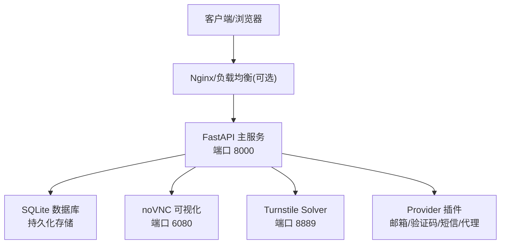
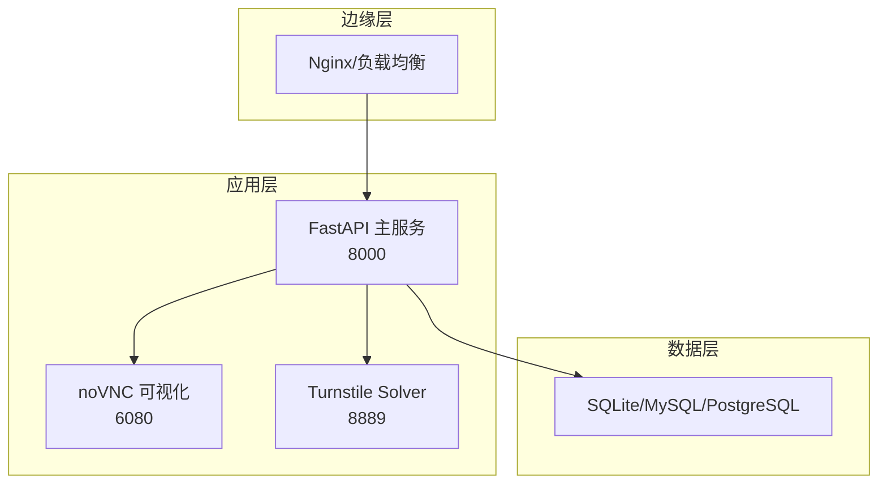
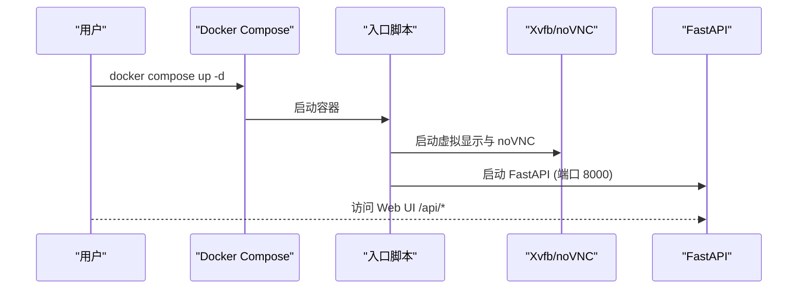
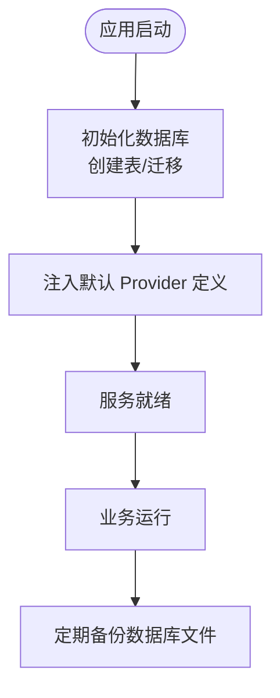
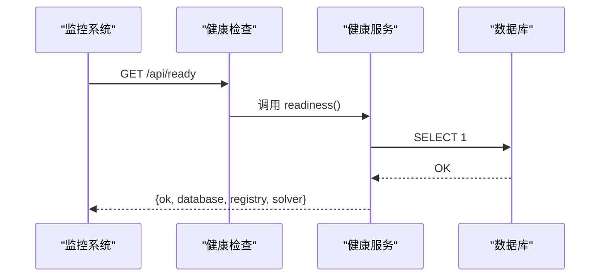
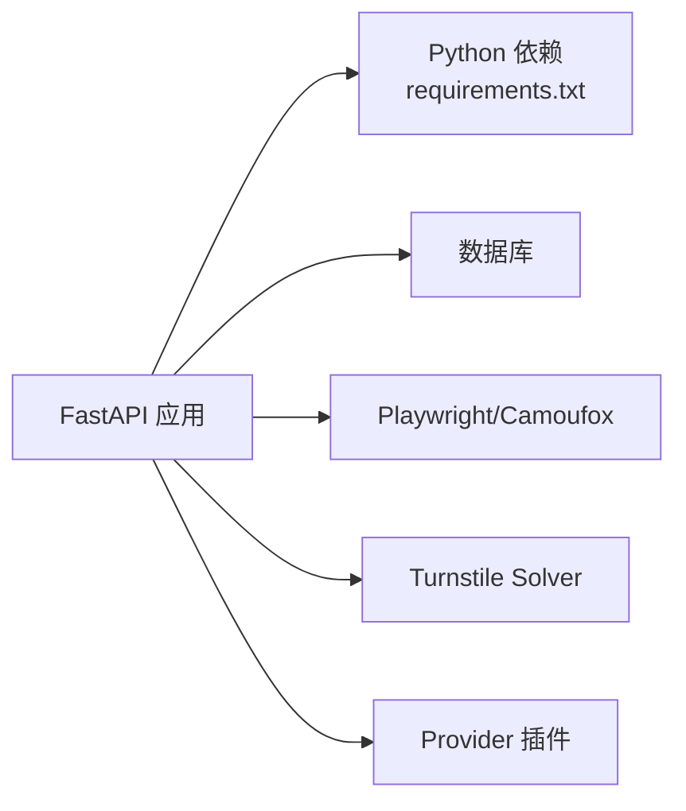

# 部署与运维

<cite>
**本文引用的文件**
- [Dockerfile](file://Dockerfile)
- [docker-compose.yml](file://docker-compose.yml)
- [docker-entrypoint.sh](file://docker-entrypoint.sh)
- [main.py](file://main.py)
- [requirements.txt](file://requirements.txt)
- [README.md](file://README.md)
- [api/health.py](file://api/health.py)
- [application/health.py](file://application/health.py)
- [infrastructure/health_runtime.py](file://infrastructure/health_runtime.py)
- [core/db.py](file://core/db.py)
- [core/config_store.py](file://core/config_store.py)
- [infrastructure/config_repository.py](file://infrastructure/config_repository.py)
- [customer_portal_api/Dockerfile](file://customer_portal_api/Dockerfile)
- [customer_portal_api/docker-compose.yml](file://customer_portal_api/docker-compose.yml)
- [providers/proxy/rotating_gateway.py](file://providers/proxy/rotating_gateway.py)
</cite>

## 目录
1. [简介](#简介)
2. [项目结构](#项目结构)
3. [核心组件](#核心组件)
4. [架构总览](#架构总览)
5. [详细组件分析](#详细组件分析)
6. [依赖关系分析](#依赖关系分析)
7. [性能考量](#性能考量)
8. [故障排查指南](#故障排查指南)
9. [结论](#结论)
10. [附录](#附录)

## 简介
本指南面向生产环境的部署与日常运维，覆盖容器化镜像构建、容器编排、环境变量配置、反向代理与负载均衡接入、数据库与持久化、监控与健康检查、日志收集、备份恢复、扩容缩容以及常见问题的定位与处理。目标是让运维团队能够稳定、安全、可观测地管理 Any Auto Register 的生产环境。

## 项目结构
- 后端服务：FastAPI 应用，提供 Web UI 与 REST API，内置任务调度、生命周期管理、验证码求解器（Solver）子进程等。
- 前端资源：通过多阶段构建将 React 前端产物打包为静态资源，由后端在运行时提供。
- 浏览器能力：基于 Playwright/Camoufox 的无头/有头浏览器执行注册流程；noVNC + Xvfb 提供可视化调试。
- 数据层：默认 SQLite（可通过环境变量切换），用于账号、任务、配置、代理等数据持久化。
- 外部集成：邮箱、验证码、短信、代理等以 Provider 插件方式热插拔；支持旋转代理网关。

图表来源
- [main.py:30-146](file://main.py#L30-L146)
- [docker-entrypoint.sh:4-22](file://docker-entrypoint.sh#L4-L22)
- [Dockerfile:10-58](file://Dockerfile#L10-L58)

章节来源
- [main.py:30-146](file://main.py#L30-L146)
- [Dockerfile:1-61](file://Dockerfile#L1-L61)
- [docker-compose.yml:1-18](file://docker-compose.yml#L1-L18)

## 核心组件
- FastAPI 应用入口与路由挂载：统一暴露 /api/* 接口，并挂载静态资源与 SPA 回退。
- 健康检查：/api/health 与 /api/ready 分别返回存活与就绪状态，包含数据库、平台注册表、Solver 运行状态。
- 配置中心：基于 SQLite 的 key-value 配置存储，配合白名单校验，避免非法键写入。
- 生命周期管理：后台线程定时执行账号有效性检测、Token 续期、Trial 过期预警与 CPA 同步。
- 浏览器与 Solver：Xvfb + noVNC 提供可视化；Solver 作为子进程或独立服务提供 Turnstile 解算。
- 代理能力：支持静态池、API 提取、旋转代理网关（固定入口、动态出口 IP）。

章节来源
- [api/health.py:1-19](file://api/health.py#L1-L19)
- [application/health.py:1-14](file://application/health.py#L1-L14)
- [infrastructure/health_runtime.py:1-42](file://infrastructure/health_runtime.py#L1-L42)
- [core/config_store.py:1-49](file://core/config_store.py#L1-L49)
- [infrastructure/config_repository.py:1-43](file://infrastructure/config_repository.py#L1-L43)
- [core/lifecycle.py:1-528](file://core/lifecycle.py#L1-L528)
- [providers/proxy/rotating_gateway.py:1-30](file://providers/proxy/rotating_gateway.py#L1-L30)

## 架构总览
下图展示生产环境典型拓扑：外部流量经 Nginx/负载均衡进入 FastAPI，数据库使用 SQLite（生产建议迁移至 MySQL/PostgreSQL），noVNC 用于可视化调试，Solver 可作为独立进程或同容器内服务。

图表来源
- [main.py:94-146](file://main.py#L94-L146)
- [docker-entrypoint.sh:4-22](file://docker-entrypoint.sh#L4-L22)
- [Dockerfile:10-58](file://Dockerfile#L10-L58)

## 详细组件分析

### 容器镜像构建与启动
- 多阶段构建：第一阶段构建前端静态资源，第二阶段安装 Python 依赖、Playwright/Camoufox 浏览器、复制代码与入口脚本。
- 系统依赖：Chromium、Xvfb、x11vnc、noVNC、websockify 等，确保浏览器自动化与可视化能力。
- 环境变量：APP_PASSWORD 控制访问鉴权；DISPLAY 设置虚拟显示；VNC_PASSWORD 控制 VNC 密码。
- 启动流程：entrypoint 启动 Xvfb、noVNC，再 exec uvicorn 启动 FastAPI。

图表来源
- [Dockerfile:1-61](file://Dockerfile#L1-L61)
- [docker-entrypoint.sh:1-23](file://docker-entrypoint.sh#L1-L23)
- [main.py:133-146](file://main.py#L133-L146)

章节来源
- [Dockerfile:1-61](file://Dockerfile#L1-L61)
- [docker-entrypoint.sh:1-23](file://docker-entrypoint.sh#L1-L23)
- [main.py:133-146](file://main.py#L133-L146)

### 容器编排与环境变量
- 端口映射：8000（Web UI/API）、6080（noVNC）、8889（Solver）。
- 环境变量：
  - DISPLAY=:99（虚拟显示）
  - ACCOUNT_MANAGER_DATABASE_URL（数据库连接串，默认 SQLite）
  - APP_PASSWORD（可选，启用访问鉴权）
  - VNC_PASSWORD（可选，设置 VNC 密码）
- 数据持久化：将宿主 ./data 目录挂载到容器 /app/data，确保数据库文件持久化。

章节来源
- [docker-compose.yml:1-18](file://docker-compose.yml#L1-L18)
- [core/db.py:16-22](file://core/db.py#L16-L22)

### 反向代理与负载均衡
- 推荐在 FastAPI 前部署 Nginx/云负载均衡，实现：
  - HTTPS 终止与证书管理
  - 请求限流与防刷
  - 多实例水平扩展与轮询
  - 静态资源缓存与压缩
- 关键路径：
  - /api/* 转发至 FastAPI
  - /assets/* 与根路径 SPA 回退由 FastAPI 提供静态资源
  - /vnc.html 转发至 noVNC
  - /solver/* 转发至 Solver（如独立部署）

章节来源
- [main.py:124-131](file://main.py#L124-L131)
- [docker-entrypoint.sh:18-19](file://docker-entrypoint.sh#L18-L19)

### 数据库与持久化策略
- 默认 SQLite：适合小规模与单机部署；生产建议迁移至 MySQL/PostgreSQL 以提升并发与可靠性。
- 数据库 URL：通过 ACCOUNT_MANAGER_DATABASE_URL 指定；容器内默认路径 /app/data/account_manager.db。
- 初始化与迁移：启动时创建表、清理无效 provider、迁移旧版字段与键名。
- 配置存储：configs 表保存 key-value 配置，受白名单保护。

图表来源
- [core/db.py:430-445](file://core/db.py#L430-L445)
- [core/db.py:448-459](file://core/db.py#L448-L459)
- [core/config_store.py:7-49](file://core/config_store.py#L7-L49)

章节来源
- [core/db.py:16-22](file://core/db.py#L16-L22)
- [core/db.py:430-445](file://core/db.py#L430-L445)
- [core/config_store.py:1-49](file://core/config_store.py#L1-L49)

### 监控与健康检查
- 健康检查端点：
  - GET /api/health：返回服务存活信息
  - GET /api/ready：返回就绪状态，包含数据库连通性、平台注册表状态、Solver 运行状态
- 指标采集建议：
  - 结合 Nginx 访问日志与错误日志
  - 使用 Prometheus 抓取应用指标（可扩展）
  - 集中式日志收集（如 ELK/Loki）

图表来源
- [api/health.py:11-18](file://api/health.py#L11-L18)
- [application/health.py:6-14](file://application/health.py#L6-L14)
- [infrastructure/health_runtime.py:15-41](file://infrastructure/health_runtime.py#L15-L41)

章节来源
- [api/health.py:1-19](file://api/health.py#L1-L19)
- [application/health.py:1-14](file://application/health.py#L1-L14)
- [infrastructure/health_runtime.py:1-42](file://infrastructure/health_runtime.py#L1-L42)

### 日志与告警
- 标准输出：FastAPI 与子进程日志输出到 stdout/stderr，便于容器日志收集。
- 任务日志：任务执行过程记录到 task_logs 表，支持按任务查看实时日志。
- 告警建议：
  - 对 /api/ready 失败进行健康探针告警
  - 对任务失败率、代理失败率、Solver 不可用进行阈值告警
  - 对 Trial 即将过期、账号失效进行业务告警

章节来源
- [core/db.py:229-289](file://core/db.py#L229-L289)
- [core/lifecycle.py:458-528](file://core/lifecycle.py#L458-L528)

### 备份与恢复
- 数据备份：
  - 数据库文件：SQLite 文件位于 /app/data/account_manager.db，建议定时拷贝至对象存储或异地磁盘
  - 配置文件：configs 表内容可通过导出工具或 SQL 备份
- 恢复步骤：
  - 停止服务，替换数据库文件，重启服务
  - 若迁移数据库类型，需先导出数据再导入新库，并更新 DATABASE_URL
- 灾难恢复计划：
  - 制定 RPO/RTO 目标
  - 定期演练恢复流程
  - 保留历史备份并验证可用性

章节来源
- [docker-compose.yml:15-16](file://docker-compose.yml#L15-L16)
- [core/db.py:16-22](file://core/db.py#L16-L22)

### 扩容与缩容
- 水平扩展：
  - 多实例部署 FastAPI，共享同一数据库
  - 通过负载均衡分发请求
  - 注意会话与状态：当前设计无状态，适合多实例
- 垂直扩展：
  - 增加 CPU/内存以支撑更高并发与浏览器任务
- 浏览器与 Solver：
  - 浏览器任务较重，可按比例扩缩实例
  - Solver 可独立部署，通过配置接入

章节来源
- [main.py:94-146](file://main.py#L94-L146)
- [Dockerfile:10-58](file://Dockerfile#L10-L58)

### 代理与网络
- 代理模式：
  - 静态池：手动添加代理，按成功率加权轮询
  - API 提取：通过 HTTP API 动态获取代理
  - 旋转代理网关：固定入口地址，每次请求自动分配不同出口 IP
- 生产建议：
  - 使用高质量住宅代理，降低风控概率
  - 按平台划分代理池，避免跨平台干扰
  - 监控代理成功率，自动禁用低质量代理

章节来源
- [providers/proxy/rotating_gateway.py:1-30](file://providers/proxy/rotating_gateway.py#L1-L30)
- [README.md:209-220](file://README.md#L209-L220)

## 依赖关系分析
- 运行时依赖：Python 3.12、Node.js（仅构建前端）、Playwright/Camoufox、系统库（Chromium、Xvfb 等）
- 框架与库：FastAPI、uvicorn、SQLModel、pydantic、requests/curl_cffi、quart（Solver）
- 外部服务：邮箱、验证码、短信、代理、Any2API（可选）

图表来源
- [requirements.txt:1-20](file://requirements.txt#L1-L20)
- [Dockerfile:28-38](file://Dockerfile#L28-L38)

章节来源
- [requirements.txt:1-20](file://requirements.txt#L1-L20)
- [Dockerfile:28-38](file://Dockerfile#L28-L38)

## 性能考量
- 并发与资源：
  - 调整 uvicorn workers 数量匹配 CPU 核数
  - 浏览器任务占用较高，合理限制并发
- 数据库：
  - SQLite 在高并发下存在锁竞争，建议迁移至 MySQL/PostgreSQL
  - 定期优化与索引维护
- 缓存与静态资源：
  - 通过 Nginx 缓存静态资源，减少后端压力
- 代理与网络：
  - 选择低延迟、高可用的代理
  - 合理设置超时与重试策略

[本节为通用指导，不直接分析具体文件]

## 故障排查指南
- 常见问题定位：
  - 验证码失败：检查验证码 Provider 配置与代理质量
  - 代理被封/失败率高：降低并发、更换住宅代理、按平台隔离
  - Solver 启动超时：检查 8889 端口占用、Camoufox 安装、首次下载耗时
  - ARM 镜像构建失败：优先本地构建前端确认无误
- 健康检查：
  - 使用 /api/ready 判断服务就绪状态
  - 关注数据库连通性与平台注册表状态
- 日志分析：
  - 查看任务日志与错误详情
  - 收集标准输出与错误输出进行分析

章节来源
- [README.md:388-436](file://README.md#L388-L436)
- [api/health.py:11-18](file://api/health.py#L11-L18)
- [infrastructure/health_runtime.py:15-41](file://infrastructure/health_runtime.py#L15-L41)

## 结论
通过容器化部署、合理的编排与环境配置、完善的监控与备份策略，Any Auto Register 可在生产环境中稳定运行。建议在生产中引入负载均衡、外部数据库、集中式日志与告警系统，并结合代理池与浏览器资源进行弹性扩缩容，确保高可用与高性能。

[本节为总结，不直接分析具体文件]

## 附录

### 环境变量清单
- DISPLAY=:99（虚拟显示）
- ACCOUNT_MANAGER_DATABASE_URL（数据库连接串）
- APP_PASSWORD（访问鉴权密码）
- VNC_PASSWORD（VNC 密码）
- PORTAL_*（客户门户 API 相关，见下方）

章节来源
- [docker-compose.yml:8-14](file://docker-compose.yml#L8-L14)
- [customer_portal_api/docker-compose.yml:8-17](file://customer_portal_api/docker-compose.yml#L8-L17)

### 客户门户 API（可选）
- 独立服务，端口 8100，提供管理端能力
- 通过 Dockerfile 与 docker-compose 快速部署
- 环境变量包括 JWT 密钥、管理员账户、CORS 等

章节来源
- [customer_portal_api/Dockerfile:1-18](file://customer_portal_api/Dockerfile#L1-L18)
- [customer_portal_api/docker-compose.yml:1-18](file://customer_portal_api/docker-compose.yml#L1-L18)