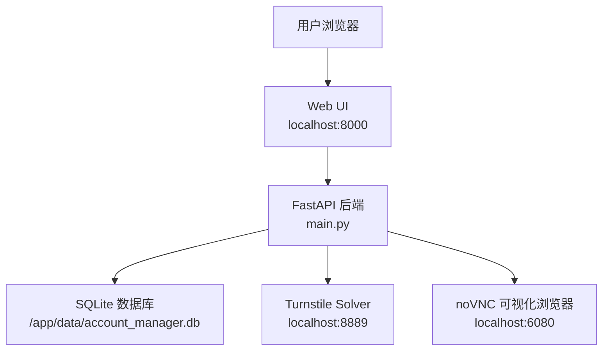
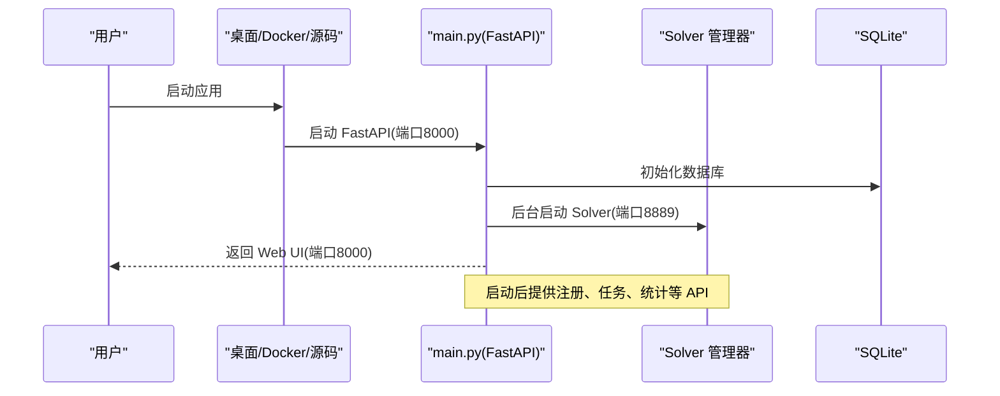
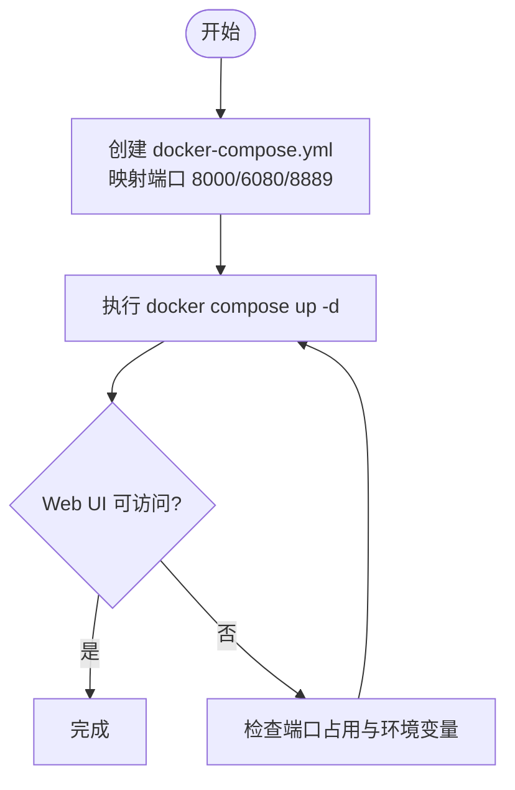
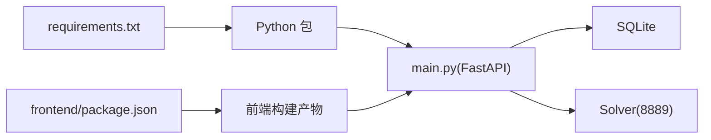

# 快速开始

<cite>
**本文引用的文件**
- [README.md](file://README.md)
- [main.py](file://main.py)
- [Dockerfile](file://Dockerfile)
- [docker-compose.yml](file://docker-compose.yml)
- [docker-entrypoint.sh](file://docker-entrypoint.sh)
- [requirements.txt](file://requirements.txt)
- [services/solver_manager.py](file://services/solver_manager.py)
- [core/base_captcha.py](file://core/base_captcha.py)
- [application/config.py](file://application/config.py)
- [api/config.py](file://api/config.py)
</cite>

## 目录
1. [简介](#简介)
2. [项目结构](#项目结构)
3. [核心组件](#核心组件)
4. [架构总览](#架构总览)
5. [详细组件分析](#详细组件分析)
6. [依赖关系分析](#依赖关系分析)
7. [性能注意事项](#性能注意事项)
8. [故障排查指南](#故障排查指南)
9. [结论](#结论)
10. [附录：初始配置建议与最佳实践](#附录：初始配置建议与最佳实践)

## 简介
Any Auto Register 提供多平台账号自动化注册与管理，支持桌面版（推荐）、Docker 部署和源码运行三种方式。桌面版零配置、一键启动；Docker 提供容器化方案并暴露 Web UI、可视化浏览器与验证码求解器端口；源码运行适合二次开发与自部署。本文聚焦“5 分钟内完成安装并开始使用核心功能”，覆盖环境要求、安装步骤、基本配置与验证方法，并给出常见问题快速解决方案。

## 项目结构
- 后端入口：FastAPI 应用由 main.py 启动，包含路由挂载、中间件、数据库初始化、调度器、任务运行时与 Solver 管理器等。
- 前端构建产物：Dockerfile 会先构建前端静态资源，再打包进镜像，由后端以 SPA 形式提供。
- Docker 编排：docker-compose.yml 定义服务、端口映射、环境变量与数据卷持久化。
- 启动脚本：docker-entrypoint.sh 负责启动虚拟显示、VNC/noVNC 以及后端服务。
- 依赖清单：requirements.txt 列出 Python 运行时依赖。

图表来源
- [main.py:67-91](file://main.py#L67-L91)
- [docker-entrypoint.sh:4-22](file://docker-entrypoint.sh#L4-L22)
- [docker-compose.yml:1-18](file://docker-compose.yml#L1-L18)

章节来源
- [main.py:30-146](file://main.py#L30-L146)
- [Dockerfile:1-61](file://Dockerfile#L1-L61)
- [docker-compose.yml:1-18](file://docker-compose.yml#L1-L18)
- [docker-entrypoint.sh:1-23](file://docker-entrypoint.sh#L1-L23)

## 核心组件
- FastAPI 应用生命周期：在启动时初始化数据库、加载平台与 Provider、启动调度器、任务运行时、Solver 管理器与生命周期管理器；关闭时有序停止各组件。
- 配置系统：通过 API 提供获取与更新全局配置的能力，前端基于选项动态渲染表单。
- Solver 管理器：后台线程启动 Turnstile 本地求解器，具备健康检查、失败计数与自动重试保护。
- 验证码能力：根据 Provider 定义与运行时设置创建具体验证码解决器，支持本地与远程服务。

章节来源
- [main.py:67-91](file://main.py#L67-L91)
- [application/config.py:9-38](file://application/config.py#L9-L38)
- [api/config.py:1-28](file://api/config.py#L1-L28)
- [services/solver_manager.py:1-229](file://services/solver_manager.py#L1-L229)
- [core/base_captcha.py:1-98](file://core/base_captcha.py#L1-L98)

## 架构总览
下图展示了三种部署方式的共同入口与关键端口：
- 桌面版：双击启动 Electron 应用，内置后端与前端，零配置即可用。
- Docker：镜像内包含 Chromium、Xvfb、noVNC、Python 环境与依赖，暴露 8000/6080/8889。
- 源码：本地安装 Python 依赖，构建前端，启动 uvicorn。

图表来源
- [main.py:67-91](file://main.py#L67-L91)
- [services/solver_manager.py:73-155](file://services/solver_manager.py#L73-L155)

## 详细组件分析

### 桌面版（推荐）
- 优势：零配置、Electron 内置完整后端 + 前端、双击即用。
- 下载与安装：从 Releases 页面下载对应平台的安装包（macOS .dmg / Windows .exe）。
- 启动：安装完成后直接启动，输入激活码，选择平台，配置邮箱后即可开始注册。
- 验证：启动后可见仪表盘与任务队列，进行首次注册流程测试。

章节来源
- [README.md:112-124](file://README.md#L112-L124)

### Docker 部署
- 环境要求：已安装 Docker 与 docker compose。
- 安装步骤：
  - 创建工作目录并生成 docker-compose.yml，拉取镜像并映射端口 8000（Web UI）、6080（noVNC）、8889（Solver）。
  - 可选设置 APP_PASSWORD 用于访问保护，VNC_PASSWORD 用于 VNC 密码。
  - 使用 docker compose up -d 启动服务。
- 基本配置：
  - 数据持久化：将宿主 ./data 映射到容器 /app/data，保存 SQLite 数据库。
  - 环境变量 DISPLAY=:99 用于无头模式下的虚拟显示。
- 验证方法：
  - 访问 http://localhost:8000 打开 Web UI。
  - 访问 http://localhost:6080/vnc.html 查看 headed 模式的浏览器画面。
  - 访问 http://localhost:8889 确认 Solver 服务可用。
- 云服务器注意：放行 8000/6080/8889 端口。

图表来源
- [docker-compose.yml:1-18](file://docker-compose.yml#L1-L18)
- [Dockerfile:10-61](file://Dockerfile#L10-L61)
- [docker-entrypoint.sh:4-22](file://docker-entrypoint.sh#L4-L22)

章节来源
- [README.md:125-156](file://README.md#L125-L156)
- [docker-compose.yml:1-18](file://docker-compose.yml#L1-L18)
- [Dockerfile:1-61](file://Dockerfile#L1-L61)
- [docker-entrypoint.sh:1-23](file://docker-entrypoint.sh#L1-L23)

### 源码运行
- 环境要求：Python 3.11+、Node.js 18+。
- 安装步骤：
  - 克隆仓库，进入 account_manager 子目录（如适用），创建并激活虚拟环境，安装 requirements.txt。
  - 进入 frontend 目录执行 npm install 与 npm run build，将前端静态资源输出到 static。
  - 可选：若使用浏览器模式，需安装 Playwright 的 Chromium 与 Camoufox。
  - 使用 uvicorn 启动后端服务，默认监听 8000 端口。
- 验证方法：浏览器访问 http://localhost:8000。

章节来源
- [README.md:157-179](file://README.md#L157-L179)
- [requirements.txt:1-20](file://requirements.txt#L1-L20)
- [main.py:133-146](file://main.py#L133-L146)

## 依赖关系分析
- 后端依赖：FastAPI、uvicorn、SQLModel、curl_cffi、playwright、pydantic、camoufox、patchright、quart、rich、pyinstaller 等。
- 前端依赖：Node 工具链构建 React + TypeScript + Vite 应用，产物被后端以静态资源提供。
- 运行时依赖：Docker 镜像中预装 Chromium、Xvfb、x11vnc、noVNC 及字体与系统库，确保浏览器自动化与可视化。

图表来源
- [requirements.txt:1-20](file://requirements.txt#L1-L20)
- [Dockerfile:1-61](file://Dockerfile#L1-L61)
- [main.py:30-146](file://main.py#L30-L146)

章节来源
- [requirements.txt:1-20](file://requirements.txt#L1-L20)
- [Dockerfile:1-61](file://Dockerfile#L1-L61)
- [main.py:30-146](file://main.py#L30-L146)

## 性能注意事项
- 并发与代理：合理设置并发数，避免同一 IP 短时间大量请求导致风控；优先使用住宅代理提升通过率。
- 浏览器模式：headed/headless 模式对资源消耗更高，建议在需要可视化或调试时使用。
- Solver 健康：本地 Solver 首次启动可能耗时较长（下载 Camoufox），后续启动更快；连续失败过多会停止自动重试，需手动干预。

[本节为通用指导，不直接分析具体文件]

## 故障排查指南
- 验证码失败
  - 确认验证码 Provider 已正确配置（YesCaptcha Client Key 或本地 Solver）。
  - 协议模式下优先使用远程验证码服务（YesCaptcha / 2Captcha）。
  - 浏览器模式下 Camoufox 会尝试点击 Turnstile checkbox，失败时回退到远程 Solver。
  - 持续失败请检查代理 IP 质量，高风险 IP 会触发更严格的验证。
- 代理被封/成功率低
  - 在代理管理页查看各代理成功率，禁用低成功率代理。
  - 使用住宅代理而非数据中心 IP。
  - 降低并发数，不同平台可按代理池分配。
- Solver 启动超时
  - 本地执行 camoufox fetch，然后在设置页重启 Solver。
  - 如不依赖本地 Solver，配置 YesCaptcha 或 2Captcha，并在任务中选择远程验证码。
  - Docker 环境建议使用预构建镜像；本地裸跑持续超时优先检查 8889 端口与 Camoufox 安装。
- ARM 镜像构建失败
  - 实际失败点常为前端 TypeScript 构建问题，先在本地执行前端构建，确认通过后再生成镜像。

章节来源
- [README.md:388-436](file://README.md#L388-L436)
- [services/solver_manager.py:15-155](file://services/solver_manager.py#L15-L155)
- [core/base_captcha.py:48-98](file://core/base_captcha.py#L48-L98)

## 结论
- 桌面版最适合新手与日常使用，零配置、一键启动。
- Docker 适合服务器部署与团队协作，提供完整的容器化方案与可视化能力。
- 源码运行适合二次开发与深度定制，需自行搭建前后端环境。
- 通过合理的代理与验证码配置，结合成功率统计与错误归因，可显著提升注册效率与稳定性。

[本节为总结性内容，不直接分析具体文件]

## 附录：初始配置建议与最佳实践
- 邮箱服务
  - 推荐使用 MoeMail（无需额外配置，自动注册临时邮箱）或 Laoudo（稳定域名邮箱）。
  - 其他可选：Cloudflare Worker 自建、Testmail、DuckDuckGo Email、Freemail、DuckMail、TempMail.lol、Temp-Mail Web。
- 验证码服务
  - 本地 Solver：需先执行 camoufox fetch，适用于离线或私有环境。
  - 远程服务：YesCaptcha / 2Captcha，适合协议模式与高并发场景。
- 代理池
  - 静态代理：按成功率加权轮询，连续失败自动禁用。
  - API 提取/旋转网关：固定入口地址，每次请求自动分配出口 IP。
- 接码服务
  - 部分平台需要手机号验证，可配置 SMS-Activate 或 HeroSMS。
- Any2API 联动
  - 配置 any2api_url 与 any2api_password，注册成功后自动推送至网关，实现即注册即用。
- 访问安全
  - Docker 可通过 APP_PASSWORD 启用访问保护；VNC 可通过 VNC_PASSWORD 设置密码。
- 配置接口
  - 通过 /api/config 获取与更新全局配置；/api/config/options 返回动态选项，前端据此渲染表单。

章节来源
- [README.md:181-274](file://README.md#L181-L274)
- [application/config.py:9-38](file://application/config.py#L9-L38)
- [api/config.py:1-28](file://api/config.py#L1-L28)
- [docker-compose.yml:8-17](file://docker-compose.yml#L8-L17)