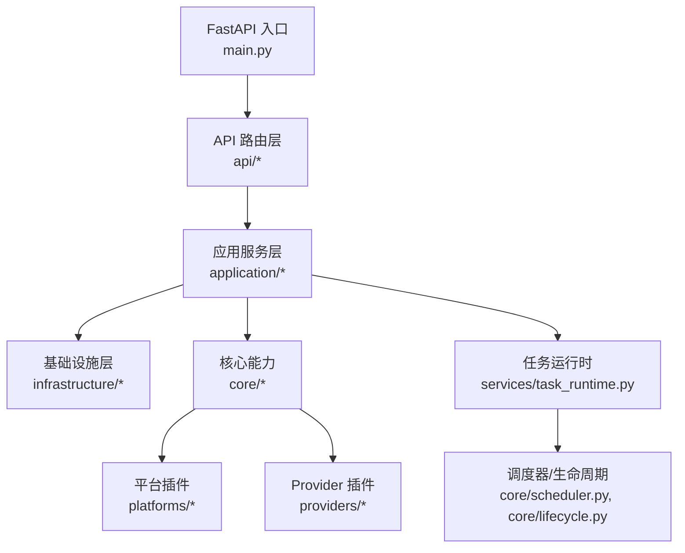
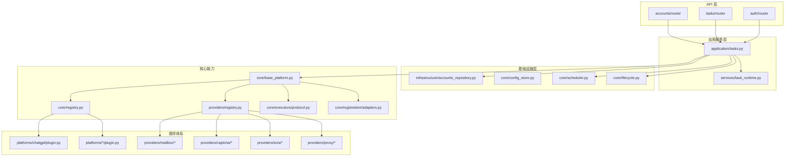
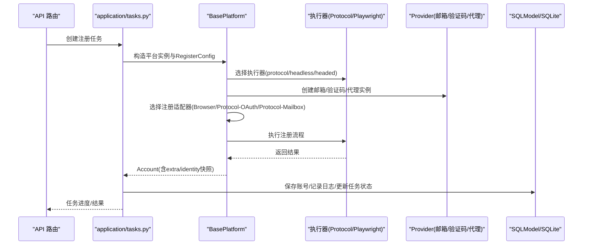
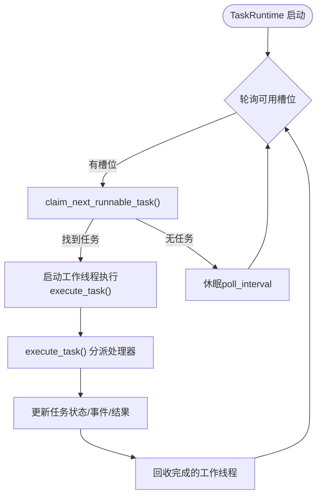
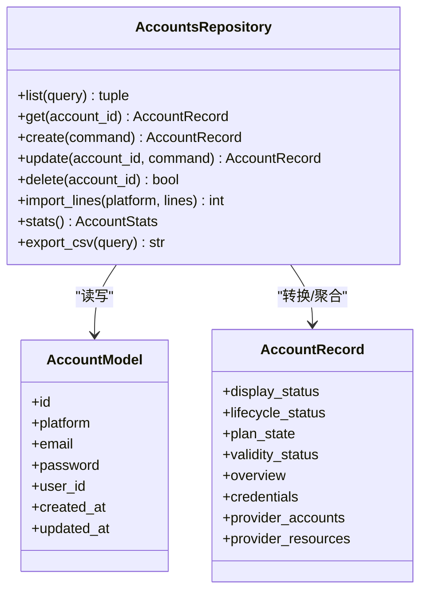
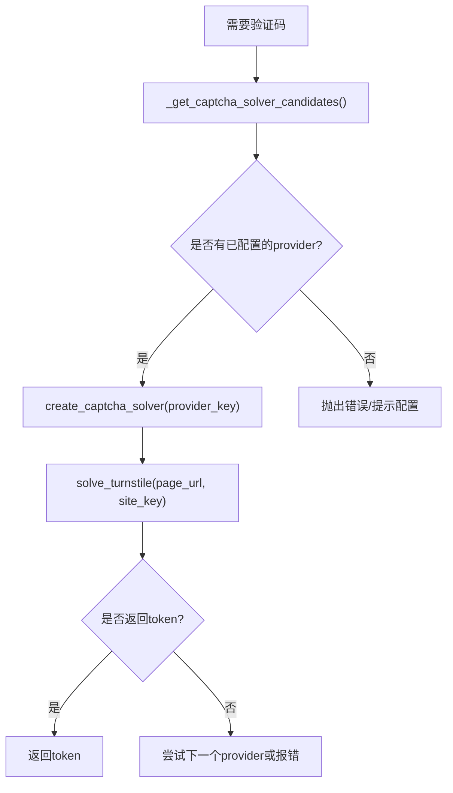
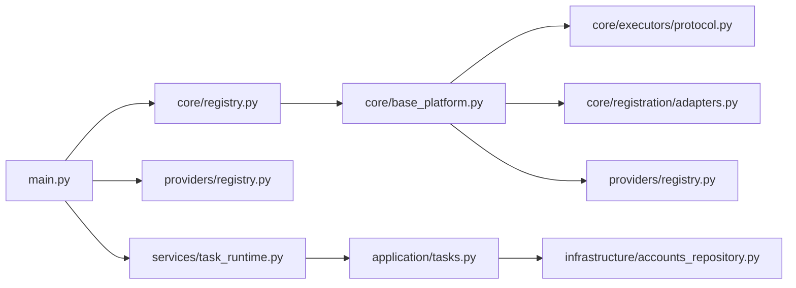

# 架构概览

<cite>
**本文引用的文件**
- [main.py](file://main.py)
- [README.md](file://README.md)
- [core/registry.py](file://core/registry.py)
- [core/base_platform.py](file://core/base_platform.py)
- [providers/registry.py](file://providers/registry.py)
- [application/tasks.py](file://application/tasks.py)
- [infrastructure/accounts_repository.py](file://infrastructure/accounts_repository.py)
- [core/executors/protocol.py](file://core/executors/protocol.py)
- [core/registration/adapters.py](file://core/registration/adapters.py)
- [platforms/chatgpt/plugin.py](file://platforms/chatgpt/plugin.py)
- [services/task_runtime.py](file://services/task_runtime.py)
</cite>

## 目录
1. [简介](#简介)
2. [项目结构](#项目结构)
3. [核心组件](#核心组件)
4. [架构总览](#架构总览)
5. [详细组件分析](#详细组件分析)
6. [依赖关系分析](#依赖关系分析)
7. [性能考量](#性能考量)
8. [故障排查指南](#故障排查指南)
9. [结论](#结论)
10. [附录](#附录)

## 简介
Any Auto Register 是一个面向多 AI 平台的账号自动化注册与生命周期管理系统。系统采用分层架构（API 层、应用服务层、基础设施层）与插件化架构（平台、邮箱、验证码、接码、代理等均可热插拔），并提供微服务特征：任务执行器、调度器、Turnstile Solver 子进程相互独立，通过进程内线程与消息协作。技术栈以 FastAPI 提供高性能 HTTP API，Playwright/Camoufox 实现浏览器自动化，SQLModel 作为 ORM 抽象 SQLite 数据持久化，curl_cffi 用于协议模式的高性能请求模拟。

## 项目结构
- 入口与路由：FastAPI 应用启动、中间件、路由挂载、静态资源与 SPA 回退
- 应用服务层：任务编排、状态机、并发控制、结果聚合与推送
- 基础设施层：仓储、运行时适配、配置与能力管理
- 核心能力：平台基类、执行器、注册流程适配器、身份与邮箱抽象
- 插件体系：平台插件（platforms/*）、Provider 插件（providers/*）
- 前端与桌面端：React + Vite 前端；Electron 打包桌面版

图表来源
- [main.py:67-121](file://main.py#L67-L121)
- [application/tasks.py:570-595](file://application/tasks.py#L570-L595)
- [services/task_runtime.py:18-102](file://services/task_runtime.py#L18-L102)

章节来源
- [main.py:30-121](file://main.py#L30-L121)
- [README.md:276-323](file://README.md#L276-L323)

## 核心组件
- 平台插件注册表：自动扫描 platforms/* 并加载每个平台的 plugin.py，维护 BasePlatform 子类映射，支持能力声明与数据库覆盖
- 平台基类：统一注册流程入口，选择执行器（协议/Headless/Headed）、身份提供者（邮箱/OAuth 浏览器）、验证码解决器与注册适配器
- Provider 注册表：统一管理邮箱、验证码、短信、代理等驱动，按类型+键名工厂创建实例
- 任务运行时：单进程多线程任务调度，按平台并行度限制与账户键冲突避免，持久化任务状态与事件
- 仓储层：账号 CRUD、导入导出、统计、图式扩展字段同步
- 执行器：ProtocolExecutor（curl_cffi）与 PlaywrightExecutor（浏览器）

章节来源
- [core/registry.py:1-124](file://core/registry.py#L1-L124)
- [core/base_platform.py:44-160](file://core/base_platform.py#L44-L160)
- [providers/registry.py:1-91](file://providers/registry.py#L1-L91)
- [services/task_runtime.py:18-102](file://services/task_runtime.py#L18-L102)
- [infrastructure/accounts_repository.py:98-162](file://infrastructure/accounts_repository.py#L98-L162)
- [core/executors/protocol.py:1-45](file://core/executors/protocol.py#L1-L45)

## 架构总览
系统采用“分层 + 插件化”的混合架构：
- API 层：FastAPI 路由负责鉴权、CORS、请求校验与响应序列化
- 应用服务层：任务编排、状态机、并发控制、结果聚合、外部集成（Any2API、CPA、支付链接）
- 基础设施层：仓储、运行时适配、配置与能力管理、调度器与生命周期管理
- 核心能力：平台基类、执行器、注册流程适配器、身份与邮箱抽象
- 插件体系：平台插件与 Provider 插件通过装饰器与包扫描自动发现与注册

图表来源
- [main.py:94-121](file://main.py#L94-L121)
- [application/tasks.py:570-595](file://application/tasks.py#L570-L595)
- [services/task_runtime.py:18-102](file://services/task_runtime.py#L18-L102)
- [core/registry.py:25-38](file://core/registry.py#L25-L38)
- [providers/registry.py:70-91](file://providers/registry.py#L70-L91)
- [core/base_platform.py:316-328](file://core/base_platform.py#L316-L328)
- [core/registration/adapters.py:28-59](file://core/registration/adapters.py#L28-L59)
- [platforms/chatgpt/plugin.py:48-66](file://platforms/chatgpt/plugin.py#L48-L66)

## 详细组件分析

### 平台插件与注册流程
- 平台插件通过 @register 装饰器在启动时被自动发现并注册到全局映射
- BasePlatform.register 根据 executor_type 选择执行器与注册适配器：
  - 浏览器模式：BrowserRegistrationFlow
  - OAuth 浏览器模式：ProtocolOAuthFlow
  - 协议邮箱模式：ProtocolMailboxFlow
- 适配器定义结果映射、worker 构建器、注册运行器与能力描述

图表来源
- [core/base_platform.py:124-160](file://core/base_platform.py#L124-L160)
- [core/registration/adapters.py:28-59](file://core/registration/adapters.py#L28-L59)
- [application/tasks.py:692-790](file://application/tasks.py#L692-L790)
- [core/executors/protocol.py:6-45](file://core/executors/protocol.py#L6-L45)
- [providers/registry.py:51-62](file://providers/registry.py#L51-L62)

章节来源
- [core/registry.py:19-38](file://core/registry.py#L19-L38)
- [core/base_platform.py:44-160](file://core/base_platform.py#L44-L160)
- [core/registration/adapters.py:28-59](file://core/registration/adapters.py#L28-L59)
- [platforms/chatgpt/plugin.py:48-225](file://platforms/chatgpt/plugin.py#L48-L225)

### 任务运行时与调度
- TaskRuntime 维护最大并行任务数与每平台并行度限制，轮询可执行任务
- claim_next_runnable_task 从数据库挑选 pending 任务，考虑平台计数与账户键冲突
- execute_task 分发到具体处理器（注册、账号检查、平台动作）
- 任务状态机：pending -> claimed -> running -> succeeded/failed/interrupted/cancelled

图表来源
- [services/task_runtime.py:18-102](file://services/task_runtime.py#L18-L102)
- [application/tasks.py:340-368](file://application/tasks.py#L340-L368)
- [application/tasks.py:570-595](file://application/tasks.py#L570-L595)

章节来源
- [services/task_runtime.py:18-102](file://services/task_runtime.py#L18-L102)
- [application/tasks.py:340-368](file://application/tasks.py#L340-L368)
- [application/tasks.py:570-595](file://application/tasks.py#L570-L595)

### 仓储与账号模型
- AccountsRepository 提供账号列表、查询、导入导出、统计与图式扩展字段同步
- 使用 SQLModel 操作 AccountModel，结合 account_graph 计算显示状态、生命周期状态、计划状态等
- 支持批量导入时兼容旧 extra 字段迁移至新的 credentials/provider_accounts/provider_resources

图表来源
- [infrastructure/accounts_repository.py:98-162](file://infrastructure/accounts_repository.py#L98-L162)
- [infrastructure/accounts_repository.py:164-232](file://infrastructure/accounts_repository.py#L164-L232)
- [infrastructure/accounts_repository.py:244-332](file://infrastructure/accounts_repository.py#L244-L332)
- [infrastructure/accounts_repository.py:334-392](file://infrastructure/accounts_repository.py#L334-L392)

章节来源
- [infrastructure/accounts_repository.py:98-392](file://infrastructure/accounts_repository.py#L98-L392)

### 执行器与验证码
- ProtocolExecutor 基于 curl_cffi 模拟浏览器指纹与请求，支持代理与 Cookie 管理
- BasePlatform 根据配置选择验证码 provider，支持本地 Solver 与远程服务（YesCaptcha/2Captcha）
- solve_turnstile_with_fallback 尝试多个 provider 并返回 token

图表来源
- [core/base_platform.py:330-430](file://core/base_platform.py#L330-L430)
- [core/executors/protocol.py:6-45](file://core/executors/protocol.py#L6-L45)

章节来源
- [core/base_platform.py:330-430](file://core/base_platform.py#L330-L430)
- [core/executors/protocol.py:6-45](file://core/executors/protocol.py#L6-L45)

### 平台插件示例：ChatGPT
- 声明 capabilities（query_state、refresh_token、generate_link、switch_desktop、upload_cpa、upload_tm）
- 实现 check_valid、build_*_adapter、execute_action 等
- 支持协议、headless、headed 三种执行器与多种 identity_provider

章节来源
- [platforms/chatgpt/plugin.py:48-225](file://platforms/chatgpt/plugin.py#L48-L225)
- [platforms/chatgpt/plugin.py:227-423](file://platforms/chatgpt/plugin.py#L227-L423)

## 依赖关系分析
- 启动阶段：
  - main.py 初始化数据库、加载平台插件与 Provider、启动调度器、任务运行时、Solver 与生命周期管理器
- 运行时：
  - API 路由调用 application 层，后者通过 core.registry 获取平台实例，再借助 providers.registry 创建所需 Provider
  - 任务运行时持续轮询数据库中的任务，分配线程执行，更新状态与事件
- 插件解耦：
  - 平台插件仅依赖 core 抽象，不感知 API 与存储细节
  - Provider 插件通过统一接口 from_config 创建实例，便于热插拔

图表来源
- [main.py:67-91](file://main.py#L67-L91)
- [core/registry.py:25-38](file://core/registry.py#L25-L38)
- [providers/registry.py:70-91](file://providers/registry.py#L70-L91)
- [services/task_runtime.py:18-102](file://services/task_runtime.py#L18-L102)
- [application/tasks.py:570-595](file://application/tasks.py#L570-L595)
- [infrastructure/accounts_repository.py:98-162](file://infrastructure/accounts_repository.py#L98-L162)

章节来源
- [main.py:67-91](file://main.py#L67-L91)
- [core/registry.py:25-38](file://core/registry.py#L25-L38)
- [providers/registry.py:70-91](file://providers/registry.py#L70-L91)
- [services/task_runtime.py:18-102](file://services/task_runtime.py#L18-L102)
- [application/tasks.py:570-595](file://application/tasks.py#L570-L595)
- [infrastructure/accounts_repository.py:98-162](file://infrastructure/accounts_repository.py#L98-L162)

## 性能考量
- FastAPI 异步路由与中间件减少阻塞，适合高并发 API
- ProtocolExecutor 使用 curl_cffi 模拟浏览器指纹，避免浏览器开销，提升协议模式性能
- 任务运行时通过线程池与平台并行度限制平衡吞吐与资源占用
- 代理池动态评估成功率，失败自动降级与禁用，提高注册成功率
- 验证码 provider 多候选回退机制降低单次失败影响

[本节为通用指导，不直接分析具体文件]

## 故障排查指南
- 验证码失败：
  - 确认验证码 provider 已正确配置（YesCaptcha Client Key 或本地 Solver）
  - 协议模式优先使用远程验证码服务；浏览器模式下 Camoufox 会先尝试点击 Turnstile checkbox，失败回退到远程 Solver
- 代理被封/注册失败率高：
  - 查看各代理成功率，禁用低成功率代理
  - 使用住宅代理而非数据中心代理，降低并发避免同一 IP 短时间大量请求
- Solver 启动超时：
  - 首次启动需下载或初始化 Camoufox；检查 8889 端口占用与环境依赖
  - 如不依赖本地 Solver，配置 YesCaptcha 或 2Captcha，并在注册任务中选择远程验证码

章节来源
- [README.md:388-419](file://README.md#L388-L419)

## 结论
Any Auto Register 通过分层与插件化架构实现了高扩展性与高可用性：平台与 Provider 的热插拔使新增平台与服务变得简单；任务运行时与调度器确保稳定执行；FastAPI、Playwright、SQLModel 等技术栈兼顾性能与开发效率。系统同时具备微服务特征：任务执行器、调度器、Solver 子进程相互独立，便于横向扩展与运维治理。

[本节为总结性内容，不直接分析具体文件]

## 附录
- 技术栈优势
  - FastAPI：高性能异步 Web 框架，天然支持 OpenAPI 文档与中间件
  - Playwright/Camoufox：强大的浏览器自动化与指纹伪装能力
  - SQLModel：基于 Pydantic 的 ORM，简化数据模型与验证
  - curl_cffi：协议模式高性能请求模拟，支持代理与 Cookie 管理

章节来源
- [README.md:276-284](file://README.md#L276-L284)