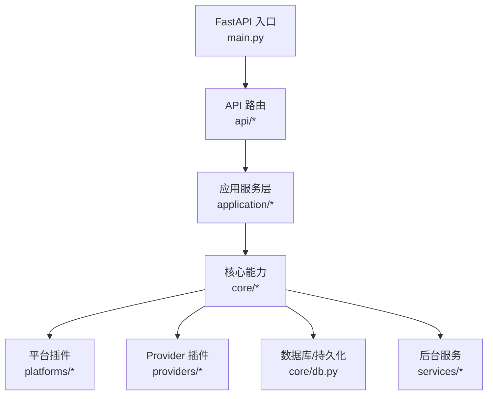
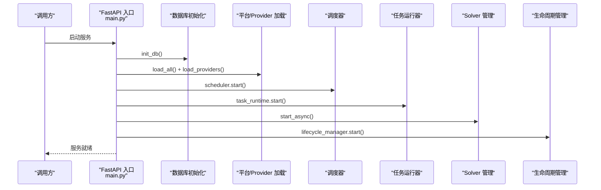
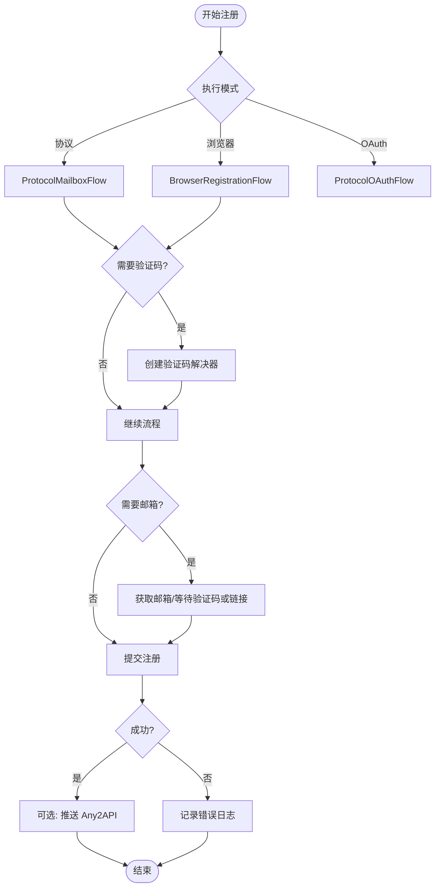
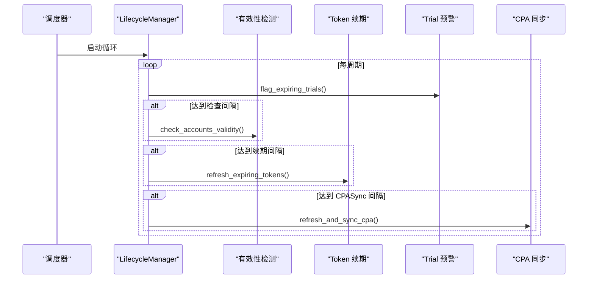
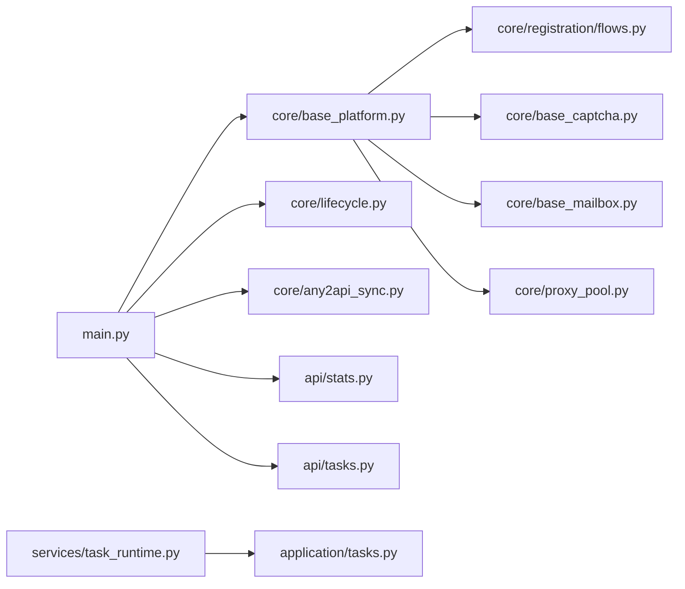

# 核心功能特性

<cite>
**本文引用的文件**
- [main.py](file://main.py)
- [README.md](file://README.md)
- [core/base_platform.py](file://core/base_platform.py)
- [core/registration/flows.py](file://core/registration/flows.py)
- [core/base_captcha.py](file://core/base_captcha.py)
- [core/base_mailbox.py](file://core/base_mailbox.py)
- [core/proxy_pool.py](file://core/proxy_pool.py)
- [core/lifecycle.py](file://core/lifecycle.py)
- [core/any2api_sync.py](file://core/any2api_sync.py)
- [application/account_exports.py](file://application/account_exports.py)
- [api/stats.py](file://api/stats.py)
- [api/tasks.py](file://api/tasks.py)
- [services/task_runtime.py](file://services/task_runtime.py)
- [application/tasks.py](file://application/tasks.py)
</cite>

## 目录
1. [简介](#简介)
2. [项目结构](#项目结构)
3. [核心组件](#核心组件)
4. [架构总览](#架构总览)
5. [详细组件分析](#详细组件分析)
6. [依赖关系分析](#依赖关系分析)
7. [性能考量](#性能考量)
8. [故障排查指南](#故障排查指南)
9. [结论](#结论)
10. [附录](#附录)

## 简介
Any Auto Register 提供“注册流程能力、运营管理功能、系统能力”三大能力组，覆盖多平台账号自动化注册与全生命周期管理。其特点包括：
- 注册流程能力：支持多种平台、邮箱服务、验证码处理、接码服务、执行模式（协议/Headless/Headed）与本地 2FA。
- 运营管理功能：生命周期管理（有效性检测、Token 续期、Trial 预警）、风险中心告警、成功率统计与任务队列。
- 系统能力：代理池管理、Any2API 联动、多格式导出、并发控制与插件化架构。

本文件面向初学者与高级用户，既给出工作原理与配置方式，也提供使用场景与最佳实践建议。

## 项目结构
后端以 FastAPI 为入口，按职责分层组织：
- API 路由层：统一暴露 /api/* 接口，涵盖账号、任务、统计、代理、生命周期等。
- 应用服务层：编排业务逻辑（如任务执行、导出、查询）。
- 领域模型与基础设施：数据持久化、仓储与运行时适配。
- 核心能力：平台基类、注册流程、邮箱、验证码、代理、生命周期、Any2API 同步等。
- 平台与 Provider 插件：平台实现与第三方服务驱动（邮箱、验证码、短信、代理）。



图表来源
- [main.py:30-121](file://main.py#L30-L121)

章节来源
- [main.py:30-121](file://main.py#L30-L121)
- [README.md:286-323](file://README.md#L286-L323)

## 核心组件
- 平台基类与注册流程：统一抽象平台能力，封装浏览器/协议/OAuth 三种注册路径，自动装配邮箱、验证码、接码回调与执行器。
- 邮箱服务：多 Provider 工厂与回退机制，支持临时邮箱、自建服务、IMAP 转发等。
- 验证码解决器：支持 YesCaptcha、2Captcha、本地 Solver，具备配置校验与自动选择策略。
- 代理池：动态代理优先，静态池加权轮询，失败自动禁用与健康检查。
- 生命周期管理：定时有效性检测、Token 自动续期、Trial 过期预警与 CPA 同步。
- Any2API 联动：注册成功后自动推送至网关，即注册即用。
- 导出能力：JSON/CSV/CPA/Sub2API/Kiro-Go/Any2API admin.json 等多格式导出。
- 任务队列与并发：持久化任务执行器，支持全局与平台级并发限制。

章节来源
- [core/base_platform.py:44-160](file://core/base_platform.py#L44-L160)
- [core/registration/flows.py:18-142](file://core/registration/flows.py#L18-L142)
- [core/base_mailbox.py:27-348](file://core/base_mailbox.py#L27-L348)
- [core/base_captcha.py:5-98](file://core/base_captcha.py#L5-L98)
- [core/proxy_pool.py:9-91](file://core/proxy_pool.py#L9-L91)
- [core/lifecycle.py:37-528](file://core/lifecycle.py#L37-L528)
- [core/any2api_sync.py:18-294](file://core/any2api_sync.py#L18-L294)
- [application/account_exports.py:21-507](file://application/account_exports.py#L21-L507)
- [services/task_runtime.py:18-101](file://services/task_runtime.py#L18-L101)

## 架构总览
系统启动时初始化数据库、加载平台与 Provider、启动调度器、任务运行器、Solver 管理与生命周期管理器；随后挂载所有 /api/* 路由并对外提供服务。



图表来源
- [main.py:67-91](file://main.py#L67-L91)
- [main.py:94-121](file://main.py#L94-L121)

章节来源
- [main.py:67-121](file://main.py#L67-L121)

## 详细组件分析

### 注册流程能力
- 支持的执行模式：协议（最快）、Headless、Headed；平台通过 BasePlatform 声明支持的能力与执行器类型。
- 身份来源：邮箱（mailbox）、OAuth Browser；流程根据能力自动装配邮箱、验证码、接码回调。
- 验证码：自动选择已配置的远程或本地 Solver，未配置则报错提示。
- 接码：手机号验证场景可接入 SMS-Activate/HeroSMS。
- 本地 2FA：内置 TOTP 计算，无需第三方应用。



图表来源
- [core/base_platform.py:124-160](file://core/base_platform.py#L124-L160)
- [core/registration/flows.py:18-142](file://core/registration/flows.py#L18-L142)
- [core/base_captcha.py:67-98](file://core/base_captcha.py#L67-L98)
- [core/base_mailbox.py:289-348](file://core/base_mailbox.py#L289-L348)

章节来源
- [core/base_platform.py:44-160](file://core/base_platform.py#L44-L160)
- [core/registration/flows.py:18-142](file://core/registration/flows.py#L18-L142)
- [core/base_captcha.py:48-98](file://core/base_captcha.py#L48-L98)
- [core/base_mailbox.py:27-348](file://core/base_mailbox.py#L27-L348)

#### 工作原理
- BasePlatform.register 根据 executor_type 选择对应 Flow，并装配 identity、captcha、mailbox、phone callback。
- ProtocolMailboxFlow/BrowserRegistrationFlow/ProtocolOAuthFlow 分别负责协议邮箱注册、浏览器注册与 OAuth 流程。
- 验证码通过 create_captcha_solver 依据 provider_key 与配置创建具体实现。
- 邮箱通过 create_mailbox 工厂方法创建实例，支持多 Provider 回退。

#### 配置方式
- 执行器类型：在注册任务配置中设置 executor_type（protocol/headless/headed）。
- 验证码：在设置页启用并配置至少一个验证码 Provider（YesCaptcha/2Captcha/本地 Solver），浏览器模式需设置默认。
- 邮箱：在设置页添加并启用邮箱 Provider，支持 fallbacks。
- 接码：在任务参数指定 sms_provider，或使用默认接码 Provider。

#### 使用场景
- 高并发注册：优先协议模式 + 远程验证码 + 动态代理。
- 复杂人机交互：浏览器模式 + 本地 Solver + 可视化 noVNC。
- 手机号验证：启用接码服务并在任务中指定。

#### 最佳实践
- 协议模式优先以获得更高吞吐；必要时切换浏览器模式。
- 为不同平台配置合适的验证码 Provider，避免单一依赖。
- 使用邮箱 Provider 的 fallbacks 提升稳定性。
- 合理设置并发数，避免同一 IP 短时间大量请求导致风控。

### 运营管理功能
- 生命周期管理：定时有效性检测、Token 自动续期、Trial 过期预警、CPA 同步。
- 风险中心：集中告警 Token 过期、Trial 即将耗尽、代理连通异常。
- 成功率统计：全局概览、按平台/按天/按代理细分、错误聚合。
- 任务队列：批量注册任务历史、实时进度、单任务日志。



图表来源
- [core/lifecycle.py:458-528](file://core/lifecycle.py#L458-L528)
- [core/lifecycle.py:37-193](file://core/lifecycle.py#L37-L193)
- [core/lifecycle.py:200-260](file://core/lifecycle.py#L200-L260)
- [core/lifecycle.py:267-451](file://core/lifecycle.py#L267-L451)

章节来源
- [core/lifecycle.py:37-528](file://core/lifecycle.py#L37-L528)

#### 工作原理
- LifecycleManager 在后台线程周期性执行 Trial 预警、有效性检测、Token 续期与 CPA 同步。
- 有效性检测调用平台 check_valid，更新账户状态与摘要信息。
- Token 续期针对特定平台（当前 ChatGPT）刷新凭证并持久化。
- Trial 预警扫描 trial 账户，标记即将过期或已过期。
- CPA 同步刷新 token、检查存活并上传到 CPA 服务。

#### 配置方式
- 调整检查/续期/同步间隔与预警小时数（LifecycleManager 构造参数）。
- 配置 CPA 地址与密钥用于自动上传。
- 通过 API 手动触发生命周期操作（check/refresh/warn）。

#### 使用场景
- 长期维护账号池：定期检测失效、续期即将过期的 Token。
- 合规与审计：Trial 预警确保试用资源及时续费或替换。
- 集成外部网关：CPA 同步保持外部资源一致。

#### 最佳实践
- 合理设置预警阈值，提前发现风险。
- 对关键平台开启自动续期，降低人工干预。
- 结合代理健康检查与成功率统计优化网络环境。

### 系统能力
- 代理池管理：动态代理优先，静态池按成功率加权轮询，失败自动禁用与健康检查。
- Any2API 联动：注册成功后自动推送账号到网关，支持多平台映射。
- 导出格式：JSON/CSV/CPA/Sub2API/Kiro-Go/Any2API admin.json。
- 并发控制：全局与平台级并发限制，持久化任务执行器。
- 插件化架构：平台/邮箱/验证码/接码/代理驱动均可热插拔扩展。

```mermaid
classDiagram
class ProxyPool {
+get_next(region) str
+report_success(url) void
+report_fail(url) void
+check_all() dict
}
class TaskRuntime {
+start() void
+stop() void
-_loop() void
-_run_task(task_id) void
}
class AccountExportsService {
+export_chatgpt_json(selection) ExportArtifact
+export_chatgpt_csv(selection) ExportArtifact
+export_chatgpt_sub2api(selection) ExportArtifact
+export_chatgpt_cpa(selection) ExportArtifact
+export_kiro_go(selection) ExportArtifact
+export_any2api(selection) ExportArtifact
}
class Any2ApiClient {
+push_kiro(access_token, name, machine_id) bool
+push_grok(cookie_token, name) bool
+push_cursor(session_token) bool
+push_chatgpt(access_token) bool
+push_blink(refresh_token, id_token, session_token, workspace_slug) bool
+push_windsurf(api_key, name, proxy_url) bool
}
TaskRuntime --> AccountExportsService : "导出时使用"
Any2ApiClient --> ProxyPool : "可选 : 网络请求代理"
```

图表来源
- [core/proxy_pool.py:9-91](file://core/proxy_pool.py#L9-L91)
- [services/task_runtime.py:18-101](file://services/task_runtime.py#L18-L101)
- [application/account_exports.py:330-507](file://application/account_exports.py#L330-L507)
- [core/any2api_sync.py:18-167](file://core/any2api_sync.py#L18-L167)

章节来源
- [core/proxy_pool.py:9-91](file://core/proxy_pool.py#L9-L91)
- [services/task_runtime.py:18-101](file://services/task_runtime.py#L18-L101)
- [application/account_exports.py:21-507](file://application/account_exports.py#L21-L507)
- [core/any2api_sync.py:18-294](file://core/any2api_sync.py#L18-L294)

#### 工作原理
- 代理池优先尝试动态代理，失败或未配置时回退到静态池，按成功率排序轮询，连续失败自动禁用。
- 任务运行器维护全局与平台级并发限制，持久化任务状态，支持中断恢复。
- 导出服务将账户数据转换为多种目标格式，支持单文件或压缩包。
- Any2API 客户端登录管理端后推送各平台资源，支持会话续期与重试。

#### 配置方式
- 代理：在设置页添加静态代理或配置动态代理 Provider；启用旋转网关时固定入口地址。
- 任务并发：通过 TaskRuntime 构造参数调整 max_parallel_tasks 与 max_parallel_per_platform。
- 导出：选择目标格式并指定筛选条件（平台、状态等）。
- Any2API：在全局配置中设置 any2api_url 与 any2api_password。

#### 使用场景
- 大规模注册：提高并发与代理质量，降低风控概率。
- 多平台集成：导出为 Sub2API/Kiro-Go/Any2API 等格式供其他工具消费。
- 自动化流水线：注册完成后自动推送至网关，减少人工导入。

#### 最佳实践
- 使用住宅代理并监控成功率，及时禁用低质代理。
- 合理设置并发，避免对目标平台造成过大压力。
- 定期导出备份，便于迁移与审计。
- 为 Any2API 配置超时与重试，保证推送可靠性。

## 依赖关系分析
- main.py 作为入口，初始化数据库、加载平台与 Provider、启动调度器与任务运行器、生命周期管理，并挂载所有 API 路由。
- core/base_platform.py 定义平台抽象与注册流程选择，依赖 registration flows、captcha、mailbox、executors。
- core/registration/flows.py 协调适配器与回调，依赖 identity、captcha、mailbox、phone services。
- core/base_mailbox.py 提供邮箱工厂与多 Provider 实现，支持回退与元数据注入。
- core/base_captcha.py 提供验证码解决器工厂与配置校验。
- core/proxy_pool.py 提供代理选择与健康检查。
- core/lifecycle.py 提供定时任务与状态更新。
- core/any2api_sync.py 提供注册后自动推送能力。
- application/account_exports.py 提供多格式导出服务。
- api/stats.py 与 api/tasks.py 提供统计与任务查询接口。
- services/task_runtime.py 与 application/tasks.py 提供任务执行与并发控制。



图表来源
- [main.py:67-121](file://main.py#L67-L121)
- [core/base_platform.py:44-160](file://core/base_platform.py#L44-L160)
- [core/registration/flows.py:18-142](file://core/registration/flows.py#L18-L142)
- [core/base_captcha.py:48-98](file://core/base_captcha.py#L48-L98)
- [core/base_mailbox.py:27-348](file://core/base_mailbox.py#L27-L348)
- [core/proxy_pool.py:9-91](file://core/proxy_pool.py#L9-L91)
- [core/lifecycle.py:458-528](file://core/lifecycle.py#L458-L528)
- [core/any2api_sync.py:18-294](file://core/any2api_sync.py#L18-L294)
- [api/stats.py:18-152](file://api/stats.py#L18-L152)
- [api/tasks.py:11-29](file://api/tasks.py#L11-L29)
- [services/task_runtime.py:18-101](file://services/task_runtime.py#L18-L101)
- [application/tasks.py:340-373](file://application/tasks.py#L340-L373)

章节来源
- [main.py:67-121](file://main.py#L67-L121)
- [core/base_platform.py:44-160](file://core/base_platform.py#L44-L160)
- [core/registration/flows.py:18-142](file://core/registration/flows.py#L18-L142)
- [core/base_captcha.py:48-98](file://core/base_captcha.py#L48-L98)
- [core/base_mailbox.py:27-348](file://core/base_mailbox.py#L27-L348)
- [core/proxy_pool.py:9-91](file://core/proxy_pool.py#L9-L91)
- [core/lifecycle.py:458-528](file://core/lifecycle.py#L458-L528)
- [core/any2api_sync.py:18-294](file://core/any2api_sync.py#L18-L294)
- [api/stats.py:18-152](file://api/stats.py#L18-L152)
- [api/tasks.py:11-29](file://api/tasks.py#L11-L29)
- [services/task_runtime.py:18-101](file://services/task_runtime.py#L18-L101)
- [application/tasks.py:340-373](file://application/tasks.py#L340-L373)

## 性能考量
- 执行模式选择：协议模式更快，适合高并发；浏览器模式更稳健但开销较大。
- 验证码策略：优先远程 Solver 以提升成功率，本地 Solver 作为备选。
- 代理池优化：按成功率加权轮询，动态代理优先，失败自动禁用。
- 并发控制：限制全局与平台级并发，避免资源争用与风控。
- 生命周期任务：合理设置检查/续期/同步间隔，避免频繁 IO。
- 导出性能：大批量导出建议使用压缩格式（zip）以减少传输开销。

## 故障排查指南
- 验证码失败：确认验证码 Provider 已正确配置；协议模式优先使用远程服务；浏览器模式下 Camoufox 会尝试点击 Turnstile，失败回退远程 Solver；检查代理 IP 质量。
- 代理被封/注册失败率高：查看代理成功率并禁用低质代理；使用住宅代理；降低并发；按平台分配代理池。
- Solver 启动超时：首次启动需下载或初始化 Camoufox；检查 8889 端口占用；Docker 环境建议使用预构建镜像。
- ARM 镜像构建失败：前端 TypeScript 构建失败先本地执行构建命令，再重新构建镜像。

章节来源
- [README.md:388-436](file://README.md#L388-L436)

## 结论
Any Auto Register 通过插件化架构与完善的运营管理能力，实现了多平台账号自动化注册与全生命周期管理。其注册流程能力覆盖主流平台与邮箱/验证码/接码方案；运营管理功能提供稳定性保障与数据分析；系统能力则强化了可扩展性与集成性。建议在生产环境中结合代理质量、并发策略与生命周期任务进行调优，以实现高可用与高效率的账号管理。

## 附录
- 快速开始与部署：参考 README 中的桌面版、Docker 与源码运行说明。
- 配置详解：邮箱服务、验证码服务、代理池、接码服务的字段与示例。
- 技术栈：FastAPI + SQLite、React + TypeScript、Playwright/Camoufox、Electron 打包。

章节来源
- [README.md:112-179](file://README.md#L112-L179)
- [README.md:181-231](file://README.md#L181-L231)
- [README.md:276-284](file://README.md#L276-L284)