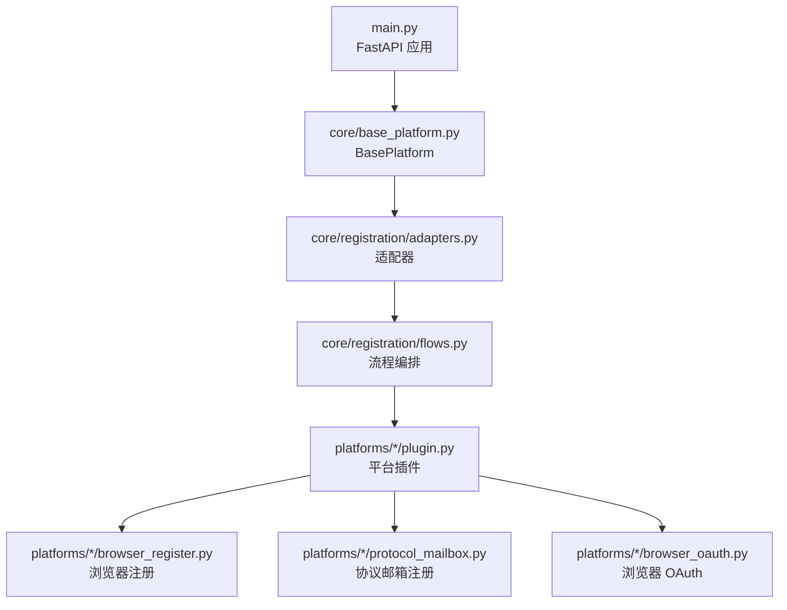
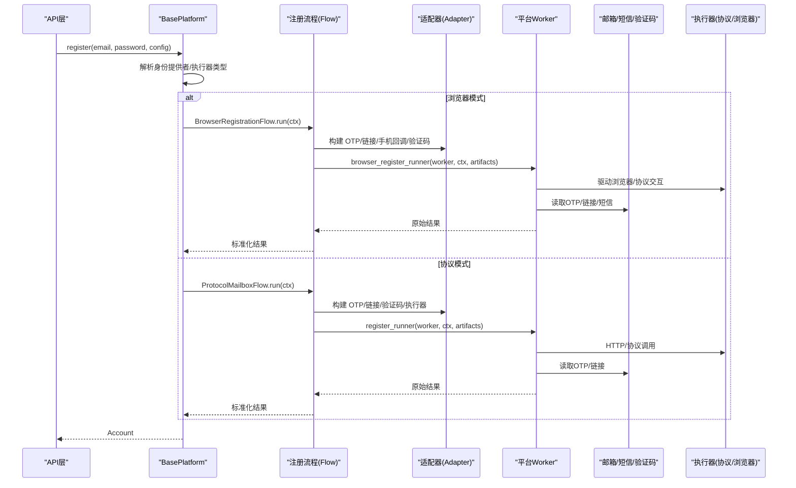
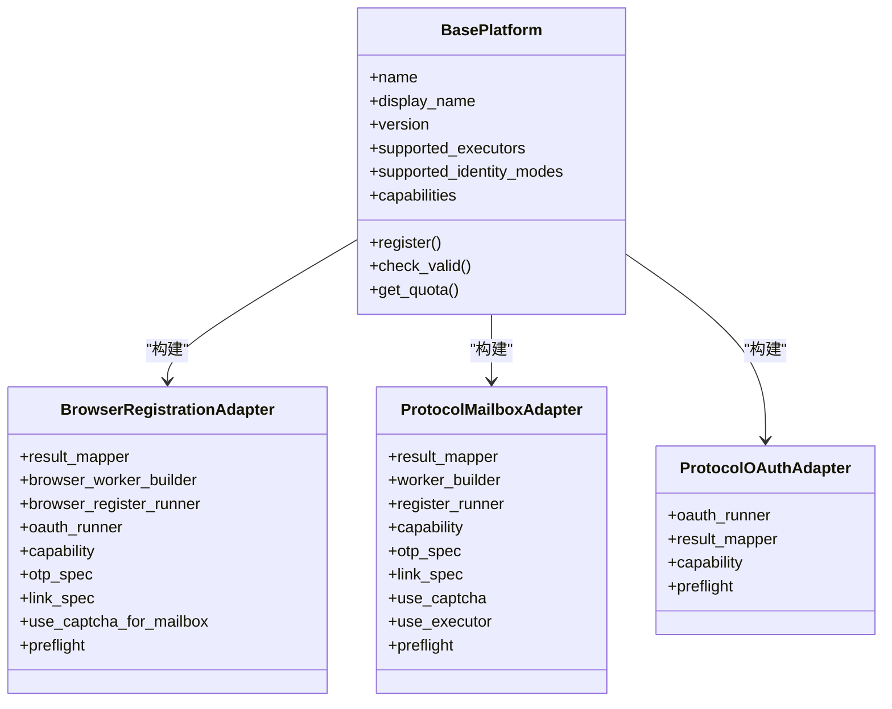
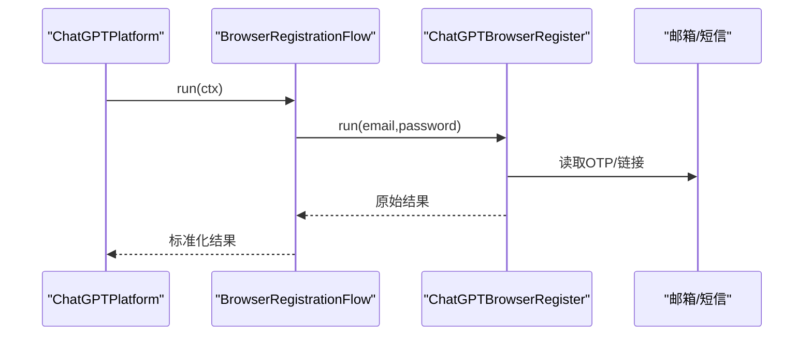
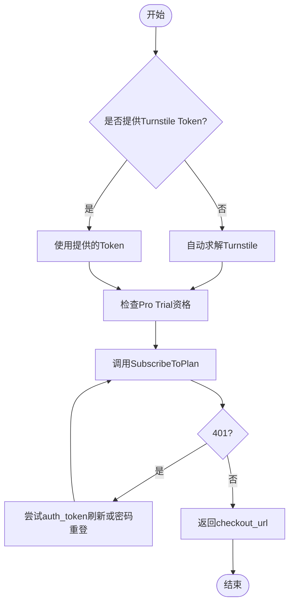
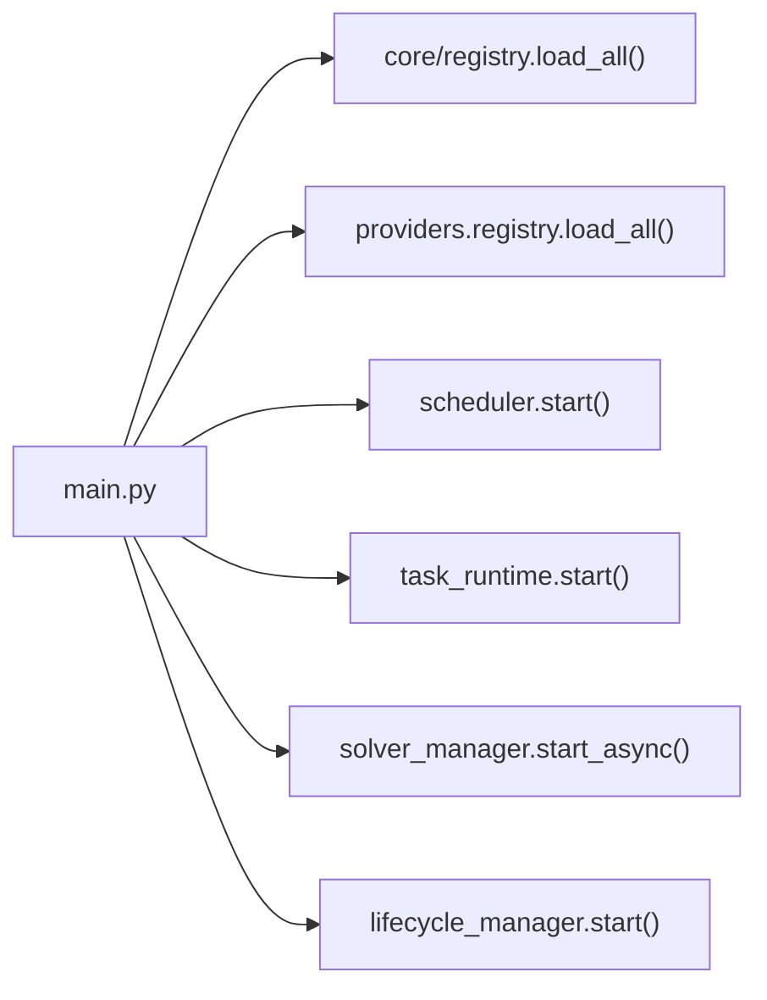

# 多平台注册支持

<cite>
**本文引用的文件**
- [main.py](file://main.py)
- [core/base_platform.py](file://core/base_platform.py)
- [core/registration/adapters.py](file://core/registration/adapters.py)
- [core/registration/flows.py](file://core/registration/flows.py)
- [core/registration/models.py](file://core/registration/models.py)
- [platforms/chatgpt/plugin.py](file://platforms/chatgpt/plugin.py)
- [platforms/cursor/plugin.py](file://platforms/cursor/plugin.py)
- [platforms/windsurf/plugin.py](file://platforms/windsurf/plugin.py)
- [platforms/kiro/plugin.py](file://platforms/kiro/plugin.py)
- [platforms/trae/plugin.py](file://platforms/trae/plugin.py)
- [platforms/tavily/plugin.py](file://platforms/tavily/plugin.py)
- [platforms/grok/plugin.py](file://platforms/grok/plugin.py)
- [platforms/blink/plugin.py](file://platforms/blink/plugin.py)
- [platforms/cerebras/plugin.py](file://platforms/cerebras/plugin.py)
- [platforms/openblocklabs/plugin.py](file://platforms/openblocklabs/plugin.py)
</cite>

## 目录
1. [简介](#简介)
2. [项目结构](#项目结构)
3. [核心组件](#核心组件)
4. [架构总览](#架构总览)
5. [详细组件分析](#详细组件分析)
6. [依赖关系分析](#依赖关系分析)
7. [性能与执行模式](#性能与执行模式)
8. [常见问题与排错](#常见问题与排错)
9. [结论](#结论)
10. [附录：平台配置示例与最佳实践](#附录：平台配置示例与最佳实践)

## 简介
本文件面向 Any Auto Register 的“多平台注册支持”，系统性梳理系统对 11+ AI 平台的注册实现，包括 ChatGPT、Cursor、Windsurf、Kiro、Trae.ai、Tavily、Grok、Blink、Cerebras、OpenBlockLabs 等。文档覆盖各平台的注册流程、配置参数、执行模式（协议/浏览器）、OAuth 集成、验证码处理、代理与邮箱方案、生命周期管理与性能优化建议，并解释平台适配器的架构设计，帮助开发者为新的 AI 平台添加注册支持。

## 项目结构
- 后端入口与路由挂载在 main.py，启动时加载平台插件与 Provider，并启动调度器、任务运行时、Solver 与生命周期管理。
- 平台插件位于 platforms/*，每个平台提供 plugin.py 声明能力、构建适配器、实现校验与操作。
- 通用注册框架位于 core/registration，包含适配器、流程编排与数据模型；BasePlatform 统一封装执行器、验证码、身份解析与结果映射。

**图表来源**
- [main.py:67-91](file://main.py#L67-L91)
- [core/base_platform.py:44-160](file://core/base_platform.py#L44-L160)
- [core/registration/adapters.py:28-59](file://core/registration/adapters.py#L28-L59)
- [core/registration/flows.py:18-142](file://core/registration/flows.py#L18-L142)

**章节来源**
- [main.py:67-91](file://main.py#L67-L91)

## 核心组件
- BasePlatform：统一注册入口，根据 executor_type 选择浏览器或协议流程；负责验证码解决器选择与初始化、身份提供者解析、结果到 Account 的转换与元数据附加。
- 注册适配器：
  - BrowserRegistrationAdapter：封装浏览器注册工作流，支持 OTP、验证链接、手机号回调、验证码、预检查与 OAuth。
  - ProtocolMailboxAdapter：封装协议邮箱注册，支持 OTP、验证链接、验证码、可选执行器上下文。
  - ProtocolOAuthAdapter：封装协议级 OAuth 登录获取凭证。
- 流程编排：
  - BrowserRegistrationFlow：处理浏览器注册与 OAuth 前置校验、构造回调与执行器、调用具体 worker。
  - ProtocolMailboxFlow：构造验证码、OTP、链接回调与执行器，运行协议注册。
  - ProtocolOAuthFlow：校验允许的执行器类型与无头复用要求，执行 OAuth。
- 数据模型：
  - RegistrationCapability：声明能力约束（如 OAuth 允许的 executor、是否需要邮箱/邮箱 provider）。
  - RegistrationContext：注册上下文（平台、身份、配置、日志）。
  - RegistrationArtifacts：中间产物（OTP/链接/手机回调、验证码、执行器、原始结果）。
  - RegistrationResult：标准化注册结果（email/password/token/status/extra）。

**章节来源**
- [core/base_platform.py:44-160](file://core/base_platform.py#L44-L160)
- [core/registration/adapters.py:28-59](file://core/registration/adapters.py#L28-L59)
- [core/registration/flows.py:18-142](file://core/registration/flows.py#L18-L142)
- [core/registration/models.py:7-66](file://core/registration/models.py#L7-L66)

## 架构总览
下图展示从请求到平台注册的完整链路：BasePlatform 根据配置选择执行器与身份提供者，构建适配器并通过 flows 编排 OTP/链接/验证码/执行器，最终调用平台插件的具体 worker 或 OAuth 流程，产出标准化的 RegistrationResult，再转换为 Account。

**图表来源**
- [core/base_platform.py:124-160](file://core/base_platform.py#L124-L160)
- [core/registration/flows.py:18-142](file://core/registration/flows.py#L18-L142)
- [core/registration/adapters.py:28-59](file://core/registration/adapters.py#L28-L59)

## 详细组件分析

### 平台适配器与能力声明
- 所有平台通过 @register 装饰器将平台类注入全局注册表，并在 plugin.py 中声明 supported_executors、supported_identity_modes、capabilities 与 capability_overrides。
- 平台通过 build_*_adapter 返回对应的适配器实例，定义 result_mapper、worker_builder、register_runner/oauth_runner、otp_spec/link_spec、use_captcha/use_executor 等。

**图表来源**
- [core/base_platform.py:44-160](file://core/base_platform.py#L44-L160)
- [core/registration/adapters.py:28-59](file://core/registration/adapters.py#L28-L59)

**章节来源**
- [core/registration/adapters.py:28-59](file://core/registration/adapters.py#L28-L59)
- [core/registration/models.py:7-66](file://core/registration/models.py#L7-L66)

### ChatGPT 平台
- 执行器：支持 protocol/headless/headed；身份模式支持 mailbox 与 oauth_browser；支持 Google/Microsoft OAuth。
- 注册流程：
  - 浏览器模式：使用 BrowserRegistrationAdapter，内置 OTP 等待与验证码；可走 OAuth 流程。
  - 协议邮箱模式：ProtocolMailboxAdapter，通过自定义 worker 完成注册与令牌获取。
  - 协议 OAuth：ProtocolOAuthAdapter，调用浏览器 OAuth 获取账号凭证。
- 能力：query_state、refresh_token、generate_link、switch_desktop、upload_cpa、upload_tm。
- 校验：通过订阅状态接口判断有效性，支持代理池重试与成功/失败上报。
- 密码策略：生成更稳定的密码组合以提高通过率。

**图表来源**
- [platforms/chatgpt/plugin.py:160-177](file://platforms/chatgpt/plugin.py#L160-L177)
- [core/registration/flows.py:18-79](file://core/registration/flows.py#L18-L79)

**章节来源**
- [platforms/chatgpt/plugin.py:48-177](file://platforms/chatgpt/plugin.py#L48-L177)
- [platforms/chatgpt/plugin.py:227-423](file://platforms/chatgpt/plugin.py#L227-L423)

### Cursor 平台
- 执行器：支持 protocol/headless/headed；身份模式 mailbox。
- 注册流程：
  - 浏览器模式：BrowserRegistrationAdapter，支持 OTP、验证码、手机号回调；可走 OAuth。
  - 协议邮箱模式：ProtocolMailboxAdapter，支持验证码与 OTP。
  - 协议 OAuth：ProtocolOAuthAdapter，调用浏览器 OAuth。
- 能力：switch_desktop、query_state、generate_link。
- 校验：通过 /api/auth/me 接口验证 token 有效性。

**章节来源**
- [platforms/cursor/plugin.py:18-114](file://platforms/cursor/plugin.py#L18-L114)
- [platforms/cursor/plugin.py:116-265](file://platforms/cursor/plugin.py#L116-L265)

### Windsurf 平台
- 执行器：支持 protocol/headless/headed；身份模式 mailbox。
- 注册流程：
  - 协议邮箱模式：ProtocolMailboxAdapter，OTP 正则匹配六位数字，支持超时配置。
  - 浏览器模式：BrowserRegistrationAdapter，OTP 同样匹配六位数字。
- 能力：query_state、check_trial、generate_link、generate_link_browser、switch_desktop。
- 校验：加载账户状态，基于 plan_state 映射账户状态。
- 支付链接：支持自动打码 Turnstile 或通过浏览器自动化生成 Stripe 试用链接；具备会话刷新回退逻辑。

**图表来源**
- [platforms/windsurf/plugin.py:277-379](file://platforms/windsurf/plugin.py#L277-L379)

**章节来源**
- [platforms/windsurf/plugin.py:35-150](file://platforms/windsurf/plugin.py#L35-L150)
- [platforms/windsurf/plugin.py:152-385](file://platforms/windsurf/plugin.py#L152-L385)

### Kiro 平台
- 执行器：支持 protocol/headless/headed；身份模式 mailbox。
- 注册流程：
  - 浏览器模式：BrowserRegistrationAdapter，支持 OTP。
  - 协议邮箱模式：ProtocolMailboxAdapter，支持 OTP 与名称参数。
  - 协议 OAuth：ProtocolOAuthAdapter，调用浏览器 OAuth。
- 能力：switch_desktop、refresh_token、query_state。
- 校验：通过 refreshToken 刷新接口验证有效性。

**章节来源**
- [platforms/kiro/plugin.py:27-130](file://platforms/kiro/plugin.py#L27-L130)
- [platforms/kiro/plugin.py:132-320](file://platforms/kiro/plugin.py#L132-L320)

### Trae.ai 平台
- 执行器：未显式声明，默认继承基类；身份模式 mailbox。
- 注册流程：
  - 浏览器模式：BrowserRegistrationAdapter，支持 OTP。
  - 协议邮箱模式：ProtocolMailboxAdapter，使用 executor 上下文，支持 OTP。
  - 协议 OAuth：ProtocolOAuthAdapter，调用浏览器 OAuth。
- 能力：switch_account、get_user_info、get_cashier_url。
- 校验：简单基于 token 存在性判断。

**章节来源**
- [platforms/trae/plugin.py:9-89](file://platforms/trae/plugin.py#L9-L89)
- [platforms/trae/plugin.py:91-154](file://platforms/trae/plugin.py#L91-L154)

### Tavily 平台
- 执行器：未显式声明；身份模式 mailbox。
- 注册流程：
  - 浏览器模式：BrowserRegistrationAdapter，支持 OTP、验证链接、验证码；支持 preflight 启动本地 Solver。
  - 协议邮箱模式：ProtocolMailboxAdapter，支持验证码与执行器。
  - 协议 OAuth：当前仅浏览器 headed 模式支持。
- 能力：未声明额外能力；校验通过调用搜索 API 验证 api_key。

**章节来源**
- [platforms/tavily/plugin.py:9-120](file://platforms/tavily/plugin.py#L9-L120)

### Grok 平台
- 执行器：未显式声明；身份模式 mailbox。
- 注册流程：
  - 浏览器模式：BrowserRegistrationAdapter，支持 OTP（特定格式）。
  - 协议邮箱模式：ProtocolMailboxAdapter，支持验证码与 OTP。
  - 协议 OAuth：ProtocolOAuthAdapter，调用浏览器 OAuth。
- 校验：基于 sso 字段存在性判断。

**章节来源**
- [platforms/grok/plugin.py:9-98](file://platforms/grok/plugin.py#L9-L98)

### Blink.new 平台
- 执行器：未显式声明；身份模式 mailbox。
- 注册流程：
  - 协议邮箱模式：ProtocolMailboxAdapter，使用 LinkSpec 监听魔法链接邮件。
- 能力：get_account_state、generate_checkout_link、create_api_key。
- 校验：加载账户状态，基于 summary.valid 判断。

**章节来源**
- [platforms/blink/plugin.py:20-93](file://platforms/blink/plugin.py#L20-L93)
- [platforms/blink/plugin.py:95-199](file://platforms/blink/plugin.py#L95-L199)

### Cerebras 平台
- 执行器：未显式声明；身份模式 mailbox。
- 注册流程：
  - 协议邮箱模式：ProtocolMailboxAdapter，使用 executor 上下文，支持 OTP。
- 能力：get_account_state。
- 校验：通过 API Key 调用 models 接口验证。

**章节来源**
- [platforms/cerebras/plugin.py:8-89](file://platforms/cerebras/plugin.py#L8-L89)

### OpenBlockLabs 平台
- 执行器：未显式声明；身份模式 mailbox。
- 注册流程：
  - 浏览器模式：BrowserRegistrationAdapter，支持 OTP。
  - 协议邮箱模式：ProtocolMailboxAdapter，随机姓名参数。
  - 协议 OAuth：ProtocolOAuthAdapter，调用浏览器 OAuth。
- 校验：基于 wos_session 存在性判断。

**章节来源**
- [platforms/openblocklabs/plugin.py:10-94](file://platforms/openblocklabs/plugin.py#L10-L94)

## 依赖关系分析
- BasePlatform 依赖 core/registration 的适配器与流程，以及 providers（邮箱/验证码/接码/代理）与 services（Solver）。
- 平台插件依赖各自模块的 browser_register、protocol_mailbox、browser_oauth、switch/core 等。
- main.py 在启动时加载平台与 Provider，并启动调度器、任务运行时、Solver 与生命周期管理。

**图表来源**
- [main.py:67-91](file://main.py#L67-L91)

**章节来源**
- [main.py:67-91](file://main.py#L67-L91)

## 性能与执行模式
- 执行器选择：
  - protocol：纯协议，最快，适合稳定接口与高并发。
  - headless/headed：浏览器模式，适合需要页面交互的平台；headless 适合服务器环境，headed 便于调试与复杂交互。
- 验证码策略：
  - 优先使用远程服务（YesCaptcha/2Captcha），本地 Solver 作为回退；浏览器模式下 Camoufox 自动点击 Turnstile，失败回退远程。
- 代理池：
  - 静态轮询（成功率加权）+ 动态 API 提取 + 旋转网关；失败自动禁用；按平台可分配不同池。
- 并发与日志：
  - 可配置并发数；SSE 实时日志；持久化任务执行器。
- 生命周期：
  - 定时有效性检测、Token 自动续期、Trial 过期预警。

[本节为通用指导，不直接分析具体文件]

## 常见问题与排错
- 验证码失败：
  - 确认验证码 provider 已正确配置；协议模式优先远程；浏览器模式 Camoufox 自动点击失败回退远程；检查代理 IP 质量。
- 代理被封/注册失败率高：
  - 查看各代理成功率，禁用低成功率代理；使用住宅代理；降低并发；按平台分配代理池。
- Solver 启动超时：
  - 首次需下载/初始化 Camoufox；检查 8889 端口占用；Docker 建议使用预构建镜像；本地裸跑优先检查安装。
- ARM 镜像构建失败：
  - 前端 TypeScript 构建失败；先本地 npm run build 确认通过后再构建镜像。

**章节来源**
- [README.md:388-436](file://README.md#L388-L436)

## 结论
Any Auto Register 通过统一的 BasePlatform 与注册适配器/流程编排，实现了 11+ AI 平台的跨执行器注册能力。平台插件以声明式能力与适配器组装的方式接入，支持协议与浏览器双模式、OAuth 集成、验证码与代理策略、生命周期管理。开发者可按现有模式为新平台快速扩展注册支持。

[本节为总结，不直接分析具体文件]

## 附录：平台配置示例与最佳实践
- 邮箱服务：
  - 推荐 MoeMail（自建临时邮箱）、Laoudo（固定域名）、Cloudflare Worker 自建、Testmail、DuckDuckGo Email、Freemail、DuckMail、TempMail.lol、Temp-Mail Web。
- 验证码服务：
  - YesCaptcha、2Captcha、本地 Solver（Camoufox）。
- 代理池：
  - 静态代理、API 提取代理、旋转网关代理；启用 proxy provider 时优先动态代理，失败回退静态池。
- 接码服务：
  - SMS-Activate、HeroSMS；注册任务参数指定 sms_provider 优先。
- 执行模式建议：
  - 协议模式优先用于稳定接口；浏览器模式用于复杂交互或需要 Cookie/Session 的平台；headed 便于调试。
- OAuth 集成：
  - 部分平台仅支持 headed 模式进行 OAuth；无头模式需复用本机浏览器会话（chrome_user_data_dir/chrome_cdp_url）。
- 性能优化：
  - 合理设置并发；使用高质量住宅代理；按平台隔离代理池；利用成功率统计与错误归因定位问题。

**章节来源**
- [README.md:181-231](file://README.md#L181-L231)
- [README.md:232-275](file://README.md#L232-L275)
- [README.md:276-336](file://README.md#L276-L336)