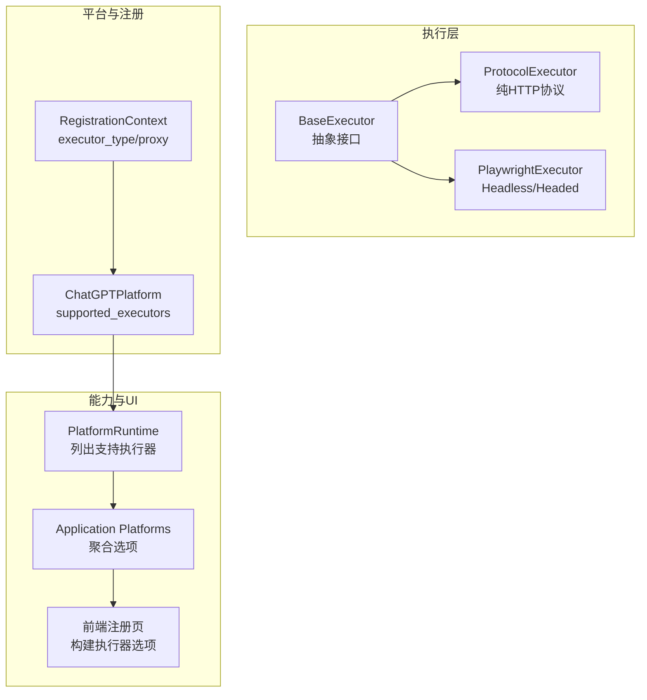
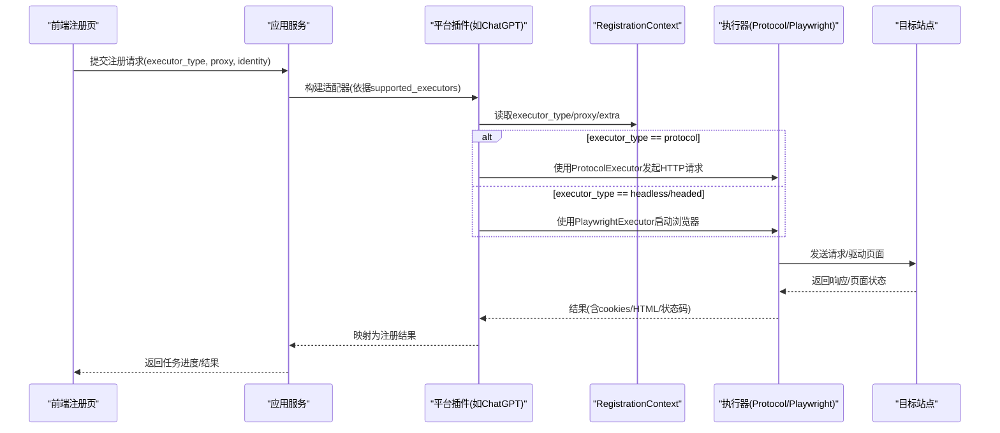
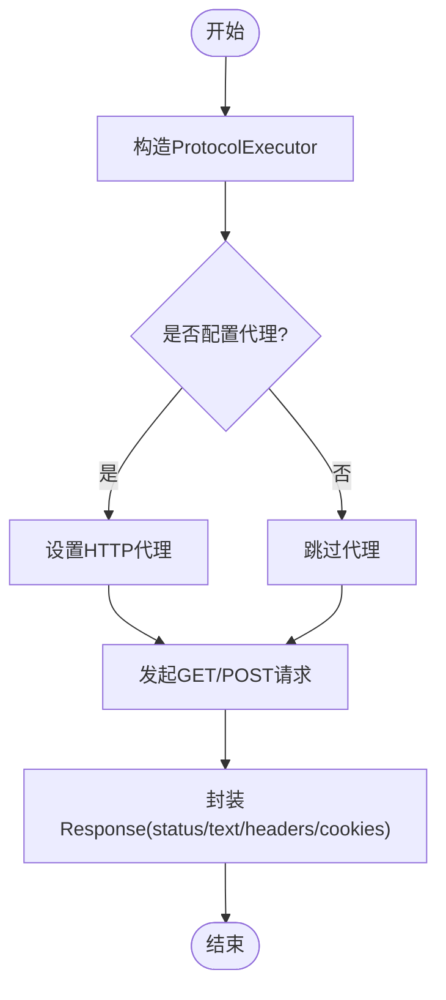
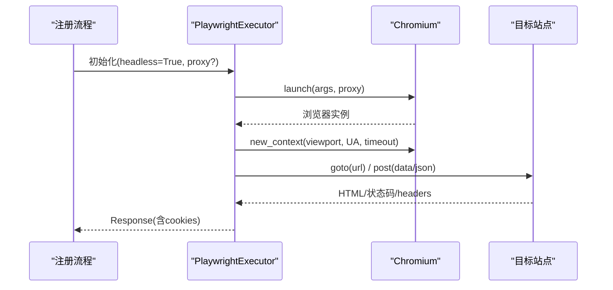
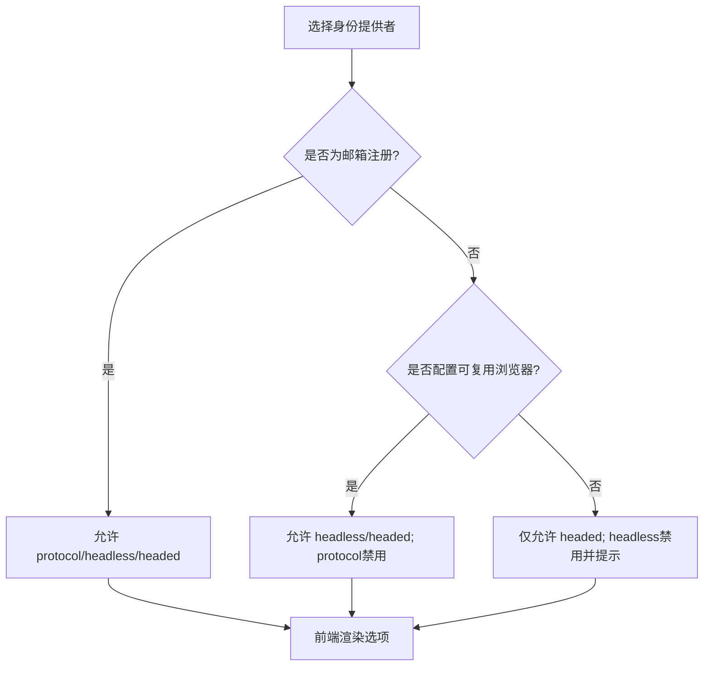
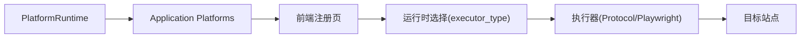

# 执行模式

<cite>
**本文引用的文件**
- [base_executor.py](file://core/base_executor.py)
- [protocol.py](file://core/executors/protocol.py)
- [playwright.py](file://core/executors/playwright.py)
- [models.py](file://core/registration/models.py)
- [plugin.py](file://platforms/chatgpt/plugin.py)
- [platform_runtime.py](file://infrastructure/platform_runtime.py)
- [platforms.py](file://application/platforms.py)
- [catalog.py](file://customer_portal_api/app/catalog.py)
- [registration.ts](file://frontend/src/lib/registration.ts)
- [Register.tsx](file://frontend/src/pages/Register.tsx)
- [Settings.tsx](file://frontend/src/pages/Settings.tsx)
- [api_solver.py](file://services/turnstile_solver/api_solver.py)
- [README.md](file://README.md)
</cite>

## 目录
1. [简介](#简介)
2. [项目结构](#项目结构)
3. [核心组件](#核心组件)
4. [架构总览](#架构总览)
5. [详细组件分析](#详细组件分析)
6. [依赖关系分析](#依赖关系分析)
7. [性能考虑](#性能考虑)
8. [故障排查指南](#故障排查指南)
9. [结论](#结论)
10. [附录](#附录)

## 简介
本文件聚焦 Any Auto Register 的三种执行模式：协议模式（Protocol）、Headless 模式与 Headed 模式。内容涵盖适用场景、性能特点、配置要求、优缺点对比，以及协议模式的 HTTP API 直接调用、Headless 模式的无头浏览器操作、Headed 模式的可视化调试能力。同时提供代理配置、浏览器设置、网络优化与安全注意事项，帮助用户按需求选择最佳执行模式。

## 项目结构
围绕执行模式的核心代码分布在以下位置：
- 执行器抽象与实现：core/base_executor.py、core/executors/protocol.py、core/executors/playwright.py
- 平台能力与注册上下文：core/registration/models.py、platforms/chatgpt/plugin.py
- 平台能力枚举与前端展示：infrastructure/platform_runtime.py、application/platforms.py、customer_portal_api/app/catalog.py、frontend/src/lib/registration.ts、frontend/src/pages/Register.tsx、frontend/src/pages/Settings.tsx
- 浏览器代理与网络：services/turnstile_solver/api_solver.py
- 文档与部署说明：README.md

图表来源
- [base_executor.py:1-49](file://core/base_executor.py#L1-L49)
- [protocol.py:1-45](file://core/executors/protocol.py#L1-L45)
- [playwright.py:1-134](file://core/executors/playwright.py#L1-L134)
- [models.py:17-39](file://core/registration/models.py#L17-L39)
- [plugin.py:48-55](file://platforms/chatgpt/plugin.py#L48-L55)
- [platform_runtime.py:221-238](file://infrastructure/platform_runtime.py#L221-L238)
- [platforms.py:36-54](file://application/platforms.py#L36-L54)
- [catalog.py:176-190](file://customer_portal_api/app/catalog.py#L176-L190)
- [registration.ts:73-111](file://frontend/src/lib/registration.ts#L73-L111)

章节来源
- [base_executor.py:1-49](file://core/base_executor.py#L1-L49)
- [protocol.py:1-45](file://core/executors/protocol.py#L1-L45)
- [playwright.py:1-134](file://core/executors/playwright.py#L1-L134)
- [models.py:17-39](file://core/registration/models.py#L17-L39)
- [plugin.py:48-55](file://platforms/chatgpt/plugin.py#L48-L55)
- [platform_runtime.py:221-238](file://infrastructure/platform_runtime.py#L221-L238)
- [platforms.py:36-54](file://application/platforms.py#L36-L54)
- [catalog.py:176-190](file://customer_portal_api/app/catalog.py#L176-L190)
- [registration.ts:73-111](file://frontend/src/lib/registration.ts#L73-L111)

## 核心组件
- BaseExecutor：定义统一的 get/post/cookies/close 等抽象接口，屏蔽底层差异，供上层流程统一调用。
- ProtocolExecutor：基于 curl_cffi 的纯 HTTP 客户端，模拟真实浏览器指纹，适合无需渲染的协议式注册或 OAuth 回调处理。
- PlaywrightExecutor：基于 Playwright 的浏览器自动化执行器，支持 headless/headed 两种运行方式，提供页面导航、元素交互、JS 执行等能力。
- RegistrationContext：封装 executor_type、proxy、extra 等运行时参数，决定实际使用的执行模式。
- 平台插件（以 ChatGPT 为例）：声明 supported_executors = ["protocol", "headless", "headed"]，并据此暴露不同适配器（协议邮箱、协议OAuth、浏览器注册）。

章节来源
- [base_executor.py:1-49](file://core/base_executor.py#L1-L49)
- [protocol.py:1-45](file://core/executors/protocol.py#L1-L45)
- [playwright.py:1-134](file://core/executors/playwright.py#L1-L134)
- [models.py:17-39](file://core/registration/models.py#L17-L39)
- [plugin.py:48-55](file://platforms/chatgpt/plugin.py#L48-L55)

## 架构总览
执行模式由“平台能力声明 + 运行时上下文 + 具体执行器”共同决定。前端根据平台能力与用户偏好生成可选项；后端在注册流程中读取 RegistrationContext.executor_type 选择对应执行器；平台插件再根据 executor_type 路由到协议或浏览器工作流。

图表来源
- [models.py:17-39](file://core/registration/models.py#L17-L39)
- [plugin.py:146-183](file://platforms/chatgpt/plugin.py#L146-L183)
- [protocol.py:19-44](file://core/executors/protocol.py#L19-L44)
- [playwright.py:14-71](file://core/executors/playwright.py#L14-L71)

## 详细组件分析

### 协议模式（Protocol）
- 工作原理：通过 HTTP 客户端直接与目标站点通信，不启动浏览器。适用于仅需 API 调用的注册流程或 OAuth 回调处理。
- 关键实现：
  - 统一响应封装 Response，包含 status_code、text、headers、cookies。
  - ProtocolExecutor 使用 curl_cffi Session，支持 impersonate、User-Agent 与代理。
  - 支持 get/post、获取/设置 cookies、关闭连接。
- 适用场景：
  - 邮箱验证码类注册（协议邮箱通道）。
  - 第三方 OAuth 回调（如 NextAuth）的协议式处理。
- 优点：
  - 资源占用低、速度快、稳定性高。
  - 易于并发与批量化。
- 缺点：
  - 无法处理需要 JS 渲染或复杂反爬的场景。
  - 对仅支持浏览器端流程的平台不可用。
- 配置要点：
  - 可通过 executor_type=protocol 启用。
  - 支持 proxy 参数透传到 HTTP 客户端。
  - 可设置 impersonate 与 User-Agent 以匹配目标站点期望。

图表来源
- [protocol.py:6-44](file://core/executors/protocol.py#L6-L44)
- [base_executor.py:7-16](file://core/base_executor.py#L7-L16)

章节来源
- [protocol.py:1-45](file://core/executors/protocol.py#L1-L45)
- [base_executor.py:1-49](file://core/base_executor.py#L1-L49)
- [models.py:28-39](file://core/registration/models.py#L28-L39)

### Headless 模式（无头浏览器）
- 工作原理：使用 Playwright 启动 Chromium 无头模式，自动完成页面导航、表单填写、点击、等待等动作。
- 关键实现：
  - PlaywrightExecutor 初始化时创建 Browser/Context/Page，设置默认超时、视口、UA。
  - 支持代理注入、额外请求头、JSON/表单 POST。
  - 提供 goto/fill/click/wait_for_selector/query_selector/evaluate/content/url/press 等常用方法。
- 适用场景：
  - 需要浏览器环境但无需可视化的自动化流程。
  - 复用本机浏览器登录态进行第三方登录（需配置 Chrome Profile 或 CDP）。
- 优点：
  - 兼容大多数现代 Web 站点，能处理 JS 渲染与反爬。
  - 无头模式节省资源，适合服务器批量执行。
- 缺点：
  - 相比协议模式更慢、资源占用更高。
  - 某些站点可能检测无头特征，需调整参数。
- 配置要点：
  - executor_type=headless 启用。
  - 可配置 proxy、viewport、user_agent、超时等。
  - 对于 OAuth 复用场景，需配置 chrome_user_data_dir 或 chrome_cdp_url。

图表来源
- [playwright.py:14-71](file://core/executors/playwright.py#L14-L71)
- [playwright.py:87-127](file://core/executors/playwright.py#L87-L127)

章节来源
- [playwright.py:1-134](file://core/executors/playwright.py#L1-L134)
- [models.py:28-39](file://core/registration/models.py#L28-L39)
- [registration.ts:97-105](file://frontend/src/lib/registration.ts#L97-L105)

### Headed 模式（可视化调试）
- 工作原理：与 Headless 相同，但启动有界面浏览器窗口，便于人工观察与调试。
- 关键实现：
  - PlaywrightExecutor 将 headless=False 即可打开可视化窗口。
  - 结合 noVNC（Docker 部署时）可在远程查看浏览器画面。
- 适用场景：
  - 开发调试、问题定位、验证页面逻辑。
  - 需要人工介入的特殊步骤（如手动确认）。
- 优点：
  - 直观可见，便于快速定位问题。
- 缺点：
  - 资源占用更大，不适合大规模并发。
- 配置要点：
  - executor_type=headed 启用。
  - 在 Docker 环境中配合 noVNC 端口访问可视化界面。

章节来源
- [playwright.py:14-35](file://core/executors/playwright.py#L14-L35)
- [README.md:125-155](file://README.md#L125-L155)

### 模式选择与前端交互
- 平台能力声明：各平台通过 supported_executors 声明支持的执行模式（如 ChatGPT 支持 protocol/headless/headed）。
- 前端选项构建：根据 identityProvider 与 reusableBrowser 动态禁用/提示不可用项（例如 protocol 不适用于 oauth_browser；headless 需要可复用浏览器配置）。
- 运行时选择：RegistrationContext.executor_type 决定实际执行器类型；若未显式指定，默认回退到 protocol。

图表来源
- [plugin.py:48-55](file://platforms/chatgpt/plugin.py#L48-L55)
- [registration.ts:73-111](file://frontend/src/lib/registration.ts#L73-L111)
- [models.py:28-39](file://core/registration/models.py#L28-L39)

章节来源
- [platform_runtime.py:221-238](file://infrastructure/platform_runtime.py#L221-L238)
- [platforms.py:36-54](file://application/platforms.py#L36-L54)
- [catalog.py:176-190](file://customer_portal_api/app/catalog.py#L176-L190)
- [registration.ts:73-111](file://frontend/src/lib/registration.ts#L73-L111)
- [Register.tsx:411-433](file://frontend/src/pages/Register.tsx#L411-L433)
- [Settings.tsx:187-212](file://frontend/src/pages/Settings.tsx#L187-L212)

## 依赖关系分析
- 执行器依赖：
  - ProtocolExecutor 依赖 curl_cffi 的 Session 与 Cookie 管理。
  - PlaywrightExecutor 依赖 Playwright 同步 API 与 Chromium 引擎。
- 平台与执行器耦合：
  - 平台插件通过 RegistrationCapability 与适配器组合，将 executor_type 映射到具体工作流（协议邮箱/协议OAuth/浏览器注册）。
- 能力发现链：
  - PlatformRuntime 收集平台描述符，包含 supported_executors。
  - Application Platforms 聚合所有平台的能力选项，供前端展示。
  - 前端根据 identityProvider 与 reusableBrowser 计算可用选项并禁用不满足条件的模式。

图表来源
- [platform_runtime.py:221-238](file://infrastructure/platform_runtime.py#L221-L238)
- [platforms.py:36-54](file://application/platforms.py#L36-L54)
- [registration.ts:73-111](file://frontend/src/lib/registration.ts#L73-L111)
- [models.py:28-39](file://core/registration/models.py#L28-L39)

章节来源
- [platform_runtime.py:221-238](file://infrastructure/platform_runtime.py#L221-L238)
- [platforms.py:36-54](file://application/platforms.py#L36-L54)
- [catalog.py:176-190](file://customer_portal_api/app/catalog.py#L176-L190)
- [registration.ts:73-111](file://frontend/src/lib/registration.ts#L73-L111)

## 性能考虑
- 协议模式：
  - 优势：极低资源消耗、高吞吐、稳定延迟。
  - 建议：合理设置超时与重试；利用代理池提升成功率；避免频繁切换 UA/impersonate。
- Headless 模式：
  - 优势：兼容性强，适合复杂站点。
  - 建议：
    - 增大默认超时（已设置为 60 秒），避免长页面加载失败。
    - 合理设置 viewport 与 UA，减少被识别风险。
    - 使用代理时注意认证格式与连通性。
- Headed 模式：
  - 优势：可视化调试，便于定位问题。
  - 建议：仅在调试阶段使用；生产环境优先 headless；如需远程可视化，结合 noVNC。
- 代理与网络：
  - 支持多种代理格式（含带用户名密码），确保 server、username、password 正确。
  - 可附加 sec-ch-ua 等头部增强指纹一致性。
- 安全与合规：
  - 遵守目标平台服务条款；谨慎处理敏感信息（token、cookies）。
  - 在生产环境限制对外暴露端口（Web UI、noVNC、Solver）。

章节来源
- [playwright.py:14-35](file://core/executors/playwright.py#L14-L35)
- [api_solver.py:662-736](file://services/turnstile_solver/api_solver.py#L662-L736)
- [README.md:125-155](file://README.md#L125-L155)

## 故障排查指南
- 常见错误与原因：
  - 身份解析失败：检查 executor_type、identityProvider 与配置项（邮箱/OAuth/Chrome Profile/CDP）。
  - 验证码配置不可用：确认验证码提供商已启用且凭据正确。
  - 验证码等待超时：适当增加超时时间，检查邮箱/短信通道可用性。
  - 无头 OAuth 缺少可复用浏览器会话：配置 chrome_user_data_dir 或 chrome_cdp_url。
  - 当前平台或执行器不支持该路径：核对平台 supported_executors 与前端选项禁用原因。
- 排查步骤：
  - 切换到 Headed 模式观察页面行为，定位卡点。
  - 检查代理连通性与认证格式，必要时更换代理。
  - 查看任务日志与 SSE 实时日志，定位具体步骤失败原因。
  - 对于协议模式，抓包比对请求头与响应体，确认站点期望。
- 参考实现：
  - 异常类型定义位于 errors.py，便于上层捕获与分类处理。
  - 任务执行中的并发与错误收集逻辑位于 tasks 相关模块，便于定位批量失败原因。

章节来源
- [errors.py:1-25](file://core/registration/errors.py#L1-L25)
- [tasks.py:827-851](file://application/tasks.py#L827-L851)

## 结论
Any Auto Register 通过统一的执行器抽象与平台能力声明，实现了协议模式、Headless 模式与 Headed 模式的灵活切换。协议模式适合高效稳定的 API 式注册；Headless 模式兼顾兼容性与资源效率；Headed 模式则提供可视化调试能力。结合代理配置、浏览器设置与网络优化，用户可根据业务需求选择最优执行模式，并在生产环境中获得良好的性能与稳定性。

## 附录

### 配置示例与最佳实践
- 协议模式
  - executor_type: "protocol"
  - proxy: "http://user:pass@ip:port"（可选）
  - impersonate: "chrome124"（可选）
  - user-agent: 与目标站点期望一致
- Headless 模式
  - executor_type: "headless"
  - proxy: 同上
  - viewport: 1280x720（默认）
  - user_agent: 与目标站点期望一致
  - timeout: 60000ms（默认）
  - 复用浏览器：配置 chrome_user_data_dir 或 chrome_cdp_url
- Headed 模式
  - executor_type: "headed"
  - 本地或 Docker noVNC 可视化
- 代理格式
  - 支持带认证与不带认证的多种格式，确保 server、username、password 正确
- 安全建议
  - 限制对外端口；妥善保管 token/cookies；遵循目标平台条款

章节来源
- [protocol.py:6-44](file://core/executors/protocol.py#L6-L44)
- [playwright.py:14-71](file://core/executors/playwright.py#L14-L71)
- [api_solver.py:662-736](file://services/turnstile_solver/api_solver.py#L662-L736)
- [README.md:125-155](file://README.md#L125-L155)