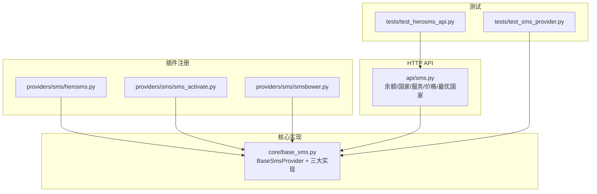
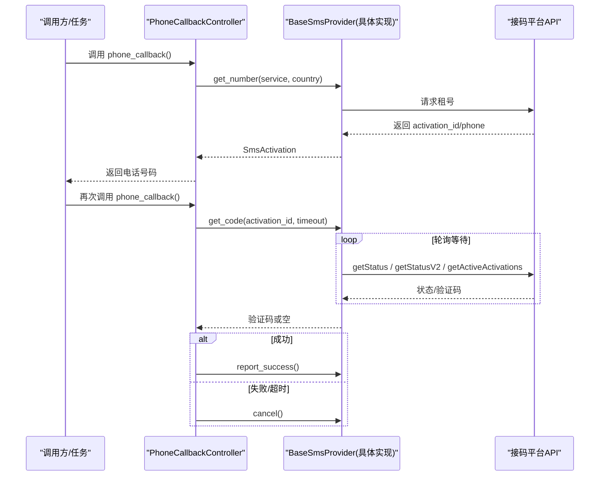
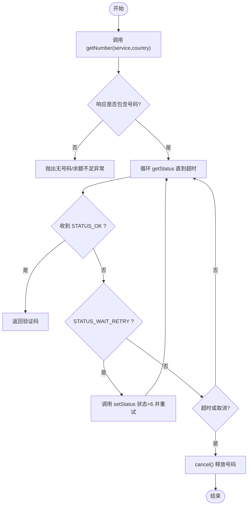
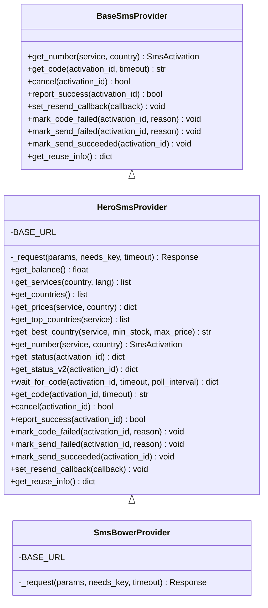
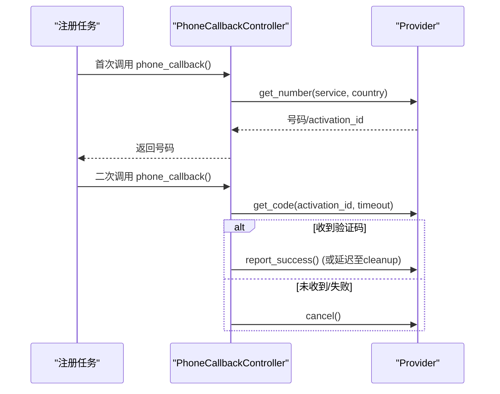
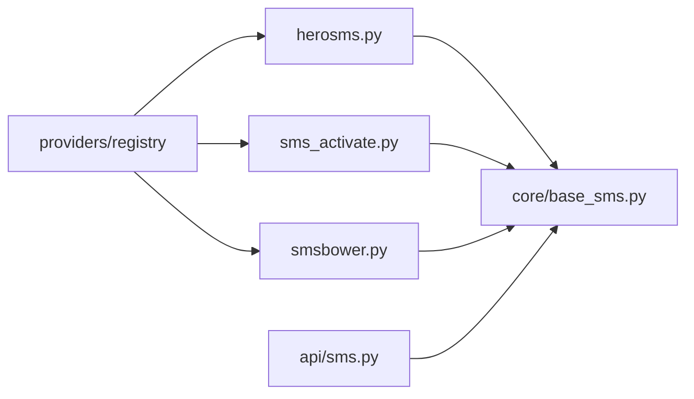

# 接码服务

<cite>
**本文引用的文件**
- [core/base_sms.py](file://core/base_sms.py)
- [providers/sms/herosms.py](file://providers/sms/herosms.py)
- [providers/sms/sms_activate.py](file://providers/sms/sms_activate.py)
- [providers/sms/smsbower.py](file://providers/sms/smsbower.py)
- [api/sms.py](file://api/sms.py)
- [tests/test_herosms_api.py](file://tests/test_herosms_api.py)
- [tests/test_sms_provider.py](file://tests/test_sms_provider.py)
- [README.md](file://README.md)
</cite>

## 目录
1. [简介](#简介)
2. [项目结构](#项目结构)
3. [核心组件](#核心组件)
4. [架构总览](#架构总览)
5. [详细组件分析](#详细组件分析)
6. [依赖关系分析](#依赖关系分析)
7. [性能与成本优化](#性能与成本优化)
8. [故障排查指南](#故障排查指南)
9. [结论](#结论)
10. [附录：配置与API参考](#附录：配置与api参考)

## 简介
本文件面向 Any Auto Register 的“接码服务”子系统，系统性说明如何集成并运行三种短信接收服务：HeroSMS、SMS-Activate、SMSBower。文档覆盖注册流程、API接口、号码池管理、消息获取机制、超时重试与错误恢复、地区号码选择策略、服务质量监控与成本优化建议，帮助构建稳定可靠的短信验证码接收系统。

## 项目结构
接码能力集中在 core/base_sms.py，提供统一抽象与三大提供商实现；各 providers/sms/*.py 仅负责将具体实现注册到全局 Provider 注册表；api/sms.py 暴露 HTTP 接口用于余额查询、国家/服务列表、价格查询与最优国家推荐等。

图表来源
- [core/base_sms.py:28-1100](file://core/base_sms.py#L28-L1100)
- [providers/sms/herosms.py:10-18](file://providers/sms/herosms.py#L10-L18)
- [providers/sms/sms_activate.py:7-10](file://providers/sms/sms_activate.py#L7-L10)
- [providers/sms/smsbower.py:6-9](file://providers/sms/smsbower.py#L6-L9)
- [api/sms.py:1-215](file://api/sms.py#L1-L215)
- [tests/test_sms_provider.py:1-469](file://tests/test_sms_provider.py#L1-L469)
- [tests/test_herosms_api.py:1-28](file://tests/test_herosms_api.py#L1-L28)

章节来源
- [core/base_sms.py:28-1100](file://core/base_sms.py#L28-L1100)
- [api/sms.py:1-215](file://api/sms.py#L1-L215)
- [providers/sms/herosms.py:10-18](file://providers/sms/herosms.py#L10-L18)
- [providers/sms/sms_activate.py:7-10](file://providers/sms/sms_activate.py#L7-L10)
- [providers/sms/smsbower.py:6-9](file://providers/sms/smsbower.py#L6-L9)
- [tests/test_sms_provider.py:1-469](file://tests/test_sms_provider.py#L1-L469)
- [tests/test_herosms_api.py:1-28](file://tests/test_herosms_api.py#L1-L28)

## 核心组件
- BaseSmsProvider：定义统一的接码接口（租号、取码、取消、成功上报、重发回调、失败标记、复用信息）。
- SmsActivateProvider：基于 SMS-Activate 兼容 API 的实现，支持 getNumber/getStatus/setStatus 等。
- HeroSmsProvider：功能最丰富的实现，包含 V2 JSON 号码接口、动态价格上限、号码复用缓存、去重、自动重发、智能国家选择等。
- SmsBowerProvider：继承 HeroSmsProvider，仅更换基础 URL，其余逻辑一致。
- PhoneCallbackController：封装浏览器注册时的“手机号回调”，负责生命周期管理（租号→等码→成功/取消）、自动重发与清理。
- create_phone_callbacks / create_sms_provider：工厂方法，按 provider_key 创建实例或回调。

章节来源
- [core/base_sms.py:28-1100](file://core/base_sms.py#L28-L1100)
- [core/base_sms.py:1103-1266](file://core/base_sms.py#L1103-L1266)

## 架构总览
下图展示了从上层调用到接码服务的完整链路：前端/任务通过 PhoneCallbackController 触发，控制器根据 provider_key 创建对应 Provider，执行租号、轮询取码、成功/取消上报，并在需要时触发上游重发。

图表来源
- [core/base_sms.py:1103-1266](file://core/base_sms.py#L1103-L1266)
- [core/base_sms.py:136-181](file://core/base_sms.py#L136-L181)
- [core/base_sms.py:725-966](file://core/base_sms.py#L725-L966)

## 详细组件分析

### SMS-Activate 提供商
- 服务与国家映射：内置常用服务与国家 ID 映射，便于统一入参。
- 租号：getNumber，返回 ACCESS_NUMBER:activationId:phoneNumber。
- 取码：getStatus 轮询，处理 STATUS_WAIT_CODE/STATUS_WAIT_RETRY/STATUS_OK/STATUS_CANCEL。
- 取消/成功：setStatus 分别传入不同状态码。
- 代理：支持 http/https 代理。

图表来源
- [core/base_sms.py:136-181](file://core/base_sms.py#L136-L181)

章节来源
- [core/base_sms.py:77-181](file://core/base_sms.py#L77-L181)
- [tests/test_sms_provider.py:17-40](file://tests/test_sms_provider.py#L17-L40)

### HeroSMS 提供商
- 号码获取：优先使用 getNumberV2（JSON），失败回退到 getNumber（文本）；动态计算 maxPrice 以尽量拿到物理号码。
- 号码复用：进程内持久化缓存（文件+内存），支持按成功次数/有效期控制复用，避免重复消费同一验证码。
- 消息去重：对同一激活ID的短信事件进行规范化与哈希去重，防止重复提交无效验证码。
- 自动重发：等待过程中周期性请求重发，必要时触发外部回调（如 OpenAI 侧重发）。
- 智能国家选择：按价格排序与库存筛选，支持最小库存与最高价格限制，针对特定服务（如 OpenAI）有白名单策略。
- 取码：同时尝试 getStatusV2、getStatus、getActiveActivations 三个通道，提高成功率。

图表来源
- [core/base_sms.py:28-1100](file://core/base_sms.py#L28-L1100)

章节来源
- [core/base_sms.py:188-1041](file://core/base_sms.py#L188-L1041)
- [tests/test_sms_provider.py:314-456](file://tests/test_sms_provider.py#L314-L456)

### SMSBower 提供商
- 与 HeroSMS 完全一致的 API 行为，仅基础 URL 不同（smsbower.page）。
- 所有接口均需 api_key（包括服务/国家列表查询）。

章节来源
- [core/base_sms.py:1028-1041](file://core/base_sms.py#L1028-L1041)
- [providers/sms/smsbower.py:1-10](file://providers/sms/smsbower.py#L1-L10)

### PhoneCallbackController（浏览器注册回调）
- 职责：在浏览器注册流程中按需租用号码、等待验证码、成功/失败上报、清理资源。
- 智能国家选择：当启用 auto_select_country 时，先查询最优国家，失败则回退默认国家。
- 生命周期：need_number → need_code → done；支持延迟成功上报（某些提供商不自动上报）。
- 清理：若未完成且未自动上报，则取消号码；否则报告成功。

图表来源
- [core/base_sms.py:1103-1266](file://core/base_sms.py#L1103-L1266)

章节来源
- [core/base_sms.py:1103-1266](file://core/base_sms.py#L1103-L1266)
- [tests/test_sms_provider.py:79-293](file://tests/test_sms_provider.py#L79-L293)

## 依赖关系分析
- 模块耦合：providers/sms/*.py 仅做注册，核心逻辑集中在 core/base_sms.py，降低耦合度。
- 外部依赖：requests 用于 HTTP 请求；文件系统用于 HeroSMS 号码复用缓存。
- 注册表：通过 providers.registry.register_provider 将各提供商注入统一入口，便于运行时选择。
- API 层：api/sms.py 依赖 core.base_sms 中的具体实现，提供余额、国家、服务、价格、最优国家等查询能力。

图表来源
- [providers/sms/herosms.py:10-18](file://providers/sms/herosms.py#L10-L18)
- [providers/sms/sms_activate.py:7-10](file://providers/sms/sms_activate.py#L7-L10)
- [providers/sms/smsbower.py:6-9](file://providers/sms/smsbower.py#L6-L9)
- [core/base_sms.py:28-1100](file://core/base_sms.py#L28-L1100)
- [api/sms.py:1-215](file://api/sms.py#L1-L215)

章节来源
- [providers/sms/herosms.py:10-18](file://providers/sms/herosms.py#L10-L18)
- [providers/sms/sms_activate.py:7-10](file://providers/sms/sms_activate.py#L7-L10)
- [providers/sms/smsbower.py:6-9](file://providers/sms/smsbower.py#L6-L9)
- [core/base_sms.py:28-1100](file://core/base_sms.py#L28-L1100)
- [api/sms.py:1-215](file://api/sms.py#L1-L215)

## 性能与成本优化
- 号码复用（HeroSMS/SMSBower）
  - 通过进程内缓存与文件持久化，结合有效期与成功次数上限，减少重复租号成本。
  - 可配置 reuse_phone_to_max 与 phone_success_max，平衡成功率与成本。
- 动态价格上限
  - 获取实际价格后设置合理的 maxPrice，提升获得物理号码的概率，避免虚拟号码导致失败。
- 智能国家选择
  - 按价格排序与库存阈值筛选，支持最小库存与最高价格限制；针对特定服务（如 OpenAI）采用白名单策略，提高成功率。
- 多通道取码
  - 同时尝试 getStatusV2、getStatus、getActiveActivations，提高验证码获取成功率。
- 自动重发
  - 等待期间周期性请求重发，必要时触发外部回调（如 OpenAI 侧重发），缩短等待时间。
- 代理与超时
  - 支持 http/https 代理；合理设置超时与轮询间隔，避免频繁请求造成限流。

[本节为通用指导，无需代码引用]

## 故障排查指南
- 无可用号码/余额不足
  - 检查服务商余额与配额；调整国家或服务映射；适当放宽价格上限或切换国家。
- 验证码未到达/重复
  - 确认去重逻辑生效（attempted_sms_keys/used_codes）；检查是否多次收到相同验证码被过滤；必要时触发重发。
- 号码被目标平台拒绝
  - 调用 mark_send_failed 停止复用并记录原因；检查国家/服务映射是否匹配目标平台要求。
- 超时未收到验证码
  - 延长超时时间；增加重发频率；检查网络与代理连通性；查看日志定位具体失败阶段。
- 成功但未释放号码
  - 确保 cleanup 路径正确执行；对于不支持自动上报的提供商，需在 cleanup 中显式 report_success 或 cancel。

章节来源
- [core/base_sms.py:155-181](file://core/base_sms.py#L155-L181)
- [core/base_sms.py:845-966](file://core/base_sms.py#L845-L966)
- [core/base_sms.py:1103-1266](file://core/base_sms.py#L1103-L1266)
- [tests/test_sms_provider.py:398-456](file://tests/test_sms_provider.py#L398-L456)

## 结论
Any Auto Register 的接码子系统通过统一抽象与三大提供商实现，提供了高可用的短信验证码接收能力。HeroSMS 与 SMSBower 具备更强的智能化特性（动态价格、号码复用、去重、自动重发、智能国家选择），SMS-Activate 则以简洁稳定的兼容 API 满足基础需求。配合 PhoneCallbackController 的生命周期管理与 API 层的运维能力，可构建稳定、高效、低成本的自动化注册系统。

[本节为总结，无需代码引用]

## 附录：配置与API参考

### 提供商配置要点
- SMS-Activate
  - 必填：api_key
  - 可选：default_country、proxy
  - 服务/国家映射见内部常量，可按需扩展
- HeroSMS
  - 必填：api_key
  - 可选：default_service、default_country、max_price、proxy、reuse_phone_to_max、phone_success_max
  - 支持智能国家选择（auto_select_country）与自动重发回调
- SMSBower
  - 必填：api_key
  - 可选：同 HeroSMS（service/country/max_price/proxy/reuse/phone_success_max）

章节来源
- [core/base_sms.py:1063-1100](file://core/base_sms.py#L1063-L1100)
- [core/base_sms.py:334-356](file://core/base_sms.py#L334-L356)
- [core/base_sms.py:1028-1041](file://core/base_sms.py#L1028-L1041)

### HTTP API（示例）
- HeroSMS
  - GET /api/sms/herosms/countries：获取国家列表
  - GET /api/sms/herosms/services?country=...：获取服务列表
  - POST /api/sms/herosms/balance：查询余额（需 api_key）
  - POST /api/sms/herosms/prices：查询价格（支持 service/country）
  - POST /api/sms/herosms/top-countries：获取按价格排序的国家（含库存）
  - POST /api/sms/herosms/best-country：自动选择最优国家
- SMSBower
  - GET /api/sms/smsbower/countries：获取国家列表
  - GET /api/sms/smsbower/services?country=...：获取服务列表
  - POST /api/sms/smsbower/balance：查询余额（需 api_key）
  - POST /api/sms/smsbower/prices：查询价格（支持 service/country）

章节来源
- [api/sms.py:48-147](file://api/sms.py#L48-L147)
- [api/sms.py:169-215](file://api/sms.py#L169-L215)
- [tests/test_herosms_api.py:14-28](file://tests/test_herosms_api.py#L14-L28)

### 费用计算方式
- HeroSMS/SMSBower
  - 可通过 getPrices 获取具体服务与国家的价格；getNumberV2 返回 activationCost；系统会动态设置 maxPrice 以提高获得物理号码的概率。
- SMS-Activate
  - 通过 getBalance 查询余额；租号与取码均可能产生费用，建议在业务层统计成本。

章节来源
- [core/base_sms.py:419-428](file://core/base_sms.py#L419-L428)
- [core/base_sms.py:645-711](file://core/base_sms.py#L645-L711)
- [core/base_sms.py:130-134](file://core/base_sms.py#L130-L134)

### 成功率优化策略
- 智能国家选择：优先选择价格低且库存充足的国家，必要时限定白名单。
- 多通道取码：并行尝试多种状态查询接口，提高验证码获取概率。
- 自动重发：等待期间周期性重发，缩短等待时间。
- 号码复用：在有效期内与成功次数限制内复用号码，降低成本并提升稳定性。
- 代理与超时：合理配置代理与超时，避免网络抖动影响成功率。

章节来源
- [core/base_sms.py:527-579](file://core/base_sms.py#L527-L579)
- [core/base_sms.py:845-912](file://core/base_sms.py#L845-L912)
- [core/base_sms.py:914-966](file://core/base_sms.py#L914-L966)

### 地区号码选择策略
- 默认映射：SMS-Activate 提供常用服务与国家映射，便于快速接入。
- 动态选择：HeroSMS/SMSBower 支持按价格与库存自动选择最优国家，并可设置最小库存与最高价格限制。
- 白名单策略：针对特定服务（如 OpenAI）采用国家白名单，确保走 SMS 通道。

章节来源
- [core/base_sms.py:77-106](file://core/base_sms.py#L77-L106)
- [core/base_sms.py:527-579](file://core/base_sms.py#L527-L579)

### 服务质量监控
- 余额监控：通过余额接口定期巡检，避免余额不足导致失败。
- 成功率统计：结合任务日志与错误归因，分析失败原因（代理风控、邮箱异常、二次验证等）。
- 号码复用状态：通过 get_reuse_info 获取当前号码复用状态与剩余时间，辅助调度。

章节来源
- [core/base_sms.py:1043-1056](file://core/base_sms.py#L1043-L1056)
- [README.md:84-110](file://README.md#L84-L110)