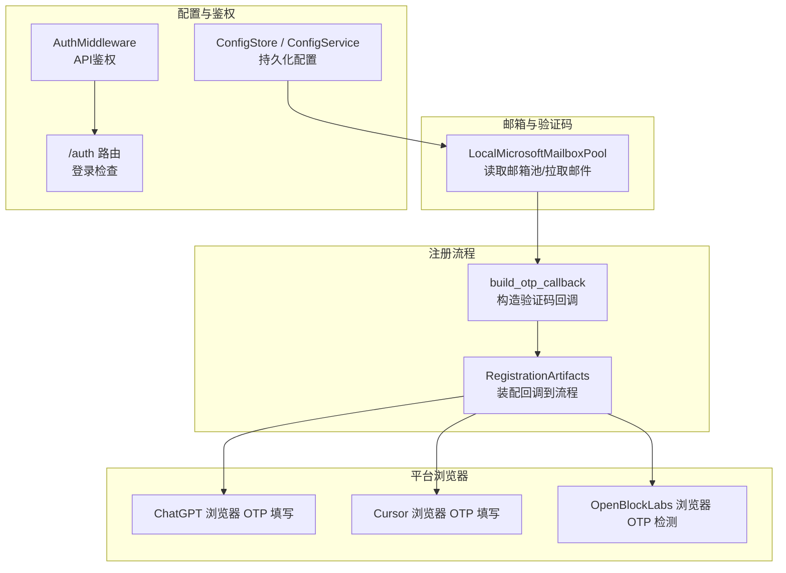
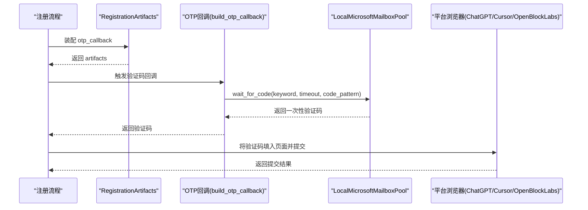
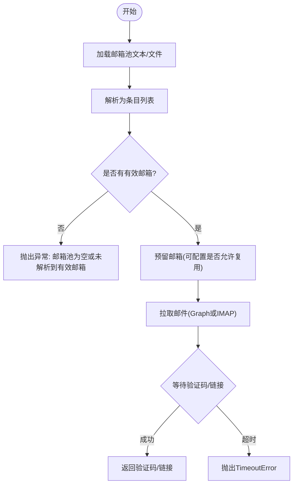
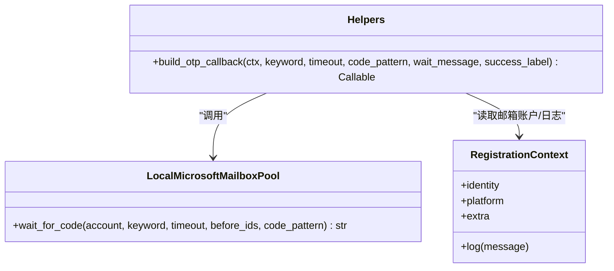
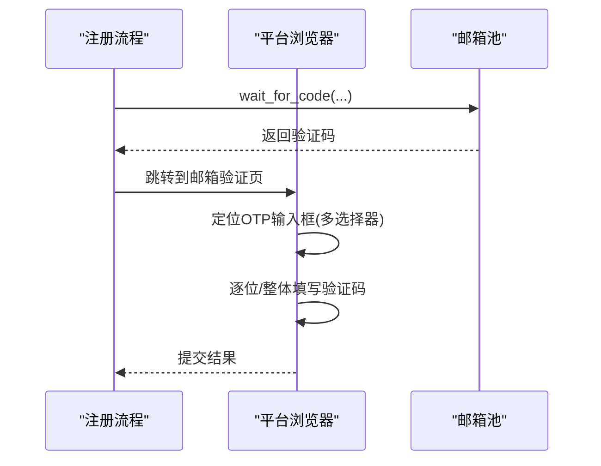
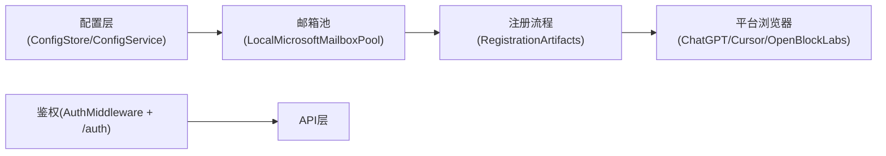

# 本地2FA功能

<cite>
**本文引用的文件**
- [core/local_ms_mailbox.py](file://core/local_ms_mailbox.py)
- [core/registration/helpers.py](file://core/registration/helpers.py)
- [core/registration/flows.py](file://core/registration/flows.py)
- [core/registration/models.py](file://core/registration/models.py)
- [core/config_store.py](file://core/config_store.py)
- [application/config.py](file://application/config.py)
- [api/auth.py](file://api/auth.py)
- [core/auth.py](file://core/auth.py)
- [platforms/chatgpt/browser_register.py](file://platforms/chatgpt/browser_register.py)
- [platforms/cursor/browser_register.py](file://platforms/cursor/browser_register.py)
- [platforms/openblocklabs/browser_register.py](file://platforms/openblocklabs/browser_register.py)
</cite>

## 目录
1. [简介](#简介)
2. [项目结构](#项目结构)
3. [核心组件](#核心组件)
4. [架构总览](#架构总览)
5. [详细组件分析](#详细组件分析)
6. [依赖关系分析](#依赖关系分析)
7. [性能考虑](#性能考虑)
8. [故障排查指南](#故障排查指南)
9. [结论](#结论)
10. [附录：配置与集成示例](#附录配置与集成示例)

## 简介
本章节面向 Any Auto Register 的“本地双因素认证（2FA）”能力，聚焦以下目标：
- 说明系统如何支持基于邮箱/短信的验证码流程（OTP），以及 TOTP/HOTP 等标准算法在系统中的角色与边界。
- 解释 2FA 密钥（如 TOTP Secret）的生成、存储与管理机制，包括安全访问控制与备份恢复建议。
- 描述 2FA 验证流程、时间同步注意事项与错误处理策略。
- 提供配置示例、集成指南与最佳实践，并给出与主流 2FA 应用的兼容性说明、迁移工具与故障排查方法。

需要特别说明的是：当前代码库中并未直接实现 TOTP/HOTP 的加解密计算逻辑；TOTP Secret 以明文字段形式随邮箱池数据传入并在后续流程中使用。真正的 OTP 校验通常由外部 2FA 应用（如 Google Authenticator、Microsoft Authenticator）完成，或平台侧通过邮箱/短信发送一次性验证码。因此，本项目的“本地2FA”更偏向于“本地邮箱/短信驱动的验证码收集与回填”，而 TOTP Secret 的管理则作为账户凭证的一部分进行持久化与传递。

## 项目结构
围绕本地2FA的相关代码主要分布在以下模块：
- 邮箱池与验证码接收：core/local_ms_mailbox.py
- 注册流程中的 OTP 回调构建：core/registration/helpers.py、core/registration/flows.py、core/registration/models.py
- 配置与设置：core/config_store.py、application/config.py
- API 鉴权（保护敏感配置与接口）：api/auth.py、core/auth.py
- 各平台的浏览器端 OTP 填写与提交：platforms/* 下的 browser_register.py

图表来源
- [core/local_ms_mailbox.py:161-212](file://core/local_ms_mailbox.py#L161-L212)
- [core/registration/helpers.py:46-72](file://core/registration/helpers.py#L46-L72)
- [core/registration/flows.py:46-67](file://core/registration/flows.py#L46-L67)
- [core/config_store.py:13-48](file://core/config_store.py#L13-L48)
- [application/config.py:9-21](file://application/config.py#L9-L21)
- [core/auth.py:22-48](file://core/auth.py#L22-L48)
- [api/auth.py:15-29](file://api/auth.py#L15-L29)
- [platforms/chatgpt/browser_register.py:2895-2982](file://platforms/chatgpt/browser_register.py#L2895-L2982)
- [platforms/cursor/browser_register.py:671-702](file://platforms/cursor/browser_register.py#L671-L702)
- [platforms/openblocklabs/browser_register.py:372-390](file://platforms/openblocklabs/browser_register.py#L372-L390)

章节来源
- [core/local_ms_mailbox.py:161-212](file://core/local_ms_mailbox.py#L161-L212)
- [core/registration/helpers.py:46-72](file://core/registration/helpers.py#L46-L72)
- [core/registration/flows.py:46-67](file://core/registration/flows.py#L46-L67)
- [core/config_store.py:13-48](file://core/config_store.py#L13-L48)
- [application/config.py:9-21](file://application/config.py#L9-L21)
- [core/auth.py:22-48](file://core/auth.py#L22-L48)
- [api/auth.py:15-29](file://api/auth.py#L15-L29)
- [platforms/chatgpt/browser_register.py:2895-2982](file://platforms/chatgpt/browser_register.py#L2895-L2982)
- [platforms/cursor/browser_register.py:671-702](file://platforms/cursor/browser_register.py#L671-L702)
- [platforms/openblocklabs/browser_register.py:372-390](file://platforms/openblocklabs/browser_register.py#L372-L390)

## 核心组件
- LocalMicrosoftMailboxPool：从本地文本/文件解析邮箱池，支持 Graph API 或 IMAP 拉取邮件，提供 wait_for_code/wait_for_link 等待验证码/链接的能力。其数据模型包含 totp_secret 字段，用于承载 TOTP 密钥。
- build_otp_callback：根据上下文构造验证码回调函数，调用邮箱提供的 wait_for_code 获取一次性验证码。
- RegistrationArtifacts：将 otp_callback/link_callback/phone_callback 等装配到注册流程中，驱动平台侧的浏览器行为。
- ConfigStore/ConfigService：提供键值型配置的持久化与更新，便于管理邮箱池、代理、状态文件等与2FA相关的配置项。
- AuthMiddleware 与 /auth 路由：为 API 提供基础鉴权，保护配置与敏感操作。

章节来源
- [core/local_ms_mailbox.py:36-85](file://core/local_ms_mailbox.py#L36-L85)
- [core/local_ms_mailbox.py:454-501](file://core/local_ms_mailbox.py#L454-L501)
- [core/registration/helpers.py:46-72](file://core/registration/helpers.py#L46-L72)
- [core/registration/models.py:44-53](file://core/registration/models.py#L44-L53)
- [core/config_store.py:13-48](file://core/config_store.py#L13-L48)
- [application/config.py:9-21](file://application/config.py#L9-L21)
- [core/auth.py:22-48](file://core/auth.py#L22-L48)
- [api/auth.py:15-29](file://api/auth.py#L15-L29)

## 架构总览
下图展示了本地2FA在注册流程中的整体交互：注册流程通过 RegistrationArtifacts 装配 OTP 回调；回调调用邮箱池的 wait_for_code 等待验证码；平台浏览器负责将验证码填入对应输入框并提交。

图表来源
- [core/registration/flows.py:46-67](file://core/registration/flows.py#L46-L67)
- [core/registration/helpers.py:46-72](file://core/registration/helpers.py#L46-L72)
- [core/local_ms_mailbox.py:454-501](file://core/local_ms_mailbox.py#L454-L501)
- [platforms/chatgpt/browser_register.py:2895-2982](file://platforms/chatgpt/browser_register.py#L2895-L2982)
- [platforms/cursor/browser_register.py:671-702](file://platforms/cursor/browser_register.py#L671-L702)
- [platforms/openblocklabs/browser_register.py:372-390](file://platforms/openblocklabs/browser_register.py#L372-L390)

## 详细组件分析

### 邮箱池与 TOTP Secret 管理（LocalMicrosoftMailboxPool）
- 数据模型：LocalMicrosoftMailboxEntry 包含 email、password、imap/smtp 配置、client_id/refresh_token，以及 totp_secret 字段。该字段用于承载 TOTP 密钥，随 credentials 透传到上层。
- 邮箱池加载：支持从内存文本或文件读取“心蓝通用格式”行，解析为条目列表；若未解析到有效邮箱会抛出异常。
- 可用性判断：graph_ready/im ap_ready 分别判断是否具备 Graph 刷新令牌或 IMAP 配置。
- 邮件拉取：优先使用 Microsoft Graph API 拉取最近邮件；若无 Graph 令牌则回退到 IMAP 拉取。
- 验证码等待：wait_for_code 轮询邮件内容，按关键词与正则匹配提取验证码；超时抛出 TimeoutError。
- 链接等待：wait_for_link 轮询邮件内容，提取验证链接；超时抛出 TimeoutError。

图表来源
- [core/local_ms_mailbox.py:118-158](file://core/local_ms_mailbox.py#L118-L158)
- [core/local_ms_mailbox.py:194-212](file://core/local_ms_mailbox.py#L194-L212)
- [core/local_ms_mailbox.py:228-248](file://core/local_ms_mailbox.py#L228-L248)
- [core/local_ms_mailbox.py:344-381](file://core/local_ms_mailbox.py#L344-L381)
- [core/local_ms_mailbox.py:394-432](file://core/local_ms_mailbox.py#L394-L432)
- [core/local_ms_mailbox.py:454-501](file://core/local_ms_mailbox.py#L454-L501)

章节来源
- [core/local_ms_mailbox.py:36-85](file://core/local_ms_mailbox.py#L36-L85)
- [core/local_ms_mailbox.py:118-158](file://core/local_ms_mailbox.py#L118-L158)
- [core/local_ms_mailbox.py:194-212](file://core/local_ms_mailbox.py#L194-L212)
- [core/local_ms_mailbox.py:228-248](file://core/local_ms_mailbox.py#L228-L248)
- [core/local_ms_mailbox.py:344-381](file://core/local_ms_mailbox.py#L344-L381)
- [core/local_ms_mailbox.py:394-432](file://core/local_ms_mailbox.py#L394-L432)
- [core/local_ms_mailbox.py:454-501](file://core/local_ms_mailbox.py#L454-L501)

### 注册流程中的 OTP 回调（build_otp_callback）
- 作用：根据上下文（平台、邮箱账户、额外参数）构造一个回调函数，内部调用邮箱池的 wait_for_code 等待并返回验证码。
- 参数：keyword（邮件关键词）、timeout（超时秒数）、code_pattern（验证码正则）、wait_message/success_label（日志提示）。
- 返回值：回调函数，供注册流程在需要时调用。

图表来源
- [core/registration/helpers.py:46-72](file://core/registration/helpers.py#L46-L72)
- [core/local_ms_mailbox.py:454-501](file://core/local_ms_mailbox.py#L454-L501)

章节来源
- [core/registration/helpers.py:46-72](file://core/registration/helpers.py#L46-L72)

### 注册流程装配（RegistrationArtifacts）
- 作用：在 flows.py 中，根据适配器配置（如 otp_spec）构建 otp_callback，并将其放入 RegistrationArtifacts，供后续流程使用。
- 扩展点：同时支持 verification_link_callback 与 phone_callback，形成统一的验证码/链接/短信接入方式。

章节来源
- [core/registration/flows.py:46-67](file://core/registration/flows.py#L46-L67)
- [core/registration/models.py:44-53](file://core/registration/models.py#L44-L53)

### 平台浏览器 OTP 填写与提交
- ChatGPT：在 email-verification 页面尝试多类选择器定位数字输入框，逐位填充验证码；若失败则重试单输入框模式。
- Cursor：等待 email-verification 页面出现后，查找 OTP 输入框并填写。
- OpenBlockLabs：检测页面是否处于邮箱验证阶段，并等待 OTP 输入框就绪。

图表来源
- [platforms/chatgpt/browser_register.py:2895-2982](file://platforms/chatgpt/browser_register.py#L2895-L2982)
- [platforms/cursor/browser_register.py:671-702](file://platforms/cursor/browser_register.py#L671-L702)
- [platforms/openblocklabs/browser_register.py:372-390](file://platforms/openblocklabs/browser_register.py#L372-L390)

章节来源
- [platforms/chatgpt/browser_register.py:2895-2982](file://platforms/chatgpt/browser_register.py#L2895-L2982)
- [platforms/cursor/browser_register.py:671-702](file://platforms/cursor/browser_register.py#L671-L702)
- [platforms/openblocklabs/browser_register.py:372-390](file://platforms/openblocklabs/browser_register.py#L372-L390)

### 配置与鉴权
- 配置存储：ConfigStore 提供 SQLite 键值存储；ConfigService 聚合配置与 Provider 元数据，暴露 get_config/update_config。
- API 鉴权：AuthMiddleware 对 /api 路径进行 Bearer/Cookie 校验；/auth 路由提供 check/login 接口。

章节来源
- [core/config_store.py:13-48](file://core/config_store.py#L13-L48)
- [application/config.py:9-21](file://application/config.py#L9-L21)
- [core/auth.py:22-48](file://core/auth.py#L22-L48)
- [api/auth.py:15-29](file://api/auth.py#L15-L29)

## 依赖关系分析
- 邮箱池依赖 Microsoft Graph 或 IMAP 协议拉取邮件；当 Graph 不可用时自动回退 IMAP。
- 注册流程依赖邮箱池提供的 wait_for_code/wait_for_link；平台浏览器依赖具体站点 DOM 结构定位 OTP 输入框。
- 配置与鉴权为全局支撑层，确保配置可持久化且 API 受保护。

图表来源
- [core/config_store.py:13-48](file://core/config_store.py#L13-L48)
- [application/config.py:9-21](file://application/config.py#L9-L21)
- [core/local_ms_mailbox.py:344-381](file://core/local_ms_mailbox.py#L344-L381)
- [core/registration/flows.py:46-67](file://core/registration/flows.py#L46-L67)
- [platforms/chatgpt/browser_register.py:2895-2982](file://platforms/chatgpt/browser_register.py#L2895-L2982)
- [core/auth.py:22-48](file://core/auth.py#L22-L48)
- [api/auth.py:15-29](file://api/auth.py#L15-L29)

章节来源
- [core/local_ms_mailbox.py:344-381](file://core/local_ms_mailbox.py#L344-L381)
- [core/registration/flows.py:46-67](file://core/registration/flows.py#L46-L67)
- [platforms/chatgpt/browser_register.py:2895-2982](file://platforms/chatgpt/browser_register.py#L2895-L2982)
- [core/auth.py:22-48](file://core/auth.py#L22-L48)
- [api/auth.py:15-29](file://api/auth.py#L15-L29)

## 性能考虑
- 邮箱拉取频率：wait_for_code/wait_for_link 采用轮询间隔（约5秒），可根据业务调整 timeout 与轮询策略以降低网络压力。
- Graph vs IMAP：优先使用 Graph API，减少 IMAP 连接开销；Graph 失败时回退 IMAP，需关注 IMAP 连接与消息解析的性能。
- 浏览器 OTP 填写：多选择器定位与重试机制可能带来额外延迟，建议在稳定站点下优化选择器以减少重试次数。
- 配置读写：ConfigStore 使用 SQLite，频繁写入时应注意事务与并发；批量更新建议使用 set_many。

[本节为通用指导，不直接分析具体文件]

## 故障排查指南
- 邮箱池为空或未解析到有效邮箱：检查 pool_text/pool_file 内容与格式，确保每行至少包含邮箱地址。
- Graph 换 access_token 失败：确认 client_id 与 refresh_token 有效，检查网络代理与超时设置。
- IMAP 连接失败：核对 imap_host/port/security 与账号密码；必要时切换 Graph 模式。
- 等待验证码超时：检查邮件是否到达、关键词是否匹配、正则是否正确；适当增大 timeout。
- 浏览器 OTP 填写失败：确认页面已渲染至 email-verification 阶段；检查选择器是否命中；必要时增加等待时间或重试。
- API 鉴权失败：确保请求携带正确的 Authorization: Bearer 或 Cookie _auth；检查 APP_PASSWORD 环境变量。

章节来源
- [core/local_ms_mailbox.py:194-212](file://core/local_ms_mailbox.py#L194-L212)
- [core/local_ms_mailbox.py:344-381](file://core/local_ms_mailbox.py#L344-L381)
- [core/local_ms_mailbox.py:454-501](file://core/local_ms_mailbox.py#L454-L501)
- [platforms/chatgpt/browser_register.py:2895-2982](file://platforms/chatgpt/browser_register.py#L2895-L2982)
- [core/auth.py:22-48](file://core/auth.py#L22-L48)
- [api/auth.py:15-29](file://api/auth.py#L15-L29)

## 结论
Any Auto Register 的本地2FA能力以“邮箱/短信驱动的验证码收集与回填”为核心，结合平台浏览器的自动化填写，实现了端到端的注册流程自动化。TOTP Secret 作为账户凭证的一部分被承载与传递，但实际的 TOTP 计算与校验由外部 2FA 应用或平台侧完成。通过合理的配置、鉴权与错误处理，用户可安全地管理账户的双因素认证。

[本节为总结性内容，不直接分析具体文件]

## 附录：配置与集成示例
- 邮箱池配置
  - 使用 local_ms_pool_text 或 local_ms_pool_file 提供邮箱池数据；每行包含邮箱、密码、IMAP/SMTP、client_id、refresh_token、totp_secret 等字段。
  - 可通过 local_ms_pool_state_file 指定状态文件路径，避免重复使用邮箱（allow_reuse=false）。
- 验证码回调配置
  - 在注册适配器中设置 otp_spec，指定 keyword、timeout、code_pattern、wait_message、success_label，以便 build_otp_callback 正确工作。
- 平台浏览器集成
  - ChatGPT/Cursor/OpenBlockLabs 等平台已在浏览器端实现 OTP 输入框定位与填写；确保流程进入 email-verification 页面后再触发回调。
- 鉴权与安全
  - 设置 APP_PASSWORD 启用 API 鉴权；前端登录后通过 Bearer Token 或 Cookie 访问受保护接口。
- 兼容性与迁移
  - TOTP Secret 以明文字段存在于邮箱池数据中；如需迁移，请确保源与目标环境的 totp_secret 字段一致，并在目标环境重新导入邮箱池。
  - 对于不支持 Graph 的环境，可配置 IMAP 参数作为回退方案。

章节来源
- [core/local_ms_mailbox.py:118-158](file://core/local_ms_mailbox.py#L118-L158)
- [core/local_ms_mailbox.py:186-192](file://core/local_ms_mailbox.py#L186-L192)
- [core/registration/helpers.py:46-72](file://core/registration/helpers.py#L46-L72)
- [platforms/chatgpt/browser_register.py:2895-2982](file://platforms/chatgpt/browser_register.py#L2895-L2982)
- [platforms/cursor/browser_register.py:671-702](file://platforms/cursor/browser_register.py#L671-L702)
- [platforms/openblocklabs/browser_register.py:372-390](file://platforms/openblocklabs/browser_register.py#L372-L390)
- [core/auth.py:22-48](file://core/auth.py#L22-L48)
- [api/auth.py:15-29](file://api/auth.py#L15-L29)