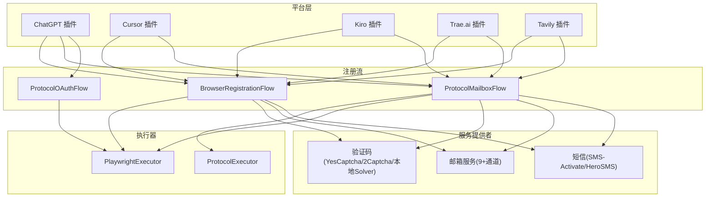
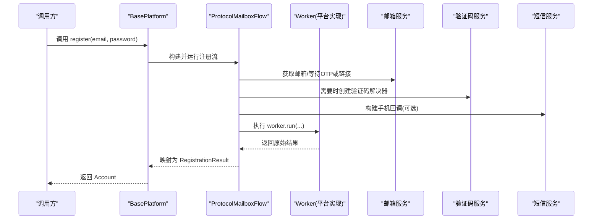
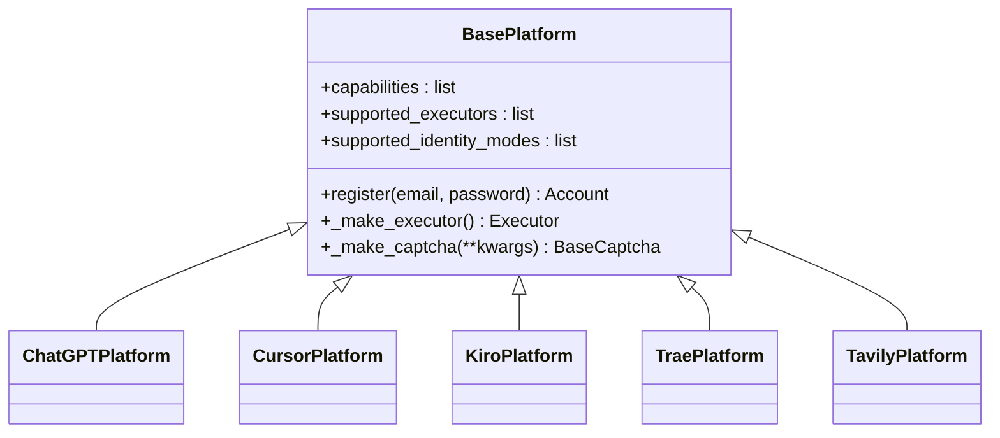
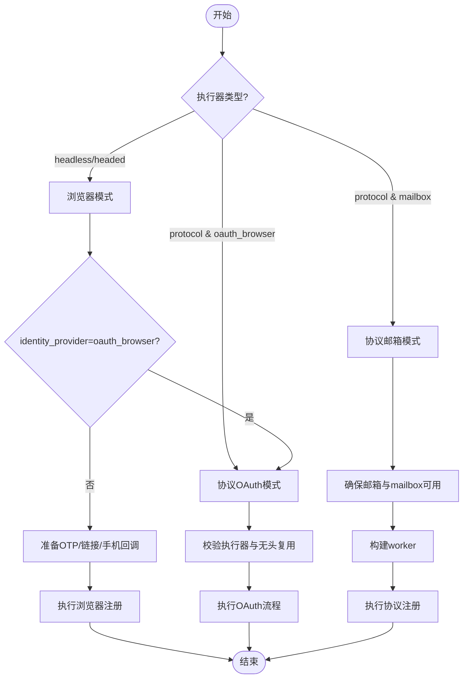
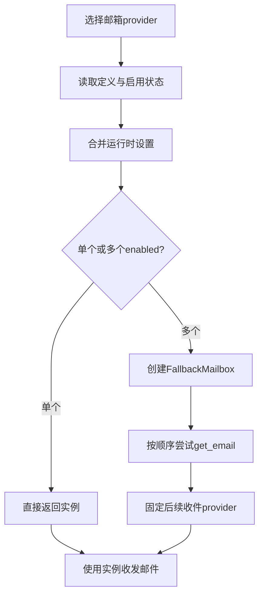
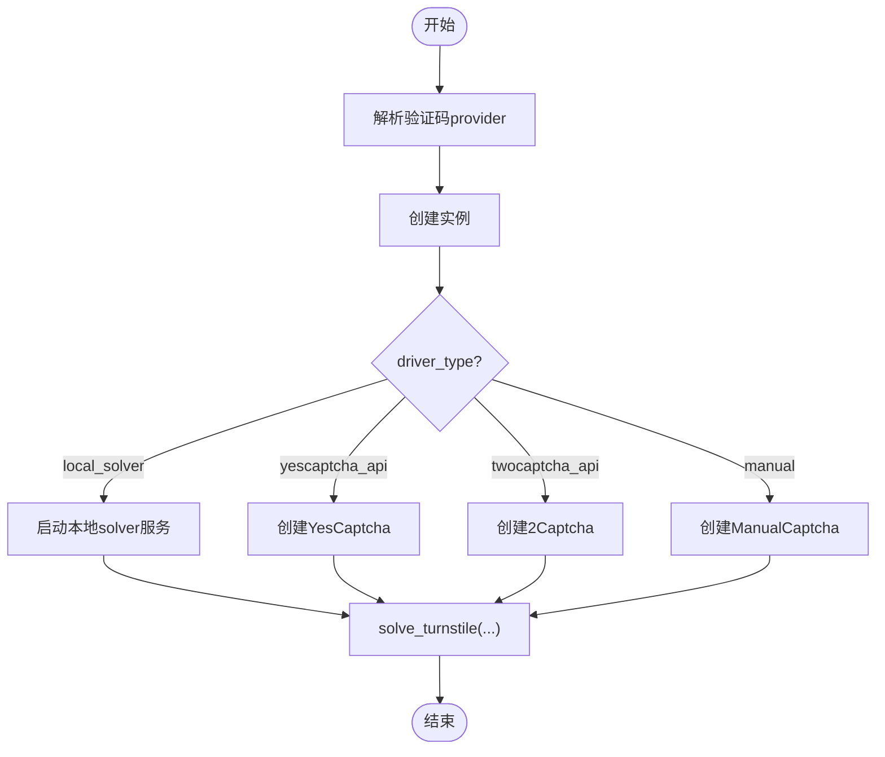
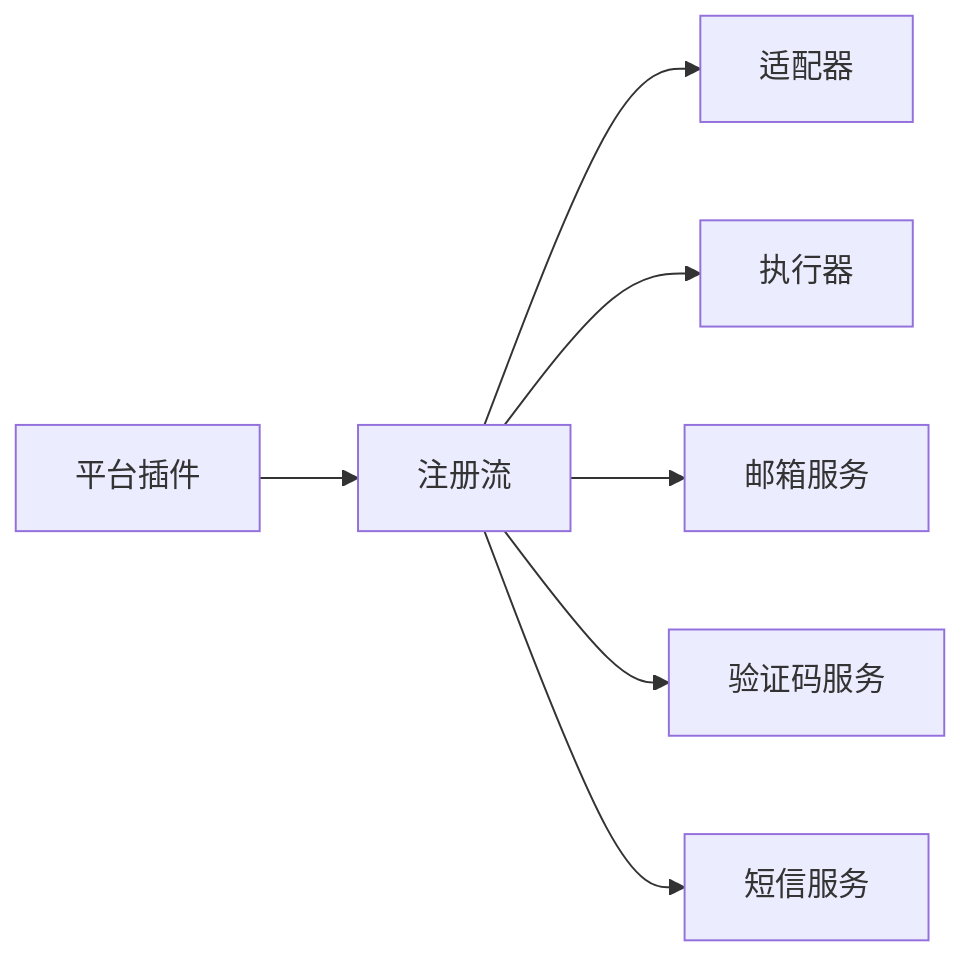

# 注册流程能力

<cite>
**本文引用的文件**
- [core/base_platform.py](file://core/base_platform.py)
- [core/registration/flows.py](file://core/registration/flows.py)
- [core/registration/adapters.py](file://core/registration/adapters.py)
- [core/base_executor.py](file://core/base_executor.py)
- [providers/registry.py](file://providers/registry.py)
- [core/base_captcha.py](file://core/base_captcha.py)
- [core/base_mailbox.py](file://core/base_mailbox.py)
- [platforms/chatgpt/plugin.py](file://platforms/chatgpt/plugin.py)
- [platforms/cursor/plugin.py](file://platforms/cursor/plugin.py)
- [platforms/kiro/plugin.py](file://platforms/kiro/plugin.py)
- [platforms/trae/plugin.py](file://platforms/trae/plugin.py)
- [platforms/tavily/plugin.py](file://platforms/tavily/plugin.py)
</cite>

## 目录
1. [简介](#简介)
2. [项目结构](#项目结构)
3. [核心组件](#核心组件)
4. [架构总览](#架构总览)
5. [详细组件分析](#详细组件分析)
6. [依赖关系分析](#依赖关系分析)
7. [性能考虑](#性能考虑)
8. [故障排查指南](#故障排查指南)
9. [结论](#结论)
10. [附录：配置与最佳实践](#附录配置与最佳实践)

## 简介
本文件系统性梳理 Any Auto Register 的“注册流程能力”，覆盖多平台注册（ChatGPT、Cursor、Kiro、Trae.ai、Tavily、Grok、Blink、Cerebras、OpenBlockLabs、Windsurf 等 11+ 平台）、邮箱服务集成（MoeMail、Laoudo、Cloudflare Worker 自建、Testmail、DuckDuckGo Email、Freemail、DuckMail、TempMail.lol、Temp-Mail Web 等 9 种通道）、验证码处理（YesCaptcha、2Captcha、本地 Solver）、接码服务（SMS-Activate、HeroSMS）以及执行模式切换（协议模式、Headless、Headed）和本地 2FA。文档面向不同技术背景的读者，提供从高层到代码级的说明、流程图、架构图与最佳实践建议。

## 项目结构
系统采用“平台插件 + 注册流 + 执行器 + 服务提供者”的分层设计：
- 平台插件：每个平台实现 BasePlatform，声明支持的能力与执行器类型，并构建浏览器/协议/OAuth 适配器。
- 注册流：BrowserRegistrationFlow、ProtocolMailboxFlow、ProtocolOAuthFlow 统一编排注册过程，注入 OTP/链接回调、手机回调、验证码解决器等。
- 执行器：BaseExecutor 抽象 HTTP 请求层；具体由 protocol 或 Playwright 驱动 headless/headed 模式。
- 服务提供者：通过 providers/registry 自动发现与工厂创建 mailbox/captcha/sms/proxy 等能力。

图表来源
- [core/base_platform.py:44-160](file://core/base_platform.py#L44-L160)
- [core/registration/flows.py:18-142](file://core/registration/flows.py#L18-L142)
- [core/base_executor.py:19-49](file://core/base_executor.py#L19-L49)
- [providers/registry.py:28-91](file://providers/registry.py#L28-L91)

章节来源
- [core/base_platform.py:44-160](file://core/base_platform.py#L44-L160)
- [core/registration/flows.py:18-142](file://core/registration/flows.py#L18-L142)
- [core/base_executor.py:19-49](file://core/base_executor.py#L19-L49)
- [providers/registry.py:28-91](file://providers/registry.py#L28-L91)

## 核心组件
- BasePlatform：定义平台能力、执行器选择、身份解析、注册入口 register()，并桥接三种注册流。
- 注册适配器：BrowserRegistrationAdapter、ProtocolMailboxAdapter、ProtocolOAuthAdapter 描述各流的输入输出与能力约束。
- 注册流：
  - BrowserRegistrationFlow：浏览器自动化注册，支持 OTP/链接/手机回调、验证码、OAuth 复用浏览器会话。
  - ProtocolMailboxFlow：协议式注册，构造 worker 并执行注册，支持 OTP/链接回调、可选 executor。
  - ProtocolOAuthFlow：纯 OAuth 流程，校验执行器类型与无头模式限制。
- 执行器：BaseExecutor 抽象 get/post/cookies 操作；protocol 与 playwright 两种实现。
- 服务提供者：
  - 邮箱：create_mailbox 工厂 + FallbackMailbox 多 provider 回退。
  - 验证码：create_captcha_solver 根据 driver_type 实例化 YesCaptcha/2Captcha/LocalSolver。
  - 短信：通过 providers/registry 加载 sms 模块并创建实例。

章节来源
- [core/base_platform.py:44-160](file://core/base_platform.py#L44-L160)
- [core/registration/adapters.py:9-59](file://core/registration/adapters.py#L9-L59)
- [core/registration/flows.py:18-142](file://core/registration/flows.py#L18-L142)
- [core/base_executor.py:19-49](file://core/base_executor.py#L19-L49)
- [core/base_mailbox.py:289-348](file://core/base_mailbox.py#L289-L348)
- [core/base_captcha.py:67-98](file://core/base_captcha.py#L67-L98)
- [providers/registry.py:28-91](file://providers/registry.py#L28-L91)

## 架构总览
下图展示一次典型“协议邮箱注册”调用链：平台插件 -> BasePlatform.register -> ProtocolMailboxFlow -> 邮箱/验证码/短信服务。

图表来源
- [core/base_platform.py:124-160](file://core/base_platform.py#L124-L160)
- [core/registration/flows.py:81-121](file://core/registration/flows.py#L81-L121)
- [core/base_mailbox.py:289-348](file://core/base_mailbox.py#L289-L348)
- [core/base_captcha.py:67-98](file://core/base_captcha.py#L67-L98)

## 详细组件分析

### 平台注册能力与执行模式
- ChatGPT：支持 protocol/headless/headed，支持 identity_provider=mailbox 与 oauth_browser；可生成支付链接、刷新 token、查询状态、上传 CPA/TM。
- Cursor：支持 protocol/headless/headed，identity_modes=mailbox；支持桌面端切换、查询状态、生成试用链接。
- Kiro：基于 AWS Builder ID，支持 protocol/headless/headed；支持桌面端切换、刷新 token、查询状态。
- Trae.ai：支持 protocol/headless/headed；支持桌面端切换、用户信息查询、获取升级链接。
- Tavily：支持 protocol/headless/headed；支持 OTP/验证链接回调、API Key 获取；仅 headed 支持 oauth_browser。

图表来源
- [core/base_platform.py:44-160](file://core/base_platform.py#L44-L160)
- [platforms/chatgpt/plugin.py:48-225](file://platforms/chatgpt/plugin.py#L48-L225)
- [platforms/cursor/plugin.py:18-114](file://platforms/cursor/plugin.py#L18-L114)
- [platforms/kiro/plugin.py:27-130](file://platforms/kiro/plugin.py#L27-L130)
- [platforms/trae/plugin.py:9-89](file://platforms/trae/plugin.py#L9-L89)
- [platforms/tavily/plugin.py:9-106](file://platforms/tavily/plugin.py#L9-L106)

章节来源
- [platforms/chatgpt/plugin.py:48-225](file://platforms/chatgpt/plugin.py#L48-L225)
- [platforms/cursor/plugin.py:18-114](file://platforms/cursor/plugin.py#L18-L114)
- [platforms/kiro/plugin.py:27-130](file://platforms/kiro/plugin.py#L27-L130)
- [platforms/trae/plugin.py:9-89](file://platforms/trae/plugin.py#L9-L89)
- [platforms/tavily/plugin.py:9-106](file://platforms/tavily/plugin.py#L9-L106)

### 注册流程编排（浏览器/协议/OAuth）
- 浏览器模式：若 identity_provider=oauth_browser，则校验执行器类型与无头复用要求；否则准备 OTP/链接/手机回调，构建 browser_worker 并执行注册。
- 协议邮箱模式：校验邮箱与 mailbox 可用性，按需创建验证码解决器，构造 worker 并执行注册。
- 协议 OAuth 模式：校验执行器类型与无头复用要求，直接执行 OAuth 流程。

图表来源
- [core/base_platform.py:124-160](file://core/base_platform.py#L124-L160)
- [core/registration/flows.py:18-142](file://core/registration/flows.py#L18-L142)

章节来源
- [core/registration/flows.py:18-142](file://core/registration/flows.py#L18-L142)
- [core/base_platform.py:124-160](file://core/base_platform.py#L124-L160)

### 邮箱服务集成（9+通道）
支持的邮箱通道包括：
- MoeMail、Laoudo、Cloudflare Worker 自建、Testmail、DuckDuckGo Email、Freemail、DuckMail、TempMail.lol、Temp-Mail Web 等。
- create_mailbox 会根据 provider_key 查找定义与启用状态，合并运行时设置，按顺序尝试多个 enabled 的 mailbox provider，并通过 FallbackMailbox 固定后续收件使用的 provider。
- 各 provider 实现 get_email/wait_for_code/wait_for_link 等方法，部分支持代理与自定义 API 地址。

图表来源
- [core/base_mailbox.py:289-348](file://core/base_mailbox.py#L289-L348)
- [core/base_mailbox.py:51-118](file://core/base_mailbox.py#L51-L118)

章节来源
- [core/base_mailbox.py:289-348](file://core/base_mailbox.py#L289-L348)
- [core/base_mailbox.py:51-118](file://core/base_mailbox.py#L51-L118)

### 验证码处理方案
- 支持 YesCaptcha、2Captcha、本地 Solver（local_solver），以及手动模式 manual。
- create_captcha_solver 根据 driver_type 创建对应实例；若为 local_solver，会启动本地 solver 服务。
- BasePlatform 提供 solve_turnstile_with_fallback，按候选列表依次尝试，失败记录错误信息并抛出聚合异常。

图表来源
- [core/base_captcha.py:67-98](file://core/base_captcha.py#L67-L98)
- [core/base_platform.py:330-430](file://core/base_platform.py#L330-L430)

章节来源
- [core/base_captcha.py:67-98](file://core/base_captcha.py#L67-L98)
- [core/base_platform.py:330-430](file://core/base_platform.py#L330-L430)

### 接码服务（SMS-Activate、HeroSMS）
- 通过 providers/registry 自动扫描并导入 sms 模块，注册后以 create_provider("sms", driver_type, config) 创建实例。
- 平台在注册流程中通过 build_phone_callbacks 注入手机号回调，用于接收短信验证码。

章节来源
- [providers/registry.py:28-91](file://providers/registry.py#L28-L91)
- [core/registration/flows.py:67-68](file://core/registration/flows.py#L67-L68)

### 执行模式切换（协议模式、Headless、Headed）
- BasePlatform._make_executor 根据 config.executor_type 创建 ProtocolExecutor 或 PlaywrightExecutor（headless/headed）。
- 平台插件通过 supported_executors 声明支持的模式；注册入口依据 executor_type 选择相应注册流。

章节来源
- [core/base_platform.py:316-328](file://core/base_platform.py#L316-L328)
- [core/base_platform.py:124-160](file://core/base_platform.py#L124-L160)

### 本地 2FA 功能
- 平台在执行动作（如切换桌面应用、查询状态、生成链接）时，可能涉及本地 2FA 或桌面端交互；例如 ChatGPT/Cursor/Kiro/Trae 等平台提供 switch_desktop 能力，内部调用平台特定逻辑完成本地登录态切换或重启 IDE。
- 这些能力通过 BasePlatform.execute_action 与平台插件的 _execute_platform_action 协同实现。

章节来源
- [core/base_platform.py:192-233](file://core/base_platform.py#L192-L233)
- [platforms/chatgpt/plugin.py:256-335](file://platforms/chatgpt/plugin.py#L256-L335)
- [platforms/cursor/plugin.py:142-264](file://platforms/cursor/plugin.py#L142-L264)
- [platforms/kiro/plugin.py:161-319](file://platforms/kiro/plugin.py#L161-L319)
- [platforms/trae/plugin.py:102-153](file://platforms/trae/plugin.py#L102-L153)

## 依赖关系分析
- 平台插件依赖 BasePlatform 提供的注册入口与能力体系。
- 注册流依赖适配器与 helpers，负责组装 OTP/链接/手机回调与验证码。
- 执行器解耦 HTTP 与浏览器自动化，便于在不同模式下复用。
- 服务提供者通过 registry 自动发现，避免硬编码耦合。

图表来源
- [core/base_platform.py:44-160](file://core/base_platform.py#L44-L160)
- [core/registration/flows.py:18-142](file://core/registration/flows.py#L18-L142)
- [providers/registry.py:28-91](file://providers/registry.py#L28-L91)

章节来源
- [core/base_platform.py:44-160](file://core/base_platform.py#L44-L160)
- [core/registration/flows.py:18-142](file://core/registration/flows.py#L18-L142)
- [providers/registry.py:28-91](file://providers/registry.py#L28-L91)

## 性能考虑
- 邮箱回退：当主 provider 不可用时，FallbackMailbox 会尝试其他 enabled 的 mailbox，提高成功率但增加延迟；建议合理配置优先级与超时。
- 验证码重试：BasePlatform.solve_turnstile_with_fallback 支持多 provider 轮询，注意控制并发与超时，避免频繁请求导致限流。
- 浏览器模式：headless/headed 模式受限于浏览器启动与页面渲染开销；对于高并发场景，优先使用协议模式或复用浏览器会话（oauth_browser 无头需配置 chrome_user_data_dir 或 chrome_cdp_url）。
- 代理池：平台检查有效性时可结合代理池报告成功/失败，提升整体稳定性。

[本节为通用指导，不直接分析具体文件]

## 故障排查指南
- 未找到可用邮箱 provider：检查是否在设置页启用默认邮箱 provider，并确保至少一个 provider 初始化成功。
- 验证码 provider 未配置或未启用：确认 captcha provider 已启用且认证字段已配置；若使用 local_solver，需确保本地服务已启动。
- 无头 OAuth 需要浏览器复用：当 capability.oauth_headless_requires_browser_reuse 为真且 executor_type=headless 时，必须配置 chrome_user_data_dir 或 chrome_cdp_url。
- 平台不支持的执行器：若 executor_type 不在 supported_executors 内，将抛出异常；请调整执行器类型或平台配置。
- 短信回调失败：检查短信 provider 是否已加载并正确配置；必要时降低并发或更换 provider。

章节来源
- [core/base_mailbox.py:289-348](file://core/base_mailbox.py#L289-L348)
- [core/base_captcha.py:67-98](file://core/base_captcha.py#L67-L98)
- [core/base_platform.py:71-75](file://core/base_platform.py#L71-L75)
- [core/registration/flows.py:26-39](file://core/registration/flows.py#L26-L39)

## 结论
Any Auto Register 通过统一的注册流与服务提供者机制，实现了跨平台的稳定注册能力。平台插件只需关注自身业务逻辑，注册流程自动处理 OTP/链接/手机回调、验证码与执行器选择。配合灵活的邮箱通道与验证码方案，系统可在多种环境下高效完成账号注册与后续管理。

[本节为总结性内容，不直接分析具体文件]

## 附录：配置与最佳实践
- 执行器选择
  - 协议模式：适合批量注册与稳定接口，优先推荐。
  - Headless/Headed：适用于需要浏览器交互的平台；注意无头 OAuth 的浏览器复用配置。
- 邮箱通道
  - 建议配置多个 enabled 的 mailbox provider，并按成功率排序；对高延迟服务设置合理超时。
  - 自建 Cloudflare Worker 或 Temp-Mail Web 可用于私有化部署与可控环境。
- 验证码
  - 优先启用本地 Solver 以降低外部依赖；若外部服务不稳定，配置多 provider 轮询。
  - 对 Turnstile 验证码，使用 solve_turnstile_with_fallback 自动重试。
- 短信
  - 配置 SMS-Activate 或 HeroSMS 时，确保账户余额充足与地区匹配；必要时降级到其他 provider。
- 平台特定
  - ChatGPT：密码复杂度影响注册成功率；可使用内置强密码生成策略。
  - Cursor/Kiro/Trae：利用桌面端切换能力快速切换本地登录态；生成试用/支付链接时注意区域与套餐参数。
  - Tavily：仅 headed 支持 oauth_browser；API Key 获取需等待邮件或链接。

[本节为通用指导，不直接分析具体文件]