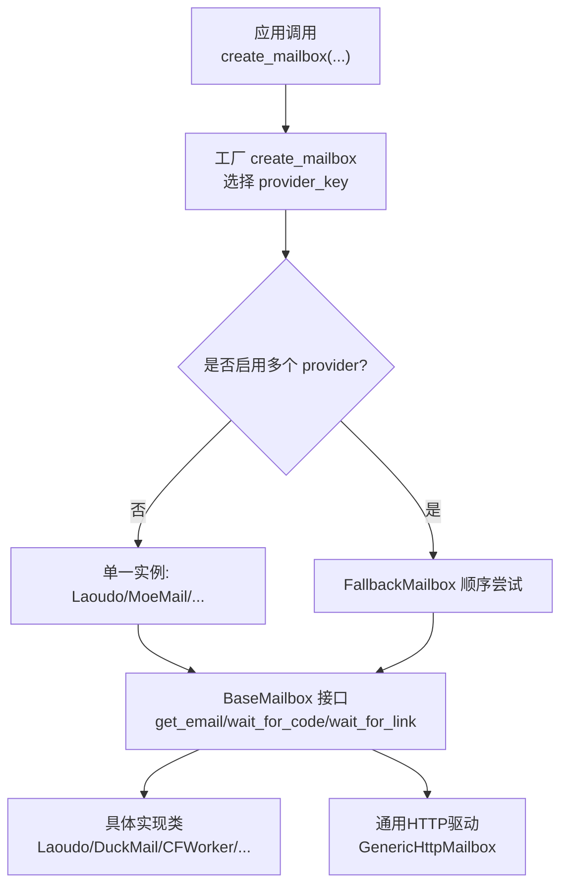
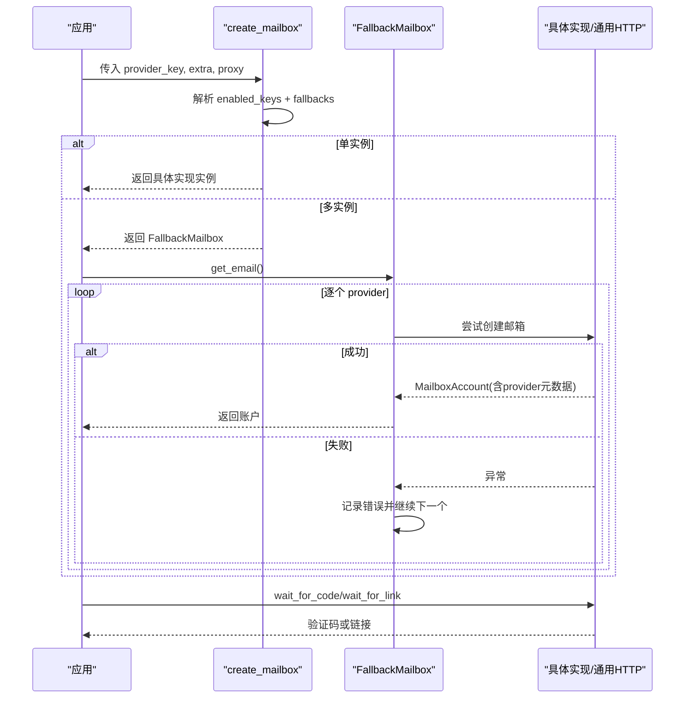
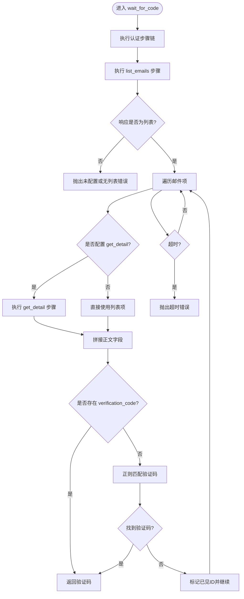
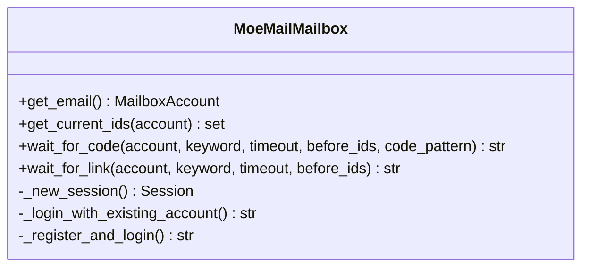
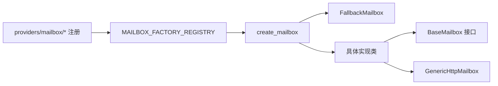

# 邮箱服务集成

<cite>
**本文引用的文件**
- [core/base_mailbox.py](file://core/base_mailbox.py)
- [core/generic_http_mailbox.py](file://core/generic_http_mailbox.py)
- [providers/mailbox/moemail.py](file://providers/mailbox/moemail.py)
- [providers/mailbox/laoudo.py](file://providers/mailbox/laoudo.py)
- [providers/mailbox/cfworker.py](file://providers/mailbox/cfworker.py)
- [providers/mailbox/testmail.py](file://providers/mailbox/testmail.py)
- [providers/mailbox/ddg_email.py](file://providers/mailbox/ddg_email.py)
- [providers/mailbox/freemail.py](file://providers/mailbox/freemail.py)
- [providers/mailbox/duckmail.py](file://providers/mailbox/duckmail.py)
- [providers/mailbox/tempmail_lol.py](file://providers/mailbox/tempmail_lol.py)
- [providers/mailbox/tempmail_web.py](file://providers/mailbox/tempmail_web.py)
</cite>

## 目录
1. [简介](#简介)
2. [项目结构](#项目结构)
3. [核心组件](#核心组件)
4. [架构总览](#架构总览)
5. [详细组件分析](#详细组件分析)
6. [依赖关系分析](#依赖关系分析)
7. [性能考量](#性能考量)
8. [故障排查指南](#故障排查指南)
9. [结论](#结论)
10. [附录](#附录)

## 简介
本文件为 Any Auto Register 的邮箱服务集成提供系统化文档，覆盖 9 种邮箱服务提供商：MoeMail、Laoudo、Cloudflare Worker 自建、Testmail、DuckDuckGo Email、Freemail、DuckMail、TempMail.lol、Temp-Mail Web。内容包含每种服务的配置方法、API 接口说明、使用场景与限制条件；并提供完整的配置示例、错误处理策略、性能调优建议；解释邮箱服务的选择逻辑、故障转移机制与负载均衡策略；最后给出常见问题诊断方法与解决方案，帮助用户根据实际需求选择合适的邮箱服务提供商。

## 项目结构
邮箱能力由统一抽象层 BaseMailbox 定义，具体实现位于 core/base_mailbox.py 中，并通过 providers/mailbox/* 下的轻量注册模块将各实现注册到统一驱动键（如 moemail_api、laoudo_api 等）。通用 HTTP 驱动 core/generic_http_mailbox.py 支持通过配置描述任意 HTTP 邮箱 API，无需代码即可接入新服务。

**图示来源**
- [core/base_mailbox.py:289-347](file://core/base_mailbox.py#L289-L347)
- [core/base_mailbox.py:51-118](file://core/base_mailbox.py#L51-L118)
- [core/generic_http_mailbox.py:75-161](file://core/generic_http_mailbox.py#L75-L161)

**章节来源**
- [core/base_mailbox.py:289-347](file://core/base_mailbox.py#L289-L347)
- [core/base_mailbox.py:51-118](file://core/base_mailbox.py#L51-L118)
- [core/generic_http_mailbox.py:75-161](file://core/generic_http_mailbox.py#L75-L161)

## 核心组件
- BaseMailbox：定义获取邮箱、等待验证码、等待验证链接、获取当前邮件 ID 集合的统一接口。
- FallbackMailbox：按顺序尝试多个 provider，创建邮箱成功后固定使用同一 provider 进行收件，实现故障转移。
- GenericHttpMailbox：数据驱动的通用 HTTP 邮箱驱动，通过 pipeline_config 和 settings 描述认证、创建邮箱、拉取列表、详情等步骤，零代码接入新邮箱 API。
- 各 Provider 实现：Laoudo、Aitre、TempMail.lol、Temp-Mail Web、DuckMail、CFWorker、MoeMail、Freemail、DDG Email 等。

关键职责与交互：
- create_mailbox(provider, extra, proxy) 负责读取定义与设置，组装 ordered_keys（首选 + 显式回退 + 已启用），构建实例列表，若多于一个则返回 FallbackMailbox。
- FallbackMailbox 在 get_email 失败时依次尝试下一个 provider，并记录错误信息；后续收件操作通过 _resolve_mailbox 绑定到创建时的 provider。
- GenericHttpMailbox 通过步骤执行引擎完成多步认证、动态创建邮箱、轮询列表、可选详情拉取、验证码/链接提取。

**章节来源**
- [core/base_mailbox.py:27-118](file://core/base_mailbox.py#L27-L118)
- [core/base_mailbox.py:289-347](file://core/base_mailbox.py#L289-L347)
- [core/generic_http_mailbox.py:75-161](file://core/generic_http_mailbox.py#L75-L161)

## 架构总览
下图展示从应用调用到具体邮箱实现的完整流程，包括选择逻辑、回退机制与通用 HTTP 驱动路径。

**图示来源**
- [core/base_mailbox.py:289-347](file://core/base_mailbox.py#L289-L347)
- [core/base_mailbox.py:51-118](file://core/base_mailbox.py#L51-L118)

## 详细组件分析

### 通用 HTTP 邮箱驱动（GenericHttpMailbox）
- 设计要点：
  - 通过 pipeline_config（来自 provider_definitions.metadata_json）与 settings（用户 UI 填写的 flat 字段）合并生成最终步骤管道。
  - 支持 email_mode=fixed/namespace_tag/generate；generate 模式可执行多步 create_email。
  - 自动注入认证：bearer/header/api_key_param，支持 cookie 提取与变量传递。
  - 列表拉取与详情拉取：list_emails 必需，get_detail 可选；支持 response_list_path/response_id_field/response_body_fields 等配置。
  - 验证码/链接提取：优先检查 verification_code 字段，其次正则匹配，链接提取使用统一函数。
- 典型配置项（以 key 名形式列出，便于对照 UI 或配置表）：
  - 基础：api_url、auth_type、auth_token、auth_header_name、user_agent
  - 列表：list_method、list_path、list_params、response_list_path、response_id_field、response_body_fields
  - 详情：detail_path
  - 创建：create_method、create_path、create_body、create_email_field
  - 其他：email_mode、namespace、tag_prefix
- 复杂度与性能：
  - 每次轮询调用 list_emails，必要时再调用 get_detail；合理设置 timeout、重试次数与 body_fields 可减少无效请求。
  - 使用 Session 复用连接，减少握手开销。

**图示来源**
- [core/generic_http_mailbox.py:338-411](file://core/generic_http_mailbox.py#L338-L411)
- [core/generic_http_mailbox.py:195-257](file://core/generic_http_mailbox.py#L195-L257)

**章节来源**
- [core/generic_http_mailbox.py:75-161](file://core/generic_http_mailbox.py#L75-L161)
- [core/generic_http_mailbox.py:195-257](file://core/generic_http_mailbox.py#L195-L257)
- [core/generic_http_mailbox.py:338-411](file://core/generic_http_mailbox.py#L338-L411)

### MoeMail（sall.cc）
- 配置项：
  - api_url、username、password、session_token、proxy
- API 接口：
  - 登录/注册：/api/auth/csrf、/api/auth/callback/credentials、/api/auth/register
  - 生成邮箱：/api/emails/generate
  - 拉取邮件：/api/emails/{account_id}
- 使用场景：
  - 需要高信誉域名以降低被目标平台拒绝的概率；支持复用账号或自动注册。
- 限制条件：
  - 依赖第三方服务可用性；需处理 CSRF、Session Cookie 等状态。
- 错误处理：
  - 注册/登录失败抛出运行时错误；生成邮箱失败会输出错误原因。
- 性能建议：
  - 复用 Session；优先选择高信誉域名；合理设置超时与重试。

**图示来源**
- [core/base_mailbox.py:1200-1488](file://core/base_mailbox.py#L1200-L1488)

**章节来源**
- [core/base_mailbox.py:1200-1488](file://core/base_mailbox.py#L1200-L1488)
- [providers/mailbox/moemail.py:1-6](file://providers/mailbox/moemail.py#L1-L6)

### Laoudo
- 配置项：
  - auth_token、email、account_id、api_url（默认 https://laoudo.com/api/email）
- API 接口：
  - 拉取邮件列表：/list（参数 accountId、size、timeSort 等）
- 使用场景：
  - 已有固定邮箱账号，直接轮询收件。
- 限制条件：
  - 依赖 Laoudo 服务稳定性；需携带 authorization 头。
- 错误处理：
  - 网络异常或 JSON 解析失败时返回空集合；等待超时抛出超时错误。
- 性能建议：
  - 控制 size 与 polling 间隔；使用 impersonate 模拟浏览器降低风控。

**章节来源**
- [core/base_mailbox.py:350-474](file://core/base_mailbox.py#L350-L474)
- [providers/mailbox/laoudo.py:1-6](file://providers/mailbox/laoudo.py#L1-L6)

### Cloudflare Worker 自建
- 配置项：
  - api_url、admin_token、domain、fingerprint、proxy
- API 接口：
  - 新建地址：/admin/new_address（可选 domain）
  - 拉取邮件：/admin/mails（address、limit、offset）
- 使用场景：
  - 自建临时邮箱服务，灵活控制域名与鉴权。
- 限制条件：
  - 需部署并维护 Worker；注意限流与配额。
- 错误处理：
  - 创建/拉取失败抛出异常；验证码提取支持多种格式（含特定 HTML 片段）。
- 性能建议：
  - 合理设置 limit/offset；避免频繁轮询。

**章节来源**
- [core/base_mailbox.py:1071-1197](file://core/base_mailbox.py#L1071-L1197)
- [providers/mailbox/cfworker.py:1-6](file://providers/mailbox/cfworker.py#L1-L6)

### Testmail
- 配置项：
  - api_url、api_key、namespace、tag_prefix、proxy
- API 接口：
  - 通过通用 HTTP 驱动或专用实现（取决于驱动键 testmail_api）
- 使用场景：
  - 基于 namespace/tag 的测试邮箱，适合自动化测试。
- 限制条件：
  - 依赖 Testmail 服务；需正确配置命名空间与标签前缀。
- 错误处理：
  - 通用驱动对未配置步骤抛出明确错误；等待超时抛出超时错误。
- 性能建议：
  - 使用 tag 过滤减少无关邮件；合理设置轮询间隔。

**章节来源**
- [core/base_mailbox.py:222-229](file://core/base_mailbox.py#L222-L229)
- [core/generic_http_mailbox.py:285-296](file://core/generic_http_mailbox.py#L285-L296)
- [providers/mailbox/testmail.py:1-6](file://providers/mailbox/testmail.py#L1-L6)

### DuckDuckGo Email Protection（DDG Email）
- 配置项：
  - bearer、imap_host、imap_user、imap_pass、proxy
- API 接口：
  - 通过 IMAP 协议访问（具体实现封装于 DDGEmailMailbox）
- 使用场景：
  - 利用 DDG 提供的保护邮箱进行注册验证。
- 限制条件：
  - 依赖 IMAP 服务可用性与凭据有效性。
- 错误处理：
  - 连接/查询失败捕获异常；等待超时抛出超时错误。
- 性能建议：
  - 合理设置 IMAP 超时；避免高频轮询。

**章节来源**
- [core/base_mailbox.py:182-189](file://core/base_mailbox.py#L182-L189)
- [providers/mailbox/ddg_email.py:1-6](file://providers/mailbox/ddg_email.py#L1-L6)

### Freemail（自建）
- 配置项：
  - api_url、admin_token、username、password、proxy
- API 接口：
  - 登录：/api/login（用户名密码模式）
  - 生成邮箱：/api/generate
  - 拉取邮件：/api/emails?mailbox=...&limit=...
- 使用场景：
  - 自建临时邮箱服务，支持管理员令牌或账号密码两种认证。
- 限制条件：
  - 需部署并维护服务；注意配额与并发限制。
- 错误处理：
  - 登录/生成/拉取失败抛出异常；验证码优先读取 verification_code 字段。
- 性能建议：
  - 复用 Session；限制 limit；合理轮询间隔。

**章节来源**
- [core/base_mailbox.py:1490-1599](file://core/base_mailbox.py#L1490-L1599)
- [providers/mailbox/freemail.py:1-6](file://providers/mailbox/freemail.py#L1-L6)

### DuckMail
- 配置项：
  - api_url、provider_url、bearer、proxy
- API 接口：
  - 创建账号：/api/mail?endpoint=%2Faccounts
  - 获取 token：/api/mail?endpoint=%2Ftoken
  - 拉取消息：/api/mail?endpoint=%2Fmessages%3Fpage%3D1
  - 消息详情：/api/mail?endpoint=%2Fmessages%2F{mid}
- 使用场景：
  - 自动生成随机邮箱账号，适合批量注册。
- 限制条件：
  - 依赖第三方 API；需携带 Bearer 与 provider base URL。
- 错误处理：
  - 网络/解析异常捕获；验证码正则匹配；链接提取使用统一函数。
- 性能建议：
  - 控制 page 大小；避免重复请求详情。

**章节来源**
- [core/base_mailbox.py:919-1068](file://core/base_mailbox.py#L919-L1068)
- [providers/mailbox/duckmail.py:1-6](file://providers/mailbox/duckmail.py#L1-L6)

### TempMail.lol
- 配置项：
  - api_url（默认 https://api.tempmail.lol/v2）、proxy
- API 接口：
  - 创建邮箱：POST /inbox/create
  - 拉取邮件：GET /inbox?token=...
- 使用场景：
  - 免费临时邮箱，无需注册，自动生成。
- 限制条件：
  - 公共服务可能不稳定或被限流。
- 错误处理：
  - 网络/JSON 异常捕获；等待超时抛出超时错误。
- 性能建议：
  - 合理设置 poll 间隔；使用代理提高成功率。

**章节来源**
- [core/base_mailbox.py:557-651](file://core/base_mailbox.py#L557-L651)
- [providers/mailbox/tempmail_lol.py:1-6](file://providers/mailbox/tempmail_lol.py#L1-L6)

### Temp-Mail Web
- 配置项：
  - base_url（默认 https://web2.temp-mail.org）、proxy
- API 接口：
  - 创建邮箱：POST /mailbox
  - 拉取消息：GET /messages（Bearer token）
- 使用场景：
  - 通过浏览器内联 fetch 调用，规避部分风控。
- 限制条件：
  - 依赖浏览器环境（Camoufox）；可能遇到 429 限流。
- 错误处理：
  - 429 自动重试并退避；非 JSON 响应抛出运行时错误；等待超时抛出超时错误。
- 性能建议：
  - 控制重试次数与退避时间；避免同时过多浏览器实例。

**章节来源**
- [core/base_mailbox.py:654-917](file://core/base_mailbox.py#L654-L917)
- [providers/mailbox/tempmail_web.py:1-6](file://providers/mailbox/tempmail_web.py#L1-L6)

## 依赖关系分析
- 工厂与注册：
  - create_mailbox 通过 MAILBOX_FACTORY_REGISTRY 将 driver_type 映射到具体构造器。
  - providers/mailbox/* 仅做注册，实际实现集中在 core/base_mailbox.py。
- 回退机制：
  - FallbackMailbox 在 get_email 失败时记录错误并尝试下一个 provider；后续收件通过 _resolve_mailbox 固定到创建时的 provider。
- 通用驱动：
  - GenericHttpMailbox 通过 pipeline_config/settings 解耦具体 API，降低新增服务的开发成本。

**图示来源**
- [core/base_mailbox.py:262-286](file://core/base_mailbox.py#L262-L286)
- [core/base_mailbox.py:289-347](file://core/base_mailbox.py#L289-L347)

**章节来源**
- [core/base_mailbox.py:262-286](file://core/base_mailbox.py#L262-L286)
- [core/base_mailbox.py:289-347](file://core/base_mailbox.py#L289-L347)

## 性能考量
- 轮询频率：
  - 各实现普遍采用 3-5 秒间隔轮询；可根据服务负载调整。
- 连接复用：
  - 使用 requests.Session 复用 TCP 连接与 Cookie；减少握手开销。
- 限流与重试：
  - Temp-Mail Web 对 429 实施指数退避与最大重试次数；其他服务建议在外部加重试策略。
- 资源隔离：
  - Temp-Mail Web 使用线程池与 Camoufox 浏览器实例，注意并发上限以避免内存/CPU 压力。
- 数据裁剪：
  - 通用驱动可通过 response_body_fields 仅拉取必要字段，减少传输与解析开销。

[本节为通用指导，不直接分析具体文件]

## 故障排查指南
- 常见错误类型：
  - 超时：等待验证码/链接超时，检查服务可用性、网络连通性、代理配置。
  - 认证失败：检查 admin_token、bearer、用户名密码、session-token 是否正确。
  - JSON 解析失败：检查 API 返回格式；通用驱动在非 JSON 时会抛出运行时错误。
  - 429 限流：降低轮询频率或增加退避时间。
- 定位方法：
  - 查看日志中的 provider 名称与错误信息；确认 ordered_keys 与 enabled_keys。
  - 对于通用驱动，检查 pipeline_config 与 settings 是否完整（list_emails、response_list_path 等）。
- 恢复策略：
  - 启用多个 provider 并使用 FallbackMailbox；当主 provider 失败时自动切换到备用。
  - 对关键步骤（如创建邮箱）增加重试与降级逻辑。

**章节来源**
- [core/base_mailbox.py:51-118](file://core/base_mailbox.py#L51-L118)
- [core/base_mailbox.py:289-347](file://core/base_mailbox.py#L289-L347)
- [core/generic_http_mailbox.py:338-411](file://core/generic_http_mailbox.py#L338-L411)

## 结论
Any Auto Register 的邮箱服务集成通过统一抽象、工厂选择与回退机制，提供了高可用的多提供商邮箱能力。通用 HTTP 驱动进一步降低了新服务的接入成本。建议在生产环境中：
- 配置多个 provider 并启用回退，提升鲁棒性。
- 根据目标平台特性选择合适的邮箱服务（如高信誉域名、自建服务等）。
- 合理设置轮询间隔、超时与重试，平衡成功率与资源消耗。
- 持续监控各 provider 的健康状况与错误率，及时切换或替换。

[本节为总结，不直接分析具体文件]

## 附录
- 配置示例（以 key 名形式列出，便于对照 UI 或配置表）：
  - MoeMail：api_url、username、password、session_token、proxy
  - Laoudo：auth_token、email、account_id、api_url
  - Cloudflare Worker：api_url、admin_token、domain、fingerprint、proxy
  - Testmail：api_url、api_key、namespace、tag_prefix、proxy
  - DDG Email：bearer、imap_host、imap_user、imap_pass、proxy
  - Freemail：api_url、admin_token、username、password、proxy
  - DuckMail：api_url、provider_url、bearer、proxy
  - TempMail.lol：api_url、proxy
  - Temp-Mail Web：base_url、proxy
  - 通用 HTTP：api_url、auth_type、auth_token、auth_header_name、user_agent、list_method、list_path、list_params、response_list_path、response_id_field、response_body_fields、detail_path、create_method、create_path、create_body、create_email_field、email_mode、namespace、tag_prefix
- 选择建议：
  - 高成功率：优先选择高信誉域名的 MoeMail 或自建服务（Freemail/CFWorker）。
  - 快速接入：使用通用 HTTP 驱动对接自有或第三方 API。
  - 测试场景：Testmail 或 TempMail.lol。
  - 隐私保护：DDG Email。

[本节为补充信息，不直接分析具体文件]