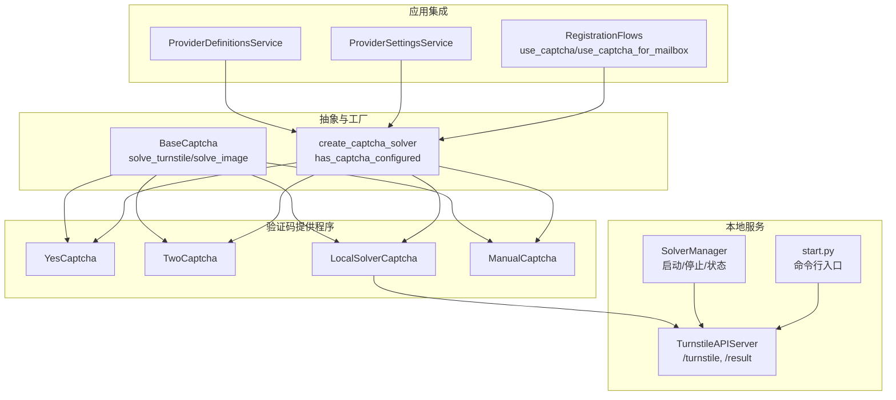
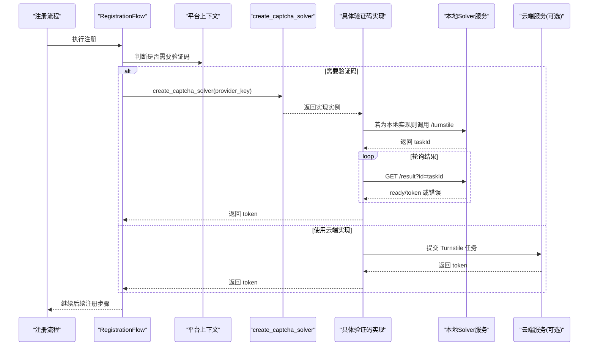
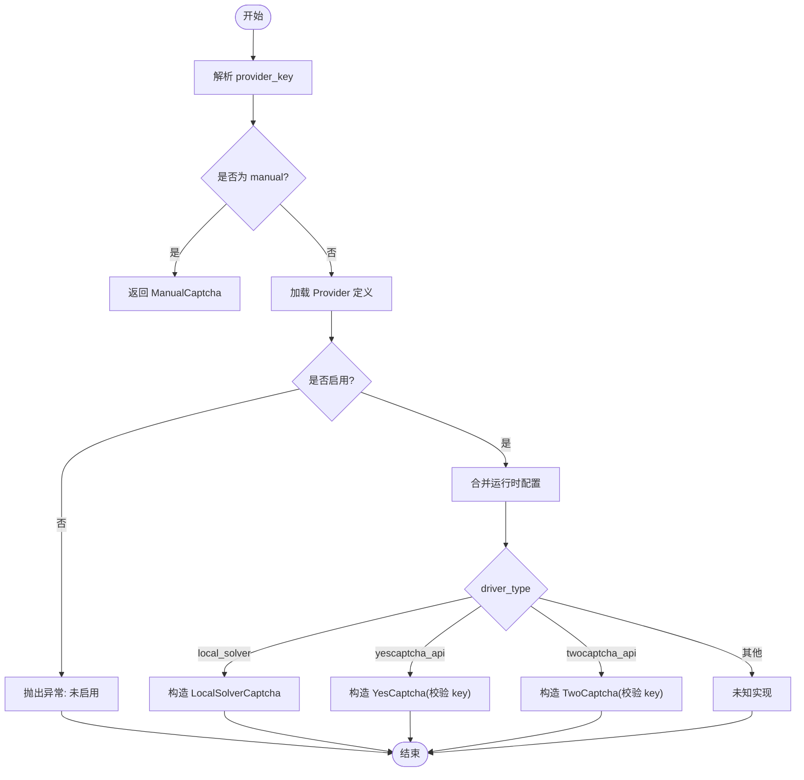
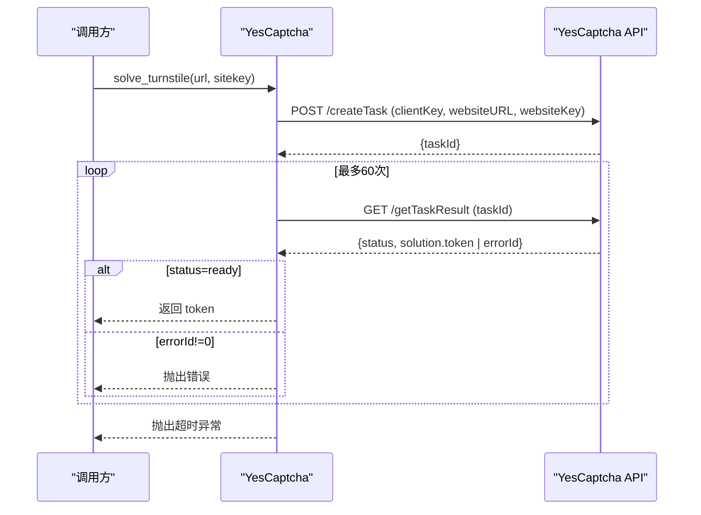
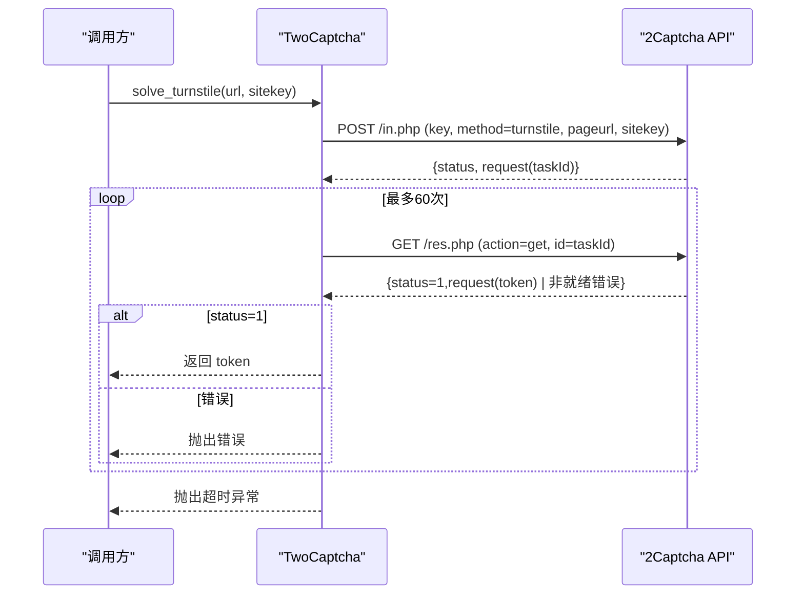
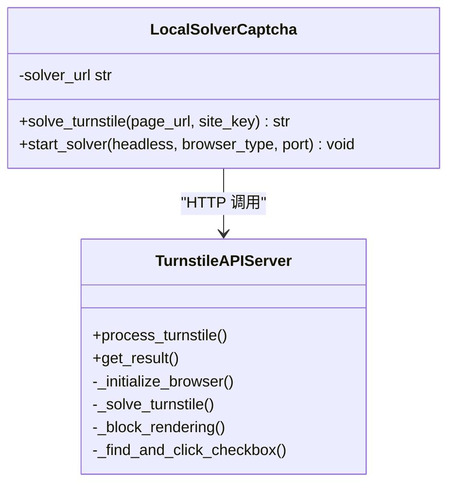
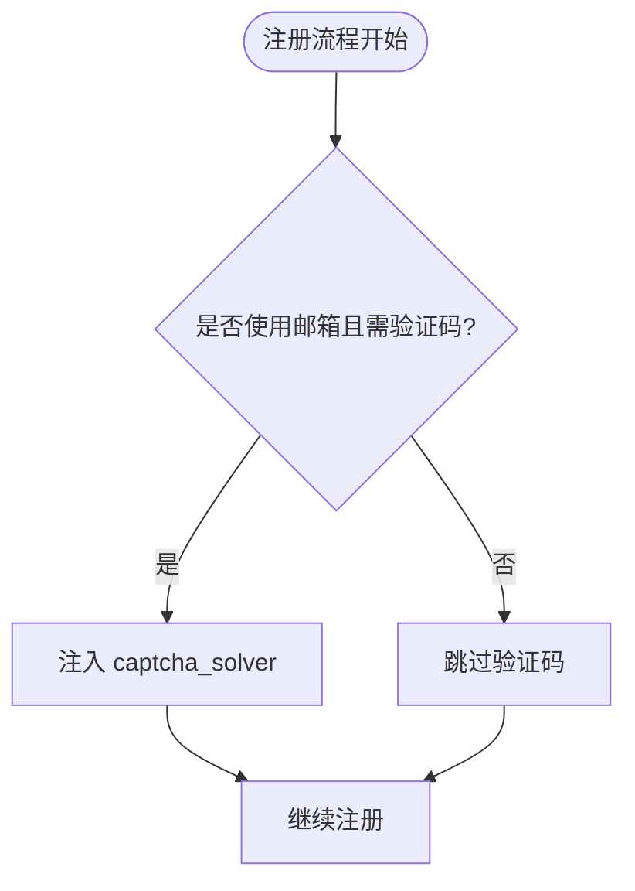
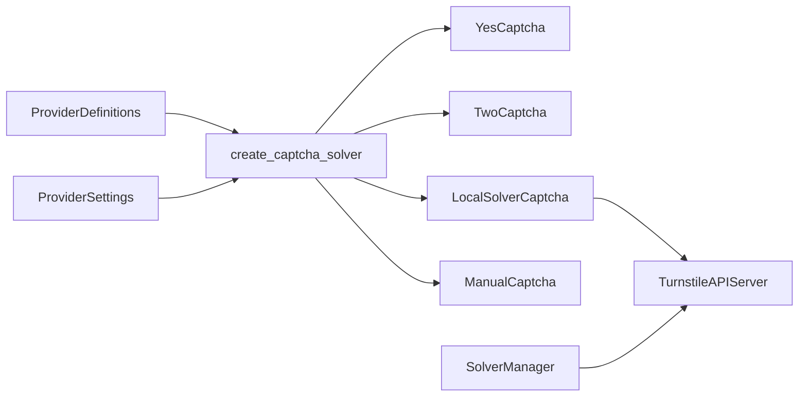

# 验证码处理

<cite>
**本文引用的文件**
- [core/base_captcha.py](file://core/base_captcha.py)
- [providers/captcha/yescaptcha.py](file://providers/captcha/yescaptcha.py)
- [providers/captcha/twocaptcha.py](file://providers/captcha/twocaptcha.py)
- [providers/captcha/local_solver.py](file://providers/captcha/local_solver.py)
- [providers/captcha/manual.py](file://providers/captcha/manual.py)
- [services/turnstile_solver/api_solver.py](file://services/turnstile_solver/api_solver.py)
- [services/turnstile_solver/start.py](file://services/turnstile_solver/start.py)
- [services/solver_manager.py](file://services/solver_manager.py)
- [application/provider_definitions.py](file://application/provider_definitions.py)
- [application/provider_settings.py](file://application/provider_settings.py)
- [core/registration/adapters.py](file://core/registration/adapters.py)
- [core/registration/flows.py](file://core/registration/flows.py)
</cite>

## 目录
1. [简介](#简介)
2. [项目结构](#项目结构)
3. [核心组件](#核心组件)
4. [架构总览](#架构总览)
5. [详细组件分析](#详细组件分析)
6. [依赖关系分析](#依赖关系分析)
7. [性能与成本优化](#性能与成本优化)
8. [故障排查指南](#故障排查指南)
9. [结论](#结论)
10. [附录：配置与最佳实践](#附录配置与最佳实践)

## 简介
本章节面向 Any Auto Register 的验证码处理子系统，系统性说明系统支持的多种验证码解决方案（YesCaptcha、2Captcha、本地 Solver、手动模式），覆盖配置方法、API 调用流程、成功率优化、成本控制策略、识别原理、图像预处理（如适用）、结果验证机制、错误重试策略与性能监控。重点包含对 Turnstile、reCAPTCHA 等主流验证码类型的处理方案与最佳实践，帮助用户构建稳定高效的验证码解决系统。

## 项目结构
验证码能力以“抽象基类 + 多实现”的方式组织：
- 抽象层：定义统一的 solve_turnstile / solve_image 接口与创建器逻辑
- 提供程序层：YesCaptcha、2Captcha、LocalSolver、Manual 四种具体实现
- 服务层：本地 Turnstile Solver 服务（基于 Quart + Camoufox/Patchright）及进程管理器
- 应用层：Provider 定义与设置管理、注册流程中按需注入验证码求解器

图表来源
- [core/base_captcha.py:5-98](file://core/base_captcha.py#L5-L98)
- [providers/captcha/yescaptcha.py:7-43](file://providers/captcha/yescaptcha.py#L7-L43)
- [providers/captcha/twocaptcha.py:6-64](file://providers/captcha/twocaptcha.py#L6-L64)
- [providers/captcha/local_solver.py:6-80](file://providers/captcha/local_solver.py#L6-L80)
- [providers/captcha/manual.py:6-19](file://providers/captcha/manual.py#L6-L19)
- [services/turnstile_solver/api_solver.py:62-140](file://services/turnstile_solver/api_solver.py#L62-L140)
- [services/turnstile_solver/start.py:15-28](file://services/turnstile_solver/start.py#L15-L28)
- [services/solver_manager.py:21-38](file://services/solver_manager.py#L21-L38)
- [application/provider_definitions.py:6-54](file://application/provider_definitions.py#L6-L54)
- [application/provider_settings.py:7-52](file://application/provider_settings.py#L7-L52)
- [core/registration/flows.py:18-121](file://core/registration/flows.py#L18-L121)

章节来源
- [core/base_captcha.py:5-98](file://core/base_captcha.py#L5-L98)
- [application/provider_definitions.py:6-54](file://application/provider_definitions.py#L6-L54)
- [application/provider_settings.py:7-52](file://application/provider_settings.py#L7-L52)

## 核心组件
- BaseCaptcha 抽象接口：统一 expose solve_turnstile(page_url, site_key) -> token 与 solve_image(image_b64) -> text
- 工厂与配置校验：create_captcha_solver(provider_key, extra) 根据驱动类型实例化具体实现；has_captcha_configured 检查是否已配置必要凭据
- 四种实现：
  - YesCaptcha：云端 Turnstile 任务提交与轮询
  - TwoCaptcha：云端 Turnstile 任务提交与轮询
  - LocalSolverCaptcha：调用本地 solver 服务（Camoufox/Patchright）完成 Turnstile
  - ManualCaptcha：阻塞等待人工输入 token
- 本地 Solver 服务：Quart 暴露 /turnstile 与 /result 接口，内部维护浏览器池、反检测脚本、资源过滤、代理支持、结果持久化与清理
- Solver 进程管理：自动拉起本地 solver 子进程、健康检查、失败计数与重启保护
- 应用集成：通过 ProviderDefinitions/Settings 管理可用 provider 与运行时配置；注册流程在需要时注入 captcha_solver

章节来源
- [core/base_captcha.py:5-98](file://core/base_captcha.py#L5-L98)
- [providers/captcha/yescaptcha.py:7-43](file://providers/captcha/yescaptcha.py#L7-L43)
- [providers/captcha/twocaptcha.py:6-64](file://providers/captcha/twocaptcha.py#L6-L64)
- [providers/captcha/local_solver.py:6-80](file://providers/captcha/local_solver.py#L6-L80)
- [providers/captcha/manual.py:6-19](file://providers/captcha/manual.py#L6-L19)
- [services/turnstile_solver/api_solver.py:62-140](file://services/turnstile_solver/api_solver.py#L62-L140)
- [services/solver_manager.py:21-38](file://services/solver_manager.py#L21-L38)
- [core/registration/flows.py:41-121](file://core/registration/flows.py#L41-L121)

## 架构总览
下图展示从注册流程到验证码解决的端到端调用链：

图表来源
- [core/registration/flows.py:41-121](file://core/registration/flows.py#L41-L121)
- [core/base_captcha.py:67-98](file://core/base_captcha.py#L67-L98)
- [providers/captcha/local_solver.py:17-49](file://providers/captcha/local_solver.py#L17-L49)
- [providers/captcha/yescaptcha.py:20-39](file://providers/captcha/yescaptcha.py#L20-L39)
- [providers/captcha/twocaptcha.py:19-60](file://providers/captcha/twocaptcha.py#L19-L60)
- [services/turnstile_solver/api_solver.py:135-140](file://services/turnstile_solver/api_solver.py#L135-L140)

## 详细组件分析

### 抽象与工厂：BaseCaptcha 与 create_captcha_solver
- 抽象接口：
  - solve_turnstile(page_url, site_key) -> str：返回 Turnstile token
  - solve_image(image_b64) -> str：返回图片验证码文字（多数实现未实现）
- 工厂逻辑：
  - 解析 provider_key，按 driver_type 选择实现：local_solver、yescaptcha_api、twocaptcha_api、manual
  - 校验必需字段（如 API Key），缺失则抛出运行时异常
  - 支持 has_captcha_configured 快速判定某 provider 是否具备运行所需认证信息

图表来源
- [core/base_captcha.py:67-98](file://core/base_captcha.py#L67-L98)

章节来源
- [core/base_captcha.py:5-98](file://core/base_captcha.py#L5-L98)

### YesCaptcha 实现
- 职责：向 YesCaptcha 云端提交 TurnstileTaskProxyless 任务并轮询获取 token
- 关键流程：
  - POST /createTask 提交任务，获取 taskId
  - 循环 GET /getTaskResult，直到 status=ready 或出现错误
  - 超时保护：固定次数轮询后抛出超时异常
- 限制：solve_image 未实现

图表来源
- [providers/captcha/yescaptcha.py:20-43](file://providers/captcha/yescaptcha.py#L20-L43)

章节来源
- [providers/captcha/yescaptcha.py:7-43](file://providers/captcha/yescaptcha.py#L7-L43)

### 2Captcha 实现
- 职责：向 2Captcha 云端提交 turnstile 任务并轮询获取 token
- 关键流程：
  - POST /in.php method=turnstile，获取 request(taskId)
  - 循环 GET /res.php action=get，直到 status=1 或遇到非就绪错误
  - 超时保护：固定次数轮询后抛出超时异常
- 限制：solve_image 未实现

图表来源
- [providers/captcha/twocaptcha.py:19-64](file://providers/captcha/twocaptcha.py#L19-L64)

章节来源
- [providers/captcha/twocaptcha.py:6-64](file://providers/captcha/twocaptcha.py#L6-L64)

### 本地 Solver：LocalSolverCaptcha 与服务端
- 客户端（LocalSolverCaptcha）：
  - GET /turnstile?url=&sitekey= 提交任务，获取 taskId
  - 循环 GET /result?id=taskId，直到 status=ready 且存在 token，或出现错误
  - 提供 start_solver 便捷方法，后台启动本地 solver 服务
- 服务端（TurnstileAPIServer）：
  - 路由：/turnstile、/result、/
  - 浏览器池：支持 Chromium/Chrome/Edge 与 Camoufox，可随机或指定 UA/Sec-CH-UA
  - 反检测：注入 anti-detect 脚本、屏蔽无关资源、最小化渲染开销
  - 代理支持：读取 proxies.txt，动态创建带认证的 context
  - 结果存储：数据库持久化，定时清理旧结果
  - 智能定位与点击：多种选择器尝试触发 Turnstile 交互

图表来源
- [providers/captcha/local_solver.py:6-80](file://providers/captcha/local_solver.py#L6-L80)
- [services/turnstile_solver/api_solver.py:62-140](file://services/turnstile_solver/api_solver.py#L62-L140)

章节来源
- [providers/captcha/local_solver.py:6-80](file://providers/captcha/local_solver.py#L6-L80)
- [services/turnstile_solver/api_solver.py:135-140](file://services/turnstile_solver/api_solver.py#L135-L140)

### 手动模式：ManualCaptcha
- 行为：阻塞等待用户输入 token 或图片验证码
- 用途：调试、兜底或特殊站点的人工介入

章节来源
- [providers/captcha/manual.py:6-19](file://providers/captcha/manual.py#L6-L19)

### 注册流程中的验证码注入
- 浏览器注册流程：当 use_captcha_for_mailbox 为真且身份提供者是 mailbox 时，注入 captcha_solver
- 协议邮箱注册流程：当 use_captcha 为真时，注入 captcha_solver
- 注入点位于 RegistrationArtifacts，供后续注册步骤使用

图表来源
- [core/registration/flows.py:41-121](file://core/registration/flows.py#L41-L121)
- [core/registration/adapters.py:28-50](file://core/registration/adapters.py#L28-L50)

章节来源
- [core/registration/flows.py:18-121](file://core/registration/flows.py#L18-L121)
- [core/registration/adapters.py:28-50](file://core/registration/adapters.py#L28-L50)

## 依赖关系分析
- 抽象与实现解耦：BaseCaptcha 定义契约，具体实现通过 register_provider 注册驱动类型
- 工厂集中装配：create_captcha_solver 依据驱动类型与运行时配置组装实例
- 本地服务独立进程：SolverManager 负责生命周期管理，避免与主进程耦合
- 应用层配置驱动：ProviderDefinitions/Settings 提供可视化配置与默认策略

图表来源
- [application/provider_definitions.py:6-54](file://application/provider_definitions.py#L6-L54)
- [application/provider_settings.py:7-52](file://application/provider_settings.py#L7-L52)
- [core/base_captcha.py:67-98](file://core/base_captcha.py#L67-L98)
- [services/solver_manager.py:21-38](file://services/solver_manager.py#L21-L38)

章节来源
- [application/provider_definitions.py:6-54](file://application/provider_definitions.py#L6-L54)
- [application/provider_settings.py:7-52](file://application/provider_settings.py#L7-L52)
- [core/base_captcha.py:67-98](file://core/base_captcha.py#L67-L98)
- [services/solver_manager.py:21-38](file://services/solver_manager.py#L21-L38)

## 性能与成本优化
- 云端方案（YesCaptcha/2Captcha）
  - 轮询间隔与上限：当前实现采用固定间隔与最大轮询次数，建议结合业务 SLA 调整
  - 并发控制：在高并发场景下，合理限制并行任务数，避免被服务商限流
  - 成本优化：优先使用本地 Solver；仅在必要时切换到云端
- 本地方案（LocalSolver）
  - 浏览器池大小：thread_count 决定并发度，过大导致内存/CPU 压力
  - 资源过滤：已内置资源拦截与最小化渲染，减少带宽与 CPU 消耗
  - 反检测：UA/Sec-CH-UA 随机或固定策略，降低被风控概率
  - 代理：支持认证代理，提升稳定性与地域适配
  - 结果清理：定时清理旧结果，避免数据库膨胀
- 通用优化
  - 重试策略：对网络抖动与临时错误增加指数退避重试
  - 超时与熔断：对长时间无响应进行熔断，避免线程占用
  - 监控指标：记录各 provider 的成功率、平均耗时、错误分布

[本节为通用指导，不直接分析具体文件]

## 故障排查指南
- 本地 Solver 无法启动
  - 现象：连续多次启动失败，标记 stopped_retrying
  - 排查：检查 Camoufox 二进制是否可用、端口占用、stderr 输出
  - 参考：进程管理与健康检查逻辑
- 本地 Solver 返回 CAPTCHA_FAIL
  - 可能原因：页面未正确加载、Turnstile 元素未找到、点击策略失败
  - 排查：开启 debug 日志，观察选择器匹配与点击过程
- 云端服务错误
  - YesCaptcha/2Captcha 返回错误码或不可用：检查 API Key、网络连通性、请求参数
  - 超时：检查轮询次数与间隔，必要时提高上限
- 配置问题
  - 缺少必需字段（如 API Key）：create_captcha_solver 会抛出运行时异常
  - 未启用 provider：has_captcha_configured 返回 False

章节来源
- [services/solver_manager.py:21-38](file://services/solver_manager.py#L21-L38)
- [services/solver_manager.py:73-155](file://services/solver_manager.py#L73-L155)
- [providers/captcha/local_solver.py:17-49](file://providers/captcha/local_solver.py#L17-L49)
- [providers/captcha/yescaptcha.py:20-39](file://providers/captcha/yescaptcha.py#L20-L39)
- [providers/captcha/twocaptcha.py:19-60](file://providers/captcha/twocaptcha.py#L19-L60)
- [core/base_captcha.py:67-98](file://core/base_captcha.py#L67-L98)

## 结论
Any Auto Register 的验证码子系统通过抽象接口与多实现解耦，提供了云端与本地两种路径，兼顾稳定性与成本。本地 Solver 具备完善的反检测、资源优化与代理支持，适合大规模自动化；云端方案便于快速接入与弹性扩展。配合 Provider 配置与注册流程注入，可实现灵活、可控、可观测的验证码解决体系。

[本节为总结性内容，不直接分析具体文件]

## 附录：配置与最佳实践
- 配置项概览
  - Provider 定义：provider_type、provider_key、label、description、driver_type、enabled、default_auth_mode、metadata
  - Provider 设置：display_name、auth_mode、enabled、is_default、config、auth、metadata
  - 验证码策略：protocol_mode、protocol_order、browser_mode
- 推荐策略
  - 默认优先本地 Solver，失败再回退到云端
  - 高并发场景下限制并发与轮询频率，避免被限流
  - 定期清理本地结果与缓存，保持系统轻量
  - 对关键站点启用更严格的反检测与代理策略
- 监控与告警
  - 记录各 provider 的成功率、耗时、错误类型
  - 对连续失败超过阈值触发告警并暂停自动重试
  - 暴露健康检查接口，便于外部监控系统探测

章节来源
- [application/provider_definitions.py:6-54](file://application/provider_definitions.py#L6-L54)
- [application/provider_settings.py:7-52](file://application/provider_settings.py#L7-L52)