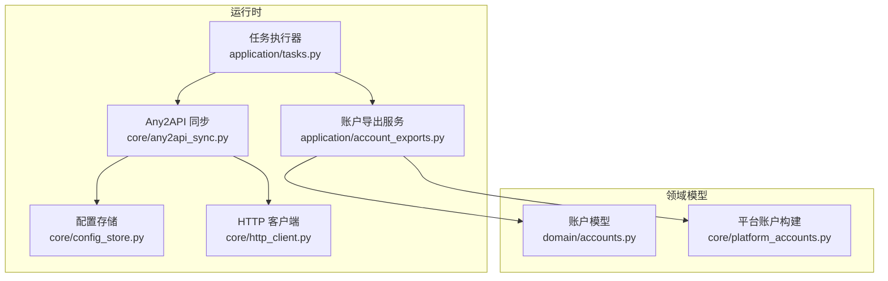
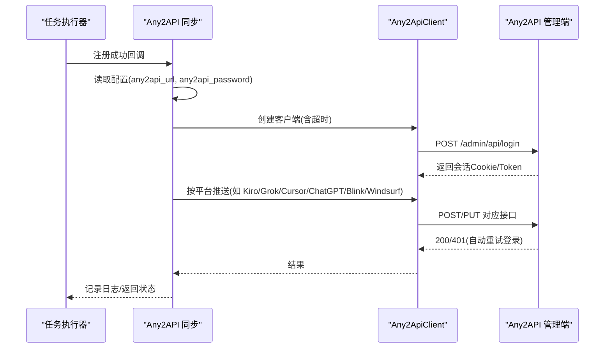
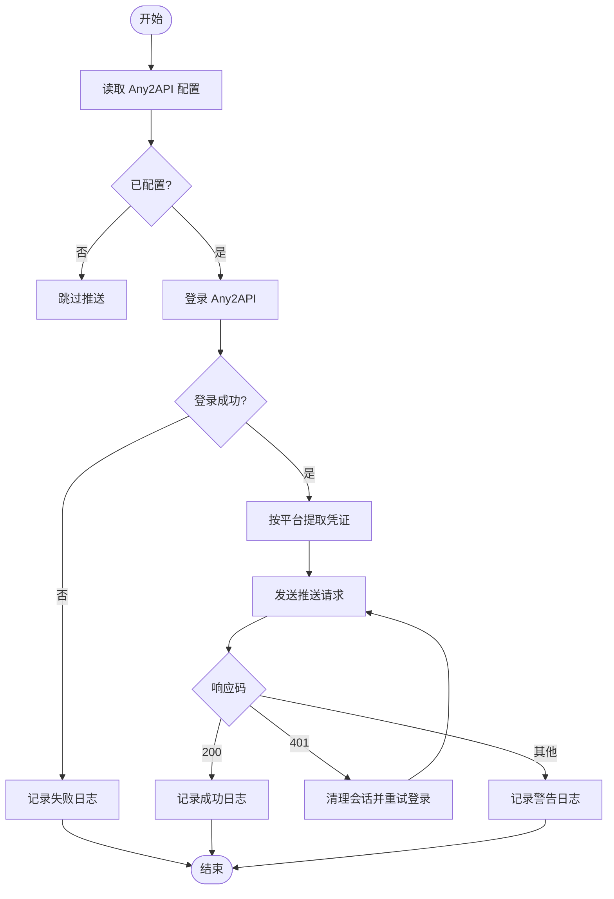
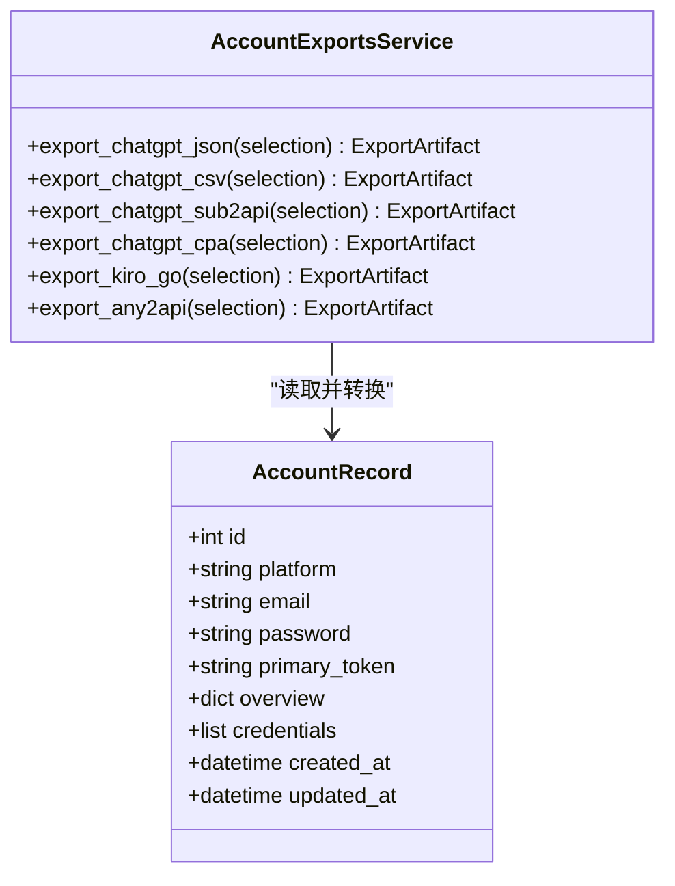
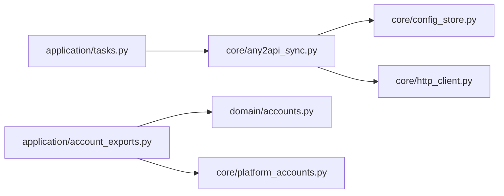

# Any2API联动

<cite>
**本文引用的文件**
- [core/any2api_sync.py](file://core/any2api_sync.py)
- [application/account_exports.py](file://application/account_exports.py)
- [core/config_store.py](file://core/config_store.py)
- [domain/accounts.py](file://domain/accounts.py)
- [core/platform_accounts.py](file://core/platform_accounts.py)
- [core/http_client.py](file://core/http_client.py)
- [tests/test_any2api_sync.py](file://tests/test_any2api_sync.py)
- [application/tasks.py](file://application/tasks.py)
</cite>

## 目录
1. [简介](#简介)
2. [项目结构](#项目结构)
3. [核心组件](#核心组件)
4. [架构总览](#架构总览)
5. [详细组件分析](#详细组件分析)
6. [依赖关系分析](#依赖关系分析)
7. [性能与可靠性](#性能与可靠性)
8. [故障排查指南](#故障排查指南)
9. [结论](#结论)
10. [附录：集成示例与最佳实践](#附录：集成示例与最佳实践)

## 简介
本技术文档聚焦于 Any Auto Register 的 Any2API 联动能力，涵盖注册完成后自动推送账号到 Any2API 网关的实现机制、数据格式转换与传输协议、错误处理与重试策略，以及多种导出格式（JSON、CSV、CPA、Sub2API、Kiro-Go、Any2API admin.json）的生成规则与字段映射。文档同时提供集成配置、网络超时、重试与日志记录的最佳实践，帮助开发者实现稳定可靠的账户数据同步。

## 项目结构
Any2API 联动涉及以下关键模块：
- 实时同步：注册成功后自动推送账号至 Any2API 管理接口
- 批量导出：将账户数据导出为多种外部系统兼容格式
- 配置存储：通过全局配置读取 Any2API 地址与管理密码
- HTTP 客户端：封装请求、代理、重试与超时等通用能力

图表来源
- [application/tasks.py:460-467](file://application/tasks.py#L460-L467)
- [core/any2api_sync.py:18-114](file://core/any2api_sync.py#L18-L114)
- [application/account_exports.py:330-506](file://application/account_exports.py#L330-L506)
- [core/config_store.py:13-49](file://core/config_store.py#L13-L49)
- [core/http_client.py:23-145](file://core/http_client.py#L23-L145)
- [domain/accounts.py:8-30](file://domain/accounts.py#L8-L30)
- [core/platform_accounts.py:73-112](file://core/platform_accounts.py#L73-L112)

章节来源
- [application/tasks.py:460-467](file://application/tasks.py#L460-L467)
- [core/any2api_sync.py:18-114](file://core/any2api_sync.py#L18-L114)
- [application/account_exports.py:330-506](file://application/account_exports.py#L330-L506)
- [core/config_store.py:13-49](file://core/config_store.py#L13-L49)
- [core/http_client.py:23-145](file://core/http_client.py#L23-L145)
- [domain/accounts.py:8-30](file://domain/accounts.py#L8-L30)
- [core/platform_accounts.py:73-112](file://core/platform_accounts.py#L73-L112)

## 核心组件
- Any2ApiClient：负责与 Any2API 管理端交互，包括登录、会话保持、POST/PUT 请求与 401 自动重试
- push_account_to_any2api()：根据平台类型提取账户信息并调用对应推送方法
- AccountExportsService：支持 JSON、CSV、CPA、Sub2API、Kiro-Go、Any2API admin.json 等多格式导出
- ConfigStore：持久化 key-value 配置，用于读取 any2api_url 与 any2api_password
- HTTPClient：通用 HTTP 客户端，提供代理、超时、重试与错误处理

章节来源
- [core/any2api_sync.py:18-114](file://core/any2api_sync.py#L18-L114)
- [core/any2api_sync.py:181-294](file://core/any2api_sync.py#L181-L294)
- [application/account_exports.py:330-506](file://application/account_exports.py#L330-L506)
- [core/config_store.py:13-49](file://core/config_store.py#L13-L49)
- [core/http_client.py:23-145](file://core/http_client.py#L23-L145)

## 架构总览
Any2API 联动包含两条主线：
- 实时同步：任务执行完成后触发 push_account_to_any2api()，按平台类型构造请求并发送至 Any2API 管理端
- 批量导出：通过 AccountExportsService 将账户数据转换为不同格式供外部系统使用

图表来源
- [application/tasks.py:460-467](file://application/tasks.py#L460-L467)
- [core/any2api_sync.py:27-114](file://core/any2api_sync.py#L27-L114)
- [core/any2api_sync.py:181-294](file://core/any2api_sync.py#L181-L294)

## 详细组件分析

### Any2API 实时同步
- 登录与会话管理：通过 /admin/api/login 获取会话 Cookie 或 Token；后续请求携带会话 Cookie
- 自动重试：遇到 401 时清空会话并重试登录，然后重新发起原请求
- 平台适配：针对不同平台（kiro、grok、cursor、chatgpt、blink、windsurf）提取相应凭证并调用对应推送接口
- 配置读取：从全局配置中读取 any2api_url 与 any2api_password；未配置时静默跳过
- 日志记录：统一使用 logger.warning/info 记录失败与成功信息

图表来源
- [core/any2api_sync.py:27-114](file://core/any2api_sync.py#L27-L114)
- [core/any2api_sync.py:181-294](file://core/any2api_sync.py#L181-L294)

章节来源
- [core/any2api_sync.py:27-114](file://core/any2api_sync.py#L27-L114)
- [core/any2api_sync.py:181-294](file://core/any2api_sync.py#L181-L294)
- [core/config_store.py:13-49](file://core/config_store.py#L13-L49)
- [application/tasks.py:460-467](file://application/tasks.py#L460-L467)

### 账户数据提取与验证
- 平台识别：account.platform 决定推送路径
- 凭证提取：优先从 account.extra 中提取特定键值，其次回退到 account.token 或其他字段
- 字段校验：若必要凭证为空则跳过推送并记录日志
- 多源兼容：例如 Windsurf 支持 api_key、apiKey、synthetic_api_key，以及 session_token 作为 apiKey 的替代

章节来源
- [core/any2api_sync.py:196-287](file://core/any2api_sync.py#L196-L287)
- [core/platform_accounts.py:73-112](file://core/platform_accounts.py#L73-L112)

### 数据格式转换与导出
- JSON：导出 ChatGPT 账户基础信息与令牌
- CSV：以表格形式输出账户关键字段
- CPA：生成 CPA 兼容 token JSON
- Sub2API：生成 Sub2API 兼容的 accounts 列表
- Kiro-Go：生成 Kiro-Go CLI Proxy 兼容 config.json
- Any2API admin.json：聚合多平台配置，便于一次性导入

图表来源
- [domain/accounts.py:8-30](file://domain/accounts.py#L8-L30)
- [application/account_exports.py:330-506](file://application/account_exports.py#L330-L506)

章节来源
- [application/account_exports.py:330-506](file://application/account_exports.py#L330-L506)
- [domain/accounts.py:8-30](file://domain/accounts.py#L8-L30)

### 传输协议与接口
- 认证：POST /admin/api/login，返回会话 Cookie 或 Token
- 推送接口：
  - Kiro：POST /admin/api/providers/kiro/accounts/create
  - Grok：POST /admin/api/providers/grok/tokens/create
  - Cursor：PUT /admin/api/providers/cursor/config
  - ChatGPT：PUT /admin/api/providers/chatgpt/config
  - Blink：PUT /admin/api/providers/blink/config
  - Windsurf：POST /admin/api/providers/windsurf/accounts/create
- 内容类型：application/json
- 会话：通过 Cookie newplatform2api_admin_session 维持

章节来源
- [core/any2api_sync.py:27-114](file://core/any2api_sync.py#L27-L114)
- [core/any2api_sync.py:116-167](file://core/any2api_sync.py#L116-L167)

## 依赖关系分析
- Any2API 同步依赖配置存储读取 any2api_url 与 any2api_password
- 任务执行器在注册成功后调用同步逻辑，并将日志写入任务日志
- 导出服务依赖领域模型与平台账户构建逻辑，确保字段一致性
- HTTP 客户端提供统一的超时、重试与代理能力（可用于扩展 Any2API 客户端）

图表来源
- [application/tasks.py:460-467](file://application/tasks.py#L460-L467)
- [core/any2api_sync.py:181-294](file://core/any2api_sync.py#L181-L294)
- [core/config_store.py:13-49](file://core/config_store.py#L13-L49)
- [application/account_exports.py:330-506](file://application/account_exports.py#L330-L506)
- [core/platform_accounts.py:73-112](file://core/platform_accounts.py#L73-L112)
- [core/http_client.py:23-145](file://core/http_client.py#L23-L145)

章节来源
- [application/tasks.py:460-467](file://application/tasks.py#L460-L467)
- [core/any2api_sync.py:181-294](file://core/any2api_sync.py#L181-L294)
- [core/config_store.py:13-49](file://core/config_store.py#L13-L49)
- [application/account_exports.py:330-506](file://application/account_exports.py#L330-L506)
- [core/platform_accounts.py:73-112](file://core/platform_accounts.py#L73-L112)
- [core/http_client.py:23-145](file://core/http_client.py#L23-L145)

## 性能与可靠性
- 超时控制：Any2API 客户端默认超时为 10 秒，可根据网络环境调整
- 会话失效处理：401 时自动清理会话并重试登录，提升稳定性
- 重试策略：HTTP 客户端支持指数退避重试（适用于通用 HTTP 场景），可结合业务需求扩展至 Any2API 客户端
- 日志记录：关键步骤均记录日志，便于问题定位与审计

章节来源
- [core/any2api_sync.py:21-114](file://core/any2api_sync.py#L21-L114)
- [core/http_client.py:23-145](file://core/http_client.py#L23-L145)

## 故障排查指南
- 登录失败：检查 any2api_url 与 any2api_password 是否正确；查看登录接口返回状态码与日志
- 推送失败：确认平台类型与凭证字段是否匹配；检查网络连通性与代理设置
- 会话过期：关注 401 响应，系统将自动重试登录；若仍失败，检查服务端会话策略
- 未配置：当 any2api_url 为空时，同步将被静默跳过；请检查配置存储

章节来源
- [core/any2api_sync.py:27-114](file://core/any2api_sync.py#L27-L114)
- [core/config_store.py:13-49](file://core/config_store.py#L13-L49)
- [tests/test_any2api_sync.py:8-79](file://tests/test_any2api_sync.py#L8-L79)

## 结论
Any2API 联动通过实时同步与批量导出两种方式，实现了账户数据的高效流转与多格式兼容。其设计注重健壮性（会话管理、重试）、可观测性（日志记录）与可扩展性（平台适配）。建议在生产环境中合理配置超时与重试策略，并持续监控日志以确保同步稳定性。

## 附录：集成示例与最佳实践
- API 密钥配置：在全局配置中设置 any2api_url 与 any2api_password；可通过配置存储进行动态更新
- 网络超时处理：根据网络质量调整客户端超时时间；必要时引入代理以提升连通性
- 重试机制：利用 HTTP 客户端的重试策略；对 Any2API 客户端也可按需扩展重试逻辑
- 日志记录：启用任务日志与模块日志，记录登录、推送、失败与重试事件
- 兼容性要求：确保目标 Any2API 版本支持对应接口；遵循字段命名与数据结构约定
- 最佳实践：
  - 在注册成功后立即触发同步，减少延迟
  - 对不支持的平台进行明确日志记录，避免静默失败
  - 定期导出备份，便于灾难恢复与审计

章节来源
- [core/any2api_sync.py:181-294](file://core/any2api_sync.py#L181-L294)
- [core/http_client.py:23-145](file://core/http_client.py#L23-L145)
- [application/account_exports.py:330-506](file://application/account_exports.py#L330-L506)
- [core/config_store.py:13-49](file://core/config_store.py#L13-L49)
- [tests/test_any2api_sync.py:8-79](file://tests/test_any2api_sync.py#L8-L79)