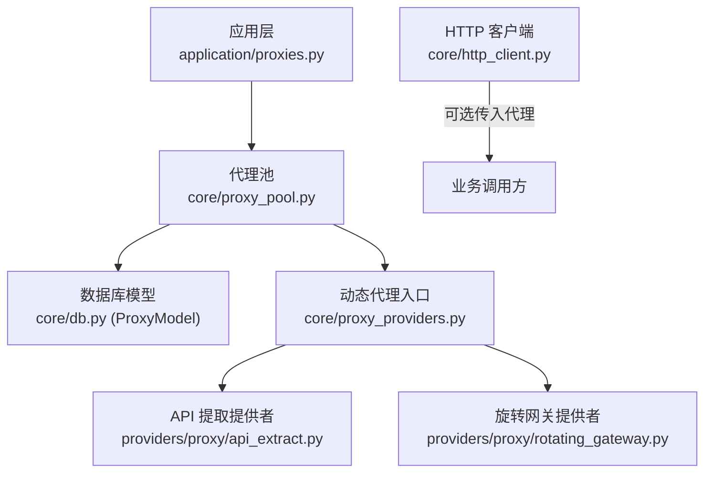
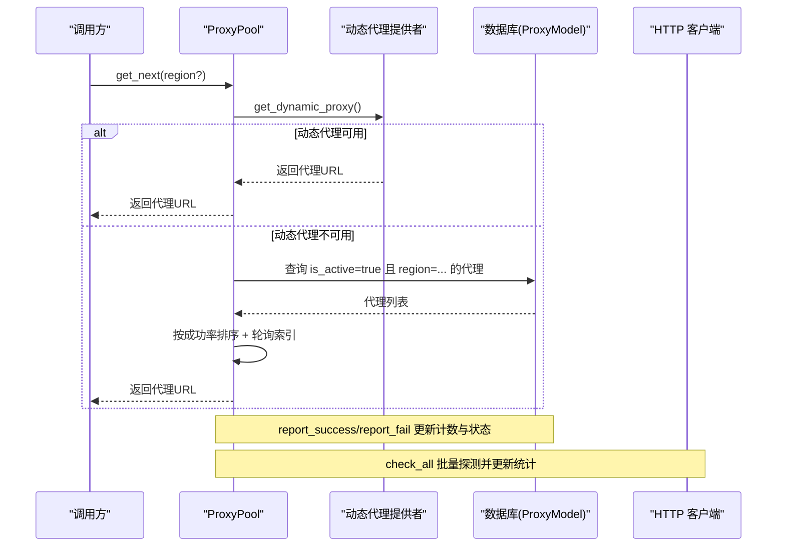
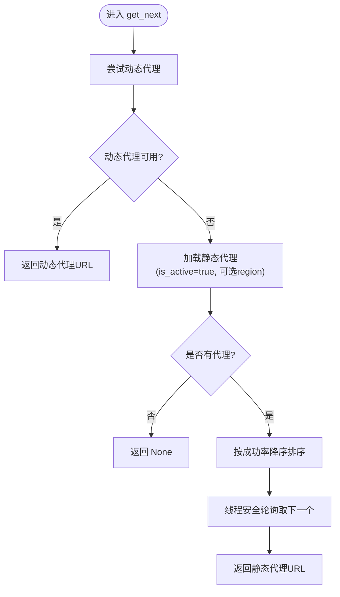
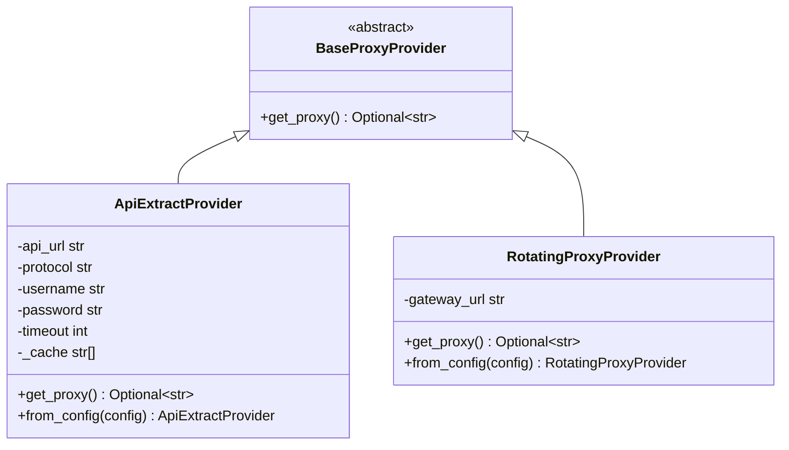
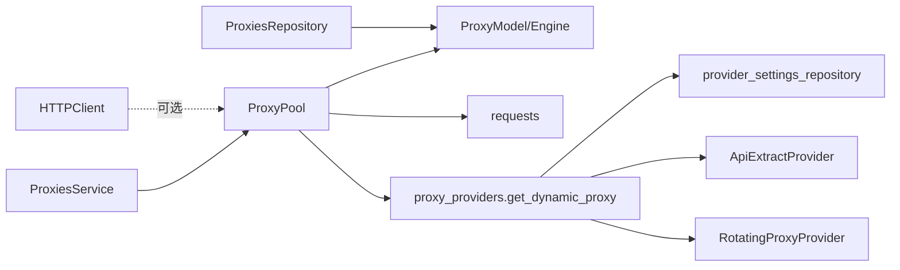

# 代理池管理

<cite>
**本文引用的文件**
- [core/proxy_pool.py](file://core/proxy_pool.py)
- [core/proxy_providers.py](file://core/proxy_providers.py)
- [providers/proxy/api_extract.py](file://providers/proxy/api_extract.py)
- [providers/proxy/rotating_gateway.py](file://providers/proxy/rotating_gateway.py)
- [domain/proxies.py](file://domain/proxies.py)
- [application/proxies.py](file://application/proxies.py)
- [core/http_client.py](file://core/http_client.py)
- [infrastructure/proxies_repository.py](file://infrastructure/proxies_repository.py)
</cite>

## 目录
1. [简介](#简介)
2. [项目结构](#项目结构)
3. [核心组件](#核心组件)
4. [架构总览](#架构总览)
5. [详细组件分析](#详细组件分析)
6. [依赖关系分析](#依赖关系分析)
7. [性能与优化](#性能与优化)
8. [故障排查指南](#故障排查指南)
9. [结论](#结论)
10. [附录：配置与使用模式](#附录：配置与使用模式)

## 简介
本技术文档围绕 Any Auto Register 的代理池管理系统，系统性阐述静态代理池与动态代理提供商的集成机制，包括代理轮询、区域选择、成功率统计与自动故障转移。重点解析 ProxyPool 类的核心能力：get_next() 的优先级处理逻辑、report_success()/report_fail() 的成功失败追踪、check_all() 的批量健康检查；并说明基于成功率的排序算法、连续失败自动禁用机制以及线程安全的并发访问控制。文末提供配置示例与使用模式，帮助开发者理解与扩展。

## 项目结构
代理池相关代码主要分布在以下模块：
- core/proxy_pool.py：代理池核心类，负责获取下一个代理、统计成功/失败、批量健康检查
- core/proxy_providers.py：动态代理提供者工厂与统一入口，支持多种第三方代理接入
- providers/proxy/*：具体动态代理实现（API 提取、旋转网关）
- domain/proxies.py：代理数据模型与命令对象
- application/proxies.py：代理服务，封装代理增删改查与触发检测
- infrastructure/proxies_repository.py：代理持久化仓储
- core/http_client.py：HTTP 客户端，支持代理、重试与错误处理

图表来源
- [core/proxy_pool.py:1-91](file://core/proxy_pool.py#L1-L91)
- [core/proxy_providers.py:1-103](file://core/proxy_providers.py#L1-L103)
- [providers/proxy/api_extract.py:1-106](file://providers/proxy/api_extract.py#L1-L106)
- [providers/proxy/rotating_gateway.py:1-31](file://providers/proxy/rotating_gateway.py#L1-L31)
- [core/http_client.py:1-228](file://core/http_client.py#L1-L228)

章节来源
- [core/proxy_pool.py:1-91](file://core/proxy_pool.py#L1-L91)
- [core/proxy_providers.py:1-103](file://core/proxy_providers.py#L1-L103)
- [application/proxies.py:1-49](file://application/proxies.py#L1-L49)
- [domain/proxies.py:1-35](file://domain/proxies.py#L1-L35)
- [infrastructure/proxies_repository.py:1-36](file://infrastructure/proxies_repository.py#L1-L36)
- [core/http_client.py:1-228](file://core/http_client.py#L1-L228)

## 核心组件
- ProxyPool：提供 get_next(region)、report_success(url)、report_fail(url)、check_all() 等能力，是代理分配与统计的核心。
- 动态代理提供者：通过 BaseProxyProvider 抽象与 create_proxy_provider 工厂，支持 api_extract 与 rotating_gateway 两种实现。
- 代理服务 ProxiesService：对外暴露代理列表、创建、删除、启用/禁用、触发健康检查等操作。
- HTTPClient：可接受代理 URL，用于发起带代理的网络请求，具备重试与超时策略。

章节来源
- [core/proxy_pool.py:9-91](file://core/proxy_pool.py#L9-L91)
- [core/proxy_providers.py:20-103](file://core/proxy_providers.py#L20-L103)
- [application/proxies.py:10-49](file://application/proxies.py#L10-L49)
- [core/http_client.py:39-228](file://core/http_client.py#L39-L228)

## 架构总览
系统采用“优先动态、回退静态”的策略：
- get_next() 首先尝试从已启用的动态代理 provider 获取代理；若不可用或异常，则回退到静态代理池。
- 静态代理池按 region 过滤，并按成功率降序排序后轮询选取。
- 每次成功/失败都会更新数据库中的 success_count/fail_count/last_checked，并在连续失败达到阈值时自动禁用该代理。
- check_all() 对全部代理进行连通性探测，成功则记录成功，失败则记录失败并可能禁用。

图表来源
- [core/proxy_pool.py:14-87](file://core/proxy_pool.py#L14-L87)
- [core/proxy_providers.py:77-103](file://core/proxy_providers.py#L77-L103)

## 详细组件分析

### ProxyPool 核心功能
- get_next(region)
  - 优先级：先尝试动态代理，失败再回退到静态代理池。
  - 静态池策略：仅选择 is_active=true 的代理，可按 region 过滤；按成功率（success_count / (success_count + fail_count)）降序排序；使用线程安全索引进行轮询。
- report_success(url)
  - 命中对应代理记录，success_count+1，更新 last_checked。
- report_fail(url)
  - 命中对应代理记录，fail_count+1，更新 last_checked；当满足“首次成功为0且连续失败次数≥5”时，自动将 is_active 置为 False，实现自动故障转移。
- check_all()
  - 遍历所有代理，向 httpbin.org/ip 发起请求；成功则记录成功，否则记录失败并可能禁用；返回 ok/fail 计数。

图表来源
- [core/proxy_pool.py:14-45](file://core/proxy_pool.py#L14-L45)

章节来源
- [core/proxy_pool.py:14-87](file://core/proxy_pool.py#L14-L87)

### 动态代理提供商集成
- BaseProxyProvider：定义统一的 get_proxy() 接口。
- ApiExtractProvider：从第三方 API 拉取代理列表，支持 JSON 或逐行文本格式，自动规范化协议与认证信息，内部缓存并逐个弹出。
- RotatingProxyProvider：固定网关地址，由服务商在出口侧自动轮换 IP，适合 BrightData/Oxylabs/IPRoyal 等。
- 工厂与发现：create_proxy_provider 根据 provider_key 构造具体实现；get_dynamic_proxy 读取已启用的 provider_settings，合并配置与认证，依次尝试直至获得可用代理。

图表来源
- [core/proxy_providers.py:20-74](file://core/proxy_providers.py#L20-L74)
- [providers/proxy/api_extract.py:16-106](file://providers/proxy/api_extract.py#L16-L106)
- [providers/proxy/rotating_gateway.py:10-31](file://providers/proxy/rotating_gateway.py#L10-L31)

章节来源
- [core/proxy_providers.py:20-103](file://core/proxy_providers.py#L20-L103)
- [providers/proxy/api_extract.py:1-106](file://providers/proxy/api_extract.py#L1-L106)
- [providers/proxy/rotating_gateway.py:1-31](file://providers/proxy/rotating_gateway.py#L1-L31)

### 代理服务与仓储
- ProxiesService：提供代理列表、创建、批量创建、删除、启用/禁用、触发健康检查（后台线程执行 proxy_pool.check_all）。
- ProxiesRepository：基于 SQLModel 对 ProxyModel 进行 CRUD，转换为领域对象 ProxyRecord。

章节来源
- [application/proxies.py:10-49](file://application/proxies.py#L10-L49)
- [infrastructure/proxies_repository.py:1-36](file://infrastructure/proxies_repository.py#L1-L36)
- [domain/proxies.py:8-35](file://domain/proxies.py#L8-L35)

### HTTP 客户端与代理使用
- HTTPClient 支持传入代理 URL，并以 curl_cffi Session 发送请求，具备重试、超时、SSL 校验等选项。
- 典型用法：上层业务在需要网络访问时，通过 HTTPClient 指定代理，或在任务执行前从 ProxyPool 获取代理注入到客户端。

章节来源
- [core/http_client.py:39-228](file://core/http_client.py#L39-L228)

## 依赖关系分析
- ProxyPool 依赖数据库模型 ProxyModel 与引擎 engine，并通过 requests 进行健康检查。
- 动态代理提供者通过 provider_settings 仓库读取已启用的配置，按需实例化具体 provider。
- 代理服务与仓储解耦，便于测试与替换。
- HTTPClient 与代理池无强耦合，可在需要时消费代理 URL。

图表来源
- [core/proxy_pool.py:1-91](file://core/proxy_pool.py#L1-L91)
- [core/proxy_providers.py:77-103](file://core/proxy_providers.py#L77-L103)
- [application/proxies.py:10-49](file://application/proxies.py#L10-L49)
- [infrastructure/proxies_repository.py:1-36](file://infrastructure/proxies_repository.py#L1-L36)

章节来源
- [core/proxy_pool.py:1-91](file://core/proxy_pool.py#L1-L91)
- [core/proxy_providers.py:1-103](file://core/proxy_providers.py#L1-L103)
- [application/proxies.py:1-49](file://application/proxies.py#L1-L49)
- [infrastructure/proxies_repository.py:1-36](file://infrastructure/proxies_repository.py#L1-L36)

## 性能与优化
- 成功率排序：静态池按 success_count/(success_count+fail_count) 降序排序，优先使用历史表现更好的代理，提升整体成功率。
- 轮询与锁：使用线程局部索引与 threading.Lock 保证并发安全，避免重复选取同一代理。
- 自动禁用：连续失败达到阈值（首次成功为0且失败次数≥5）自动禁用，减少无效流量。
- 动态代理缓存：ApiExtractProvider 缓存远程代理列表，降低频繁拉取开销。
- 建议优化方向：
  - 将 check_all() 改为异步并发探测，缩短全量检查耗时。
  - 引入滑动窗口成功率替代全局累计，更敏感地反映近期质量。
  - 为动态代理增加快速失败与熔断，避免长时间阻塞。
  - 为静态池增加最小存活时间或冷却期，防止抖动。

[本节为通用性能讨论，不直接分析具体文件]

## 故障排查指南
- 动态代理不可用
  - 现象：get_next() 始终回退到静态池。
  - 排查：检查 provider_settings 是否启用、API URL 是否正确、网络连通性。
  - 参考：动态代理获取流程与日志输出位置。
- 静态代理被自动禁用
  - 现象：某代理不再被选取。
  - 原因：连续失败达到阈值触发 is_active=False。
  - 处理：修复代理源或等待恢复后手动启用。
- 健康检查失败
  - 现象：check_all() 大量 fail。
  - 排查：目标站点可达性、代理认证、超时设置。
- HTTP 请求失败
  - 现象：业务请求报连接错误或超时。
  - 排查：HTTPClient 的重试与超时配置、代理有效性。

章节来源
- [core/proxy_pool.py:56-87](file://core/proxy_pool.py#L56-L87)
- [core/proxy_providers.py:77-103](file://core/proxy_providers.py#L77-L103)
- [core/http_client.py:113-145](file://core/http_client.py#L113-L145)

## 结论
本代理池系统以“动态优先、静态兜底”为核心策略，结合成功率排序、区域筛选、自动禁用与批量健康检查，提供了高可用的代理供给能力。通过清晰的抽象与分层，既保证了易用性，也便于扩展新的动态代理提供商。配合 HTTPClient 的重试与超时机制，整体链路具备较强的鲁棒性与可观测性。

[本节为总结性内容，不直接分析具体文件]

## 附录：配置与使用模式

- 启用动态代理
  - 在 provider_settings 中新增类型为 proxy 的配置项，provider_key 选择 api_extract 或 rotating_gateway，并填写相应配置（如 API URL、网关地址、协议与认证）。
  - 确保 enabled=True，系统会在 get_next() 中优先尝试。

- 添加静态代理
  - 通过 ProxiesService.create_proxy 或 bulk_create_proxies 添加代理，支持 region 标记。
  - 可通过 toggle_proxy 启用/禁用特定代理。

- 触发健康检查
  - 调用 ProxiesService.trigger_check，将在后台线程执行 proxy_pool.check_all，更新各代理的成功/失败计数与活跃状态。

- 在业务中使用代理
  - 方式一：从 ProxyPool.get_next(region) 获取代理 URL，注入到 HTTPClient(proxies=...) 中发起请求。
  - 方式二：直接使用 HTTPClient 内置的代理能力，适用于独立于代理池的场景。

- 扩展自定义动态代理提供商
  - 继承 BaseProxyProvider，实现 get_proxy()。
  - 在 providers/proxy 下新建模块，并使用 @register_provider("proxy", "your_key") 注册。
  - 在 create_proxy_provider 中添加分支以支持新 key，或通过 lazy import 机制自动发现。

章节来源
- [core/proxy_providers.py:53-103](file://core/proxy_providers.py#L53-L103)
- [application/proxies.py:17-36](file://application/proxies.py#L17-L36)
- [core/proxy_pool.py:14-87](file://core/proxy_pool.py#L14-L87)
- [core/http_client.py:45-83](file://core/http_client.py#L45-L83)