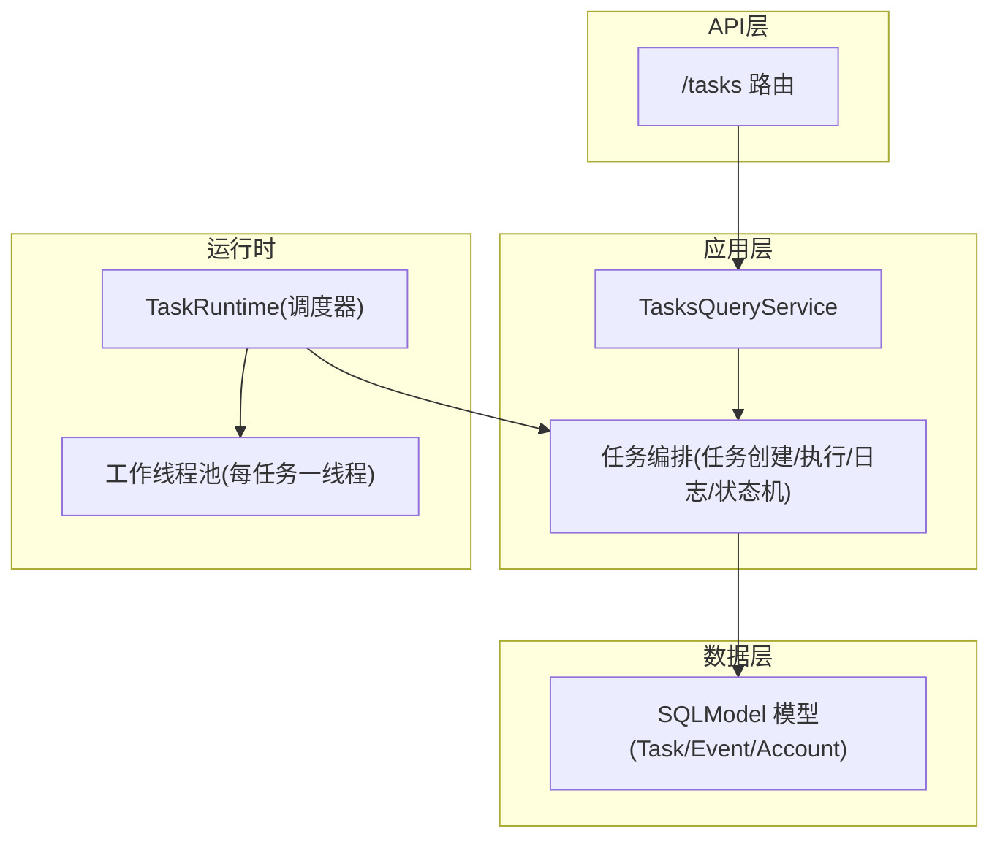
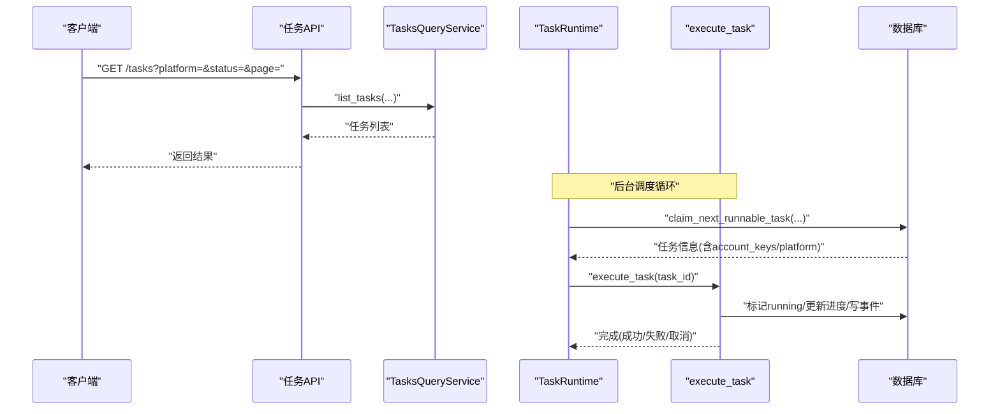
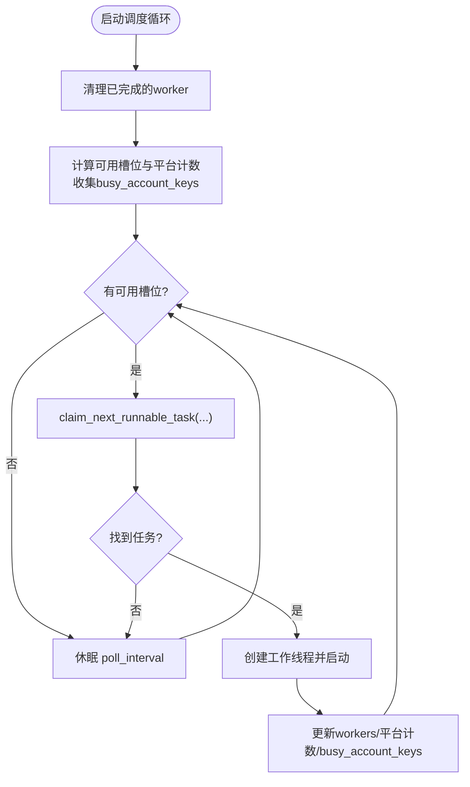
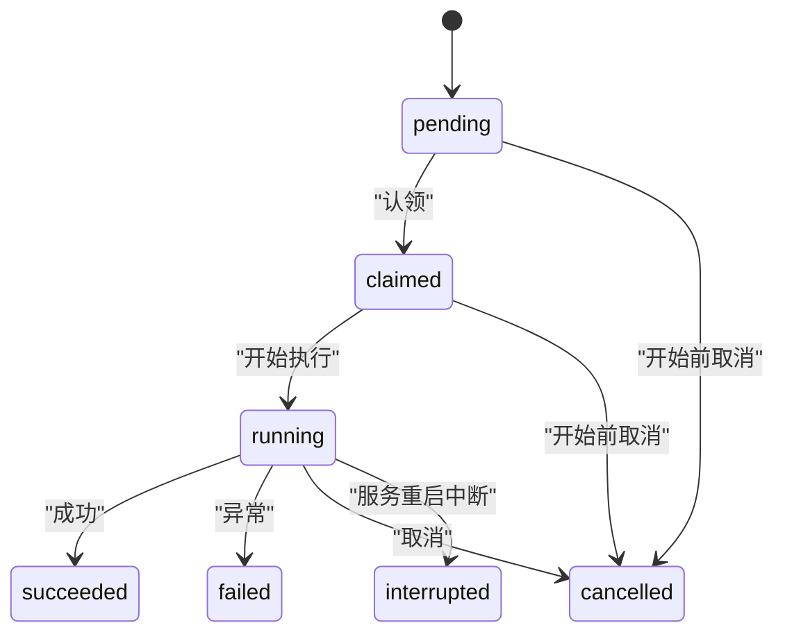
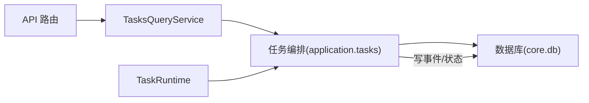

# 并发控制机制

<cite>
**本文引用的文件**
- [services/task_runtime.py](file://services/task_runtime.py)
- [application/tasks.py](file://application/tasks.py)
- [core/db.py](file://core/db.py)
- [api/tasks.py](file://api/tasks.py)
- [application/tasks_query.py](file://application/tasks_query.py)
- [domain/tasks.py](file://domain/tasks.py)
- [core/scheduler.py](file://core/scheduler.py)
</cite>

## 目录
1. [简介](#简介)
2. [项目结构](#项目结构)
3. [核心组件](#核心组件)
4. [架构总览](#架构总览)
5. [详细组件分析](#详细组件分析)
6. [依赖关系分析](#依赖关系分析)
7. [性能考虑](#性能考虑)
8. [故障排查指南](#故障排查指南)
9. [结论](#结论)
10. [附录](#附录)

## 简介
本技术文档聚焦 Any Auto Register 的并发控制机制，围绕任务调度器、异步任务队列、工作线程管理与资源分配策略展开。重点说明以下方面：
- 并发控制的核心组件：任务状态机、锁机制、信号量控制与死锁预防
- 任务执行生命周期：创建、调度、执行、监控与清理
- 配置选项：最大并发数、每平台并发限制、轮询间隔、重试与错误恢复
- 性能调优：内存管理、CPU 使用率优化、I/O 操作优化
- 实际 API 使用示例与常见并发问题处理

## 项目结构
与并发控制直接相关的代码主要分布在以下模块：
- 任务运行时与调度：services/task_runtime.py
- 任务编排与持久化：application/tasks.py
- 数据库模型（任务、事件、账号等）：core/db.py
- 任务查询与事件流：application/tasks_query.py、api/tasks.py
- 领域数据模型：domain/tasks.py
- 定时调度（账号有效性检测、试用到期提醒）：core/scheduler.py

**图表来源**
- [api/tasks.py:11-29](file://api/tasks.py#L11-L29)
- [application/tasks_query.py:7-41](file://application/tasks_query.py#L7-L41)
- [application/tasks.py:174-247](file://application/tasks.py#L174-L247)
- [services/task_runtime.py:18-101](file://services/task_runtime.py#L18-L101)
- [core/db.py:241-288](file://core/db.py#L241-L288)

**章节来源**
- [api/tasks.py:11-29](file://api/tasks.py#L11-L29)
- [application/tasks_query.py:7-41](file://application/tasks_query.py#L7-L41)
- [application/tasks.py:174-247](file://application/tasks.py#L174-L247)
- [services/task_runtime.py:18-101](file://services/task_runtime.py#L18-L101)
- [core/db.py:241-288](file://core/db.py#L241-L288)

## 核心组件
- 任务运行时 TaskRuntime：单进程任务调度器，维护全局并发上限与每平台并发限制，负责拉取可运行任务并派生工作线程执行。
- 任务编排 application.tasks：定义任务类型、状态机、任务创建、认领、执行、日志记录、进度更新、取消与完成；提供线程级任务锁与数据库事务保护。
- 数据库 core.db：通过 SQLModel 定义任务、事件、账号等持久化模型，提供统一的引擎与会话。
- 任务查询 application.tasks_query：封装任务与事件的读取与序列化，供 API 层消费。
- API api.tasks：暴露任务列表、详情与事件流接口。
- 定时调度 core/scheduler：后台线程周期性检查试用到期与账号有效性。

**章节来源**
- [services/task_runtime.py:18-101](file://services/task_runtime.py#L18-L101)
- [application/tasks.py:26-53](file://application/tasks.py#L26-L53)
- [core/db.py:241-288](file://core/db.py#L241-L288)
- [application/tasks_query.py:7-41](file://application/tasks_query.py#L7-L41)
- [api/tasks.py:11-29](file://api/tasks.py#L11-L29)
- [core/scheduler.py:19-115](file://core/scheduler.py#L19-L115)

## 架构总览
下图展示从 API 到任务执行的完整调用链，以及并发控制的关键点：
- API 接收请求后，通过服务层创建或查询任务
- TaskRuntime 作为调度器，按全局与平台维度限制并发，认领任务并启动工作线程
- 任务执行过程中通过 TaskLogger 记录状态、进度与事件
- 所有状态变更均通过带锁的数据库事务保证一致性

**图表来源**
- [api/tasks.py:11-29](file://api/tasks.py#L11-L29)
- [application/tasks_query.py:17-41](file://application/tasks_query.py#L17-L41)
- [services/task_runtime.py:47-99](file://services/task_runtime.py#L47-L99)
- [application/tasks.py:340-368](file://application/tasks.py#L340-L368)
- [application/tasks.py:570-595](file://application/tasks.py#L570-L595)

## 详细组件分析

### 任务运行时 TaskRuntime（调度器与工作线程管理）
- 设计要点
  - 全局并发上限：max_parallel_tasks，限制同时运行的任务总数
  - 每平台并发限制：max_parallel_per_platform，避免同一平台过载
  - 轮询间隔：poll_interval，控制调度循环频率
  - 工作线程：每个任务一个独立线程，完成后自动回收
  - 资源占用追踪：维护 account_keys 集合，防止同一账号被重复并发访问
- 并发控制
  - 使用内部锁 _lock 保护 workers 字典与计数统计
  - 在认领任务前计算可用槽位与当前平台计数，确保不超过限制
  - 通过 claim_next_runnable_task 的 busy_account_keys 参数实现账号级互斥
- 生命周期
  - start：初始化并启动调度循环
  - stop：停止调度循环
  - wake_up：显式唤醒钩子（当前为占位）
  - _loop：周期清理已完成线程、计算可用槽位、认领任务并启动工作线程
  - _run_task：执行任务并在 finally 中清理 worker 记录

**图表来源**
- [services/task_runtime.py:47-99](file://services/task_runtime.py#L47-L99)

**章节来源**
- [services/task_runtime.py:18-101](file://services/task_runtime.py#L18-L101)

### 任务编排与状态机（application.tasks）
- 任务类型
  - register：注册任务
  - account_check：单个账号有效性检查
  - account_check_all：批量账号有效性检查
  - platform_action：平台自定义动作
- 任务状态机
  - 非终态：pending、claimed、running、cancel_requested
  - 终态：succeeded、failed、interrupted、cancelled
- 并发与锁
  - 任务级锁：_task_lock 基于 task_id 的 threading.Lock，保证对同一任务的并发写入串行化
  - 数据库事务：所有状态变更在 Session 内提交，避免脏读
  - 账号级互斥：通过 busy_account_keys 传递正在使用的账号键，避免重复并发
- 执行流程
  - create_*：创建任务并记录初始事件
  - claim_next_runnable_task：按平台与账号约束挑选 pending 任务并标记 claimed
  - execute_task：根据任务类型分派处理器，设置 running，记录进度与事件，最终结束
  - request_cancel：将 pending 任务直接取消，或将运行中任务标记为 cancel_requested
  - TaskLogger：统一记录日志、进度、错误、结果与结束状态

**图表来源**
- [application/tasks.py:31-50](file://application/tasks.py#L31-L50)
- [application/tasks.py:318-338](file://application/tasks.py#L318-L338)
- [application/tasks.py:385-457](file://application/tasks.py#L385-L457)

**章节来源**
- [application/tasks.py:26-53](file://application/tasks.py#L26-L53)
- [application/tasks.py:174-247](file://application/tasks.py#L174-L247)
- [application/tasks.py:340-368](file://application/tasks.py#L340-L368)
- [application/tasks.py:570-595](file://application/tasks.py#L570-L595)
- [application/tasks.py:692-870](file://application/tasks.py#L692-L870)

### 数据库模型与持久化（core/db.py）
- 关键表
  - tasks：任务主表，包含类型、平台、状态、载荷、结果、进度、时间戳等
  - task_events：任务事件表，用于记录日志、状态变更与详细信息
  - accounts/account_overviews：账号及其生命周期与有效性摘要
- 设计要点
  - 使用 JSON 字段存储 payload/result/detail，便于扩展
  - 索引覆盖常用查询条件（type、platform、status、task_id）
  - 提供 get_payload/set_payload、get_result/set_result 等便捷方法

**章节来源**
- [core/db.py:241-288](file://core/db.py#L241-L288)

### API 与查询服务（api/tasks.py、application/tasks_query.py）
- API 路由
  - GET /tasks：分页列出任务，支持按平台与状态过滤
  - GET /tasks/{task_id}：获取任务详情
  - GET /tasks/{task_id}/events：获取任务事件流
- 查询服务
  - TasksQueryService：封装仓库读取与序列化，统一输出格式
  - 事件流：支持 since 游标增量拉取，适合前端实时展示

**章节来源**
- [api/tasks.py:11-29](file://api/tasks.py#L11-L29)
- [application/tasks_query.py:7-41](file://application/tasks_query.py#L7-L41)

### 领域数据模型（domain/tasks.py）
- TaskProgress：进度信息（current、total、label）
- TaskSummary：任务摘要（状态、进度、成功/错误计数、结果、时间戳等）
- TaskEvent：事件对象（级别、消息、详情、时间戳）

**章节来源**
- [domain/tasks.py:8-44](file://domain/tasks.py#L8-L44)

### 定时调度（core/scheduler.py）
- 功能
  - 每小时检查试用到期账号，更新生命周期状态
  - 批量检测账号有效性，更新摘要与生命周期状态
- 并发特性
  - 使用独立守护线程运行循环
  - 每次检查以数据库会话为单位，避免长时间持有连接

**章节来源**
- [core/scheduler.py:19-115](file://core/scheduler.py#L19-L115)

## 依赖关系分析
- 低耦合分层
  - API 层仅依赖查询服务，不直接访问数据库
  - 运行时与编排解耦：TaskRuntime 只负责调度，具体执行逻辑在 application.tasks
  - 数据访问集中在 core.db，其他层通过 SQLModel 会话交互
- 关键依赖链
  - TaskRuntime -> application.tasks.claim_next_runnable_task/execute_task
  - application.tasks -> core.db（Session 读写）
  - API -> application.tasks_query -> infrastructure（仓库）-> core.db

**图表来源**
- [api/tasks.py:11-29](file://api/tasks.py#L11-L29)
- [application/tasks_query.py:7-41](file://application/tasks_query.py#L7-L41)
- [application/tasks.py:340-368](file://application/tasks.py#L340-L368)
- [core/db.py:241-288](file://core/db.py#L241-L288)

**章节来源**
- [api/tasks.py:11-29](file://api/tasks.py#L11-L29)
- [application/tasks_query.py:7-41](file://application/tasks_query.py#L7-L41)
- [application/tasks.py:340-368](file://application/tasks.py#L340-L368)
- [core/db.py:241-288](file://core/db.py#L241-L288)

## 性能考虑
- 并发与吞吐
  - 调整 TaskRuntime.max_parallel_tasks 控制全局并发度，建议根据 CPU 核数与 I/O 特性调优
  - 通过 max_parallel_per_platform 限制单一平台并发，避免热点平台阻塞整体调度
  - 合理设置 poll_interval，过小会增加数据库压力，过大影响响应延迟
- 内存管理
  - 任务结果与事件采用 JSON 字符串存储，注意大对象体积对数据库的影响
  - 及时清理已完成 worker 记录，避免内存泄漏
- CPU 使用率
  - 注册任务内部使用 ThreadPoolExecutor 进行细粒度并发，需结合 count/concurrency 控制
  - 避免在回调中进行重计算或同步阻塞操作
- I/O 优化
  - 数据库会话短事务，减少锁竞争
  - 批量操作（如批量账号检查）分批提交，降低单次事务开销
  - 代理池与邮箱实例复用，减少外部系统握手成本

[本节为通用指导，不直接分析具体文件]

## 故障排查指南
- 常见问题定位
  - 任务未执行：检查 TaskRuntime 是否启动、是否有 pending 任务、平台并发是否达到上限
  - 任务卡住：查看任务事件流，确认是否处于 running 且无进度更新
  - 并发冲突：检查 account_keys 是否重复，确认 claim_next_runnable_task 是否正确排除 busy 账号
- 恢复与重试
  - 服务重启会将非终态任务标记为 interrupted，需重新触发或等待下次调度
  - 对于可重试的错误，可在任务处理器中捕获并记录错误，必要时增加重试逻辑
- 日志与监控
  - 通过 /tasks/{task_id}/events 获取详细事件，关注 error 级别与 summary 事件
  - 使用 TaskLogger.record_error 与 finish 记录最终状态与错误信息

**章节来源**
- [application/tasks.py:296-316](file://application/tasks.py#L296-L316)
- [application/tasks.py:385-457](file://application/tasks.py#L385-L457)
- [application/tasks.py:570-595](file://application/tasks.py#L570-L595)

## 结论
Any Auto Register 的并发控制以 TaskRuntime 为调度中心，配合 application.tasks 的任务状态机与数据库锁，实现了安全、可控的多任务并行执行。通过全局与平台维度的并发限制、账号级互斥、完善的任务生命周期与事件追踪，系统在多平台注册与账号检查场景中具备高可靠性与可扩展性。生产环境应结合实际负载调优并发参数，并持续监控任务事件与数据库性能指标。

[本节为总结，不直接分析具体文件]

## 附录

### 配置选项参考
- TaskRuntime 构造参数
  - max_parallel_tasks：最大并发任务数
  - max_parallel_per_platform：每平台最大并发数
  - poll_interval：调度循环轮询间隔（秒）
- 任务创建参数（register）
  - count：计划创建的账号数量
  - concurrency：注册任务内部并发度（受上限约束）
  - extra：扩展配置（如邮箱、验证码、代理等）
- 任务查询与事件
  - page/page_size：分页参数
  - since/limit：事件流增量拉取参数

**章节来源**
- [services/task_runtime.py:18-26](file://services/task_runtime.py#L18-L26)
- [application/tasks.py:174-208](file://application/tasks.py#L174-L208)
- [application/tasks.py:249-278](file://application/tasks.py#L249-L278)

### 使用示例（路径指引）
- 创建注册任务
  - 参考路径：[application/tasks.py:201-208](file://application/tasks.py#L201-L208)
- 认领并执行任务
  - 参考路径：[application/tasks.py:340-368](file://application/tasks.py#L340-L368)、[application/tasks.py:570-595](file://application/tasks.py#L570-L595)
- 查询任务列表与详情
  - 参考路径：[api/tasks.py:11-21](file://api/tasks.py#L11-L21)、[application/tasks_query.py:11-23](file://application/tasks_query.py#L11-L23)
- 获取任务事件流
  - 参考路径：[api/tasks.py:24-29](file://api/tasks.py#L24-L29)、[application/tasks_query.py:25-41](file://application/tasks_query.py#L25-L41)
- 定时检查账号有效性
  - 参考路径：[core/scheduler.py:65-111](file://core/scheduler.py#L65-L111)

[本节为路径指引，不包含具体代码内容]