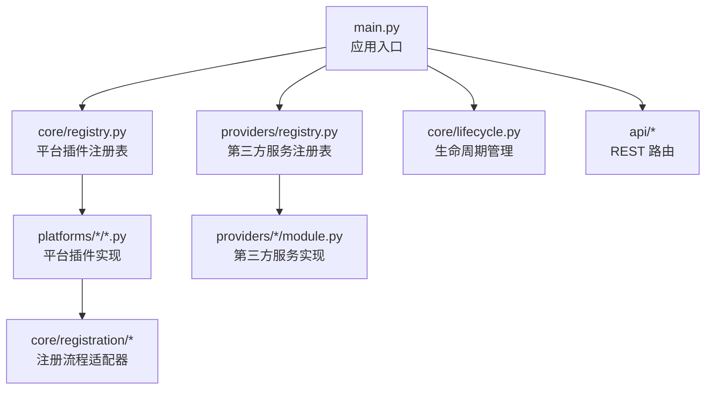
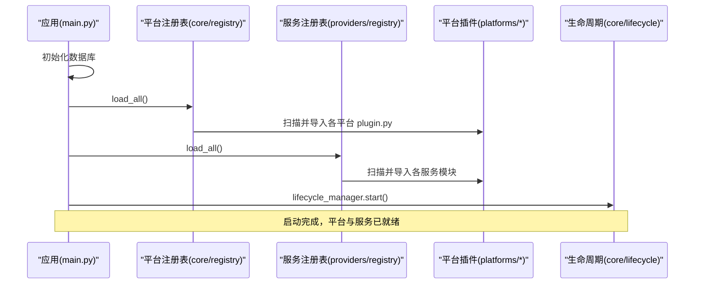
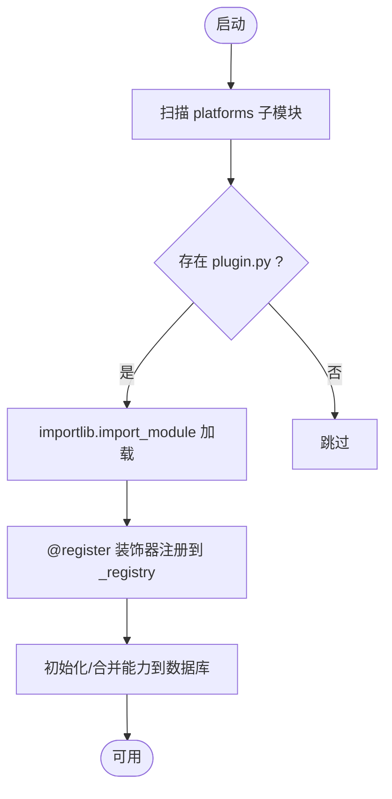
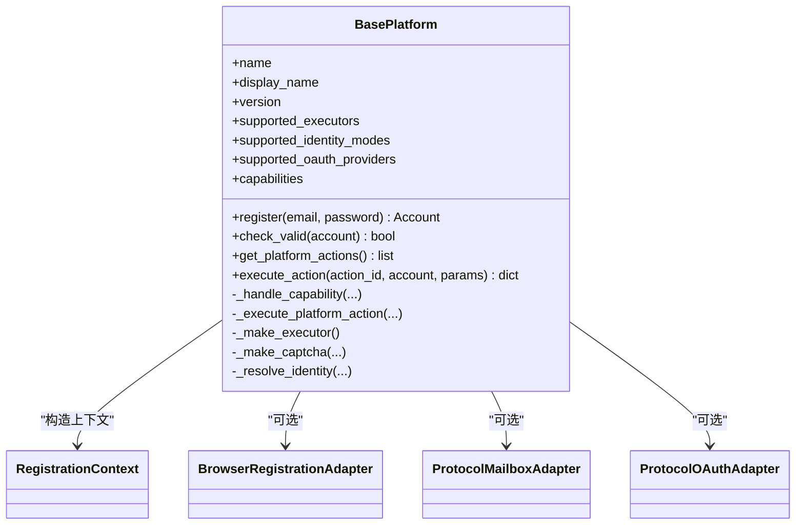
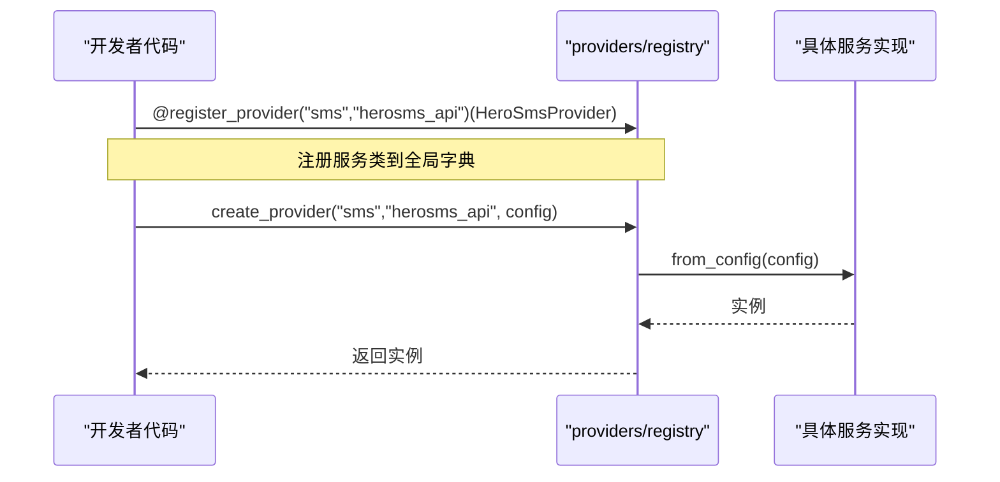
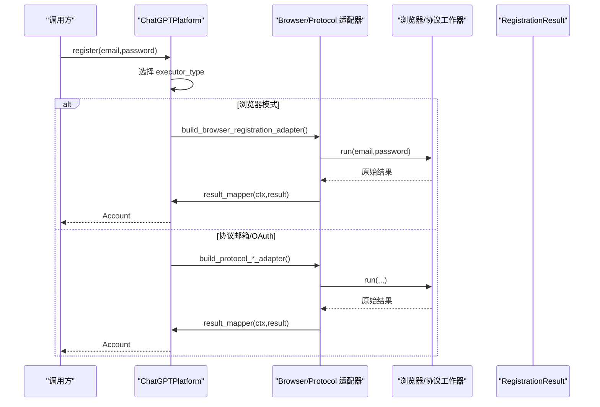
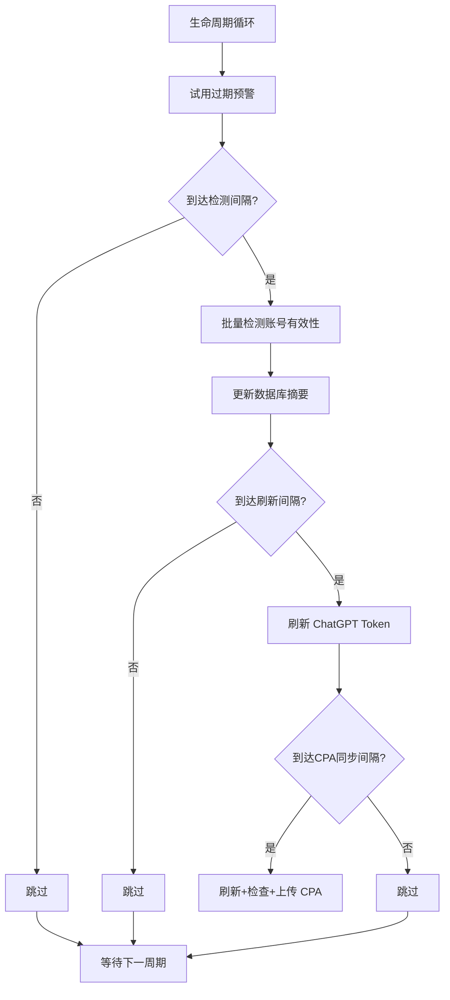
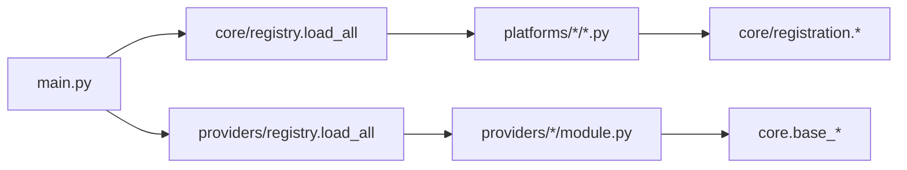

# 插件化架构

<cite>
**本文引用的文件**
- [main.py](file://main.py)
- [core/registry.py](file://core/registry.py)
- [core/base_platform.py](file://core/base_platform.py)
- [core/capability_registry.py](file://core/capability_registry.py)
- [core/registration/adapters.py](file://core/registration/adapters.py)
- [core/registration/models.py](file://core/registration/models.py)
- [providers/registry.py](file://providers/registry.py)
- [providers/sms/herosms.py](file://providers/sms/herosms.py)
- [platforms/chatgpt/plugin.py](file://platforms/chatgpt/plugin.py)
- [platforms/cursor/plugin.py](file://platforms/cursor/plugin.py)
- [platforms/cerebras/plugin.py](file://platforms/cerebras/plugin.py)
- [core/lifecycle.py](file://core/lifecycle.py)
</cite>

## 目录
1. [简介](#简介)
2. [项目结构](#项目结构)
3. [核心组件](#核心组件)
4. [架构总览](#架构总览)
5. [详细组件分析](#详细组件分析)
6. [依赖关系分析](#依赖关系分析)
7. [性能考虑](#性能考虑)
8. [故障排查指南](#故障排查指南)
9. [结论](#结论)
10. [附录：开发指南与最佳实践](#附录：开发指南与最佳实践)

## 简介
本技术文档围绕 Any Auto Register 的插件化架构，系统阐述其动态发现、加载机制与生命周期管理；深入解析注册表（Registry）在插件声明、能力配置、版本兼容与冲突处理上的工作原理；说明平台适配器与第三方服务提供商的插件实现模式（接口规范、配置管理与扩展点设计）；并提供创建新平台适配器插件与第三方服务集成插件的开发指南、配置方式、部署流程与热更新机制。文末给出 ChatGPT 平台插件与短信服务提供商插件的实现细节，以及插件开发的最佳实践与性能优化建议。

## 项目结构
仓库采用分层与按领域组织的方式：
- 入口与启动：FastAPI 应用入口 main.py，负责数据库初始化、插件与服务加载、调度器与生命周期管理启动。
- 核心层 core：平台基类、注册表、能力定义、注册流程适配器、执行器、生命周期管理等。
- 平台插件 platforms：各目标平台的插件实现（如 chatgpt、cursor、cerebras 等），每个平台以 plugin.py 暴露并注册。
- 第三方服务 providers：统一的服务提供商注册中心，支持 mailbox、sms、captcha、proxy 等类型。
- 基础设施 infrastructure：仓储与运行时支撑。
- API 层 api：对外暴露的 REST 路由。
- 前端 frontend：React/Vite 前端。
- 服务 services：任务运行、验证码求解器等后台服务。

图表来源
- [main.py:67-83](file://main.py#L67-L83)
- [core/registry.py:25-33](file://core/registry.py#L25-L33)
- [providers/registry.py:70-90](file://providers/registry.py#L70-L90)

章节来源
- [main.py:67-83](file://main.py#L67-L83)

## 核心组件
- 平台插件基类 BasePlatform：定义统一的注册流程、能力体系、身份模式、执行器选择、验证码解决器选择、账号校验与动作执行等。
- 平台注册表 core/registry：自动扫描 platforms 目录，通过装饰器 @register 将平台类注册到内存，提供 get/list/get_platform_capabilities 等方法，并与数据库持久化能力覆盖进行合并。
- 能力定义与注册 core/capability_registry：标准能力定义（查询状态、刷新 Token、生成链接、切换桌面、上传 CPA/TM、检查试用、创建 API Key 等），并提供 UI 展示策略与排序。
- 注册流程适配器 core/registration/adapters：BrowserRegistrationAdapter、ProtocolMailboxAdapter、ProtocolOAuthAdapter，封装浏览器/协议邮箱/OAuth 三种注册路径。
- 第三方服务注册表 providers/registry：统一注册 mailbox/sms/captcha/proxy 等服务驱动，支持 from_config 工厂方法创建实例。
- 生命周期管理 core/lifecycle：定时检测账号有效性、Token 自动续期、试用过期预警、CPA 同步等后台任务。

章节来源
- [core/base_platform.py:44-160](file://core/base_platform.py#L44-L160)
- [core/registry.py:19-38](file://core/registry.py#L19-L38)
- [core/capability_registry.py:27-132](file://core/capability_registry.py#L27-L132)
- [core/registration/adapters.py:28-59](file://core/registration/adapters.py#L28-L59)
- [providers/registry.py:38-63](file://providers/registry.py#L38-L63)
- [core/lifecycle.py:37-97](file://core/lifecycle.py#L37-L97)

## 架构总览
整体架构遵循“插件即模块”的设计：平台插件与第三方服务插件均通过装饰器注册到全局注册表，系统在启动时自动扫描并加载，运行时通过名称或类型+键查找并实例化。

图表来源
- [main.py:67-83](file://main.py#L67-L83)
- [core/registry.py:25-33](file://core/registry.py#L25-L33)
- [providers/registry.py:70-90](file://providers/registry.py#L70-L90)

## 详细组件分析

### 平台插件注册表（core/registry）
- 动态发现：通过 pkgutil.iter_modules 遍历 platforms 包下的子模块，尝试导入 {name}.plugin，若不存在则忽略。
- 注册机制：使用 @register 装饰器将平台类以 name 为键存入内存字典。
- 能力配置与合并：从数据库读取 PlatformCapabilityOverrideModel，与类默认值合并，确保新增能力向后兼容。
- 查询接口：get(name) 获取平台类；list_platforms() 返回包含 name、display_name、version 及能力列表的结构化数据；get_platform_capabilities(name) 返回标准化后的能力集合。

图表来源
- [core/registry.py:25-33](file://core/registry.py#L25-L33)
- [core/registry.py:64-97](file://core/registry.py#L64-L97)

章节来源
- [core/registry.py:19-38](file://core/registry.py#L19-L38)
- [core/registry.py:100-124](file://core/registry.py#L100-L124)

### 平台基类与注册流程（core/base_platform）
- 统一入口 register(email, password)：根据 executor_type 选择浏览器模式或协议模式；若 identity_provider=oauth_browser 走 ProtocolOAuthFlow，否则走 ProtocolMailboxFlow。
- 适配器构建：build_browser_registration_adapter/build_protocol_mailbox_adapter/build_protocol_oauth_adapter 由具体平台实现，返回适配器对象。
- 能力体系：capabilities 声明平台支持的标准能力；execute_action 优先按能力分发，未实现则回退到 _execute_platform_action。
- 验证码与执行器：_make_captcha/_resolve_captcha_solver 支持多 provider 候选与 fallback；_make_executor 支持 protocol/headless/headed。
- 身份解析：_resolve_identity 基于 identity_provider 解析邮箱/浏览器 OAuth 等身份来源。

图表来源
- [core/base_platform.py:44-160](file://core/base_platform.py#L44-L160)
- [core/registration/adapters.py:28-59](file://core/registration/adapters.py#L28-L59)

章节来源
- [core/base_platform.py:124-160](file://core/base_platform.py#L124-L160)
- [core/base_platform.py:192-233](file://core/base_platform.py#L192-L233)
- [core/base_platform.py:316-394](file://core/base_platform.py#L316-L394)

### 能力系统与标准能力（core/capability_registry）
- 标准能力定义：query_state、refresh_token、generate_link、generate_link_browser、switch_desktop、upload_cpa、upload_tm、check_trial、create_api_key。
- UI 提示与优先级：ui_hints.inline/priority 控制前端展示形式与顺序。
- 能力检索：get_definition/get_all_definitions/get_inline_capabilities/get_menu_capabilities/sort_by_priority。

章节来源
- [core/capability_registry.py:27-132](file://core/capability_registry.py#L27-L132)
- [core/capability_registry.py:135-173](file://core/capability_registry.py#L135-L173)

### 第三方服务提供商注册表（providers/registry）
- 统一注册：@register_provider(provider_type, driver_type) 将服务类登记到全局字典。
- 工厂创建：create_provider(provider_type, driver_type, config) 调用类的 from_config(config) 创建实例。
- 自动加载：load_all() 扫描 providers.captcha/proxy/sms/mailbox 子模块并导入，失败时记录警告日志。

图表来源
- [providers/registry.py:38-63](file://providers/registry.py#L38-L63)
- [providers/sms/herosms.py:10-18](file://providers/sms/herosms.py#L10-L18)

章节来源
- [providers/registry.py:28-63](file://providers/registry.py#L28-L63)
- [providers/registry.py:70-90](file://providers/registry.py#L70-L90)
- [providers/sms/herosms.py:10-18](file://providers/sms/herosms.py#L10-L18)

### 平台插件示例：ChatGPT（platforms/chatgpt/plugin.py）
- 声明能力：capabilities 包括 query_state、refresh_token、generate_link、switch_desktop、upload_cpa、upload_tm。
- 注册适配器：
  - build_browser_registration_adapter：组合 BrowserRegistrationAdapter，支持 OTP、电话回调、浏览器复用等。
  - build_protocol_oauth_adapter：ProtocolOAuthAdapter 用于浏览器 OAuth。
  - build_protocol_mailbox_adapter：ProtocolMailboxAdapter 用于协议邮箱注册。
- 能力实现：
  - _handle_query_state：查询订阅状态与本地/桌面端状态。
  - _handle_refresh_token：调用 TokenRefreshManager 刷新 access_token/refresh_token。
  - _handle_generate_link：生成 Plus/Team 支付链接并打开隐身浏览器。
- 动作执行：execute_action 支持 switch_account、get_account_state、payment_link、upload_cpa、upload_tm 等平台特定操作。

图表来源
- [platforms/chatgpt/plugin.py:160-225](file://platforms/chatgpt/plugin.py#L160-L225)
- [core/registration/adapters.py:28-59](file://core/registration/adapters.py#L28-L59)

章节来源
- [platforms/chatgpt/plugin.py:48-67](file://platforms/chatgpt/plugin.py#L48-L67)
- [platforms/chatgpt/plugin.py:127-225](file://platforms/chatgpt/plugin.py#L127-L225)
- [platforms/chatgpt/plugin.py:227-335](file://platforms/chatgpt/plugin.py#L227-L335)
- [platforms/chatgpt/plugin.py:338-420](file://platforms/chatgpt/plugin.py#L338-L420)

### 平台插件示例：Cursor（platforms/cursor/plugin.py）
- 声明能力：switch_desktop、query_state、generate_link。
- 注册适配器：
  - build_browser_registration_adapter：支持 CAPTCHA、OTP、电话回调，可复用浏览器。
  - build_protocol_oauth_adapter：浏览器 OAuth。
  - build_protocol_mailbox_adapter：协议邮箱注册，支持 CAPTCHA。
- 动作执行：execute_action 支持账户切换、用户信息/用量查询、生成 7 天 Pro 试用链接等。

章节来源
- [platforms/cursor/plugin.py:18-32](file://platforms/cursor/plugin.py#L18-L32)
- [platforms/cursor/plugin.py:72-114](file://platforms/cursor/plugin.py#L72-L114)
- [platforms/cursor/plugin.py:129-265](file://platforms/cursor/plugin.py#L129-L265)

### 平台插件示例：Cerebras（platforms/cerebras/plugin.py）
- 无密码认证（Stytch OTP），password 为空。
- 注册适配器：仅实现 ProtocolMailboxAdapter，使用 executor 执行协议流程。
- 能力：自定义 get_account_state 动作，验证 API Key 有效性。

章节来源
- [platforms/cerebras/plugin.py:8-52](file://platforms/cerebras/plugin.py#L8-L52)
- [platforms/cerebras/plugin.py:54-89](file://platforms/cerebras/plugin.py#L54-L89)

### 生命周期管理（core/lifecycle）
- 账号有效性检测：周期性查询活跃账号，调用平台插件 check_valid 并更新数据库摘要。
- Token 自动续期：针对 ChatGPT 账号，使用 session_token 刷新 access_token，并更新凭证。
- 试用过期预警：标记即将过期或已过期的试用账号。
- CPA 同步：刷新 token、检查存活、重新上传至 CPA。

图表来源
- [core/lifecycle.py:37-97](file://core/lifecycle.py#L37-L97)
- [core/lifecycle.py:104-193](file://core/lifecycle.py#L104-L193)
- [core/lifecycle.py:200-260](file://core/lifecycle.py#L200-L260)
- [core/lifecycle.py:267-451](file://core/lifecycle.py#L267-L451)
- [core/lifecycle.py:458-528](file://core/lifecycle.py#L458-L528)

章节来源
- [core/lifecycle.py:37-97](file://core/lifecycle.py#L37-L97)
- [core/lifecycle.py:104-193](file://core/lifecycle.py#L104-L193)
- [core/lifecycle.py:200-260](file://core/lifecycle.py#L200-L260)
- [core/lifecycle.py:267-451](file://core/lifecycle.py#L267-L451)
- [core/lifecycle.py:458-528](file://core/lifecycle.py#L458-L528)

## 依赖关系分析
- 平台插件依赖：
  - 继承 BasePlatform，实现 check_valid、注册适配器、能力处理器。
  - 通过 core/registry.register 装饰器注册。
  - 通过 core/registration.* 适配器与执行器交互。
- 第三方服务插件依赖：
  - 通过 providers/registry.register_provider 注册。
  - 实现 from_config 工厂方法，供 create_provider 创建实例。
- 启动依赖：
  - main.py 在 lifespan 中依次初始化数据库、加载平台与服务、启动调度器与生命周期管理。

图表来源
- [main.py:67-83](file://main.py#L67-L83)
- [core/registry.py:25-33](file://core/registry.py#L25-L33)
- [providers/registry.py:70-90](file://providers/registry.py#L70-L90)

章节来源
- [main.py:67-83](file://main.py#L67-L83)
- [core/registry.py:25-33](file://core/registry.py#L25-L33)
- [providers/registry.py:70-90](file://providers/registry.py#L70-L90)

## 性能考虑
- 延迟加载：平台与服务模块按需 import，避免启动开销过大。
- 能力缓存：平台能力从数据库合并后缓存于内存，减少重复 IO。
- 验证码 provider 候选：支持多 provider 候选与 fallback，提升成功率同时降低单次失败成本。
- 生命周期任务批量化：批量检测账号有效性、刷新 Token、CPA 同步，减少频繁网络请求。
- 浏览器复用：部分平台支持 oauth_headless_requires_browser_reuse，减少浏览器启动开销。

[本节为通用指导，不直接分析具体文件]

## 故障排查指南
- 平台未注册：get(name) 抛出 KeyError，检查 platform 名称是否正确且 plugin.py 是否被正确导入。
- 能力缺失：execute_action 未实现对应 capability，检查平台 capabilities 声明与 _handle_* 实现。
- 验证码 provider 未配置：浏览器模式或未配置默认 provider 会抛错，需在设置页启用并设为默认。
- 服务未注册：create_provider 抛出 ValueError，检查 @register_provider 是否生效且模块被导入。
- 生命周期异常：查看日志中的错误计数与消息，定位具体平台或服务问题。

章节来源
- [core/registry.py:35-38](file://core/registry.py#L35-L38)
- [core/base_platform.py:192-233](file://core/base_platform.py#L192-L233)
- [core/base_platform.py:345-353](file://core/base_platform.py#L345-L353)
- [providers/registry.py:51-63](file://providers/registry.py#L51-L63)
- [core/lifecycle.py:490-528](file://core/lifecycle.py#L490-L528)

## 结论
Any Auto Register 的插件化架构通过“装饰器注册 + 自动扫描 + 能力声明 + 适配器抽象”实现了高内聚、低耦合的平台与服务扩展能力。平台插件聚焦业务逻辑，注册表与能力系统提供统一契约，生命周期管理保障长期稳定性。该设计便于快速接入新平台与第三方服务，同时具备良好的可维护性与可扩展性。

[本节为总结，不直接分析具体文件]

## 附录：开发指南与最佳实践

### 如何创建新的平台适配器插件
- 目录结构：在 platforms/yourplatform 下创建 plugin.py，并在其中定义继承自 BasePlatform 的类，使用 @register 装饰器注册。
- 最小实现：
  - 声明 name、display_name、version。
  - 实现 check_valid 用于账号有效性检测。
  - 根据需要实现 build_protocol_mailbox_adapter 或 build_browser_registration_adapter/build_protocol_oauth_adapter。
  - 声明 capabilities 并实现对应的 _handle_* 方法。
- 参考实现：
  - ChatGPT：完整实现浏览器与协议注册、能力处理器与动作执行。
  - Cursor：支持 CAPTCHA、OTP、浏览器复用与多种动作。
  - Cerebras：无密码认证与协议邮箱注册。

章节来源
- [platforms/chatgpt/plugin.py:48-67](file://platforms/chatgpt/plugin.py#L48-L67)
- [platforms/cursor/plugin.py:18-32](file://platforms/cursor/plugin.py#L18-L32)
- [platforms/cerebras/plugin.py:8-52](file://platforms/cerebras/plugin.py#L8-L52)

### 如何创建第三方服务集成插件（以短信为例）
- 目录结构：在 providers/sms 下创建模块，导出服务类并通过 @register_provider("sms","your_key") 注册。
- 工厂方法：实现 from_config(config) 类方法，供 create_provider 创建实例。
- 参考实现：
  - HeroSMS：重导出 core.base_sms.HeroSmsProvider 并注册到统一注册表。

章节来源
- [providers/sms/herosms.py:10-18](file://providers/sms/herosms.py#L10-L18)
- [providers/registry.py:38-63](file://providers/registry.py#L38-L63)

### 配置方式
- 平台配置：RegisterConfig 支持 executor_type、captcha_solver、proxy、extra。
- 能力覆盖：通过数据库 PlatformCapabilityOverrideModel 覆盖 supported_executors、supported_identity_modes、supported_oauth_providers、capabilities。
- 服务配置：各服务模块通过 from_config 解析配置项（如 API Key、代理等）。

章节来源
- [core/base_platform.py:35-42](file://core/base_platform.py#L35-L42)
- [core/registry.py:41-61](file://core/registry.py#L41-L61)

### 部署流程
- 启动入口：main.py 的 lifespan 中初始化数据库、加载平台与服务、启动调度器与生命周期管理。
- 环境变量：PYTHONUTF8 设置为 1，确保输出编码一致。
- 静态资源：如有 static 目录，挂载 /assets 并提供 SPA 回退路由。

章节来源
- [main.py:67-83](file://main.py#L67-L83)
- [main.py:124-131](file://main.py#L124-L131)

### 热更新机制
- 当前实现为进程级加载：平台与服务在应用启动时一次性加载，未在代码中发现运行时热重载机制。
- 建议方案：如需热更新，可在生命周期管理器中增加模块重载逻辑，或通过外部进程管理重启服务。

[本节为概念性内容，不直接分析具体文件]

### 实际示例：ChatGPT 平台插件与短信服务提供商插件
- ChatGPT：
  - 能力：查询状态、刷新 Token、生成支付链接、切换桌面、上传 CPA/TM。
  - 注册适配器：浏览器与协议邮箱/OAuth 双通道。
  - 动作执行：账户切换、状态查询、支付链接生成、CPA/TM 上传。
- 短信服务（HeroSMS）：
  - 注册到统一注册表，提供 from_config 工厂方法。
  - 与 PhoneCallbackController 共享状态，保证验证码获取一致性。

章节来源
- [platforms/chatgpt/plugin.py:160-225](file://platforms/chatgpt/plugin.py#L160-L225)
- [platforms/chatgpt/plugin.py:227-335](file://platforms/chatgpt/plugin.py#L227-L335)
- [platforms/chatgpt/plugin.py:338-420](file://platforms/chatgpt/plugin.py#L338-L420)
- [providers/sms/herosms.py:10-18](file://providers/sms/herosms.py#L10-L18)

### 最佳实践与性能优化建议
- 明确声明能力：仅在 capabilities 中声明平台真正支持的能力，避免无效动作。
- 适配器职责单一：浏览器注册、协议邮箱、OAuth 分别实现，保持清晰边界。
- 验证码 fallback：配置多个 provider 并按优先级尝试，提高成功率。
- 浏览器复用：对需要会话状态的流程启用 browser_reuse，减少启动开销。
- 生命周期任务节流：合理设置检测与刷新间隔，避免频繁请求导致限流。
- 错误处理：在平台插件中捕获异常并返回结构化错误，便于前端展示与日志追踪。

[本节为通用指导，不直接分析具体文件]