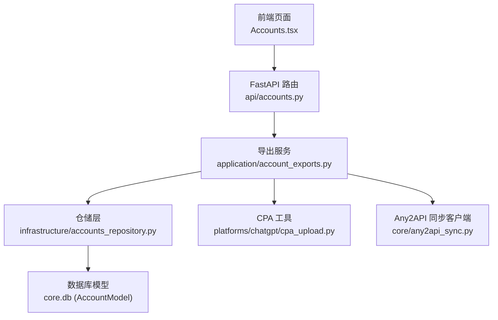
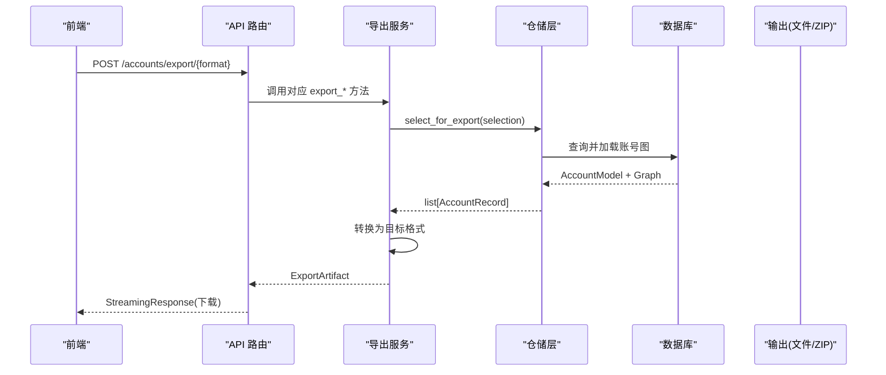
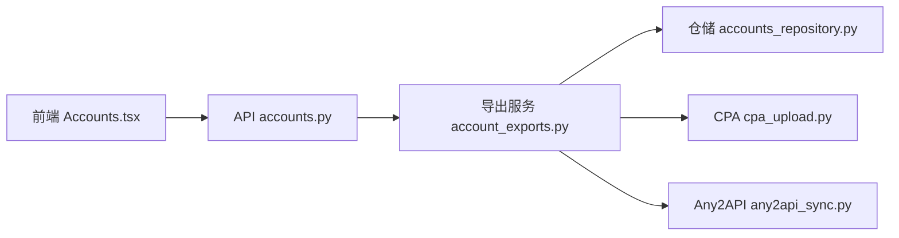

# 数据导出系统

<cite>
**本文引用的文件**
- [application/account_exports.py](file://application/account_exports.py)
- [api/accounts.py](file://api/accounts.py)
- [domain/accounts.py](file://domain/accounts.py)
- [infrastructure/accounts_repository.py](file://infrastructure/accounts_repository.py)
- [platforms/chatgpt/cpa_upload.py](file://platforms/chatgpt/cpa_upload.py)
- [core/any2api_sync.py](file://core/any2api_sync.py)
- [frontend/src/pages/Accounts.tsx](file://frontend/src/pages/Accounts.tsx)
</cite>

## 目录
1. [简介](#简介)
2. [项目结构](#项目结构)
3. [核心组件](#核心组件)
4. [架构总览](#架构总览)
5. [详细组件分析](#详细组件分析)
6. [依赖关系分析](#依赖关系分析)
7. [性能考虑](#性能考虑)
8. [故障排查指南](#故障排查指南)
9. [结论](#结论)
10. [附录](#附录)

## 简介
本技术文档面向 Any Auto Register 的数据导出子系统，系统性说明多格式数据导出能力（JSON、CSV、CPA、Sub2API、Kiro-Go、Any2API admin.json），覆盖字段映射规则、数据转换逻辑、导出流程（查询→转换→生成→质量验证）、典型使用场景与集成方式，并提供扩展新导出格式的指引。

## 项目结构
导出功能由前端触发、后端 API 路由转发至应用层服务，再由仓储层从数据库加载账号数据，最后通过格式转换器输出为不同目标格式的文件或压缩包。

图表来源
- [frontend/src/pages/Accounts.tsx:1421-1508](file://frontend/src/pages/Accounts.tsx#L1421-L1508)
- [api/accounts.py:110-209](file://api/accounts.py#L110-L209)
- [application/account_exports.py:330-506](file://application/account_exports.py#L330-L506)
- [infrastructure/accounts_repository.py:143-162](file://infrastructure/accounts_repository.py#L143-L162)
- [platforms/chatgpt/cpa_upload.py:84-204](file://platforms/chatgpt/cpa_upload.py#L84-L204)
- [core/any2api_sync.py:18-157](file://core/any2api_sync.py#L18-L157)

章节来源
- [frontend/src/pages/Accounts.tsx:1421-1508](file://frontend/src/pages/Accounts.tsx#L1421-L1508)
- [api/accounts.py:110-209](file://api/accounts.py#L110-L209)
- [application/account_exports.py:330-506](file://application/account_exports.py#L330-L506)
- [infrastructure/accounts_repository.py:143-162](file://infrastructure/accounts_repository.py#L143-L162)

## 核心组件
- 领域模型：账号记录 AccountRecord、导出选择 AccountExportSelection
- 仓储层：AccountsRepository.select_for_export 负责按平台、ID、筛选条件查询并组装完整图信息
- 导出服务：AccountExportsService 提供 JSON/CSV/Sub2API/CPA/Kiro-Go/Any2API 等导出方法
- API 路由：统一接收批量导出请求，封装为 ExportArtifact 并以流式响应返回
- 外部集成：CPA 上传与 Any2API 自动推送

章节来源
- [domain/accounts.py:8-100](file://domain/accounts.py#L8-L100)
- [infrastructure/accounts_repository.py:143-162](file://infrastructure/accounts_repository.py#L143-L162)
- [application/account_exports.py:330-506](file://application/account_exports.py#L330-L506)
- [api/accounts.py:56-76](file://api/accounts.py#L56-L76)

## 架构总览
导出流程的核心步骤：
- 数据查询：根据平台、ID 列表、全选标志、状态过滤、搜索过滤获取账号集合
- 格式转换：将 AccountRecord 转换为各目标格式所需的中间结构或最终对象
- 文件生成：序列化 JSON/CSV，或打包 ZIP；单条时直接输出文件，多条时归档
- 质量验证：基础校验（如必要字段非空、时间戳格式、JWT 解析容错）

图表来源
- [api/accounts.py:110-209](file://api/accounts.py#L110-L209)
- [application/account_exports.py:330-506](file://application/account_exports.py#L330-L506)
- [infrastructure/accounts_repository.py:143-162](file://infrastructure/accounts_repository.py#L143-L162)

## 详细组件分析

### 领域模型与选择器
- AccountRecord：包含平台、邮箱、密码、用户ID、凭证列表、提供商账户/资源、生命周期/有效性/计划状态、显示状态、创建/更新时间等
- AccountExportSelection：用于指定导出范围（平台、IDs、是否全选、状态过滤、搜索过滤）

章节来源
- [domain/accounts.py:8-100](file://domain/accounts.py#L8-L100)

### 仓储层查询与装配
- select_for_export：支持按平台、邮箱模糊搜索、ID 白名单、状态过滤；加载账号图后统一转为 AccountRecord
- 状态过滤：基于 display_status/lifecycle_status/plan_state/validity_status 的组合匹配

章节来源
- [infrastructure/accounts_repository.py:143-162](file://infrastructure/accounts_repository.py#L143-L162)

### 导出服务：通用转换与产物
- ExportArtifact：统一描述文件名、媒体类型、内容（字符串/字节/BytesIO）
- 辅助函数：
  - _decode_jwt_payload：安全解码 JWT payload
  - _chatgpt_export_payload：聚合 access_token/refresh_token/id_token/session_token 等，解析过期时间、工作区 ID、邮箱服务商等
  - _make_kiro_go_account：Kiro → Kiro-Go CLI Proxy 配置
  - _build_any2api_admin_config：多平台合并为 Any2API admin.json

章节来源
- [application/account_exports.py:21-50](file://application/account_exports.py#L21-L50)
- [application/account_exports.py:70-128](file://application/account_exports.py#L70-L128)
- [application/account_exports.py:201-238](file://application/account_exports.py#L201-L238)
- [application/account_exports.py:273-327](file://application/account_exports.py#L273-L327)

### 导出服务：各格式实现

#### JSON 导出（ChatGPT）
- 输出字段：email/password/client_id/account_id/workspace_id/access_token/refresh_token/id_token/session_token/email_service/registered_at/last_refresh/expires_at/status
- 适用场景：批量导出 ChatGPT 账号基础信息与令牌

章节来源
- [application/account_exports.py:334-363](file://application/account_exports.py#L334-L363)

#### CSV 导出（ChatGPT）
- 列头：ID, Email, Password, Client ID, Account ID, Workspace ID, Access Token, Refresh Token, ID Token, Session Token, Email Service, Status, Registered At, Last Refresh, Expires At
- 适用场景：表格软件查看与分析

章节来源
- [application/account_exports.py:365-413](file://application/account_exports.py#L365-L413)

#### Sub2API 导出（ChatGPT）
- 结构：proxies 数组为空，accounts 数组包含 openai OAuth 凭据、模型映射、组织 ID、并发度、优先级、速率倍数、过期自动暂停等
- 行为：单条直接输出 JSON；多条打包 ZIP，每个账号一个 JSON 文件

章节来源
- [application/account_exports.py:164-198](file://application/account_exports.py#L164-L198)
- [application/account_exports.py:415-438](file://application/account_exports.py#L415-L438)

#### CPA 导出（ChatGPT）
- 结构：通过 CPA 工具生成 token JSON，包含 access_token/refresh_token/id_token/session_token/account_id/expired/last_refresh/type 等
- 行为：单条输出 JSON；多条打包 ZIP

章节来源
- [application/account_exports.py:131-161](file://application/account_exports.py#L131-L161)
- [application/account_exports.py:440-463](file://application/account_exports.py#L440-L463)
- [platforms/chatgpt/cpa_upload.py:84-204](file://platforms/chatgpt/cpa_upload.py#L84-L204)

#### Kiro-Go 导出（Kiro）
- 结构：config.json 包含 password/port/host/requireApiKey/accounts 数组；account 项包含 accessToken/refreshToken/clientId/clientSecret/authMethod/provider/region/startUrl/expiresAt/machineId/weight/enabled
- 行为：将所有 Kiro 账号转换为 Kiro-Go CLI Proxy 兼容配置

章节来源
- [application/account_exports.py:201-238](file://application/account_exports.py#L201-L238)
- [application/account_exports.py:475-492](file://application/account_exports.py#L475-L492)

#### Any2API admin.json 导出（多平台）
- 结构：settings.adminPassword/apiKey/defaultProvider；providers.kiroAccounts/grokTokens/cursorConfig/blinkConfig/chatgptConfig
- 行为：根据平台分别填充对应 provider 配置，合并为一个 admin.json

章节来源
- [application/account_exports.py:241-327](file://application/account_exports.py#L241-L327)
- [application/account_exports.py:494-506](file://application/account_exports.py#L494-L506)

### API 路由与流式响应
- 统一入口：POST /accounts/export/{json|csv|sub2api|cpa|kiro-go|any2api}
- 参数：BatchExportRequest（platform/ids/select_all/status_filter/search_filter）
- 响应：StreamingResponse，设置 Content-Disposition 以触发浏览器下载

章节来源
- [api/accounts.py:56-76](file://api/accounts.py#L56-L76)
- [api/accounts.py:110-209](file://api/accounts.py#L110-L209)

### 前端交互
- 导出菜单：支持 JSON/CSV/Any2Api/Sub2Api/CPA，Kiro 平台额外显示 Kiro-Go
- 请求体：platform、ids、select_all、status_filter、search_filter
- 下载：通过 apiDownload 获取 blob 与 filename，触发浏览器下载

章节来源
- [frontend/src/pages/Accounts.tsx:1421-1508](file://frontend/src/pages/Accounts.tsx#L1421-L1508)

### 与外部系统集成

#### CPA 上传
- 生成 token JSON：优先从 id_token/access_token 的 JWT 中解析 account_id，必要时调用 /backend-api/me 或刷新 session 获取
- 上传接口：POST 到 CPA 管理平台的 auth-files 端点，携带 Authorization Bearer 与 JSON 内容
- 错误处理：未配置 URL/API Key、account_id 为空、网络异常等均有明确日志与返回

章节来源
- [platforms/chatgpt/cpa_upload.py:84-204](file://platforms/chatgpt/cpa_upload.py#L84-L204)
- [platforms/chatgpt/cpa_upload.py:207-260](file://platforms/chatgpt/cpa_upload.py#L207-L260)

#### Any2API 自动推送
- 登录：POST /admin/api/login，维护会话 cookie
- 推送：按平台调用相应 provider 接口（kiro/grok/cursor/chatgpt/blink/windsurf）
- 配置：从全局配置读取 any2api_url 与 any2api_password

章节来源
- [core/any2api_sync.py:18-157](file://core/any2api_sync.py#L18-L157)
- [core/any2api_sync.py:170-294](file://core/any2api_sync.py#L170-L294)

## 依赖关系分析
- 导出服务依赖仓储层进行数据查询，依赖 CPA 工具生成 CPA 格式，依赖 Any2API 客户端进行自动推送
- API 路由仅做参数校验与流式响应包装，业务逻辑集中在导出服务
- 前端通过统一的导出菜单发起请求，不关心具体格式细节

图表来源
- [frontend/src/pages/Accounts.tsx:1421-1508](file://frontend/src/pages/Accounts.tsx#L1421-L1508)
- [api/accounts.py:110-209](file://api/accounts.py#L110-L209)
- [application/account_exports.py:330-506](file://application/account_exports.py#L330-L506)
- [infrastructure/accounts_repository.py:143-162](file://infrastructure/accounts_repository.py#L143-L162)
- [platforms/chatgpt/cpa_upload.py:84-204](file://platforms/chatgpt/cpa_upload.py#L84-L204)
- [core/any2api_sync.py:18-157](file://core/any2api_sync.py#L18-L157)

章节来源
- [application/account_exports.py:330-506](file://application/account_exports.py#L330-L506)
- [api/accounts.py:110-209](file://api/accounts.py#L110-L209)
- [infrastructure/accounts_repository.py:143-162](file://infrastructure/accounts_repository.py#L143-L162)

## 性能考虑
- 批量导出 ZIP：当导出条目较多时，采用内存缓冲与压缩写入，避免磁盘 IO 开销
- 流式响应：API 层使用 StreamingResponse，减少大文件内存驻留
- 查询优化：仓储层在 SQL 层完成平台、邮箱模糊匹配与排序，再在 Python 层进行状态过滤
- 时间戳与 JWT 解析：对缺失或非法值进行容错处理，避免阻塞导出流程

[本节为通用性能建议，无需特定文件引用]

## 故障排查指南
- 导出失败（HTTP 400）：检查 BatchExportRequest 参数是否正确，平台是否受支持（例如 CPA/Sub2API 仅支持 chatgpt）
- CPA 上传失败：确认 CPA API URL 与 API Key 已配置；确保 account_id 非空；检查网络与证书
- Any2API 推送失败：确认 any2api_url 与 any2api_password 已配置；检查登录与会话保持；核对平台与凭据字段
- 前端下载失败：检查浏览器拦截与跨域策略；确认后端返回的 Content-Disposition 正确

章节来源
- [api/accounts.py:110-209](file://api/accounts.py#L110-L209)
- [platforms/chatgpt/cpa_upload.py:207-260](file://platforms/chatgpt/cpa_upload.py#L207-L260)
- [core/any2api_sync.py:170-294](file://core/any2api_sync.py#L170-L294)

## 结论
该导出系统以清晰的层次划分实现了多格式数据导出能力，涵盖常见第三方平台（ChatGPT、Kiro、Grok、Cursor、Blink）的适配。通过统一的导出服务与仓储层，保证了可扩展性与一致性；结合前端菜单与 API 路由，提供了便捷的使用体验。未来可按需扩展新的导出格式与平台适配。

[本节为总结性内容，无需特定文件引用]

## 附录

### 字段映射与转换规则摘要
- ChatGPT JSON/CSV：从 credentials 与 JWT 中提取 access_token/refresh_token/id_token/session_token，计算 expires_at/last_refresh，提取 workspace_id/email_service
- Sub2API：构造 openai OAuth 凭据，包含模型映射与组织 ID
- CPA：生成 codex 类型 token JSON，优先从 JWT 解析 account_id，必要时调用后端接口或刷新 session
- Kiro-Go：根据 oauthProvider 推断 authMethod/provider，生成 CLI Proxy 配置
- Any2API admin.json：按平台聚合 kiroAccounts/grokTokens/cursorConfig/blinkConfig/chatgptConfig

章节来源
- [application/account_exports.py:70-128](file://application/account_exports.py#L70-L128)
- [application/account_exports.py:164-198](file://application/account_exports.py#L164-L198)
- [application/account_exports.py:201-238](file://application/account_exports.py#L201-L238)
- [application/account_exports.py:241-327](file://application/account_exports.py#L241-L327)
- [platforms/chatgpt/cpa_upload.py:84-204](file://platforms/chatgpt/cpa_upload.py#L84-L204)

### 典型导出场景示例
- 批量账户导出：选择“全选”或指定 ids，提交到 /accounts/export/json 或 /accounts/export/csv
- 筛选条件应用：使用 status_filter 与 search_filter 限定导出范围
- 自定义字段选择：当前导出字段固定，如需扩展可在导出服务中添加新字段并在 JSON/CSV 中输出
- 性能优化技巧：大批量导出建议使用 Sub2API/CPA 的 ZIP 模式；合理设置分页与过滤以减少数据量

章节来源
- [api/accounts.py:110-209](file://api/accounts.py#L110-L209)
- [application/account_exports.py:415-463](file://application/account_exports.py#L415-L463)

### 与其他系统的集成方式
- API 接口调用：通过 FastAPI 暴露导出接口，前端以 POST 方式调用
- 文件系统操作：本地生成 JSON/CSV 或 ZIP 包，通过流式响应返回给前端
- 网络传输：CPA 上传与 Any2API 推送均通过 HTTP 接口完成，具备重试与错误处理

章节来源
- [api/accounts.py:110-209](file://api/accounts.py#L110-L209)
- [platforms/chatgpt/cpa_upload.py:207-260](file://platforms/chatgpt/cpa_upload.py#L207-L260)
- [core/any2api_sync.py:18-157](file://core/any2api_sync.py#L18-L157)

### 扩展新导出格式指南
- 新增导出方法：在 AccountExportsService 中添加 export_xxx 方法，定义转换逻辑与输出结构
- 新增 API 路由：在 api/accounts.py 中添加对应路由，复用 _stream_artifact 返回流式响应
- 前端菜单扩展：在 Accounts.tsx 的 options 中添加新选项，调用对应的导出路径
- 质量验证：在转换过程中增加必要字段校验与容错处理，确保输出符合目标格式规范

章节来源
- [application/account_exports.py:330-506](file://application/account_exports.py#L330-L506)
- [api/accounts.py:110-209](file://api/accounts.py#L110-L209)
- [frontend/src/pages/Accounts.tsx:1421-1508](file://frontend/src/pages/Accounts.tsx#L1421-L1508)