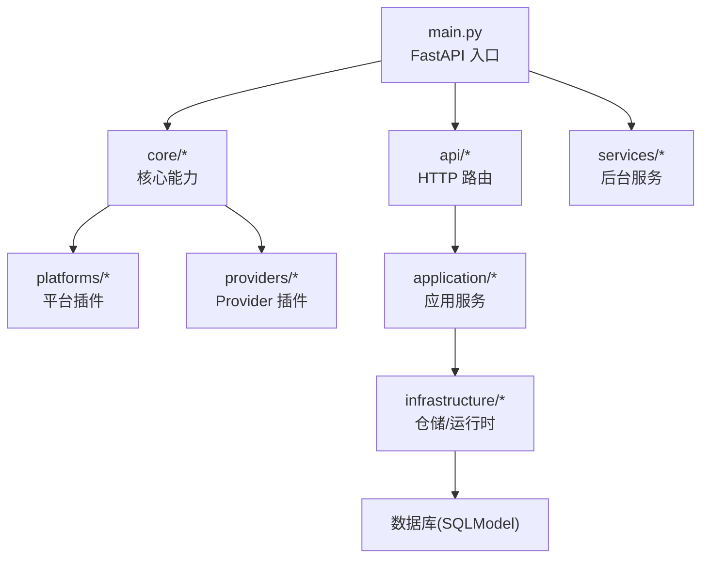
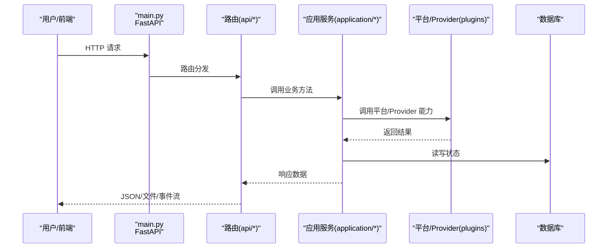
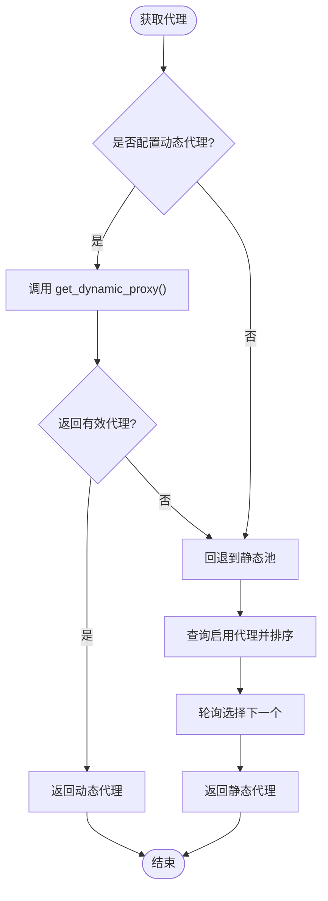
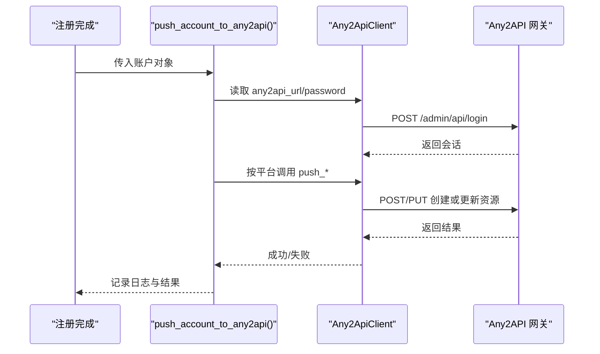
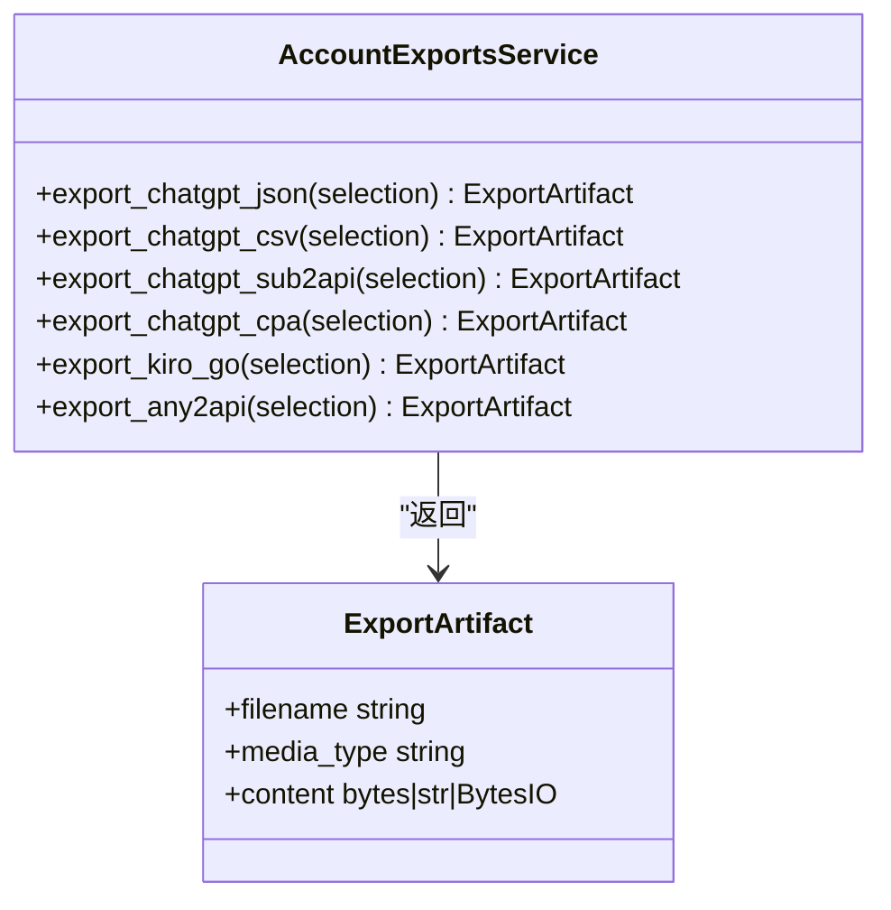
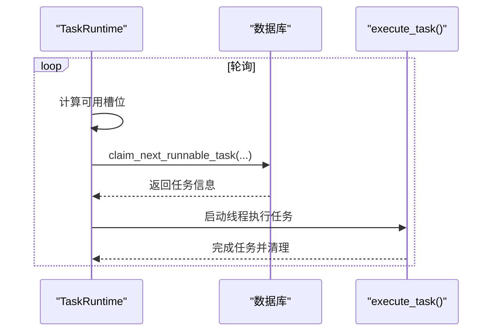
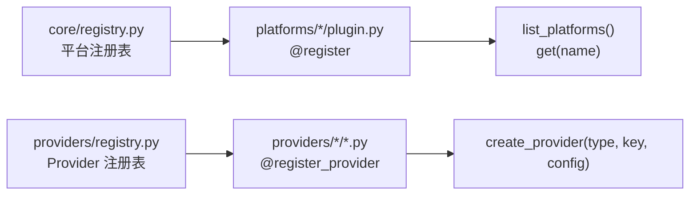
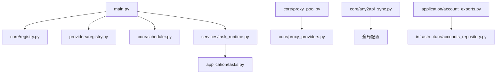

# 系统能力

<cite>
**本文引用的文件**
- [main.py](file://main.py)
- [README.md](file://README.md)
- [core/proxy_pool.py](file://core/proxy_pool.py)
- [core/proxy_providers.py](file://core/proxy_providers.py)
- [providers/proxy/api_extract.py](file://providers/proxy/api_extract.py)
- [providers/proxy/rotating_gateway.py](file://providers/proxy/rotating_gateway.py)
- [core/any2api_sync.py](file://core/any2api_sync.py)
- [application/account_exports.py](file://application/account_exports.py)
- [services/task_runtime.py](file://services/task_runtime.py)
- [core/scheduler.py](file://core/scheduler.py)
- [core/registry.py](file://core/registry.py)
- [providers/registry.py](file://providers/registry.py)
</cite>

## 目录
1. [简介](#简介)
2. [项目结构](#项目结构)
3. [核心组件](#核心组件)
4. [架构总览](#架构总览)
5. [详细组件分析](#详细组件分析)
6. [依赖关系分析](#依赖关系分析)
7. [性能与并发调优](#性能与并发调优)
8. [故障排查指南](#故障排查指南)
9. [结论](#结论)
10. [附录：集成示例与最佳实践](#附录：集成示例与最佳实践)

## 简介
Any Auto Register 是一个面向多 AI 平台的账号自动化注册与管理平台，提供代理池管理（静态轮询、动态 API 提取、旋转网关）、Any2API 联动（注册成功自动推送账号到网关）、多格式导出（JSON、CSV、CPA、Sub2API、Kiro-Go、Any2API admin.json）、可配置并发控制与插件化架构。系统支持协议与浏览器双模式执行，内置生命周期管理、成功率统计与错误归因，并通过统一 Provider 体系实现邮箱、验证码、接码、代理等能力的热插拔扩展。

## 项目结构
系统采用分层与插件化组织：
- 入口与路由：FastAPI 应用启动、中间件、路由挂载、服务生命周期
- 应用层：任务调度、账户导出、平台能力、配置管理等业务编排
- 领域模型：账户、任务、代理、日志等数据模型
- 基础设施：仓储与运行时适配
- 核心能力：平台基类、注册流程、代理池、调度器、认证、HTTP 客户端等
- 平台插件：各平台的具体实现（ChatGPT、Cursor、Kiro 等）
- Provider 插件：邮箱、验证码、短信、代理等驱动的统一注册与工厂
- 前端与桌面端：React 前端与 Electron 打包

图表来源
- [main.py:67-121](file://main.py#L67-L121)
- [core/registry.py:25-33](file://core/registry.py#L25-L33)
- [providers/registry.py:70-91](file://providers/registry.py#L70-L91)

章节来源
- [main.py:67-121](file://main.py#L67-L121)
- [README.md:286-323](file://README.md#L286-L323)

## 核心组件
- 代理池管理：静态轮询（成功率加权）、动态 API 提取、旋转网关；失败自动禁用与可用性检测
- Any2API 联动：注册成功后按平台自动推送至 Any2API 网关，支持 Kiro/Grok/Cursor/ChatGPT/Blink/Windsurf
- 导出格式：JSON、CSV、CPA、Sub2API、Kiro-Go、Any2API admin.json
- 并发控制：全局最大并行任务数、每平台最大并行、任务抢占与资源占用跟踪
- 插件化架构：平台与 Provider 均通过扫描注册表加载，支持热插拔扩展

章节来源
- [core/proxy_pool.py:9-90](file://core/proxy_pool.py#L9-L90)
- [core/proxy_providers.py:20-103](file://core/proxy_providers.py#L20-L103)
- [providers/proxy/api_extract.py:16-106](file://providers/proxy/api_extract.py#L16-L106)
- [providers/proxy/rotating_gateway.py:10-31](file://providers/proxy/rotating_gateway.py#L10-L31)
- [core/any2api_sync.py:18-294](file://core/any2api_sync.py#L18-L294)
- [application/account_exports.py:21-507](file://application/account_exports.py#L21-L507)
- [services/task_runtime.py:18-102](file://services/task_runtime.py#L18-L102)
- [core/registry.py:19-38](file://core/registry.py#L19-L38)
- [providers/registry.py:38-63](file://providers/registry.py#L38-L63)

## 架构总览
系统以 FastAPI 为入口，启动时初始化数据库、加载平台与 Provider 插件、启动调度器、任务运行器与 Solver 管理器。请求经中间件鉴权后进入对应路由，调用应用服务完成业务逻辑，底层通过仓储访问数据库，平台与 Provider 通过插件机制按需加载。

图表来源
- [main.py:67-121](file://main.py#L67-L121)
- [core/registry.py:25-33](file://core/registry.py#L25-L33)
- [providers/registry.py:70-91](file://providers/registry.py#L70-L91)

## 详细组件分析

### 代理池管理
- 静态轮询：从数据库读取启用状态的代理，按成功率加权排序，线程安全索引轮询；连续失败达到阈值自动禁用；支持区域过滤
- 动态 API 提取：通过配置的第三方 API 拉取代理列表，支持文本行或 JSON 数组解析，自动规范化协议与认证信息
- 旋转网关：固定网关地址，每次请求由网关分配不同出口 IP，适用于 BrightData/Oxylabs/IPRoyal 等
- 优先级：优先尝试动态代理，失败或未配置回退到静态池

图表来源
- [core/proxy_pool.py:14-45](file://core/proxy_pool.py#L14-L45)
- [core/proxy_providers.py:77-103](file://core/proxy_providers.py#L77-L103)
- [providers/proxy/api_extract.py:54-106](file://providers/proxy/api_extract.py#L54-L106)
- [providers/proxy/rotating_gateway.py:19-31](file://providers/proxy/rotating_gateway.py#L19-L31)

章节来源
- [core/proxy_pool.py:9-90](file://core/proxy_pool.py#L9-L90)
- [core/proxy_providers.py:20-103](file://core/proxy_providers.py#L20-L103)
- [providers/proxy/api_extract.py:16-106](file://providers/proxy/api_extract.py#L16-L106)
- [providers/proxy/rotating_gateway.py:10-31](file://providers/proxy/rotating_gateway.py#L10-L31)

### Any2API 联动
- 登录与会话：通过管理接口登录，维护会话 Cookie，401 时自动重试登录
- 平台映射：根据账户平台字段自动选择推送目标（Kiro/Grok/Cursor/ChatGPT/Blink/Windsurf）
- 配置来源：从全局配置读取 Any2API 地址与密码，未配置时静默跳过
- 推送流程：构造平台特定 payload，调用管理 API 创建或更新配置

图表来源
- [core/any2api_sync.py:18-167](file://core/any2api_sync.py#L18-L167)
- [core/any2api_sync.py:181-294](file://core/any2api_sync.py#L181-L294)

章节来源
- [core/any2api_sync.py:18-294](file://core/any2api_sync.py#L18-L294)

### 导出格式支持
- JSON/CSV：针对 ChatGPT 账号导出基础信息与令牌、过期时间等
- CPA：生成 CPA 兼容的 token JSON
- Sub2API：生成单账号或多账号压缩包，包含代理与账号映射
- Kiro-Go：导出为 Kiro-Go CLI Proxy 兼容的 config.json
- Any2API admin.json：多平台聚合配置，包含 kiroAccounts/grokTokens/cursorConfig/blinkConfig/chatgptConfig

图表来源
- [application/account_exports.py:21-507](file://application/account_exports.py#L21-L507)

章节来源
- [application/account_exports.py:21-507](file://application/account_exports.py#L21-L507)

### 并发控制机制
- 任务运行器：维护全局最大并行任务数与每平台最大并行数，周期性轮询待执行任务
- 任务抢占：基于数据库状态将任务标记为 claimed，避免重复执行
- 资源占用：跟踪正在运行的平台计数与账户键集合，防止同一账户被并发处理
- 工作进程：每个任务在独立线程中执行，完成后清理

图表来源
- [services/task_runtime.py:18-102](file://services/task_runtime.py#L18-L102)
- [application/tasks.py:340-368](file://application/tasks.py#L340-L368)

章节来源
- [services/task_runtime.py:18-102](file://services/task_runtime.py#L18-L102)
- [application/tasks.py:340-368](file://application/tasks.py#L340-L368)

### 插件化架构设计
- 平台插件：扫描 platforms/*/plugin.py，使用 @register 装饰器注册到核心注册表，支持能力覆盖与列表查询
- Provider 插件：扫描 providers/* 子包，使用 @register_provider 装饰器注册到统一注册表，通过工厂 create_provider 实例化
- 懒加载：通过 __getattr__ 延迟导入具体实现，减少启动开销
- 能力元数据：平台能力（执行器、身份模式、OAuth 提供商、capabilities）持久化并可覆盖

图表来源
- [core/registry.py:19-38](file://core/registry.py#L19-L38)
- [providers/registry.py:38-63](file://providers/registry.py#L38-L63)
- [core/proxy_providers.py:34-46](file://core/proxy_providers.py#L34-L46)

章节来源
- [core/registry.py:19-124](file://core/registry.py#L19-L124)
- [providers/registry.py:1-91](file://providers/registry.py#L1-L91)

## 依赖关系分析
- main.py 负责应用生命周期：初始化数据库、加载平台与 Provider、启动调度器、任务运行器与 Solver 管理器
- 代理池依赖数据库与动态代理提供者，失败统计影响后续选择
- Any2API 同步依赖全局配置与 HTTP 客户端，按平台映射推送
- 导出服务依赖仓储与平台特定转换逻辑
- 任务运行器依赖任务队列与执行器，受并发参数约束
- 调度器定时检查 trial 到期与账号有效性

图表来源
- [main.py:67-121](file://main.py#L67-L121)
- [core/proxy_pool.py:9-90](file://core/proxy_pool.py#L9-L90)
- [core/proxy_providers.py:20-103](file://core/proxy_providers.py#L20-L103)
- [core/any2api_sync.py:181-294](file://core/any2api_sync.py#L181-L294)
- [application/account_exports.py:330-507](file://application/account_exports.py#L330-L507)
- [services/task_runtime.py:18-102](file://services/task_runtime.py#L18-L102)

章节来源
- [main.py:67-121](file://main.py#L67-L121)
- [core/proxy_pool.py:9-90](file://core/proxy_pool.py#L9-L90)
- [core/proxy_providers.py:20-103](file://core/proxy_providers.py#L20-L103)
- [core/any2api_sync.py:181-294](file://core/any2api_sync.py#L181-L294)
- [application/account_exports.py:330-507](file://application/account_exports.py#L330-L507)
- [services/task_runtime.py:18-102](file://services/task_runtime.py#L18-L102)

## 性能与并发调优
- 代理选择优化：优先动态代理，失败快速回退；静态池按成功率加权，降低低质量代理使用频率
- 并发参数调优：
  - max_parallel_tasks：控制全局并发上限，避免资源争用
  - max_parallel_per_platform：限制单平台并发，防止单一平台过载
  - poll_interval：调整轮询间隔，平衡响应速度与 CPU 占用
- 任务抢占与去重：通过 claimed 状态与账户键集合避免重复执行与冲突
- 导出性能：多账号导出使用压缩归档，减少 IO 次数
- 建议：
  - 在高并发场景下适当降低 per-platform 并发，结合代理质量评估
  - 对频繁失败的代理及时禁用，提升整体成功率
  - 合理设置轮询间隔，避免过度唤醒

[本节为通用指导，不直接分析具体文件]

## 故障排查指南
- 代理问题：
  - 动态代理 API 超时或返回空：检查 API URL、协议与认证配置
  - 静态代理连续失败：查看失败计数与禁用状态，必要时手动启用或更换
  - 旋转网关不可达：确认网关地址与网络连通性
- Any2API 推送失败：
  - 登录失败或会话过期：检查 any2api_url 与 any2api_password，确认网关可达
  - 平台不支持：当前仅支持 Kiro/Grok/Cursor/ChatGPT/Blink/Windsurf，其他平台会记录日志并跳过
- 任务执行异常：
  - 任务长时间占用：检查 claim 状态与账户键占用，确保无死锁
  - 并发过高导致资源不足：降低 max_parallel_tasks 或 per-platform 并发
- 调度器异常：
  - Trial 到期未更新：检查生命周期状态与时间戳，确认调度器正常运行

章节来源
- [core/proxy_pool.py:47-90](file://core/proxy_pool.py#L47-L90)
- [core/proxy_providers.py:77-103](file://core/proxy_providers.py#L77-L103)
- [core/any2api_sync.py:27-167](file://core/any2api_sync.py#L27-L167)
- [services/task_runtime.py:47-102](file://services/task_runtime.py#L47-L102)
- [core/scheduler.py:44-115](file://core/scheduler.py#L44-L115)

## 结论
Any Auto Register 通过插件化架构与统一 Provider 体系，实现了代理池管理、Any2API 联动、多格式导出与可配置并发控制的系统化能力。其设计兼顾可扩展性与工程化落地，适合在多平台账号自动化场景中规模化部署与持续演进。

[本节为总结，不直接分析具体文件]

## 附录：集成示例与最佳实践
- 代理池集成：
  - 动态 API 提取：配置 proxy_api_url、proxy_protocol、proxy_username、proxy_password，确保返回格式为文本行或 JSON 数组
  - 旋转网关：配置 proxy_gateway_url，确保网关稳定且具备自动轮换能力
  - 静态池：定期执行 check_all 检测可用性，关注 success_count/fail_count 变化
- Any2API 联动：
  - 在全局配置中设置 any2api_url 与 any2api_password，注册成功后自动推送
  - 针对不同平台准备相应凭证（accessToken、cookieToken、session_token 等）
- 导出格式选择：
  - 批量迁移：使用 Any2API admin.json 聚合多平台配置
  - 工具链对接：Sub2API/Kiro-Go/CPA 根据下游工具要求选择
- 并发调优：
  - 初始建议：max_parallel_tasks=3，max_parallel_per_platform=1，poll_interval=0.5
  - 根据平台特性与代理质量逐步调整，观察成功率与资源占用
- 插件扩展：
  - 新增平台：在 platforms/myplatform/plugin.py 中定义并注册，实现必要能力
  - 新增 Provider：在 providers/* 下实现 from_config 与 get_proxy 等方法，并使用装饰器注册

[本节为概念性指导，不直接分析具体文件]