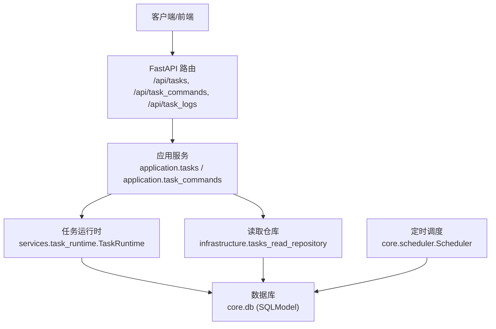
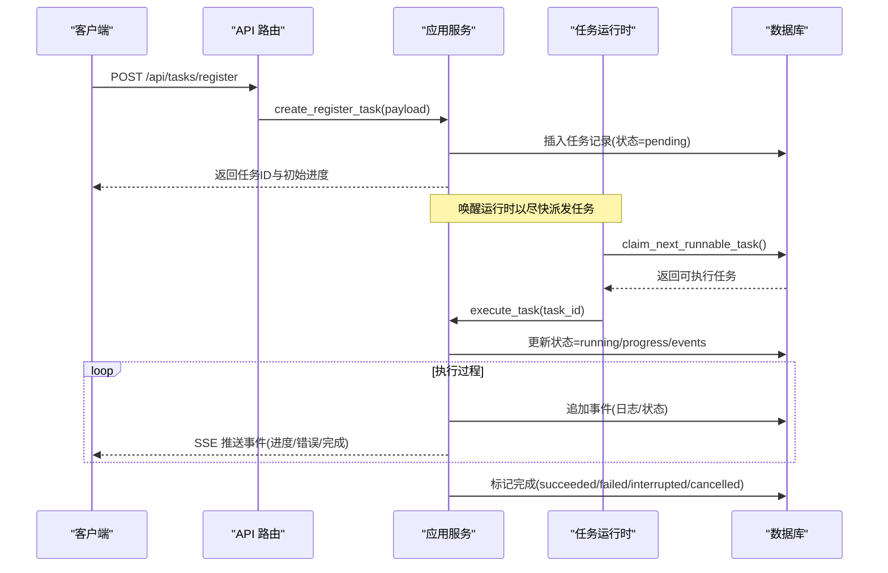
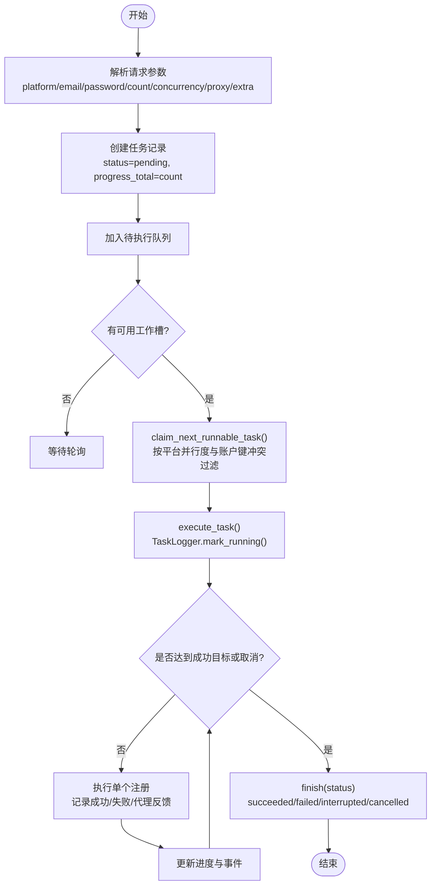
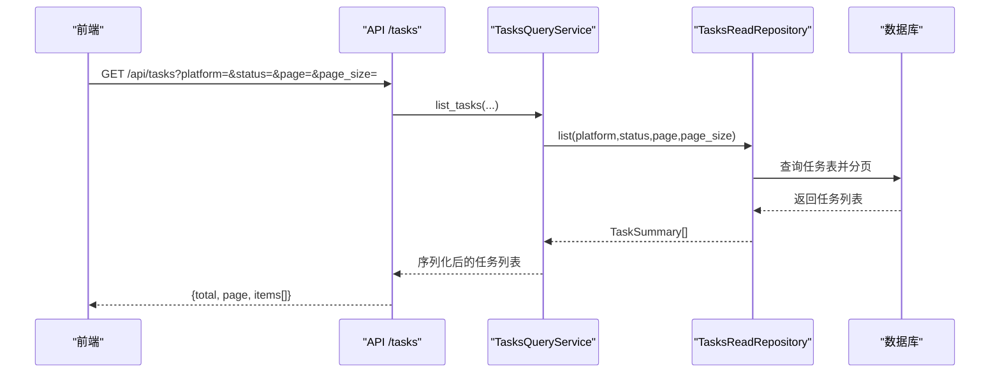
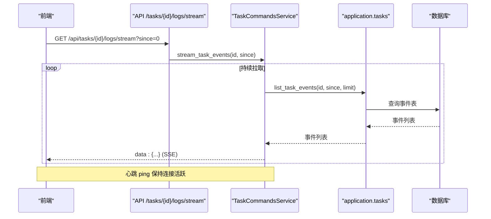
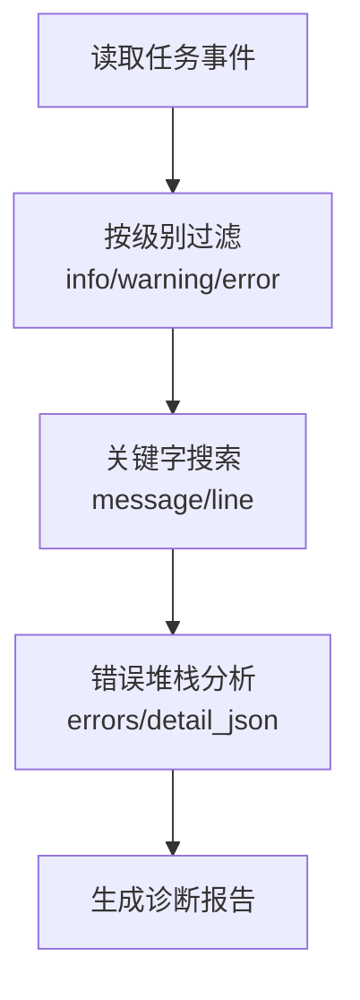
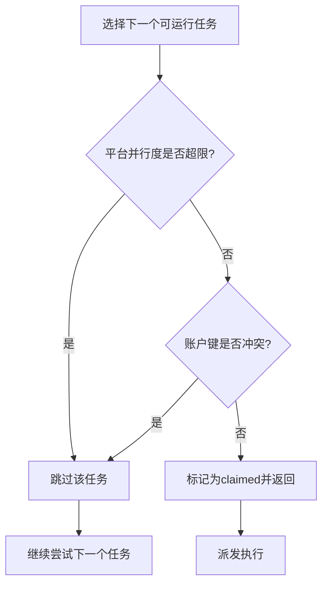
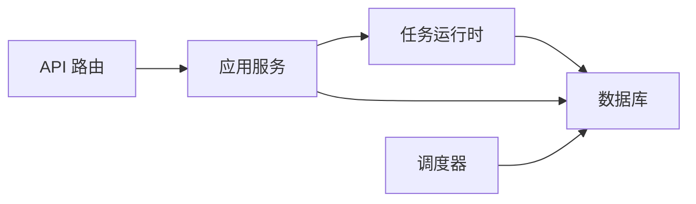

# 任务队列

<cite>
**本文引用的文件**
- [main.py](file://main.py)
- [api/tasks.py](file://api/tasks.py)
- [api/task_commands.py](file://api/task_commands.py)
- [api/task_logs.py](file://api/task_logs.py)
- [application/tasks.py](file://application/tasks.py)
- [application/tasks_query.py](file://application/tasks_query.py)
- [application/task_commands.py](file://application/task_commands.py)
- [services/task_runtime.py](file://services/task_runtime.py)
- [core/scheduler.py](file://core/scheduler.py)
- [core/db.py](file://core/db.py)
- [domain/tasks.py](file://domain/tasks.py)
- [infrastructure/tasks_read_repository.py](file://infrastructure/tasks_read_repository.py)
</cite>

## 目录
1. [简介](#简介)
2. [项目结构](#项目结构)
3. [核心组件](#核心组件)
4. [架构总览](#架构总览)
5. [详细组件分析](#详细组件分析)
6. [依赖关系分析](#依赖关系分析)
7. [性能考量](#性能考量)
8. [故障排查指南](#故障排查指南)
9. [结论](#结论)
10. [附录](#附录)

## 简介
本文件为 Any Auto Register 的任务队列系统提供全面文档，覆盖批量注册、历史查询、实时进度监控、单任务日志查看、调度算法与资源分配策略、最佳实践以及常见问题的诊断与解决方法。系统基于 FastAPI 暴露 API，使用 SQLite 持久化任务与事件，通过线程池执行任务，并提供 SSE（Server-Sent Events）流式推送任务事件。

## 项目结构
- API 层：负责路由与请求校验，调用应用服务层完成业务逻辑。
- 应用层：封装任务创建、状态管理、并发控制、进度更新与结果聚合。
- 服务层：TaskRuntime 负责任务派发与生命周期管理；Scheduler 负责定时任务。
- 基础设施层：数据库模型定义与读写仓库，统一数据访问。
- 领域层：任务摘要、进度、事件等数据结构。

**图表来源**
- [main.py:67-91](file://main.py#L67-L91)
- [api/tasks.py:11-29](file://api/tasks.py#L11-L29)
- [api/task_commands.py:17-50](file://api/task_commands.py#L17-L50)
- [services/task_runtime.py:18-101](file://services/task_runtime.py#L18-L101)
- [core/scheduler.py:19-115](file://core/scheduler.py#L19-L115)
- [core/db.py:241-288](file://core/db.py#L241-L288)

**章节来源**
- [main.py:67-91](file://main.py#L67-L91)
- [api/tasks.py:11-29](file://api/tasks.py#L11-L29)
- [api/task_commands.py:17-50](file://api/task_commands.py#L17-L50)
- [services/task_runtime.py:18-101](file://services/task_runtime.py#L18-L101)
- [core/scheduler.py:19-115](file://core/scheduler.py#L19-L115)
- [core/db.py:241-288](file://core/db.py#L241-L288)

## 核心组件
- 任务模型与事件模型：持久化任务元数据、进度、结果与事件日志。
- 任务命令服务：创建注册任务、取消任务、SSE 事件流。
- 任务运行器：线程级任务派发、平台并行度控制、账户键冲突避免。
- 任务查询服务：分页查询任务列表、事件拉取、序列化输出。
- 调度器：周期性检查账号生命周期与到期状态。

**章节来源**
- [core/db.py:241-288](file://core/db.py#L241-L288)
- [application/task_commands.py:20-76](file://application/task_commands.py#L20-L76)
- [services/task_runtime.py:18-101](file://services/task_runtime.py#L18-L101)
- [application/tasks_query.py:7-68](file://application/tasks_query.py#L7-L68)
- [core/scheduler.py:19-115](file://core/scheduler.py#L19-L115)

## 架构总览
系统启动时初始化数据库、加载平台与提供商、启动调度器与任务运行时。API 路由将请求分发到应用服务层，后者通过任务运行器在后台线程中执行任务，并通过数据库持久化进度与事件。前端通过 SSE 订阅任务事件实现实时进度监控。

**图表来源**
- [api/task_commands.py:29-31](file://api/task_commands.py#L29-L31)
- [application/task_commands.py:20-30](file://application/task_commands.py#L20-L30)
- [services/task_runtime.py:47-85](file://services/task_runtime.py#L47-L85)
- [application/tasks.py:174-198](file://application/tasks.py#L174-L198)
- [application/tasks.py:340-368](file://application/tasks.py#L340-L368)
- [application/tasks.py:570-595](file://application/tasks.py#L570-L595)

## 详细组件分析

### 批量注册功能
- 任务创建：支持指定平台、邮箱、密码、数量、并发度、代理、执行器类型、验证码求解器及扩展参数。
- 参数配置：通过 extra 传递额外配置，如短信服务商、自动支付链接开关、超时等。
- 并发控制：每个任务内部根据 count 与 concurrency 限制并发执行，同时受全局最大并行任务数与每平台并行度限制。
- 进度跟踪：任务级别设置 progress_total 与 progress_current，实时更新并可通过 SSE 推送。

**图表来源**
- [api/task_commands.py:17-31](file://api/task_commands.py#L17-L31)
- [application/tasks.py:174-208](file://application/tasks.py#L174-L208)
- [application/tasks.py:340-368](file://application/tasks.py#L340-L368)
- [application/tasks.py:570-595](file://application/tasks.py#L570-L595)
- [application/tasks.py:692-790](file://application/tasks.py#L692-L790)

**章节来源**
- [api/task_commands.py:17-31](file://api/task_commands.py#L17-L31)
- [application/tasks.py:174-208](file://application/tasks.py#L174-L208)
- [application/tasks.py:692-790](file://application/tasks.py#L692-L790)

### 历史查询接口
- 列表查询：支持按平台与状态筛选，分页返回任务摘要。
- 事件查询：按任务 ID 与 since 游标拉取事件，limit 限制单次条数。
- 结果导出：通过 list_tasks 返回的 items 包含 success/error_count/errors/cashier_urls/result 等字段，便于前端或外部系统导出。

**图表来源**
- [api/tasks.py:11-13](file://api/tasks.py#L11-L13)
- [application/tasks_query.py:17-23](file://application/tasks_query.py#L17-L23)
- [infrastructure/tasks_read_repository.py:51-53](file://infrastructure/tasks_read_repository.py#L51-L53)
- [core/db.py:241-258](file://core/db.py#L241-L258)

**章节来源**
- [api/tasks.py:11-29](file://api/tasks.py#L11-L29)
- [application/tasks_query.py:7-68](file://application/tasks_query.py#L7-L68)
- [infrastructure/tasks_read_repository.py:1-57](file://infrastructure/tasks_read_repository.py#L1-L57)

### 实时进度监控
- 任务状态更新：TaskLogger 在运行、成功、失败、中断、取消等阶段更新状态与时间戳。
- 执行进度显示：set_progress(current, total) 实时更新进度，前端通过 progress_detail 展示。
- 预计完成时间估算：当前未直接计算 ETA，但可通过 progress_current/progress_total 与 elapsed time 在前端估算。

**图表来源**
- [api/task_commands.py:42-50](file://api/task_commands.py#L42-L50)
- [application/task_commands.py:32-76](file://application/task_commands.py#L32-L76)
- [application/tasks.py:267-293](file://application/tasks.py#L267-L293)
- [core/db.py:273-288](file://core/db.py#L273-L288)

**章节来源**
- [api/task_commands.py:42-50](file://api/task_commands.py#L42-L50)
- [application/task_commands.py:32-76](file://application/task_commands.py#L32-L76)
- [application/tasks.py:267-293](file://application/tasks.py#L267-L293)

### 单任务日志查看
- 日志级别过滤：事件包含 level 字段（info/warning/error），前端可按级别筛选。
- 关键字搜索：事件 message 与 line 字段可用于关键字检索。
- 错误堆栈分析：errors 列表与 detail_json 可包含异常信息，结合事件消息进行定位。

**图表来源**
- [application/tasks.py:161-171](file://application/tasks.py#L161-L171)
- [application/tasks.py:281-293](file://application/tasks.py#L281-L293)
- [core/db.py:273-288](file://core/db.py#L273-L288)

**章节来源**
- [application/tasks.py:161-171](file://application/tasks.py#L161-L171)
- [application/tasks.py:281-293](file://application/tasks.py#L281-L293)
- [core/db.py:273-288](file://core/db.py#L273-L288)

### 任务调度算法
- 优先级管理：按 created_at 升序选择待执行任务，体现先到先执行的简单优先级。
- 负载均衡：维护 running_platform_counts，限制每平台并行度 max_parallel_per_platform。
- 资源分配：account_keys 用于避免同一账户被多个任务同时处理，防止资源竞争。

**图表来源**
- [application/tasks.py:340-368](file://application/tasks.py#L340-L368)
- [services/task_runtime.py:47-85](file://services/task_runtime.py#L47-L85)

**章节来源**
- [application/tasks.py:340-368](file://application/tasks.py#L340-L368)
- [services/task_runtime.py:47-85](file://services/task_runtime.py#L47-L85)

### 任务管理最佳实践
- 批量大小优化：合理设置 count 与 concurrency，避免过大导致资源耗尽；建议根据平台能力与网络环境调优。
- 错误重试策略：对瞬时错误可在上层实现重试；当前系统记录错误并推进进度，必要时可重新提交任务。
- 内存使用控制：共享 mailbox 实例减少重复初始化开销；注意大对象不要长时间驻留内存。

**章节来源**
- [application/tasks.py:692-790](file://application/tasks.py#L692-L790)
- [services/task_runtime.py:18-36](file://services/task_runtime.py#L18-L36)

## 依赖关系分析
- API 路由依赖应用服务层，应用服务层依赖任务运行时与数据库。
- 任务运行时依赖 claim_next_runnable_task 与 execute_task，确保任务从数据库获取并执行。
- 调度器独立于任务运行时，定期扫描账号生命周期与到期状态。

**图表来源**
- [api/tasks.py:11-29](file://api/tasks.py#L11-L29)
- [application/tasks.py:174-208](file://application/tasks.py#L174-L208)
- [services/task_runtime.py:47-85](file://services/task_runtime.py#L47-L85)
- [core/scheduler.py:44-115](file://core/scheduler.py#L44-L115)

**章节来源**
- [api/tasks.py:11-29](file://api/tasks.py#L11-L29)
- [application/tasks.py:174-208](file://application/tasks.py#L174-L208)
- [services/task_runtime.py:47-85](file://services/task_runtime.py#L47-L85)
- [core/scheduler.py:44-115](file://core/scheduler.py#L44-L115)

## 性能考量
- 并发度：max_parallel_tasks 与 max_parallel_per_platform 控制整体与平台级并发，需根据硬件与平台限制调整。
- 轮询间隔：poll_interval 影响任务派发延迟与 CPU 占用，默认 0.5 秒较为平衡。
- 数据库：SQLite 适合单机场景，高并发写入时需关注锁竞争与事务粒度。
- 事件流：SSE 使用心跳与增量拉取减少带宽与负载。

[本节为通用指导，不直接分析具体文件]

## 故障排查指南
- 任务卡死：检查任务状态是否为 claimed/running 且长时间无事件更新；确认是否有 cancel_requested 标志；查看事件流是否停滞。
- 执行超时：注册流程可能因网络或平台响应慢导致；检查代理与验证码求解器配置；适当增加超时参数。
- 资源耗尽：降低并发度或平台并行度；检查账户键冲突导致的排队；监控内存与进程数。
- 服务重启后中断：系统会在启动时将非终态任务标记为 interrupted，并记录事件；可据此恢复或重跑。

**章节来源**
- [application/tasks.py:296-315](file://application/tasks.py#L296-L315)
- [application/tasks.py:318-338](file://application/tasks.py#L318-L338)
- [application/tasks.py:371-458](file://application/tasks.py#L371-L458)
- [services/task_runtime.py:28-45](file://services/task_runtime.py#L28-L45)

## 结论
Any Auto Register 的任务队列系统通过清晰的层次划分与明确的职责分工，实现了可靠的批量注册、历史查询、实时进度监控与日志查看能力。调度算法兼顾优先级、负载均衡与资源分配，配合最佳实践可有效提升稳定性与效率。针对常见问题提供了系统的排查路径，有助于快速定位与解决。

[本节为总结性内容，不直接分析具体文件]

## 附录
- 数据模型概览：任务、事件、日志、账号等模型定义位于 core/db.py。
- 领域模型：TaskSummary、TaskProgress、TaskEvent 定义于 domain/tasks.py。
- 读取仓库：TasksReadRepository 提供统一的查询接口，屏蔽底层细节。

**章节来源**
- [core/db.py:241-288](file://core/db.py#L241-L288)
- [domain/tasks.py:8-44](file://domain/tasks.py#L8-L44)
- [infrastructure/tasks_read_repository.py:1-57](file://infrastructure/tasks_read_repository.py#L1-L57)