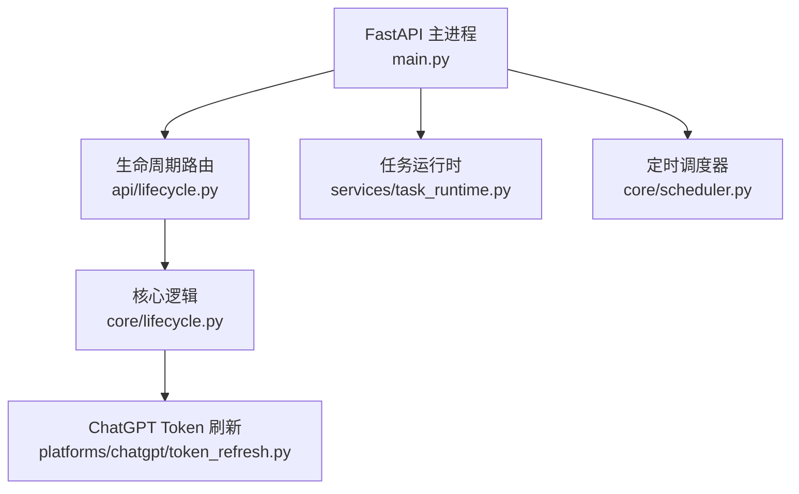
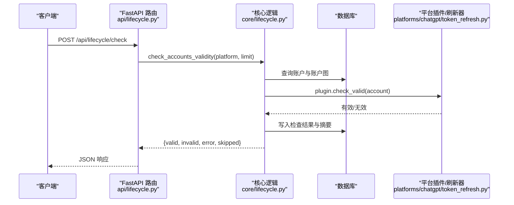
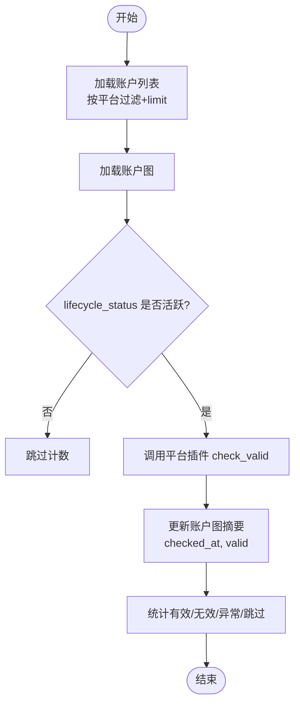
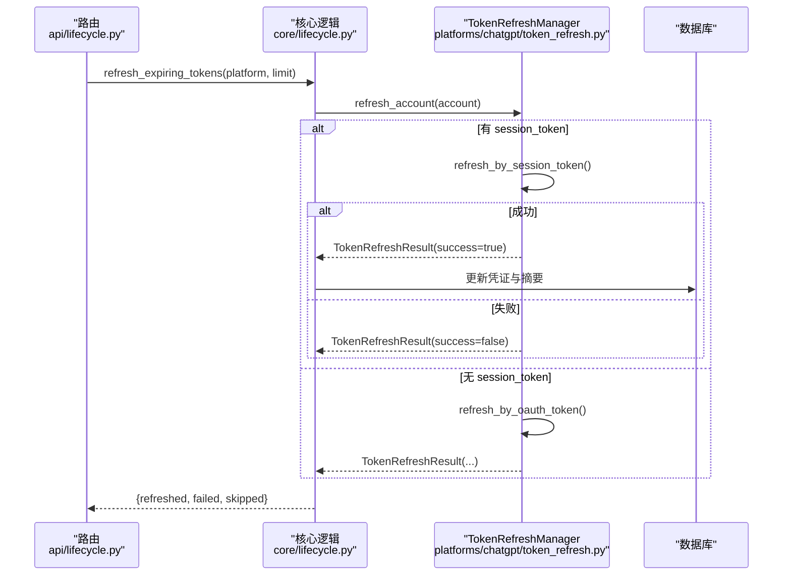
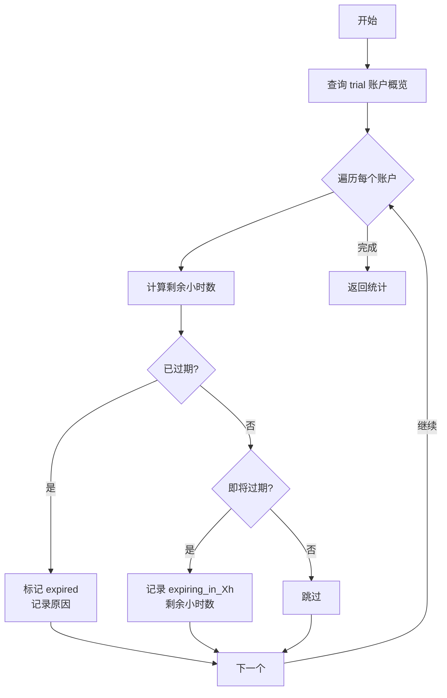
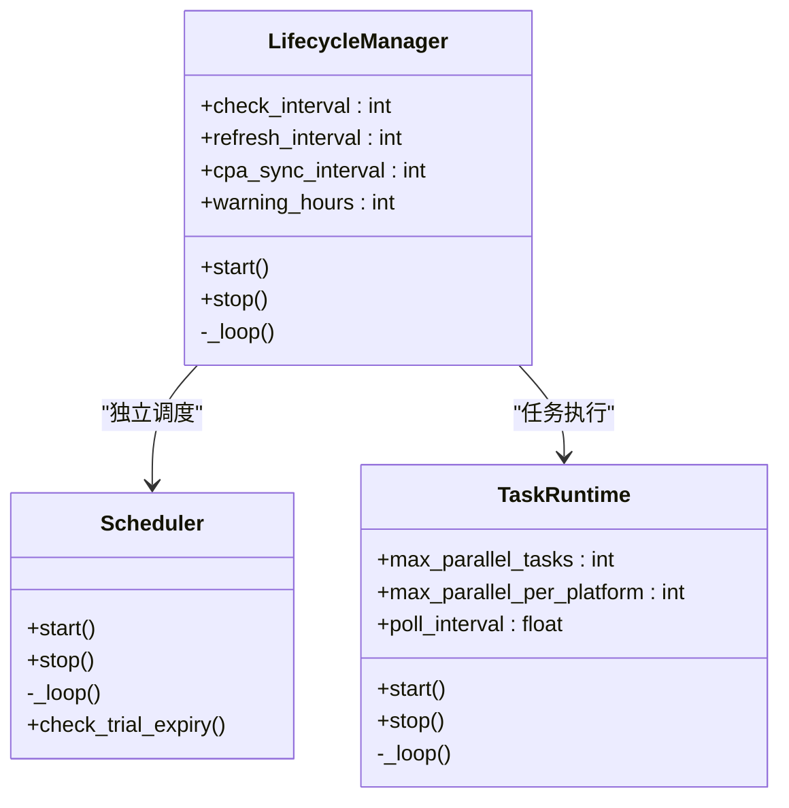
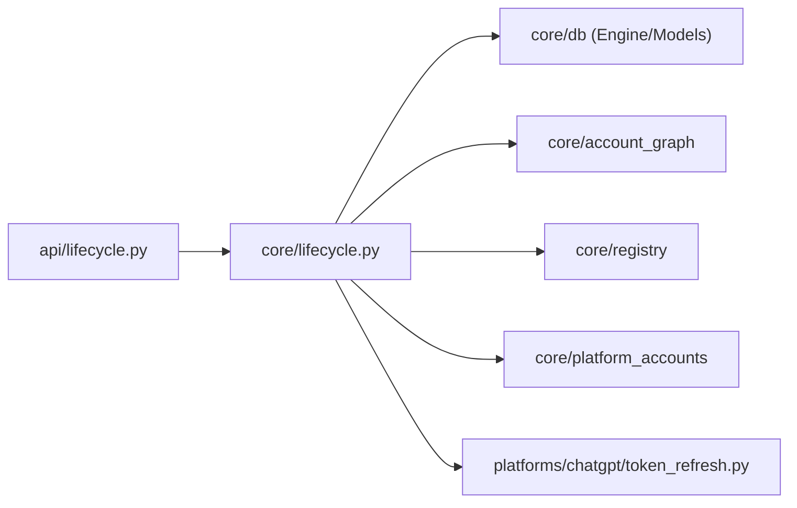

# 生命周期管理

<cite>
**本文引用的文件**
- [main.py](file://main.py)
- [api/lifecycle.py](file://api/lifecycle.py)
- [core/lifecycle.py](file://core/lifecycle.py)
- [platforms/chatgpt/token_refresh.py](file://platforms/chatgpt/token_refresh.py)
- [core/base_platform.py](file://core/base_platform.py)
- [core/scheduler.py](file://core/scheduler.py)
- [services/task_runtime.py](file://services/task_runtime.py)
- [application/account_checks.py](file://application/account_checks.py)
- [api/account_checks.py](file://api/account_checks.py)
</cite>

## 目录
1. [简介](#简介)
2. [项目结构](#项目结构)
3. [核心组件](#核心组件)
4. [架构总览](#架构总览)
5. [详细组件分析](#详细组件分析)
6. [依赖关系分析](#依赖关系分析)
7. [性能考虑](#性能考虑)
8. [故障排查指南](#故障排查指南)
9. [结论](#结论)
10. [附录：API 参考](#附录api-参考)

## 简介
本文件聚焦 Any Auto Register 的“账号生命周期管理”能力，覆盖以下目标：
- 账号有效性检测机制：批量检查、平台过滤、限制控制（limit）
- Token 自动续期流程：过期检测、刷新策略、失败重试与结果持久化
- Trial 过期预警系统：时间阈值配置、预警标记、批量处理
- API 端点说明：请求参数、响应格式、使用示例（含手动触发与自动运行）
- 故障排查：网络超时、认证失败、服务不可用等常见问题的诊断与解决
- 性能优化：批量大小调优、并发控制、资源管理最佳实践

## 项目结构
生命周期管理由 API 层暴露接口，核心逻辑在 core/lifecycle.py 中实现，并通过后台线程调度器周期性执行。Token 刷新针对 ChatGPT 平台提供专用实现，位于 platforms/chatgpt/token_refresh.py。应用启动时通过 main.py 初始化并启动生命周期管理器。

图表来源
- [main.py:67-82](file://main.py#L67-L82)
- [api/lifecycle.py:13-61](file://api/lifecycle.py#L13-L61)
- [core/lifecycle.py:458-527](file://core/lifecycle.py#L458-L527)
- [platforms/chatgpt/token_refresh.py:37-243](file://platforms/chatgpt/token_refresh.py#L37-L243)
- [services/task_runtime.py:18-85](file://services/task_runtime.py#L18-L85)
- [core/scheduler.py:19-42](file://core/scheduler.py#L19-L42)

章节来源
- [main.py:67-82](file://main.py#L67-L82)

## 核心组件
- 生命周期管理器（LifecycleManager）：后台线程循环执行三类任务
  - 每周期：Trial 过期预警扫描
  - 按间隔：账号有效性批量检测
  - 按间隔：Token 自动续期（当前仅支持 chatgpt）
  - 按间隔：CPA 同步（刷新 token + 存活检查 + 上传）
- 账号有效性检测：基于平台插件的 check_valid 方法，结合账户图（account graph）过滤活跃状态
- Token 自动续期：优先 Session Token 刷新，其次 OAuth Refresh Token；成功后更新凭证并记录摘要
- Trial 过期预警：根据 trial_end_time 计算剩余小时数，标记即将过期或已过期
- 任务运行时与调度器：提供异步任务执行与周期性任务调度能力

章节来源
- [core/lifecycle.py:37-97](file://core/lifecycle.py#L37-L97)
- [core/lifecycle.py:104-193](file://core/lifecycle.py#L104-L193)
- [core/lifecycle.py:200-260](file://core/lifecycle.py#L200-L260)
- [core/lifecycle.py:458-527](file://core/lifecycle.py#L458-L527)
- [platforms/chatgpt/token_refresh.py:37-243](file://platforms/chatgpt/token_refresh.py#L37-L243)
- [core/scheduler.py:19-42](file://core/scheduler.py#L19-L42)
- [services/task_runtime.py:18-85](file://services/task_runtime.py#L18-L85)

## 架构总览
生命周期管理的整体调用链如下：
- API 层接收请求，调用 core/lifecycle.py 中的函数
- core/lifecycle.py 通过数据库查询账户、加载账户图、调用平台插件执行具体操作
- Token 刷新委托给 platforms/chatgpt/token_refresh.py 的 TokenRefreshManager
- 后台线程按配置间隔执行检测、续期、预警和 CPA 同步

图表来源
- [api/lifecycle.py:30-34](file://api/lifecycle.py#L30-L34)
- [core/lifecycle.py:37-97](file://core/lifecycle.py#L37-L97)
- [platforms/chatgpt/token_refresh.py:208-243](file://platforms/chatgpt/token_refresh.py#L208-L243)

## 详细组件分析

### 账号有效性检测（批量检查、平台过滤、限制控制）
- 入口：POST /api/lifecycle/check
- 参数：
  - platform: 可选，指定平台过滤
  - limit: 每次最多处理的账户数量
- 流程：
  - 从数据库读取账户并按 created_at/id 排序，限制数量
  - 加载账户图，仅对 lifecycle_status 为 registered/trial/subscribed 的账户执行检测
  - 通过平台插件的 check_valid 判断有效性
  - 更新账户图的 checked_at、valid 以及平台自定义摘要字段
- 返回：{valid, invalid, error, skipped}

图表来源
- [core/lifecycle.py:37-97](file://core/lifecycle.py#L37-L97)

章节来源
- [api/lifecycle.py:30-34](file://api/lifecycle.py#L30-L34)
- [core/lifecycle.py:37-97](file://core/lifecycle.py#L37-L97)

### Token 自动续期（过期检测、刷新策略、失败重试）
- 入口：POST /api/lifecycle/refresh
- 参数：
  - platform: 目前仅支持 chatgpt
  - limit: 每次最多处理的账户数量
- 流程：
  - 读取账户与账户图，仅对活跃状态的 chatgpt 账户处理
  - 提取 credentials 中的 refresh_token/session_token
  - 使用 TokenRefreshManager.refresh_account 进行刷新：
    - 优先尝试 Session Token 刷新
    - 若失败则尝试 OAuth Refresh Token 刷新
  - 成功则更新 access_token/refresh_token，并记录 last_refresh_at、refresh_success
  - 失败累计 failed 计数并记录错误信息
- 返回：{refreshed, failed, skipped}

图表来源
- [api/lifecycle.py:37-41](file://api/lifecycle.py#L37-L41)
- [core/lifecycle.py:104-193](file://core/lifecycle.py#L104-L193)
- [platforms/chatgpt/token_refresh.py:66-206](file://platforms/chatgpt/token_refresh.py#L66-L206)
- [platforms/chatgpt/token_refresh.py:208-243](file://platforms/chatgpt/token_refresh.py#L208-L243)

章节来源
- [api/lifecycle.py:37-41](file://api/lifecycle.py#L37-L41)
- [core/lifecycle.py:104-193](file://core/lifecycle.py#L104-L193)
- [platforms/chatgpt/token_refresh.py:66-206](file://platforms/chatgpt/token_refresh.py#L66-L206)
- [platforms/chatgpt/token_refresh.py:208-243](file://platforms/chatgpt/token_refresh.py#L208-L243)

### Trial 过期预警系统（时间阈值配置、预警通知、批量处理）
- 入口：POST /api/lifecycle/warn
- 参数：
  - hours: 预警阈值（小时），默认 48
- 流程：
  - 读取所有 lifecycle_status=trial 的账户概览
  - 比较 trial_end_time 与当前时间：
    - 已过期：将状态置为 expired，并记录 expiry_warning=expired
    - 即将过期：记录 expiry_warning=expiring_in_{hours_left}h 与剩余小时数
  - 返回统计：{warned, expired, skipped}

图表来源
- [core/lifecycle.py:200-260](file://core/lifecycle.py#L200-L260)

章节来源
- [api/lifecycle.py:44-48](file://api/lifecycle.py#L44-L48)
- [core/lifecycle.py:200-260](file://core/lifecycle.py#L200-L260)

### 自动运行配置（后台线程调度）
- 生命周期管理器在应用启动时启动，后台线程循环执行：
  - 每周期：Trial 过期预警
  - 按 check_interval_hours：账号有效性检测
  - 按 refresh_interval_hours：Token 自动续期
  - 按 cpa_sync_interval_hours：CPA 同步（刷新+检查+上传）
- 可通过 /api/lifecycle/status 查看运行状态与间隔配置

图表来源
- [core/lifecycle.py:458-527](file://core/lifecycle.py#L458-L527)
- [core/scheduler.py:19-42](file://core/scheduler.py#L19-L42)
- [services/task_runtime.py:18-85](file://services/task_runtime.py#L18-L85)

章节来源
- [core/lifecycle.py:458-527](file://core/lifecycle.py#L458-L527)
- [core/scheduler.py:19-42](file://core/scheduler.py#L19-L42)
- [services/task_runtime.py:18-85](file://services/task_runtime.py#L18-L85)

## 依赖关系分析
- API 层依赖 core/lifecycle.py 提供的功能函数
- core/lifecycle.py 依赖：
  - 数据库引擎与模型（AccountModel、AccountOverviewModel）
  - 账户图工具（load_account_graphs、patch_account_graph）
  - 平台注册表（registry.get）获取平台插件
  - 平台账户构建（build_platform_account）
  - 特定平台刷新器（platforms.chatgpt.token_refresh.TokenRefreshManager）
- 任务运行时负责并发执行任务，避免阻塞主线程

图表来源
- [api/lifecycle.py:7-11](file://api/lifecycle.py#L7-L11)
- [core/lifecycle.py:10-16](file://core/lifecycle.py#L10-L16)
- [platforms/chatgpt/token_refresh.py:13-19](file://platforms/chatgpt/token_refresh.py#L13-L19)

章节来源
- [api/lifecycle.py:7-11](file://api/lifecycle.py#L7-L11)
- [core/lifecycle.py:10-16](file://core/lifecycle.py#L10-L16)

## 性能考虑
- 批量大小调优：
  - 有效性检测与 Token 刷新均支持 limit 参数，建议根据服务器负载与外部 API 速率限制调整
  - 默认值：检测 100，刷新 50，CPA 同步 200
- 并发控制：
  - 任务运行时支持最大并行任务数与每平台并行数，避免过度并发导致外部服务限流
  - 生命周期管理器使用单线程循环，避免竞争条件
- 资源管理：
  - 数据库会话在最小范围内打开与提交，减少锁持有时间
  - HTTP 请求设置合理超时，避免长时间阻塞
- 建议：
  - 在高并发场景下降低 limit，增加 poll_interval
  - 对第三方 API 调用实施退避与重试策略（可在上层封装）
  - 监控日志中的 error/fail 指标，及时调整阈值

[本节为通用指导，不直接分析具体文件]

## 故障排查指南
- 网络超时
  - 现象：检测或刷新过程中出现超时异常
  - 排查：检查代理配置、网络连通性、第三方 API 可用性
  - 解决：调整超时时间、更换代理、确认防火墙规则
- 认证失败
  - 现象：Token 刷新返回 401/403，或会话刷新失败
  - 排查：确认 session_token/refresh_token 是否有效，OAuth client_id 是否正确
  - 解决：重新登录获取新凭证，检查权限范围
- 服务不可用
  - 现象：外部 API 返回非 200 状态码或服务宕机
  - 排查：查看响应体 detail 或文本前 80 字符，定位错误原因
  - 解决：等待服务恢复或切换备用通道
- 数据不一致
  - 现象：账户图未正确更新 checked_at/valid/last_refresh_at
  - 排查：检查数据库事务提交与 patch_account_graph 调用
  - 解决：修复异常分支，确保 commit 执行

章节来源
- [core/lifecycle.py:91-93](file://core/lifecycle.py#L91-L93)
- [core/lifecycle.py:187-189](file://core/lifecycle.py#L187-L189)
- [platforms/chatgpt/token_refresh.py:99-132](file://platforms/chatgpt/token_refresh.py#L99-L132)
- [platforms/chatgpt/token_refresh.py:175-206](file://platforms/chatgpt/token_refresh.py#L175-L206)

## 结论
Any Auto Register 的生命周期管理通过清晰的 API 层与核心逻辑分离，实现了账号有效性检测、Token 自动续期与 Trial 过期预警三大能力。其后台线程调度确保了自动化运行，同时提供了手动触发接口便于运维干预。通过合理的批量大小与并发控制，可以在保证稳定性的前提下提升效率。建议在部署环境中结合监控与告警，持续优化阈值与资源使用。

[本节为总结，不直接分析具体文件]

## 附录：API 参考

### 账号有效性检测
- 端点：POST /api/lifecycle/check
- 请求体：
  - platform: string，可选，用于平台过滤
  - limit: integer，默认 100，最大处理账户数
- 响应：
  - ok: boolean
  - data: object
    - valid: integer，有效账户数
    - invalid: integer，失效账户数
    - error: integer，异常账户数
    - skipped: integer，跳过账户数
- 使用示例：
  - 手动触发全量检测：{"platform": "", "limit": 100}
  - 指定平台检测：{"platform": "chatgpt", "limit": 50}

章节来源
- [api/lifecycle.py:16-34](file://api/lifecycle.py#L16-L34)
- [core/lifecycle.py:37-97](file://core/lifecycle.py#L37-L97)

### Token 自动续期
- 端点：POST /api/lifecycle/refresh
- 请求体：
  - platform: string，默认空（当前仅支持 chatgpt）
  - limit: integer，默认 50
- 响应：
  - ok: boolean
  - data: object
    - refreshed: integer，成功刷新数
    - failed: integer，失败数
    - skipped: integer，跳过数
- 使用示例：
  - 手动触发刷新：{"platform": "chatgpt", "limit": 50}

章节来源
- [api/lifecycle.py:21-41](file://api/lifecycle.py#L21-L41)
- [core/lifecycle.py:104-193](file://core/lifecycle.py#L104-L193)
- [platforms/chatgpt/token_refresh.py:66-206](file://platforms/chatgpt/token_refresh.py#L66-L206)

### Trial 过期预警
- 端点：POST /api/lifecycle/warn
- 请求体：
  - hours: integer，默认 48，预警阈值（小时）
- 响应：
  - ok: boolean
  - data: object
    - warned: integer，即将过期账户数
    - expired: integer，已过期账户数
    - skipped: integer，跳过账户数
- 使用示例：
  - 手动触发预警扫描：{"hours": 48}

章节来源
- [api/lifecycle.py:26-48](file://api/lifecycle.py#L26-L48)
- [core/lifecycle.py:200-260](file://core/lifecycle.py#L200-L260)

### 生命周期状态
- 端点：GET /api/lifecycle/status
- 响应：
  - running: boolean，是否运行中
  - check_interval_hours: number，检测间隔（小时）
  - refresh_interval_hours: number，刷新间隔（小时）
  - warning_hours: integer，预警阈值（小时）
- 使用示例：
  - 查看当前运行状态与配置

章节来源
- [api/lifecycle.py:51-61](file://api/lifecycle.py#L51-L61)
- [core/lifecycle.py:458-527](file://core/lifecycle.py#L458-L527)

### 账号检查任务（异步）
- 端点：
  - POST /api/accounts/check-all?platform=...
  - POST /api/accounts/{account_id}/check
- 行为：
  - 创建异步任务并唤醒任务运行时
  - 返回任务信息（id、status 等）
- 使用示例：
  - 全量检查：{"platform": "chatgpt"}
  - 单个检查：传入 account_id

章节来源
- [api/account_checks.py:11-22](file://api/account_checks.py#L11-L22)
- [application/account_checks.py:8-23](file://application/account_checks.py#L8-L23)
- [services/task_runtime.py:18-85](file://services/task_runtime.py#L18-L85)