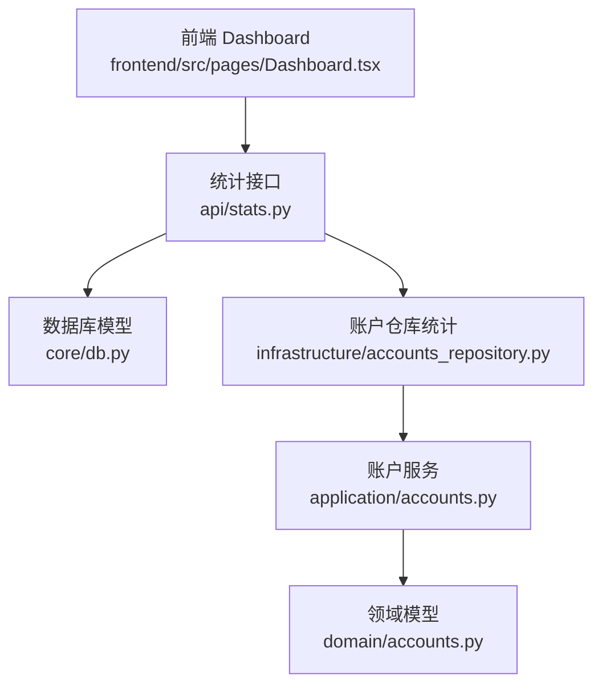
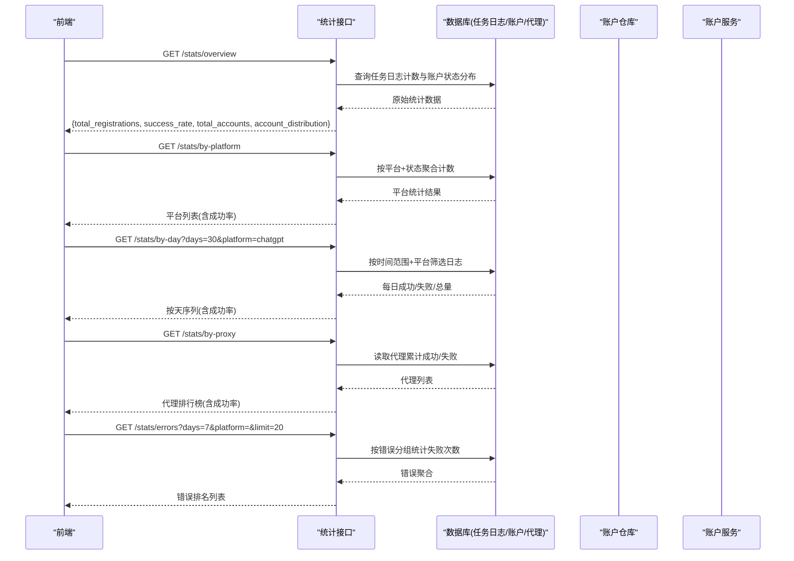
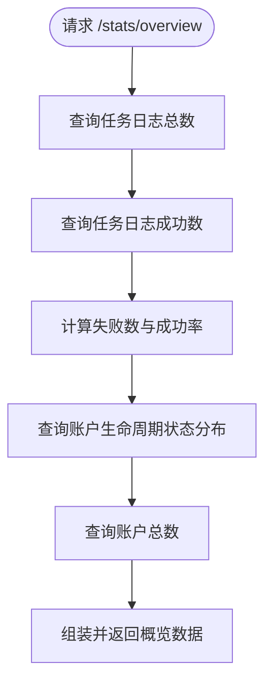
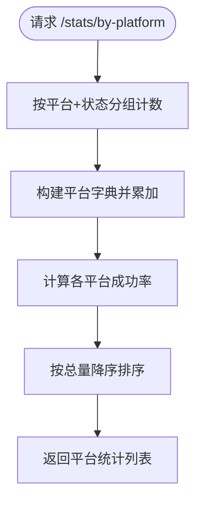
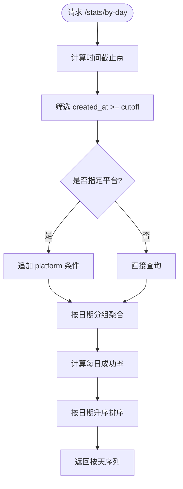
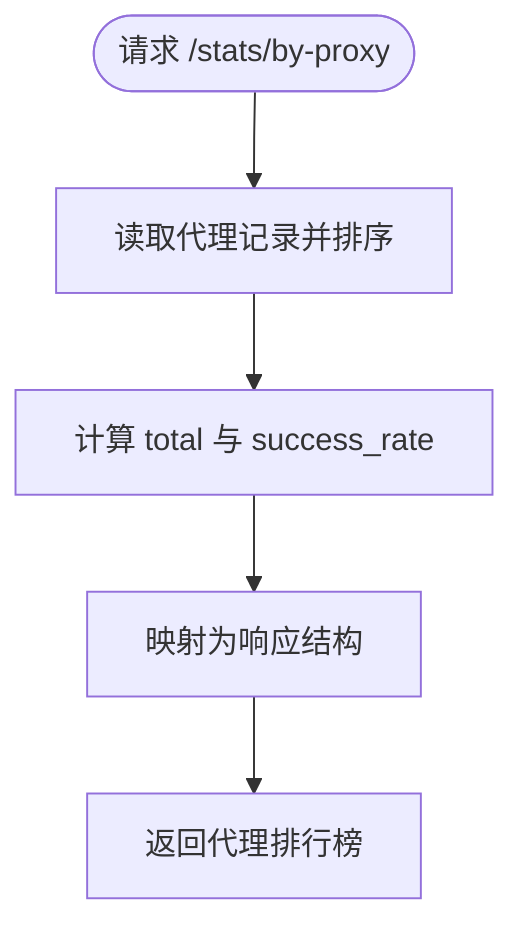
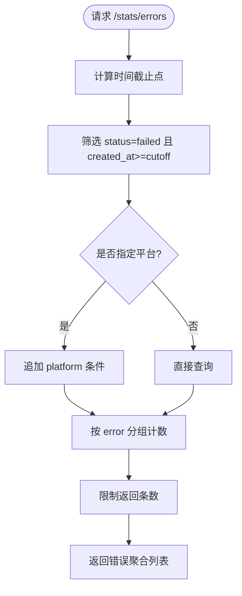
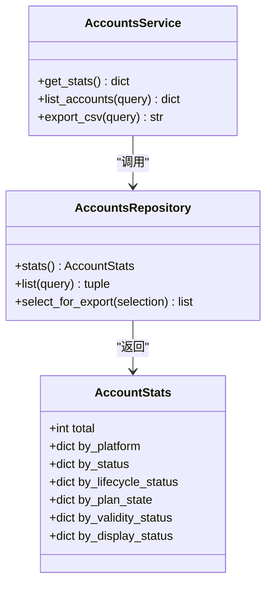
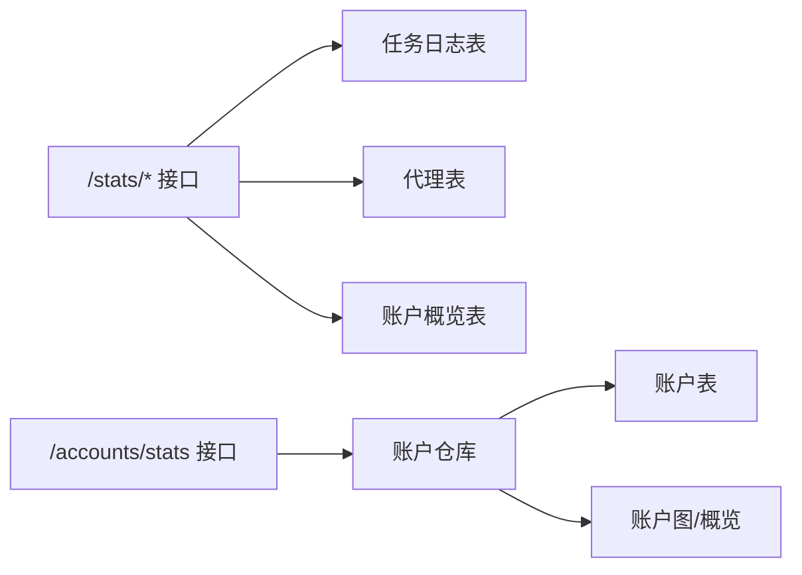

# 统计分析

<cite>
**本文引用的文件**
- [api/stats.py](file://api/stats.py)
- [core/db.py](file://core/db.py)
- [application/accounts.py](file://application/accounts.py)
- [infrastructure/accounts_repository.py](file://infrastructure/accounts_repository.py)
- [domain/accounts.py](file://domain/accounts.py)
- [frontend/src/pages/Dashboard.tsx](file://frontend/src/pages/Dashboard.tsx)
- [tests/test_api_stats.py](file://tests/test_api_stats.py)
</cite>

## 目录
1. [简介](#简介)
2. [项目结构](#项目结构)
3. [核心组件](#核心组件)
4. [架构总览](#架构总览)
5. [详细组件分析](#详细组件分析)
6. [依赖关系分析](#依赖关系分析)
7. [性能考量](#性能考量)
8. [故障排查指南](#故障排查指南)
9. [结论](#结论)
10. [附录：API 接口文档](#附录api-接口文档)

## 简介
本章节面向 Any Auto Register 的“统计分析”能力，覆盖全局概览仪表板、按平台统计、按天趋势分析、代理成功率排行与错误归因分析，并提供 API 接口说明与数据分析最佳实践。系统通过后端 FastAPI 路由聚合任务日志与账户数据，为前端仪表板提供实时指标与可视化数据源。

## 项目结构
统计分析相关代码主要分布在以下层次：
- 接口层（FastAPI）：定义 /stats 系列端点，负责参数校验与响应组装
- 数据模型层：SQLModel 模型定义任务日志、账户概览、代理等表结构
- 应用服务层：账户统计汇总、导出与序列化
- 基础设施层：仓库实现，负责从数据库读取并计算多维统计
- 前端页面：Dashboard 展示账号分布、状态分布与桌面应用状态

图表来源
- [api/stats.py:18-151](file://api/stats.py#L18-L151)
- [core/db.py:229-300](file://core/db.py#L229-L300)
- [infrastructure/accounts_repository.py:334-358](file://infrastructure/accounts_repository.py#L334-L358)
- [application/accounts.py:124-134](file://application/accounts.py#L124-L134)
- [domain/accounts.py:82-90](file://domain/accounts.py#L82-L90)

章节来源
- [api/stats.py:18-151](file://api/stats.py#L18-L151)
- [core/db.py:229-300](file://core/db.py#L229-L300)
- [infrastructure/accounts_repository.py:334-358](file://infrastructure/accounts_repository.py#L334-L358)
- [application/accounts.py:124-134](file://application/accounts.py#L124-L134)
- [domain/accounts.py:82-90](file://domain/accounts.py#L82-L90)
- [frontend/src/pages/Dashboard.tsx:48-78](file://frontend/src/pages/Dashboard.tsx#L48-L78)

## 核心组件
- 全局概览仪表板：返回注册总量、成功/失败数、成功率、活跃账户总数与账户生命周期状态分布
- 按平台统计：按平台维度聚合成功/失败数量与成功率，支持排序
- 按天趋势分析：按日期聚合注册量、成功/失败数与成功率，支持平台过滤
- 代理成功率排行：基于代理表的累计成功/失败计数计算成功率并排序
- 错误归因分析：按错误信息分组统计最近失败次数，支持平台过滤与条数限制

章节来源
- [api/stats.py:18-151](file://api/stats.py#L18-L151)
- [core/db.py:229-300](file://core/db.py#L229-L300)

## 架构总览
统计功能采用“接口层 -> 数据模型/仓库 -> 数据库”的分层架构。接口层仅做轻量聚合与格式化；复杂统计在仓库或服务层完成；数据持久化由 SQLModel 管理。

图表来源
- [api/stats.py:18-151](file://api/stats.py#L18-L151)
- [core/db.py:229-300](file://core/db.py#L229-L300)
- [infrastructure/accounts_repository.py:334-358](file://infrastructure/accounts_repository.py#L334-L358)
- [application/accounts.py:124-134](file://application/accounts.py#L124-L134)

## 详细组件分析

### 全局概览仪表板
- 功能要点
  - 统计总注册数、成功数、失败数与成功率
  - 统计账户总数与生命周期状态分布
- 数据来源
  - 任务日志表用于注册总量与成功率
  - 账户概览表用于账户状态分布
- 输出字段
  - total_registrations、success、failed、success_rate、total_accounts、account_distribution

图表来源
- [api/stats.py:18-52](file://api/stats.py#L18-L52)
- [core/db.py:229-238](file://core/db.py#L229-L238)
- [core/db.py:37-50](file://core/db.py#L37-L50)

章节来源
- [api/stats.py:18-52](file://api/stats.py#L18-L52)
- [core/db.py:229-238](file://core/db.py#L229-L238)
- [core/db.py:37-50](file://core/db.py#L37-L50)

### 按平台统计
- 功能要点
  - 按平台维度聚合成功/失败数量与总量，计算成功率并按总量降序排列
- 数据来源
  - 任务日志表（platform、status）
- 输出字段
  - platform、success、failed、total、success_rate

图表来源
- [api/stats.py:55-80](file://api/stats.py#L55-L80)
- [core/db.py:229-238](file://core/db.py#L229-L238)

章节来源
- [api/stats.py:55-80](file://api/stats.py#L55-L80)
- [core/db.py:229-238](file://core/db.py#L229-L238)

### 按天趋势分析
- 功能要点
  - 按日期聚合注册量、成功/失败数与成功率
  - 支持 days 与 platform 过滤
- 数据来源
  - 任务日志表（created_at、status、platform）
- 输出字段
  - date、success、failed、total、success_rate

图表来源
- [api/stats.py:83-107](file://api/stats.py#L83-L107)
- [core/db.py:229-238](file://core/db.py#L229-L238)

章节来源
- [api/stats.py:83-107](file://api/stats.py#L83-L107)
- [core/db.py:229-238](file://core/db.py#L229-L238)

### 代理成功率排行
- 功能要点
  - 基于代理累计成功/失败计数计算成功率，并按成功数降序展示
- 数据来源
  - 代理表（success_count、fail_count、is_active、region、url）
- 输出字段
  - id、url、region、success、fail、total、success_rate、is_active

图表来源
- [api/stats.py:110-132](file://api/stats.py#L110-L132)
- [core/db.py:291-300](file://core/db.py#L291-L300)

章节来源
- [api/stats.py:110-132](file://api/stats.py#L110-L132)
- [core/db.py:291-300](file://core/db.py#L291-L300)

### 错误归因分析
- 功能要点
  - 按错误信息分组统计最近失败次数，支持平台过滤与条数限制
- 数据来源
  - 任务日志表（error、status、created_at、platform）
- 输出字段
  - error、count

图表来源
- [api/stats.py:135-151](file://api/stats.py#L135-L151)
- [core/db.py:229-238](file://core/db.py#L229-L238)

章节来源
- [api/stats.py:135-151](file://api/stats.py#L135-L151)
- [core/db.py:229-238](file://core/db.py#L229-L238)

### 账户统计与仪表板数据
- 功能要点
  - 账户服务通过仓库统计账户总数与多维度分布（平台、生命周期、套餐、有效性、显示状态）
  - 前端 Dashboard 调用 /accounts/stats 获取数据并渲染平台分布与状态分布
- 数据来源
  - 账户表与账户概览表
- 输出字段
  - total、by_platform、by_status、by_lifecycle_status、by_plan_state、by_validity_status、by_display_status

图表来源
- [application/accounts.py:124-134](file://application/accounts.py#L124-L134)
- [infrastructure/accounts_repository.py:334-358](file://infrastructure/accounts_repository.py#L334-L358)
- [domain/accounts.py:82-90](file://domain/accounts.py#L82-L90)

章节来源
- [application/accounts.py:124-134](file://application/accounts.py#L124-L134)
- [infrastructure/accounts_repository.py:334-358](file://infrastructure/accounts_repository.py#L334-L358)
- [domain/accounts.py:82-90](file://domain/accounts.py#L82-L90)
- [frontend/src/pages/Dashboard.tsx:48-78](file://frontend/src/pages/Dashboard.tsx#L48-L78)

## 依赖关系分析
- 接口层依赖数据库模型进行查询与聚合
- 账户统计依赖仓库与服务层进行数据加载与计算
- 前端依赖后端统计接口与账户统计接口进行渲染

图表来源
- [api/stats.py:18-151](file://api/stats.py#L18-L151)
- [core/db.py:229-300](file://core/db.py#L229-L300)
- [infrastructure/accounts_repository.py:334-358](file://infrastructure/accounts_repository.py#L334-L358)

章节来源
- [api/stats.py:18-151](file://api/stats.py#L18-L151)
- [core/db.py:229-300](file://core/db.py#L229-L300)
- [infrastructure/accounts_repository.py:334-358](file://infrastructure/accounts_repository.py#L334-L358)

## 性能考量
- 使用数据库级聚合（GROUP BY、COUNT）减少内存处理开销
- 按天趋势与错误归因通过时间范围与平台过滤降低扫描量
- 代理排行基于预存计数字段，避免运行时重复计算
- 建议对常用过滤字段建立索引（如 created_at、platform、status），提升查询效率
- 大数据量场景可考虑分页或增量聚合策略

[本节为通用性能建议，不直接分析具体文件]

## 故障排查指南
- 常见问题
  - 空数据：当无任务日志或账户时，概览与趋势接口返回零值或空数组
  - 平台过滤无效：确认传入的 platform 名称与日志中的 platform 一致
  - 错误聚合为空：检查是否存在非空 error 字段且状态为 failed 的记录
- 验证方式
  - 使用测试用例验证空数据场景下的返回结构与字段
  - 通过添加代理后验证代理排行接口返回

章节来源
- [tests/test_api_stats.py:5-48](file://tests/test_api_stats.py#L5-L48)

## 结论
Any Auto Register 的统计分析模块以清晰的接口分层与数据库聚合为核心，提供全局概览、平台对比、时间趋势、代理排行与错误归因等关键能力。配合前端仪表板，可实现对注册表现与运行状态的实时监控与问题定位。建议在数据规模增长时关注索引与查询优化，确保稳定性与性能。

[本节为总结性内容，不直接分析具体文件]

## 附录：API 接口文档

### 全局概览
- 路径：GET /api/stats/overview
- 功能：返回总注册数、成功/失败数、成功率、账户总数与账户生命周期状态分布
- 响应字段
  - total_registrations：总注册数
  - success：成功数
  - failed：失败数
  - success_rate：成功率（百分比）
  - total_accounts：账户总数
  - account_distribution：生命周期状态分布键值对

章节来源
- [api/stats.py:18-52](file://api/stats.py#L18-L52)

### 按平台统计
- 路径：GET /api/stats/by-platform
- 功能：按平台维度统计成功/失败数量与成功率，按总量降序
- 响应字段
  - platform：平台名
  - success：成功数
  - failed：失败数
  - total：总量
  - success_rate：成功率（百分比）

章节来源
- [api/stats.py:55-80](file://api/stats.py#L55-L80)

### 按天趋势
- 路径：GET /api/stats/by-day
- 查询参数
  - days：天数（默认 30）
  - platform：平台过滤（可选）
- 功能：按日期聚合注册量、成功/失败数与成功率
- 响应字段
  - date：日期
  - success：成功数
  - failed：失败数
  - total：总量
  - success_rate：成功率（百分比）

章节来源
- [api/stats.py:83-107](file://api/stats.py#L83-L107)

### 代理排行榜
- 路径：GET /api/stats/by-proxy
- 功能：返回代理成功率排行
- 响应字段
  - id：代理ID
  - url：代理地址
  - region：地区
  - success：成功数
  - fail：失败数
  - total：总量
  - success_rate：成功率（百分比）
  - is_active：是否启用

章节来源
- [api/stats.py:110-132](file://api/stats.py#L110-L132)
- [core/db.py:291-300](file://core/db.py#L291-L300)

### 错误归因
- 路径：GET /api/stats/errors
- 查询参数
  - days：天数（默认 7）
  - platform：平台过滤（可选）
  - limit：返回条数上限（默认 20）
- 功能：按错误信息分组统计最近失败次数
- 响应字段
  - error：错误信息
  - count：出现次数

章节来源
- [api/stats.py:135-151](file://api/stats.py#L135-L151)

### 账户统计（仪表板数据）
- 路径：GET /api/accounts/stats
- 功能：返回账户总数与多维度分布（平台、状态、生命周期、套餐、有效性、显示状态）
- 响应字段
  - total：账户总数
  - by_platform：平台分布
  - by_status：显示状态分布
  - by_lifecycle_status：生命周期状态分布
  - by_plan_state：套餐状态分布
  - by_validity_status：有效性状态分布
  - by_display_status：显示状态分布（同 by_status）

章节来源
- [application/accounts.py:124-134](file://application/accounts.py#L124-L134)
- [infrastructure/accounts_repository.py:334-358](file://infrastructure/accounts_repository.py#L334-L358)
- [domain/accounts.py:82-90](file://domain/accounts.py#L82-L90)

### 数据导出与自定义报表
- CSV 导出
  - 路径：GET /api/accounts/export
  - 查询参数：platform、status
  - 说明：导出当前筛选条件下的账户清单
- JSON 批量导出
  - 路径：POST /api/accounts/export/json
  - 请求体：platform、ids、select_all、status_filter、search_filter
  - 说明：按选择条件导出 ChatGPT JSON 格式
- 其他格式导出
  - 路径：POST /api/accounts/export/csv、/sub2api、/cpa、/kiro-go、/any2api
  - 说明：针对不同平台的批量导出格式

章节来源
- [api/accounts.py:100-200](file://api/accounts.py#L100-L200)

### 数据分析最佳实践
- 数据导出
  - 使用 CSV/JSON 导出进行离线分析与报表生成
  - 结合平台与状态过滤器精准选取数据集
- 自定义报表
  - 基于按天趋势与错误归因数据，识别周期性波动与异常峰值
  - 结合平台统计与代理排行，评估不同渠道与网络配置的影响
- 性能优化
  - 合理设置 days 与 limit 参数，避免过大查询范围
  - 利用平台过滤缩小数据面，提高响应速度
  - 定期清理历史日志或归档至冷存储，保持主库轻量化

[本节为通用实践建议，不直接分析具体文件]