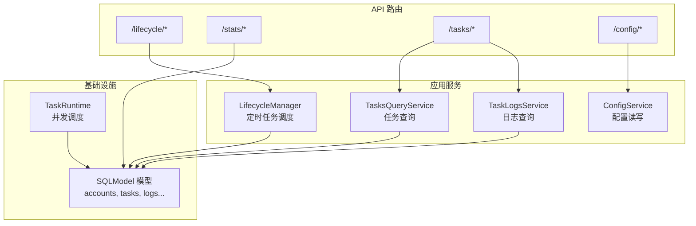
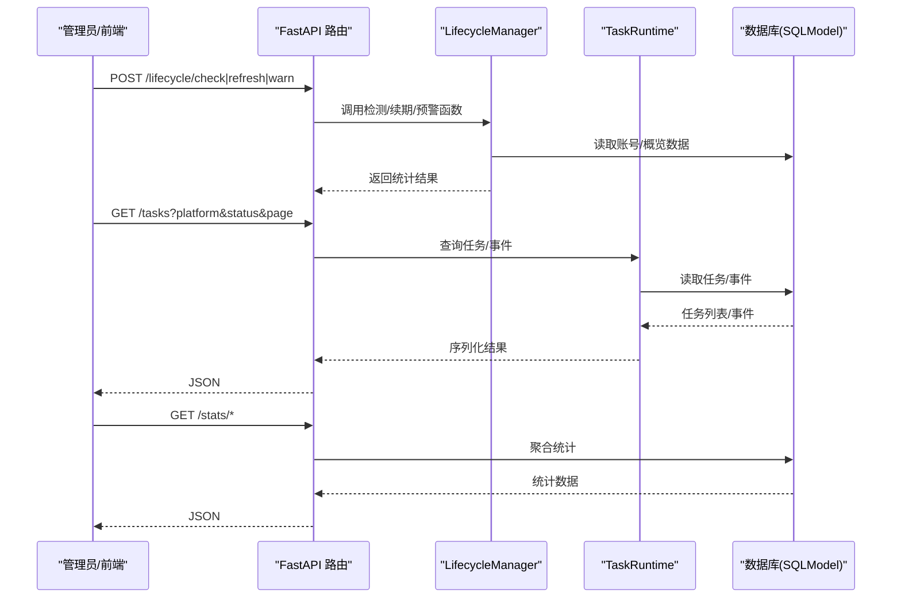
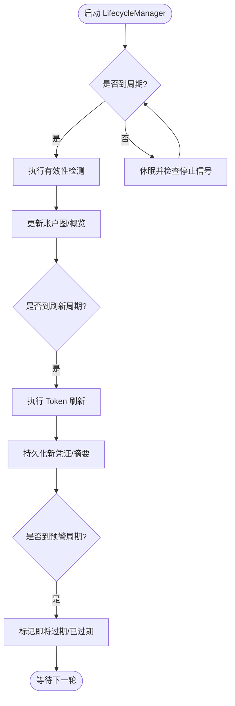
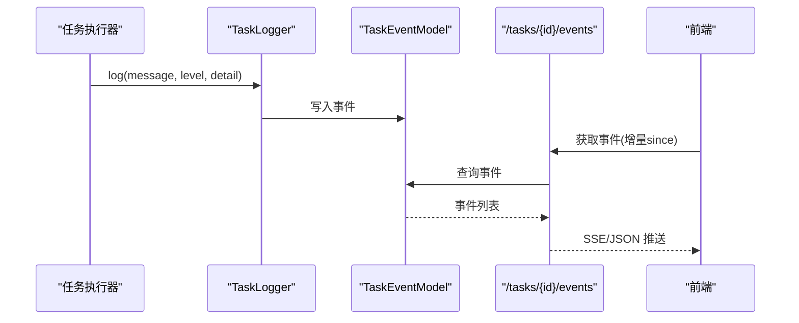
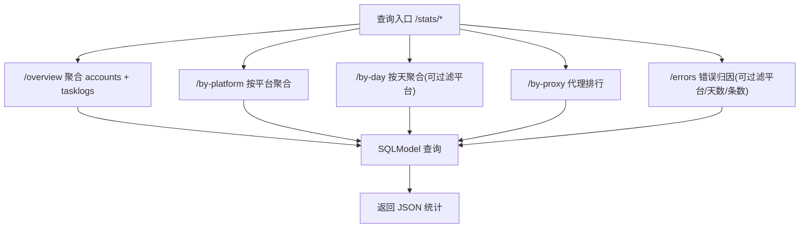
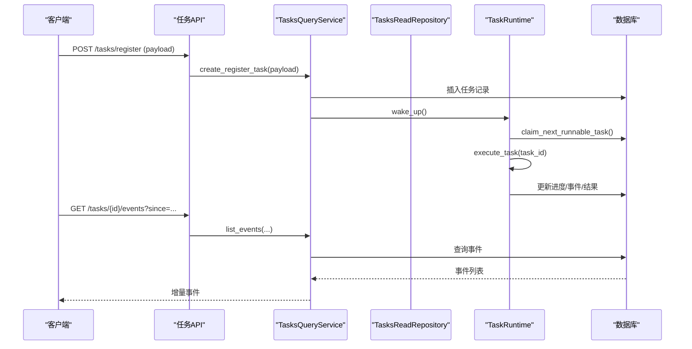
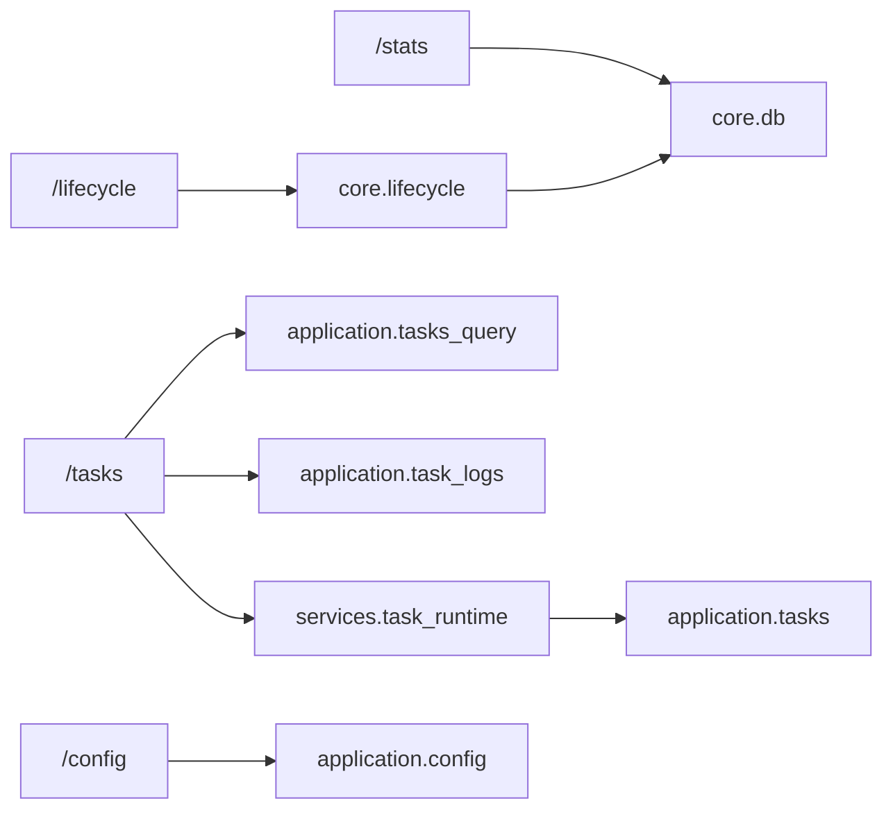

# 运营管理功能

<cite>
**本文引用的文件**
- [api/lifecycle.py](file://api/lifecycle.py)
- [core/lifecycle.py](file://core/lifecycle.py)
- [api/stats.py](file://api/stats.py)
- [core/db.py](file://core/db.py)
- [application/tasks_query.py](file://application/tasks_query.py)
- [application/task_logs.py](file://application/task_logs.py)
- [api/tasks.py](file://api/tasks.py)
- [api/task_logs.py](file://api/task_logs.py)
- [application/tasks.py](file://application/tasks.py)
- [services/task_runtime.py](file://services/task_runtime.py)
- [api/config.py](file://api/config.py)
- [application/config.py](file://application/config.py)
</cite>

## 目录
1. [简介](#简介)
2. [项目结构](#项目结构)
3. [核心组件](#核心组件)
4. [架构总览](#架构总览)
5. [详细组件分析](#详细组件分析)
6. [依赖关系分析](#依赖关系分析)
7. [性能考虑](#性能考虑)
8. [故障排查指南](#故障排查指南)
9. [结论](#结论)
10. [附录：API与配置参考](#附录api与配置参考)

## 简介
本文件面向 Any Auto Register 的“运营管理”能力，覆盖以下关键主题：
- 生命周期管理：定时有效性检测、Token 自动续期、Trial 过期预警
- 风险中心：集中告警机制（基于任务事件与统计聚合）
- 成功率统计：全局概览、按平台统计、按天趋势、代理成功率排行、错误归因分析
- 任务队列：批量注册、历史查询、实时进度、单任务日志

文档提供各功能的 API 接口、配置参数、监控指标与故障排查方法，并给出使用场景与性能优化建议，帮助用户高效管理与监控注册任务的运行状态。

## 项目结构
运营管理的后端由 FastAPI 路由层、应用服务层、基础设施与核心运行时组成：
- 路由层：暴露 /lifecycle、/stats、/tasks、/config 等 REST 接口
- 应用服务层：封装任务编排、查询与日志服务
- 基础设施：数据库模型、仓库与运行时调度
- 核心运行时：生命周期管理器、任务执行器

图表来源
- [api/lifecycle.py:1-61](file://api/lifecycle.py#L1-L61)
- [api/stats.py:1-152](file://api/stats.py#L1-L152)
- [api/tasks.py:1-30](file://api/tasks.py#L1-L30)
- [api/task_logs.py:1-14](file://api/task_logs.py#L1-L14)
- [api/config.py:1-28](file://api/config.py#L1-L28)
- [core/lifecycle.py:458-528](file://core/lifecycle.py#L458-L528)
- [services/task_runtime.py:18-102](file://services/task_runtime.py#L18-L102)
- [core/db.py:25-200](file://core/db.py#L25-L200)

章节来源
- [api/lifecycle.py:1-61](file://api/lifecycle.py#L1-L61)
- [api/stats.py:1-152](file://api/stats.py#L1-L152)
- [api/tasks.py:1-30](file://api/tasks.py#L1-L30)
- [api/task_logs.py:1-14](file://api/task_logs.py#L1-L14)
- [core/lifecycle.py:458-528](file://core/lifecycle.py#L458-L528)
- [services/task_runtime.py:18-102](file://services/task_runtime.py#L18-L102)
- [core/db.py:25-200](file://core/db.py#L25-L200)

## 核心组件
- 生命周期管理器：后台线程周期性执行有效性检测、Token 刷新、Trial 过期预警与 CPA 同步
- 任务运行时：单进程内并发调度任务，支持并行度控制与平台级限流
- 统计服务：从数据库聚合全局/平台/日期/代理维度的成功率与错误分布
- 任务查询与日志服务：提供任务列表、事件流与日志分页查询
- 配置服务：统一读取与更新系统配置项

章节来源
- [core/lifecycle.py:458-528](file://core/lifecycle.py#L458-L528)
- [services/task_runtime.py:18-102](file://services/task_runtime.py#L18-L102)
- [api/stats.py:1-152](file://api/stats.py#L1-L152)
- [application/tasks_query.py:1-68](file://application/tasks_query.py#L1-L68)
- [application/task_logs.py:1-29](file://application/task_logs.py#L1-L29)
- [application/config.py:1-21](file://application/config.py#L1-L21)

## 架构总览
运营管理的请求-处理-存储链路如下：
- 生命周期 API 触发后台任务（检测/续期/预警）
- 任务 API 创建/查询任务，任务运行时拉取待执行任务并执行
- 统计 API 直接查询数据库聚合结果
- 配置 API 读写配置项

图表来源
- [api/lifecycle.py:30-61](file://api/lifecycle.py#L30-L61)
- [core/lifecycle.py:37-260](file://core/lifecycle.py#L37-L260)
- [api/tasks.py:11-29](file://api/tasks.py#L11-L29)
- [application/tasks_query.py:11-68](file://application/tasks_query.py#L11-L68)
- [services/task_runtime.py:47-102](file://services/task_runtime.py#L47-L102)
- [api/stats.py:18-152](file://api/stats.py#L18-L152)

## 详细组件分析

### 生命周期管理
- 定时有效性检测：扫描活跃状态的账号，调用平台插件验证有效性，更新账户图与概览
- Token 自动续期：针对特定平台（如 ChatGPT）在到期前刷新 token，并持久化新凭证
- Trial 过期预警：扫描 trial 状态账号，标记即将过期或已过期，写入摘要字段便于前端展示
- 后台循环：LifecycleManager 维护检查/刷新/CPA 同步的间隔，并在异常时记录日志

图表来源
- [core/lifecycle.py:458-528](file://core/lifecycle.py#L458-L528)
- [core/lifecycle.py:37-97](file://core/lifecycle.py#L37-L97)
- [core/lifecycle.py:104-193](file://core/lifecycle.py#L104-L193)
- [core/lifecycle.py:200-260](file://core/lifecycle.py#L200-L260)

章节来源
- [api/lifecycle.py:30-61](file://api/lifecycle.py#L30-L61)
- [core/lifecycle.py:37-260](file://core/lifecycle.py#L37-L260)
- [core/lifecycle.py:458-528](file://core/lifecycle.py#L458-L528)

### 风险中心（集中告警机制）
- 任务事件：每个任务在执行过程中通过 TaskLogger 记录事件（状态变更、错误、进度），支持级别与详情
- 统计聚合：错误归因按错误信息分组，结合平台过滤，快速定位高频失败原因
- 前端展示：通过 DisplayWarnings 等组件渲染警告卡片，直观呈现风险

图表来源
- [application/tasks.py:371-457](file://application/tasks.py#L371-L457)
- [application/tasks_query.py:25-41](file://application/tasks_query.py#L25-L41)
- [api/tasks.py:24-29](file://api/tasks.py#L24-L29)

章节来源
- [application/tasks.py:371-457](file://application/tasks.py#L371-L457)
- [application/tasks_query.py:25-41](file://application/tasks_query.py#L25-L41)
- [api/tasks.py:24-29](file://api/tasks.py#L24-L29)

### 成功率统计
- 全局概览：总注册数、成功/失败数、成功率、账号状态分布、账号总数
- 按平台统计：按平台维度聚合成功/失败/总数与成功率
- 按天趋势：最近 N 天的注册趋势，支持平台过滤
- 代理成功率排行：按代理的成功/失败计数排序，计算成功率
- 错误归因分析：最近 N 天失败错误按消息分组计数，支持平台过滤与条数限制

图表来源
- [api/stats.py:18-152](file://api/stats.py#L18-L152)
- [core/db.py:25-200](file://core/db.py#L25-L200)

章节来源
- [api/stats.py:18-152](file://api/stats.py#L18-L152)
- [core/db.py:25-200](file://core/db.py#L25-L200)

### 任务队列
- 批量注册：通过 create_register_task 创建任务，支持 count 与 concurrency；内部使用线程池并发执行
- 历史查询：list_tasks 支持平台、状态、分页；get_task 获取单个任务详情
- 实时进度：list_task_events 支持 since 增量拉取；SSE 流式推送（在命令服务中实现）
- 单任务日志：task_logs 列表接口支持平台过滤与分页

图表来源
- [application/tasks.py:201-246](file://application/tasks.py#L201-L246)
- [application/tasks_query.py:11-68](file://application/tasks_query.py#L11-L68)
- [services/task_runtime.py:47-102](file://services/task_runtime.py#L47-L102)
- [api/tasks.py:11-29](file://api/tasks.py#L11-L29)

章节来源
- [application/tasks.py:201-246](file://application/tasks.py#L201-L246)
- [application/tasks_query.py:11-68](file://application/tasks_query.py#L11-L68)
- [services/task_runtime.py:47-102](file://services/task_runtime.py#L47-L102)
- [api/tasks.py:11-29](file://api/tasks.py#L11-L29)

## 依赖关系分析
- 路由层依赖应用服务与基础设施：
  - /lifecycle 依赖 core.lifecycle 的生命周期函数与数据库模型
  - /stats 依赖 core.db 的 TaskLog、ProxyModel、AccountModel、AccountOverviewModel
  - /tasks 依赖 application.tasks_query、application.task_logs、services.task_runtime
  - /config 依赖 application.config 与 infrastructure.config_repository
- 运行时依赖：
  - TaskRuntime 负责并发调度，调用 application.tasks 中的任务执行逻辑
  - LifecycleManager 在后台线程中周期性调用检测/续期/预警函数

图表来源
- [api/lifecycle.py:1-61](file://api/lifecycle.py#L1-L61)
- [api/stats.py:1-152](file://api/stats.py#L1-L152)
- [api/tasks.py:1-30](file://api/tasks.py#L1-L30)
- [api/task_logs.py:1-14](file://api/task_logs.py#L1-L14)
- [api/config.py:1-28](file://api/config.py#L1-L28)
- [core/lifecycle.py:458-528](file://core/lifecycle.py#L458-L528)
- [services/task_runtime.py:18-102](file://services/task_runtime.py#L18-L102)
- [application/tasks_query.py:1-68](file://application/tasks_query.py#L1-68)
- [application/task_logs.py:1-29](file://application/task_logs.py#L1-29)
- [application/config.py:1-21](file://application/config.py#L1-21)

章节来源
- [api/lifecycle.py:1-61](file://api/lifecycle.py#L1-L61)
- [api/stats.py:1-152](file://api/stats.py#L1-L152)
- [api/tasks.py:1-30](file://api/tasks.py#L1-L30)
- [api/task_logs.py:1-14](file://api/task_logs.py#L1-L14)
- [api/config.py:1-28](file://api/config.py#L1-L28)
- [core/lifecycle.py:458-528](file://core/lifecycle.py#L458-L528)
- [services/task_runtime.py:18-102](file://services/task_runtime.py#L18-L102)
- [application/tasks_query.py:1-68](file://application/tasks_query.py#L1-68)
- [application/task_logs.py:1-29](file://application/task_logs.py#L1-29)
- [application/config.py:1-21](file://application/config.py#L1-21)

## 性能考虑
- 并发与限流
  - TaskRuntime 支持最大并行任务数与每平台并行上限，避免对单一平台造成压力
  - 任务拉取时根据 running_platform_counts 与 busy_account_keys 进行去重与限流
- 批量操作
  - 批量注册通过 count 与 concurrency 控制总体吞吐，内部线程池提交任务
  - 有效性检测与 Token 刷新支持 limit 参数，避免一次性扫描过多账号
- 数据库访问
  - 统计接口使用 SQLModel 聚合查询，减少内存处理开销
  - 任务事件与日志分页查询，降低单次响应体积
- 网络与外部依赖
  - CPA 同步与外部 API 调用设置超时与重试策略（在实现中体现）
  - 代理池报告成功/失败，动态调整代理可用性

[本节为通用性能讨论，不直接分析具体文件]

## 故障排查指南
- 任务中断与恢复
  - 服务重启后，未完成的任务会被标记为 interrupted，并追加事件说明
- 取消任务
  - 支持在 pending/claimed/running/cancel_requested 状态下请求取消，最终状态为 cancelled
- 常见错误定位
  - 使用 /stats/errors 聚合最近失败错误，结合平台过滤快速定位问题
  - 查看任务事件流 /tasks/{id}/events，关注 error 级别事件与 detail 字段
- 生命周期异常
  - 检测/续期/预警过程捕获异常并记录日志，返回统计结果便于评估影响范围
- 配置问题
  - 通过 /config/options 获取可用配置项与默认值，确保 provider 配置正确启用

章节来源
- [application/tasks.py:296-338](file://application/tasks.py#L296-L338)
- [api/stats.py:135-152](file://api/stats.py#L135-L152)
- [api/tasks.py:24-29](file://api/tasks.py#L24-L29)
- [core/lifecycle.py:91-97](file://core/lifecycle.py#L91-L97)
- [core/lifecycle.py:187-193](file://core/lifecycle.py#L187-L193)
- [core/lifecycle.py:258-260](file://core/lifecycle.py#L258-L260)
- [api/config.py:16-28](file://api/config.py#L16-L28)

## 结论
Any Auto Register 的运营管理模块以清晰的层次化设计实现了生命周期管理、风险告警、统计分析与任务队列能力。通过后台定时任务与前台 API 的结合，用户能够：
- 自动化维护账号有效性与 Token 续期，降低人工运维成本
- 集中监控风险与错误，快速定位与处置问题
- 多维度统计成功率与趋势，辅助业务决策
- 灵活创建与监控批量注册任务，提升注册效率

建议在大规模使用时合理设置并发与限流参数，并结合代理池与外部服务超时配置，以获得稳定与高效的运行效果。

[本节为总结性内容，不直接分析具体文件]

## 附录：API与配置参考

### 生命周期管理 API
- POST /lifecycle/check
  - 请求体：platform（可选）、limit（默认 100）
  - 作用：手动触发账号有效性批量检测
- POST /lifecycle/refresh
  - 请求体：platform（可选）、limit（默认 50）
  - 作用：手动触发 Token 批量刷新
- POST /lifecycle/warn
  - 请求体：hours（默认 48）
  - 作用：手动触发 Trial 过期预警扫描
- GET /lifecycle/status
  - 作用：返回生命周期管理器运行状态与间隔配置

章节来源
- [api/lifecycle.py:16-61](file://api/lifecycle.py#L16-L61)
- [core/lifecycle.py:37-260](file://core/lifecycle.py#L37-L260)
- [core/lifecycle.py:458-528](file://core/lifecycle.py#L458-L528)

### 成功率统计 API
- GET /stats/overview
  - 作用：全局概览（总注册数、成功率、账号状态分布、账号总数）
- GET /stats/by-platform
  - 作用：按平台统计成功率
- GET /stats/by-day?days=30&platform=
  - 作用：按天统计注册趋势，支持平台过滤
- GET /stats/by-proxy
  - 作用：代理成功率排行
- GET /stats/errors?days=7&platform=&limit=20
  - 作用：最近失败错误聚合，支持平台过滤与条数限制

章节来源
- [api/stats.py:18-152](file://api/stats.py#L18-L152)

### 任务队列 API
- GET /tasks?platform=&status=&page=1&page_size=50
  - 作用：任务列表查询（支持平台、状态、分页）
- GET /tasks/{task_id}
  - 作用：获取单个任务详情
- GET /tasks/{task_id}/events?since=0&limit=200
  - 作用：获取任务事件（支持增量 since）
- GET /tasks/logs?platform=&page=1&page_size=50
  - 作用：任务日志列表（支持平台过滤与分页）

章节来源
- [api/tasks.py:11-29](file://api/tasks.py#L11-L29)
- [api/task_logs.py:11-14](file://api/task_logs.py#L1-L14)
- [application/tasks_query.py:11-68](file://application/tasks_query.py#L11-L68)
- [application/task_logs.py:11-29](file://application/task_logs.py#L11-L29)

### 配置 API
- GET /config
  - 作用：读取当前配置
- GET /config/options
  - 作用：获取配置选项与默认值
- PUT /config
  - 请求体：data（键值对）
  - 作用：更新配置

章节来源
- [api/config.py:16-28](file://api/config.py#L16-L28)
- [application/config.py:9-21](file://application/config.py#L9-L21)

### 关键配置参数（运行时）
- 任务运行时
  - max_parallel_tasks：最大并行任务数
  - max_parallel_per_platform：每平台最大并行数
  - poll_interval：轮询间隔（秒）
- 生命周期管理器
  - check_interval_hours：有效性检测间隔（小时）
  - refresh_interval_hours：Token 刷新间隔（小时）
  - cpa_sync_interval_hours：CPA 同步间隔（小时）
  - warning_hours：Trial 过期预警阈值（小时）

章节来源
- [services/task_runtime.py:18-22](file://services/task_runtime.py#L18-L22)
- [core/lifecycle.py:461-472](file://core/lifecycle.py#L461-L472)

### 监控指标与告警要点
- 任务事件级别：info、warning、error
- 任务状态：pending、claimed、running、succeeded、failed、interrupted、cancel_requested、cancelled
- 统计指标：成功率、失败率、代理成功率、错误聚合计数
- 生命周期指标：检测通过率、刷新成功率、预警数量

章节来源
- [application/tasks.py:31-50](file://application/tasks.py#L31-L50)
- [application/tasks.py:371-457](file://application/tasks.py#L371-L457)
- [api/stats.py:18-152](file://api/stats.py#L18-L152)
- [core/lifecycle.py:458-528](file://core/lifecycle.py#L458-L528)