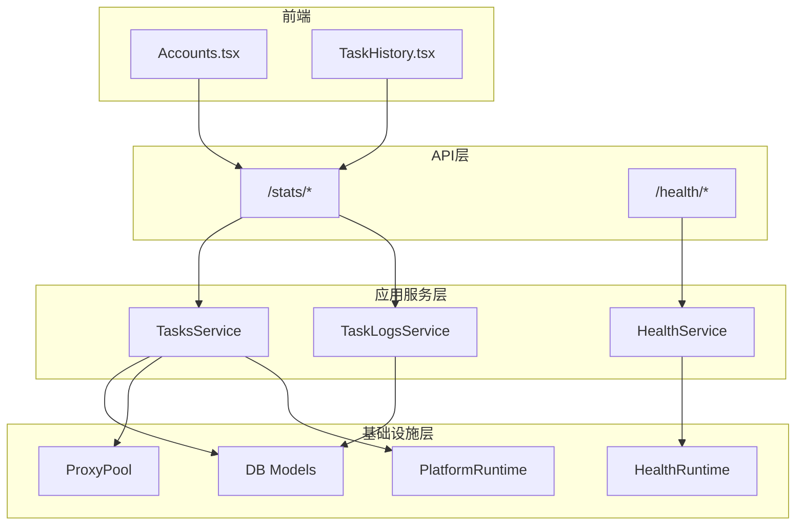
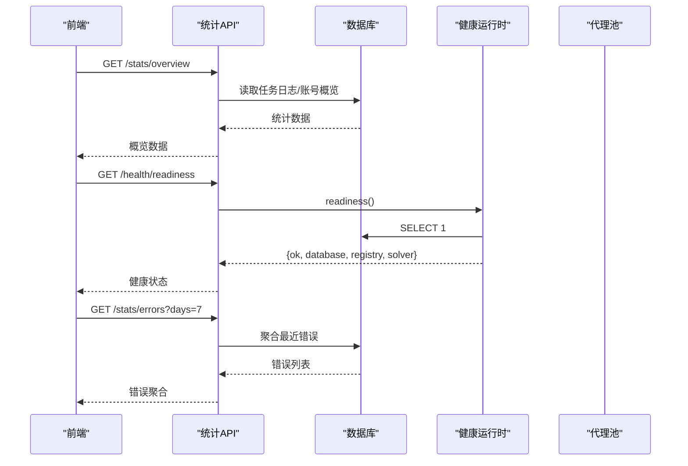
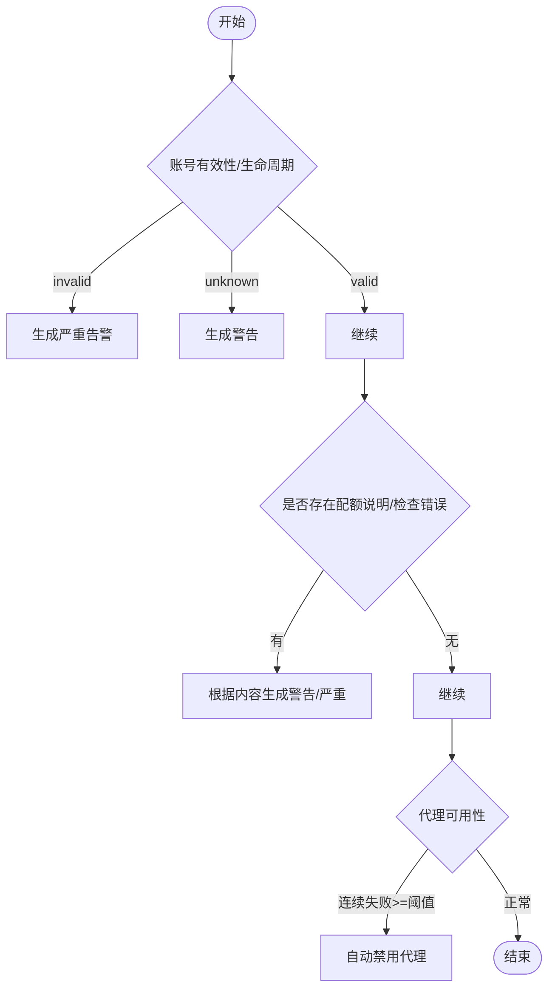
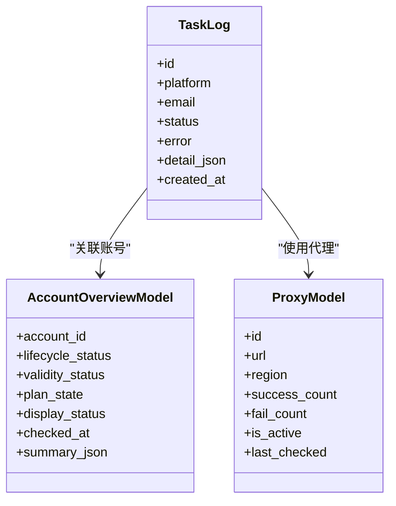
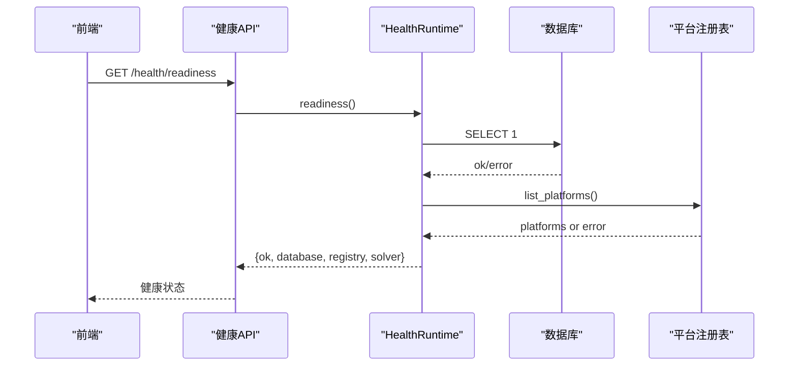
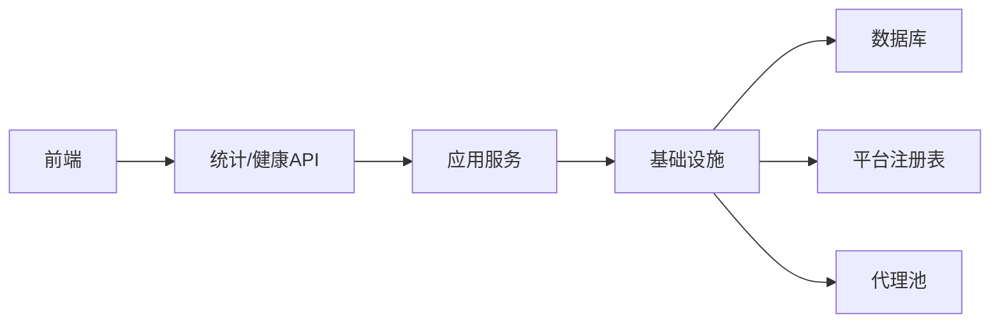

# 风险中心

<cite>
**本文引用的文件**
- [api/stats.py](file://api/stats.py)
- [application/health.py](file://application/health.py)
- [infrastructure/health_runtime.py](file://infrastructure/health_runtime.py)
- [core/account_display.py](file://core/account_display.py)
- [core/db.py](file://core/db.py)
- [application/tasks.py](file://application/tasks.py)
- [application/task_logs.py](file://application/task_logs.py)
- [infrastructure/task_logs_repository.py](file://infrastructure/task_logs_repository.py)
- [core/proxy_pool.py](file://core/proxy_pool.py)
- [domain/proxies.py](file://domain/proxies.py)
- [application/proxies.py](file://application/proxies.py)
- [infrastructure/platform_runtime.py](file://infrastructure/platform_runtime.py)
- [platforms/kiro/switch.py](file://platforms/kiro/switch.py)
- [frontend/src/pages/Accounts.tsx](file://frontend/src/pages/Accounts.tsx)
- [frontend/src/pages/TaskHistory.tsx](file://frontend/src/pages/TaskHistory.tsx)
</cite>

## 目录
1. [简介](#简介)
2. [项目结构](#项目结构)
3. [核心组件](#核心组件)
4. [架构总览](#架构总览)
5. [详细组件分析](#详细组件分析)
6. [依赖关系分析](#依赖关系分析)
7. [性能考量](#性能考量)
8. [故障排查指南](#故障排查指南)
9. [结论](#结论)
10. [附录](#附录)

## 简介
本文件为 Any Auto Register 的“风险中心”提供系统化文档，聚焦以下目标：
- 集中告警机制：异常检测规则、告警级别分类（警告、严重、致命）、通知渠道（日志记录、邮件通知、Webhook 回调）与告警聚合策略。
- 任务运行时监控指标：执行成功率、响应时间、错误率统计与性能瓶颈识别。
- 平台运行状态监控：连接池健康检查、资源使用监控与服务可用性检测。
- 告警配置指南：阈值设置、通知规则与静默期配置建议。
- 故障排查手册：常见风险场景识别、分析与解决步骤，以及预防措施与应急预案。

## 项目结构
围绕风险中心的关键代码分布在 API 层、应用服务层、基础设施层与前端展示层：
- API 层：统计与概览接口（注册成功率、按天趋势、错误聚合等）。
- 应用服务层：任务生命周期管理、任务日志查询、健康检查服务。
- 基础设施层：数据库模型、健康运行时、代理池健康检查、平台运行时扩展。
- 前端展示层：账号页与任务历史页的指标卡片、告警提示与可视化。

图表来源
- [api/stats.py:18-151](file://api/stats.py#L18-L151)
- [application/health.py:6-14](file://application/health.py#L6-L14)
- [infrastructure/health_runtime.py:11-41](file://infrastructure/health_runtime.py#L11-L41)
- [core/proxy_pool.py:47-87](file://core/proxy_pool.py#L47-L87)
- [infrastructure/platform_runtime.py:170-195](file://infrastructure/platform_runtime.py#L170-L195)
- [frontend/src/pages/Accounts.tsx:563-594](file://frontend/src/pages/Accounts.tsx#L563-L594)
- [frontend/src/pages/TaskHistory.tsx:77-103](file://frontend/src/pages/TaskHistory.tsx#L77-L103)

章节来源
- [api/stats.py:18-151](file://api/stats.py#L18-L151)
- [application/health.py:6-14](file://application/health.py#L6-L14)
- [infrastructure/health_runtime.py:11-41](file://infrastructure/health_runtime.py#L11-L41)
- [core/proxy_pool.py:47-87](file://core/proxy_pool.py#L47-L87)
- [infrastructure/platform_runtime.py:170-195](file://infrastructure/platform_runtime.py#L170-L195)
- [frontend/src/pages/Accounts.tsx:563-594](file://frontend/src/pages/Accounts.tsx#L563-L594)
- [frontend/src/pages/TaskHistory.tsx:77-103](file://frontend/src/pages/TaskHistory.tsx#L77-L103)

## 核心组件
- 统计与错误聚合：提供全局概览、按平台、按天趋势、代理成功率排行与最近错误聚合。
- 任务事件与日志：任务创建、事件追加、错误计数、结果数据写入与任务完成标记。
- 健康检查：服务就绪性检查（数据库、平台注册表、求解器运行状态）。
- 代理池健康：代理可用性探测、成功/失败计数、自动禁用策略。
- 平台运行时扩展：用量明细、重置周期与用量标签生成。
- 账号显示与告警：基于账号概览生成主/次级指标、徽章与告警项。

章节来源
- [api/stats.py:18-151](file://api/stats.py#L18-L151)
- [application/tasks.py:129-171](file://application/tasks.py#L129-L171)
- [application/tasks.py:281-293](file://application/tasks.py#L281-L293)
- [application/tasks.py:414-448](file://application/tasks.py#L414-L448)
- [application/health.py:6-14](file://application/health.py#L6-L14)
- [infrastructure/health_runtime.py:11-41](file://infrastructure/health_runtime.py#L11-L41)
- [core/proxy_pool.py:47-87](file://core/proxy_pool.py#L47-L87)
- [infrastructure/platform_runtime.py:170-195](file://infrastructure/platform_runtime.py#L170-L195)
- [core/account_display.py:233-256](file://core/account_display.py#L233-L256)

## 架构总览
风险中心以“统计+健康+任务日志+代理池+平台运行时”为核心，形成从数据采集到展示的闭环：
- 采集：任务执行过程中通过事件与日志记录状态、错误与进度；代理池定期探测并更新可用性与计数。
- 存储：SQLite 持久化任务日志、账号概览、代理信息与配置。
- 处理：统计接口对数据进行聚合计算；健康检查对关键依赖进行探测。
- 展示：前端通过统计与健康接口渲染指标卡片、告警提示与趋势图。

图表来源
- [api/stats.py:18-151](file://api/stats.py#L18-L151)
- [application/health.py:6-14](file://application/health.py#L6-L14)
- [infrastructure/health_runtime.py:11-41](file://infrastructure/health_runtime.py#L11-L41)
- [core/db.py:21-22](file://core/db.py#L21-L22)

## 详细组件分析

### 集中告警机制
- 异常检测规则
  - 账号有效性：当账号有效性或生命周期状态为“失效”时生成严重告警；若尚未完成有效性检测则生成警告。
  - 配额与检查错误：当存在配额说明或检查错误信息时，分别生成警告或严重告警。
  - 代理可用性：代理连续失败达到阈值后自动禁用，避免继续影响任务执行。
- 告警级别分类
  - 警告：未知有效性、配额提醒、非致命问题。
  - 严重：账号失效、检查错误、代理不可用。
  - 致命：当前代码未显式实现“致命”级别，可在后续扩展中引入更高级别。
- 通知渠道
  - 日志记录：任务事件追加与错误计数写入数据库，便于审计与聚合。
  - 邮件通知：当前代码未直接实现邮件发送逻辑，可通过外部集成在统计或健康检查触发处接入。
  - Webhook 回调：可在统计错误或健康检查失败时调用外部回调，实现即时通知。
- 告警聚合策略
  - 错误聚合：按错误消息分组统计最近 N 天的失败次数，支持按平台过滤与限制条数。
  - 代理失败聚合：连续失败达到阈值后自动禁用，减少无效请求。

图表来源
- [core/account_display.py:233-256](file://core/account_display.py#L233-L256)
- [core/proxy_pool.py:56-66](file://core/proxy_pool.py#L56-L66)
- [api/stats.py:135-151](file://api/stats.py#L135-L151)

章节来源
- [core/account_display.py:233-256](file://core/account_display.py#L233-L256)
- [core/proxy_pool.py:56-66](file://core/proxy_pool.py#L56-L66)
- [api/stats.py:135-151](file://api/stats.py#L135-L151)

### 任务运行时监控指标
- 执行成功率：统计接口提供全局与按平台的成功率计算。
- 响应时间：当前未直接记录任务耗时，可在任务事件或日志中增加起止时间字段以计算响应时间。
- 错误率统计：按错误消息聚合最近失败次数，支持平台过滤与条数限制。
- 性能瓶颈识别：结合代理成功率排行与错误聚合，定位不稳定代理或高频错误来源。

图表来源
- [core/db.py:25-57](file://core/db.py#L25-L57)
- [core/db.py:109-129](file://core/db.py#L109-L129)
- [api/stats.py:18-151](file://api/stats.py#L18-L151)

章节来源
- [api/stats.py:18-151](file://api/stats.py#L18-L151)
- [core/db.py:25-57](file://core/db.py#L25-L57)
- [core/db.py:109-129](file://core/db.py#L109-L129)

### 平台运行状态监控
- 连接池健康检查：健康运行时尝试查询数据库并列出平台注册表，返回数据库与注册表状态。
- 资源使用监控：平台运行时扩展解析用量明细，生成用量标签与重置周期信息。
- 服务可用性检测：健康接口返回服务名称与整体 ok 标志，结合数据库与注册表状态判断就绪性。

图表来源
- [application/health.py:6-14](file://application/health.py#L6-L14)
- [infrastructure/health_runtime.py:11-41](file://infrastructure/health_runtime.py#L11-L41)

章节来源
- [application/health.py:6-14](file://application/health.py#L6-L14)
- [infrastructure/health_runtime.py:11-41](file://infrastructure/health_runtime.py#L11-L41)
- [infrastructure/platform_runtime.py:170-195](file://infrastructure/platform_runtime.py#L170-L195)
- [platforms/kiro/switch.py:258-282](file://platforms/kiro/switch.py#L258-L282)

### 告警配置指南
- 阈值设置
  - 代理连续失败阈值：当前实现为连续失败且成功计数为 0 且失败次数达到 5 时自动禁用。
  - 账号有效性阈值：当有效性或生命周期状态为“失效”即触发严重告警。
- 通知规则
  - 日志记录：所有任务事件与错误均写入数据库，便于后续聚合与审计。
  - 邮件/Webhook：当前未直接实现，建议在统计错误或健康检查失败时扩展回调。
- 静默期配置
  - 当前未实现静默期逻辑，可在告警触发处加入时间窗口去重，避免重复通知。

章节来源
- [core/proxy_pool.py:56-66](file://core/proxy_pool.py#L56-L66)
- [core/account_display.py:233-256](file://core/account_display.py#L233-L256)
- [application/tasks.py:281-293](file://application/tasks.py#L281-L293)

### 故障排查手册
- 常见风险场景
  - 账号失效：检查账号有效性或生命周期状态，查看是否被标记为失效。
  - 代理不可用：查看代理成功率排行与最近失败，确认是否被自动禁用。
  - 错误频发：通过错误聚合接口定位高频错误类型与平台。
- 分析与解决步骤
  - 使用统计接口获取全局与平台维度的成功率与错误聚合。
  - 使用健康接口检查数据库与平台注册表状态。
  - 使用代理池检查功能触发代理可用性探测，观察自动禁用情况。
- 预防措施
  - 合理设置代理失败阈值与重试策略。
  - 定期执行账号有效性检查，及时更新状态。
- 应急预案
  - 当健康检查失败时，优先恢复数据库与平台注册表。
  - 当代理大面积不可用时，切换备用代理或暂停相关任务。

章节来源
- [api/stats.py:18-151](file://api/stats.py#L18-L151)
- [application/health.py:6-14](file://application/health.py#L6-L14)
- [infrastructure/health_runtime.py:11-41](file://infrastructure/health_runtime.py#L11-L41)
- [core/proxy_pool.py:68-87](file://core/proxy_pool.py#L68-L87)

## 依赖关系分析
风险中心各组件之间的依赖关系如下：
- API 层依赖应用服务层进行业务处理。
- 应用服务层依赖基础设施层的数据模型与健康运行时。
- 前端依赖 API 层提供的统计与健康接口进行展示。

图表来源
- [api/stats.py:18-151](file://api/stats.py#L18-L151)
- [application/health.py:6-14](file://application/health.py#L6-L14)
- [infrastructure/health_runtime.py:11-41](file://infrastructure/health_runtime.py#L11-L41)
- [core/proxy_pool.py:47-87](file://core/proxy_pool.py#L47-L87)

章节来源
- [api/stats.py:18-151](file://api/stats.py#L18-L151)
- [application/health.py:6-14](file://application/health.py#L6-L14)
- [infrastructure/health_runtime.py:11-41](file://infrastructure/health_runtime.py#L11-L41)
- [core/proxy_pool.py:47-87](file://core/proxy_pool.py#L47-L87)

## 性能考量
- 统计查询优化：按天与按平台聚合时使用索引字段（如 platform、status、created_at），避免全表扫描。
- 错误聚合限制：通过 limit 参数控制返回条数，减少前端渲染压力。
- 代理探测并发：代理检查使用独立线程执行，避免阻塞主流程。
- 健康检查轻量：数据库查询仅执行简单 SELECT，降低健康检查开销。

[本节为通用性能指导，不直接分析具体文件]

## 故障排查指南
- 快速定位问题
  - 使用 /stats/overview 查看全局成功率与账号分布。
  - 使用 /stats/errors 查看最近错误聚合，按平台过滤定位问题来源。
  - 使用 /health/readiness 检查数据库与平台注册表状态。
- 常见问题处理
  - 代理不可用：触发代理检查，观察自动禁用情况，必要时手动启用或更换代理。
  - 账号失效：重新执行账号有效性检查，更新状态并生成告警。
  - 错误频发：结合错误聚合与任务日志，定位具体错误原因并修复。
- 预防与应急
  - 设置合理的代理失败阈值与重试策略。
  - 定期执行健康检查与账号有效性检查。
  - 当健康检查失败时，优先恢复基础依赖。

章节来源
- [api/stats.py:18-151](file://api/stats.py#L18-L151)
- [core/proxy_pool.py:68-87](file://core/proxy_pool.py#L68-L87)
- [application/health.py:6-14](file://application/health.py#L6-L14)
- [infrastructure/health_runtime.py:11-41](file://infrastructure/health_runtime.py#L11-L41)

## 结论
风险中心通过统计、健康检查、任务日志与代理池健康探测，构建了完整的监控与告警体系。当前已实现账号有效性告警、代理自动禁用与错误聚合，未来可扩展邮件与 Webhook 通知、静默期配置与更细粒度的告警级别。

[本节为总结性内容，不直接分析具体文件]

## 附录
- 前端展示要点
  - 账号页：指标卡片、告警提示与徽章展示。
  - 任务历史页：任务状态、错误信息与进度展示。

章节来源
- [frontend/src/pages/Accounts.tsx:563-594](file://frontend/src/pages/Accounts.tsx#L563-L594)
- [frontend/src/pages/TaskHistory.tsx:77-103](file://frontend/src/pages/TaskHistory.tsx#L77-L103)