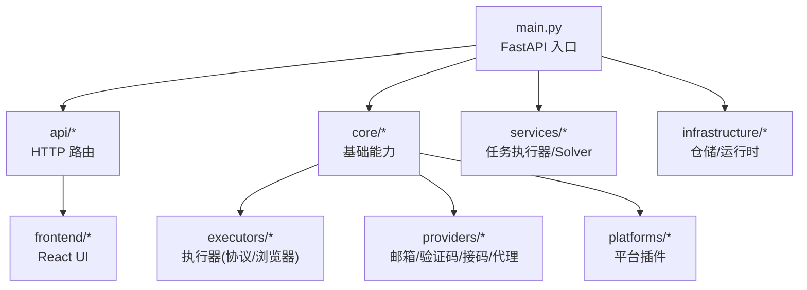
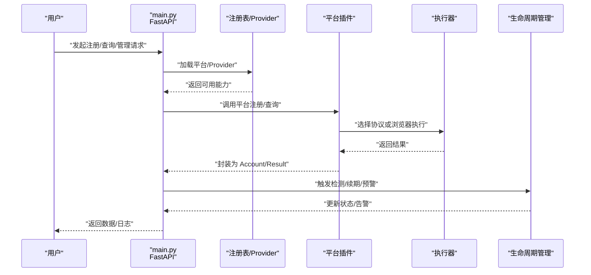
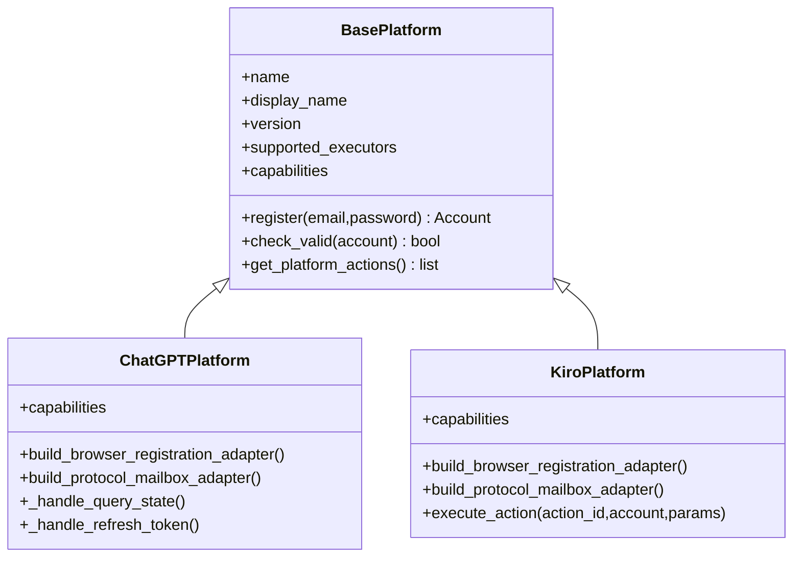
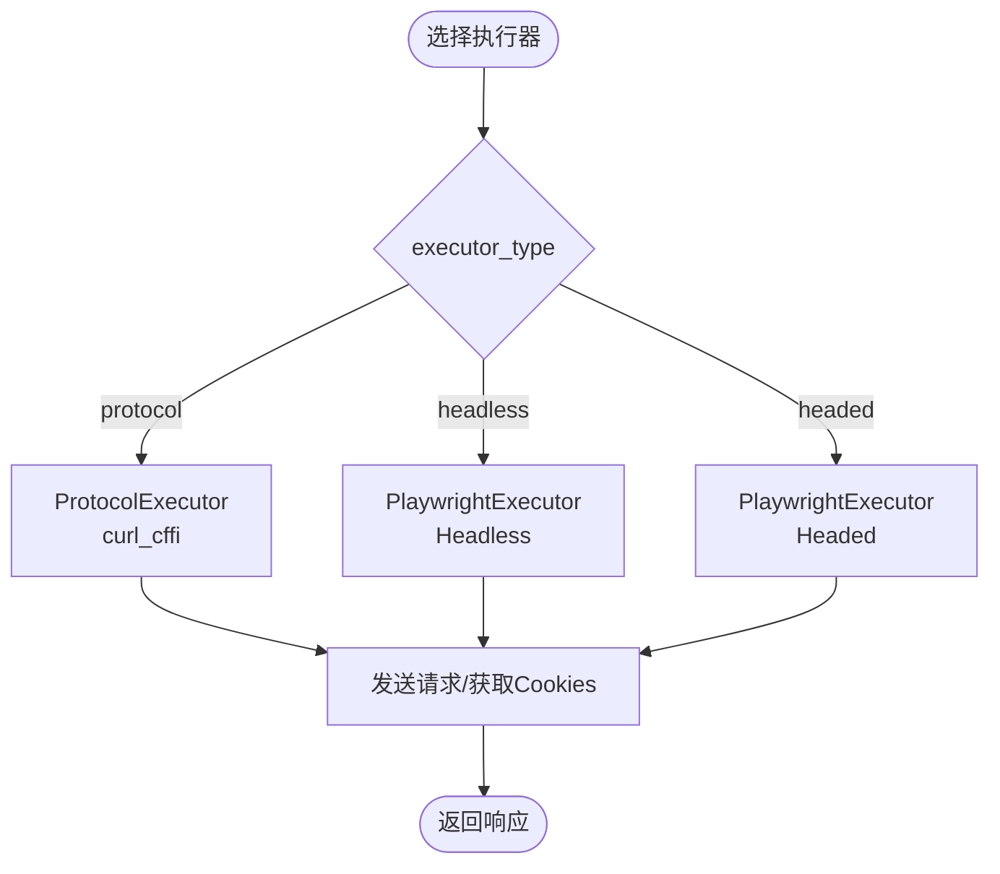
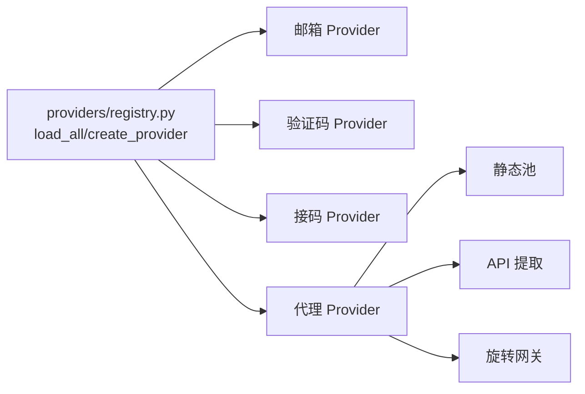
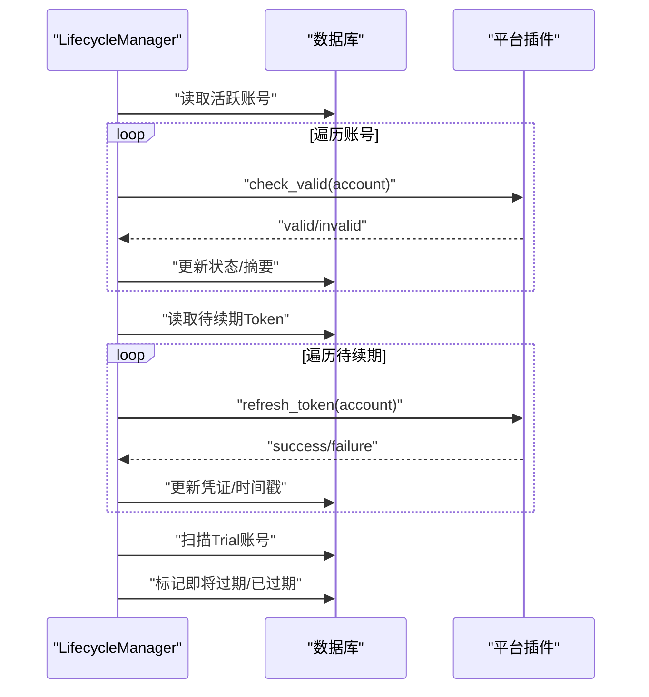
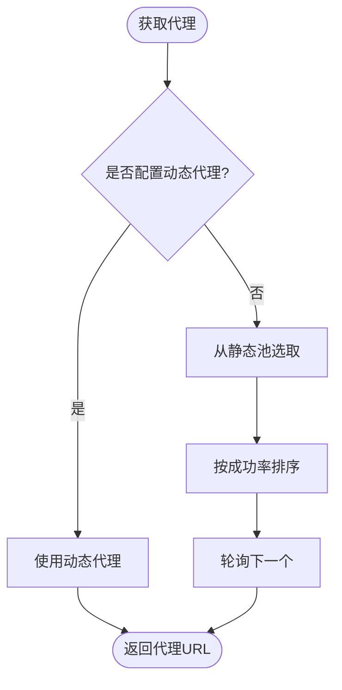
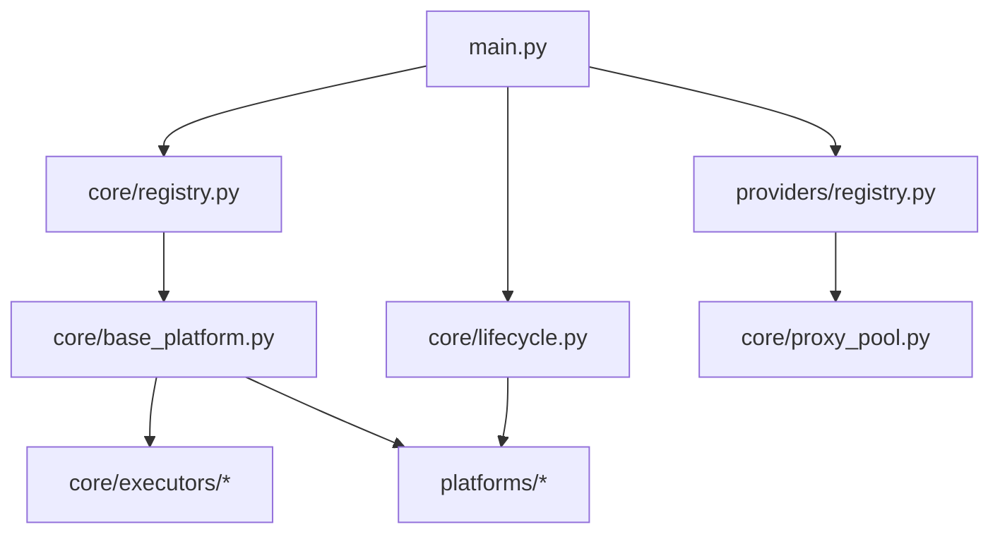

# 项目介绍

<cite>
**本文引用的文件**
- [README.md](file://README.md)
- [main.py](file://main.py)
- [core/base_platform.py](file://core/base_platform.py)
- [core/lifecycle.py](file://core/lifecycle.py)
- [core/registry.py](file://core/registry.py)
- [core/executors/protocol.py](file://core/executors/protocol.py)
- [core/executors/playwright.py](file://core/executors/playwright.py)
- [providers/registry.py](file://providers/registry.py)
- [platforms/chatgpt/plugin.py](file://platforms/chatgpt/plugin.py)
- [platforms/kiro/plugin.py](file://platforms/kiro/plugin.py)
- [providers/proxy/rotating_gateway.py](file://providers/proxy/rotating_gateway.py)
- [application/proxies.py](file://application/proxies.py)
- [core/proxy_pool.py](file://core/proxy_pool.py)
- [api/lifecycle.py](file://api/lifecycle.py)
</cite>

## 目录
1. [引言](#引言)
2. [项目结构](#项目结构)
3. [核心组件](#核心组件)
4. [架构总览](#架构总览)
5. [详细组件分析](#详细组件分析)
6. [依赖关系分析](#依赖关系分析)
7. [性能与可扩展性](#性能与可扩展性)
8. [故障排查指南](#故障排查指南)
9. [结论](#结论)

## 引言
Any Auto Register 是一个面向多平台 AI 账户的自动化注册与全生命周期管理系统。与传统“只解决单一平台注册”的工具不同，本项目提供工程化的一体化方案：统一邮箱管理、验证码处理、代理轮换、账户生命周期管理（有效性检测、Token 自动续期、试用到期预警）、任务队列与实时日志、成功率统计与错误归因、以及对接 Any2API 网关实现“注册即用”。

核心价值主张
- 覆盖 11+ 主流 AI 平台，支持 Anything 通用适配器，新平台以插件方式接入
- 双模式执行：纯协议（最快）与浏览器（Headless/Headed），按平台能力动态选择
- 全生命周期管理：定时检测 + Token 续期 + Trial 预警 + 风险中心告警
- 插件化架构：平台、邮箱、验证码、接码、代理驱动均可热插拔扩展
- 桌面端一键启动：Electron 内置后端与前端，开箱即用；同时支持 Docker 部署

目标用户
- 开发者：快速集成多平台账号能力，统一 API 接入
- 自动化测试人员：批量创建账号进行端到端测试
- 批量账户管理者：规模化注册、运维、监控与导出

竞争优势
- 相比同类工具仅覆盖 1-3 个平台，本项目支持 11+ 平台并具备通用适配器
- 相比仅浏览器模式，提供协议/Headless/Headed 三种执行器
- 相比无生命周期管理，内置定时检测、Token 续期、Trial 预警
- 相比硬编码架构，采用全插件化设计，易于扩展与维护

愿景与设计原则
- 愿景：让多平台 AI 账号的注册、使用与运维变得简单可靠
- 设计原则：插件化、可观测（SSE 日志/统计）、可配置（Provider Catalog）、可演进（能力声明式）

章节来源
- [README.md:39-110](file://README.md#L39-L110)

## 项目结构
系统采用分层与插件化组织：
- 入口与路由：FastAPI 应用、中间件、静态资源挂载
- 应用服务层：业务编排、仓储适配、运行时调度
- 领域模型：账号、任务、代理等核心实体
- 基础设施：数据库、配置存储、健康检查、运行时
- 核心能力：平台基类、执行器、邮箱/验证码/接码/代理 Provider
- 平台插件：各平台具体实现（ChatGPT、Kiro、Cursor 等）
- 前端：React + TypeScript + Vite，提供可视化界面
- Electron：桌面端打包与运行

图表来源
- [main.py:30-121](file://main.py#L30-L121)
- [core/base_platform.py:44-160](file://core/base_platform.py#L44-L160)
- [providers/registry.py:28-91](file://providers/registry.py#L28-L91)

章节来源
- [main.py:30-121](file://main.py#L30-L121)
- [README.md:276-323](file://README.md#L276-L323)

## 核心组件
- 平台基类与注册表：定义统一的注册流程、能力声明、执行器选择、身份提供者解析与验证码策略
- 执行器：协议执行器（curl_cffi）与浏览器执行器（Playwright），支持 Headless/Headed
- Provider 体系：邮箱、验证码、接码、代理的统一注册与工厂创建
- 生命周期管理：定时有效性检测、Token 自动续期、Trial 过期预警、CPA 同步
- 代理池：动态代理优先、静态池加权轮询、旋转网关
- API 与前端：RESTful 接口与 React 仪表盘，SSE 实时日志

章节来源
- [core/base_platform.py:44-160](file://core/base_platform.py#L44-L160)
- [core/executors/protocol.py:1-45](file://core/executors/protocol.py#L1-L45)
- [core/executors/playwright.py:1-134](file://core/executors/playwright.py#L1-L134)
- [providers/registry.py:1-91](file://providers/registry.py#L1-L91)
- [core/lifecycle.py:33-260](file://core/lifecycle.py#L33-L260)
- [core/proxy_pool.py:1-45](file://core/proxy_pool.py#L1-L45)

## 架构总览
系统以 FastAPI 为入口，启动时初始化数据库、加载平台插件与 Provider、启动调度器、任务执行器、Solver 与生命周期管理器。所有 HTTP 路由集中在 /api/*，前端通过 SPA 回退提供静态资源。

图表来源
- [main.py:67-91](file://main.py#L67-L91)
- [core/registry.py:25-38](file://core/registry.py#L25-L38)
- [core/base_platform.py:124-160](file://core/base_platform.py#L124-L160)
- [core/lifecycle.py:458-527](file://core/lifecycle.py#L458-L527)

章节来源
- [main.py:67-91](file://main.py#L67-L91)
- [core/registry.py:25-38](file://core/registry.py#L25-L38)

## 详细组件分析

### 平台插件与注册表
- 平台插件通过装饰器注册到全局注册表，启动时扫描 platforms/*/plugin.py 自动加载
- BasePlatform 定义统一注册流程、能力声明、执行器选择、身份提供者与验证码策略
- 每个平台实现 check_valid、构建浏览器/协议适配器、能力动作（如刷新 Token、生成支付链接、上传 CPA）

图表来源
- [core/base_platform.py:44-160](file://core/base_platform.py#L44-L160)
- [platforms/chatgpt/plugin.py:48-225](file://platforms/chatgpt/plugin.py#L48-L225)
- [platforms/kiro/plugin.py:27-130](file://platforms/kiro/plugin.py#L27-L130)
- [core/registry.py:19-38](file://core/registry.py#L19-L38)

章节来源
- [core/registry.py:25-38](file://core/registry.py#L25-L38)
- [platforms/chatgpt/plugin.py:48-225](file://platforms/chatgpt/plugin.py#L48-L225)
- [platforms/kiro/plugin.py:27-130](file://platforms/kiro/plugin.py#L27-L130)

### 执行器：协议与浏览器
- 协议执行器：基于 curl_cffi，模拟浏览器指纹，轻量高效
- 浏览器执行器：基于 Playwright，支持 Headless/Headed，适合复杂交互与 OAuth 流程

图表来源
- [core/base_platform.py:316-328](file://core/base_platform.py#L316-L328)
- [core/executors/protocol.py:1-45](file://core/executors/protocol.py#L1-L45)
- [core/executors/playwright.py:1-134](file://core/executors/playwright.py#L1-L134)

章节来源
- [core/executors/protocol.py:1-45](file://core/executors/protocol.py#L1-L45)
- [core/executors/playwright.py:1-134](file://core/executors/playwright.py#L1-L134)

### Provider 体系：邮箱/验证码/接码/代理
- 统一注册表：按类型（mailbox/captcha/sms/proxy）发现与创建 Provider
- 工厂方法：根据配置动态实例化，支持本地 Solver 与远程服务
- 代理 Provider：静态池、API 提取、旋转网关（固定入口、出口 IP 轮换）

图表来源
- [providers/registry.py:28-91](file://providers/registry.py#L28-L91)
- [providers/proxy/rotating_gateway.py:10-30](file://providers/proxy/rotating_gateway.py#L10-L30)
- [core/proxy_pool.py:14-45](file://core/proxy_pool.py#L14-L45)

章节来源
- [providers/registry.py:1-91](file://providers/registry.py#L1-L91)
- [providers/proxy/rotating_gateway.py:10-30](file://providers/proxy/rotating_gateway.py#L10-L30)
- [core/proxy_pool.py:1-45](file://core/proxy_pool.py#L1-L45)

### 生命周期管理：检测/续期/预警
- 有效性检测：遍历活跃账号，调用平台 check_valid，更新状态与摘要
- Token 自动续期：针对支持的平台（当前 ChatGPT）刷新即将过期的 Token
- Trial 过期预警：扫描试用账号，标记即将过期与已过期
- 后台循环：在独立线程中周期性执行上述任务

图表来源
- [core/lifecycle.py:33-260](file://core/lifecycle.py#L33-L260)
- [core/lifecycle.py:458-527](file://core/lifecycle.py#L458-L527)
- [api/lifecycle.py:30-60](file://api/lifecycle.py#L30-L60)

章节来源
- [core/lifecycle.py:33-260](file://core/lifecycle.py#L33-L260)
- [api/lifecycle.py:30-60](file://api/lifecycle.py#L30-L60)

### 代理池与轮换策略
- 动态代理优先：若配置了动态代理 Provider，则优先使用
- 静态池加权轮询：按成功率排序，失败计数影响权重
- 旋转网关：固定入口地址，每次请求自动分配出口 IP

图表来源
- [core/proxy_pool.py:14-45](file://core/proxy_pool.py#L14-L45)
- [providers/proxy/rotating_gateway.py:10-30](file://providers/proxy/rotating_gateway.py#L10-L30)
- [application/proxies.py:34-36](file://application/proxies.py#L34-L36)

章节来源
- [core/proxy_pool.py:1-45](file://core/proxy_pool.py#L1-L45)
- [application/proxies.py:10-48](file://application/proxies.py#L10-L48)

## 依赖关系分析
- main.py 作为 FastAPI 入口，集中注册路由、中间件与静态资源
- core/registry.py 负责平台插件的动态加载与能力查询
- providers/registry.py 负责各类 Provider 的发现与实例化
- lifecycle.py 提供后台任务调度，依赖平台插件的能力
- executors/* 提供底层网络与浏览器操作抽象
- platforms/* 实现具体平台的注册、校验与动作

图表来源
- [main.py:43-121](file://main.py#L43-L121)
- [core/registry.py:25-38](file://core/registry.py#L25-L38)
- [providers/registry.py:70-91](file://providers/registry.py#L70-L91)
- [core/lifecycle.py:458-527](file://core/lifecycle.py#L458-L527)

章节来源
- [main.py:43-121](file://main.py#L43-L121)
- [core/registry.py:25-38](file://core/registry.py#L25-L38)
- [providers/registry.py:70-91](file://providers/registry.py#L70-L91)

## 性能与可扩展性
- 执行器选择：协议模式更快、资源占用更低；浏览器模式适合复杂交互
- 并发与限流：可通过任务队列与并发数控制注册速率，避免被风控
- 代理优化：动态代理优先，静态池按成功率加权，降低失败率
- 插件化扩展：新增平台只需实现 plugin.py 与必要适配器，无需修改核心逻辑
- 可观测性：SSE 实时日志、统计接口、风险中心告警，便于定位问题

[本节为通用指导，不直接分析具体文件]

## 故障排查指南
- 验证码失败
  - 确认验证码 Provider 已正确配置（YesCaptcha Client Key 或本地 Solver）
  - 协议模式优先使用远程验证码服务；浏览器模式下 Camoufox 会尝试点击 Turnstile checkbox，失败回退到远程 Solver
  - 持续失败检查代理 IP 质量——高风险 IP 会触发更严格的验证
- 代理被封/注册失败率高
  - 查看各代理成功率，禁用低成功率代理
  - 使用住宅代理而非数据中心代理，通过率更高
  - 降低并发数，避免同一 IP 短时间内大量请求
- Solver 启动超时
  - 首次启动需要下载或初始化 Camoufox，检查 8889 端口是否被占用
  - 如不依赖本地 Solver，配置 YesCaptcha 或 2Captcha，注册任务中选择远程验证码
- ARM 镜像构建失败
  - 实际失败点常为前端 TypeScript 构建，先本地执行 npm run build 确认通过后再构建镜像

章节来源
- [README.md:388-436](file://README.md#L388-L436)

## 结论
Any Auto Register 通过插件化架构、双模式执行、全生命周期管理与完善的 Provider 体系，解决了传统工具“单平台、缺工程化”的痛点。它适用于开发者、自动化测试人员与批量账户管理者，提供 11+ 平台支持、桌面端一键启动、Docker 部署与丰富的运营能力。未来将继续扩展平台覆盖、增强稳定性与可观测性，助力多平台 AI 账号的高效注册与运维。

[本节为总结性内容，不直接分析具体文件]