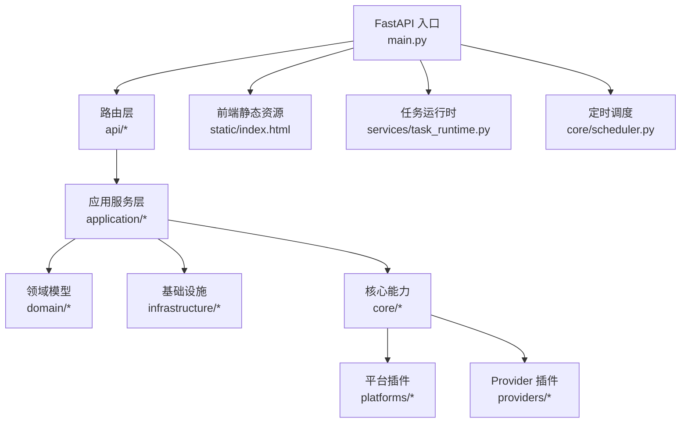
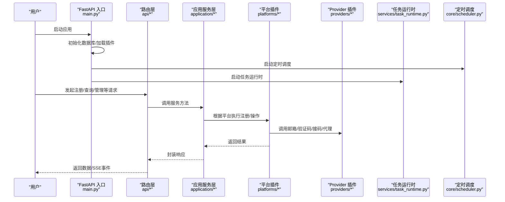
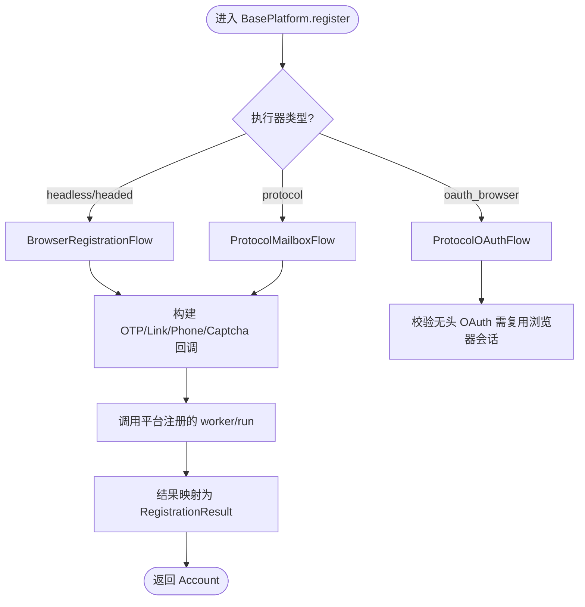
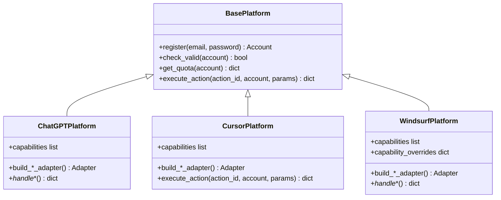
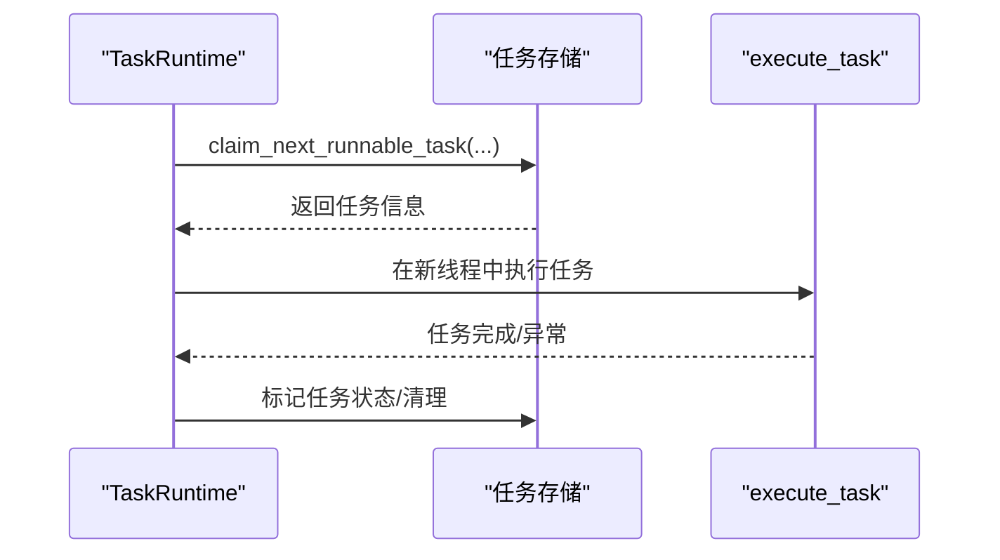
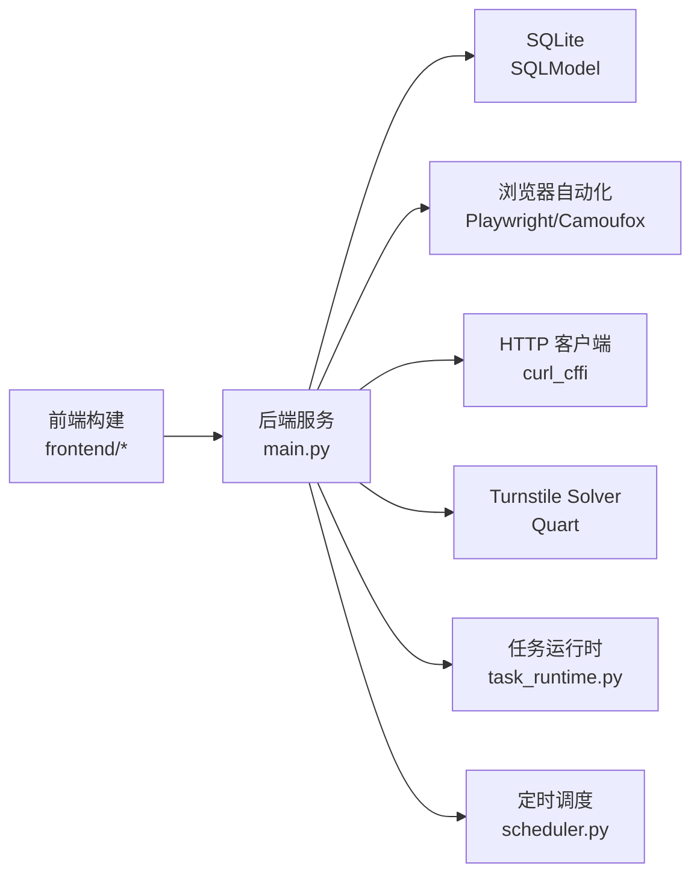

# 项目概述

<cite>
**本文引用的文件**
- [README.md](file://README.md)
- [main.py](file://main.py)
- [requirements.txt](file://requirements.txt)
- [Dockerfile](file://Dockerfile)
- [docker-compose.yml](file://docker-compose.yml)
- [core/base_platform.py](file://core/base_platform.py)
- [core/registry.py](file://core/registry.py)
- [platforms/chatgpt/plugin.py](file://platforms/chatgpt/plugin.py)
- [platforms/cursor/plugin.py](file://platforms/cursor/plugin.py)
- [platforms/windsurf/plugin.py](file://platforms/windsurf/plugin.py)
- [core/scheduler.py](file://core/scheduler.py)
- [services/task_runtime.py](file://services/task_runtime.py)
- [core/registration/flows.py](file://core/registration/flows.py)
- [providers/registry.py](file://providers/registry.py)
- [api/tasks.py](file://api/tasks.py)
</cite>

## 目录
1. [简介](#简介)
2. [项目结构](#项目结构)
3. [核心组件](#核心组件)
4. [架构总览](#架构总览)
5. [详细组件分析](#详细组件分析)
6. [依赖关系分析](#依赖关系分析)
7. [性能与扩展性](#性能与扩展性)
8. [故障排查指南](#故障排查指南)
9. [结论](#结论)
10. [附录：快速开始](#附录快速开始)

## 简介
Any Auto Register 是一个面向多平台 AI 服务的账户自动化注册与生命周期管理系统。它通过“协议 + 浏览器”双模式、插件化的邮箱/验证码/接码/代理体系，实现对 ChatGPT、Cursor、Windsurf 等十余个平台的批量注册、状态检测、Token 续期、Trial 预警与统一导出，并支持与 Any2API 网关联动，实现“注册即用”。

核心价值
- 全链路工程化：从注册到使用的全生命周期管理，减少重复劳动与人工维护成本。
- 多执行模式：协议（最快）、Headless、Headed 三种执行器按需切换，兼顾效率与兼容性。
- 高可插拔：平台、邮箱、验证码、接码、代理驱动均可热插拔扩展。
- 可视化与可观测：SSE 实时日志、成功率统计、错误归因、风险中心告警。
- 桌面端一键启动：Electron 打包，Mac/Windows 双击即用；同时提供 Docker 部署方案。

目标用户
- 需要批量管理多个 AI 平台账号的个人开发者、研究团队与小型组织。
- 需要将注册结果对接到 API 网关或内部系统的集成工程师。
- 希望降低验证码、代理、邮箱等基础设施复杂度的自动化运维人员。

竞争优势
- 覆盖平台广且可扩展：内置 11+ 平台与 Anything 通用适配器，新增平台以插件形式接入。
- 能力完备：邮箱、验证码、接码、代理池、任务调度、生命周期管理、数据分析一体化。
- 部署灵活：桌面版、Docker、源码运行多种形态，满足不同环境需求。

## 项目结构
系统采用分层与插件化设计：
- 入口与路由层：FastAPI 应用与 /api/* 路由。
- 应用服务层：任务编排、查询与服务编排。
- 领域模型：账号、任务、代理等核心实体。
- 基础设施：仓储与运行时适配（数据库、配置、平台运行时）。
- 核心能力：平台基类、执行器、注册流程、调度器等。
- 平台插件：各平台的具体实现（ChatGPT、Cursor、Windsurf 等）。
- Provider 插件：邮箱、验证码、接码、代理等第三方能力。
- 前端与桌面端：React 前端 + Electron 打包。

图表来源
- [main.py:67-121](file://main.py#L67-L121)
- [api/tasks.py:1-30](file://api/tasks.py#L1-L30)
- [core/scheduler.py:19-115](file://core/scheduler.py#L19-L115)
- [services/task_runtime.py:18-102](file://services/task_runtime.py#L18-L102)

章节来源
- [README.md:276-323](file://README.md#L276-L323)
- [main.py:67-121](file://main.py#L67-L121)

## 核心组件
- 平台基类与注册流程：BasePlatform 定义统一的注册入口、执行器选择、验证码解决、身份提供者解析与结果映射；注册流程支持 BrowserRegistrationFlow、ProtocolMailboxFlow、ProtocolOAuthFlow。
- 平台插件：每个平台（如 ChatGPT、Cursor、Windsurf）继承 BasePlatform，声明支持的执行器、身份模式、能力集，并提供具体注册与操作实现。
- Provider 体系：邮箱、验证码、接码、代理通过 providers/registry 统一注册与工厂创建，支持动态加载与配置注入。
- 任务运行时：TaskRuntime 负责并发调度、平台并行限制、任务抢占与清理。
- 定时调度：Scheduler 周期性检查 Trial 到期与账号有效性，更新状态并记录概览信息。
- 注册表：core/registry 自动扫描 platforms/*/plugin.py 完成平台插件加载与能力持久化。

章节来源
- [core/base_platform.py:44-160](file://core/base_platform.py#L44-L160)
- [core/registration/flows.py:18-142](file://core/registration/flows.py#L18-L142)
- [core/registry.py:25-124](file://core/registry.py#L25-L124)
- [providers/registry.py:28-91](file://providers/registry.py#L28-L91)
- [services/task_runtime.py:18-102](file://services/task_runtime.py#L18-L102)
- [core/scheduler.py:19-115](file://core/scheduler.py#L19-L115)

## 架构总览
系统由 FastAPI 后端承载，启动时初始化数据库、加载平台与 Provider 插件、启动任务运行时与定时调度器，并通过中间件提供认证与 CORS。前端通过 SPA 静态资源挂载访问。

图表来源
- [main.py:67-121](file://main.py#L67-L121)
- [api/tasks.py:1-30](file://api/tasks.py#L1-L30)
- [core/scheduler.py:19-115](file://core/scheduler.py#L19-L115)
- [services/task_runtime.py:18-102](file://services/task_runtime.py#L18-L102)

## 详细组件分析

### 平台基类与注册流程
- BasePlatform 提供统一的 register 入口，依据 executor_type 选择执行器（protocol/headless/headed），并按 identity_provider 决定走 OAuth 或邮箱注册流程。
- 注册流程通过适配器（Browser/Protocol Mailbox/OAuth）与流式编排（flows）组合，支持 OTP 回调、链接回调、手机回调与验证码解决。
- 验证码解决具备回退机制，按配置的 provider 顺序尝试，失败则记录错误并继续下一个候选。

图表来源
- [core/base_platform.py:124-160](file://core/base_platform.py#L124-L160)
- [core/registration/flows.py:18-142](file://core/registration/flows.py#L18-L142)

章节来源
- [core/base_platform.py:44-160](file://core/base_platform.py#L44-L160)
- [core/registration/flows.py:18-142](file://core/registration/flows.py#L18-L142)

### 平台插件示例：ChatGPT、Cursor、Windsurf
- ChatGPT：支持 protocol/headless/headed，支持 Google/Microsoft OAuth，提供查询状态、刷新 Token、生成支付链接、上传 CPA/TM、切换桌面应用等操作。
- Cursor：支持 mailbox 与浏览器模式，提供查询状态、生成试用链接、切换桌面应用等操作。
- Windsurf：支持 mailbox 与浏览器模式，提供查询状态、检查 Pro Trial 资格、生成 Stripe 试用链接（自动打码/浏览器辅助）、切换桌面应用等操作。

图表来源
- [core/base_platform.py:44-160](file://core/base_platform.py#L44-L160)
- [platforms/chatgpt/plugin.py:48-225](file://platforms/chatgpt/plugin.py#L48-L225)
- [platforms/cursor/plugin.py:18-114](file://platforms/cursor/plugin.py#L18-L114)
- [platforms/windsurf/plugin.py:35-150](file://platforms/windsurf/plugin.py#L35-L150)

章节来源
- [platforms/chatgpt/plugin.py:48-225](file://platforms/chatgpt/plugin.py#L48-L225)
- [platforms/cursor/plugin.py:18-114](file://platforms/cursor/plugin.py#L18-L114)
- [platforms/windsurf/plugin.py:35-150](file://platforms/windsurf/plugin.py#L35-L150)

### 任务运行时与调度
- TaskRuntime：维护最大并发与每平台并行限制，轮询可执行任务，分配线程执行 execute_task，完成后回收工作线程。
- Scheduler：每小时检查 Trial 到期并更新状态；支持批量账号有效性检测，记录检查时间与概览信息。

图表来源
- [services/task_runtime.py:47-99](file://services/task_runtime.py#L47-L99)
- [core/scheduler.py:44-111](file://core/scheduler.py#L44-L111)

章节来源
- [services/task_runtime.py:18-102](file://services/task_runtime.py#L18-L102)
- [core/scheduler.py:19-115](file://core/scheduler.py#L19-L115)

### Provider 体系与注册表
- providers/registry 统一管理邮箱、验证码、接码、代理四类 Provider，支持装饰器注册与 from_config 工厂创建。
- core/registry 自动扫描 platforms/*/plugin.py 完成平台插件加载，并将能力元数据持久化到数据库，供运行时查询。

章节来源
- [providers/registry.py:28-91](file://providers/registry.py#L28-L91)
- [core/registry.py:25-124](file://core/registry.py#L25-L124)

## 依赖关系分析
- 技术栈：FastAPI + SQLite (SQLModel)、Playwright/Camoufox、curl_cffi、Quart（Solver）、PyInstaller（桌面打包）。
- 运行时依赖：Node.js 构建前端产物，Python 安装依赖后启动 uvicorn 服务。
- 容器化：Dockerfile 预装 Chromium、Xvfb、noVNC、Camoufox，暴露 8000/6080/8889 端口。

图表来源
- [requirements.txt:1-20](file://requirements.txt#L1-L20)
- [Dockerfile:1-61](file://Dockerfile#L1-L61)
- [main.py:67-121](file://main.py#L67-L121)

章节来源
- [requirements.txt:1-20](file://requirements.txt#L1-L20)
- [Dockerfile:1-61](file://Dockerfile#L1-L61)
- [docker-compose.yml:1-18](file://docker-compose.yml#L1-L18)

## 性能与扩展性
- 并发控制：TaskRuntime 支持全局与单平台并发上限，避免资源争用与风控触发。
- 执行器选择：协议模式无浏览器开销，适合高吞吐；Headless/Headed 用于兼容复杂交互场景。
- 验证码回退：按优先级尝试远程/本地 Solver，提高成功率并降低单点失败影响。
- 可扩展性：平台与 Provider 均通过插件机制扩展，新增平台只需实现 plugin.py 与对应注册/操作逻辑。

[本节为通用指导，不直接分析具体文件]

## 故障排查指南
常见问题与建议
- 验证码失败：确认已配置 YesCaptcha/2Captcha 或本地 Solver；浏览器模式下 Camoufox 会先尝试点击 Turnstile，失败再回退远程 Solver；检查代理 IP 质量。
- 代理被封/注册失败率高：查看代理成功率，禁用低成功率代理；优先使用住宅代理；降低并发；按平台分配代理池。
- Solver 启动超时：首次启动需下载/初始化 Camoufox；检查 8889 端口占用；或使用远程验证码服务替代本地 Solver。
- ARM 镜像构建失败：若出现前端 TypeScript 构建错误，请先在本地执行前端构建，再重新构建镜像。

章节来源
- [README.md:388-436](file://README.md#L388-L436)

## 结论
Any Auto Register 将多平台 AI 账户的注册、验证、管理与使用打通为一条完整流水线，通过插件化与多执行模式满足多样化场景，结合可视化与统计分析提升运维效率。对于初学者，桌面版与 Docker 提供了零门槛上手路径；对于有经验的开发者，源码与插件体系便于二次开发与深度定制。

[本节为总结性内容，不直接分析具体文件]

## 附录：快速开始
- 桌面版（推荐）：下载并启动 Electron 客户端，输入激活码，选择平台与邮箱，即可开始注册。
- Docker：使用 docker-compose 启动，暴露 Web UI、noVNC 与 Solver 端口，设置环境变量与数据卷。
- 源码运行：安装 Python 与 Node.js 依赖，构建前端，安装 Playwright/Camoufox，启动 uvicorn 服务。

章节来源
- [README.md:112-179](file://README.md#L112-L179)
- [docker-compose.yml:1-18](file://docker-compose.yml#L1-L18)
- [Dockerfile:1-61](file://Dockerfile#L1-L61)